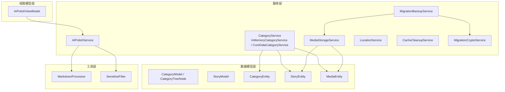
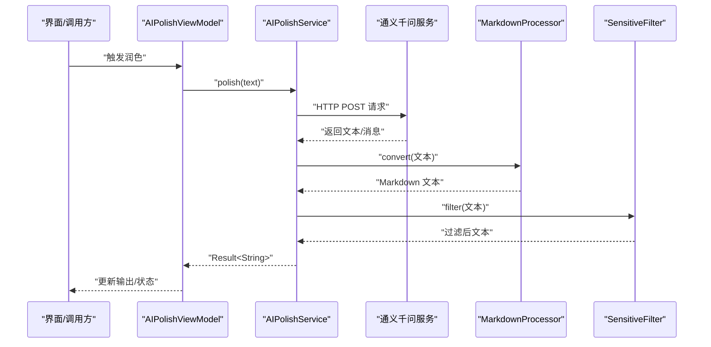
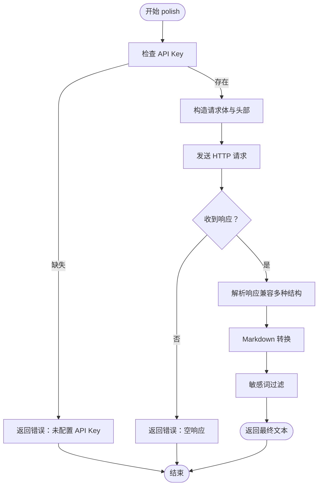
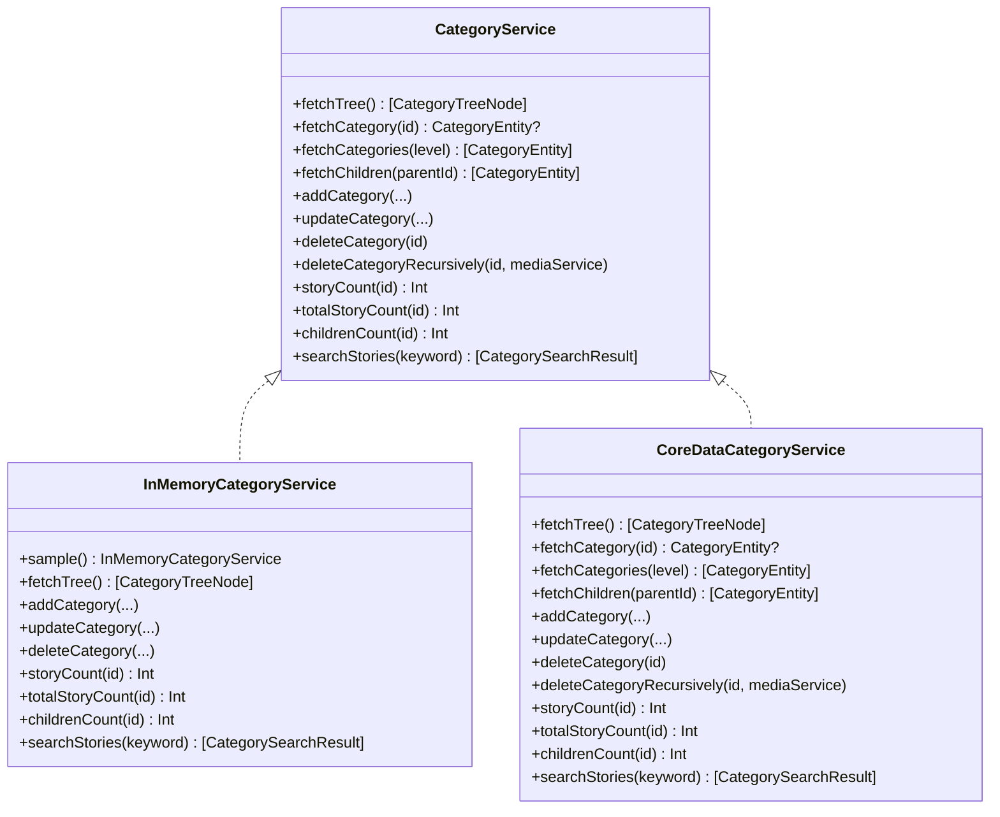
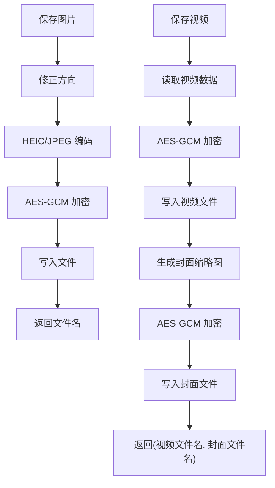
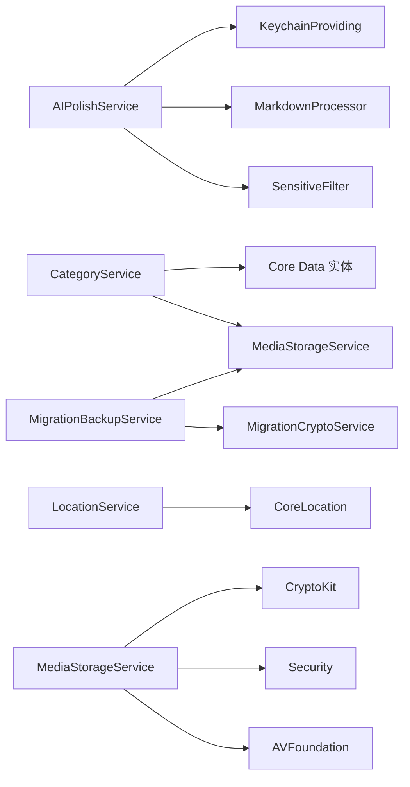

# API 参考文档

<cite>
**本文档引用的文件**
- [AIPolishService.swift](file://MyStory/Services/AIService/AIPolishService.swift)
- [CategoryService.swift](file://MyStory/Services/CategoryService/CategoryService.swift)
- [MediaStorageService.swift](file://MyStory/Services/MediaStorageService.swift)
- [LocationService.swift](file://MyStory/Services/LocationService.swift)
- [CacheCleanupService.swift](file://MyStory/Services/CacheCleanupService.swift)
- [MigrationBackupService.swift](file://MyStory/Services/MigrationBackupService.swift)
- [MigrationCryptoService.swift](file://MyStory/Services/MigrationCryptoService.swift)
- [MarkdownProcessor.swift](file://MyStory/Utils/MarkdownProcessor.swift)
- [SensitiveFilter.swift](file://MyStory/Utils/SensitiveFilter.swift)
- [CategoryModel.swift](file://MyStory/Models/Category/CategoryModel.swift)
- [StoryModel.swift](file://MyStory/Models/ViewModels/StoryModel.swift)
- [CategoryEntity+CoreDataClass.swift](file://MyStory/Models/Entities/CategoryEntity+CoreDataClass.swift)
- [StoryEntity+CoreDataClass.swift](file://MyStory/Models/Entities/StoryEntity+CoreDataClass.swift)
- [MediaEntity+CoreDataClass.swift](file://MyStory/Models/Entities/MediaEntity+CoreDataClass.swift)
- [AIPolishViewModel.swift](file://MyStory/ViewModels/Editor/AIPolishViewModel.swift)
</cite>

## 目录
1. [简介](#简介)
2. [项目结构](#项目结构)
3. [核心组件](#核心组件)
4. [架构概览](#架构概览)
5. [详细组件分析](#详细组件分析)
6. [依赖分析](#依赖分析)
7. [性能考虑](#性能考虑)
8. [故障排除指南](#故障排除指南)
9. [结论](#结论)
10. [附录](#附录)

## 简介
本文件为 MyStory 应用的完整 API 参考文档，覆盖服务层 API、数据模型 API 与工具函数 API。内容包括：
- 公共接口定义、参数说明与返回值格式
- 使用示例、错误处理与异常情况说明
- API 版本管理、向后兼容性与废弃 API 迁移指南
- 认证机制、速率限制与使用约束
- API 测试方法、集成示例与最佳实践建议

## 项目结构
MyStory 采用模块化设计，主要分为以下层次：
- 服务层：负责业务逻辑与外部交互（AI 润色、分类管理、媒体存储、位置服务、缓存清理、迁移备份等）
- 数据模型层：定义业务模型与 Core Data 实体
- 视图模型层：封装 UI 交互状态与业务流程（如 AI 润色视图模型）
- 工具层：提供 Markdown 转换、敏感词过滤等辅助能力

图表来源
- [AIPolishService.swift](file://MyStory/Services/AIService/AIPolishService.swift#L1-L77)
- [CategoryService.swift](file://MyStory/Services/CategoryService/CategoryService.swift#L1-L675)
- [MediaStorageService.swift](file://MyStory/Services/MediaStorageService.swift#L1-L348)
- [LocationService.swift](file://MyStory/Services/LocationService.swift#L1-L55)
- [CacheCleanupService.swift](file://MyStory/Services/CacheCleanupService.swift#L1-L263)
- [MigrationBackupService.swift](file://MyStory/Services/MigrationBackupService.swift#L1-L414)
- [MigrationCryptoService.swift](file://MyStory/Services/MigrationCryptoService.swift#L1-L67)
- [CategoryModel.swift](file://MyStory/Models/Category/CategoryModel.swift#L1-L23)
- [StoryModel.swift](file://MyStory/Models/ViewModels/StoryModel.swift#L1-L29)
- [CategoryEntity+CoreDataClass.swift](file://MyStory/Models/Entities/CategoryEntity+CoreDataClass.swift#L1-L18)
- [StoryEntity+CoreDataClass.swift](file://MyStory/Models/Entities/StoryEntity+CoreDataClass.swift#L1-L51)
- [MediaEntity+CoreDataClass.swift](file://MyStory/Models/Entities/MediaEntity+CoreDataClass.swift#L1-L15)
- [AIPolishViewModel.swift](file://MyStory/ViewModels/Editor/AIPolishViewModel.swift#L1-L46)

章节来源
- [AIPolishService.swift](file://MyStory/Services/AIService/AIPolishService.swift#L1-L77)
- [CategoryService.swift](file://MyStory/Services/CategoryService/CategoryService.swift#L1-L675)
- [MediaStorageService.swift](file://MyStory/Services/MediaStorageService.swift#L1-L348)
- [LocationService.swift](file://MyStory/Services/LocationService.swift#L1-L55)
- [CacheCleanupService.swift](file://MyStory/Services/CacheCleanupService.swift#L1-L263)
- [MigrationBackupService.swift](file://MyStory/Services/MigrationBackupService.swift#L1-L414)
- [MigrationCryptoService.swift](file://MyStory/Services/MigrationCryptoService.swift#L1-L67)
- [CategoryModel.swift](file://MyStory/Models/Category/CategoryModel.swift#L1-L23)
- [StoryModel.swift](file://MyStory/Models/ViewModels/StoryModel.swift#L1-L29)
- [CategoryEntity+CoreDataClass.swift](file://MyStory/Models/Entities/CategoryEntity+CoreDataClass.swift#L1-L18)
- [StoryEntity+CoreDataClass.swift](file://MyStory/Models/Entities/StoryEntity+CoreDataClass.swift#L1-L51)
- [MediaEntity+CoreDataClass.swift](file://MyStory/Models/Entities/MediaEntity+CoreDataClass.swift#L1-L15)
- [AIPolishViewModel.swift](file://MyStory/ViewModels/Editor/AIPolishViewModel.swift#L1-L46)

## 核心组件
本节概述 MyStory 的核心 API 组件与其职责。

- AIPolishService：调用通义千问文本生成服务，提供文本润色能力；支持请求限流与多格式响应解析。
- CategoryService：抽象分类服务接口，提供树形查询、增删改、统计与搜索；包含内存实现与 Core Data 实现。
- MediaStorageService：提供图片与视频的加密存储、缩略图生成、临时文件加载与解密。
- LocationService：提供当前位置授权与逆地理编码，输出标准化位置信息。
- CacheCleanupService：清理应用缓存与临时文件，统计可释放空间。
- MigrationBackupService：导出 Core Data 与媒体元数据，生成加密备份容器。
- MigrationCryptoService：基于 AES-GCM 的加密封装，提供加密与解密能力。
- 工具函数：MarkdownProcessor（占位转换）、SensitiveFilter（敏感词过滤）。
- 数据模型：CategoryModel、CategoryTreeNode、StoryModel 及 Core Data 实体类型。

章节来源
- [AIPolishService.swift](file://MyStory/Services/AIService/AIPolishService.swift#L1-L77)
- [CategoryService.swift](file://MyStory/Services/CategoryService/CategoryService.swift#L1-L675)
- [MediaStorageService.swift](file://MyStory/Services/MediaStorageService.swift#L1-L348)
- [LocationService.swift](file://MyStory/Services/LocationService.swift#L1-L55)
- [CacheCleanupService.swift](file://MyStory/Services/CacheCleanupService.swift#L1-L263)
- [MigrationBackupService.swift](file://MyStory/Services/MigrationBackupService.swift#L1-L414)
- [MigrationCryptoService.swift](file://MyStory/Services/MigrationCryptoService.swift#L1-L67)
- [MarkdownProcessor.swift](file://MyStory/Utils/MarkdownProcessor.swift#L1-L9)
- [SensitiveFilter.swift](file://MyStory/Utils/SensitiveFilter.swift#L1-L18)
- [CategoryModel.swift](file://MyStory/Models/Category/CategoryModel.swift#L1-L23)
- [StoryModel.swift](file://MyStory/Models/ViewModels/StoryModel.swift#L1-L29)
- [CategoryEntity+CoreDataClass.swift](file://MyStory/Models/Entities/CategoryEntity+CoreDataClass.swift#L1-L18)
- [StoryEntity+CoreDataClass.swift](file://MyStory/Models/Entities/StoryEntity+CoreDataClass.swift#L1-L51)
- [MediaEntity+CoreDataClass.swift](file://MyStory/Models/Entities/MediaEntity+CoreDataClass.swift#L1-L15)

## 架构概览
MyStory 的 API 层通过服务类对外暴露统一接口，内部组合使用工具与数据模型。AI 润色流程中，视图模型协调服务层与工具层；分类与媒体服务通过 Core Data 实体持久化；迁移服务负责数据与媒体的加密备份与恢复。

图表来源
- [AIPolishViewModel.swift](file://MyStory/ViewModels/Editor/AIPolishViewModel.swift#L1-L46)
- [AIPolishService.swift](file://MyStory/Services/AIService/AIPolishService.swift#L1-L77)
- [MarkdownProcessor.swift](file://MyStory/Utils/MarkdownProcessor.swift#L1-L9)
- [SensitiveFilter.swift](file://MyStory/Utils/SensitiveFilter.swift#L1-L18)

## 详细组件分析

### AIPolishService（AI 润色服务）
- 功能概述
  - 调用第三方文本生成服务，对输入文本进行润色与优化。
  - 支持多种响应结构解析，失败时回退原文。
  - 集成 Markdown 转换与敏感词过滤。
  - 速率限制：每分钟最多 5 次请求。
- 主要接口
  - polish(text: String, completion: (Result<String, Error>) -> Void)
    - 参数：text（待润色文本）
    - 返回：Result<String, Error>（成功返回处理后的 Markdown 文本，失败返回错误）
    - 错误：未配置 API Key、网络错误、空响应、解析失败
- 认证与安全
  - 使用 Authorization: Bearer 方式传递 API Key
  - 超时时间：30 秒
- 速率限制
  - 每分钟最多 5 次请求；超过将返回提示信息
- 使用示例
  - 在视图模型中调用 polish()，监听输出与错误状态
- 最佳实践
  - 在调用前校验 API Key 是否可用
  - 对输入文本进行必要清洗，避免空字符串
  - 结合 UI 状态（isLoading、errorMessage）反馈给用户

图表来源
- [AIPolishService.swift](file://MyStory/Services/AIService/AIPolishService.swift#L1-L77)
- [AIPolishViewModel.swift](file://MyStory/ViewModels/Editor/AIPolishViewModel.swift#L1-L46)
- [MarkdownProcessor.swift](file://MyStory/Utils/MarkdownProcessor.swift#L1-L9)
- [SensitiveFilter.swift](file://MyStory/Utils/SensitiveFilter.swift#L1-L18)

章节来源
- [AIPolishService.swift](file://MyStory/Services/AIService/AIPolishService.swift#L1-L77)
- [AIPolishViewModel.swift](file://MyStory/ViewModels/Editor/AIPolishViewModel.swift#L1-L46)

### CategoryService（分类服务）
- 功能概述
  - 抽象接口：查询树形结构、按层级/父节点查询、增删改、统计与搜索
  - 实现：InMemoryCategoryService（内存实现，用于演示与测试）、CoreDataCategoryService（持久化实现）
- 主要接口（CategoryService 协议）
  - 查询
    - fetchTree() -> [CategoryTreeNode]
    - fetchCategory(id: UUID) -> CategoryEntity?
    - fetchCategories(level: Int) -> [CategoryEntity]
    - fetchChildren(parentId: UUID) -> [CategoryEntity]
  - 增删改
    - addCategory(name, level, parentId, iconName, colorHex, customIconData, isCustomIcon)
    - updateCategory(id, name, iconName, colorHex, customIconData, isCustomIcon)
    - deleteCategory(id)
    - deleteCategoryRecursively(id, mediaService)
  - 统计
    - storyCount(for id: UUID) -> Int
    - totalStoryCount(for id: UUID) -> Int
    - childrenCount(for id: UUID) -> Int
  - 搜索
    - searchStories(keyword: String) -> [CategorySearchResult]
- 错误类型（CategoryError）
  - levelOutOfRange、overLimit、hasStories、notFound、invalidParentLevel
- 使用示例
  - 通过注入 CoreDataCategoryService 或 InMemoryCategoryService 实例，调用对应方法
- 最佳实践
  - 在删除前检查子分类与故事数量
  - 递归删除时注意媒体文件清理
  - 查询时合理使用关系预加载，避免 Fault 导致的计数错误

图表来源
- [CategoryService.swift](file://MyStory/Services/CategoryService/CategoryService.swift#L1-L675)

章节来源
- [CategoryService.swift](file://MyStory/Services/CategoryService/CategoryService.swift#L1-L675)

### MediaStorageService（媒体存储服务）
- 功能概述
  - 图片：保存原图与缩略图，自动修正方向，HEIC/JPEG 编码，AES-GCM 加密
  - 视频：保存视频与封面缩略图，生成临时 URL 供播放
  - 目录组织：按年/月分层存放，支持缩略图与原图分离
- 主要接口
  - saveImage(image: UIImage) throws -> String（文件名）
  - saveImageWithThumbnail(image: UIImage) throws -> (fileName, thumbFileName)
  - url(for fileName, type) -> URL?
  - loadImage(fileName) -> UIImage?
  - loadVideoThumbnail(fileName) -> UIImage?
  - saveVideo(from sourceURL) throws -> (fileName, thumbFileName)
  - loadVideoURL(fileName) -> URL?
- 安全与加密
  - 使用 HKDF 派生密钥，AES-GCM 加密封装
  - MasterKey 存储于 Keychain，按文件 ID 派生子密钥
- 使用示例
  - 保存图片并获取文件名，后续通过 url 加载或删除
  - 保存视频并生成封面，播放时使用 loadVideoURL 生成临时文件
- 最佳实践
  - 保存前修正图片方向，避免显示异常
  - 视频封面生成使用快速模式，平衡质量与时效
  - 删除媒体时同时清理缩略图

图表来源
- [MediaStorageService.swift](file://MyStory/Services/MediaStorageService.swift#L1-L348)

章节来源
- [MediaStorageService.swift](file://MyStory/Services/MediaStorageService.swift#L1-L348)

### LocationService（位置服务）
- 功能概述
  - 请求当前定位，处理授权状态，逆地理编码获取地址信息
- 主要接口
  - requestCurrentLocation(completion: (LocationInfo?) -> Void)
- 输出模型
  - LocationInfo：经纬度、精度、地名、地址、城市、国家
- 使用示例
  - 调用 requestCurrentLocation，处理回调中的位置信息
- 注意事项
  - 首次调用会触发授权弹窗
  - 地理编码可能失败，需处理空值

章节来源
- [LocationService.swift](file://MyStory/Services/LocationService.swift#L1-L55)

### CacheCleanupService（缓存清理服务）
- 功能概述
  - 清理 Documents、Temp、Caches 目录中的临时文件与压缩包
  - 统计可清理空间，返回清理结果
- 主要接口
  - cleanupCache() -> CleanupResult
  - calculateCacheSize() -> Int64
- 清理策略
  - 识别以 temp 开头、包含 .tmp、cache 的文件
  - 排除 Media 目录、SQLite 文件、用户媒体文件
- 使用示例
  - 定期调用 cleanupCache，展示释放空间与错误列表
- 最佳实践
  - 在后台任务中执行，避免影响前台性能
  - 仅清理临时文件，避免误删用户数据

章节来源
- [CacheCleanupService.swift](file://MyStory/Services/CacheCleanupService.swift#L1-L263)

### MigrationBackupService（迁移备份服务）
- 功能概述
  - 导出 Core Data 实体与媒体元数据，扫描媒体文件，生成容器文件
  - 包含应用版本、Schema 版本、实体统计、媒体统计与损坏检测
- 主要接口
  - createEncryptedBackup(password, progressHandler) throws -> URL
- 数据结构
  - BackupPayload：包含实体统计、媒体统计、MasterKey、实体 DTO、媒体文件描述
- 使用示例
  - 传入用户迁移密码，监听进度回调，获取加密备份文件路径
- 最佳实践
  - 备份前确保数据库与媒体目录一致
  - 备份完成后删除中间容器文件

章节来源
- [MigrationBackupService.swift](file://MyStory/Services/MigrationBackupService.swift#L1-L414)

### MigrationCryptoService（迁移加密服务）
- 功能概述
  - 基于 AES-GCM 的加密封装，派生对称密钥（密码 + 备份 ID）
- 主要接口
  - encryptBackup(zipURL, password, backupId) throws -> URL
  - decryptBackup(encryptedURL, password, backupId) throws -> URL
- 使用示例
  - 加密：传入未加密备份文件与密码，生成 .enc 文件
  - 解密：传入 .enc 文件与密码，生成容器文件
- 最佳实践
  - 密码强度与备份 ID 必须一致，否则解密失败

章节来源
- [MigrationCryptoService.swift](file://MyStory/Services/MigrationCryptoService.swift#L1-L67)

### 工具函数 API
- MarkdownProcessor
  - convert(text: String) -> String（当前为占位实现，直接返回原文）
- SensitiveFilter
  - filter(text: String) -> String（替换敏感词为 ***）

章节来源
- [MarkdownProcessor.swift](file://MyStory/Utils/MarkdownProcessor.swift#L1-L9)
- [SensitiveFilter.swift](file://MyStory/Utils/SensitiveFilter.swift#L1-L18)

### 数据模型 API
- CategoryModel / CategoryTreeNode
  - 描述分类的基本属性与树形结构
- StoryModel
  - 描述故事的展示模型（标题、预览、时间、位置、媒体计数等）
- Core Data 实体
  - CategoryEntity、StoryEntity、MediaEntity（对象扩展提供模型转换与显示逻辑）

章节来源
- [CategoryModel.swift](file://MyStory/Models/Category/CategoryModel.swift#L1-L23)
- [StoryModel.swift](file://MyStory/Models/ViewModels/StoryModel.swift#L1-L29)
- [CategoryEntity+CoreDataClass.swift](file://MyStory/Models/Entities/CategoryEntity+CoreDataClass.swift#L1-L18)
- [StoryEntity+CoreDataClass.swift](file://MyStory/Models/Entities/StoryEntity+CoreDataClass.swift#L1-L51)
- [MediaEntity+CoreDataClass.swift](file://MyStory/Models/Entities/MediaEntity+CoreDataClass.swift#L1-L15)

## 依赖分析
- 服务间耦合
  - AIPolishService 依赖 Keychain 提供者与工具函数（MarkdownProcessor、SensitiveFilter）
  - CategoryService 依赖 Core Data 实体与 MediaStorageService（递归删除场景）
  - MigrationBackupService 依赖 MediaStorageService 与 MigrationCryptoService
- 外部依赖
  - URLSession（网络请求）
  - CryptoKit（加密）
  - Security（Keychain）
  - AVFoundation（视频处理）
  - CoreLocation（位置服务）
- 循环依赖
  - 未发现循环依赖；服务边界清晰

图表来源
- [AIPolishService.swift](file://MyStory/Services/AIService/AIPolishService.swift#L1-L77)
- [CategoryService.swift](file://MyStory/Services/CategoryService/CategoryService.swift#L1-L675)
- [MediaStorageService.swift](file://MyStory/Services/MediaStorageService.swift#L1-L348)
- [LocationService.swift](file://MyStory/Services/LocationService.swift#L1-L55)
- [MigrationBackupService.swift](file://MyStory/Services/MigrationBackupService.swift#L1-L414)
- [MigrationCryptoService.swift](file://MyStory/Services/MigrationCryptoService.swift#L1-L67)

章节来源
- [AIPolishService.swift](file://MyStory/Services/AIService/AIPolishService.swift#L1-L77)
- [CategoryService.swift](file://MyStory/Services/CategoryService/CategoryService.swift#L1-L675)
- [MediaStorageService.swift](file://MyStory/Services/MediaStorageService.swift#L1-L348)
- [LocationService.swift](file://MyStory/Services/LocationService.swift#L1-L55)
- [MigrationBackupService.swift](file://MyStory/Services/MigrationBackupService.swift#L1-L414)
- [MigrationCryptoService.swift](file://MyStory/Services/MigrationCryptoService.swift#L1-L67)

## 性能考虑
- 网络请求
  - AIPolishService 设置超时与增量输出，提升用户体验
  - 建议在弱网环境下增加重试与降级策略
- 数据库查询
  - CategoryService 对关系进行预加载，减少 Fault 导致的二次查询
  - 建议在大数据量场景下分页或延迟加载
- 媒体处理
  - 视频封面生成使用快速模式，控制分辨率与时间偏移
  - 图片保存前修正方向，避免重复渲染
- 缓存清理
  - 仅清理临时文件，避免误删用户数据
  - 建议在后台任务中执行，降低对前台的影响

## 故障排除指南
- AIPolishService
  - 未配置 API Key：检查 Keychain 提供者是否返回有效 Key
  - 空响应：确认网络连通与服务端可用性
  - 解析失败：服务端返回结构变化时，检查兼容解析逻辑
- CategoryService
  - notFound：确认 ID 有效性与上下文一致性
  - hasStories：删除前清空子分类与故事
  - invalidParentLevel：检查父分类层级与 level 的匹配
- MediaStorageService
  - 加密失败：检查 MasterKey 与 Keychain 权限
  - 无法编码图片/视频：确认编码参数与设备支持
- MigrationBackupService
  - 媒体文件缺失：检查媒体目录与相对路径映射
  - 解密失败：确认密码与备份 ID 一致
- CacheCleanupService
  - 清理无效：确认目标目录权限与文件状态

章节来源
- [AIPolishService.swift](file://MyStory/Services/AIService/AIPolishService.swift#L1-L77)
- [CategoryService.swift](file://MyStory/Services/CategoryService/CategoryService.swift#L1-L675)
- [MediaStorageService.swift](file://MyStory/Services/MediaStorageService.swift#L1-L348)
- [MigrationBackupService.swift](file://MyStory/Services/MigrationBackupService.swift#L1-L414)
- [MigrationCryptoService.swift](file://MyStory/Services/MigrationCryptoService.swift#L1-L67)
- [CacheCleanupService.swift](file://MyStory/Services/CacheCleanupService.swift#L1-L263)

## 结论
本 API 参考文档梳理了 MyStory 的服务层、数据模型与工具函数的公共接口，明确了参数、返回值、错误处理与使用约束。建议在集成过程中遵循速率限制、安全策略与最佳实践，确保稳定性与可维护性。

## 附录
- API 版本管理与兼容性
  - 迁移服务包含应用版本与 Schema 版本字段，便于未来升级与回滚
  - 建议在新增字段时保留默认值，避免破坏旧版本解析
- 废弃 API 迁移指南
  - 若出现接口变更，优先提供过渡期的兼容实现
  - 通过版本号区分行为差异，逐步引导客户端升级
- 认证机制
  - AIPolishService 使用 Bearer Token；MediaStorageService 使用 Keychain 存储 MasterKey
- 速率限制
  - AIPolishService：每分钟最多 5 次请求
- 使用约束
  - 仅清理临时文件，避免误删用户数据
  - 备份与恢复过程需严格保护密码与密钥