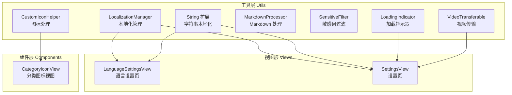
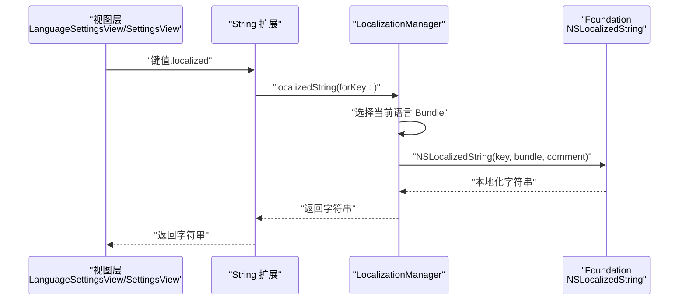
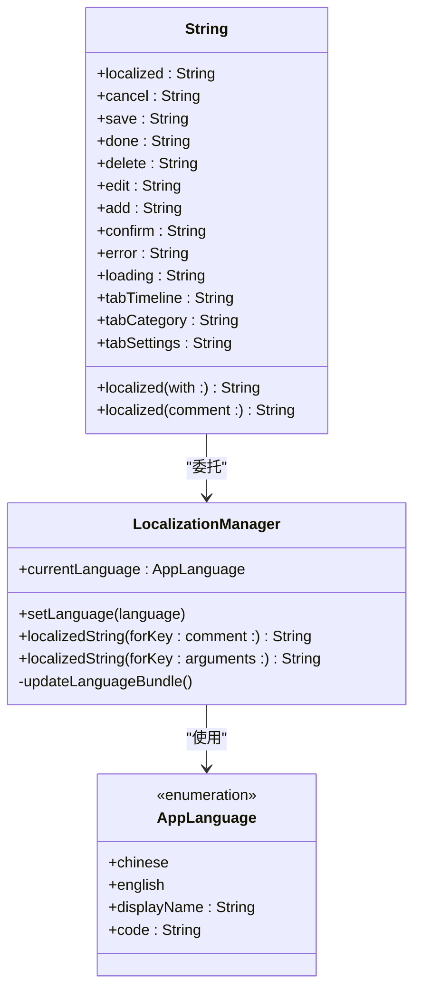
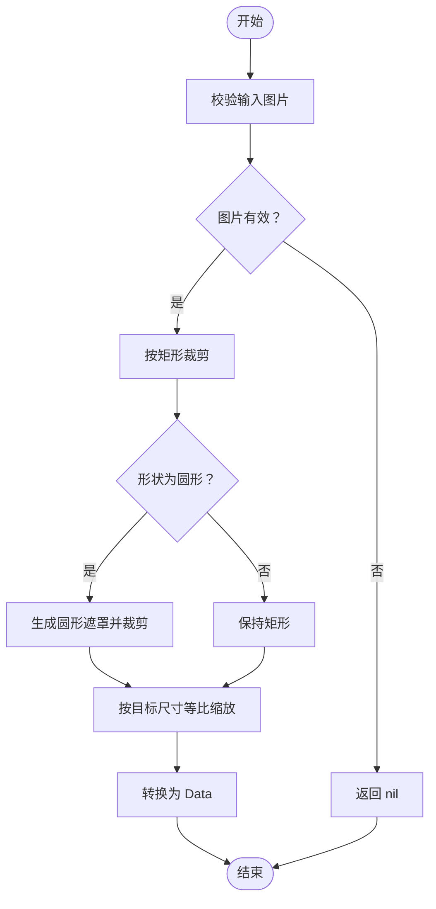
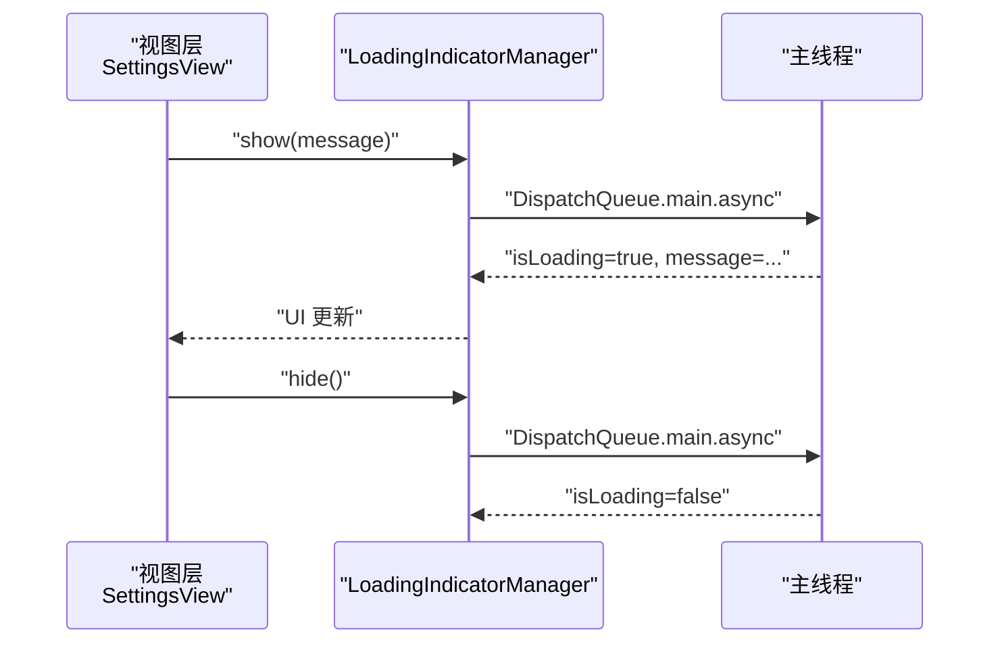
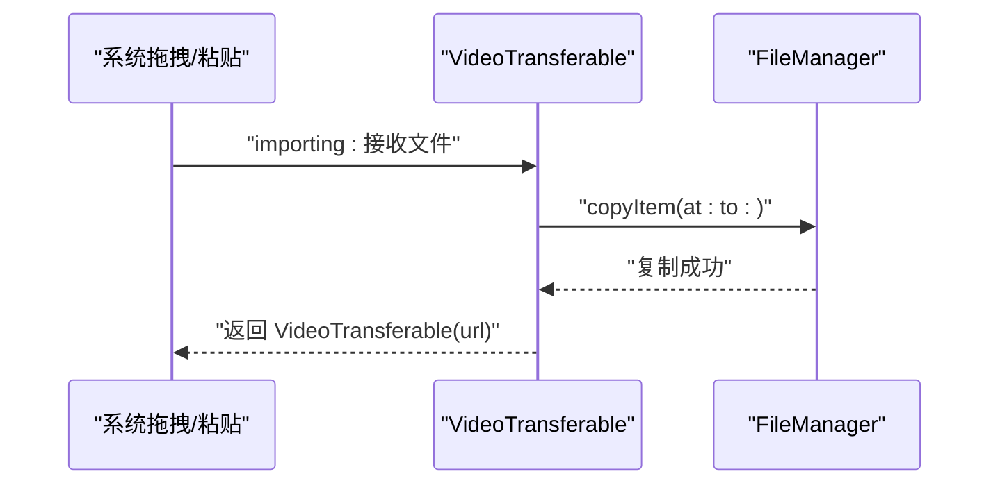
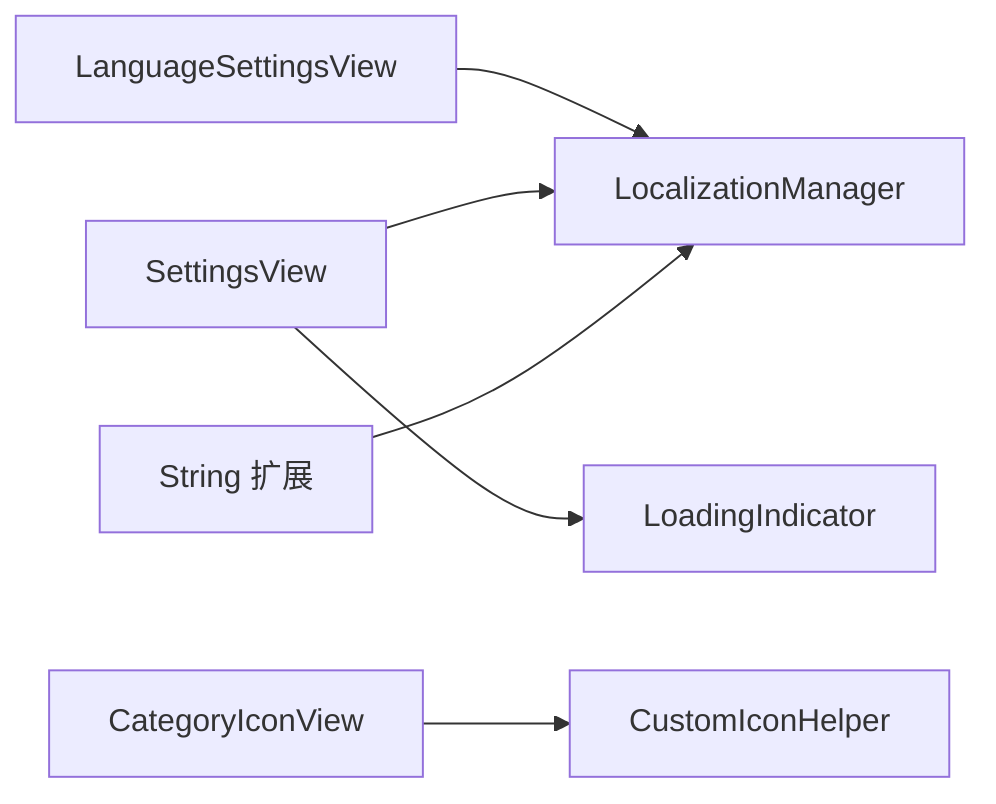

# 工具函数 API

<cite>
**本文引用的文件**
- [LocalizationManager.swift](file://MyStory/Utils/LocalizationManager.swift)
- [String+Localization.swift](file://MyStory/Utils/String+Localization.swift)
- [CustomIconHelper.swift](file://MyStory/Utils/CustomIconHelper.swift)
- [CropShape.swift](file://MyStory/Models/Category/CropShape.swift)
- [MarkdownProcessor.swift](file://MyStory/Utils/MarkdownProcessor.swift)
- [SensitiveFilter.swift](file://MyStory/Utils/SensitiveFilter.swift)
- [LoadingIndicator.swift](file://MyStory/Utils/LoadingIndicator.swift)
- [VideoTransferable.swift](file://MyStory/Utils/VideoTransferable.swift)
- [LanguageSettingsView.swift](file://MyStory/Views/Settings/LanguageSettingsView.swift)
- [SettingsView.swift](file://MyStory/Views/Settings/SettingsView.swift)
- [CategoryIconView.swift](file://MyStory/Components/Category/CategoryIconView.swift)
- [多语言使用快速参考.md](file://多语言使用快速参考.md)
- [多语言支持完整检查报告.md](file://多语言支持完整检查报告.md)
</cite>

## 目录
1. [简介](#简介)
2. [项目结构](#项目结构)
3. [核心组件](#核心组件)
4. [架构总览](#架构总览)
5. [详细组件分析](#详细组件分析)
6. [依赖关系分析](#依赖关系分析)
7. [性能考量](#性能考量)
8. [故障排查指南](#故障排查指南)
9. [结论](#结论)
10. [附录](#附录)

## 简介
本文件面向开发者与产品人员，系统性梳理应用中的工具函数与辅助模块，覆盖本地化管理、字符串处理、图片与图标处理、加载指示器、视频传输、敏感词过滤与 Markdown 处理等能力。文档提供接口定义、参数与返回值说明、使用示例、异常处理策略、性能特征、线程安全与扩展建议，并给出最佳实践与注意事项。

## 项目结构
工具函数主要位于 Utils 目录，配合 Models、Views、Components 等模块协同工作。下图展示工具层与上层组件的关系概览：

图表来源
- [LocalizationManager.swift](file://MyStory/Utils/LocalizationManager.swift#L31-L106)
- [String+Localization.swift](file://MyStory/Utils/String+Localization.swift#L10-L26)
- [CustomIconHelper.swift](file://MyStory/Utils/CustomIconHelper.swift#L6-L161)
- [MarkdownProcessor.swift](file://MyStory/Utils/MarkdownProcessor.swift#L3-L8)
- [SensitiveFilter.swift](file://MyStory/Utils/SensitiveFilter.swift#L3-L17)
- [LoadingIndicator.swift](file://MyStory/Utils/LoadingIndicator.swift#L4-L68)
- [VideoTransferable.swift](file://MyStory/Utils/VideoTransferable.swift#L5-L33)
- [LanguageSettingsView.swift](file://MyStory/Views/Settings/LanguageSettingsView.swift#L10-L64)
- [SettingsView.swift](file://MyStory/Views/Settings/SettingsView.swift#L10-L227)
- [CategoryIconView.swift](file://MyStory/Components/Category/CategoryIconView.swift#L5-L123)

章节来源
- [LocalizationManager.swift](file://MyStory/Utils/LocalizationManager.swift#L31-L106)
- [String+Localization.swift](file://MyStory/Utils/String+Localization.swift#L10-L26)
- [CustomIconHelper.swift](file://MyStory/Utils/CustomIconHelper.swift#L6-L161)
- [MarkdownProcessor.swift](file://MyStory/Utils/MarkdownProcessor.swift#L3-L8)
- [SensitiveFilter.swift](file://MyStory/Utils/SensitiveFilter.swift#L3-L17)
- [LoadingIndicator.swift](file://MyStory/Utils/LoadingIndicator.swift#L4-L68)
- [VideoTransferable.swift](file://MyStory/Utils/VideoTransferable.swift#L5-L33)
- [LanguageSettingsView.swift](file://MyStory/Views/Settings/LanguageSettingsView.swift#L10-L64)
- [SettingsView.swift](file://MyStory/Views/Settings/SettingsView.swift#L10-L227)
- [CategoryIconView.swift](file://MyStory/Components/Category/CategoryIconView.swift#L5-L123)

## 核心组件
- 本地化管理与字符串本地化
  - LocalizationManager：单例，负责语言切换、Bundle 更新、发布语言变更通知、提供本地化字符串与带参数格式化。
  - String 扩展：提供便捷的 .localized、带参数 .localized(with:)、带注释 .localized(comment:)，以及常用键的静态属性。
- 图片与图标处理
  - CustomIconHelper：提供图片裁剪、圆形裁剪、尺寸调整、数据互转、图标处理流程、有效性校验、适合容器的尺寸计算。
  - CropShape：裁剪形状枚举（矩形、圆形）及显示名与图标名。
- 内容处理
  - MarkdownProcessor：当前直接透传，便于后续扩展。
  - SensitiveFilter：敏感词过滤（示例词表，可扩展为外部词库）。
- 用户体验
  - LoadingIndicator：全局加载指示器管理器与视图，提供显示/隐藏与过渡动画。
  - VideoTransferable：通过 UniformTypeIdentifiers 实现拖拽/粘贴视频的导入与复制。
- 使用示例与集成点
  - LanguageSettingsView、SettingsView：展示本地化与加载指示器的使用。
  - CategoryIconView：展示自定义图标数据的渲染与降级逻辑。

章节来源
- [LocalizationManager.swift](file://MyStory/Utils/LocalizationManager.swift#L31-L106)
- [String+Localization.swift](file://MyStory/Utils/String+Localization.swift#L10-L46)
- [CustomIconHelper.swift](file://MyStory/Utils/CustomIconHelper.swift#L6-L161)
- [CropShape.swift](file://MyStory/Models/Category/CropShape.swift#L5-L26)
- [MarkdownProcessor.swift](file://MyStory/Utils/MarkdownProcessor.swift#L3-L8)
- [SensitiveFilter.swift](file://MyStory/Utils/SensitiveFilter.swift#L3-L17)
- [LoadingIndicator.swift](file://MyStory/Utils/LoadingIndicator.swift#L4-L68)
- [VideoTransferable.swift](file://MyStory/Utils/VideoTransferable.swift#L5-L33)
- [LanguageSettingsView.swift](file://MyStory/Views/Settings/LanguageSettingsView.swift#L10-L64)
- [SettingsView.swift](file://MyStory/Views/Settings/SettingsView.swift#L10-L227)
- [CategoryIconView.swift](file://MyStory/Components/Category/CategoryIconView.swift#L5-L123)

## 架构总览
下图展示本地化与字符串本地化的调用链路，体现从视图到工具再到系统 API 的数据流。

图表来源
- [LanguageSettingsView.swift](file://MyStory/Views/Settings/LanguageSettingsView.swift#L39-L55)
- [SettingsView.swift](file://MyStory/Views/Settings/SettingsView.swift#L29-L135)
- [String+Localization.swift](file://MyStory/Utils/String+Localization.swift#L10-L26)
- [LocalizationManager.swift](file://MyStory/Utils/LocalizationManager.swift#L76-L88)

## 详细组件分析

### 本地化管理与字符串本地化
- 类与职责
  - LocalizationManager：单例，维护当前语言、Bundle、UserDefaults 存储、通知发送；提供字符串查询与格式化。
  - String 扩展：提供便捷的本地化访问与常用键的静态属性，减少重复查询。
- 接口定义
  - setLanguage(_:)：切换语言，持久化并广播语言变更通知。
  - localizedString(forKey:comment:)：按键获取本地化字符串。
  - localizedString(forKey:arguments:)：按键获取并以格式化参数替换占位符。
  - 便捷属性：cancel/save/done/delete/edit/add/confirm/error/loading、tabTimeline/tabCategory/tabSettings。
- 参数与返回值
  - setLanguage(_:)：无返回值；参数为 AppLanguage。
  - localizedString(forKey:comment:)：返回 String。
  - localizedString(forKey:arguments:)：返回 String。
  - 便捷属性：返回 String。
- 异常与边界
  - 若 Bundle 未找到，回退至主 Bundle。
  - 语言初始化优先读取 UserDefaults，否则根据系统语言前缀选择默认语言。
- 使用示例
  - 切换语言：调用 setLanguage(...) 并在视图中响应语言变更通知。
  - 文本显示：使用 "key".localized 或 String 扩展的静态属性。
- 线程安全
  - @Published 属性在主线程更新；通知在主线程发送。
- 性能特征
  - 建议复用已获取的本地化字符串，避免重复查询。
  - 可通过 String 扩展的静态属性缓存常用文本。

图表来源
- [LocalizationManager.swift](file://MyStory/Utils/LocalizationManager.swift#L31-L106)
- [String+Localization.swift](file://MyStory/Utils/String+Localization.swift#L10-L46)

章节来源
- [LocalizationManager.swift](file://MyStory/Utils/LocalizationManager.swift#L31-L106)
- [String+Localization.swift](file://MyStory/Utils/String+Localization.swift#L10-L46)
- [多语言使用快速参考.md](file://多语言使用快速参考.md#L167-L227)
- [多语言支持完整检查报告.md](file://多语言支持完整检查报告.md#L194-L247)

### 图片与图标处理
- 类与职责
  - CustomIconHelper：提供图片裁剪、圆形裁剪、尺寸调整、数据互转、图标处理流程、有效性校验、适合容器的尺寸计算。
  - CropShape：裁剪形状枚举（矩形、圆形）及显示名与图标名。
- 接口定义
  - cropImage(_:to:shape:)：按矩形裁剪并按形状处理。
  - resizeImage(_:to:)：按目标尺寸等比缩放。
  - imageToData(_:)/dataToImage(_:)：图片与 Data 的互转。
  - processCustomIcon(from:cropRect:shape:iconSize:)：完整的图标处理流水线。
  - isValidImage(_:)：验证图片有效性。
  - calculateFitSize(for:in:)：计算适合容器的显示尺寸。
- 参数与返回值
  - cropImage：UIImage?。
  - resizeImage：UIImage?。
  - imageToData/dataToImage：Data?/UIImage?。
  - processCustomIcon：Data?。
  - isValidImage：Bool。
  - calculateFitSize：CGSize。
- 异常与边界
  - 所有返回值为可选，内部对无效输入（如 cgImage 为空、尺寸为 0）进行保护。
- 使用示例
  - 图标处理：传入原始图片、裁剪区域、形状与目标尺寸，得到 Data 后存储或渲染。
  - 图片验证：在渲染前先调用 isValidImage 判断。
- 线程安全
  - UIKit 图像绘制需在主线程；当前实现未强制切换线程，建议在主线程调用。
- 性能特征
  - 图像绘制使用离屏上下文，注意内存占用；建议控制目标尺寸，避免超大图处理。

图表来源
- [CustomIconHelper.swift](file://MyStory/Utils/CustomIconHelper.swift#L16-L134)
- [CropShape.swift](file://MyStory/Models/Category/CropShape.swift#L5-L26)

章节来源
- [CustomIconHelper.swift](file://MyStory/Utils/CustomIconHelper.swift#L6-L161)
- [CropShape.swift](file://MyStory/Models/Category/CropShape.swift#L5-L26)

### 加载指示器
- 类与职责
  - LoadingIndicatorManager：全局加载状态管理，支持消息与显示/隐藏。
  - LoadingIndicatorView：覆盖全屏的半透明背景与圆角提示框。
  - View 扩展 withLoadingIndicator()：为任意视图叠加加载指示器。
- 接口定义
  - show(message:)：显示加载指示器。
  - hide()：隐藏加载指示器。
  - withLoadingIndicator()：修饰视图以包含加载指示器。
- 参数与返回值
  - show(message:)：无返回值；message 默认“加载中...”。
  - hide()：无返回值。
  - withLoadingIndicator()：返回修饰后的 View。
- 异常与边界
  - 通过 @Published 属性驱动 UI 更新；在主线程异步更新状态。
- 使用示例
  - 在 SettingsView 中覆盖全屏加载提示，结合后台任务执行缓存清理。
- 线程安全
  - 通过 DispatchQueue.main.async 确保主线程更新。
- 性能特征
  - 动画开销低；建议仅在必要时显示，避免频繁切换。

图表来源
- [LoadingIndicator.swift](file://MyStory/Utils/LoadingIndicator.swift#L4-L25)
- [SettingsView.swift](file://MyStory/Views/Settings/SettingsView.swift#L191-L227)

章节来源
- [LoadingIndicator.swift](file://MyStory/Utils/LoadingIndicator.swift#L4-L68)
- [SettingsView.swift](file://MyStory/Views/Settings/SettingsView.swift#L191-L227)

### 敏感词过滤
- 类与职责
  - SensitiveFilter：提供敏感词替换功能，当前内置示例词表，可扩展为外部词库。
- 接口定义
  - filter(_:)：对输入文本进行敏感词替换。
- 参数与返回值
  - filter：String -> String。
- 异常与边界
  - 对空字符串安全；逐词替换。
- 使用示例
  - 在内容提交前调用 filter，替换为掩码字符。
- 线程安全
  - 纯函数式处理，无共享状态，天然线程安全。
- 性能特征
  - 时间复杂度与文本长度和词表大小线性相关；可考虑前缀树优化。

章节来源
- [SensitiveFilter.swift](file://MyStory/Utils/SensitiveFilter.swift#L3-L17)

### Markdown 处理
- 类与职责
  - MarkdownProcessor：当前直接透传，便于后续扩展设计文档规则。
- 接口定义
  - convert(_:)：String -> String。
- 参数与返回值
  - convert：String。
- 异常与边界
  - 无特殊处理，直接返回输入。
- 使用示例
  - 在富文本编辑或预览前调用 convert，再交由系统 Markdown 渲染。
- 线程安全
  - 纯函数式处理，无共享状态，天然线程安全。
- 性能特征
  - 当前为 O(n) 透传，扩展时需评估解析成本。

章节来源
- [MarkdownProcessor.swift](file://MyStory/Utils/MarkdownProcessor.swift#L3-L8)

### 视频传输
- 结构与职责
  - VideoTransferable：遵循 Transferable，支持拖拽/粘贴视频文件，自动复制到临时目录并返回封装对象。
- 接口定义
  - transferRepresentation：定义多种媒体类型的导入/导出行为。
- 参数与返回值
  - 导出：VideoTransferable(url)。
  - 导入：接收文件 URL，复制到 documentsDirectory/temp_UUID.mov/mp4，返回 VideoTransferable(url)。
- 异常与边界
  - 文件复制异常会抛出错误；调用方需处理错误。
- 使用示例
  - 在拖拽/粘贴场景中接收 VideoTransferable，读取其 url 进行播放或处理。
- 线程安全
  - 文件系统操作在主线程调用，建议在后台线程处理大文件复制。
- 性能特征
  - 复制大文件时注意磁盘 IO 与内存占用；可考虑分块复制与进度反馈。

图表来源
- [VideoTransferable.swift](file://MyStory/Utils/VideoTransferable.swift#L5-L33)

章节来源
- [VideoTransferable.swift](file://MyStory/Utils/VideoTransferable.swift#L5-L33)

### 自定义图标渲染
- 组件职责
  - CategoryIconView：根据数据决定渲染系统图标、Assets 预置图标或自定义图标；支持降级逻辑。
- 关键逻辑
  - isCustomIcon：依据 iconType 判断。
  - customIconData：若存在则渲染 UIImage；否则降级为系统图标。
  - assetIconNames：限定可用的 Assets 图标集。
- 使用示例
  - 传入 CategoryEntity 或 CategoryModel，指定尺寸与颜色，自动渲染对应图标。

章节来源
- [CategoryIconView.swift](file://MyStory/Components/Category/CategoryIconView.swift#L5-L123)

## 依赖关系分析
- 组件耦合
  - 视图层依赖工具层：LanguageSettingsView/SettingsView 依赖 LocalizationManager；SettingsView 依赖 LoadingIndicator。
  - 组件依赖工具层：CategoryIconView 依赖 CustomIconHelper 的裁剪与尺寸计算。
  - 字符串本地化通过 String 扩展统一委托给 LocalizationManager。
- 外部依赖
  - Foundation：NSLocalizedString、Bundle、UserDefaults、NotificationCenter。
  - SwiftUI/UIKit：视图与图像处理。
  - UniformTypeIdentifiers/CoreTransferable：视频传输。
- 循环依赖
  - 未发现循环依赖；工具层为纯函数或单例，无反向依赖。

图表来源
- [LanguageSettingsView.swift](file://MyStory/Views/Settings/LanguageSettingsView.swift#L10-L64)
- [SettingsView.swift](file://MyStory/Views/Settings/SettingsView.swift#L10-L227)
- [CategoryIconView.swift](file://MyStory/Components/Category/CategoryIconView.swift#L5-L123)
- [LocalizationManager.swift](file://MyStory/Utils/LocalizationManager.swift#L31-L106)
- [LoadingIndicator.swift](file://MyStory/Utils/LoadingIndicator.swift#L4-L68)
- [CustomIconHelper.swift](file://MyStory/Utils/CustomIconHelper.swift#L6-L161)
- [String+Localization.swift](file://MyStory/Utils/String+Localization.swift#L10-L26)

章节来源
- [LanguageSettingsView.swift](file://MyStory/Views/Settings/LanguageSettingsView.swift#L10-L64)
- [SettingsView.swift](file://MyStory/Views/Settings/SettingsView.swift#L10-L227)
- [CategoryIconView.swift](file://MyStory/Components/Category/CategoryIconView.swift#L5-L123)
- [LocalizationManager.swift](file://MyStory/Utils/LocalizationManager.swift#L31-L106)
- [LoadingIndicator.swift](file://MyStory/Utils/LoadingIndicator.swift#L4-L68)
- [CustomIconHelper.swift](file://MyStory/Utils/CustomIconHelper.swift#L6-L161)
- [String+Localization.swift](file://MyStory/Utils/String+Localization.swift#L10-L26)

## 性能考量
- 本地化
  - 建议复用已获取的本地化字符串，避免重复查询；可通过 String 扩展的静态属性缓存常用文本。
- 图片处理
  - 控制目标尺寸，避免超大图处理；在主线程进行图像绘制；对大图考虑异步处理与内存释放。
- 加载指示器
  - 仅在必要时显示，避免频繁切换；合理设置消息文案，减少布局抖动。
- 敏感词过滤
  - 词表规模较大时可考虑前缀树或集合优化；对长文本分段处理。
- Markdown 处理
  - 当前为透传，扩展时需评估解析与渲染成本。
- 视频传输
  - 大文件复制建议在后台线程执行；提供进度反馈与取消机制。

[本节为通用指导，无需特定文件来源]

## 故障排查指南
- 本地化
  - 文本未本地化：检查键值是否存在于两个语言文件、拼写是否正确、是否调用 .localized、Xcode 项目中资源文件是否正确添加。
  - 切换语言后部分文本未更新：确保视图订阅了 LocalizationManager；某些缓存文本需手动刷新。
- 图片处理
  - 裁剪或圆形处理失败：检查输入图片是否有效（cgImage、尺寸大于 0）；确认坐标与比例换算正确。
- 加载指示器
  - UI 不更新：确认在主线程调用 show/hide；检查 @Published 属性绑定。
- 敏感词过滤
  - 未生效：检查词表是否为空或被覆盖；确认调用 filter。
- 视频传输
  - 拖拽/粘贴失败：检查导入回调是否抛错；确认临时目录可写；查看复制异常信息。

章节来源
- [多语言使用快速参考.md](file://多语言使用快速参考.md#L212-L227)
- [CustomIconHelper.swift](file://MyStory/Utils/CustomIconHelper.swift#L14-L161)
- [LoadingIndicator.swift](file://MyStory/Utils/LoadingIndicator.swift#L13-L25)
- [SensitiveFilter.swift](file://MyStory/Utils/SensitiveFilter.swift#L10-L16)
- [VideoTransferable.swift](file://MyStory/Utils/VideoTransferable.swift#L11-L23)

## 结论
本工具函数体系覆盖本地化、字符串处理、图片与图标、加载指示、视频传输、敏感词与 Markdown 处理等关键能力。通过清晰的接口定义、合理的参数与返回值约定、完善的异常与边界处理，以及明确的性能与线程安全建议，开发者可在不同场景下高效、稳定地使用这些工具。建议在实际开发中遵循最佳实践，结合具体业务场景进行扩展与优化。

[本节为总结，无需特定文件来源]

## 附录
- 配置选项与扩展机制
  - 本地化：新增语言需扩展 AppLanguage 枚举、创建对应 lproj 资源文件并翻译键值；可在 String 扩展中添加常用键的静态属性。
  - 图片处理：可扩展 CropShape 与图标处理流程；支持更多形状或滤镜。
  - 敏感词过滤：词表可从本地 JSON 读取或远程拉取；支持动态更新。
  - Markdown 处理：可引入第三方解析库，扩展 convert 规则。
  - 视频传输：可增加更多媒体类型与导入策略。
- 最佳使用实践
  - 本地化：复用字符串、使用静态属性缓存常用文本、在视图中订阅语言变更。
  - 图片处理：先验证图片有效性，再进行裁剪与缩放；控制目标尺寸与内存占用。
  - 加载指示器：仅在耗时操作时显示，提供明确的消息与取消路径。
  - 敏感词过滤：在提交前统一处理，避免重复替换；对长文本分段处理。
  - 视频传输：在后台线程复制大文件，提供进度与错误提示。

章节来源
- [多语言支持完整检查报告.md](file://多语言支持完整检查报告.md#L194-L247)
- [CustomIconHelper.swift](file://MyStory/Utils/CustomIconHelper.swift#L6-L161)
- [SensitiveFilter.swift](file://MyStory/Utils/SensitiveFilter.swift#L3-L17)
- [MarkdownProcessor.swift](file://MyStory/Utils/MarkdownProcessor.swift#L3-L8)
- [VideoTransferable.swift](file://MyStory/Utils/VideoTransferable.swift#L5-L33)