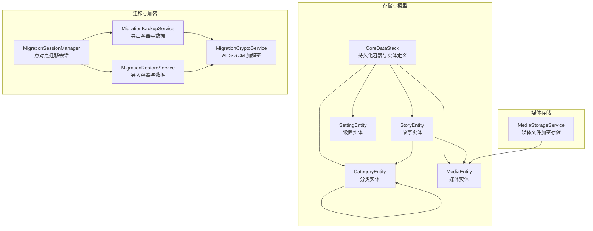
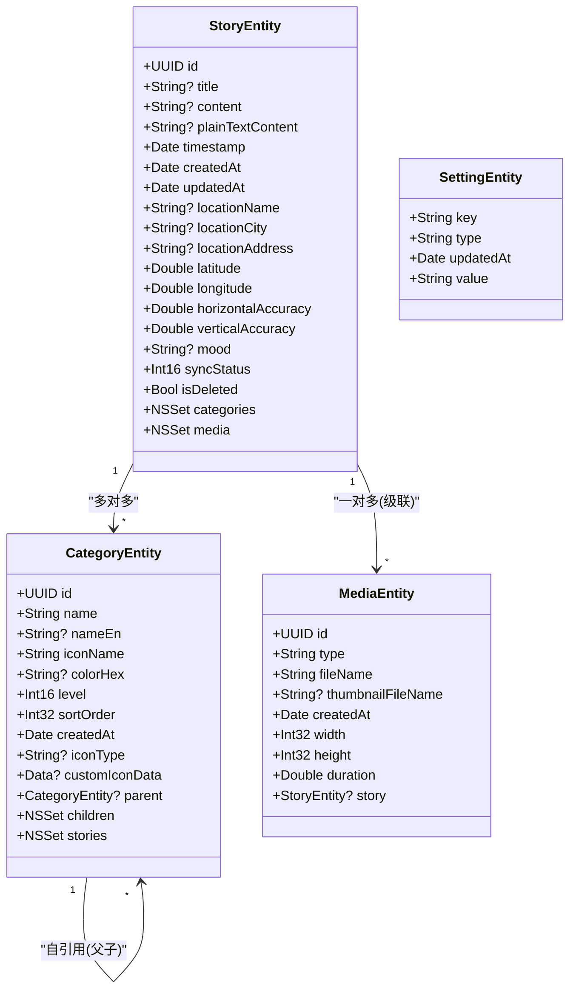
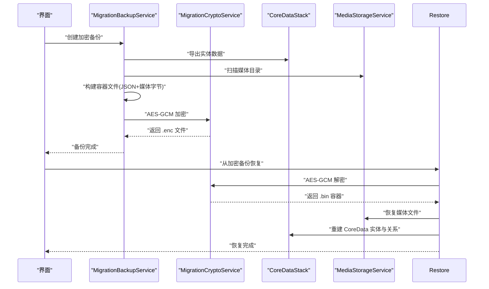
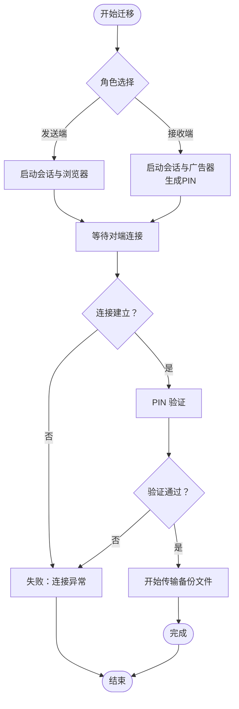
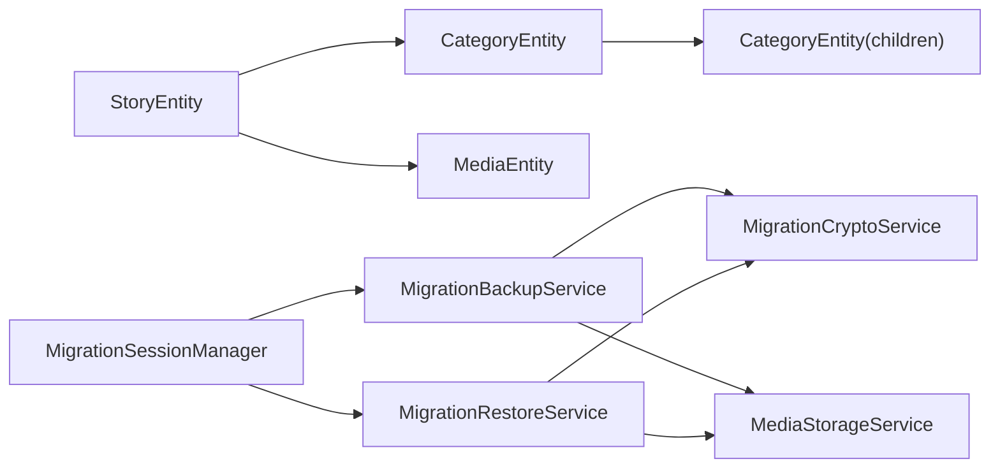

# 数据模型 API

<cite>
**本文引用的文件**
- [CoreDataStack.swift](file://MyStory/Core/Storage/CoreDataStack.swift)
- [contents](file://MyStory/Resources/MyStory.xcdatamodeld/MyStory.xcdatamodel/contents)
- [CategoryEntity+CoreDataClass.swift](file://MyStory/Models/Entities/CategoryEntity+CoreDataClass.swift)
- [CategoryEntity+CoreDataProperties.swift](file://MyStory/Models/Entities/CategoryEntity+CoreDataProperties.swift)
- [MediaEntity+CoreDataClass.swift](file://MyStory/Models/Entities/MediaEntity+CoreDataClass.swift)
- [MediaEntity+CoreDataProperties.swift](file://MyStory/Models/Entities/MediaEntity+CoreDataProperties.swift)
- [StoryEntity+CoreDataClass.swift](file://MyStory/Models/Entities/StoryEntity+CoreDataClass.swift)
- [StoryEntity+CoreDataProperties.swift](file://MyStory/Models/Entities/StoryEntity+CoreDataProperties.swift)
- [SettingEntity+CoreDataClass.swift](file://MyStory/Models/Entities/SettingEntity+CoreDataClass.swift)
- [SettingEntity+CoreDataProperties.swift](file://MyStory/Models/Entities/SettingEntity+CoreDataProperties.swift)
- [MigrationSessionManager.swift](file://MyStory/Services/MigrationSessionManager.swift)
- [MigrationBackupService.swift](file://MyStory/Services/MigrationBackupService.swift)
- [MigrationRestoreService.swift](file://MyStory/Services/MigrationRestoreService.swift)
- [MigrationCryptoService.swift](file://MyStory/Services/MigrationCryptoService.swift)
- [StoryModel.swift](file://MyStory/Models/ViewModels/StoryModel.swift)
- [MediaStorageService.swift](file://MyStory/Services/MediaStorageService.swift)
</cite>

## 目录
1. [简介](#简介)
2. [项目结构](#项目结构)
3. [核心组件](#核心组件)
4. [架构总览](#架构总览)
5. [详细组件分析](#详细组件分析)
6. [依赖分析](#依赖分析)
7. [性能考虑](#性能考虑)
8. [故障排查指南](#故障排查指南)
9. [结论](#结论)
10. [附录](#附录)

## 简介
本文件系统化梳理 MyStory 应用的数据模型 API，覆盖 Core Data 实体的属性定义、关系映射、约束规则、序列化/反序列化接口、验证与默认值、模型迁移与兼容性处理、缓存与懒加载策略以及性能优化与最佳实践。目标是帮助开发者在不深入源码的前提下，快速理解并正确使用数据模型层。

## 项目结构
数据模型相关代码主要分布在以下位置：
- 存储与模型：CoreDataStack 负责持久化容器与实体定义；各实体的 CoreData 类与属性扩展提供访问器；ViewModels 提供 UI 层业务模型。
- 迁移与加密：MigrationSessionManager 负责点对点迁移会话；MigrationBackupService/MigrationRestoreService 负责导出/导入容器与数据；MigrationCryptoService 负责加解密。
- 媒体存储：MediaStorageService 负责媒体文件的加密存储、缩略图生成与临时解密读取。

**图表来源**
- [CoreDataStack.swift](file://MyStory/Core/Storage/CoreDataStack.swift#L4-L381)
- [MigrationSessionManager.swift](file://MyStory/Services/MigrationSessionManager.swift#L5-L374)
- [MigrationBackupService.swift](file://MyStory/Services/MigrationBackupService.swift#L6-L414)
- [MigrationRestoreService.swift](file://MyStory/Services/MigrationRestoreService.swift#L6-L383)
- [MigrationCryptoService.swift](file://MyStory/Services/MigrationCryptoService.swift#L5-L67)
- [MediaStorageService.swift](file://MyStory/Services/MediaStorageService.swift#L8-L348)

**章节来源**
- [CoreDataStack.swift](file://MyStory/Core/Storage/CoreDataStack.swift#L4-L381)
- [contents](file://MyStory/Resources/MyStory.xcdatamodeld/MyStory.xcdatamodel/contents#L1-L79)

## 核心组件
- CoreDataStack：负责创建 NSPersistentContainer、配置 SQLite 存储、初始化实体模型与关系，并提供保存接口。
- 实体扩展：每个实体均提供 CoreData 类与属性扩展，暴露 NSManaged 属性与关系访问器。
- 迁移服务：以容器文件形式导出/导入实体数据、媒体文件与主密钥，配合加密服务保证安全性。
- 媒体服务：负责媒体文件的加密写入、缩略图生成、临时解密读取与目录组织。

**章节来源**
- [CoreDataStack.swift](file://MyStory/Core/Storage/CoreDataStack.swift#L4-L381)
- [CategoryEntity+CoreDataClass.swift](file://MyStory/Models/Entities/CategoryEntity+CoreDataClass.swift#L14-L17)
- [CategoryEntity+CoreDataProperties.swift](file://MyStory/Models/Entities/CategoryEntity+CoreDataProperties.swift#L15-L74)
- [MediaEntity+CoreDataClass.swift](file://MyStory/Models/Entities/MediaEntity+CoreDataClass.swift#L11-L14)
- [MediaEntity+CoreDataProperties.swift](file://MyStory/Models/Entities/MediaEntity+CoreDataProperties.swift#L15-L35)
- [StoryEntity+CoreDataClass.swift](file://MyStory/Models/Entities/StoryEntity+CoreDataClass.swift#L11-L50)
- [StoryEntity+CoreDataProperties.swift](file://MyStory/Models/Entities/StoryEntity+CoreDataProperties.swift#L15-L76)
- [SettingEntity+CoreDataClass.swift](file://MyStory/Models/Entities/SettingEntity+CoreDataClass.swift#L11-L14)
- [SettingEntity+CoreDataProperties.swift](file://MyStory/Models/Entities/SettingEntity+CoreDataProperties.swift#L15-L31)
- [MigrationBackupService.swift](file://MyStory/Services/MigrationBackupService.swift#L6-L414)
- [MigrationRestoreService.swift](file://MyStory/Services/MigrationRestoreService.swift#L6-L383)
- [MigrationCryptoService.swift](file://MyStory/Services/MigrationCryptoService.swift#L5-L67)
- [MediaStorageService.swift](file://MyStory/Services/MediaStorageService.swift#L8-L348)

## 架构总览
数据模型采用 Core Data 本地持久化，结合自定义容器文件与对称加密实现跨设备迁移。媒体文件独立加密存储于 Documents/Media 下，由 MediaStorageService 管理；StoryEntity 与 CategoryEntity 支持多对多关系，CategoryEntity 自引用形成父子层级；MediaEntity 与 StoryEntity 为一对多关系，删除规则分别为级联与置空。

**图表来源**
- [StoryEntity+CoreDataProperties.swift](file://MyStory/Models/Entities/StoryEntity+CoreDataProperties.swift#L15-L76)
- [CategoryEntity+CoreDataProperties.swift](file://MyStory/Models/Entities/CategoryEntity+CoreDataProperties.swift#L15-L74)
- [MediaEntity+CoreDataProperties.swift](file://MyStory/Models/Entities/MediaEntity+CoreDataProperties.swift#L15-L35)
- [SettingEntity+CoreDataProperties.swift](file://MyStory/Models/Entities/SettingEntity+CoreDataProperties.swift#L15-L31)

## 详细组件分析

### 实体与属性定义
- StoryEntity
  - 标识与时间：id（UUID，非空）、timestamp（日期，非空）、createdAt/updatedAt（日期，非空）。
  - 文本内容：title/content/plainTextContent（字符串，部分可空）。
  - 地理位置：locationName/locationCity/locationAddress（字符串，可空），latitude/longitude（双精度，可空），horizontalAccuracy/verticalAccuracy（双精度，默认值 -1.0）。
  - 情绪与同步：mood（字符串，可空），syncStatus（整型16位，默认0），isDeleted（布尔，默认false）。
  - 关系：categories（多对多，删除规则 Nullify），media（一对多，删除规则 Cascade）。
- CategoryEntity
  - 标识与层级：id（UUID，非空）、level（整型16位，默认1）、sortOrder（整型32位，默认0）、createdAt（日期，非空）。
  - 名称与图标：name/nameEn（字符串，部分可空）、iconName/iconType（字符串，非空，iconType 默认“system”）、colorHex（字符串，可空，默认“#007AFF”）、customIconData（二进制，可空）。
  - 关系：parent（自引用至父节点，删除规则 Nullify），children（自引用至子节点，删除规则 Cascade），stories（多对多，删除规则 Nullify）。
- MediaEntity
  - 标识与元数据：id（UUID，非空）、type/fileName/thumbnailFileName（字符串，部分可空）、createdAt（日期，非空）、width/height（整型32位，可空）、duration（双精度，可空）。
  - 关系：story（多对一，删除规则 Nullify）。
- SettingEntity
  - 键值设置：key（字符串，非空）、type/value（字符串，非空）、updatedAt（日期，非空）。

**章节来源**
- [CoreDataStack.swift](file://MyStory/Core/Storage/CoreDataStack.swift#L101-L200)
- [CoreDataStack.swift](file://MyStory/Core/Storage/CoreDataStack.swift#L202-L266)
- [CoreDataStack.swift](file://MyStory/Core/Storage/CoreDataStack.swift#L267-L377)
- [contents](file://MyStory/Resources/MyStory.xcdatamodeld/MyStory.xcdatamodel/contents#L3-L78)

### 关系映射与约束规则
- StoryEntity ↔ CategoryEntity：多对多，删除规则 Nullify，保证删除一方不影响另一方的完整性。
- StoryEntity ↔ MediaEntity：一对多，删除规则 Cascade，删除故事时自动删除其媒体条目。
- CategoryEntity 自引用：parent（至一个）与 children（多）均为可空，删除规则分别为 Nullify 与 Cascade，形成树形层级。
- 唯一约束：各实体的 id 字段为唯一约束，确保全局唯一性。

**章节来源**
- [CoreDataStack.swift](file://MyStory/Core/Storage/CoreDataStack.swift#L312-L364)
- [contents](file://MyStory/Resources/MyStory.xcdatamodeld/MyStory.xcdatamodel/contents#L17-L21)
- [contents](file://MyStory/Resources/MyStory.xcdatamodeld/MyStory.xcdatamodel/contents#L36-L40)
- [contents](file://MyStory/Resources/MyStory.xcdatamodeld/MyStory.xcdatamodel/contents#L47-L51)
- [contents](file://MyStory/Resources/MyStory.xcdatamodeld/MyStory.xcdatamodel/contents#L73-L77)

### 序列化/反序列化接口
- 导出（备份）：MigrationBackupService 将 CoreData 实体与媒体元数据打包为自定义容器文件，包含 JSON 元数据与媒体字节流，并通过 MigrationCryptoService 进行 AES-GCM 加密。
- 导入（恢复）：MigrationRestoreService 从加密文件中解密并解析容器，恢复 MasterKey、媒体文件与 CoreData 数据，重建关系。
- 媒体文件：MediaStorageService 负责媒体文件的加密写入、缩略图生成与临时解密读取，媒体目录按年/月分层组织。

**图表来源**
- [MigrationBackupService.swift](file://MyStory/Services/MigrationBackupService.swift#L110-L142)
- [MigrationRestoreService.swift](file://MyStory/Services/MigrationRestoreService.swift#L103-L152)
- [MigrationCryptoService.swift](file://MyStory/Services/MigrationCryptoService.swift#L35-L65)
- [MediaStorageService.swift](file://MyStory/Services/MediaStorageService.swift#L14-L123)

**章节来源**
- [MigrationBackupService.swift](file://MyStory/Services/MigrationBackupService.swift#L146-L266)
- [MigrationRestoreService.swift](file://MyStory/Services/MigrationRestoreService.swift#L124-L152)
- [MigrationCryptoService.swift](file://MyStory/Services/MigrationCryptoService.swift#L16-L65)
- [MediaStorageService.swift](file://MyStory/Services/MediaStorageService.swift#L14-L123)

### 验证规则、数据类型转换与默认值
- 非空字段：id、timestamp、createdAt、updatedAt、name、iconName、level、sortOrder、type、fileName、createdAt（MediaEntity）等。
- 默认值：
  - StoryEntity：horizontalAccuracy/verticalAccuracy 默认 -1.0；syncStatus 默认 0；isDeleted 默认 false。
  - CategoryEntity：colorHex 默认 “#007AFF”；level 默认 1；sortOrder 默认 0；iconType 默认 “system”。
- 数据类型：UUID、String、Date、Double、Int16/Int32/Int64、Boolean、Binary（Data）。
- 类型转换：Core Data 自动处理 Swift 基本类型与 Objective-C 类型之间的桥接；NSSet 用于多对多关系集合。

**章节来源**
- [CoreDataStack.swift](file://MyStory/Core/Storage/CoreDataStack.swift#L106-L194)
- [CoreDataStack.swift](file://MyStory/Core/Storage/CoreDataStack.swift#L207-L265)
- [CoreDataStack.swift](file://MyStory/Core/Storage/CoreDataStack.swift#L272-L376)
- [contents](file://MyStory/Resources/MyStory.xcdatamodeld/MyStory.xcdatamodel/contents#L4-L78)

### 模型版本迁移与兼容性
- 迁移会话：MigrationSessionManager 基于 MultipeerConnectivity 实现点对点连接、PIN 验证与资源传输，支持发送端与接收端角色切换。
- 备份容器：MigrationBackupService/MigrationRestoreService 采用自定义容器格式（MAGIC + JSON 长度 + JSON + 媒体字节），便于未来扩展与向后兼容。
- 加密策略：MigrationCryptoService 使用 AES-GCM，结合用户密码与备份 ID 派生对称密钥，保障数据机密性与完整性。
- 媒体迁移：MediaStorageService 负责媒体文件的加密存储与恢复，确保媒体与实体数据的一致性。

**图表来源**
- [MigrationSessionManager.swift](file://MyStory/Services/MigrationSessionManager.swift#L62-L106)
- [MigrationSessionManager.swift](file://MyStory/Services/MigrationSessionManager.swift#L178-L234)
- [MigrationSessionManager.swift](file://MyStory/Services/MigrationSessionManager.swift#L239-L373)

**章节来源**
- [MigrationSessionManager.swift](file://MyStory/Services/MigrationSessionManager.swift#L5-L374)
- [MigrationBackupService.swift](file://MyStory/Services/MigrationBackupService.swift#L345-L411)
- [MigrationRestoreService.swift](file://MyStory/Services/MigrationRestoreService.swift#L164-L206)
- [MigrationCryptoService.swift](file://MyStory/Services/MigrationCryptoService.swift#L16-L65)

### 缓存策略、懒加载与性能优化
- 上下文合并策略：CoreDataStack 设置 viewContext 的合并策略为“属性 trump”，并启用自动合并变更，减少并发写入冲突。
- 预览数据：CoreDataStack 提供预览实例，预先注入示例分类与故事，便于开发调试。
- 媒体懒加载：MediaStorageService 在需要时才解密读取媒体文件，避免不必要的内存占用；缩略图生成与临时文件清理降低 I/O 开销。
- 查询与关系：实体扩展提供 fetchRequest 与 NSSet 访问器，建议在 UI 层通过 ViewModel（如 StoryModel）聚合常用字段，减少频繁查询与格式化逻辑。

**章节来源**
- [CoreDataStack.swift](file://MyStory/Core/Storage/CoreDataStack.swift#L8-L35)
- [StoryEntity+CoreDataClass.swift](file://MyStory/Models/Entities/StoryEntity+CoreDataClass.swift#L14-L50)
- [StoryModel.swift](file://MyStory/Models/ViewModels/StoryModel.swift#L10-L28)
- [MediaStorageService.swift](file://MyStory/Services/MediaStorageService.swift#L71-L123)

## 依赖分析
- 实体间依赖：StoryEntity 依赖 CategoryEntity（多对多）与 MediaEntity（一对多）；CategoryEntity 自引用形成树结构。
- 服务依赖：MigrationBackupService/MigrationRestoreService 依赖 MigrationCryptoService 与 MediaStorageService；MigrationSessionManager 独立管理网络与加密流程。
- 存储依赖：CoreDataStack 依赖 Core Data 框架与 SQLite；MediaStorageService 依赖 Keychain 与加密库。

**图表来源**
- [CoreDataStack.swift](file://MyStory/Core/Storage/CoreDataStack.swift#L312-L364)
- [MigrationBackupService.swift](file://MyStory/Services/MigrationBackupService.swift#L103-L108)
- [MigrationRestoreService.swift](file://MyStory/Services/MigrationRestoreService.swift#L99-L101)
- [MigrationSessionManager.swift](file://MyStory/Services/MigrationSessionManager.swift#L34-L48)

**章节来源**
- [CoreDataStack.swift](file://MyStory/Core/Storage/CoreDataStack.swift#L312-L364)
- [MigrationBackupService.swift](file://MyStory/Services/MigrationBackupService.swift#L103-L108)
- [MigrationRestoreService.swift](file://MyStory/Services/MigrationRestoreService.swift#L99-L101)
- [MigrationSessionManager.swift](file://MyStory/Services/MigrationSessionManager.swift#L34-L48)

## 性能考虑
- 减少不必要的保存：仅在 viewContext 存在变更时执行保存，避免频繁 I/O。
- 批量操作：在 perform/performAndWait 中批量导出/导入数据，降低线程切换成本。
- 媒体压缩与分片：缩略图与临时文件写入采用分块读取，控制内存峰值。
- 查询优化：UI 层通过 ViewModel 聚合常用字段，减少对 Core Data 的频繁访问。

[本节为通用指导，无需列出具体文件来源]

## 故障排查指南
- 数据库加载失败：检查 persistentContainer 的加载回调错误信息，确认模型与存储 URL 正确。
- 迁移失败：核对 MigrationSessionManager 的状态变化与错误消息；确保 PIN 验证通过且会话稳定。
- 备份/恢复异常：检查容器文件格式（MAGIC、JSON 长度与 JSON 数据）解析；确认媒体文件偏移计算与写入顺序。
- 加密错误：确认密码与备份 ID 派生密钥一致；检查 AES-GCM 的 sealed box 组合数据完整性。
- 媒体读取失败：确认文件存在与权限；检查 Keychain 中 MasterKey 是否可用；验证解密过程无异常。

**章节来源**
- [CoreDataStack.swift](file://MyStory/Core/Storage/CoreDataStack.swift#L27-L31)
- [MigrationSessionManager.swift](file://MyStory/Services/MigrationSessionManager.swift#L240-L266)
- [MigrationRestoreService.swift](file://MyStory/Services/MigrationRestoreService.swift#L170-L206)
- [MigrationCryptoService.swift](file://MyStory/Services/MigrationCryptoService.swift#L53-L65)
- [MediaStorageService.swift](file://MyStory/Services/MediaStorageService.swift#L226-L271)

## 结论
本数据模型 API 以 Core Data 为核心，结合自定义容器与对称加密实现安全可靠的迁移能力；通过清晰的关系映射、严格的约束与默认值设计，确保数据一致性与易用性；配合媒体加密存储与懒加载策略，在功能与性能之间取得平衡。遵循本文的最佳实践与排错建议，可有效提升开发效率与系统稳定性。

[本节为总结性内容，无需列出具体文件来源]

## 附录
- 实体与属性速查：见“实体与属性定义”章节。
- 关系与删除规则：见“关系映射与约束规则”章节。
- 迁移流程：见“迁移会话与容器文件”章节。
- 媒体存储规范：见“媒体存储服务”章节。

[本节为概览性内容，无需列出具体文件来源]