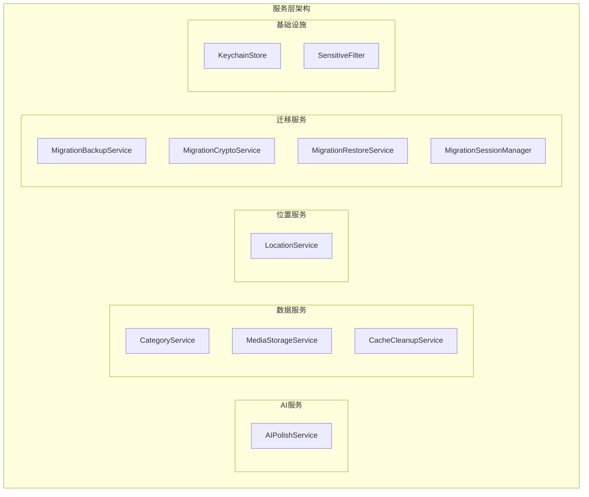
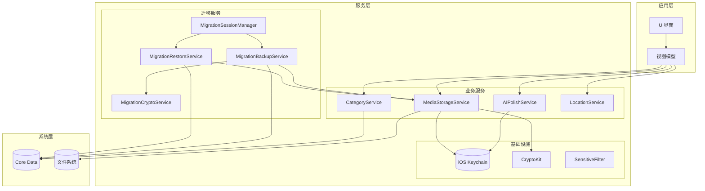
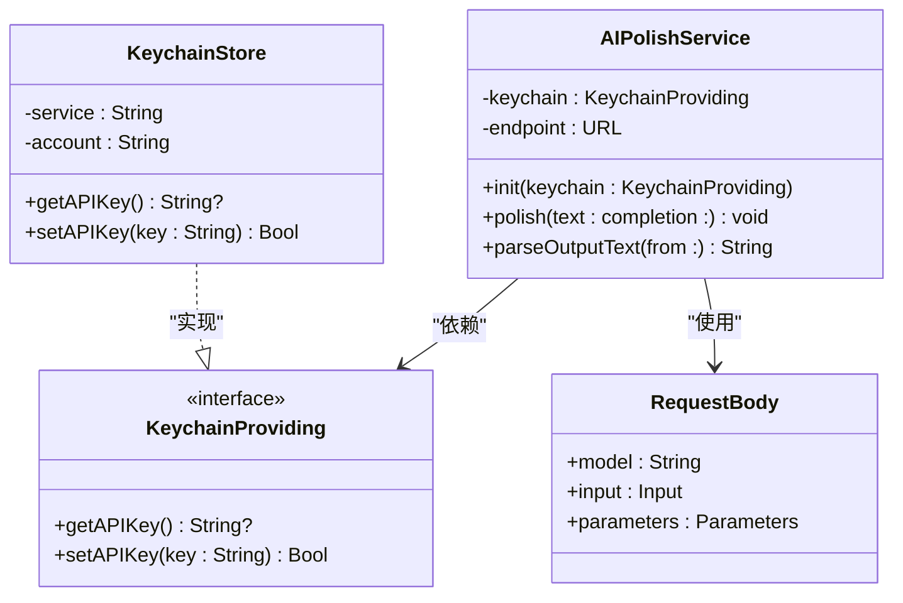
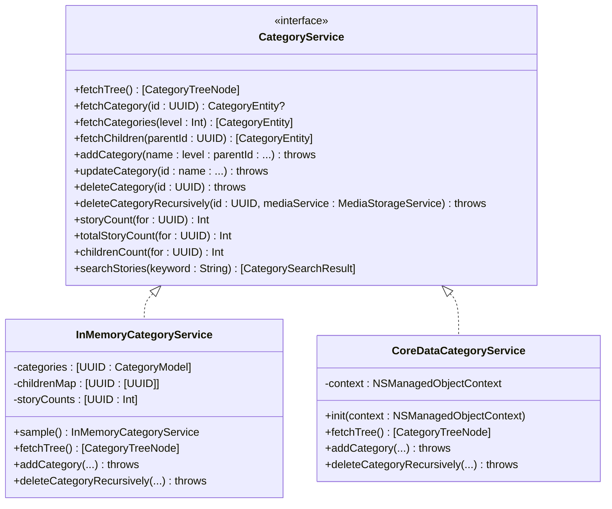
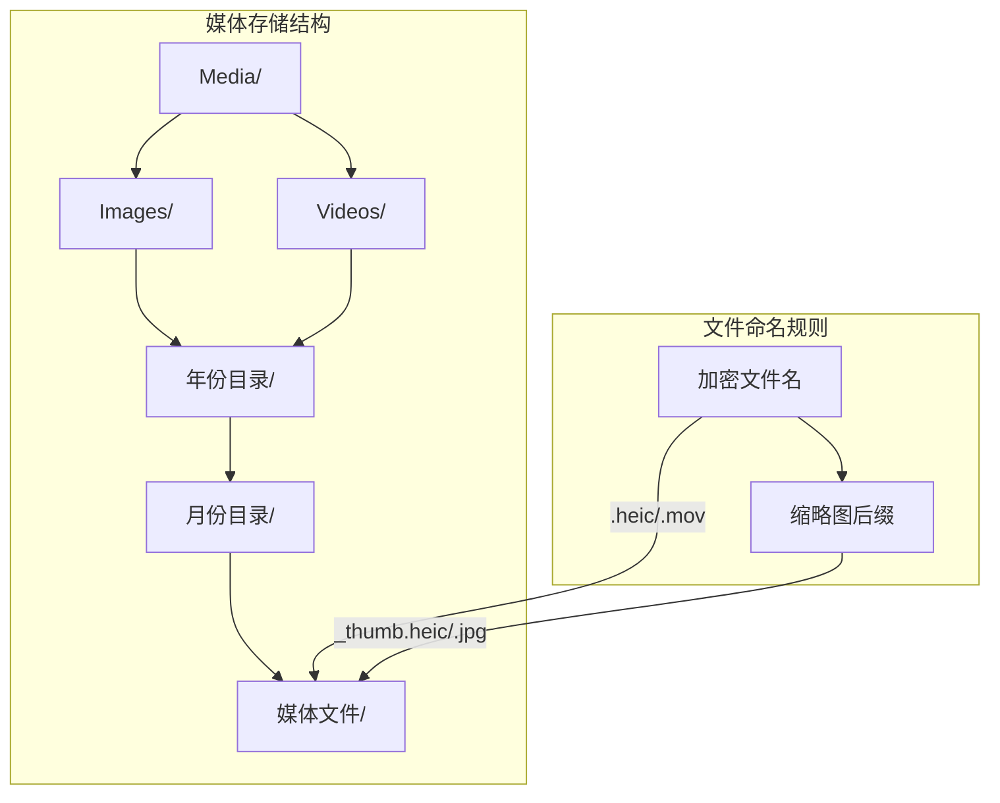
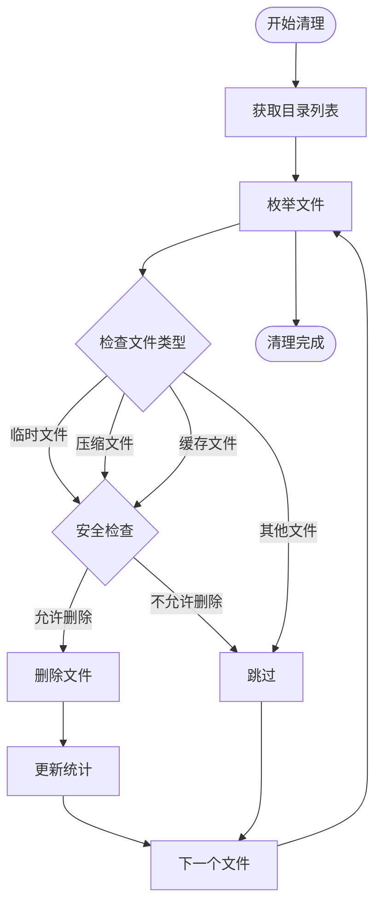
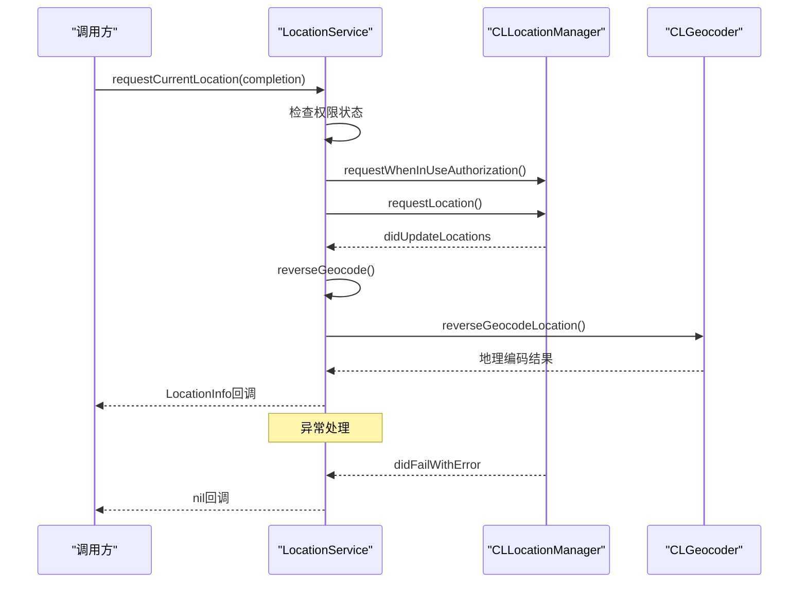
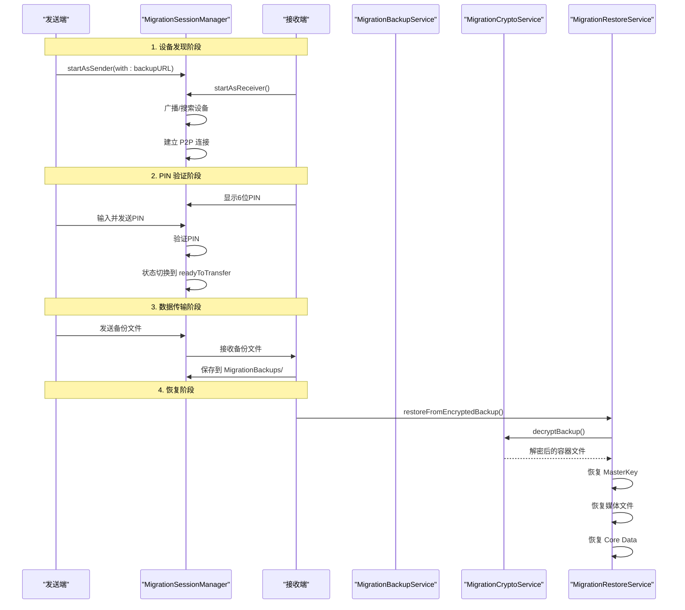
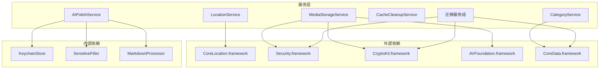

# 服务层 API

<cite>
**本文档引用的文件**
- [AIPolishService.swift](file://MyStory/Services/AIService/AIPolishService.swift)
- [KeychainStore.swift](file://MyStory/Core/Storage/KeychainStore.swift)
- [CategoryService.swift](file://MyStory/Services/CategoryService/CategoryService.swift)
- [MediaStorageService.swift](file://MyStory/Services/MediaStorageService.swift)
- [CacheCleanupService.swift](file://MyStory/Services/CacheCleanupService.swift)
- [LocationService.swift](file://MyStory/Services/LocationService.swift)
- [MigrationBackupService.swift](file://MyStory/Services/MigrationBackupService.swift)
- [MigrationCryptoService.swift](file://MyStory/Services/MigrationCryptoService.swift)
- [MigrationRestoreService.swift](file://MyStory/Services/MigrationRestoreService.swift)
- [MigrationSessionManager.swift](file://MyStory/Services/MigrationSessionManager.swift)
- [LocationInfo.swift](file://MyStory/Models/ViewModels/LocationInfo.swift)
- [SensitiveFilter.swift](file://MyStory/Utils/SensitiveFilter.swift)
</cite>

## 目录
1. [简介](#简介)
2. [项目结构](#项目结构)
3. [核心组件](#核心组件)
4. [架构概览](#架构概览)
5. [详细组件分析](#详细组件分析)
6. [依赖关系分析](#依赖关系分析)
7. [性能考虑](#性能考虑)
8. [故障排除指南](#故障排除指南)
9. [结论](#结论)

## 简介

MyStory 是一个基于 Swift 和 SwiftUI 的个人回忆应用，采用分层架构设计。本文档详细记录了服务层的所有公共 API，包括服务类的接口定义、方法签名、参数说明、返回值格式以及使用方式。服务层负责应用的核心业务逻辑，涵盖 AI 文本润色、分类管理、媒体存储、缓存清理、位置服务、数据迁移等多个方面。

## 项目结构

服务层位于 `MyStory/Services/` 目录下，按照功能域进行组织：



**图表来源**
- [AIPolishService.swift](file://MyStory/Services/AIService/AIPolishService.swift#L8-L77)
- [CategoryService.swift](file://MyStory/Services/CategoryService/CategoryService.swift#L22-L42)
- [MediaStorageService.swift](file://MyStory/Services/MediaStorageService.swift#L8-L348)

## 核心组件

### AI 文本润色服务

AIPolishService 提供基于通义千问 API 的文本润色功能，支持异步处理和错误处理。

**主要特性：**
- 支持多种输出格式（message、choices）
- 自动敏感词过滤
- Markdown 格式转换
- API Key 安全存储

**关键接口：**
- `polish(text:completion:)` - 文本润色主方法
- `parseOutputText(from:)` - 输出解析辅助方法

### 分类服务

提供两级分类管理功能，支持增删改查、统计查询和搜索功能。

**主要接口：**
- `fetchTree()` - 获取分类树
- `addCategory(name:level:parentId:...)` - 添加分类
- `updateCategory(id:name:...)` - 更新分类
- `deleteCategory(id:)` - 删除分类
- `storyCount(for:)` - 统计故事数量

### 媒体存储服务

负责图片和视频的加密存储、压缩、缩略图生成和安全访问。

**核心功能：**
- AES-GCM 对称加密
- HEIC/JPEG 图片编码
- 视频缩略图生成
- 时间分片目录结构

### 缓存清理服务

自动化清理应用缓存文件，支持安全过滤和空间统计。

**清理策略：**
- 临时文件识别（temp、.tmp、cache）
- 压缩文件清理
- 媒体文件保护
- SQLite 数据库保护

### 位置服务

基于 CoreLocation 的位置获取和逆地理编码服务。

**功能特性：**
- 权限自动申请
- 精度分级显示
- 地址信息提取
- 异步回调处理

### 数据迁移服务

完整的 P2P 数据迁移解决方案，支持加密备份、传输和恢复。

**迁移流程：**
1. 备份创建（数据导出 + 加密）
2. P2P 传输（PIN 验证）
3. 恢复执行（数据导入）

**图表来源**
- [MigrationBackupService.swift](file://MyStory/Services/MigrationBackupService.swift#L115-L142)
- [MigrationSessionManager.swift](file://MyStory/Services/MigrationSessionManager.swift#L89-L106)
- [MigrationRestoreService.swift](file://MyStory/Services/MigrationRestoreService.swift#L108-L152)

## 架构概览



**图表来源**
- [AIPolishService.swift](file://MyStory/Services/AIService/AIPolishService.swift#L9-L14)
- [CategoryService.swift](file://MyStory/Services/CategoryService/CategoryService.swift#L190-L200)
- [MediaStorageService.swift](file://MyStory/Services/MediaStorageService.swift#L12-L13)
- [MigrationSessionManager.swift](file://MyStory/Services/MigrationSessionManager.swift#L34-L43)

## 详细组件分析

### AIPolishService 详细分析

#### 类结构图



**图表来源**
- [AIPolishService.swift](file://MyStory/Services/AIService/AIPolishService.swift#L3-L14)
- [KeychainStore.swift](file://MyStory/Core/Storage/KeychainStore.swift#L4-L39)

#### 主要方法详解

**polish 方法**
- **功能**：调用通义千问 API 进行文本润色
- **参数**：
  - `text`: String - 需要润色的文本
  - `completion`: @escaping (Result<String, Error>) -> Void - 异步回调
- **返回值**：void（通过回调返回结果）
- **异常处理**：
  - API Key 未配置：返回 401 错误
  - 空响应：返回 -1 错误
  - 解析失败：返回 -2 错误

**parseOutputText 方法**
- **功能**：解析不同格式的 API 响应
- **支持格式**：
  - `{"output":{"text":"..."}}`
  - `{"choices":[{"message":{"content":"..."}}]}`
- **回退机制**：解析失败时返回原文本

#### 使用示例

```swift
// 初始化服务
let keychain = KeychainStore()
let aiService = AIPolishService(keychain: keychain)

// 使用示例
aiService.polish(text: "这是一个测试文本") { result in
    switch result {
    case .success(let polishedText):
        print("润色结果: \(polishedText)")
    case .failure(let error):
        print("错误: \(error)")
    }
}
```

**章节来源**
- [AIPolishService.swift](file://MyStory/Services/AIService/AIPolishService.swift#L30-L61)
- [KeychainStore.swift](file://MyStory/Core/Storage/KeychainStore.swift#L10-L21)

### CategoryService 详细分析

#### 接口定义



**图表来源**
- [CategoryService.swift](file://MyStory/Services/CategoryService/CategoryService.swift#L22-L42)
- [CategoryService.swift](file://MyStory/Services/CategoryService/CategoryService.swift#L44-L185)
- [CategoryService.swift](file://MyStory/Services/CategoryService/CategoryService.swift#L190-L675)

#### 核心功能详解

**分类层级管理**
- 支持 1-3 级分类结构
- 层级限制：一级最多10个，二级最多20个，三级最多30个
- 父子关系验证

**数据一致性保证**
- 递归删除时级联删除所有子分类和故事
- 删除前检查是否有子分类和关联故事
- Core Data 预加载优化避免 N+1 查询问题

**搜索功能**
- 支持三级分类名称和故事内容搜索
- 匹配分数计算（标题匹配100分，内容匹配50分）
- 文本片段提取和高亮显示

#### 使用示例

```swift
// 初始化 Core Data 服务
let context = persistentContainer.viewContext
let categoryService = CoreDataCategoryService(context: context)

// 添加分类
do {
    try categoryService.addCategory(
        name: "旅行",
        level: 1,
        parentId: nil,
        iconName: "airplane.circle",
        colorHex: "#007AFF"
    )
} catch CategoryError.overLimit {
    print("分类数量已达上限")
} catch CategoryError.invalidParentLevel {
    print("父分类层级不匹配")
}

// 获取分类树
let tree = categoryService.fetchTree()
print("分类总数: \(tree.count)")
```

**章节来源**
- [CategoryService.swift](file://MyStory/Services/CategoryService/CategoryService.swift#L266-L330)
- [CategoryService.swift](file://MyStory/Services/CategoryService/CategoryService.swift#L453-L552)

### MediaStorageService 详细分析

#### 存储架构



**图表来源**
- [MediaStorageService.swift](file://MyStory/Services/MediaStorageService.swift#L11-L11)
- [MediaStorageService.swift](file://MyStory/Services/MediaStorageService.swift#L49-L69)

#### 加密机制

**密钥管理**
- Master Key 存储在 iOS Keychain
- 基于 HKDF 的派生算法
- 每个文件独立的密钥 ID

**加密流程**
1. 生成随机 Master Key
2. 为每个文件派生独立密钥
3. 使用 AES-GCM 进行加密
4. 将认证标签与密文组合存储

#### 主要方法详解

**saveImage 方法**
- **功能**：保存图片并生成缩略图
- **压缩质量**：原图 0.8，缩略图 0.6
- **格式选择**：优先 HEIC，失败时回退 JPEG
- **方向修正**：自动修正图片方向

**loadVideoURL 方法**
- **功能**：加载视频到临时文件
- **内存管理**：自动清理临时文件
- **解密处理**：透明解密后写入临时文件

#### 使用示例

```swift
// 初始化媒体存储服务
let mediaService = MediaStorageService()

// 保存图片
let image = UIImage(named: "test")!
do {
    let (fileName, thumbName) = try mediaService.saveImageWithThumbnail(image)
    print("图片保存成功: \(fileName), \(thumbName)")
} catch {
    print("保存失败: \(error)")
}

// 加载图片
if let loadedImage = mediaService.loadImage(fileName: fileName) {
    // 使用图片
}

// 保存视频
let videoURL = URL(fileURLWithPath: "video.mp4")
do {
    let (fileName, thumbName) = try mediaService.saveVideo(from: videoURL)
    print("视频保存成功: \(fileName), \(thumbName)")
} catch {
    print("保存失败: \(error)")
}
```

**章节来源**
- [MediaStorageService.swift](file://MyStory/Services/MediaStorageService.swift#L14-L47)
- [MediaStorageService.swift](file://MyStory/Services/MediaStorageService.swift#L89-L123)

### CacheCleanupService 详细分析

#### 清理策略



**图表来源**
- [CacheCleanupService.swift](file://MyStory/Services/CacheCleanupService.swift#L69-L151)

#### 安全过滤规则

**保护文件类型：**
- `/Media/` 目录下的用户媒体文件
- SQLite 数据库文件（.sqlite, .sqlite-shm, .sqlite-wal）
- HEIC/JPG/PNG 图片文件（除非以 temp 开头）

**清理文件类型：**
- 以 "temp" 开头的临时文件
- 压缩文件（zip, tar, gz, rar, 7z）
- 包含 ".tmp" 或 "cache" 的文件

#### 使用示例

```swift
// 执行缓存清理
let result = CacheCleanupService.cleanupCache()
print("删除文件数: \(result.deletedFilesCount)")
print("释放空间: \(result.freedSpaceMB) MB")

// 计算可清理空间
let freeableSpace = CacheCleanupService.calculateCacheSize()
print("可清理空间: \(freeableSpace) bytes")
```

**章节来源**
- [CacheCleanupService.swift](file://MyStory/Services/CacheCleanupService.swift#L29-L67)
- [CacheCleanupService.swift](file://MyStory/Services/CacheCleanupService.swift#L184-L203)

### LocationService 详细分析

#### 位置获取流程



**图表来源**
- [LocationService.swift](file://MyStory/Services/LocationService.swift#L14-L38)
- [LocationService.swift](file://MyStory/Services/LocationService.swift#L42-L53)

#### LocationInfo 模型

| 属性名 | 类型 | 描述 | 默认值 |
|--------|------|------|--------|
| id | UUID | 唯一标识符 | 自动生成 |
| latitude | Double | 纬度 | - |
| longitude | Double | 经度 | - |
| horizontalAccuracy | Double | 水平精度(米) | - |
| verticalAccuracy | Double | 垂直精度(米) | - |
| name | String? | 地点名称 | nil |
| address | String? | 完整地址 | nil |
| city | String? | 城市 | nil |
| country | String? | 国家 | nil |
| useFrequency | Int | 使用频率 | 0 |

#### 使用示例

```swift
// 初始化位置服务
let locationService = LocationService()

// 获取当前位置
locationService.requestCurrentLocation { locationInfo in
    guard let locationInfo = locationInfo else {
        print("获取位置失败")
        return
    }
    
    print("纬度: \(locationInfo.latitude)")
    print("经度: \(locationInfo.longitude)")
    print("精度: ±\(locationInfo.horizontalAccuracy)m")
    print("地址: \(locationInfo.displayText)")
}
```

**章节来源**
- [LocationService.swift](file://MyStory/Services/LocationService.swift#L14-L54)
- [LocationInfo.swift](file://MyStory/Models/ViewModels/LocationInfo.swift#L10-L75)

### 迁移服务详细分析

#### 迁移流程



**图表来源**
- [MigrationSessionManager.swift](file://MyStory/Services/MigrationSessionManager.swift#L63-L85)
- [MigrationSessionManager.swift](file://MyStory/Services/MigrationSessionManager.swift#L89-L106)
- [MigrationBackupService.swift](file://MyStory/Services/MigrationBackupService.swift#L115-L142)
- [MigrationRestoreService.swift](file://MyStory/Services/MigrationRestoreService.swift#L108-L152)

#### 备份数据结构

**BackupPayload 结构**

| 组件 | 描述 | 数据类型 |
|------|------|----------|
| backupId | 备份唯一标识 | UUID |
| appVersion | 应用版本 | String |
| schemaVersion | 数据库版本 | Int |
| createdAt | 创建时间 | Date |
| entityStats | 实体统计 | EntityStats |
| mediaStats | 媒体统计 | MediaStats |
| masterKeyBase64 | Base64编码的MasterKey | String? |
| categories | 分类数据 | [CategoryDTO] |
| stories | 故事数据 | [StoryDTO] |
| media | 媒体数据 | [MediaDTO] |
| relationsStoryCategories | 关系映射 | [StoryCategoryRelationDTO] |
| mediaFiles | 媒体文件描述 | [MediaFileDescriptor] |

#### 使用示例

```swift
// 创建备份
let backupService = MigrationBackupService(context: context)
let encryptedURL = try backupService.createEncryptedBackup(
    password: "用户密码",
    progressHandler: { progress in
        print("进度: \(progress.step) - \(progress.fractionCompleted)")
    }
)

// 发送备份
let sessionManager = MigrationSessionManager()
sessionManager.startAsSender(with: encryptedURL)

// 接收并恢复
let restoreService = MigrationRestoreService(context: context)
try restoreService.restoreFromEncryptedBackup(
    encryptedURL: receivedEncryptedURL,
    password: "用户密码",
    progressHandler: { progress in
        print("恢复进度: \(progress.step) - \(progress.fractionCompleted)")
    }
)
```

**章节来源**
- [MigrationBackupService.swift](file://MyStory/Services/MigrationBackupService.swift#L115-L142)
- [MigrationRestoreService.swift](file://MyStory/Services/MigrationRestoreService.swift#L108-L152)
- [MigrationSessionManager.swift](file://MyStory/Services/MigrationSessionManager.swift#L89-L106)

## 依赖关系分析

### 服务间依赖图



**图表来源**
- [AIPolishService.swift](file://MyStory/Services/AIService/AIPolishService.swift#L1-L2)
- [MediaStorageService.swift](file://MyStory/Services/MediaStorageService.swift#L1-L7)
- [LocationService.swift](file://MyStory/Services/LocationService.swift#L1-L2)
- [MigrationBackupService.swift](file://MyStory/Services/MigrationBackupService.swift#L1-L4)

### 关键依赖说明

**AIPolishService 依赖：**
- KeychainStore：API Key 存储
- SensitiveFilter：敏感词过滤
- MarkdownProcessor：Markdown 转换

**MediaStorageService 依赖：**
- CryptoKit：AES-GCM 加密
- Security：Keychain 访问
- AVFoundation：视频处理

**迁移服务依赖：**
- CryptoKit：对称加密
- Security：Keychain 操作
- CoreData：数据持久化

**章节来源**
- [AIPolishService.swift](file://MyStory/Services/AIService/AIPolishService.swift#L3-L6)
- [MediaStorageService.swift](file://MyStory/Services/MediaStorageService.swift#L1-L7)
- [MigrationBackupService.swift](file://MyStory/Services/MigrationBackupService.swift#L104-L104)

## 性能考虑

### 缓存优化策略

**Core Data 预加载**
- 使用 `relationshipKeyPathsForPrefetching` 避免 N+1 查询问题
- 预加载 stories、children 关系数据
- 减少数据库往返次数

**图片处理优化**
- HEIC 格式优先，JPEG 回退
- 压缩质量平衡：原图 0.8，缩略图 0.6
- 方向修正一次完成，避免重复处理

**网络请求优化**
- 30秒超时设置
- 异步处理避免阻塞主线程
- 失败重试机制

### 内存管理最佳实践

**弱引用使用**
- KVO 观察者使用 weak self
- 回调闭包避免循环引用

**资源清理**
- 临时文件自动清理
- 大文件操作使用流式处理
- 图片解码后及时释放

### 并发安全

**线程安全**
- Core Data 操作使用 perform/performAndWait
- 网络请求异步处理
- 文件操作串行化

**状态管理**
- ObservableObject 确保 UI 更新
- 原子性操作避免竞态条件

## 故障排除指南

### 常见错误类型

**API 调用错误**
- 401 未配置 API Key：检查 KeychainStore 配置
- -1 空响应：检查网络连接和 API 端点
- -2 解析失败：检查 API 返回格式兼容性

**文件操作错误**
- 无法创建目录：检查文件系统权限
- 读取失败：检查文件是否存在和可访问
- 加密失败：检查 Keychain 访问权限

**Core Data 错误**
- 事务冲突：使用 performAndWait 包装操作
- 关系完整性：确保外键约束正确设置

### 调试建议

**启用详细日志**
- 在开发环境中打印详细错误信息
- 记录关键操作的时间戳
- 监控内存使用情况

**单元测试**
- 为关键服务编写单元测试
- 测试边界条件和异常情况
- 验证数据一致性

**监控指标**
- API 调用成功率
- 文件操作耗时
- 内存峰值使用

**章节来源**
- [AIPolishService.swift](file://MyStory/Services/AIService/AIPolishService.swift#L31-L34)
- [MediaStorageService.swift](file://MyStory/Services/MediaStorageService.swift#L194-L201)
- [MigrationBackupService.swift](file://MyStory/Services/MigrationBackupService.swift#L370-L371)

## 结论

MyStory 的服务层设计体现了清晰的分层架构和良好的关注点分离。每个服务都有明确的职责边界和完善的错误处理机制。通过抽象接口设计，服务层既支持内存模拟实现，也支持生产环境的数据持久化。

关键优势包括：
- **模块化设计**：服务间依赖清晰，易于维护和测试
- **安全性保障**：敏感数据加密存储，权限控制严格
- **性能优化**：预加载策略、缓存机制、异步处理
- **用户体验**：渐进式反馈，错误友好提示

建议在后续开发中继续完善：
- 增强服务间通信的契约定义
- 扩展监控和日志系统
- 完善国际化和本地化支持
- 优化大数据量场景的性能表现