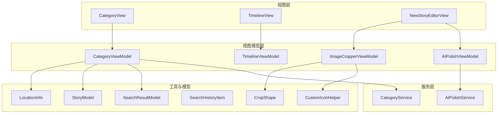
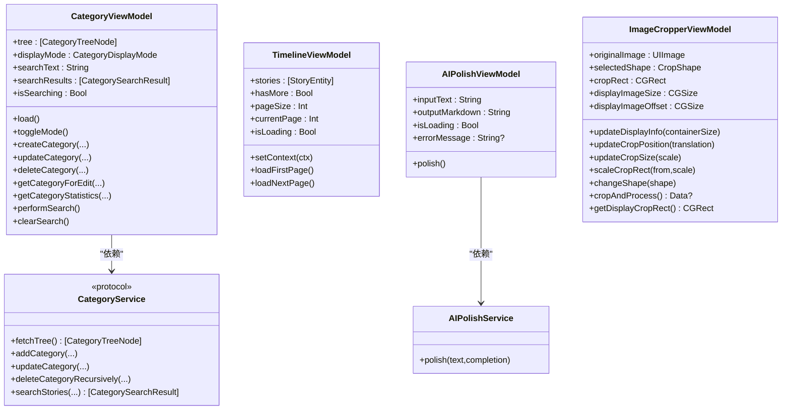
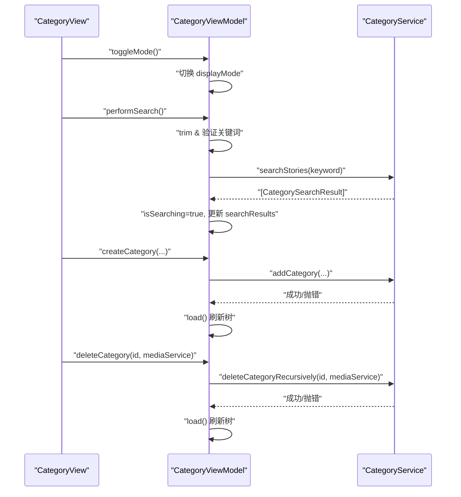
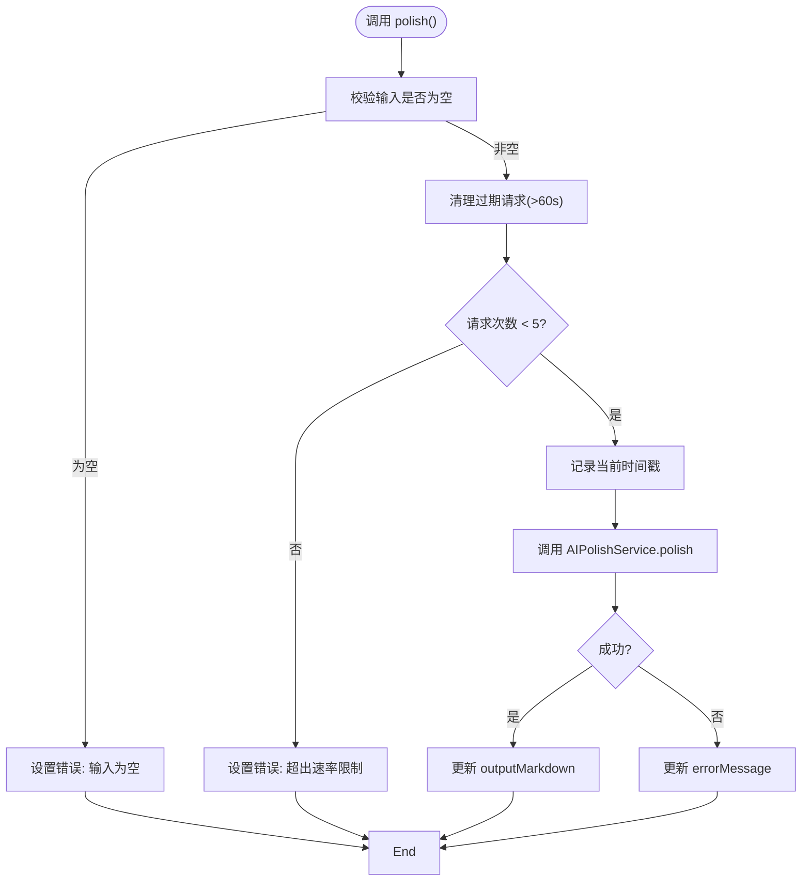
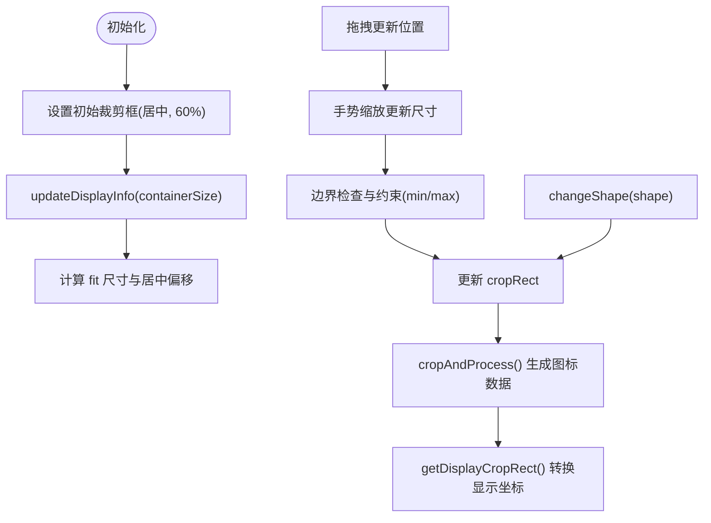
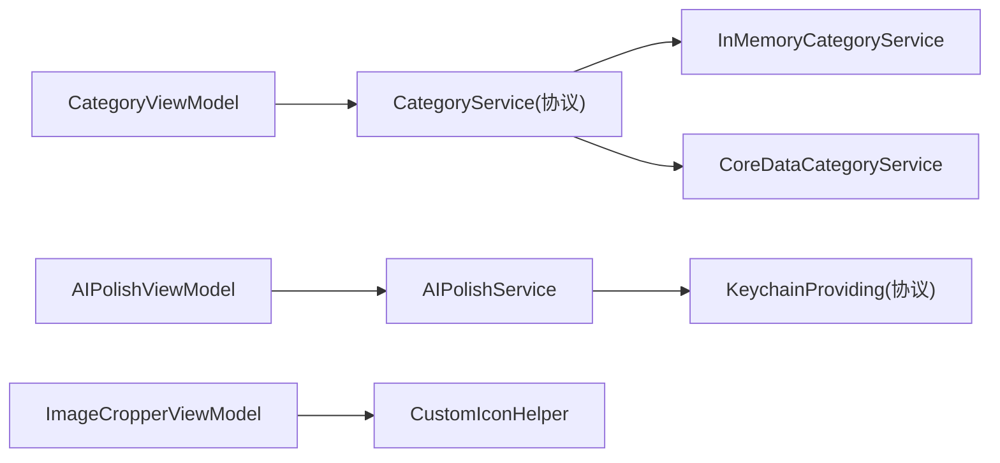

# 视图模型 API

<cite>
**本文档引用的文件**
- [CategoryViewModel.swift](file://MyStory/ViewModels/Category/CategoryViewModel.swift)
- [TimelineViewModel.swift](file://MyStory/Views/Timeline/TimelineViewModel.swift)
- [AIPolishViewModel.swift](file://MyStory/ViewModels/Editor/AIPolishViewModel.swift)
- [ImageCropperViewModel.swift](file://MyStory/ViewModels/Editor/ImageCropperViewModel.swift)
- [CategoryService.swift](file://MyStory/Services/CategoryService/CategoryService.swift)
- [AIPolishService.swift](file://MyStory/Services/AIService/AIPolishService.swift)
- [CustomIconHelper.swift](file://MyStory/Utils/CustomIconHelper.swift)
- [CategoryView.swift](file://MyStory/Views/Category/CategoryView.swift)
- [NewStoryEditorView.swift](file://MyStory/Views/Editor/NewStoryEditorView.swift)
- [StoryModel.swift](file://MyStory/Models/ViewModels/StoryModel.swift)
- [SearchResultModel.swift](file://MyStory/Models/ViewModels/SearchResultModel.swift)
- [SearchHistoryItem.swift](file://MyStory/Models/ViewModels/SearchHistoryItem.swift)
- [LocationInfo.swift](file://MyStory/Models/ViewModels/LocationInfo.swift)
- [CropShape.swift](file://MyStory/Models/Category/CropShape.swift)
</cite>

## 目录
1. [简介](#简介)
2. [项目结构](#项目结构)
3. [核心组件](#核心组件)
4. [架构概览](#架构概览)
5. [详细组件分析](#详细组件分析)
6. [依赖分析](#依赖分析)
7. [性能考虑](#性能考虑)
8. [故障排除指南](#故障排除指南)
9. [结论](#结论)
10. [附录](#附录)

## 简介
本文件系统化梳理了应用中视图模型（ViewModel）的 API 设计与实现，覆盖 MVVM 架构中 ViewModel 的职责边界、数据绑定接口、状态管理机制、生命周期与事件处理、跨视图模型通信、依赖注入、测试支持、性能优化与内存管理，以及异步操作处理的最佳实践。文档同时提供面向非技术读者的可读性说明与面向开发者的深入技术细节。

## 项目结构
视图模型主要分布在以下目录：
- 视图模型层：MyStory/ViewModels
- 视图层：MyStory/Views
- 服务层：MyStory/Services
- 工具与模型：MyStory/Utils 与 MyStory/Models



**图表来源**
- [CategoryView.swift](file://MyStory/Views/Category/CategoryView.swift#L1-L200)
- [TimelineViewModel.swift](file://MyStory/Views/Timeline/TimelineViewModel.swift#L1-L43)
- [AIPolishViewModel.swift](file://MyStory/ViewModels/Editor/AIPolishViewModel.swift#L1-L46)
- [ImageCropperViewModel.swift](file://MyStory/ViewModels/Editor/ImageCropperViewModel.swift#L1-L226)
- [CategoryService.swift](file://MyStory/Services/CategoryService/CategoryService.swift#L1-L675)
- [AIPolishService.swift](file://MyStory/Services/AIService/AIPolishService.swift#L1-L77)
- [CustomIconHelper.swift](file://MyStory/Utils/CustomIconHelper.swift#L1-L162)
- [StoryModel.swift](file://MyStory/Models/ViewModels/StoryModel.swift#L1-L29)
- [SearchResultModel.swift](file://MyStory/Models/ViewModels/SearchResultModel.swift#L1-L63)
- [SearchHistoryItem.swift](file://MyStory/Models/ViewModels/SearchHistoryItem.swift#L1-L20)
- [LocationInfo.swift](file://MyStory/Models/ViewModels/LocationInfo.swift#L1-L76)
- [CropShape.swift](file://MyStory/Models/Category/CropShape.swift#L1-L34)

**章节来源**
- [CategoryViewModel.swift](file://MyStory/ViewModels/Category/CategoryViewModel.swift#L1-L103)
- [TimelineViewModel.swift](file://MyStory/Views/Timeline/TimelineViewModel.swift#L1-L43)
- [AIPolishViewModel.swift](file://MyStory/ViewModels/Editor/AIPolishViewModel.swift#L1-L46)
- [ImageCropperViewModel.swift](file://MyStory/ViewModels/Editor/ImageCropperViewModel.swift#L1-L226)

## 核心组件
本节概述四个关键视图模型的职责与公共特性：
- CategoryViewModel：负责分类树加载、显示模式切换、增删改查、统计与搜索。
- TimelineViewModel：负责时间线故事分页加载与状态管理。
- AIPolishViewModel：负责 AI 文本润色的输入输出、加载状态与错误处理、速率限制。
- ImageCropperViewModel：负责图片裁剪、缩放、拖拽与形状切换，提供裁剪后图标数据。

这些视图模型均遵循 ObservableObject 协议并通过 @Published 属性暴露可观察状态，配合 SwiftUI 数据绑定实现 UI 同步更新。

**章节来源**
- [CategoryViewModel.swift](file://MyStory/ViewModels/Category/CategoryViewModel.swift#L18-L103)
- [TimelineViewModel.swift](file://MyStory/Views/Timeline/TimelineViewModel.swift#L4-L42)
- [AIPolishViewModel.swift](file://MyStory/ViewModels/Editor/AIPolishViewModel.swift#L4-L45)
- [ImageCropperViewModel.swift](file://MyStory/ViewModels/Editor/ImageCropperViewModel.swift#L5-L225)

## 架构概览
MVVM 在本项目中的职责划分：
- Model：StoryModel、SearchResultModel、SearchHistoryItem、LocationInfo 等业务模型。
- ViewModel：封装 UI 状态与交互逻辑，协调服务层与视图层。
- View：通过 @ObservedObject/@StateObject 绑定 ViewModel，驱动 UI 渲染与用户交互。
- Service：封装业务规则与数据访问（如 CategoryService、AIPolishService），向 ViewModel 提供稳定接口。
- Utility：如 CustomIconHelper 提供图像处理能力。



**图表来源**
- [CategoryViewModel.swift](file://MyStory/ViewModels/Category/CategoryViewModel.swift#L18-L103)
- [TimelineViewModel.swift](file://MyStory/Views/Timeline/TimelineViewModel.swift#L4-L42)
- [AIPolishViewModel.swift](file://MyStory/ViewModels/Editor/AIPolishViewModel.swift#L4-L45)
- [ImageCropperViewModel.swift](file://MyStory/ViewModels/Editor/ImageCropperViewModel.swift#L5-L225)
- [CategoryService.swift](file://MyStory/Services/CategoryService/CategoryService.swift#L22-L42)
- [AIPolishService.swift](file://MyStory/Services/AIService/AIPolishService.swift#L8-L77)

## 详细组件分析

### CategoryViewModel 分析
职责边界与状态管理：
- 状态属性：树形结构、显示模式、搜索关键词、搜索结果、搜索中状态。
- 生命周期：初始化即触发 load() 加载分类树。
- 数据绑定：通过 @Published 暴露状态，供 CategoryView 绑定。
- 业务接口：创建/更新/删除分类、统计子项与故事数量、执行搜索与清空搜索。



**图表来源**
- [CategoryViewModel.swift](file://MyStory/ViewModels/Category/CategoryViewModel.swift#L32-L101)
- [CategoryService.swift](file://MyStory/Services/CategoryService/CategoryService.swift#L22-L42)
- [CategoryView.swift](file://MyStory/Views/Category/CategoryView.swift#L1-L200)

**章节来源**
- [CategoryViewModel.swift](file://MyStory/ViewModels/Category/CategoryViewModel.swift#L18-L103)
- [CategoryService.swift](file://MyStory/Services/CategoryService/CategoryService.swift#L22-L42)
- [CategoryView.swift](file://MyStory/Views/Category/CategoryView.swift#L1-L200)

### TimelineViewModel 分析
职责边界与状态管理：
- 状态属性：故事列表、是否还有更多、分页大小、当前页、加载中标志。
- 生命周期：setContext 注入上下文；loadFirstPage 清空并加载第一页；loadNextPage 分页拉取。
- 错误处理：捕获异常后关闭加载标志并标记无更多数据。

```mermaid
sequenceDiagram
participant View as "TimelineView"
participant VM as "TimelineViewModel"
participant Core as "NSManagedObjectContext"
View->>VM : "setContext(context)"
VM->>VM : "保存上下文"
View->>VM : "loadFirstPage()"
VM->>VM : "stories=[]; currentPage=0; hasMore=true"
VM->>VM : "loadNextPage()"
View->>VM : "loadNextPage()"
VM->>VM : "guard isLoading, hasMore, context"
VM->>Core : "fetch(StoryEntity, limit+offset, sort)"
Core-->>VM : "[StoryEntity]"
VM->>VM : "更新 stories, 计算 hasMore, currentPage++"
VM->>VM : "isLoading=false"
```

**图表来源**
- [TimelineViewModel.swift](file://MyStory/Views/Timeline/TimelineViewModel.swift#L13-L41)

**章节来源**
- [TimelineViewModel.swift](file://MyStory/Views/Timeline/TimelineViewModel.swift#L4-L42)

### AIPolishViewModel 分析
职责边界与状态管理：
- 状态属性：输入文本、输出 Markdown、加载状态、错误信息。
- 速率限制：基于时间戳队列限制每分钟请求数。
- 生命周期：初始化注入服务；polish() 触发请求并在主线程更新状态。
- 错误处理：空输入、超限、网络/解析失败分别设置错误信息。



**图表来源**
- [AIPolishViewModel.swift](file://MyStory/ViewModels/Editor/AIPolishViewModel.swift#L18-L39)
- [AIPolishService.swift](file://MyStory/Services/AIService/AIPolishService.swift#L30-L61)

**章节来源**
- [AIPolishViewModel.swift](file://MyStory/ViewModels/Editor/AIPolishViewModel.swift#L4-L45)
- [AIPolishService.swift](file://MyStory/Services/AIService/AIPolishService.swift#L8-L77)

### ImageCropperViewModel 分析
职责边界与状态管理：
- 状态属性：原始图片、选中裁剪形状、裁剪矩形、显示尺寸与偏移。
- 生命周期：初始化设置初始裁剪框（居中、占图片 60%）。
- 图像处理：根据显示坐标与原始坐标之间的缩放比例，安全地更新裁剪框位置与尺寸；支持矩形与圆形裁剪；提供裁剪后图标数据生成与显示坐标转换。



**图表来源**
- [ImageCropperViewModel.swift](file://MyStory/ViewModels/Editor/ImageCropperViewModel.swift#L34-L225)
- [CustomIconHelper.swift](file://MyStory/Utils/CustomIconHelper.swift#L108-L134)
- [CropShape.swift](file://MyStory/Models/Category/CropShape.swift#L5-L26)

**章节来源**
- [ImageCropperViewModel.swift](file://MyStory/ViewModels/Editor/ImageCropperViewModel.swift#L5-L225)
- [CustomIconHelper.swift](file://MyStory/Utils/CustomIconHelper.swift#L1-L162)
- [CropShape.swift](file://MyStory/Models/Category/CropShape.swift#L1-L34)

## 依赖分析
- CategoryViewModel 依赖 CategoryService 接口，支持内存与 Core Data 两种实现，便于测试与环境切换。
- AIPolishViewModel 依赖 AIPolishService，后者通过 KeychainProviding 抽象获取密钥，便于替换与测试。
- ImageCropperViewModel 依赖 CustomIconHelper 进行图像裁剪与处理。
- 视图通过 @ObservedObject/@StateObject 绑定 ViewModel，形成单向数据流与事件向上冒泡的交互模式。



**图表来源**
- [CategoryService.swift](file://MyStory/Services/CategoryService/CategoryService.swift#L22-L185)
- [AIPolishService.swift](file://MyStory/Services/AIService/AIPolishService.swift#L3-L14)
- [ImageCropperViewModel.swift](file://MyStory/ViewModels/Editor/ImageCropperViewModel.swift#L5-L225)

**章节来源**
- [CategoryService.swift](file://MyStory/Services/CategoryService/CategoryService.swift#L22-L185)
- [AIPolishService.swift](file://MyStory/Services/AIService/AIPolishService.swift#L3-L14)
- [ImageCropperViewModel.swift](file://MyStory/ViewModels/Editor/ImageCropperViewModel.swift#L5-L225)

## 性能考虑
- 分页加载：TimelineViewModel 使用固定页大小与偏移量分页，减少一次性加载大量数据带来的内存压力。
- Core Data 预加载：CoreDataCategoryService 在查询时预加载相关关系，避免 fault 导致的二次访问与计数错误。
- 图像处理：CustomIconHelper 在裁剪与缩放时使用位图上下文，注意控制目标尺寸与缩放比例，避免过大内存占用。
- 速率限制：AIPolishViewModel 对 API 请求进行速率限制，降低服务端压力与本地内存抖动风险。
- 异步与主线程：AIPolishService 回调在主线程更新 UI，避免并发 UI 更新问题。

[本节为通用性能建议，无需特定文件来源]

## 故障排除指南
- 分类删除失败：检查 CategoryError 枚举中的错误原因（层级越界、已达上限、仍有故事或子分类、父分类层级不匹配、未找到）。在视图中捕获错误并弹窗提示。
- 搜索无结果：确认关键词非空；检查 CoreDataCategoryService 的搜索实现与预加载策略。
- AI 润色错误：检查 API Key 是否配置；查看 AIPolishService 的错误分支；关注速率限制提示。
- 图像裁剪异常：验证输入图片有效性；检查边界约束逻辑；确认显示缩放比例计算正确。

**章节来源**
- [CategoryService.swift](file://MyStory/Services/CategoryService/CategoryService.swift#L4-L20)
- [AIPolishService.swift](file://MyStory/Services/AIService/AIPolishService.swift#L30-L61)
- [ImageCropperViewModel.swift](file://MyStory/ViewModels/Editor/ImageCropperViewModel.swift#L220-L225)

## 结论
本项目的视图模型遵循 MVVM 架构，通过 ObservableObject 与 @Published 实现清晰的状态暴露与数据绑定。服务层以协议抽象，便于替换与测试。视图模型间通过服务解耦，具备良好的可维护性与扩展性。建议在后续迭代中进一步完善单元测试覆盖与异步错误恢复策略。

[本节为总结性内容，无需特定文件来源]

## 附录

### 视图模型 API 参考

- CategoryViewModel
  - 状态属性
    - tree: [CategoryTreeNode] —— 分类树
    - displayMode: CategoryDisplayMode —— 显示模式（卡片/列表）
    - searchText: String —— 搜索关键词
    - searchResults: [CategorySearchResult] —— 搜索结果
    - isSearching: Bool —— 搜索中状态
  - 方法
    - init(service: CategoryService)
    - load(): 加载分类树
    - toggleMode(): 切换显示模式
    - createCategory(name, level, parentId, iconName, colorHex, customIconData, isCustomIcon): 抛错或成功
    - updateCategory(id, name, iconName, colorHex, customIconData, isCustomIcon): 抛错或成功
    - deleteCategory(id, mediaService): 抛错或成功
    - getCategoryForEdit(id): CategoryEntity?
    - getCategoryStatistics(id): (childrenCount: Int, storyCount: Int)
    - performSearch(): 执行搜索
    - clearSearch(): 清空搜索

- TimelineViewModel
  - 状态属性
    - stories: [StoryEntity]
    - hasMore: Bool
    - pageSize: Int
    - currentPage: Int
    - isLoading: Bool
  - 方法
    - setContext(context: NSManagedObjectContext)
    - loadFirstPage()
    - loadNextPage()

- AIPolishViewModel
  - 状态属性
    - inputText: String
    - outputMarkdown: String
    - isLoading: Bool
    - errorMessage: String?
  - 方法
    - init(service: AIPolishService)
    - polish(): 发起润色请求

- ImageCropperViewModel
  - 状态属性
    - originalImage: UIImage
    - selectedShape: CropShape
    - cropRect: CGRect
    - displayImageSize: CGSize
    - displayImageOffset: CGSize
  - 方法
    - init(image: UIImage)
    - updateDisplayInfo(containerSize: CGSize)
    - updateCropPosition(translation: CGSize)
    - updateCropSize(scale: CGFloat)
    - scaleCropRect(from: CGRect, scale: CGFloat)
    - changeShape(shape: CropShape)
    - cropAndProcess(): Data?
    - getDisplayCropRect(): CGRect

**章节来源**
- [CategoryViewModel.swift](file://MyStory/ViewModels/Category/CategoryViewModel.swift#L18-L103)
- [TimelineViewModel.swift](file://MyStory/Views/Timeline/TimelineViewModel.swift#L4-L42)
- [AIPolishViewModel.swift](file://MyStory/ViewModels/Editor/AIPolishViewModel.swift#L4-L45)
- [ImageCropperViewModel.swift](file://MyStory/ViewModels/Editor/ImageCropperViewModel.swift#L5-L225)

### 数据模型参考

- StoryModel
  - 字段：id, title, contentPreview, displayTime, locationDisplay, thumbnails, categoryTags, mediaCount, hasVideo, hasLocation

- SearchResultModel
  - StoryMatch：id, story, matchType, matchSnippet, matchScore
  - CategorySearchResult：id, category, categoryPath, matchedStories, totalScore

- SearchHistoryItem
  - 字段：id, keyword, timestamp, resultCount

- LocationInfo
  - 字段：id, latitude, longitude, horizontalAccuracy, verticalAccuracy, name, address, city, country, useFrequency
  - 计算属性：displayText, displayTextByAccuracy, secondaryAddressText

- CropShape
  - 枚举：rectangle, circle
  - 字段：displayName, iconName

**章节来源**
- [StoryModel.swift](file://MyStory/Models/ViewModels/StoryModel.swift#L10-L28)
- [SearchResultModel.swift](file://MyStory/Models/ViewModels/SearchResultModel.swift#L14-L62)
- [SearchHistoryItem.swift](file://MyStory/Models/ViewModels/SearchHistoryItem.swift#L10-L19)
- [LocationInfo.swift](file://MyStory/Models/ViewModels/LocationInfo.swift#L10-L75)
- [CropShape.swift](file://MyStory/Models/Category/CropShape.swift#L5-L26)

### 视图模型使用示例（路径引用）
- CategoryView 与 CategoryViewModel 的绑定与交互
  - [CategoryView.swift](file://MyStory/Views/Category/CategoryView.swift#L1-L200)
- 新故事编辑器中 AIPolishViewModel 与 ImageCropperViewModel 的集成
  - [NewStoryEditorView.swift](file://MyStory/Views/Editor/NewStoryEditorView.swift#L1-L200)

**章节来源**
- [CategoryView.swift](file://MyStory/Views/Category/CategoryView.swift#L1-L200)
- [NewStoryEditorView.swift](file://MyStory/Views/Editor/NewStoryEditorView.swift#L1-L200)