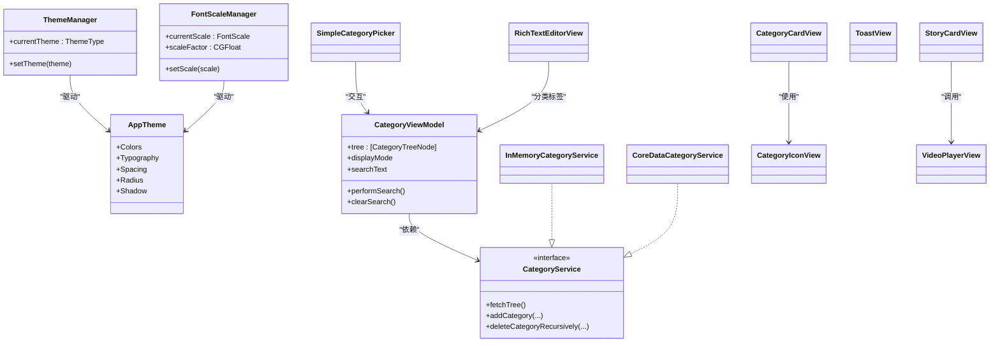

# UI 组件库

<cite>
**本文档引用的文件**
- [AppTheme.swift](file://MyStory/Components/Theme/AppTheme.swift)
- [ThemeSettingsView.swift](file://MyStory/Views/Settings/ThemeSettingsView.swift)
- [FontSettingsView.swift](file://MyStory/Views/Settings/FontSettingsView.swift)
- [StoryCardView.swift](file://MyStory/Components/StoryCardView.swift)
- [CategoryCardView.swift](file://MyStory/Components/Category/CategoryCardView.swift)
- [CategoryIconView.swift](file://MyStory/Components/Category/CategoryIconView.swift)
- [SimpleCategoryPicker.swift](file://MyStory/Components/Category/SimpleCategoryPicker.swift)
- [VideoPlayerView.swift](file://MyStory/Components/VideoPlayerView.swift)
- [ToastView.swift](file://MyStory/Components/ToastView.swift)
- [RichTextEditorView.swift](file://MyStory/Components/RichTextEditorView.swift)
- [CategoryModel.swift](file://MyStory/Models/Category/CategoryModel.swift)
- [CategoryViewModel.swift](file://MyStory/ViewModels/Category/CategoryViewModel.swift)
- [CategoryService.swift](file://MyStory/Services/CategoryService/CategoryService.swift)
- [FullScreenStoryView.swift](file://MyStory/Views/Timeline/FullScreenStoryView.swift)
- [NewStoryEditorView.swift](file://MyStory/Views/Editor/NewStoryEditorView.swift)
</cite>

## 目录
1. [简介](#简介)
2. [项目结构](#项目结构)
3. [核心组件](#核心组件)
4. [架构总览](#架构总览)
5. [详细组件分析](#详细组件分析)
6. [依赖关系分析](#依赖关系分析)
7. [性能考量](#性能考量)
8. [故障排查指南](#故障排查指南)
9. [结论](#结论)
10. [附录](#附录)

## 简介
本文件为 MyStory UI 组件库的完整技术文档，覆盖主题系统、故事卡片、分类组件、视频播放器、提示组件以及富文本编辑器等核心 UI 组件的设计与实现。文档面向开发者与产品/设计人员，提供组件的视觉规范、交互行为、属性配置、事件处理、样式定制、响应式与无障碍支持建议、使用示例与最佳实践，以及组件间的组合与复用策略。

## 项目结构
MyStory 的 UI 组件主要位于 Components 目录，配合 Models、ViewModels、Services 与 Views 形成清晰的分层架构。主题系统集中于 AppTheme，通过 ThemeManager 与 FontScaleManager 实现主题与字体缩放的全局管理；故事卡片、分类组件、视频播放器与提示组件分别封装为独立 View；富文本编辑器基于 RichTextKit 提供可扩展的编辑能力。

图表来源
- [AppTheme.swift](file://MyStory/Components/Theme/AppTheme.swift#L154-L307)
- [ThemeSettingsView.swift](file://MyStory/Views/Settings/ThemeSettingsView.swift#L10-L47)
- [FontSettingsView.swift](file://MyStory/Views/Settings/FontSettingsView.swift#L10-L68)
- [StoryCardView.swift](file://MyStory/Components/StoryCardView.swift#L3-L113)
- [CategoryCardView.swift](file://MyStory/Components/Category/CategoryCardView.swift#L9-L46)
- [CategoryIconView.swift](file://MyStory/Components/Category/CategoryIconView.swift#L5-L90)
- [SimpleCategoryPicker.swift](file://MyStory/Components/Category/SimpleCategoryPicker.swift#L5-L101)
- [VideoPlayerView.swift](file://MyStory/Components/VideoPlayerView.swift#L4-L50)
- [ToastView.swift](file://MyStory/Components/ToastView.swift#L115-L150)
- [RichTextEditorView.swift](file://MyStory/Components/RichTextEditorView.swift#L367-L430)
- [CategoryModel.swift](file://MyStory/Models/Category/CategoryModel.swift#L3-L22)
- [CategoryViewModel.swift](file://MyStory/ViewModels/Category/CategoryViewModel.swift#L18-L38)
- [CategoryService.swift](file://MyStory/Services/CategoryService/CategoryService.swift#L22-L42)
- [FullScreenStoryView.swift](file://MyStory/Views/Timeline/FullScreenStoryView.swift#L575-L643)

章节来源
- [AppTheme.swift](file://MyStory/Components/Theme/AppTheme.swift#L1-L328)
- [ThemeSettingsView.swift](file://MyStory/Views/Settings/ThemeSettingsView.swift#L1-L122)
- [FontSettingsView.swift](file://MyStory/Views/Settings/FontSettingsView.swift#L1-L215)
- [StoryCardView.swift](file://MyStory/Components/StoryCardView.swift#L1-L247)
- [CategoryCardView.swift](file://MyStory/Components/Category/CategoryCardView.swift#L1-L62)
- [CategoryIconView.swift](file://MyStory/Components/Category/CategoryIconView.swift#L1-L145)
- [SimpleCategoryPicker.swift](file://MyStory/Components/Category/SimpleCategoryPicker.swift#L1-L259)
- [VideoPlayerView.swift](file://MyStory/Components/VideoPlayerView.swift#L1-L52)
- [ToastView.swift](file://MyStory/Components/ToastView.swift#L1-L158)
- [RichTextEditorView.swift](file://MyStory/Components/RichTextEditorView.swift#L1-L431)
- [CategoryModel.swift](file://MyStory/Models/Category/CategoryModel.swift#L1-L23)
- [CategoryViewModel.swift](file://MyStory/ViewModels/Category/CategoryViewModel.swift#L1-L103)
- [CategoryService.swift](file://MyStory/Services/CategoryService/CategoryService.swift#L1-L675)
- [FullScreenStoryView.swift](file://MyStory/Views/Timeline/FullScreenStoryView.swift#L575-L720)

## 核心组件
- 主题系统：统一的颜色、排版、间距、圆角与阴影令牌，支持主题切换与字体缩放。
- 故事卡片：展示故事内容、媒体网格（图片九宫格或视频缩略图）、分类与位置信息，支持图片画廊与视频全屏播放。
- 分类组件：分类卡片、分类图标、简单分类选择器，支持层级树形展示与单选。
- 视频播放器：全屏视频播放，支持播放控制与关闭。
- 提示组件：Toast 提示，支持多种类型与自动消失。
- 富文本编辑器：基于 RichTextKit 的可扩展编辑器，支持格式切换与字体设置。

章节来源
- [AppTheme.swift](file://MyStory/Components/Theme/AppTheme.swift#L154-L307)
- [StoryCardView.swift](file://MyStory/Components/StoryCardView.swift#L3-L113)
- [CategoryCardView.swift](file://MyStory/Components/Category/CategoryCardView.swift#L9-L46)
- [CategoryIconView.swift](file://MyStory/Components/Category/CategoryIconView.swift#L5-L90)
- [SimpleCategoryPicker.swift](file://MyStory/Components/Category/SimpleCategoryPicker.swift#L5-L101)
- [VideoPlayerView.swift](file://MyStory/Components/VideoPlayerView.swift#L4-L50)
- [ToastView.swift](file://MyStory/Components/ToastView.swift#L115-L150)
- [RichTextEditorView.swift](file://MyStory/Components/RichTextEditorView.swift#L367-L430)

## 架构总览
MyStory 采用 MVVM 与服务抽象相结合的架构。主题系统集中于 AppTheme，通过 ThemeManager 与 FontScaleManager 提供全局状态；业务组件通过服务层访问数据（如 CategoryService），视图模型负责状态管理与交互逻辑；视图层遵循 SwiftUI 的声明式风格，组件间通过绑定与回调进行通信。

图表来源
- [AppTheme.swift](file://MyStory/Components/Theme/AppTheme.swift#L135-L152)
- [AppTheme.swift](file://MyStory/Components/Theme/AppTheme.swift#L69-L90)
- [CategoryService.swift](file://MyStory/Services/CategoryService/CategoryService.swift#L22-L42)
- [CategoryService.swift](file://MyStory/Services/CategoryService/CategoryService.swift#L44-L185)
- [CategoryService.swift](file://MyStory/Services/CategoryService/CategoryService.swift#L189-L450)
- [CategoryViewModel.swift](file://MyStory/ViewModels/Category/CategoryViewModel.swift#L18-L38)
- [CategoryCardView.swift](file://MyStory/Components/Category/CategoryCardView.swift#L9-L46)
- [CategoryIconView.swift](file://MyStory/Components/Category/CategoryIconView.swift#L5-L90)
- [SimpleCategoryPicker.swift](file://MyStory/Components/Category/SimpleCategoryPicker.swift#L5-L101)
- [StoryCardView.swift](file://MyStory/Components/StoryCardView.swift#L3-L113)
- [VideoPlayerView.swift](file://MyStory/Components/VideoPlayerView.swift#L4-L50)
- [ToastView.swift](file://MyStory/Components/ToastView.swift#L115-L150)
- [RichTextEditorView.swift](file://MyStory/Components/RichTextEditorView.swift#L367-L430)

## 详细组件分析

### 主题系统与设置
- 主题类型与颜色令牌：提供经典、海洋、日落三套主题，颜色令牌包括主色、背景、表面、文本、边框、成功/警告/错误等。
- 排版令牌：基于系统字体，结合 FontScaleManager 的缩放因子生成动态字体。
- 间距、圆角与阴影：统一的间距、圆角与阴影令牌，保证视觉一致性。
- 主题设置页：支持主题选择与选中标记动画。
- 字体设置页：滑块调节字体缩放，实时预览，支持重置与应用。

图表来源
- [ThemeSettingsView.swift](file://MyStory/Views/Settings/ThemeSettingsView.swift#L14-L47)
- [AppTheme.swift](file://MyStory/Components/Theme/AppTheme.swift#L135-L152)
- [AppTheme.swift](file://MyStory/Components/Theme/AppTheme.swift#L154-L307)

章节来源
- [AppTheme.swift](file://MyStory/Components/Theme/AppTheme.swift#L1-L328)
- [ThemeSettingsView.swift](file://MyStory/Views/Settings/ThemeSettingsView.swift#L1-L122)
- [FontSettingsView.swift](file://MyStory/Views/Settings/FontSettingsView.swift#L1-L215)

### 故事卡片 StoryCardView
- 视觉与布局：内容文本、媒体网格（图片九宫格或视频缩略图）、分类与位置信息分两行显示。
- 媒体网格策略：存在视频时优先展示第一个视频缩略图；仅图片时按 3×3 网格展示最多 9 张。
- 交互行为：图片点击进入画廊浏览；视频缩略图点击进入全屏播放；分类文本可点击回调。
- 样式定制：通过 AppTheme 的颜色、排版、间距、圆角与阴影统一控制。

图表来源
- [StoryCardView.swift](file://MyStory/Components/StoryCardView.swift#L45-L134)
- [VideoPlayerView.swift](file://MyStory/Components/VideoPlayerView.swift#L9-L50)
- [FullScreenStoryView.swift](file://MyStory/Views/Timeline/FullScreenStoryView.swift#L575-L643)

章节来源
- [StoryCardView.swift](file://MyStory/Components/StoryCardView.swift#L1-L247)
- [VideoPlayerView.swift](file://MyStory/Components/VideoPlayerView.swift#L1-L52)
- [FullScreenStoryView.swift](file://MyStory/Views/Timeline/FullScreenStoryView.swift#L575-L720)

### 分类组件
- 分类卡片 CategoryCardView：支持“子分类数量”和“故事数量”两种显示模式，带图标与边框。
- 分类图标 CategoryIconView：支持系统图标、Assets 预置图标与自定义图标（二选一），根据分类实体或模型渲染。
- 简单分类选择器 SimpleCategoryPicker：导航视图中展示分类树，支持展开/折叠与单选，工具栏提供取消/完成操作。

图表来源
- [CategoryCardView.swift](file://MyStory/Components/Category/CategoryCardView.swift#L9-L46)
- [CategoryIconView.swift](file://MyStory/Components/Category/CategoryIconView.swift#L5-L90)
- [SimpleCategoryPicker.swift](file://MyStory/Components/Category/SimpleCategoryPicker.swift#L5-L101)
- [CategoryModel.swift](file://MyStory/Models/Category/CategoryModel.swift#L3-L22)

章节来源
- [CategoryCardView.swift](file://MyStory/Components/Category/CategoryCardView.swift#L1-L62)
- [CategoryIconView.swift](file://MyStory/Components/Category/CategoryIconView.swift#L1-L145)
- [SimpleCategoryPicker.swift](file://MyStory/Components/Category/SimpleCategoryPicker.swift#L1-L259)
- [CategoryModel.swift](file://MyStory/Models/Category/CategoryModel.swift#L1-L23)

### 视频播放器 VideoPlayerView
- 功能：接收视频 URL，初始化 AVPlayer 并自动播放；支持全屏展示与关闭。
- 交互：顶部右上角关闭按钮，点击后暂停并关闭播放器。
- 样式：黑色背景，全屏填充，关闭按钮带阴影增强可读性。

图表来源
- [StoryCardView.swift](file://MyStory/Components/StoryCardView.swift#L230-L244)
- [VideoPlayerView.swift](file://MyStory/Components/VideoPlayerView.swift#L9-L50)

章节来源
- [VideoPlayerView.swift](file://MyStory/Components/VideoPlayerView.swift#L1-L52)

### 提示组件 ToastView
- 类型：支持 success、error、info、warning 四种类型，每种类型对应图标与颜色。
- 行为：支持自动消失、手动关闭、震动反馈；通过 ViewModifier 注入到任意视图之上。
- 样式：系统背景色、圆角与阴影，底部弹出过渡动画。

图表来源
- [ToastView.swift](file://MyStory/Components/ToastView.swift#L54-L112)
- [ToastView.swift](file://MyStory/Components/ToastView.swift#L115-L150)

章节来源
- [ToastView.swift](file://MyStory/Components/ToastView.swift#L1-L158)

### 富文本编辑器 RichTextEditorView
- 配置：最小高度、背景色、文本内边距、占位符。
- ViewModel：管理富文本内容、格式状态（粗体、斜体、下划线、字号、颜色）、字体设置面板开关、初始文本设置与同步。
- 交互：支持格式切换、字体设置应用、插入文本/时间戳/待办事项；与 UITextView 同步 typingAttributes。
- 使用：作为 View 注入到编辑器中，支持分类标签回调。

图表来源
- [RichTextEditorView.swift](file://MyStory/Components/RichTextEditorView.swift#L367-L430)
- [RichTextEditorView.swift](file://MyStory/Components/RichTextEditorView.swift#L32-L99)
- [RichTextEditorView.swift](file://MyStory/Components/RichTextEditorView.swift#L129-L189)

章节来源
- [RichTextEditorView.swift](file://MyStory/Components/RichTextEditorView.swift#L1-L431)

## 依赖关系分析
- 主题依赖：所有组件均通过 AppTheme 的颜色、排版、间距、圆角与阴影令牌进行样式约束，ThemeManager 与 FontScaleManager 提供全局状态。
- 分类依赖：SimpleCategoryPicker 依赖 CategoryViewModel 与 CategoryService；CategoryCardView 依赖 CategoryIconView；CategoryIconView 依赖 CategoryModel 或 CategoryEntity。
- 媒体依赖：StoryCardView 依赖 MediaStorageService 加载图片/视频缩略图与 URL；VideoPlayerView 依赖 AVKit；全屏图片浏览依赖 FullScreenStoryView 与 ZoomableImageView。
- 编辑器依赖：RichTextEditorView 依赖 RichTextKit，ViewModel 负责与 UITextView 同步。

图表来源
- [AppTheme.swift](file://MyStory/Components/Theme/AppTheme.swift#L154-L307)
- [StoryCardView.swift](file://MyStory/Components/StoryCardView.swift#L3-L113)
- [CategoryCardView.swift](file://MyStory/Components/Category/CategoryCardView.swift#L9-L46)
- [CategoryIconView.swift](file://MyStory/Components/Category/CategoryIconView.swift#L5-L90)
- [SimpleCategoryPicker.swift](file://MyStory/Components/Category/SimpleCategoryPicker.swift#L5-L101)
- [VideoPlayerView.swift](file://MyStory/Components/VideoPlayerView.swift#L4-L50)
- [ToastView.swift](file://MyStory/Components/ToastView.swift#L115-L150)
- [RichTextEditorView.swift](file://MyStory/Components/RichTextEditorView.swift#L367-L430)
- [CategoryViewModel.swift](file://MyStory/ViewModels/Category/CategoryViewModel.swift#L18-L38)
- [CategoryService.swift](file://MyStory/Services/CategoryService/CategoryService.swift#L22-L42)
- [CategoryModel.swift](file://MyStory/Models/Category/CategoryModel.swift#L3-L22)
- [FullScreenStoryView.swift](file://MyStory/Views/Timeline/FullScreenStoryView.swift#L575-L643)

章节来源
- [CategoryViewModel.swift](file://MyStory/ViewModels/Category/CategoryViewModel.swift#L1-L103)
- [CategoryService.swift](file://MyStory/Services/CategoryService/CategoryService.swift#L1-L675)
- [CategoryModel.swift](file://MyStory/Models/Category/CategoryModel.swift#L1-L23)

## 性能考量
- 媒体加载：StoryCardView 在加载图片/视频缩略图时应避免阻塞主线程，建议使用异步加载与缓存策略；视频播放器在 onAppear/onDisappear 中正确释放资源。
- 列表渲染：图片九宫格使用 LazyVGrid，注意控制最大展示数量（如 9 张）以减少布局复杂度。
- 字体缩放：FontScaleManager 通过 scale factor 动态调整排版，避免硬编码字体大小，提升可读性与性能。
- 动画与过渡：Toast 与主题切换使用轻量动画，避免过度动画影响滚动性能。
- 数据预取：CoreDataCategoryService 在查询时预加载关系数据，减少 fault 导致的二次查询与计数错误。

## 故障排查指南
- 视频播放失败：检查 StoryCardView 中视频 URL 加载逻辑与 VideoPlayerView 初始化；确认 URL 非空且可访问。
- 图片显示异常：确认 MediaStorageService 正确返回图片或缩略图；若无可用图片，组件应显示占位符。
- 分类选择无效：检查 SimpleCategoryPicker 的 selectedCategories 绑定与 toggleSelection 的单选逻辑。
- 富文本格式不同步：确保 RichTextEditorViewModel 在设置 UITextView 引用后及时同步 typingAttributes。
- 主题切换不生效：确认 ThemeManager 的 currentTheme 变更后 AppTheme 颜色/排版令牌被重新读取。

章节来源
- [StoryCardView.swift](file://MyStory/Components/StoryCardView.swift#L230-L244)
- [VideoPlayerView.swift](file://MyStory/Components/VideoPlayerView.swift#L38-L50)
- [SimpleCategoryPicker.swift](file://MyStory/Components/Category/SimpleCategoryPicker.swift#L239-L247)
- [RichTextEditorView.swift](file://MyStory/Components/RichTextEditorView.swift#L129-L189)
- [CategoryService.swift](file://MyStory/Services/CategoryService/CategoryService.swift#L204-L219)

## 结论
MyStory UI 组件库通过集中化的主题系统与统一的令牌体系，实现了跨组件的一致性与可扩展性；故事卡片、分类组件、视频播放器与提示组件满足典型内容展示与交互需求；富文本编辑器提供了良好的可定制性与格式支持。建议在实际集成中遵循组件的属性与事件约定，结合主题与字体设置提升用户体验，并注意媒体加载与资源释放的性能优化。

## 附录
- 组件使用示例与最佳实践
  - 主题设置：在设置页中选择主题，ThemeManager 自动持久化并触发全局刷新。
  - 字体设置：在字体设置页中滑动调节，预览即时生效，退出时应用到全局。
  - 故事卡片：传入 StoryEntity 与可选回调；图片九宫格最多展示 9 张，视频优先展示缩略图。
  - 分类选择：SimpleCategoryPicker 支持单选，工具栏提供取消/完成；分类图标支持系统/Assets/自定义三种来源。
  - 视频播放：通过 StoryCardView 触发全屏播放，VideoPlayerView 自动播放并支持关闭。
  - 提示组件：通过 View.modifier 显示 Toast，合理设置持续时间与类型。
  - 富文本编辑：通过 RichTextEditorView 与 ViewModel 配合，支持格式切换与字体设置。

- 组合与复用策略
  - 组件组合：StoryCardView 可组合 CategoryCardView 与 CategoryIconView；SimpleCategoryPicker 与 CategoryViewModel 解耦分类树与选择逻辑。
  - 复用策略：AppTheme 作为单一事实源，所有组件共享颜色、排版与间距；字体缩放通过 FontScaleManager 统一管理；分类图标通过 CategoryIconView 抽象图标来源。