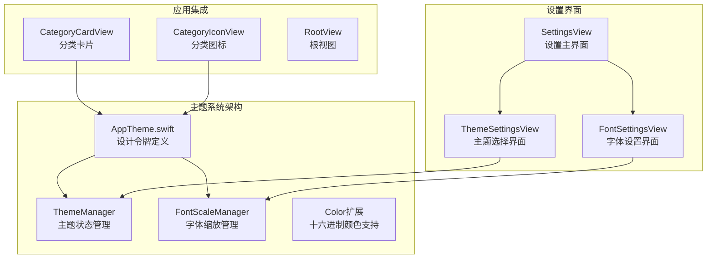
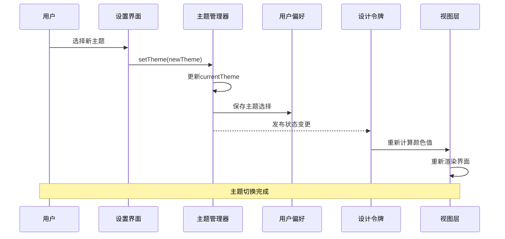
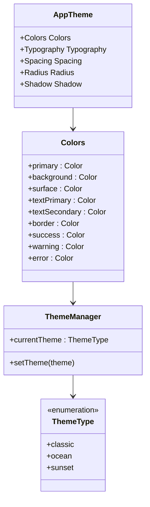
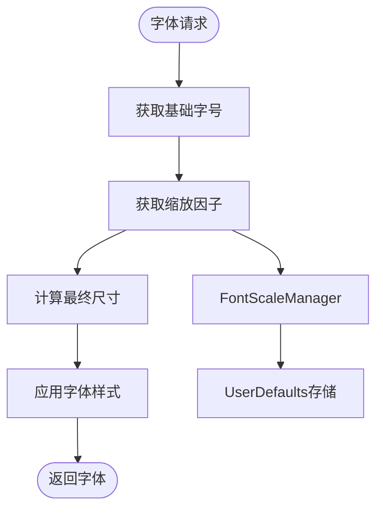
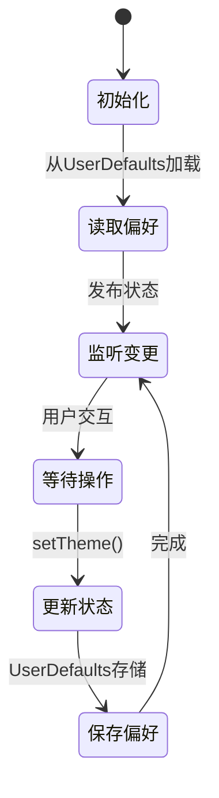
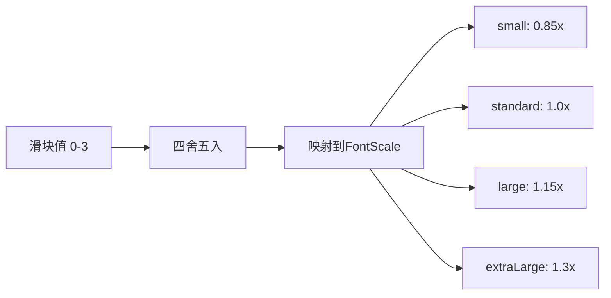
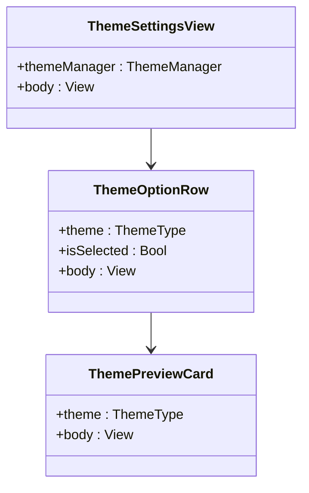
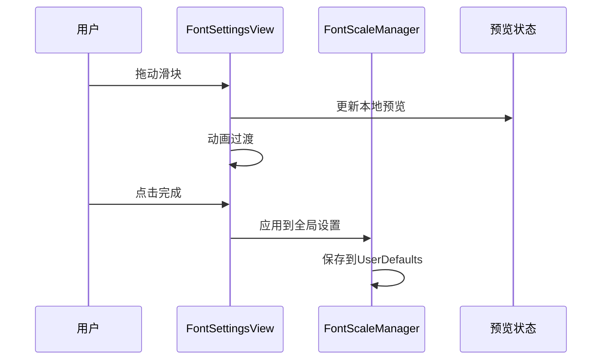
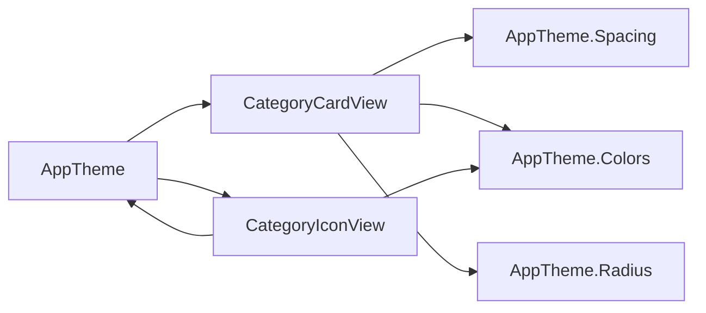
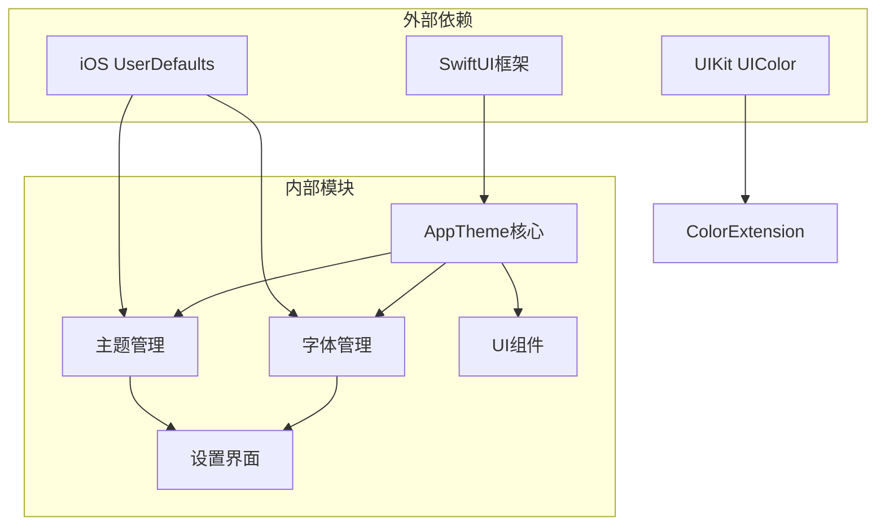

# 主题系统

<cite>
**本文档引用的文件**
- [AppTheme.swift](file://MyStory/Components/Theme/AppTheme.swift)
- [ThemeSettingsView.swift](file://MyStory/Views/Settings/ThemeSettingsView.swift)
- [FontSettingsView.swift](file://MyStory/Views/Settings/FontSettingsView.swift)
- [FontSettingsSheet.swift](file://MyStory/Components/FontSettingsSheet.swift)
- [SettingsView.swift](file://MyStory/Views/Settings/SettingsView.swift)
- [CategoryCardView.swift](file://MyStory/Components/Category/CategoryCardView.swift)
- [CategoryIconView.swift](file://MyStory/Components/Category/CategoryIconView.swift)
- [MyStoryApp.swift](file://MyStory/MyStoryApp.swift)
</cite>

## 目录
1. [简介](#简介)
2. [项目结构](#项目结构)
3. [核心组件](#核心组件)
4. [架构概览](#架构概览)
5. [详细组件分析](#详细组件分析)
6. [依赖关系分析](#依赖关系分析)
7. [性能考虑](#性能考虑)
8. [故障排除指南](#故障排除指南)
9. [结论](#结论)
10. [附录](#附录)

## 简介
本主题系统为 MyStory 应用提供了完整的视觉设计解决方案，包括主题切换、字体缩放和颜色管理。系统采用 SwiftUI 架构，通过单一的 AppTheme 结构体提供统一的设计令牌，支持三种预设主题（classic、ocean、sunset）和四种字体缩放级别（small、standard、large、extraLarge）。

## 项目结构
主题系统主要位于 Components/Theme 目录下，与设置界面紧密集成：

**图表来源**
- [AppTheme.swift](file://MyStory/Components/Theme/AppTheme.swift#L1-L328)
- [ThemeSettingsView.swift](file://MyStory/Views/Settings/ThemeSettingsView.swift#L1-L122)
- [FontSettingsView.swift](file://MyStory/Views/Settings/FontSettingsView.swift#L1-L215)

**章节来源**
- [AppTheme.swift](file://MyStory/Components/Theme/AppTheme.swift#L1-L328)
- [ThemeSettingsView.swift](file://MyStory/Views/Settings/ThemeSettingsView.swift#L1-L122)
- [FontSettingsView.swift](file://MyStory/Views/Settings/FontSettingsView.swift#L1-L215)

## 核心组件
主题系统包含以下核心组件：

### 设计令牌结构
AppTheme 提供了完整的视觉设计令牌体系：
- **颜色系统**：primary、background、surface、textPrimary、textSecondary、border、success、warning、error
- **字体系统**：largeTitle、title1、title2、title3、headline、body、callout、subheadline、footnote、caption
- **间距系统**：xs、s、m、l、xl、xxl
- **圆角系统**：s、m、l
- **阴影系统**：small、medium、large

### 主题管理器
ThemeManager 是单例类，负责维护当前主题状态并通过 UserDefaults 实现持久化存储。

### 字体缩放管理器
FontScaleManager 提供动态字体缩放功能，支持四种预设缩放级别。

**章节来源**
- [AppTheme.swift](file://MyStory/Components/Theme/AppTheme.swift#L154-L307)
- [AppTheme.swift](file://MyStory/Components/Theme/AppTheme.swift#L135-L152)
- [AppTheme.swift](file://MyStory/Components/Theme/AppTheme.swift#L69-L90)

## 架构概览
主题系统采用观察者模式和单一数据源设计：

**图表来源**
- [ThemeSettingsView.swift](file://MyStory/Views/Settings/ThemeSettingsView.swift#L24-L28)
- [AppTheme.swift](file://MyStory/Components/Theme/AppTheme.swift#L138-L141)
- [AppTheme.swift](file://MyStory/Components/Theme/AppTheme.swift#L158-L167)

## 详细组件分析

### AppTheme 设计令牌系统

#### 颜色管理系统
AppTheme.Colors 提供了完整的颜色层次结构：

**图表来源**
- [AppTheme.swift](file://MyStory/Components/Theme/AppTheme.swift#L154-L216)
- [AppTheme.swift](file://MyStory/Components/Theme/AppTheme.swift#L135-L152)
- [AppTheme.swift](file://MyStory/Components/Theme/AppTheme.swift#L93-L132)

每个主题的颜色方案都经过精心设计：

| 主题 | primary | background | surface | 描述 |
|------|---------|------------|---------|------|
| classic | 蓝色 (#007AFF) | 白色 (#FFFFFF) | 浅灰 (#F2F2F7) | 经典 iOS 配色 |
| ocean | 青蓝色 (#00B4D8) | 浅蓝 (#F0F9FF) | 浅青 (#E8F4F8) | 海洋主题 |
| sunset | 橙红色 (#FF6B6B) | 浅粉 (#FFF5F5) | 浅橙 (#FFF0E8) | 日落主题 |

#### 字体系统设计
AppTheme.Typography 基于 iOS 系统字体标准，结合 FontScaleManager 实现动态缩放：

**图表来源**
- [AppTheme.swift](file://MyStory/Components/Theme/AppTheme.swift#L218-L278)
- [AppTheme.swift](file://MyStory/Components/Theme/AppTheme.swift#L69-L90)

字体缩放级别映射：
- small: 0.85x (14px)
- standard: 1.0x (17px)
- large: 1.15x (19px)
- extraLarge: 1.3x (22px)

**章节来源**
- [AppTheme.swift](file://MyStory/Components/Theme/AppTheme.swift#L154-L307)

### ThemeManager 主题管理器

#### 单例模式实现
ThemeManager 采用单例模式确保全局状态一致性：

**图表来源**
- [AppTheme.swift](file://MyStory/Components/Theme/AppTheme.swift#L135-L152)

#### 主题切换机制
主题切换通过 @Published 属性触发 SwiftUI 视图自动重绘，实现无缝过渡效果。

**章节来源**
- [AppTheme.swift](file://MyStory/Components/Theme/AppTheme.swift#L135-L152)

### FontScaleManager 字体缩放管理器

#### 滑块值映射
FontScale 提供了滑块值与缩放级别的双向映射：

**图表来源**
- [AppTheme.swift](file://MyStory/Components/Theme/AppTheme.swift#L51-L65)

#### 预览与应用机制
FontSettingsView 实现了预览与应用分离的设计：
- 预览状态仅在本地更新，不影响全局设置
- 用户确认或关闭时才应用到全局 FontScaleManager

**章节来源**
- [AppTheme.swift](file://MyStory/Components/Theme/AppTheme.swift#L69-L90)
- [FontSettingsView.swift](file://MyStory/Views/Settings/FontSettingsView.swift#L14-L22)

### 设置界面集成

#### 主题设置界面
ThemeSettingsView 提供直观的主题选择体验：

**图表来源**
- [ThemeSettingsView.swift](file://MyStory/Views/Settings/ThemeSettingsView.swift#L10-L48)
- [ThemeSettingsView.swift](file://MyStory/Views/Settings/ThemeSettingsView.swift#L51-L84)

#### 字体设置界面
FontSettingsView 提供完整的字体缩放控制：

**图表来源**
- [FontSettingsView.swift](file://MyStory/Views/Settings/FontSettingsView.swift#L158-L166)
- [FontSettingsView.swift](file://MyStory/Views/Settings/FontSettingsView.swift#L205-L209)

**章节来源**
- [ThemeSettingsView.swift](file://MyStory/Views/Settings/ThemeSettingsView.swift#L1-L122)
- [FontSettingsView.swift](file://MyStory/Views/Settings/FontSettingsView.swift#L1-L215)

### 视图层集成

#### 分类卡片集成
CategoryCardView 和 CategoryIconView 通过 AppTheme 统一使用设计令牌：

**图表来源**
- [CategoryCardView.swift](file://MyStory/Components/Category/CategoryCardView.swift#L18-L45)
- [CategoryIconView.swift](file://MyStory/Components/Category/CategoryIconView.swift#L36-L46)

#### 字体设置面板
FontSettingsSheet 提供编辑器专用的字体设置功能：

**章节来源**
- [CategoryCardView.swift](file://MyStory/Components/Category/CategoryCardView.swift#L1-L62)
- [CategoryIconView.swift](file://MyStory/Components/Category/CategoryIconView.swift#L1-L86)
- [FontSettingsSheet.swift](file://MyStory/Components/FontSettingsSheet.swift#L1-L178)

## 依赖关系分析

**图表来源**
- [AppTheme.swift](file://MyStory/Components/Theme/AppTheme.swift#L1-L328)
- [MyStoryApp.swift](file://MyStory/MyStoryApp.swift#L1-L31)

### 关键依赖关系
- **ThemeManager** 依赖 UserDefaults 实现主题持久化
- **FontScaleManager** 依赖 UserDefaults 实现字体缩放偏好存储
- **ColorExtension** 依赖 UIColor 获取颜色亮度信息
- **所有视图** 依赖 AppTheme 提供的设计令牌

**章节来源**
- [AppTheme.swift](file://MyStory/Components/Theme/AppTheme.swift#L72-L81)
- [AppTheme.swift](file://MyStory/Components/Theme/AppTheme.swift#L138-L147)
- [FontSettingsSheet.swift](file://MyStory/Components/FontSettingsSheet.swift#L150-L159)

## 性能考虑
主题系统在性能方面采用了多项优化策略：

### 内存管理
- 使用静态属性避免重复创建颜色对象
- 单例模式确保 ThemeManager 和 FontScaleManager 的唯一性
- @MainActor 修饰符确保 UI 相关属性在主线程访问

### 渲染优化
- SwiftUI 的声明式语法自动处理视图更新
- @Published 属性触发细粒度的视图重绘
- 预览状态与应用状态分离减少不必要的重渲染

### 存储优化
- UserDefaults 异步存储避免阻塞主线程
- 缓存机制避免重复解析十六进制颜色字符串

## 故障排除指南

### 常见问题及解决方案

#### 主题切换无效
**症状**：更改主题后界面无变化  
**原因**：视图未正确订阅 ThemeManager 的状态变化  
**解决**：确保使用 @ObservedObject 或直接访问 ThemeManager.shared

#### 字体缩放异常
**症状**：字体大小不符合预期  
**原因**：FontScaleManager 未正确初始化或 UserDefaults 数据损坏  
**解决**：重置字体设置到默认值或删除应用偏好

#### 颜色显示错误
**症状**：颜色显示为默认色而非自定义色  
**原因**：十六进制颜色字符串格式错误  
**解决**：检查颜色字符串格式（#RRGGBB），确保十六进制字符有效

#### 预览功能失效
**症状**：字体预览滑块无法正常工作  
**原因**：状态绑定问题或动画冲突  
**解决**：检查 @State 和 @Binding 属性的正确使用

**章节来源**
- [AppTheme.swift](file://MyStory/Components/Theme/AppTheme.swift#L310-L327)
- [FontSettingsView.swift](file://MyStory/Views/Settings/FontSettingsView.swift#L160-L166)

## 结论
MyStory 的主题系统通过精心设计的架构实现了高度一致的用户体验。系统的核心优势包括：

1. **统一的设计令牌**：通过 AppTheme 提供完整的视觉设计规范
2. **灵活的主题切换**：支持三种预设主题和动态颜色计算
3. **智能的字体管理**：基于系统字体标准的可访问性设计
4. **完善的持久化机制**：通过 UserDefaults 实现用户偏好的长期保存
5. **优雅的集成方式**：与 SwiftUI 的声明式编程模型完美契合

该系统为应用提供了坚实的设计基础，支持未来的功能扩展和定制需求。

## 附录

### 主题自定义指南

#### 添加新主题
1. 在 ThemeType 中添加新的枚举值
2. 在 AppTheme.Colors 中添加对应的颜色计算逻辑
3. 在 ThemeSettingsView 中更新主题预览显示
4. 添加本地化字符串资源

#### 修改颜色方案
1. 直接修改 AppTheme.Colors 中的颜色值
2. 确保颜色值符合 WCAG 可访问性标准
3. 测试深色模式下的颜色对比度

#### 调整字体比例
1. 在 FontScale 中添加新的缩放级别
2. 更新滑块值映射关系
3. 测试不同设备上的字体显示效果

#### 集成到现有视图
1. 导入 AppTheme
2. 使用 AppTheme.Colors、AppTheme.Typography 等设计令牌
3. 避免硬编码颜色和字体值

**章节来源**
- [AppTheme.swift](file://MyStory/Components/Theme/AppTheme.swift#L93-L132)
- [AppTheme.swift](file://MyStory/Components/Theme/AppTheme.swift#L4-L65)