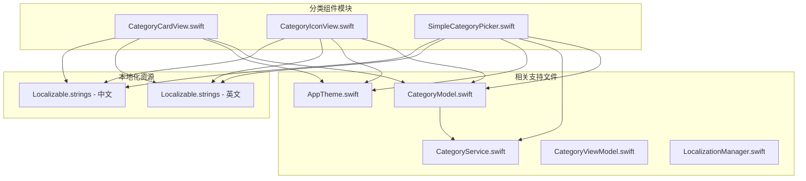
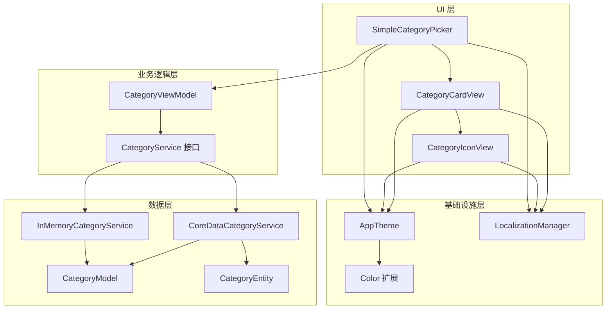
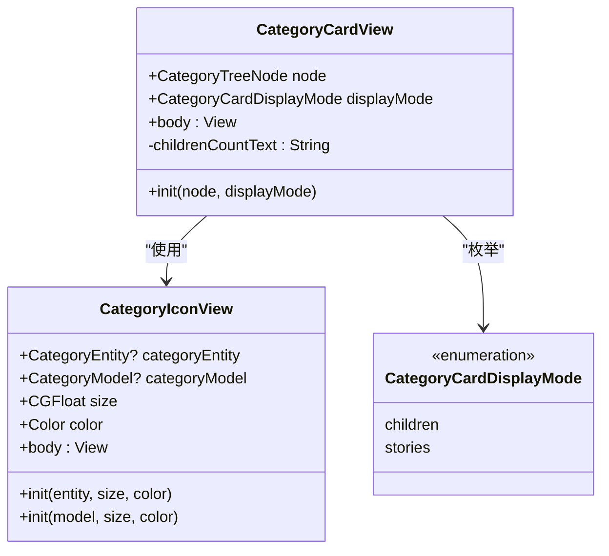
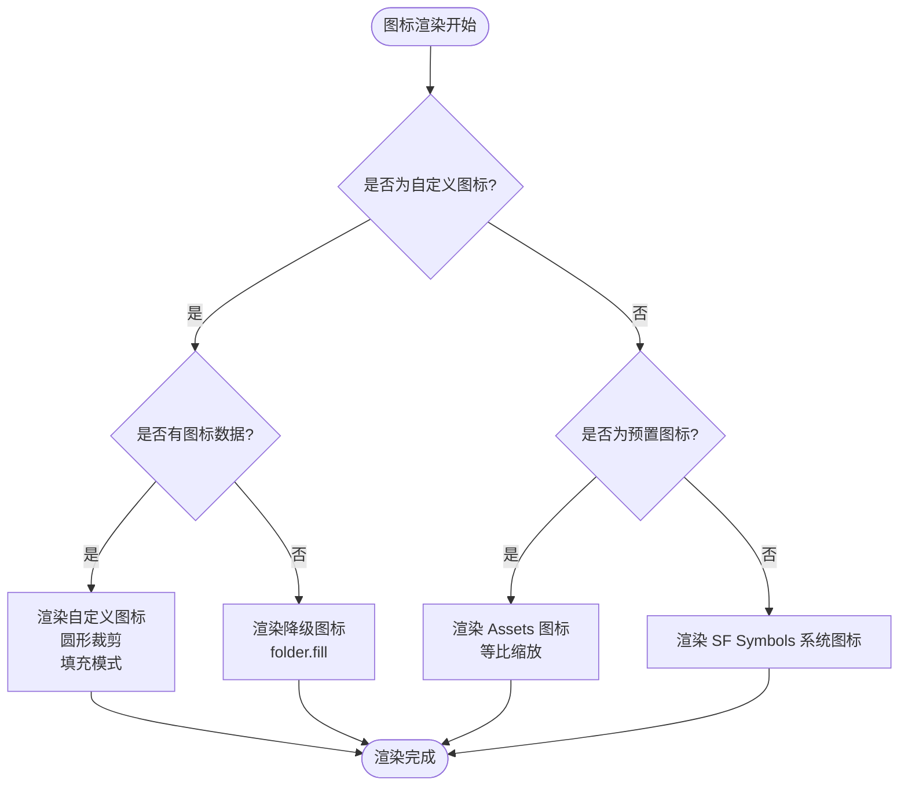
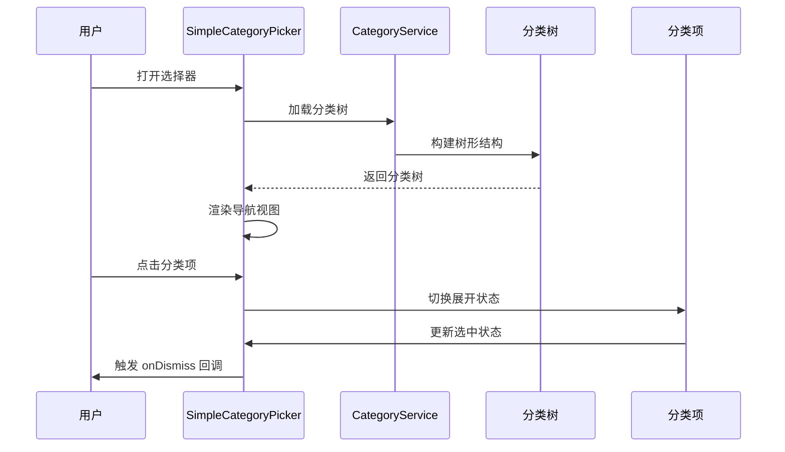
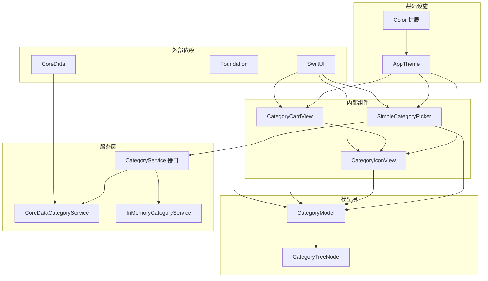

# 分类组件

<cite>
**本文档引用的文件**
- [CategoryCardView.swift](file://MyStory/Components/Category/CategoryCardView.swift)
- [CategoryIconView.swift](file://MyStory/Components/Category/CategoryIconView.swift)
- [SimpleCategoryPicker.swift](file://MyStory/Components/Category/SimpleCategoryPicker.swift)
- [CategoryModel.swift](file://MyStory/Models/Category/CategoryModel.swift)
- [CategoryService.swift](file://MyStory/Services/CategoryService/CategoryService.swift)
- [CategoryViewModel.swift](file://MyStory/ViewModels/Category/CategoryViewModel.swift)
- [CategoryListView.swift](file://MyStory/Views/Category/CategoryListView.swift)
- [AppTheme.swift](file://MyStory/Components/Theme/AppTheme.swift)
- [LocalizationManager.swift](file://MyStory/Utils/LocalizationManager.swift)
- [Localizable.strings（英文）](file://MyStory/Resources/Localizable/en.lproj/Localizable.strings)
- [Localizable.strings（中文）](file://MyStory/Resources/Localizable/zh-Hans.lproj/Localizable.strings)
</cite>

## 目录
1. [简介](#简介)
2. [项目结构](#项目结构)
3. [核心组件](#核心组件)
4. [架构概览](#架构概览)
5. [详细组件分析](#详细组件分析)
6. [依赖关系分析](#依赖关系分析)
7. [性能考虑](#性能考虑)
8. [故障排除指南](#故障排除指南)
9. [结论](#结论)
10. [附录](#附录)

## 简介

分类组件系列是 MyStory 应用中用于管理和展示分类系统的三个核心 SwiftUI 组件。这些组件提供了完整的分类管理解决方案，包括分类卡片显示、分类图标渲染和分类选择器功能。

本系列包含三个主要组件：
- **CategoryCardView**：分类卡片显示组件，用于在界面中展示分类信息
- **CategoryIconView**：分类图标组件，支持系统图标、自定义图标和预置图标
- **SimpleCategoryPicker**：简单分类选择器，提供分类树形结构的选择界面

这些组件遵循统一的设计原则，具有良好的可扩展性和可定制性，支持响应式设计和多语言国际化。

## 项目结构

分类组件位于应用的 Components/Category 目录下，采用清晰的模块化组织结构：

**图表来源**
- [CategoryCardView.swift](file://MyStory/Components/Category/CategoryCardView.swift#L1-L62)
- [CategoryIconView.swift](file://MyStory/Components/Category/CategoryIconView.swift#L1-L145)
- [SimpleCategoryPicker.swift](file://MyStory/Components/Category/SimpleCategoryPicker.swift#L1-L259)

**章节来源**
- [CategoryCardView.swift](file://MyStory/Components/Category/CategoryCardView.swift#L1-L62)
- [CategoryIconView.swift](file://MyStory/Components/Category/CategoryIconView.swift#L1-L145)
- [SimpleCategoryPicker.swift](file://MyStory/Components/Category/SimpleCategoryPicker.swift#L1-L259)

## 核心组件

### CategoryCardView（分类卡片）

CategoryCardView 是一个专门用于显示分类信息的 SwiftUI 视图组件。它提供了两种显示模式：子分类数量显示和故事数量显示。

**主要特性：**
- 支持两种显示模式：子分类数量和故事数量
- 集成 CategoryIconView 用于图标显示
- 响应式布局设计
- 主题化样式支持

**关键属性：**
- `node`: CategoryTreeNode 类型，包含分类的完整树形结构信息
- `displayMode`: CategoryCardDisplayMode 枚举，控制显示模式

**章节来源**
- [CategoryCardView.swift](file://MyStory/Components/Category/CategoryCardView.swift#L9-L16)

### CategoryIconView（分类图标）

CategoryIconView 是一个高度灵活的图标显示组件，支持多种图标源和显示方式。

**支持的图标类型：**
- **系统图标**：基于 SF Symbols 的系统图标
- **自定义图标**：用户上传的自定义图像
- **预置图标**：内置的 Assets 图标集合

**主要特性：**
- 自动检测图标类型并选择合适的显示方式
- 支持圆形裁剪和自适应尺寸
- 动态颜色绑定
- 优雅降级机制

**关键属性：**
- `categoryEntity`: CategoryEntity?，分类实体
- `categoryModel`: CategoryModel?，分类模型
- `size`: CGFloat，图标尺寸
- `color`: Color，图标颜色

**章节来源**
- [CategoryIconView.swift](file://MyStory/Components/Category/CategoryIconView.swift#L5-L46)

### SimpleCategoryPicker（简单分类选择器）

SimpleCategoryPicker 是一个完整的分类选择界面，提供树形结构的分类浏览和选择功能。

**核心功能：**
- 分层分类树形显示（三级结构）
- 折叠/展开交互
- 多级分类选择
- 实时分类统计

**界面特性：**
- 导航栏集成
- 工具栏按钮
- 空状态处理
- 动画过渡效果

**章节来源**
- [SimpleCategoryPicker.swift](file://MyStory/Components/Category/SimpleCategoryPicker.swift#L5-L24)

## 架构概览

分类组件系列采用了清晰的分层架构，实现了关注点分离和组件复用：

**图表来源**
- [CategoryCardView.swift](file://MyStory/Components/Category/CategoryCardView.swift#L1-L62)
- [CategoryIconView.swift](file://MyStory/Components/Category/CategoryIconView.swift#L1-L145)
- [SimpleCategoryPicker.swift](file://MyStory/Components/Category/SimpleCategoryPicker.swift#L1-L259)
- [CategoryViewModel.swift](file://MyStory/ViewModels/Category/CategoryViewModel.swift#L1-L103)
- [CategoryService.swift](file://MyStory/Services/CategoryService/CategoryService.swift#L22-L42)

## 详细组件分析

### CategoryCardView 组件分析

CategoryCardView 实现了一个美观的分类卡片界面，具有以下设计特点：

**图表来源**
- [CategoryCardView.swift](file://MyStory/Components/Category/CategoryCardView.swift#L9-L16)
- [CategoryIconView.swift](file://MyStory/Components/Category/CategoryIconView.swift#L5-L46)

**组件特性：**
- **响应式设计**：使用 AppTheme 的间距和圆角常量
- **条件显示**：根据 displayMode 动态显示不同统计信息
- **本地化支持**：所有文本都通过 localized 方法进行本地化
- **主题集成**：完全集成到 AppTheme 系统中

**章节来源**
- [CategoryCardView.swift](file://MyStory/Components/Category/CategoryCardView.swift#L18-L61)

### CategoryIconView 组件分析

CategoryIconView 是一个复杂的图标渲染组件，实现了智能的图标选择逻辑：

**图表来源**
- [CategoryIconView.swift](file://MyStory/Components/Category/CategoryIconView.swift#L50-L73)

**智能图标选择逻辑：**
1. **自定义图标优先**：检查 iconType 是否为 "custom"
2. **Assets 图标检查**：验证图标名称是否在预置列表中
3. **系统图标回退**：使用 SF Symbols 作为最终回退方案

**章节来源**
- [CategoryIconView.swift](file://MyStory/Components/Category/CategoryIconView.swift#L94-L122)

### SimpleCategoryPicker 组件分析

SimpleCategoryPicker 实现了一个完整的分类选择界面，支持复杂的树形结构：

**图表来源**
- [SimpleCategoryPicker.swift](file://MyStory/Components/Category/SimpleCategoryPicker.swift#L96-L100)

**交互流程：**
1. **初始化加载**：组件出现时自动加载分类数据
2. **层次化显示**：一级分类作为 Section 头部
3. **动态展开**：二级分类可展开显示三级分类
4. **单选模式**：每次只能选择一个三级分类

**章节来源**
- [SimpleCategoryPicker.swift](file://MyStory/Components/Category/SimpleCategoryPicker.swift#L28-L101)

## 依赖关系分析

分类组件系列的依赖关系体现了清晰的分层设计：

**图表来源**
- [CategoryCardView.swift](file://MyStory/Components/Category/CategoryCardView.swift#L1-L2)
- [CategoryIconView.swift](file://MyStory/Components/Category/CategoryIconView.swift#L1-L2)
- [SimpleCategoryPicker.swift](file://MyStory/Components/Category/SimpleCategoryPicker.swift#L1-L2)
- [CategoryService.swift](file://MyStory/Services/CategoryService/CategoryService.swift#L1-L3)

**依赖特点：**
- **松耦合设计**：组件之间通过协议和接口通信
- **可测试性**：支持内存服务实现用于测试
- **可扩展性**：新的图标类型和显示模式易于添加

**章节来源**
- [CategoryService.swift](file://MyStory/Services/CategoryService/CategoryService.swift#L22-L42)

## 性能考虑

### 数据加载优化

分类组件在数据加载方面采用了多项优化策略：

1. **关系预加载**：CoreDataCategoryService 使用 relationshipKeyPathsForPrefetching 预加载关联数据
2. **Fault 处理**：避免 Core Data Fault 导致的数据访问问题
3. **异步加载**：使用 @MainActor 确保 UI 更新的线程安全

### 渲染性能

1. **条件渲染**：使用 Group 和条件语句减少不必要的视图创建
2. **状态管理**：合理使用 @State 和 @Binding 减少不必要的重渲染
3. **动画优化**：使用 withAnimation 包装动画操作

### 内存管理

1. **弱引用**：避免循环引用的潜在问题
2. **及时释放**：组件销毁时自动释放资源
3. **数据缓存**：ViewModel 层面的数据缓存机制

## 故障排除指南

### 常见问题及解决方案

**图标显示异常**
- 检查 iconType 字段值是否正确
- 验证自定义图标数据格式
- 确认 Assets 中图标名称存在

**分类树加载失败**
- 检查 CoreData 数据库连接
- 验证 CategoryEntity 关系映射
- 确认数据完整性约束

**本地化文本不显示**
- 检查 Localizable.strings 文件完整性
- 验证语言包路径配置
- 确认 NSLocalizedString 调用正确

**章节来源**
- [CategoryIconView.swift](file://MyStory/Components/Category/CategoryIconView.swift#L52-L64)
- [CategoryService.swift](file://MyStory/Services/CategoryService/CategoryService.swift#L209-L218)

## 结论

分类组件系列展现了优秀的软件工程实践，具有以下突出特点：

1. **模块化设计**：清晰的职责分离和组件边界
2. **可扩展性**：易于添加新的图标类型和显示模式
3. **国际化支持**：完整的多语言本地化实现
4. **性能优化**：针对 SwiftUI 和 CoreData 的专门优化
5. **用户体验**：直观的交互设计和流畅的动画效果

这些组件为 MyStory 应用提供了强大而灵活的分类管理能力，为用户提供了优秀的分类体验。

## 附录

### 组件属性配置参考

**CategoryCardView 属性**
- `node`: CategoryTreeNode - 分类树节点
- `displayMode`: CategoryCardDisplayMode - 显示模式

**CategoryIconView 属性**
- `entity`: CategoryEntity - 分类实体
- `model`: CategoryModel - 分类模型
- `size`: CGFloat - 图标尺寸，默认 42
- `color`: Color - 图标颜色，可选

**SimpleCategoryPicker 属性**
- `selectedCategories`: Binding<Set<UUID>> - 选中的分类 ID 集合
- `onDismiss`: () -> Void - 关闭回调

### 事件处理和状态同步

组件间的状态同步通过以下机制实现：
- **ViewModel 驱动**：CategoryViewModel 管理分类数据状态
- **Binding 传递**：SwiftUI 的 @Binding 属性实现双向数据绑定
- **回调机制**：onDismiss 等回调函数处理用户交互
- **环境注入**：@Environment 属性获取应用上下文

### 样式定制方法

**主题定制**
- 通过 AppTheme 修改颜色、字体和间距
- 支持多主题切换（Classic、Ocean、Sunset）
- 动态字体缩放支持

**组件定制**
- 自定义图标尺寸和颜色
- 调整显示模式和布局
- 扩展新的图标类型支持