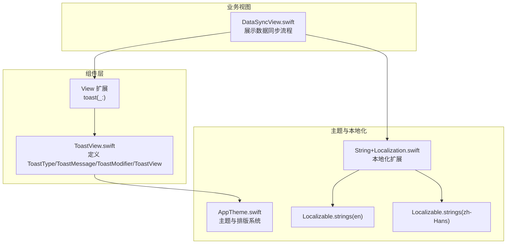
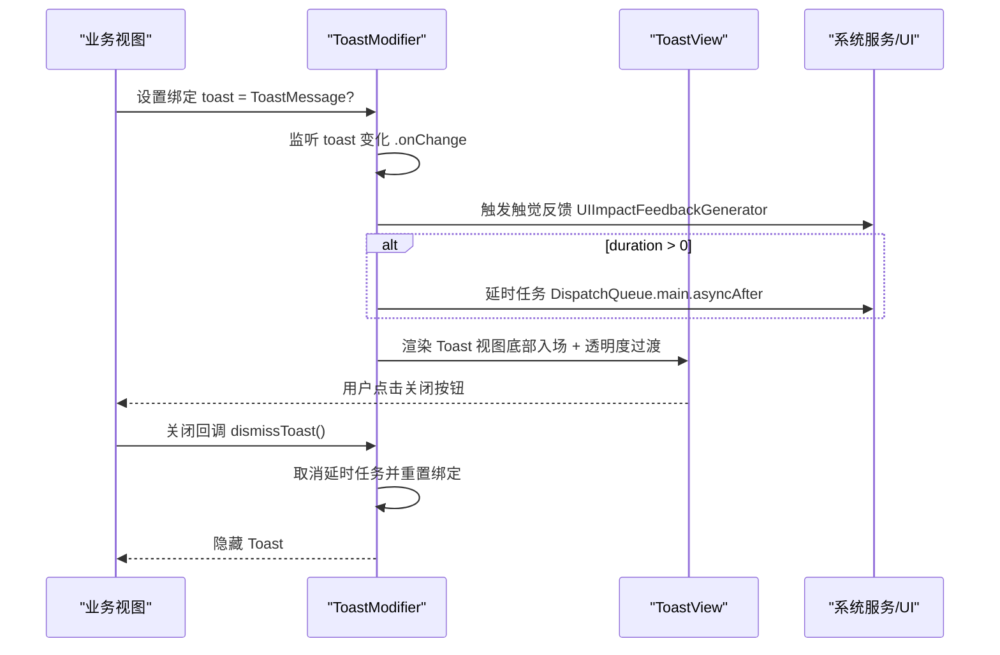
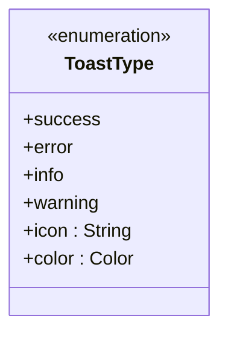
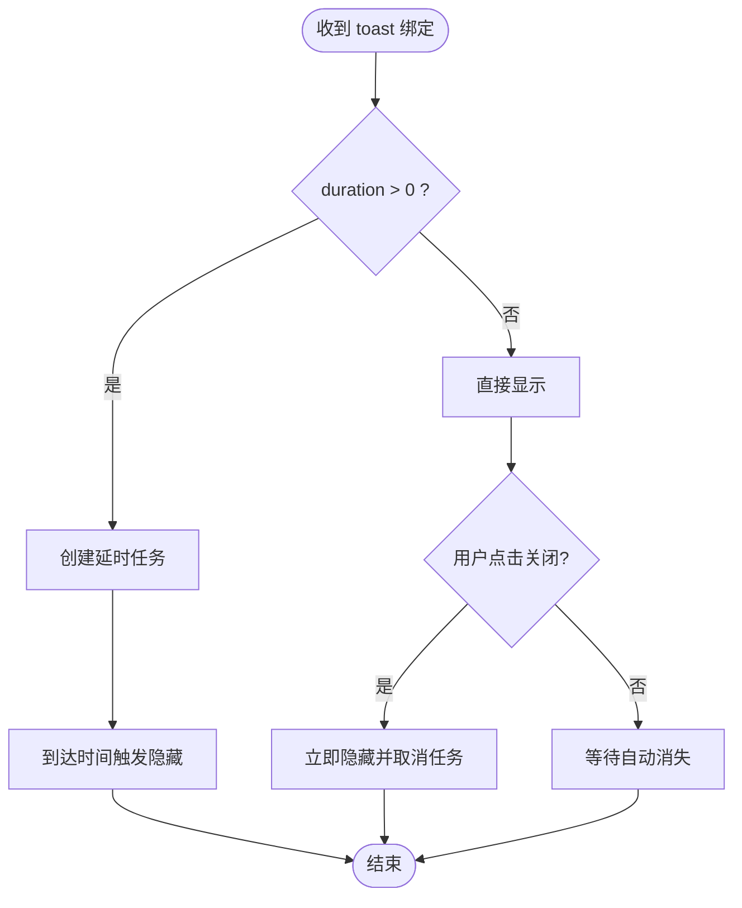
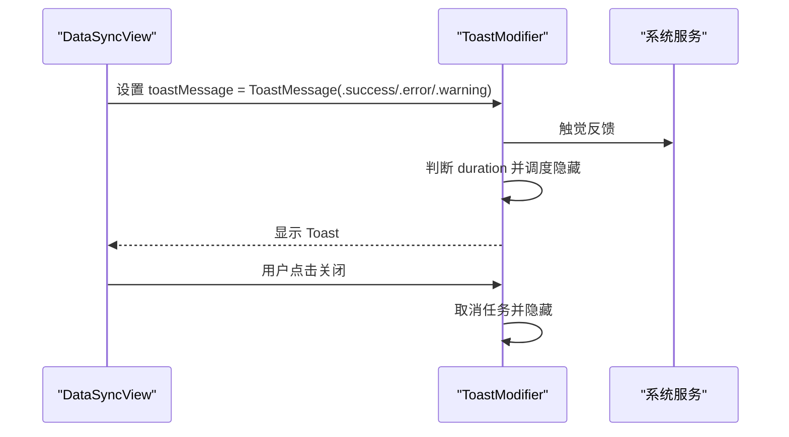
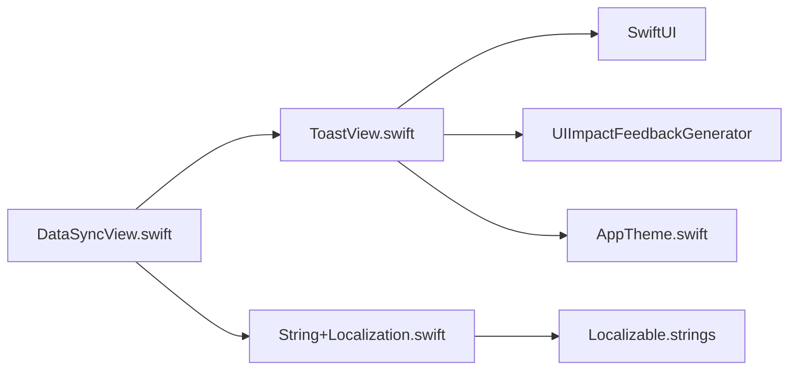

# 反馈组件

<cite>
**本文档引用的文件**
- [ToastView.swift](file://MyStory/Components/ToastView.swift)
- [ToastView.swift](file://MyStory/Views/Components/ToastView.swift)
- [DataSyncView.swift](file://MyStory/Views/Settings/DataSyncView.swift)
- [AppTheme.swift](file://MyStory/Components/Theme/AppTheme.swift)
- [String+Localization.swift](file://MyStory/Utils/String+Localization.swift)
- [en.lproj/Localizable.strings](file://MyStory/Resources/Localizable/en.lproj/Localizable.strings)
- [zh-Hans.lproj/Localizable.strings](file://MyStory/Resources/Localizable/zh-Hans.lproj/Localizable.strings)
</cite>

## 目录
1. [简介](#简介)
2. [项目结构](#项目结构)
3. [核心组件](#核心组件)
4. [架构总览](#架构总览)
5. [详细组件分析](#详细组件分析)
6. [依赖关系分析](#依赖关系分析)
7. [性能考量](#性能考量)
8. [故障排查指南](#故障排查指南)
9. [结论](#结论)
10. [附录](#附录)

## 简介
本文件系统性介绍 MyStory 应用中的反馈组件——ToastView 的设计理念、实现机制与最佳实践。内容涵盖：
- 提示消息的显示逻辑、自动消失机制与用户交互处理
- 消息类型分类（成功、警告、错误、普通信息）与视觉表现
- 配置选项、显示时长设置与位置定制方法
- 动画效果、过渡效果与用户体验优化
- 在应用中的使用场景与集成示例
- 如何创建自定义的反馈消息类型
- 国际化支持与可访问性设计

## 项目结构
ToastView 组件位于组件层，采用 SwiftUI ViewModifier 模式，通过 View 扩展将 Toast 覆盖在任意视图之上，形成“全局覆盖层”的提示体验。同时，组件与主题系统、本地化系统、状态管理（@State/@Binding）协同工作，保证一致的外观与行为。

图表来源
- [ToastView.swift](file://MyStory/Components/ToastView.swift#L1-L157)
- [DataSyncView.swift](file://MyStory/Views/Settings/DataSyncView.swift#L1-L559)
- [AppTheme.swift](file://MyStory/Components/Theme/AppTheme.swift#L1-L328)
- [String+Localization.swift](file://MyStory/Utils/String+Localization.swift#L1-L47)
- [en.lproj/Localizable.strings](file://MyStory/Resources/Localizable/en.lproj/Localizable.strings#L1-L307)
- [zh-Hans.lproj/Localizable.strings](file://MyStory/Resources/Localizable/zh-Hans.lproj/Localizable.strings#L1-L307)

章节来源
- [ToastView.swift](file://MyStory/Components/ToastView.swift#L1-L157)
- [DataSyncView.swift](file://MyStory/Views/Settings/DataSyncView.swift#L1-L559)

## 核心组件
- ToastType：定义四种消息类型及对应图标与颜色
- ToastMessage：封装消息类型、文本与显示时长
- ToastModifier：负责将 Toast 视图叠加在目标视图上，并处理显示/隐藏动画与定时任务
- ToastView：实际渲染的提示视图，包含图标、文本与关闭按钮
- View 扩展：提供 toast(_:) 修饰符，便于在任意视图上启用 Toast

章节来源
- [ToastView.swift](file://MyStory/Components/ToastView.swift#L10-L157)

## 架构总览
ToastView 采用“修饰符 + 全局覆盖层”的架构，通过 .overlay 将 Toast 置于屏幕底部，使用 .transition 和 .animation 实现平滑入场与淡入淡出，结合 .onChange 监听绑定状态变化触发显示逻辑。

图表来源
- [ToastView.swift](file://MyStory/Components/ToastView.swift#L54-L112)
- [DataSyncView.swift](file://MyStory/Views/Settings/DataSyncView.swift#L330-L364)

## 详细组件分析

### ToastType 与消息类型
- 类型枚举：success、error、info、warning
- 图标映射：每种类型对应 SF Symbol 图标
- 颜色映射：每种类型对应语义化颜色（绿色/红色/蓝色/橙色）

图表来源
- [ToastView.swift](file://MyStory/Components/ToastView.swift#L11-L34)

章节来源
- [ToastView.swift](file://MyStory/Components/ToastView.swift#L11-L34)

### ToastMessage 消息模型
- 字段：type、message、duration（秒）
- 等值比较：基于 message 与图标名判断是否相同，避免重复弹窗
- 默认时长：5 秒

章节来源
- [ToastView.swift](file://MyStory/Components/ToastView.swift#L37-L51)

### ToastModifier 显示与自动消失机制
- 覆盖层：使用 .overlay 在目标视图上叠加 ZStack，Toast 位于底部
- 动画：使用 spring 动画，响应值为 toast 绑定
- 触觉反馈：每次显示时触发中等强度触觉反馈
- 自动消失：若 duration > 0，则在指定时间后自动隐藏
- 交互：用户可点击右上角关闭按钮手动隐藏

图表来源
- [ToastView.swift](file://MyStory/Components/ToastView.swift#L54-L112)

章节来源
- [ToastView.swift](file://MyStory/Components/ToastView.swift#L54-L112)

### ToastView 视觉与交互
- 布局：水平布局，左侧图标（语义色），中间多行文本，右侧关闭按钮
- 样式：圆角背景 + 阴影，系统背景色，主/次级文本色
- 交互：关闭按钮支持点击回调，允许用户提前关闭

章节来源
- [ToastView.swift](file://MyStory/Components/ToastView.swift#L115-L150)

### View 扩展与集成方式
- 通过扩展为任意 View 添加 toast(_:) 修饰符
- 在业务视图中声明 @State private var toastMessage: ToastMessage?
- 通过 .toast($toastMessage) 将修饰符应用到根视图

章节来源
- [ToastView.swift](file://MyStory/Components/ToastView.swift#L153-L157)
- [DataSyncView.swift](file://MyStory/Views/Settings/DataSyncView.swift#L18-L40)

### 使用场景与集成示例
- 数据同步页面：在备份、传输、恢复等关键节点根据状态显示成功/错误/警告提示
- 错误解析：根据错误关键字映射到用户友好提示文案
- 自动重置：错误提示后延时自动回到初始状态

图表来源
- [DataSyncView.swift](file://MyStory/Views/Settings/DataSyncView.swift#L330-L364)
- [ToastView.swift](file://MyStory/Components/ToastView.swift#L54-L112)

章节来源
- [DataSyncView.swift](file://MyStory/Views/Settings/DataSyncView.swift#L330-L364)

### 自定义消息类型
- 当前组件内置四种类型，若需扩展可在 ToastType 中新增枚举值，并补充图标与颜色映射
- 新增类型后，ToastMessage 与 ToastView 无需改动即可复用

章节来源
- [ToastView.swift](file://MyStory/Components/ToastView.swift#L11-L34)

### 动画与过渡效果
- 入场：从底部移动 + 透明度渐显（.move(edge: .bottom).combined(with: .opacity)）
- 出场：Spring 动画，响应时间为 0.3，阻尼系数 0.7
- 位置：通过 .overlay + .offset(y: -30) 与 .ZStack 实现底部居中显示

章节来源
- [ToastView.swift](file://MyStory/Components/ToastView.swift#L58-L86)
- [ToastView.swift](file://MyStory/Components/ToastView.swift#L67-L67)

### 国际化支持
- 文案来自 Localizable.strings 文件，使用 String.localized 扩展进行本地化
- DataSyncView 中大量使用本地化键，Toast 的 message 同样遵循该模式

章节来源
- [String+Localization.swift](file://MyStory/Utils/String+Localization.swift#L10-L26)
- [en.lproj/Localizable.strings](file://MyStory/Resources/Localizable/en.lproj/Localizable.strings#L166-L237)
- [zh-Hans.lproj/Localizable.strings](file://MyStory/Resources/Localizable/zh-Hans.lproj/Localizable.strings#L166-L237)
- [DataSyncView.swift](file://MyStory/Views/Settings/DataSyncView.swift#L334-L355)

### 可访问性设计
- 视觉语义：图标与颜色明确区分成功/错误/警告/信息
- 触觉反馈：显示时触发中等强度触觉反馈，提升触觉感知
- 文本可读性：使用系统字体与主/次级文本色，保证对比度
- 交互无障碍：关闭按钮清晰可见且具备焦点可达性

章节来源
- [ToastView.swift](file://MyStory/Components/ToastView.swift#L91-L91)
- [ToastView.swift](file://MyStory/Components/ToastView.swift#L122-L139)

## 依赖关系分析
- 组件依赖 SwiftUI（ViewModifier、Overlay、Animation、Transition）
- 依赖系统触觉反馈（UIImpactFeedbackGenerator）
- 依赖主题系统（AppTheme）的颜色与阴影令牌
- 依赖本地化系统（String.localized 扩展）

图表来源
- [ToastView.swift](file://MyStory/Components/ToastView.swift#L8-L157)
- [AppTheme.swift](file://MyStory/Components/Theme/AppTheme.swift#L154-L307)
- [String+Localization.swift](file://MyStory/Utils/String+Localization.swift#L10-L26)
- [DataSyncView.swift](file://MyStory/Views/Settings/DataSyncView.swift#L1-L559)

章节来源
- [ToastView.swift](file://MyStory/Components/ToastView.swift#L8-L157)
- [AppTheme.swift](file://MyStory/Components/Theme/AppTheme.swift#L154-L307)
- [String+Localization.swift](file://MyStory/Utils/String+Localization.swift#L10-L26)
- [DataSyncView.swift](file://MyStory/Views/Settings/DataSyncView.swift#L1-L559)

## 性能考量
- 弹窗触发频率：建议在关键状态变更时触发，避免频繁弹窗造成干扰
- 自动消失时长：根据信息重要程度设置不同时长，避免过短导致用户来不及阅读
- 动画参数：Spring 动画参数已预设，若需调整可按需微调响应时间与阻尼
- 触觉反馈：仅在显示时触发一次，避免重复触发造成冗余

## 故障排查指南
- Toast 不显示
  - 检查是否正确应用 .toast($toastMessage) 修饰符
  - 确认绑定变量非空且包含有效消息
- 自动消失异常
  - 若设置 duration 为 0，Toast 不会自动消失，需手动关闭
  - 若多次设置相同消息，由于等值比较，可能被去重
- 触觉反馈未触发
  - 确认设备系统设置允许触觉反馈
- 文案未本地化
  - 检查本地化键是否存在，文案是否存在于 Localizable.strings

章节来源
- [ToastView.swift](file://MyStory/Components/ToastView.swift#L48-L51)
- [ToastView.swift](file://MyStory/Components/ToastView.swift#L91-L91)
- [DataSyncView.swift](file://MyStory/Views/Settings/DataSyncView.swift#L334-L355)

## 结论
ToastView 通过简洁的 ViewModifier 架构实现了统一、可配置、可本地化的反馈体验。其内置的成功/错误/警告/信息四种类型满足大多数业务场景，配合触觉反馈与平滑动画，显著提升了用户感知与交互效率。建议在业务中按需设置时长与类型，并充分利用本地化与主题系统，确保一致的用户体验。

## 附录

### 配置选项与使用清单
- 消息类型：success、error、info、warning
- 显示时长：ToastMessage(duration: TimeInterval，默认 5.0)
- 位置定制：通过 .overlay 与 .offset 控制底部位置
- 动画定制：可调整 .animation(.spring(...)) 参数
- 主题适配：颜色与阴影由 AppTheme 提供，保持一致性

章节来源
- [ToastView.swift](file://MyStory/Components/ToastView.swift#L37-L51)
- [ToastView.swift](file://MyStory/Components/ToastView.swift#L58-L86)
- [AppTheme.swift](file://MyStory/Components/Theme/AppTheme.swift#L154-L307)