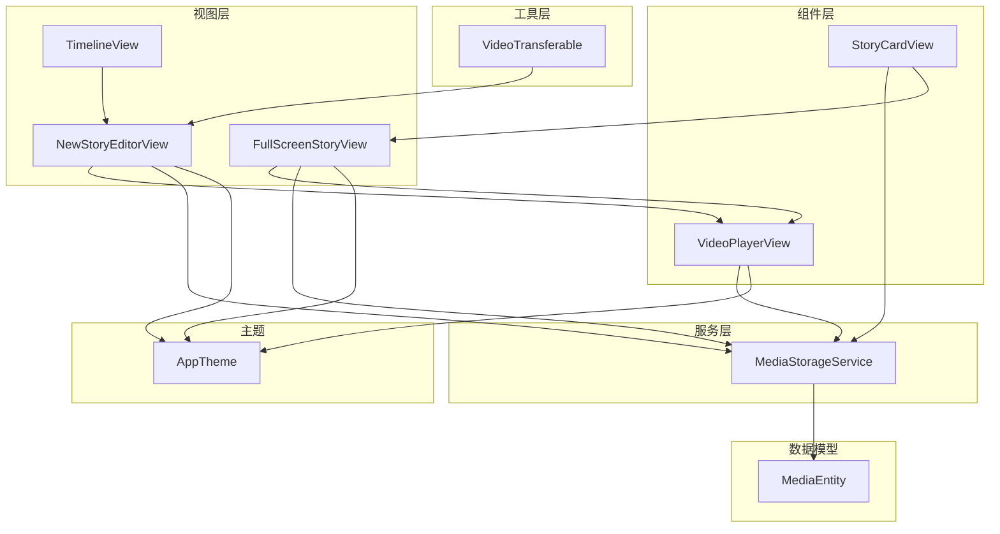
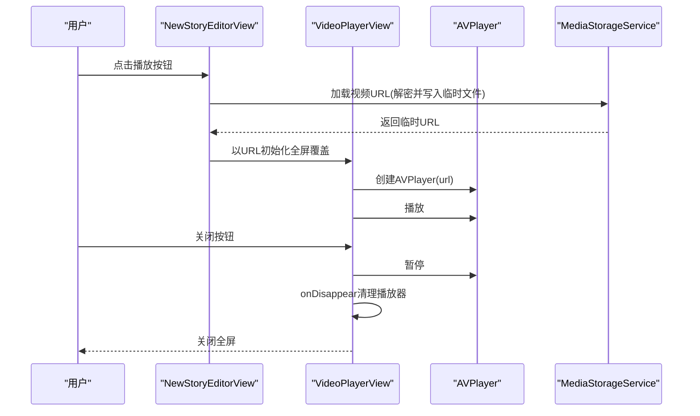
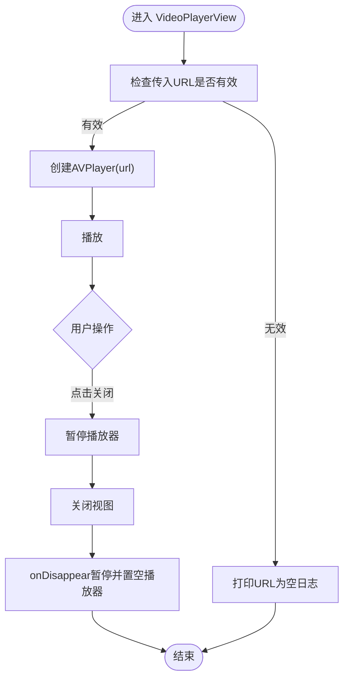
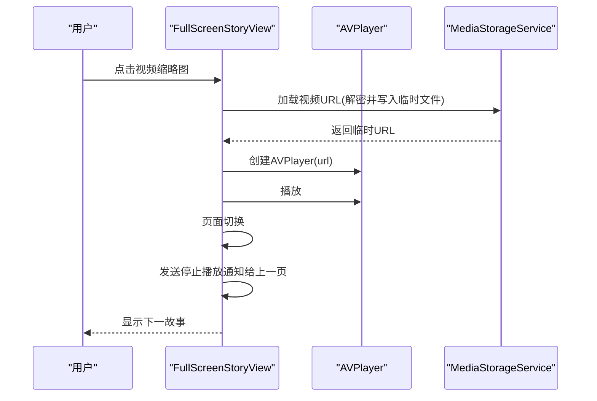
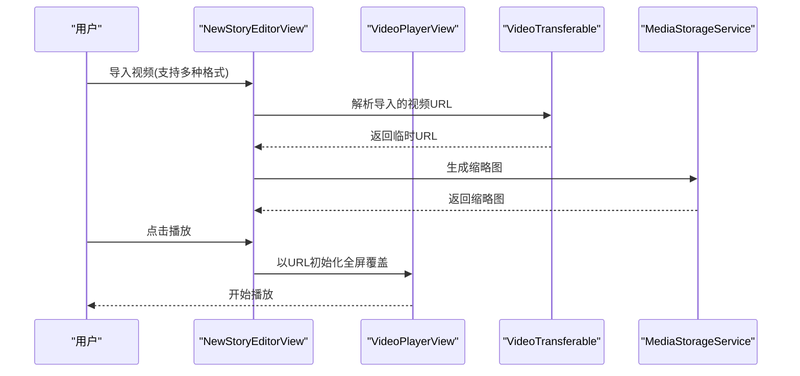
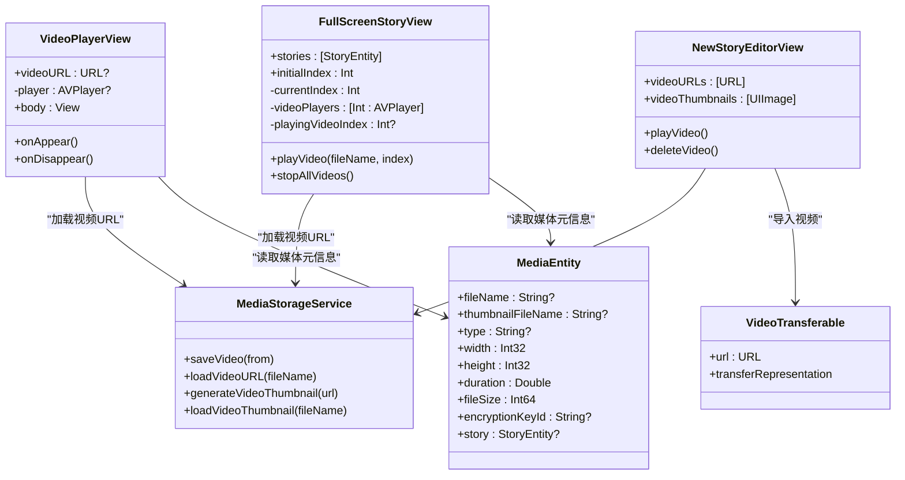

# 媒体组件

<cite>
**本文引用的文件**
- [VideoPlayerView.swift](file://MyStory/Components/VideoPlayerView.swift)
- [FullScreenStoryView.swift](file://MyStory/Views/Timeline/FullScreenStoryView.swift)
- [NewStoryEditorView.swift](file://MyStory/Views/Editor/NewStoryEditorView.swift)
- [MediaStorageService.swift](file://MyStory/Services/MediaStorageService.swift)
- [VideoTransferable.swift](file://MyStory/Utils/VideoTransferable.swift)
- [MediaEntity+CoreDataClass.swift](file://MyStory/Models/Entities/MediaEntity+CoreDataClass.swift)
- [MediaEntity+CoreDataProperties.swift](file://MyStory/Models/Entities/MediaEntity+CoreDataProperties.swift)
- [AppTheme.swift](file://MyStory/Components/Theme/AppTheme.swift)
- [TimelineView.swift](file://MyStory/Views/Timeline/TimelineView.swift)
- [StoryCardView.swift](file://MyStory/Components/StoryCardView.swift)
</cite>

## 目录
1. [简介](#简介)
2. [项目结构](#项目结构)
3. [核心组件](#核心组件)
4. [架构总览](#架构总览)
5. [详细组件分析](#详细组件分析)
6. [依赖关系分析](#依赖关系分析)
7. [性能考量](#性能考量)
8. [故障排查指南](#故障排查指南)
9. [结论](#结论)
10. [附录](#附录)

## 简介
本文件聚焦于媒体组件，特别是 VideoPlayerView 的实现与使用场景，涵盖以下方面：
- 视频播放控制与播放状态管理
- 全屏播放与手势交互
- 生命周期管理、内存优化与性能考虑
- 配置选项、事件监听与错误处理机制
- 与系统 AVFoundation 框架的集成方式
- 不同格式媒体文件的处理
- 使用示例、最佳实践与兼容性注意事项
- 在故事编辑与预览中的应用场景

## 项目结构
媒体组件主要分布在以下模块：
- 组件层：VideoPlayerView（全屏视频播放视图）
- 视图层：FullScreenStoryView（全屏故事浏览）、NewStoryEditorView（故事编辑器）
- 服务层：MediaStorageService（媒体存储与解密、缩略图生成、临时文件管理）
- 工具层：VideoTransferable（统一类型传输，支持多种视频格式导入）
- 数据模型：MediaEntity（CoreData 实体，承载媒体元信息）
- 主题与样式：AppTheme（统一视觉风格）

图表来源
- [VideoPlayerView.swift](file://MyStory/Components/VideoPlayerView.swift#L1-L52)
- [FullScreenStoryView.swift](file://MyStory/Views/Timeline/FullScreenStoryView.swift#L1-L200)
- [NewStoryEditorView.swift](file://MyStory/Views/Editor/NewStoryEditorView.swift#L189-L220)
- [MediaStorageService.swift](file://MyStory/Services/MediaStorageService.swift#L1-L348)
- [VideoTransferable.swift](file://MyStory/Utils/VideoTransferable.swift#L1-L34)
- [MediaEntity+CoreDataClass.swift](file://MyStory/Models/Entities/MediaEntity+CoreDataClass.swift#L1-L15)
- [AppTheme.swift](file://MyStory/Components/Theme/AppTheme.swift#L154-L307)

章节来源
- [VideoPlayerView.swift](file://MyStory/Components/VideoPlayerView.swift#L1-L52)
- [FullScreenStoryView.swift](file://MyStory/Views/Timeline/FullScreenStoryView.swift#L1-L200)
- [NewStoryEditorView.swift](file://MyStory/Views/Editor/NewStoryEditorView.swift#L189-L220)
- [MediaStorageService.swift](file://MyStory/Services/MediaStorageService.swift#L1-L348)
- [VideoTransferable.swift](file://MyStory/Utils/VideoTransferable.swift#L1-L34)
- [MediaEntity+CoreDataClass.swift](file://MyStory/Models/Entities/MediaEntity+CoreDataClass.swift#L1-L15)
- [AppTheme.swift](file://MyStory/Components/Theme/AppTheme.swift#L154-L307)

## 核心组件
- VideoPlayerView：轻量级全屏视频播放视图，负责创建 AVPlayer、播放控制、生命周期清理与用户交互（关闭按钮）。
- MediaStorageService：封装媒体文件的保存、解密、缩略图生成、临时文件管理与目录组织，支持视频与图片两类媒体。
- VideoTransferable：统一类型传输，支持 .movie、.mpeg4Movie、.quickTimeMovie 等格式导入，并在导入时复制到应用文档目录生成临时文件。
- MediaEntity：CoreData 实体，承载媒体文件名、缩略图名、类型、尺寸、时长等元信息。
- FullScreenStoryView：全屏故事浏览，内含视频缩略图与播放器，支持多视频播放与页面切换时的资源清理。
- NewStoryEditorView：故事编辑器，提供视频预览与播放入口，使用全屏覆盖展示 VideoPlayerView。
- StoryCardView：故事卡片，用于展示媒体缩略图与播放入口，点击进入全屏预览。

章节来源
- [VideoPlayerView.swift](file://MyStory/Components/VideoPlayerView.swift#L1-L52)
- [MediaStorageService.swift](file://MyStory/Services/MediaStorageService.swift#L1-L348)
- [VideoTransferable.swift](file://MyStory/Utils/VideoTransferable.swift#L1-L34)
- [MediaEntity+CoreDataProperties.swift](file://MyStory/Models/Entities/MediaEntity+CoreDataProperties.swift#L1-L35)
- [FullScreenStoryView.swift](file://MyStory/Views/Timeline/FullScreenStoryView.swift#L424-L523)
- [NewStoryEditorView.swift](file://MyStory/Views/Editor/NewStoryEditorView.swift#L771-L780)
- [StoryCardView.swift](file://MyStory/Components/StoryCardView.swift#L169-L208)

## 架构总览
媒体组件围绕 AVFoundation 的 AVPlayer 与 AVKit 的 VideoPlayer 进行构建，结合 SwiftUI 的生命周期钩子（onAppear/onDisappear）实现播放控制；通过 MediaStorageService 提供安全存储、解密与缩略图生成；通过 VideoTransferable 支持多种视频格式导入；通过 CoreData 的 MediaEntity 存储媒体元信息。

图表来源
- [NewStoryEditorView.swift](file://MyStory/Views/Editor/NewStoryEditorView.swift#L771-L780)
- [VideoPlayerView.swift](file://MyStory/Components/VideoPlayerView.swift#L38-L49)
- [MediaStorageService.swift](file://MyStory/Services/MediaStorageService.swift#L114-L123)

## 详细组件分析

### VideoPlayerView 分析
- 功能特性
  - 接收外部传入的视频 URL，创建并启动 AVPlayer 播放
  - 提供全屏覆盖展示，背景黑色，居中显示播放控件
  - 提供关闭按钮，点击暂停并关闭视图
  - 在 onAppear 中创建播放器并开始播放，在 onDisappear 中暂停并释放播放器
- 播放控制
  - 通过 player?.pause() 控制暂停
  - 通过 dismiss() 关闭视图
- 生命周期管理
  - onAppear 创建播放器并播放
  - onDisappear 暂停并置空播放器，避免内存泄漏
- 错误处理
  - 当传入 URL 为空时打印日志，避免崩溃
- 全屏与手势
  - 该组件本身不包含手势缩放/双击等交互，全屏由 SwiftUI 全屏覆盖实现
- 性能与内存
  - 仅在出现时创建播放器，消失时释放，避免后台持续占用
  - 使用 ignoresSafeArea 全屏渲染，减少层级开销

图表来源
- [VideoPlayerView.swift](file://MyStory/Components/VideoPlayerView.swift#L38-L49)

章节来源
- [VideoPlayerView.swift](file://MyStory/Components/VideoPlayerView.swift#L1-L52)

### FullScreenStoryView 分析
- 功能特性
  - 全屏浏览故事，支持图片与视频混合展示
  - 视频采用缩略图占位，点击后创建 AVPlayer 播放
  - 页面切换时通过通知机制停止上一页的视频播放，避免资源竞争
- 播放控制
  - playVideo(fileName:at:) 创建 AVPlayer 并播放
  - stopAllVideos() 停止所有视频并清空缓存
- 生命周期管理
  - 页面切换完成后，向先前页面发送通知以停止播放
  - 每个视频项独立管理播放器实例
- 全屏与手势
  - 该组件未实现视频手势缩放/双击等交互，视频播放器为系统 VideoPlayer

图表来源
- [FullScreenStoryView.swift](file://MyStory/Views/Timeline/FullScreenStoryView.swift#L498-L521)
- [MediaStorageService.swift](file://MyStory/Services/MediaStorageService.swift#L114-L123)

章节来源
- [FullScreenStoryView.swift](file://MyStory/Views/Timeline/FullScreenStoryView.swift#L424-L523)

### NewStoryEditorView 分析
- 功能特性
  - 提供视频预览与播放入口，点击播放按钮弹出全屏播放
  - 支持通过 VideoTransferable 导入多种视频格式
  - 自动生成缩略图并在编辑器中展示
- 播放控制
  - playVideo() 根据已有视频文件名或已导入的URL决定播放源
  - 使用全屏覆盖展示 VideoPlayerView
- 生命周期管理
  - 全屏覆盖随页面切换自动停止播放（复用现有实现经验）
- 错误处理
  - 缩略图生成异常时打印日志并回退

图表来源
- [NewStoryEditorView.swift](file://MyStory/Views/Editor/NewStoryEditorView.swift#L727-L780)
- [VideoTransferable.swift](file://MyStory/Utils/VideoTransferable.swift#L8-L32)
- [MediaStorageService.swift](file://MyStory/Services/MediaStorageService.swift#L153-L192)

章节来源
- [NewStoryEditorView.swift](file://MyStory/Views/Editor/NewStoryEditorView.swift#L189-L220)
- [NewStoryEditorView.swift](file://MyStory/Views/Editor/NewStoryEditorView.swift#L727-L780)
- [VideoTransferable.swift](file://MyStory/Utils/VideoTransferable.swift#L1-L34)

### StoryCardView 分析
- 功能特性
  - 展示媒体缩略图与播放入口（圆形播放按钮）
  - 点击进入全屏预览（调用全屏故事视图）
- 与媒体存储的集成
  - 优先从缩略图文件名加载视频缩略图，否则回退到媒体文件名

章节来源
- [StoryCardView.swift](file://MyStory/Components/StoryCardView.swift#L169-L208)

### MediaStorageService 分析
- 功能特性
  - 保存图片与视频，生成缩略图并加密存储
  - 提供媒体文件的解密与临时文件写入能力
  - 生成视频缩略图，支持旋转与尺寸适配
- 媒体格式支持
  - 视频保存为 .mov，缩略图为 .jpg
  - 通过 VideoTransferable 支持 .movie、.mpeg4Movie、.quickTimeMovie 等导入
- 安全与隐私
  - 使用 AES-GCM 对媒体数据进行加密
  - 主密钥存储于 Keychain，按文件 ID 衍生子密钥
- 目录组织
  - 按年/月组织媒体文件，便于管理与清理

章节来源
- [MediaStorageService.swift](file://MyStory/Services/MediaStorageService.swift#L1-L348)
- [VideoTransferable.swift](file://MyStory/Utils/VideoTransferable.swift#L1-L34)

### MediaEntity 数据模型
- 字段说明
  - id、createdAt：标识与创建时间
  - fileName、thumbnailFileName：媒体与缩略图文件名
  - type：媒体类型（image/video）
  - width、height、duration、fileSize：媒体属性
  - encryptionKeyId：加密密钥ID
  - story：所属故事关联
- 用途
  - 作为 SwiftUI/AVFoundation 与存储服务之间的桥梁，承载媒体元信息

章节来源
- [MediaEntity+CoreDataProperties.swift](file://MyStory/Models/Entities/MediaEntity+CoreDataProperties.swift#L1-L35)
- [MediaEntity+CoreDataClass.swift](file://MyStory/Models/Entities/MediaEntity+CoreDataClass.swift#L1-L15)

## 依赖关系分析

图表来源
- [VideoPlayerView.swift](file://MyStory/Components/VideoPlayerView.swift#L1-L52)
- [FullScreenStoryView.swift](file://MyStory/Views/Timeline/FullScreenStoryView.swift#L424-L523)
- [NewStoryEditorView.swift](file://MyStory/Views/Editor/NewStoryEditorView.swift#L771-L780)
- [MediaStorageService.swift](file://MyStory/Services/MediaStorageService.swift#L89-L123)
- [VideoTransferable.swift](file://MyStory/Utils/VideoTransferable.swift#L5-L32)
- [MediaEntity+CoreDataProperties.swift](file://MyStory/Models/Entities/MediaEntity+CoreDataProperties.swift#L15-L35)

## 性能考量
- 播放器生命周期
  - VideoPlayerView 在 onDisappear 中暂停并置空播放器，避免后台播放造成资源浪费
  - FullScreenStoryView 在页面切换时通过通知停止上一页播放，防止多个播放器同时运行
- 缩略图生成
  - MediaStorageService 使用 AVAssetImageGenerator 生成缩略图，设置合理的请求容差与最大尺寸，平衡质量与性能
- 临时文件管理
  - 加载视频URL时写入临时文件，播放结束后由系统或手动清理，避免磁盘占用
- UI 渲染
  - VideoPlayerView 使用 ignoresSafeArea 全屏渲染，减少层级与布局开销
- 并发与异步
  - 编辑器缩略图生成使用 Task.detached 异步执行，避免阻塞主线程

章节来源
- [VideoPlayerView.swift](file://MyStory/Components/VideoPlayerView.swift#L46-L49)
- [FullScreenStoryView.swift](file://MyStory/Views/Timeline/FullScreenStoryView.swift#L144-L156)
- [MediaStorageService.swift](file://MyStory/Services/MediaStorageService.swift#L153-L192)
- [NewStoryEditorView.swift](file://MyStory/Views/Editor/NewStoryEditorView.swift#L782-L799)

## 故障排查指南
- 视频无法播放
  - 检查传入 URL 是否为空（VideoPlayerView 在 URL 为空时会打印日志）
  - 确认 MediaStorageService.loadVideoURL 返回的临时文件存在且可读
- 缩略图生成失败
  - 查看 MediaStorageService.generateVideoThumbnail 的异常日志
  - 确认视频文件可被 AVAsset 读取
- 多视频播放卡顿
  - 确保页面切换时调用了 stopAllVideos 或发送了停止播放通知
  - 避免同时创建过多 AVPlayer 实例
- 导入视频失败
  - 检查 VideoTransferable 的导入路径与文件权限
  - 确认导入后临时文件已成功复制到应用文档目录

章节来源
- [VideoPlayerView.swift](file://MyStory/Components/VideoPlayerView.swift#L42-L44)
- [MediaStorageService.swift](file://MyStory/Services/MediaStorageService.swift#L153-L192)
- [FullScreenStoryView.swift](file://MyStory/Views/Timeline/FullScreenStoryView.swift#L149-L153)
- [VideoTransferable.swift](file://MyStory/Utils/VideoTransferable.swift#L11-L15)

## 结论
本媒体组件以 AVFoundation 为核心，结合 SwiftUI 生命周期与 CoreData 元信息，实现了从媒体导入、存储、解密、缩略图生成到播放控制的完整链路。VideoPlayerView 提供简洁高效的全屏播放体验，FullScreenStoryView 与 NewStoryEditorView 则分别满足故事浏览与编辑场景下的视频播放需求。通过合理的生命周期管理与资源清理，组件在性能与稳定性方面表现良好。

## 附录

### 配置选项与事件监听
- 配置选项
  - 视频播放：通过传入 URL 初始化 AVPlayer
  - 缩略图生成：设置最大尺寸与请求容差，平衡质量与性能
  - 文件存储：按年/月组织，支持 HEIC/JPEG 图片与 MOV 视频
- 事件监听
  - 页面切换停止播放：通过通知机制在页面切换时停止上一页播放
  - 生命周期事件：onAppear/onDisappear 控制播放器创建与释放

章节来源
- [VideoPlayerView.swift](file://MyStory/Components/VideoPlayerView.swift#L38-L49)
- [FullScreenStoryView.swift](file://MyStory/Views/Timeline/FullScreenStoryView.swift#L144-L156)
- [MediaStorageService.swift](file://MyStory/Services/MediaStorageService.swift#L153-L192)

### 使用示例与最佳实践
- 在编辑器中播放视频
  - 通过 playVideo() 打开全屏播放
  - 使用 VideoTransferable 导入多种格式视频
- 在全屏故事中播放视频
  - 点击视频缩略图创建播放器并播放
  - 页面切换时自动停止播放
- 最佳实践
  - 始终在 onDisappear 中暂停并释放播放器
  - 导入视频后及时生成缩略图
  - 避免同时播放多个视频，防止资源竞争

章节来源
- [NewStoryEditorView.swift](file://MyStory/Views/Editor/NewStoryEditorView.swift#L771-L780)
- [FullScreenStoryView.swift](file://MyStory/Views/Timeline/FullScreenStoryView.swift#L498-L521)
- [VideoPlayerView.swift](file://MyStory/Components/VideoPlayerView.swift#L46-L49)

### 兼容性注意事项
- 视频格式
  - 支持 .movie、.mpeg4Movie、.quickTimeMovie 等格式导入
  - 保存为 .mov，缩略图为 .jpg
- 系统要求
  - 依赖 AVFoundation 与 AVKit，需在 iOS 设备上运行
- 权限与存储
  - 导入视频需要访问相册权限
  - 临时文件写入应用文档目录，注意清理策略

章节来源
- [VideoTransferable.swift](file://MyStory/Utils/VideoTransferable.swift#L8-L32)
- [MediaStorageService.swift](file://MyStory/Services/MediaStorageService.swift#L89-L123)