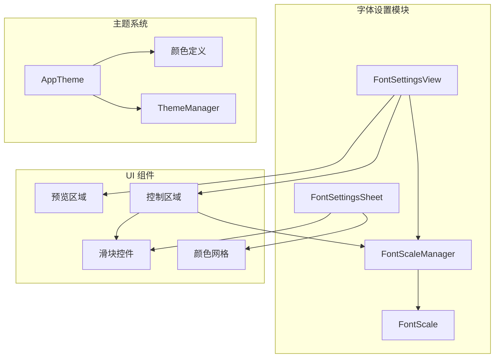
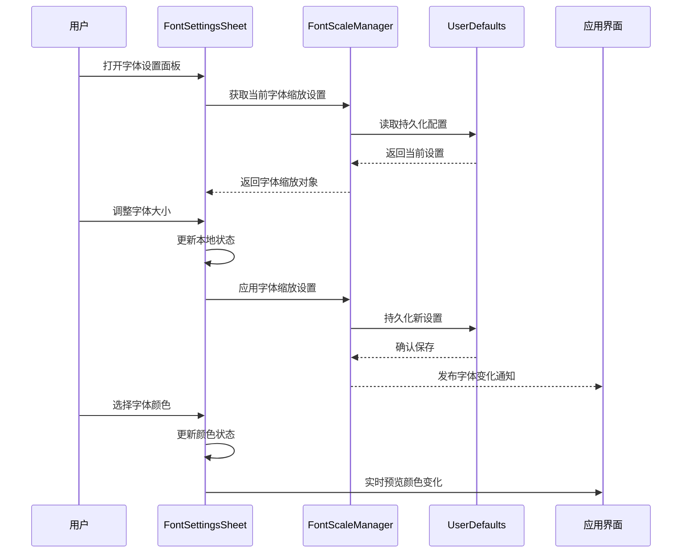
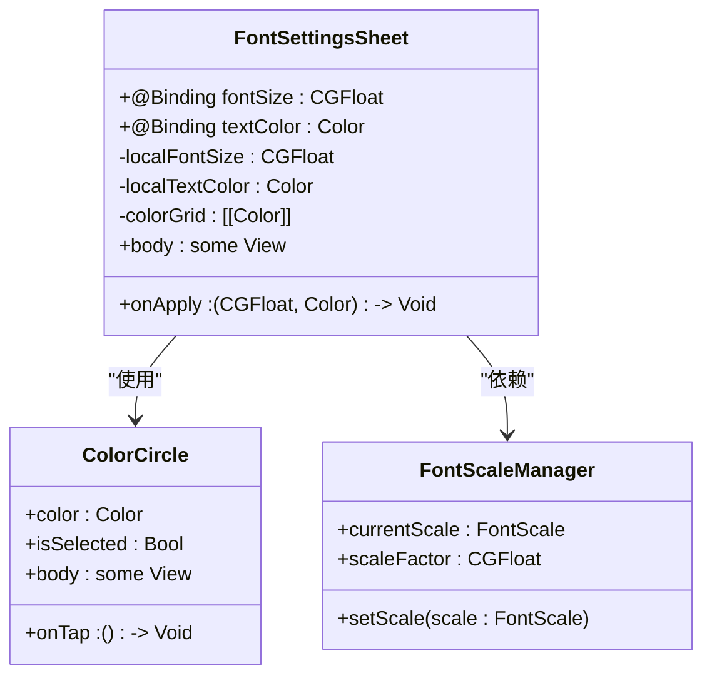
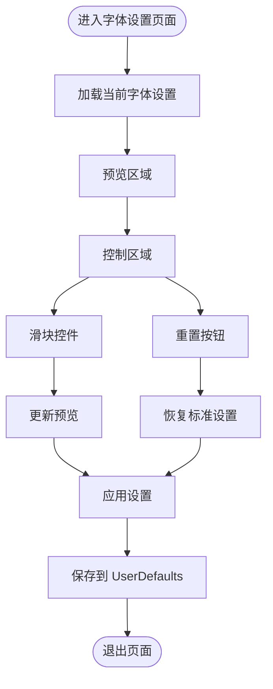
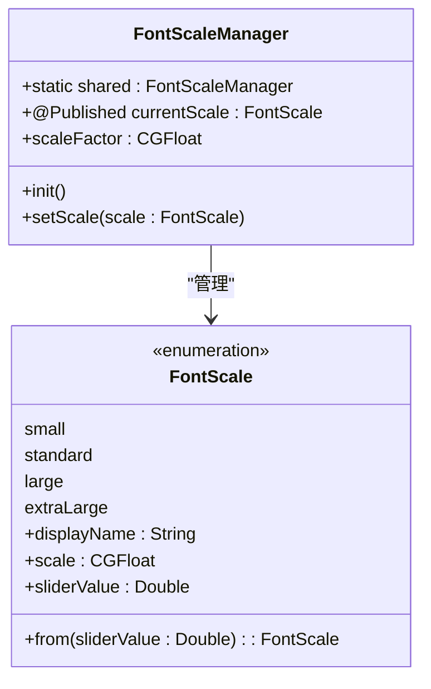
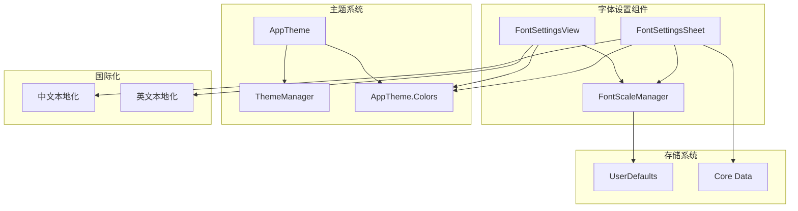

# 字体设置面板

<cite>
**本文档引用的文件**
- [FontSettingsSheet.swift](file://MyStory/Components/FontSettingsSheet.swift)
- [FontSettingsView.swift](file://MyStory/Views/Settings/FontSettingsView.swift)
- [AppTheme.swift](file://MyStory/Components/Theme/AppTheme.swift)
- [Localizable.strings（中文）](file://MyStory/Resources/Localizable/zh-Hans.lproj/Localizable.strings)
- [Localizable.strings（英文）](file://MyStory/Resources/Localizable/en.lproj/Localizable.strings)
</cite>

## 目录
1. [简介](#简介)
2. [项目结构](#项目结构)
3. [核心组件](#核心组件)
4. [架构概览](#架构概览)
5. [详细组件分析](#详细组件分析)
6. [依赖关系分析](#依赖关系分析)
7. [性能考量](#性能考量)
8. [故障排除指南](#故障排除指南)
9. [结论](#结论)
10. [附录](#附录)

## 简介
本文档全面介绍 MyStory 应用中的字体设置面板设计与实现，重点涵盖 FontSettingsSheet 和 FontSettingsView 两个核心组件。文档详细说明了字体缩放调节机制、实时预览功能、用户交互逻辑，以及与 FontScaleManager 的集成方式。同时提供了配置选项、滑块控制、数值输入方法的使用指南，并阐述了字体设置在设置页面中的集成使用及对应用整体布局的影响处理。

## 项目结构
字体设置功能分布在以下关键文件中：
- **FontSettingsSheet.swift**: 提供弹出式字体设置面板，支持字体大小和颜色的实时调整
- **FontSettingsView.swift**: 实现完整的字体设置页面，包含预览区域和控制区域
- **AppTheme.swift**: 定义字体缩放类型、管理器和主题系统
- **Localizable.strings**: 国际化文案支持

**图表来源**
- [FontSettingsView.swift](file://MyStory/Views/Settings/FontSettingsView.swift#L10-L69)
- [FontSettingsSheet.swift](file://MyStory/Components/FontSettingsSheet.swift#L11-L121)
- [AppTheme.swift](file://MyStory/Components/Theme/AppTheme.swift#L69-L90)

**章节来源**
- [FontSettingsSheet.swift](file://MyStory/Components/FontSettingsSheet.swift#L1-L178)
- [FontSettingsView.swift](file://MyStory/Views/Settings/FontSettingsView.swift#L1-L214)
- [AppTheme.swift](file://MyStory/Components/Theme/AppTheme.swift#L1-L278)

## 核心组件
字体设置系统由三个核心组件构成：

### FontScale 枚举
定义四种字体缩放级别：
- Small (0.85x)
- Standard (1.0x) - 默认值
- Large (1.15x)
- ExtraLarge (1.3x)

### FontScaleManager 管理器
单例管理器，负责：
- 持久化存储字体缩放设置
- 提供实时字体缩放因子
- 管理 UserDefaults 中的配置

### FontSettingsView 页面
完整的字体设置界面，包含预览和控制功能。

**章节来源**
- [AppTheme.swift](file://MyStory/Components/Theme/AppTheme.swift#L4-L66)
- [AppTheme.swift](file://MyStory/Components/Theme/AppTheme.swift#L69-L90)
- [FontSettingsView.swift](file://MyStory/Views/Settings/FontSettingsView.swift#L10-L22)

## 架构概览
字体设置系统采用分层架构设计，实现了清晰的关注点分离：

**图表来源**
- [FontSettingsSheet.swift](file://MyStory/Components/FontSettingsSheet.swift#L108-L119)
- [AppTheme.swift](file://MyStory/Components/Theme/AppTheme.swift#L72-L81)

## 详细组件分析

### FontSettingsSheet 组件分析

FontSettingsSheet 是一个独立的弹出式字体设置面板，提供即时的字体调整体验。

#### 组件结构图

**图表来源**
- [FontSettingsSheet.swift](file://MyStory/Components/FontSettingsSheet.swift#L11-L121)
- [FontSettingsSheet.swift](file://MyStory/Components/FontSettingsSheet.swift#L124-L160)

#### 字体缩放调节机制
- **滑块范围**: 10-48 点，步长为 2
- **实时预览**: 拖动滑块时立即更新字体大小
- **数值输入**: 支持直接输入具体的字体大小值

#### 颜色选择系统
- **调色板设计**: 2 行 × 8 列的 16 色网格
- **智能对比**: 根据背景颜色自动选择合适的勾选图标颜色
- **近似比较**: 使用容差值进行颜色匹配，确保选中状态准确

#### 用户交互逻辑
- **双向绑定**: 通过 @Binding 实现与父视图的数据同步
- **回调机制**: onApply 回调函数提供实时的应用反馈
- **状态管理**: 使用 @State 管理本地预览状态

**章节来源**
- [FontSettingsSheet.swift](file://MyStory/Components/FontSettingsSheet.swift#L11-L121)
- [FontSettingsSheet.swift](file://MyStory/Components/FontSettingsSheet.swift#L124-L178)

### FontSettingsView 组件分析

FontSettingsView 提供完整的字体设置页面，包含预览和控制功能。

#### 页面布局结构

**图表来源**
- [FontSettingsView.swift](file://MyStory/Views/Settings/FontSettingsView.swift#L24-L69)
- [FontSettingsView.swift](file://MyStory/Views/Settings/FontSettingsView.swift#L135-L195)

#### 预览功能实现
- **动态字体**: 使用 `previewFont()` 方法根据当前缩放比例生成字体
- **实时更新**: 滑块拖动时立即更新预览内容
- **完整展示**: 包含欢迎语、功能描述、特性列表等完整预览内容

#### 控制区域设计
- **滑块控件**: 0-3 的离散值，对应四种字体缩放级别
- **动画效果**: 0.2 秒缓动动画平滑过渡
- **状态指示**: 显示当前字体缩放级别的名称

**章节来源**
- [FontSettingsView.swift](file://MyStory/Views/Settings/FontSettingsView.swift#L71-L131)
- [FontSettingsView.swift](file://MyStory/Views/Settings/FontSettingsView.swift#L133-L195)

### FontScaleManager 集成分析

FontScaleManager 作为单例管理器，实现了字体设置的持久化存储和全局状态管理。

#### 管理器架构

**图表来源**
- [AppTheme.swift](file://MyStory/Components/Theme/AppTheme.swift#L69-L90)
- [AppTheme.swift](file://MyStory/Components/Theme/AppTheme.swift#L4-L66)

#### 持久化存储机制
- **存储键名**: `"selectedFontScale"`
- **默认值**: Standard (标准)
- **自动保存**: 每次设置变更时自动保存到 UserDefaults

#### 全局状态同步
- **观察者模式**: 通过 @Published 属性发布状态变化
- **实时响应**: UI 组件自动响应字体设置变化
- **线程安全**: 使用 @MainActor 确保主线程更新

**章节来源**
- [AppTheme.swift](file://MyStory/Components/Theme/AppTheme.swift#L69-L90)

## 依赖关系分析

字体设置系统与其他组件的依赖关系如下：

**图表来源**
- [FontSettingsSheet.swift](file://MyStory/Components/FontSettingsSheet.swift#L8-L11)
- [FontSettingsView.swift](file://MyStory/Views/Settings/FontSettingsView.swift#L8-L12)
- [AppTheme.swift](file://MyStory/Components/Theme/AppTheme.swift#L1-L50)

### 组件耦合度评估
- **低耦合**: 字体设置组件与业务逻辑解耦
- **高内聚**: 字体相关功能集中在单一模块
- **接口清晰**: 通过协议和回调函数实现松散耦合

### 外部依赖
- **SwiftUI**: 用户界面框架
- **UserDefaults**: 本地存储
- **Foundation**: 字符串本地化支持

**章节来源**
- [FontSettingsSheet.swift](file://MyStory/Components/FontSettingsSheet.swift#L8-L11)
- [FontSettingsView.swift](file://MyStory/Views/Settings/FontSettingsView.swift#L8-L12)
- [AppTheme.swift](file://MyStory/Components/Theme/AppTheme.swift#L1-L50)

## 性能考量

### 实时预览优化
- **状态更新**: 使用 @State 管理本地状态，避免不必要的全局刷新
- **动画性能**: 0.2 秒缓动动画平衡流畅性和响应性
- **内存管理**: 合理使用弱引用避免循环引用

### 存储性能
- **懒加载**: FontScaleManager 在首次访问时初始化
- **增量更新**: 仅在设置变更时写入 UserDefaults
- **类型安全**: 使用强类型枚举避免字符串解析开销

### 用户体验优化
- **即时反馈**: 滑块拖动时立即更新预览
- **平滑过渡**: 动画效果提升用户体验
- **无障碍支持**: 提供足够的对比度和尺寸

## 故障排除指南

### 常见问题及解决方案

#### 字体设置未保存
**症状**: 重启应用后字体设置恢复默认
**原因**: UserDefaults 写入失败
**解决**: 检查应用权限和存储空间

#### 颜色选择异常
**症状**: 颜色选择不准确或无法选中
**原因**: 颜色比较算法容差值不合适
**解决**: 调整 `isApproximatelyEqual` 方法的容差参数

#### 预览不更新
**症状**: 滑块拖动但预览不变
**原因**: 状态绑定问题
**解决**: 检查 `previewFont` 方法的调用时机

**章节来源**
- [FontSettingsSheet.swift](file://MyStory/Components/FontSettingsSheet.swift#L164-L178)
- [FontSettingsView.swift](file://MyStory/Views/Settings/FontSettingsView.swift#L199-L202)

## 结论
MyStory 的字体设置面板设计体现了现代 iOS 应用的最佳实践。通过合理的架构设计、清晰的组件分离和完善的用户体验考虑，实现了功能强大且易于使用的字体调整系统。FontSettingsSheet 和 FontSettingsView 的配合使用，为用户提供了直观、实时的字体定制体验，同时保证了系统的稳定性和可维护性。

## 附录

### 配置选项参考
- **字体缩放级别**: Small (0.85x), Standard (1.0x), Large (1.15x), ExtraLarge (1.3x)
- **滑块范围**: 0-3 (对应四种缩放级别)
- **字体大小范围**: 10-48 点（步长 2）
- **颜色网格**: 16 种预设颜色

### 使用示例路径
- [字体设置页面](file://MyStory/Views/Settings/FontSettingsView.swift#L10-L69)
- [字体设置面板](file://MyStory/Components/FontSettingsSheet.swift#L11-L121)
- [字体管理器](file://MyStory/Components/Theme/AppTheme.swift#L69-L90)

### 国际化支持
- **中文**: `settings.font.` 开头的本地化键
- **英文**: 对应的英文翻译键值
- **动态加载**: 运行时根据系统语言自动切换