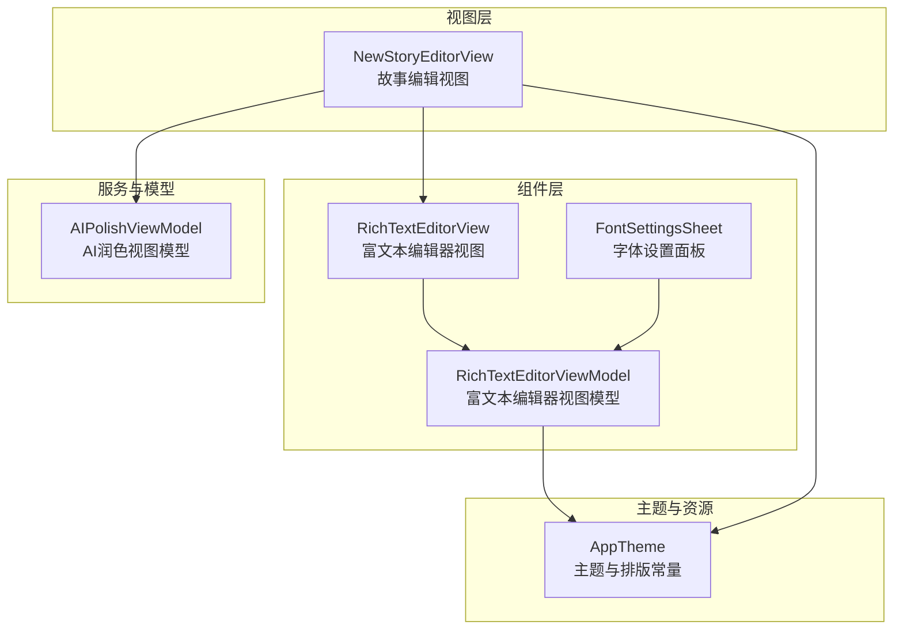
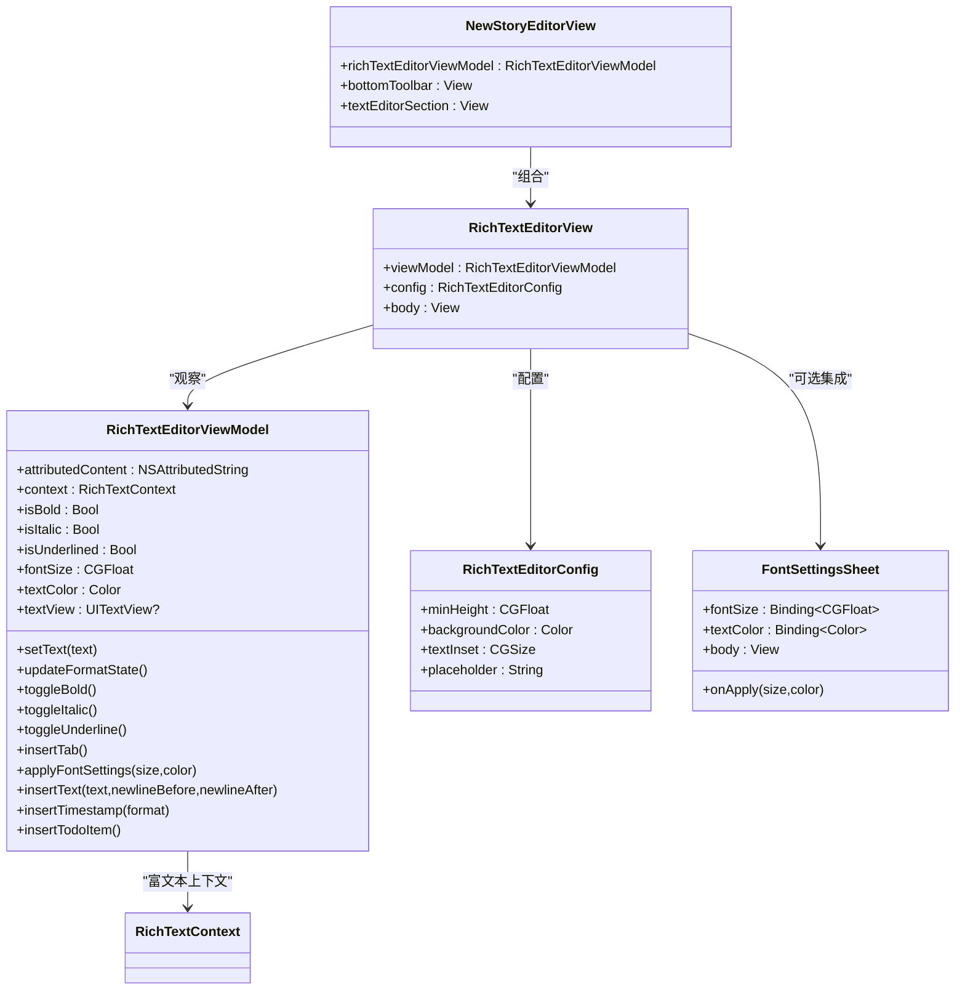
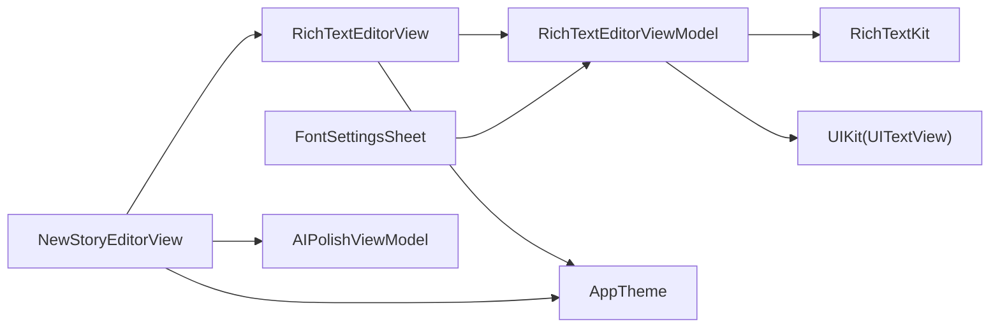

# 富文本编辑器

<cite>
**本文引用的文件**
- [RichTextEditorView.swift](file://MyStory/Components/RichTextEditorView.swift)
- [NewStoryEditorView.swift](file://MyStory/Views/Editor/NewStoryEditorView.swift)
- [AppTheme.swift](file://MyStory/Components/Theme/AppTheme.swift)
- [FontSettingsSheet.swift](file://MyStory/Components/FontSettingsSheet.swift)
- [AIPolishViewModel.swift](file://MyStory/ViewModels/Editor/AIPolishViewModel.swift)
</cite>

## 目录
1. [简介](#简介)
2. [项目结构](#项目结构)
3. [核心组件](#核心组件)
4. [架构总览](#架构总览)
5. [组件详解](#组件详解)
6. [依赖关系分析](#依赖关系分析)
7. [性能考量](#性能考量)
8. [故障排查指南](#故障排查指南)
9. [结论](#结论)
10. [附录](#附录)

## 简介
本文件面向富文本编辑器组件 RichTextEditorView 的架构设计与功能实现，涵盖富文本编辑的核心能力、格式化选项、内容管理、数据绑定与状态同步、配置与工具栏定制、快捷键支持、与系统富文本框架的集成方式，以及在故事编辑场景中的应用与协作关系。文档同时提供使用示例、最佳实践与性能优化建议，并对复杂文本格式与嵌入内容的处理给出指导。

## 项目结构
富文本编辑器位于组件层，作为可复用的 SwiftUI 组件，配合编辑器视图模型与主题系统共同工作；在故事编辑页面中被组合使用，形成完整的创作体验。

图表来源
- [RichTextEditorView.swift](file://MyStory/Components/RichTextEditorView.swift#L367-L430)
- [NewStoryEditorView.swift](file://MyStory/Views/Editor/NewStoryEditorView.swift#L121-L130)
- [AppTheme.swift](file://MyStory/Components/Theme/AppTheme.swift#L192-L488)
- [FontSettingsSheet.swift](file://MyStory/Components/FontSettingsSheet.swift#L11-L121)
- [AIPolishViewModel.swift](file://MyStory/ViewModels/Editor/AIPolishViewModel.swift#L4-L46)

章节来源
- [RichTextEditorView.swift](file://MyStory/Components/RichTextEditorView.swift#L1-L430)
- [NewStoryEditorView.swift](file://MyStory/Views/Editor/NewStoryEditorView.swift#L1-L319)
- [AppTheme.swift](file://MyStory/Components/Theme/AppTheme.swift#L1-L509)
- [FontSettingsSheet.swift](file://MyStory/Components/FontSettingsSheet.swift#L1-L178)
- [AIPolishViewModel.swift](file://MyStory/ViewModels/Editor/AIPolishViewModel.swift#L1-L46)

## 核心组件
- 富文本编辑器视图：基于 RichTextKit 的 SwiftUI 富文本编辑器，提供占位符、最小高度、内边距与背景色等配置。
- 富文本编辑器视图模型：封装富文本内容、格式状态（粗体/斜体/下划线/字号/颜色）、与 UITextView 的桥接、初始文本设置与格式同步。
- 字体设置面板：提供字号与颜色的可视化设置，联动应用主题与字体缩放。
- 故事编辑视图：组合富文本编辑器与媒体区、分类区、位置区等，承载富文本编辑器的工具栏按钮与状态展示。

章节来源
- [RichTextEditorView.swift](file://MyStory/Components/RichTextEditorView.swift#L14-L27)
- [RichTextEditorView.swift](file://MyStory/Components/RichTextEditorView.swift#L32-L362)
- [FontSettingsSheet.swift](file://MyStory/Components/FontSettingsSheet.swift#L11-L121)
- [NewStoryEditorView.swift](file://MyStory/Views/Editor/NewStoryEditorView.swift#L121-L130)

## 架构总览
富文本编辑器采用 MVVM 架构：
- 视图层负责 UI 呈现与用户交互；
- 视图模型负责富文本内容与格式状态管理；
- 主题系统提供统一的颜色与排版风格；
- 工具栏按钮与视图模型方法绑定，实现格式化与快捷插入；
- 与故事编辑视图协同，形成完整的创作流程。

图表来源
- [RichTextEditorView.swift](file://MyStory/Components/RichTextEditorView.swift#L14-L27)
- [RichTextEditorView.swift](file://MyStory/Components/RichTextEditorView.swift#L32-L362)
- [RichTextEditorView.swift](file://MyStory/Components/RichTextEditorView.swift#L367-L430)
- [FontSettingsSheet.swift](file://MyStory/Components/FontSettingsSheet.swift#L11-L121)
- [NewStoryEditorView.swift](file://MyStory/Views/Editor/NewStoryEditorView.swift#L121-L130)

## 组件详解

### 富文本编辑器视图模型（RichTextEditorViewModel）
- 数据绑定与状态
  - 富文本内容：通过 Published 属性与 SwiftUI 绑定，驱动 RichTextKit 的富文本编辑器。
  - 格式状态：粗体、斜体、下划线、字号、颜色等状态，用于工具栏按钮的视觉反馈。
  - UITextView 引用：弱引用，用于程序化插入文本与同步 typingAttributes。
- 内容初始化与同步
  - 支持延迟设置初始文本：当 UITextView 尚未就绪时暂存文本，待其准备完成后一次性设置。
  - 提供纯文本与空内容检测，便于保存逻辑判断。
- 格式状态更新
  - 优先从 UITextView 的 typingAttributes 读取当前格式；若无 UITextView，则从选区或有效范围读取富文本属性。
- 格式化操作
  - 粗体/斜体/下划线：即时切换状态并调用 RichTextContext 的样式切换；同步更新 typingAttributes 以保证 UI 即时反馈。
  - 字号与颜色：支持在选区范围内批量应用，或在插入点处修改默认样式；同时更新 ViewModel 的状态。
- 快捷插入
  - Tab 缩进、时间戳、待办项等快捷插入，均通过 UITextView 插入文本实现。
- 性能与线程
  - 在主线程执行 UI 更新与初始文本设置，避免并发问题。

章节来源
- [RichTextEditorView.swift](file://MyStory/Components/RichTextEditorView.swift#L32-L362)

### 富文本编辑器视图（RichTextEditorView）
- 配置项
  - 最小高度、背景色、文本内边距、占位符文本。
- 占位符逻辑
  - 当富文本内容为空且未设置占位符时，不显示占位符；否则在左上角显示占位文本，避免与输入冲突。
- 内容绑定
  - 通过 RichTextKit 的 RichTextEditor 组件绑定 ViewModel 的富文本内容与上下文。
- UITextView 回调
  - 在回调中设置文本内边距，并将 UITextView 引用保存至 ViewModel，以便后续程序化操作。
- 可选的状态监听
  - 注释掉的 onChange 监听用于在选区或内容变化时更新格式状态，可根据需要启用。

章节来源
- [RichTextEditorView.swift](file://MyStory/Components/RichTextEditorView.swift#L367-L430)

### 字体设置面板（FontSettingsSheet）
- 功能
  - 提供字号滑块与颜色网格，实时预览与应用字体大小与颜色。
  - 与 ViewModel 的 fontSize 与 textColor 绑定，支持双向更新。
- 设计
  - 使用 AppTheme 的颜色与排版常量，确保与整体主题一致。
  - 颜色选择器支持近似相等判断，提升选中态识别度。

章节来源
- [FontSettingsSheet.swift](file://MyStory/Components/FontSettingsSheet.swift#L11-L121)
- [AppTheme.swift](file://MyStory/Components/Theme/AppTheme.swift#L192-L488)

### 故事编辑视图（NewStoryEditorView）中的富文本编辑器
- 组合
  - 在内容区域中嵌入富文本编辑器视图，并传入初始内容。
- 工具栏
  - 提供字体设置、粗体、斜体、下划线、Tab 缩进、时间戳、待办项等按钮，分别调用 ViewModel 的对应方法。
  - 按钮状态与主题颜色联动，突出当前格式状态。
- 其他协作
  - 与媒体区、分类区、位置区协同，形成完整的创作界面。
  - 与 AI 润色视图模型协作，支持外部文本润色后的回填（由其他视图负责）。

章节来源
- [NewStoryEditorView.swift](file://MyStory/Views/Editor/NewStoryEditorView.swift#L121-L130)
- [NewStoryEditorView.swift](file://MyStory/Views/Editor/NewStoryEditorView.swift#L486-L590)
- [AIPolishViewModel.swift](file://MyStory/ViewModels/Editor/AIPolishViewModel.swift#L4-L46)

## 依赖关系分析
- 组件耦合
  - RichTextEditorView 与 RichTextEditorViewModel 强耦合，通过 @ObservedObject 与 Published 属性实现松耦合的数据流。
  - RichTextEditorView 与 AppTheme 弱耦合，仅使用颜色与排版常量，便于主题切换。
  - FontSettingsSheet 与 RichTextEditorViewModel 通过 Binding 进行解耦。
- 外部依赖
  - RichTextKit：提供富文本编辑器与上下文能力。
  - UIKit：通过 UITextView 与 typingAttributes 实现格式同步与程序化插入。
- 潜在循环依赖
  - 未发现循环依赖；组件间为单向依赖（视图 -> 视图模型 -> 外部框架）。

图表来源
- [RichTextEditorView.swift](file://MyStory/Components/RichTextEditorView.swift#L9-L10)
- [RichTextEditorView.swift](file://MyStory/Components/RichTextEditorView.swift#L367-L430)
- [FontSettingsSheet.swift](file://MyStory/Components/FontSettingsSheet.swift#L11-L121)
- [NewStoryEditorView.swift](file://MyStory/Views/Editor/NewStoryEditorView.swift#L121-L130)
- [AIPolishViewModel.swift](file://MyStory/ViewModels/Editor/AIPolishViewModel.swift#L4-L46)

## 性能考量
- 主线程更新
  - 所有 UI 更新与初始文本设置均在主线程执行，避免并发导致的 UI 不一致。
- 初始文本延迟设置
  - 在 UITextView 尚未就绪时暂存初始文本，待其准备完成后一次性设置，减少不必要的重绘。
- 格式状态读取
  - 优先从 UITextView 的 typingAttributes 读取，避免对富文本内容进行全量扫描。
- 选区范围优化
  - 在无选区时使用有效范围（前一字符）读取属性，避免越界与无效读取。
- 可选状态监听
  - 注释掉的 onChange 监听可根据性能需求启用，避免频繁触发格式状态更新。

章节来源
- [RichTextEditorView.swift](file://MyStory/Components/RichTextEditorView.swift#L58-L84)
- [RichTextEditorView.swift](file://MyStory/Components/RichTextEditorView.swift#L129-L189)

## 故障排查指南
- 初始文本未显示
  - 检查是否在 UITextView 尚未就绪时设置了初始文本；确认 ViewModel 的延迟设置逻辑是否生效。
- 格式状态不同步
  - 确认是否启用了选区与内容变化的格式状态监听；或手动调用 updateFormatState 方法。
- 字体设置面板不生效
  - 检查字体设置面板的 Binding 是否正确传递给 ViewModel；确认 onApply 回调是否被调用。
- 工具栏按钮无响应
  - 确认按钮动作是否正确调用 ViewModel 的对应方法；检查按钮状态与主题颜色绑定是否正确。
- 占位符显示异常
  - 检查占位符文本是否为空；确认富文本内容是否为空白字符。

章节来源
- [RichTextEditorView.swift](file://MyStory/Components/RichTextEditorView.swift#L398-L404)
- [NewStoryEditorView.swift](file://MyStory/Views/Editor/NewStoryEditorView.swift#L486-L590)
- [FontSettingsSheet.swift](file://MyStory/Components/FontSettingsSheet.swift#L112-L119)

## 结论
富文本编辑器组件通过 MVVM 架构与 RichTextKit 的深度集成，提供了稳定、可扩展的富文本编辑能力。其配置灵活、状态管理清晰、与主题系统无缝衔接，并在故事编辑场景中与工具栏、媒体区、分类区等模块协同，形成完整的创作体验。建议在实际使用中结合性能需求启用必要的状态监听，并充分利用字体设置面板与快捷插入功能，提升编辑效率与一致性。

## 附录

### 使用示例与最佳实践
- 在故事编辑视图中嵌入富文本编辑器
  - 通过 RichTextEditorView 的配置项设置最小高度与背景色；传入初始内容以恢复编辑状态。
- 工具栏定制
  - 在 NewStoryEditorView 的底部工具栏中添加或调整按钮，分别调用 ViewModel 的格式化与快捷插入方法。
- 字体设置
  - 通过 FontSettingsSheet 提供的面板实时调整字号与颜色；注意与 AppTheme 的颜色与排版常量保持一致。
- 快捷键支持
  - 可在工具栏按钮中增加快捷键提示或手势支持，提升操作效率。
- 性能优化
  - 根据内容规模与更新频率启用或禁用格式状态监听；在大量文本插入时避免频繁触发 UI 更新。

章节来源
- [NewStoryEditorView.swift](file://MyStory/Views/Editor/NewStoryEditorView.swift#L121-L130)
- [NewStoryEditorView.swift](file://MyStory/Views/Editor/NewStoryEditorView.swift#L486-L590)
- [FontSettingsSheet.swift](file://MyStory/Components/FontSettingsSheet.swift#L11-L121)
- [RichTextEditorView.swift](file://MyStory/Components/RichTextEditorView.swift#L367-L430)