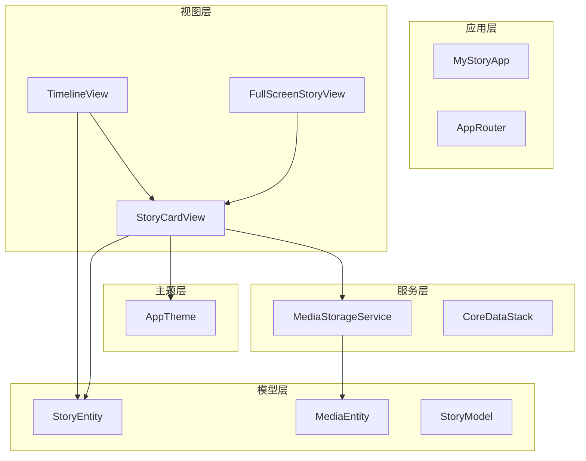
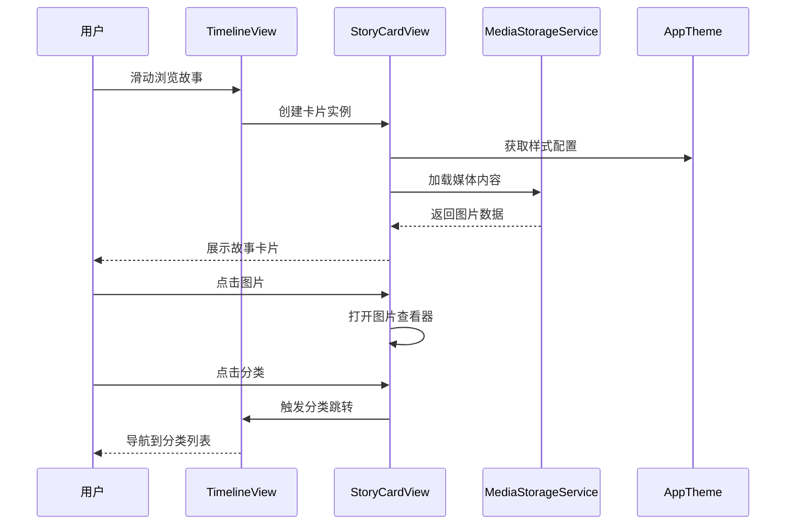
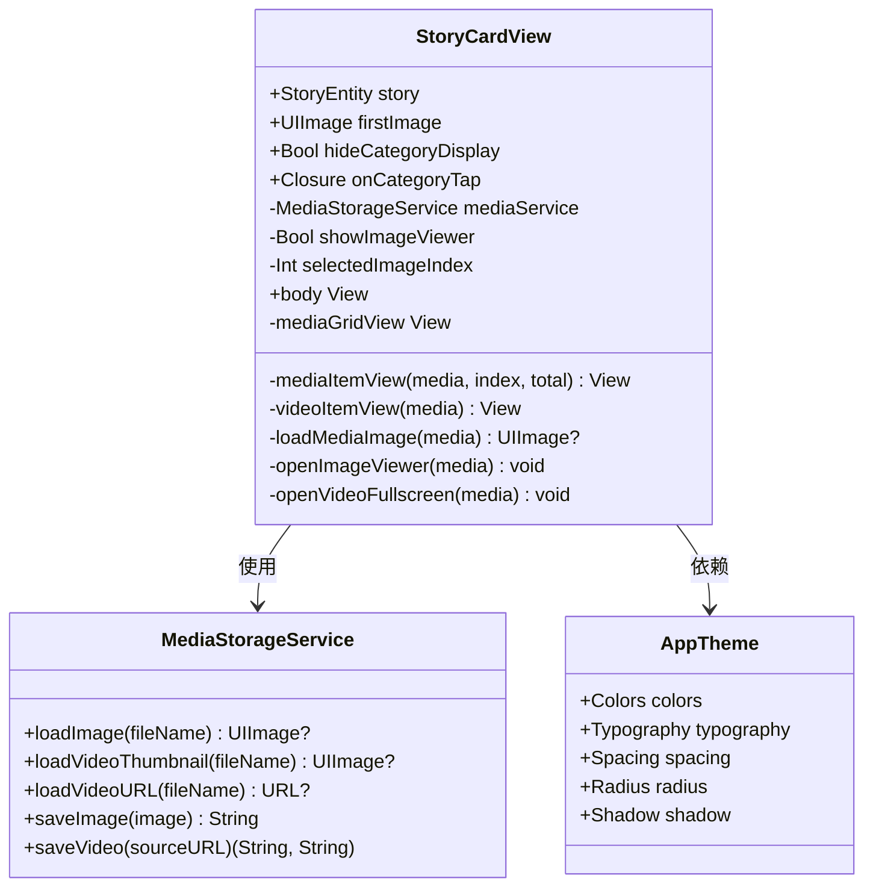
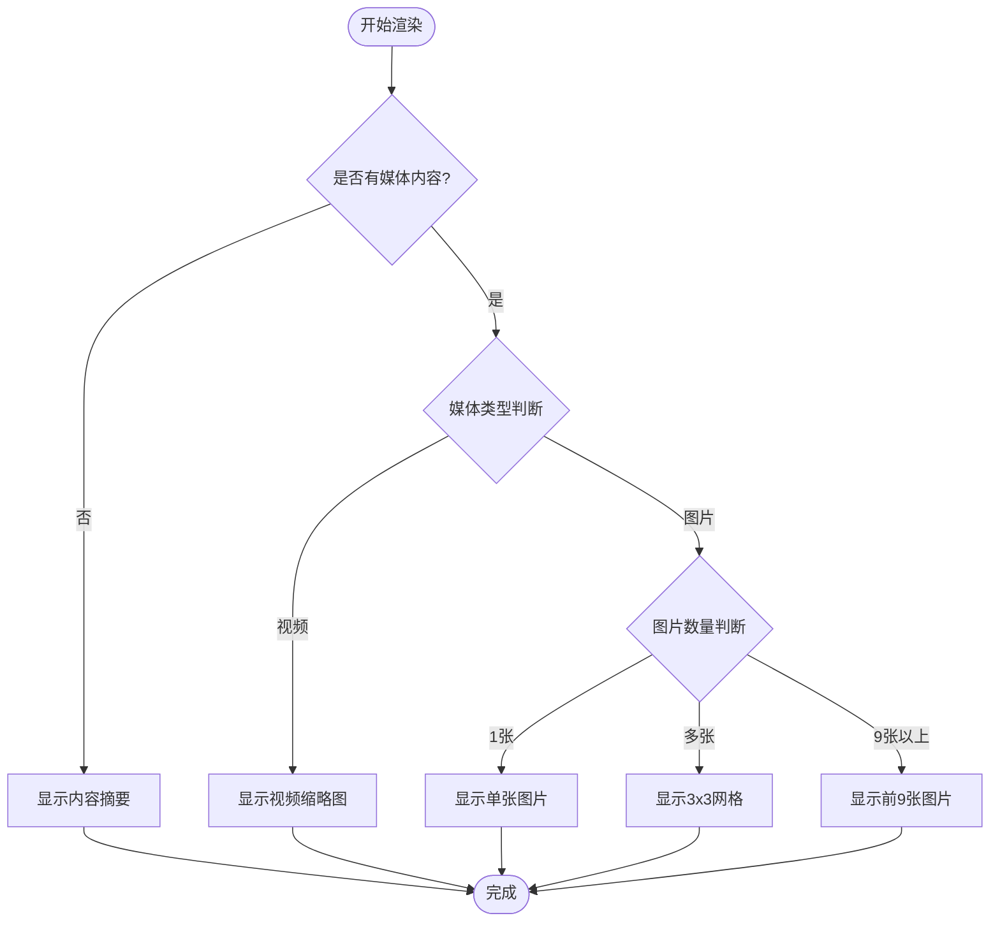
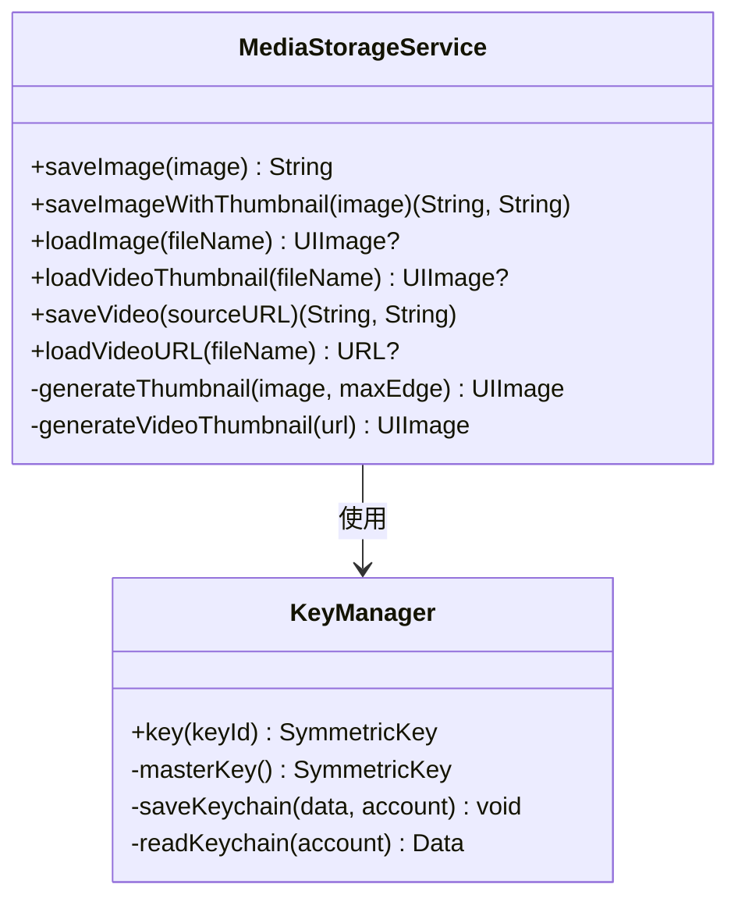
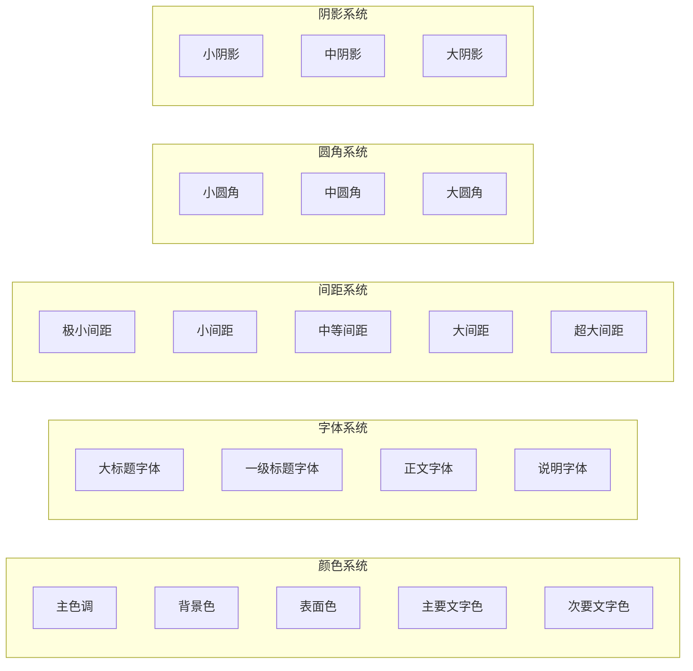
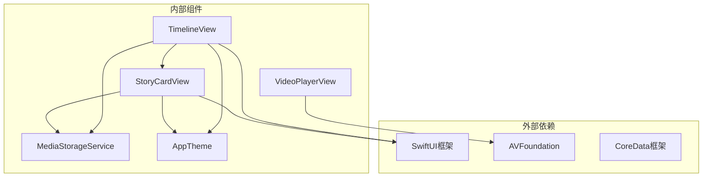
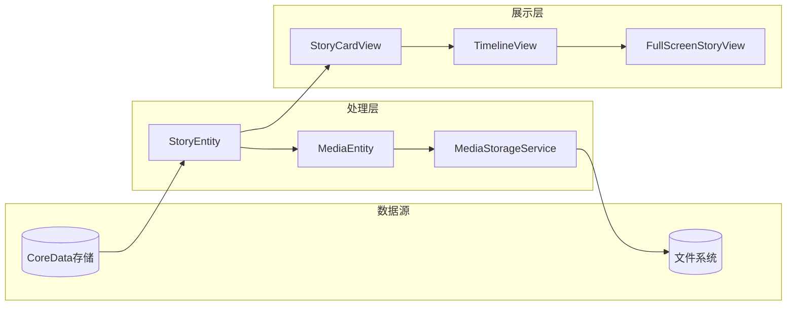

# 故事卡片组件

<cite>
**本文档引用的文件**
- [StoryCardView.swift](file://MyStory/Components/StoryCardView.swift)
- [TimelineView.swift](file://MyStory/Views/Timeline/TimelineView.swift)
- [TimelineViewModel.swift](file://MyStory/Views/Timeline/TimelineViewModel.swift)
- [FullScreenStoryView.swift](file://MyStory/Views/Timeline/FullScreenStoryView.swift)
- [StoryModel.swift](file://MyStory/Models/ViewModels/StoryModel.swift)
- [StoryEntity+CoreDataProperties.swift](file://MyStory/Models/Entities/StoryEntity+CoreDataProperties.swift)
- [MediaEntity+CoreDataProperties.swift](file://MyStory/Models/Entities/MediaEntity+CoreDataProperties.swift)
- [MediaStorageService.swift](file://MyStory/Services/MediaStorageService.swift)
- [AppTheme.swift](file://MyStory/Components/Theme/AppTheme.swift)
- [VideoPlayerView.swift](file://MyStory/Components/VideoPlayerView.swift)
- [ImageGalleryViewer.swift](file://MyStory/Views/Timeline/FullScreenStoryView.swift)
</cite>

## 目录
1. [简介](#简介)
2. [项目结构](#项目结构)
3. [核心组件](#核心组件)
4. [架构概览](#架构概览)
5. [详细组件分析](#详细组件分析)
6. [依赖关系分析](#依赖关系分析)
7. [性能考量](#性能考量)
8. [故障排除指南](#故障排除指南)
9. [结论](#结论)
10. [附录](#附录)

## 简介
故事卡片组件是 MyStory 应用中的核心 UI 组件，负责在时间线上展示用户的故事内容。该组件集成了多媒体内容展示、分类标签、地理位置信息和交互功能，提供了丰富的用户体验。本文档将深入分析 StoryCardView 的设计架构、实现细节和最佳实践。

## 项目结构
故事卡片组件位于应用的组件层，与视图层、模型层和服务层协同工作：



**图表来源**
- [TimelineView.swift](file://MyStory/Views/Timeline/TimelineView.swift#L1-L304)
- [StoryCardView.swift](file://MyStory/Components/StoryCardView.swift#L1-L247)
- [MediaStorageService.swift](file://MyStory/Services/MediaStorageService.swift#L1-L348)

**章节来源**
- [TimelineView.swift](file://MyStory/Views/Timeline/TimelineView.swift#L1-L304)
- [StoryCardView.swift](file://MyStory/Components/StoryCardView.swift#L1-L247)

## 核心组件
故事卡片组件的核心功能包括：

### 主要特性
- **多媒体内容展示**：支持图片网格和视频缩略图
- **分类信息显示**：多级分类标签的层级展示
- **地理位置信息**：城市和地址信息的简洁显示
- **交互功能**：图片查看器、视频播放、分类跳转
- **响应式布局**：适配不同屏幕尺寸

### 数据绑定机制
组件通过 SwiftUI 的声明式语法实现数据绑定：
- 使用 `@State` 管理本地状态（图片查看器状态）
- 使用 `@StateObject` 管理服务对象
- 通过 `@Environment` 注入上下文和主题

**章节来源**
- [StoryCardView.swift](file://MyStory/Components/StoryCardView.swift#L1-L247)
- [TimelineView.swift](file://MyStory/Views/Timeline/TimelineView.swift#L1-L304)

## 架构概览
故事卡片组件采用 MVVM 架构模式，实现了清晰的关注点分离：



**图表来源**
- [TimelineView.swift](file://MyStory/Views/Timeline/TimelineView.swift#L113-L126)
- [StoryCardView.swift](file://MyStory/Components/StoryCardView.swift#L74-L76)
- [MediaStorageService.swift](file://MyStory/Services/MediaStorageService.swift#L71-L78)

## 详细组件分析

### StoryCardView 组件架构

#### 类结构设计


**图表来源**
- [StoryCardView.swift](file://MyStory/Components/StoryCardView.swift#L3-L113)
- [MediaStorageService.swift](file://MyStory/Services/MediaStorageService.swift#L8-L348)
- [AppTheme.swift](file://MyStory/Components/Theme/AppTheme.swift#L154-L307)

#### 布局结构分析
故事卡片采用垂直堆叠布局，包含以下主要区域：

1. **内容摘要区域**：显示故事的主要文本内容
2. **媒体展示区域**：根据媒体类型选择不同的展示方式
3. **元信息区域**：分类标签和地理位置信息

#### 媒体展示逻辑
组件智能处理不同类型的媒体内容：



**图表来源**
- [StoryCardView.swift](file://MyStory/Components/StoryCardView.swift#L117-L134)
- [StoryCardView.swift](file://MyStory/Components/StoryCardView.swift#L205-L211)

#### 交互行为设计
组件实现了多种用户交互模式：

1. **图片点击**：打开全屏图片查看器
2. **视频点击**：全屏播放视频
3. **分类点击**：导航到分类详情
4. **长按操作**：显示上下文菜单

**章节来源**
- [StoryCardView.swift](file://MyStory/Components/StoryCardView.swift#L137-L190)
- [TimelineView.swift](file://MyStory/Views/Timeline/TimelineView.swift#L123-L126)

### 数据模型与绑定

#### StoryEntity 数据模型
故事实体包含了完整的故事信息：

| 属性名 | 类型 | 描述 |
|--------|------|------|
| content | String? | 故事内容文本 |
| media | NSSet? | 关联的媒体文件集合 |
| categories | NSSet? | 关联的分类集合 |
| locationCity | String? | 城市信息 |
| locationAddress | String? | 详细地址 |
| timestamp | Date? | 创建时间 |

#### 媒体存储服务
媒体存储服务提供了完整的媒体管理功能：



**图表来源**
- [MediaStorageService.swift](file://MyStory/Services/MediaStorageService.swift#L8-L224)
- [MediaStorageService.swift](file://MyStory/Services/MediaStorageService.swift#L226-L271)

**章节来源**
- [StoryEntity+CoreDataProperties.swift](file://MyStory/Models/Entities/StoryEntity+CoreDataProperties.swift#L21-L39)
- [MediaEntity+CoreDataProperties.swift](file://MyStory/Models/Entities/MediaEntity+CoreDataProperties.swift#L21-L32)

### 主题系统集成

#### AppTheme 设计
主题系统提供了统一的设计规范：



**图表来源**
- [AppTheme.swift](file://MyStory/Components/Theme/AppTheme.swift#L154-L307)

**章节来源**
- [AppTheme.swift](file://MyStory/Components/Theme/AppTheme.swift#L1-L328)

## 依赖关系分析

### 组件间依赖关系


**图表来源**
- [StoryCardView.swift](file://MyStory/Components/StoryCardView.swift#L1-L2)
- [TimelineView.swift](file://MyStory/Views/Timeline/TimelineView.swift#L1-L4)

### 数据流分析
故事卡片组件的数据流遵循单向数据流原则：



**图表来源**
- [TimelineViewModel.swift](file://MyStory/Views/Timeline/TimelineViewModel.swift#L4-L42)
- [MediaStorageService.swift](file://MyStory/Services/MediaStorageService.swift#L49-L123)

**章节来源**
- [TimelineViewModel.swift](file://MyStory/Views/Timeline/TimelineViewModel.swift#L1-L43)
- [MediaStorageService.swift](file://MyStory/Services/MediaStorageService.swift#L1-L348)

## 性能考量

### 内存管理优化
1. **懒加载策略**：使用 `LazyVGrid` 和 `LazyVStack` 减少内存占用
2. **图片缓存**：媒体存储服务自动处理图片解码和缓存
3. **资源清理**：组件销毁时自动清理视频播放器资源

### 渲染性能优化
1. **条件渲染**：只有在有内容时才渲染相应区域
2. **异步加载**：媒体内容异步加载，避免阻塞主线程
3. **最小化重绘**：使用 `@ViewBuilder` 和条件渲染减少不必要的重绘

### 网络和存储优化
1. **批量加载**：时间线视图实现分页加载，避免一次性加载大量数据
2. **压缩处理**：图片和视频自动压缩处理，减小存储空间
3. **加密存储**：敏感媒体内容采用加密存储，保证安全性

**章节来源**
- [TimelineView.swift](file://MyStory/Views/Timeline/TimelineView.swift#L208-L212)
- [MediaStorageService.swift](file://MyStory/Services/MediaStorageService.swift#L143-L192)

## 故障排除指南

### 常见问题及解决方案

#### 媒体加载失败
**问题描述**：图片或视频无法正常显示
**可能原因**：
- 文件路径错误
- 加密密钥丢失
- 文件损坏

**解决方案**：
1. 检查文件是否存在且可访问
2. 验证加密密钥是否正确
3. 重新上传或恢复媒体文件

#### 视频播放异常
**问题描述**：视频无法播放或播放卡顿
**可能原因**：
- 视频格式不支持
- 存储空间不足
- 权限问题

**解决方案**：
1. 确认视频格式兼容性
2. 检查设备存储空间
3. 授权应用访问媒体权限

#### 性能问题
**问题描述**：界面卡顿或内存占用过高
**可能原因**：
- 过多的图片同时加载
- 未及时清理资源
- 不必要的重绘

**解决方案**：
1. 实现懒加载和延迟加载
2. 及时释放不再使用的资源
3. 优化视图层次结构

**章节来源**
- [MediaStorageService.swift](file://MyStory/Services/MediaStorageService.swift#L194-L207)
- [StoryCardView.swift](file://MyStory/Components/StoryCardView.swift#L230-L244)

## 结论
故事卡片组件是一个设计精良、功能完整的 UI 组件。它成功地将复杂的数据展示需求转化为简洁易用的界面，同时保持了良好的性能表现和可维护性。组件的设计体现了以下特点：

1. **模块化设计**：清晰的职责分离和接口定义
2. **性能优化**：合理的内存管理和渲染优化
3. **用户体验**：直观的交互设计和流畅的动画效果
4. **可扩展性**：灵活的主题系统和配置选项

通过本文档的详细分析，开发者可以更好地理解和使用故事卡片组件，并在此基础上进行二次开发和定制。

## 附录

### 组件属性配置选项

#### StoryCardView 属性
| 属性名 | 类型 | 默认值 | 描述 |
|--------|------|--------|------|
| story | StoryEntity | 必需 | 故事实体对象 |
| firstImage | UIImage? | nil | 封面图片 |
| hideCategoryDisplay | Bool | false | 是否隐藏分类显示 |
| onCategoryTap | Closure? | nil | 分类点击回调 |

#### 主题配置选项
| 配置项 | 类型 | 描述 |
|--------|------|------|
| Colors.primary | Color | 主色调 |
| Typography.body | Font | 正文字体 |
| Spacing.m | CGFloat | 中等间距 |
| Radius.m | CGFloat | 中等圆角 |

### 事件处理方法
- `onCategoryTap`: 分类标签点击事件
- `openImageViewer`: 图片查看器打开事件
- `openVideoFullscreen`: 视频全屏播放事件

### 样式定制指南
1. **颜色定制**：通过 AppTheme 修改主题颜色
2. **字体定制**：调整字体大小和样式
3. **间距定制**：修改布局间距参数
4. **圆角定制**：调整组件圆角半径

### 集成示例
故事卡片组件可以轻松集成到各种场景中：

```swift
// 在时间线中使用
NavigationLink(destination: storyCardView) {
    StoryCardView(story: story, hideCategoryDisplay: false)
}

// 在全屏模式中使用
FullScreenStoryView(stories: stories, initialIndex: index)
```