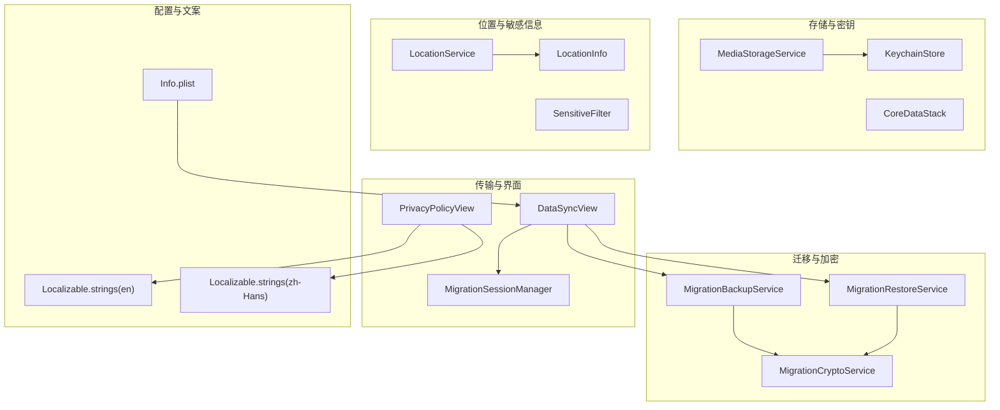
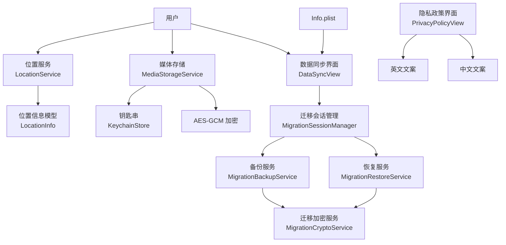
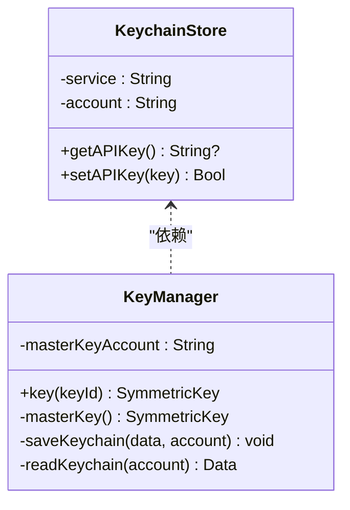
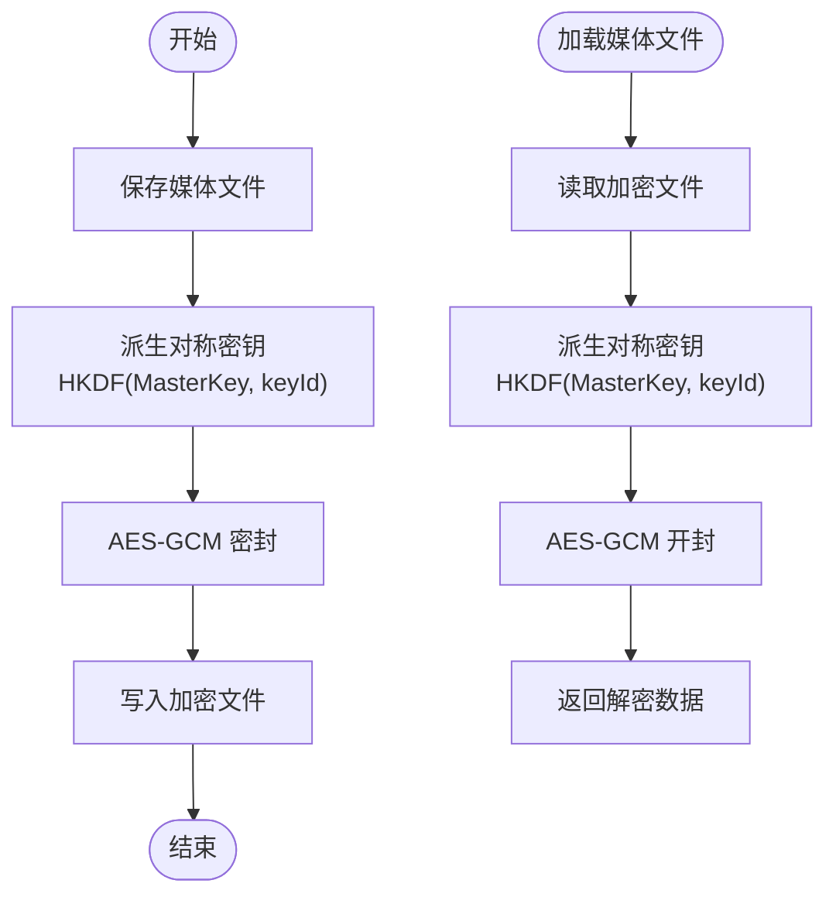
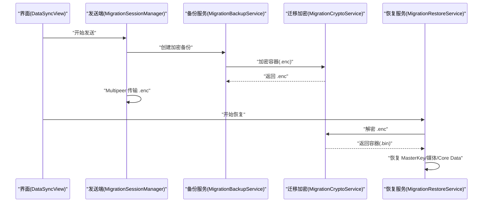
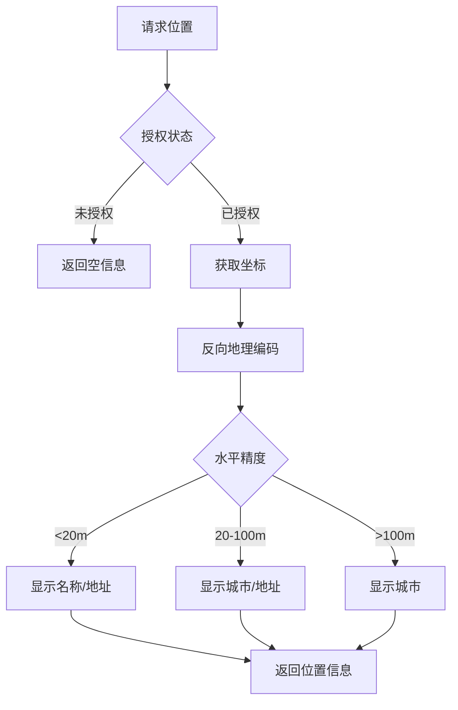
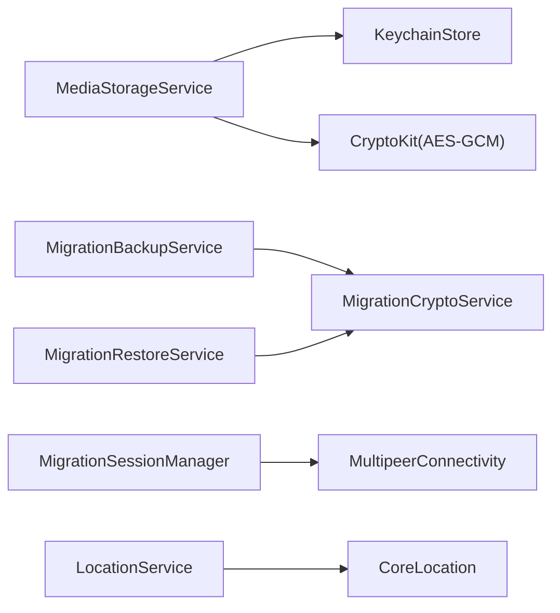

# 安全和隐私

<cite>
**本文引用的文件**
- [KeychainStore.swift](file://MyStory/Core/Storage/KeychainStore.swift)
- [MigrationCryptoService.swift](file://MyStory/Services/MigrationCryptoService.swift)
- [SensitiveFilter.swift](file://MyStory/Utils/SensitiveFilter.swift)
- [LocationService.swift](file://MyStory/Services/LocationService.swift)
- [LocationInfo.swift](file://MyStory/Models/ViewModels/LocationInfo.swift)
- [PrivacyPolicyView.swift](file://MyStory/Views/Settings/PrivacyPolicyView.swift)
- [MediaStorageService.swift](file://MyStory/Services/MediaStorageService.swift)
- [CoreDataStack.swift](file://MyStory/Core/Storage/CoreDataStack.swift)
- [MigrationBackupService.swift](file://MyStory/Services/MigrationBackupService.swift)
- [MigrationRestoreService.swift](file://MyStory/Services/MigrationRestoreService.swift)
- [MigrationSessionManager.swift](file://MyStory/Services/MigrationSessionManager.swift)
- [DataSyncView.swift](file://MyStory/Views/Settings/DataSyncView.swift)
- [Info.plist](file://MyStory/Info.plist)
- [Localizable.strings(en)](file://MyStory/Resources/Localizable/en.lproj/Localizable.strings)
- [Localizable.strings(zh-Hans)](file://MyStory/Resources/Localizable/zh-Hans.lproj/Localizable.strings)
- [Design.md](file://Design.md)
</cite>

## 目录
1. [简介](#简介)
2. [项目结构](#项目结构)
3. [核心组件](#核心组件)
4. [架构总览](#架构总览)
5. [详细组件分析](#详细组件分析)
6. [依赖分析](#依赖分析)
7. [性能考虑](#性能考虑)
8. [故障排查指南](#故障排查指南)
9. [结论](#结论)
10. [附录](#附录)

## 简介
本文件面向 MyStory 应用的安全与隐私保护，系统梳理并解释应用在数据加密存储、敏感信息过滤、权限管理、地理位置隐私、数据传输安全、第三方服务集成以及隐私政策与用户同意机制等方面的实现与最佳实践。文档以代码为依据，辅以可视化图示，帮助开发者与非技术读者共同理解与落地安全与隐私设计。

## 项目结构
MyStory 的安全与隐私相关能力主要分布在以下模块：
- 存储与密钥管理：KeychainStore、MediaStorageService、CoreDataStack
- 数据迁移与加密：MigrationBackupService、MigrationRestoreService、MigrationCryptoService
- 地理位置服务：LocationService、LocationInfo
- 敏感信息处理：SensitiveFilter
- 点对点传输与隐私政策：MigrationSessionManager、DataSyncView、PrivacyPolicyView
- 权限声明与国际化文案：Info.plist、Localizable.strings

**图表来源**
- [KeychainStore.swift](file://MyStory/Core/Storage/KeychainStore.swift#L1-L40)
- [MediaStorageService.swift](file://MyStory/Services/MediaStorageService.swift#L1-L348)
- [CoreDataStack.swift](file://MyStory/Core/Storage/CoreDataStack.swift#L1-L382)
- [MigrationBackupService.swift](file://MyStory/Services/MigrationBackupService.swift#L1-L414)
- [MigrationRestoreService.swift](file://MyStory/Services/MigrationRestoreService.swift#L1-L383)
- [MigrationCryptoService.swift](file://MyStory/Services/MigrationCryptoService.swift#L1-L67)
- [LocationService.swift](file://MyStory/Services/LocationService.swift#L1-L55)
- [LocationInfo.swift](file://MyStory/Models/ViewModels/LocationInfo.swift#L1-L76)
- [SensitiveFilter.swift](file://MyStory/Utils/SensitiveFilter.swift#L1-L18)
- [MigrationSessionManager.swift](file://MyStory/Services/MigrationSessionManager.swift#L1-L374)
- [DataSyncView.swift](file://MyStory/Views/Settings/DataSyncView.swift#L1-L559)
- [PrivacyPolicyView.swift](file://MyStory/Views/Settings/PrivacyPolicyView.swift#L1-L139)
- [Info.plist](file://MyStory/Info.plist#L1-L73)
- [Localizable.strings(en)](file://MyStory/Resources/Localizable/en.lproj/Localizable.strings#L280-L306)
- [Localizable.strings(zh-Hans)](file://MyStory/Resources/Localizable/zh-Hans.lproj/Localizable.strings#L284-L306)

**章节来源**
- [KeychainStore.swift](file://MyStory/Core/Storage/KeychainStore.swift#L1-L40)
- [MediaStorageService.swift](file://MyStory/Services/MediaStorageService.swift#L1-L348)
- [CoreDataStack.swift](file://MyStory/Core/Storage/CoreDataStack.swift#L1-L382)
- [MigrationBackupService.swift](file://MyStory/Services/MigrationBackupService.swift#L1-L414)
- [MigrationRestoreService.swift](file://MyStory/Services/MigrationRestoreService.swift#L1-L383)
- [MigrationCryptoService.swift](file://MyStory/Services/MigrationCryptoService.swift#L1-L67)
- [LocationService.swift](file://MyStory/Services/LocationService.swift#L1-L55)
- [LocationInfo.swift](file://MyStory/Models/ViewModels/LocationInfo.swift#L1-L76)
- [SensitiveFilter.swift](file://MyStory/Utils/SensitiveFilter.swift#L1-L18)
- [MigrationSessionManager.swift](file://MyStory/Services/MigrationSessionManager.swift#L1-L374)
- [DataSyncView.swift](file://MyStory/Views/Settings/DataSyncView.swift#L1-L559)
- [PrivacyPolicyView.swift](file://MyStory/Views/Settings/PrivacyPolicyView.swift#L1-L139)
- [Info.plist](file://MyStory/Info.plist#L1-L73)
- [Localizable.strings(en)](file://MyStory/Resources/Localizable/en.lproj/Localizable.strings#L280-L306)
- [Localizable.strings(zh-Hans)](file://MyStory/Resources/Localizable/zh-Hans.lproj/Localizable.strings#L284-L306)

## 核心组件
- Keychain 集成：用于安全存储 API Key 与 MasterKey，采用系统钥匙串服务，限定解锁可见属性，避免明文落盘。
- 媒体文件加密：基于对称密钥派生与 AES-256-GCM，实现文件级加密；密钥由 MasterKey 与文件 keyId 派生，确保独立性与安全性。
- 数据迁移加密：迁移流程包含容器构建、对称密钥派生、AES-GCM 加解密与中间产物清理，保证备份与恢复过程的数据机密性与完整性。
- 地理位置隐私：仅在授权前提下获取位置，反向地理编码结果按精度动态裁剪显示文本，避免泄露过高精度位置。
- 敏感信息过滤：内置敏感词替换机制，支持扩展词库，减少敏感内容外泄风险。
- 点对点传输：MultipeerConnectivity 会话强制加密，PIN 双方验证，传输文件在本地完成，不经过第三方服务器。
- 隐私政策与用户同意：界面化展示隐私政策各要点，权限使用说明与 AI 服务说明清晰，便于用户知情与同意。

**章节来源**
- [KeychainStore.swift](file://MyStory/Core/Storage/KeychainStore.swift#L4-L38)
- [MediaStorageService.swift](file://MyStory/Services/MediaStorageService.swift#L194-L271)
- [MigrationCryptoService.swift](file://MyStory/Services/MigrationCryptoService.swift#L11-L65)
- [MigrationBackupService.swift](file://MyStory/Services/MigrationBackupService.swift#L110-L142)
- [MigrationRestoreService.swift](file://MyStory/Services/MigrationRestoreService.swift#L103-L152)
- [LocationService.swift](file://MyStory/Services/LocationService.swift#L14-L38)
- [LocationInfo.swift](file://MyStory/Models/ViewModels/LocationInfo.swift#L34-L62)
- [SensitiveFilter.swift](file://MyStory/Utils/SensitiveFilter.swift#L10-L16)
- [MigrationSessionManager.swift](file://MyStory/Services/MigrationSessionManager.swift#L62-L106)
- [PrivacyPolicyView.swift](file://MyStory/Views/Settings/PrivacyPolicyView.swift#L10-L100)

## 架构总览
MyStory 的安全与隐私架构围绕“本地存储 + 端到端加密 + 用户同意”的原则构建，关键流程如下：
- 数据采集：仅在用户授权前提下获取位置信息；AI 功能发送文本至第三方 API，明确不保留用户内容。
- 数据存储：Core Data 本地持久化；媒体文件 AES-256-GCM 加密；敏感密钥存入系统钥匙串。
- 数据迁移：备份时生成容器文件，包含元数据与媒体字节；使用迁移密码与备份 ID 派生对称密钥，加密为 .enc 文件；恢复时解密为容器，再导入 Core Data 与媒体。
- 数据传输：点对点会话强制加密，PIN 双向验证，传输文件在本地完成，不上传云端。
- 隐私政策：通过界面化隐私政策页与权限说明，确保用户知情与同意。

**图表来源**
- [LocationService.swift](file://MyStory/Services/LocationService.swift#L1-L55)
- [LocationInfo.swift](file://MyStory/Models/ViewModels/LocationInfo.swift#L1-L76)
- [MediaStorageService.swift](file://MyStory/Services/MediaStorageService.swift#L1-L348)
- [KeychainStore.swift](file://MyStory/Core/Storage/KeychainStore.swift#L1-L40)
- [DataSyncView.swift](file://MyStory/Views/Settings/DataSyncView.swift#L1-L559)
- [MigrationSessionManager.swift](file://MyStory/Services/MigrationSessionManager.swift#L1-L374)
- [MigrationBackupService.swift](file://MyStory/Services/MigrationBackupService.swift#L1-L414)
- [MigrationRestoreService.swift](file://MyStory/Services/MigrationRestoreService.swift#L1-L383)
- [MigrationCryptoService.swift](file://MyStory/Services/MigrationCryptoService.swift#L1-L67)
- [PrivacyPolicyView.swift](file://MyStory/Views/Settings/PrivacyPolicyView.swift#L1-L139)
- [Info.plist](file://MyStory/Info.plist#L1-L73)
- [Localizable.strings(en)](file://MyStory/Resources/Localizable/en.lproj/Localizable.strings#L280-L306)
- [Localizable.strings(zh-Hans)](file://MyStory/Resources/Localizable/zh-Hans.lproj/Localizable.strings#L284-L306)

## 详细组件分析

### Keychain 集成与密钥管理
- API Key 管理：通过通用密码项存储 DashScope API Key，查询与更新逻辑封装，避免硬编码与明文存储。
- MasterKey 管理：媒体文件加密使用 MasterKey，首次运行随机生成并写入钥匙串，后续读取复用；迁移备份/恢复同样使用钥匙串账户存储 MasterKey。
- 密钥访问属性：设置为“解锁时可用”，降低被锁定状态下的泄露风险。

**图表来源**
- [KeychainStore.swift](file://MyStory/Core/Storage/KeychainStore.swift#L4-L38)
- [MediaStorageService.swift](file://MyStory/Services/MediaStorageService.swift#L226-L271)

**章节来源**
- [KeychainStore.swift](file://MyStory/Core/Storage/KeychainStore.swift#L4-L38)
- [MediaStorageService.swift](file://MyStory/Services/MediaStorageService.swift#L226-L271)

### 媒体文件加密与存储
- 加密策略：AES-256-GCM，文件级加密；每个文件使用独立 keyId，结合 MasterKey 通过 HKDF 派生对称密钥，提升安全性与可管理性。
- 存储结构：按年/月分目录存放图片与视频，缩略图与原图分离，统一加密后写入 Documents 目录。
- 加解密流程：保存时加密，加载时解密；临时视频播放场景生成临时 URL，结束后清理。

**图表来源**
- [MediaStorageService.swift](file://MyStory/Services/MediaStorageService.swift#L194-L224)
- [MediaStorageService.swift](file://MyStory/Services/MediaStorageService.swift#L226-L271)

**章节来源**
- [MediaStorageService.swift](file://MyStory/Services/MediaStorageService.swift#L1-L348)

### 数据迁移与备份恢复
- 备份流程：导出 Core Data 实体与媒体元数据，构建自定义容器文件（含元数据 JSON 与媒体字节），随后使用迁移密码与备份 ID 派生对称密钥进行 AES-GCM 加密，生成 .enc 文件，并清理中间容器文件。
- 恢复流程：从 .enc 解密为容器文件，解析元数据与媒体偏移，恢复 MasterKey、媒体文件与 Core Data 实体，最后清理中间文件。
- 迁移密码与备份 ID：密码与备份 ID 参与密钥派生，确保不同备份与不同口令的隔离性。

**图表来源**
- [DataSyncView.swift](file://MyStory/Views/Settings/DataSyncView.swift#L408-L553)
- [MigrationSessionManager.swift](file://MyStory/Services/MigrationSessionManager.swift#L62-L106)
- [MigrationBackupService.swift](file://MyStory/Services/MigrationBackupService.swift#L110-L142)
- [MigrationRestoreService.swift](file://MyStory/Services/MigrationRestoreService.swift#L103-L152)
- [MigrationCryptoService.swift](file://MyStory/Services/MigrationCryptoService.swift#L29-L65)

**章节来源**
- [MigrationBackupService.swift](file://MyStory/Services/MigrationBackupService.swift#L1-L414)
- [MigrationRestoreService.swift](file://MyStory/Services/MigrationRestoreService.swift#L1-L383)
- [MigrationCryptoService.swift](file://MyStory/Services/MigrationCryptoService.swift#L1-L67)
- [DataSyncView.swift](file://MyStory/Views/Settings/DataSyncView.swift#L1-L559)
- [MigrationSessionManager.swift](file://MyStory/Services/MigrationSessionManager.swift#L1-L374)

### 地理位置隐私保护
- 权限与授权：首次使用时请求“使用期间位置”权限；若未授权则不获取位置。
- 反向地理编码：根据坐标获取地标、行政区、城市等信息，按精度裁剪显示文本，避免泄露过高精度位置。
- 精度阈值策略：高精度（<20m）显示名称/地址；中精度（20-100m）显示城市/地址；低精度（>100m）仅显示城市，进一步保护隐私。

**图表来源**
- [LocationService.swift](file://MyStory/Services/LocationService.swift#L14-L38)
- [LocationInfo.swift](file://MyStory/Models/ViewModels/LocationInfo.swift#L34-L62)

**章节来源**
- [LocationService.swift](file://MyStory/Services/LocationService.swift#L1-L55)
- [LocationInfo.swift](file://MyStory/Models/ViewModels/LocationInfo.swift#L1-L76)

### 敏感信息过滤
- 过滤机制：内置敏感词列表，遍历替换为占位符；支持扩展词库或外部词表，便于维护与更新。
- 使用场景：可在内容提交前执行过滤，降低敏感信息外泄风险。

**章节来源**
- [SensitiveFilter.swift](file://MyStory/Utils/SensitiveFilter.swift#L1-L18)

### 隐私政策与用户同意
- 隐私政策界面：分段展示引言、数据收集、数据存储、权限使用、AI 服务说明、用户权利、数据安全、联系我们、政策变更等主题，便于用户阅读与理解。
- 权限说明：在 Info.plist 中声明相机、相册、位置、本地网络等权限用途与描述，符合最小权限与首次使用请求原则。
- 国际化：英文与中文文案分别维护，确保多语言环境下用户知情权。

**章节来源**
- [PrivacyPolicyView.swift](file://MyStory/Views/Settings/PrivacyPolicyView.swift#L1-L139)
- [Info.plist](file://MyStory/Info.plist#L30-L44)
- [Localizable.strings(en)](file://MyStory/Resources/Localizable/en.lproj/Localizable.strings#L280-L306)
- [Localizable.strings(zh-Hans)](file://MyStory/Resources/Localizable/zh-Hans.lproj/Localizable.strings#L284-L306)

## 依赖分析
- 组件耦合与内聚
  - MediaStorageService 与 KeychainStore 高内聚：媒体加密依赖 MasterKey，且 MasterKey 通过钥匙串读写，形成稳定依赖链。
  - MigrationBackupService/MigrationRestoreService 与 MigrationCryptoService：强耦合于加密算法与密钥派生，确保备份/恢复一致性。
  - MigrationSessionManager 与 MultipeerConnectivity：会话层依赖系统框架，PIN 验证与传输进度通过委托回调驱动。
- 外部依赖
  - iOS 系统框架：Security（钥匙串）、CoreLocation（位置）、MultipeerConnectivity（点对点）、CryptoKit（加密算法）。
  - 第三方服务：AI 文本润色调用通义千问 API，明确不保留用户内容，遵循最小数据原则。

**图表来源**
- [MediaStorageService.swift](file://MyStory/Services/MediaStorageService.swift#L1-L348)
- [KeychainStore.swift](file://MyStory/Core/Storage/KeychainStore.swift#L1-L40)
- [MigrationBackupService.swift](file://MyStory/Services/MigrationBackupService.swift#L1-L414)
- [MigrationRestoreService.swift](file://MyStory/Services/MigrationRestoreService.swift#L1-L383)
- [MigrationCryptoService.swift](file://MyStory/Services/MigrationCryptoService.swift#L1-L67)
- [MigrationSessionManager.swift](file://MyStory/Services/MigrationSessionManager.swift#L1-L374)
- [LocationService.swift](file://MyStory/Services/LocationService.swift#L1-L55)

**章节来源**
- [MediaStorageService.swift](file://MyStory/Services/MediaStorageService.swift#L1-L348)
- [MigrationBackupService.swift](file://MyStory/Services/MigrationBackupService.swift#L1-L414)
- [MigrationRestoreService.swift](file://MyStory/Services/MigrationRestoreService.swift#L1-L383)
- [MigrationSessionManager.swift](file://MyStory/Services/MigrationSessionManager.swift#L1-L374)
- [LocationService.swift](file://MyStory/Services/LocationService.swift#L1-L55)

## 性能考虑
- 媒体文件加密：采用分块读写与 HKDF 派生，避免一次性大对象内存压力；视频缩略图生成使用快速模式，平衡质量与性能。
- 备份/恢复：容器文件顺序写入媒体字节，进度分段上报；解密后立即清理中间文件，降低磁盘占用。
- 传输性能：MultipeerConnectivity 使用可靠传输，进度观察器实时更新 UI，提升用户体验。
- Core Data：视图上下文合并策略与异步加载，减少主线程阻塞。

[本节为通用指导，无需具体文件分析]

## 故障排查指南
- 钥匙串读写失败
  - 现象：无法读取或写入 API Key 或 MasterKey。
  - 排查：确认钥匙串访问属性与设备解锁状态；检查账户键值与返回状态码。
  - 参考
    - [KeychainStore.swift](file://MyStory/Core/Storage/KeychainStore.swift#L10-L38)
    - [MediaStorageService.swift](file://MyStory/Services/MediaStorageService.swift#L247-L270)
- 媒体文件解密失败
  - 现象：加载图片/视频报错。
  - 排查：确认 keyId 与 MasterKey 是否匹配；检查文件是否被篡改或损坏。
  - 参考
    - [MediaStorageService.swift](file://MyStory/Services/MediaStorageService.swift#L194-L224)
- 备份/恢复异常
  - 现象：容器格式不正确、密钥派生失败、进度卡住。
  - 排查：核对迁移密码与备份 ID；检查中间文件清理时机；确认容器 MAGIC 与 JSON 长度。
  - 参考
    - [MigrationBackupService.swift](file://MyStory/Services/MigrationBackupService.swift#L347-L411)
    - [MigrationRestoreService.swift](file://MyStory/Services/MigrationRestoreService.swift#L164-L206)
    - [MigrationCryptoService.swift](file://MyStory/Services/MigrationCryptoService.swift#L11-L27)
- 传输中断/PIN 验证失败
  - 现象：连接断开、PIN 验证失败、传输进度停滞。
  - 排查：确认双方设备在同一网络；检查 PIN 输入与回执；查看会话委托回调错误。
  - 参考
    - [MigrationSessionManager.swift](file://MyStory/Services/MigrationSessionManager.swift#L178-L234)
    - [DataSyncView.swift](file://MyStory/Views/Settings/DataSyncView.swift#L346-L385)

**章节来源**
- [KeychainStore.swift](file://MyStory/Core/Storage/KeychainStore.swift#L10-L38)
- [MediaStorageService.swift](file://MyStory/Services/MediaStorageService.swift#L194-L271)
- [MigrationBackupService.swift](file://MyStory/Services/MigrationBackupService.swift#L347-L411)
- [MigrationRestoreService.swift](file://MyStory/Services/MigrationRestoreService.swift#L164-L206)
- [MigrationCryptoService.swift](file://MyStory/Services/MigrationCryptoService.swift#L11-L27)
- [MigrationSessionManager.swift](file://MyStory/Services/MigrationSessionManager.swift#L178-L234)
- [DataSyncView.swift](file://MyStory/Views/Settings/DataSyncView.swift#L346-L385)

## 结论
MyStory 在安全与隐私方面遵循“本地优先、端到端加密、最小权限与用户同意”的设计原则。通过系统钥匙串存储敏感密钥、媒体文件 AES-GCM 加密、迁移流程的对称密钥派生与容器化封装、MultipeerConnectivity 的强制加密传输，以及清晰的隐私政策与权限说明，有效降低了数据泄露与滥用风险。建议持续关注系统框架更新与合规要求变化，定期评估与优化安全策略。

[本节为总结性内容，无需具体文件分析]

## 附录
- 加密算法与密钥管理
  - 对称加密：AES-256-GCM（文件级与迁移加密）
  - 密钥派生：HKDF(SHA-256)，输入为 MasterKey 与 keyId/salt
  - 钥匙串：API Key 与 MasterKey 存储，访问属性为“解锁时可用”
- 数据传输安全
  - MultipeerConnectivity 强制加密，PIN 双向验证
  - 传输文件在本地完成，不上传云端
- 隐私政策与合规
  - 明确不收集用户内容（AI 文本润色除外）
  - 提供用户权利（查看、编辑、删除、导出）
  - 政策变更与联系渠道

**章节来源**
- [MigrationCryptoService.swift](file://MyStory/Services/MigrationCryptoService.swift#L11-L27)
- [MediaStorageService.swift](file://MyStory/Services/MediaStorageService.swift#L226-L271)
- [KeychainStore.swift](file://MyStory/Core/Storage/KeychainStore.swift#L4-L38)
- [MigrationSessionManager.swift](file://MyStory/Services/MigrationSessionManager.swift#L62-L106)
- [PrivacyPolicyView.swift](file://MyStory/Views/Settings/PrivacyPolicyView.swift#L10-L100)
- [Design.md](file://Design.md#L1117-L1128)