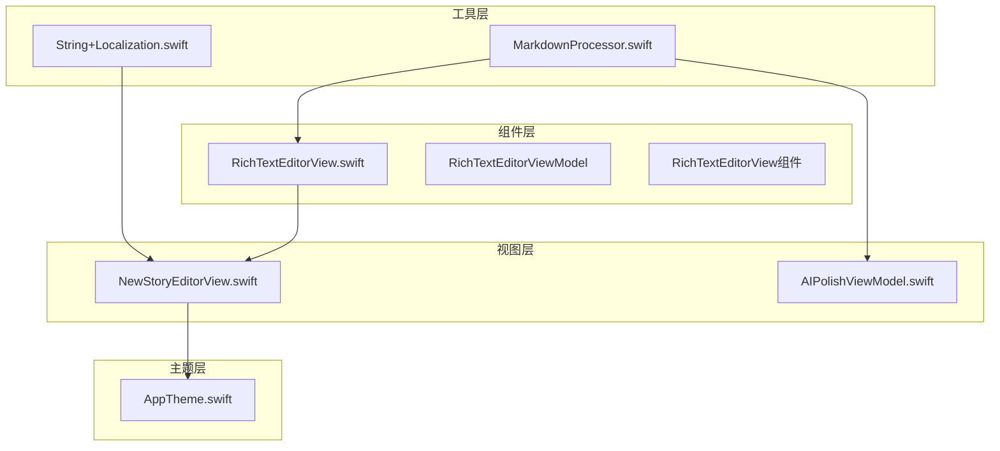
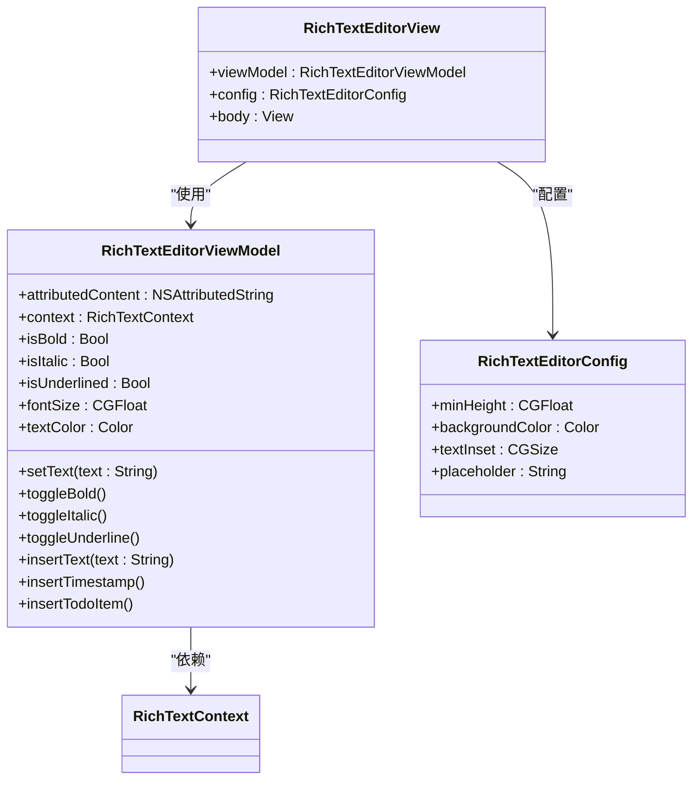
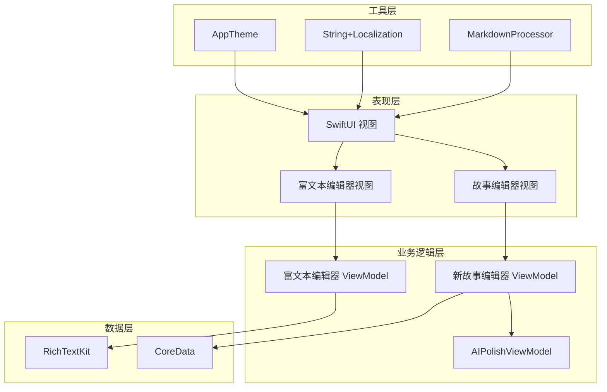
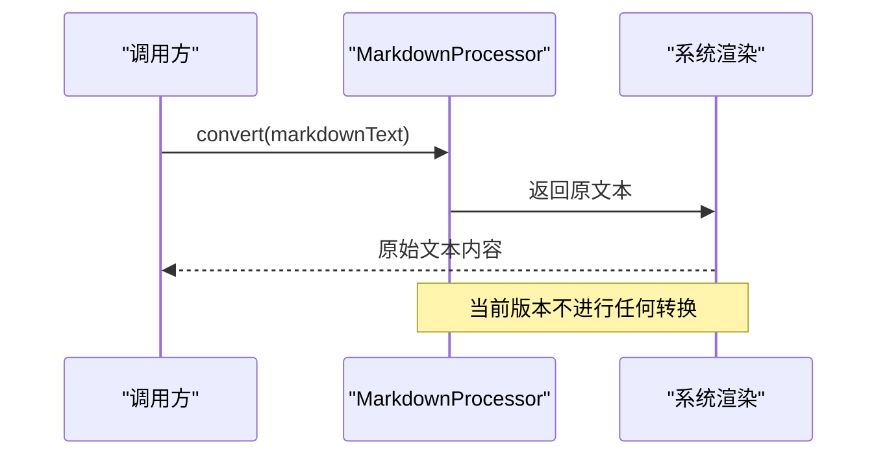
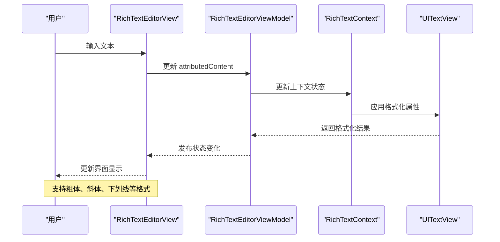
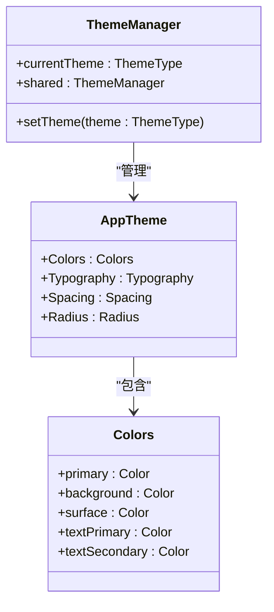
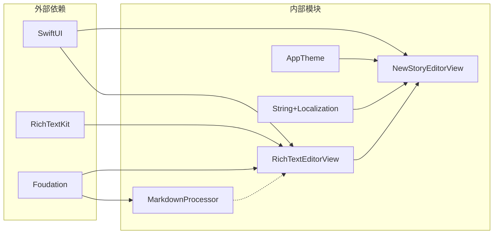

# Markdown 处理器

<cite>
**本文档引用的文件**
- [MarkdownProcessor.swift](file://MyStory/Utils/MarkdownProcessor.swift)
- [RichTextEditorView.swift](file://MyStory/Components/RichTextEditorView.swift)
- [NewStoryEditorView.swift](file://MyStory/Views/Editor/NewStoryEditorView.swift)
- [AppTheme.swift](file://MyStory/Components/Theme/AppTheme.swift)
- [AIPolishViewModel.swift](file://MyStory/ViewModels/Editor/AIPolishViewModel.swift)
- [String+Localization.swift](file://MyStory/Utils/String+Localization.swift)
</cite>

## 目录
1. [简介](#简介)
2. [项目结构](#项目结构)
3. [核心组件](#核心组件)
4. [架构概览](#架构概览)
5. [详细组件分析](#详细组件分析)
6. [依赖关系分析](#依赖关系分析)
7. [性能考虑](#性能考虑)
8. [故障排除指南](#故障排除指南)
9. [结论](#结论)

## 简介

本文档详细介绍 MyStory 项目中的 Markdown 处理器实现。当前项目采用了一种渐进式的 Markdown 处理策略：通过 `MarkdownProcessor` 提供基础的 Markdown 文本转换能力，同时在富文本编辑器中完全依赖系统 RichTextKit 来处理富文本格式化。

该设计既满足了当前的功能需求，又为未来的 Markdown 语法解析和富文本转换提供了扩展空间。系统通过统一的主题管理和本地化支持，确保了良好的用户体验和代码可维护性。

## 项目结构

项目采用模块化的组织方式，Markdown 处理功能主要分布在以下目录：



**图表来源**
- [MarkdownProcessor.swift](file://MyStory/Utils/MarkdownProcessor.swift#L1-L9)
- [RichTextEditorView.swift](file://MyStory/Components/RichTextEditorView.swift#L1-L431)
- [NewStoryEditorView.swift](file://MyStory/Views/Editor/NewStoryEditorView.swift#L1-L1057)

**章节来源**
- [MarkdownProcessor.swift](file://MyStory/Utils/MarkdownProcessor.swift#L1-L9)
- [RichTextEditorView.swift](file://MyStory/Components/RichTextEditorView.swift#L1-L431)
- [NewStoryEditorView.swift](file://MyStory/Views/Editor/NewStoryEditorView.swift#L1-L1057)

## 核心组件

### MarkdownProcessor 组件

`MarkdownProcessor` 是一个简单的静态工具类，当前实现了基础的文本转换功能：

```mermaid
classDiagram
class MarkdownProcessor {
<<enumeration>>
+convert(text : String) String
}
note for MarkdownProcessor : "当前版本直接返回原文本\n未来可扩展为完整的\nMarkdown 解析器"
```

**图表来源**
- [MarkdownProcessor.swift](file://MyStory/Utils/MarkdownProcessor.swift#L3-L8)

### 富文本编辑器组件

富文本编辑器采用 MVVM 架构模式，包含三个主要部分：



**图表来源**
- [RichTextEditorView.swift](file://MyStory/Components/RichTextEditorView.swift#L32-L362)
- [RichTextEditorView.swift](file://MyStory/Components/RichTextEditorView.swift#L14-L27)

**章节来源**
- [RichTextEditorView.swift](file://MyStory/Components/RichTextEditorView.swift#L31-L362)

## 架构概览

系统采用分层架构设计，确保了功能的清晰分离和良好的可扩展性：



**图表来源**
- [RichTextEditorView.swift](file://MyStory/Components/RichTextEditorView.swift#L366-L430)
- [NewStoryEditorView.swift](file://MyStory/Views/Editor/NewStoryEditorView.swift#L8-L1057)

## 详细组件分析

### MarkdownProcessor 实现分析

当前的 `MarkdownProcessor` 实现极其简洁，体现了"最小可行产品"的设计理念：



**图表来源**
- [MarkdownProcessor.swift](file://MyStory/Utils/MarkdownProcessor.swift#L5-L7)

这种设计的优势在于：
- **简单可靠**：减少了潜在的解析错误
- **性能优异**：O(1) 时间复杂度
- **易于扩展**：为未来的 Markdown 解析器实现预留接口

### 富文本编辑器工作流程

富文本编辑器的交互流程展示了完整的 MVVM 模式实现：



**图表来源**
- [RichTextEditorView.swift](file://MyStory/Components/RichTextEditorView.swift#L366-L430)
- [RichTextEditorView.swift](file://MyStory/Components/RichTextEditorView.swift#L32-L362)

### 主题系统集成

系统通过统一的主题管理器提供一致的视觉体验：



**图表来源**
- [AppTheme.swift](file://MyStory/Components/Theme/AppTheme.swift#L135-L152)
- [AppTheme.swift](file://MyStory/Components/Theme/AppTheme.swift#L154-L307)

**章节来源**
- [AppTheme.swift](file://MyStory/Components/Theme/AppTheme.swift#L1-L328)

## 依赖关系分析

系统的关键依赖关系如下：



**图表来源**
- [RichTextEditorView.swift](file://MyStory/Components/RichTextEditorView.swift#L9-L10)
- [MarkdownProcessor.swift](file://MyStory/Utils/MarkdownProcessor.swift#L1)

**章节来源**
- [RichTextEditorView.swift](file://MyStory/Components/RichTextEditorView.swift#L1-L431)
- [MarkdownProcessor.swift](file://MyStory/Utils/MarkdownProcessor.swift#L1-L9)

## 性能考虑

### 内存管理优化

系统采用了多种内存管理策略：

1. **弱引用机制**：编辑器视图模型使用弱引用避免循环引用
2. **延迟初始化**：富文本上下文按需创建
3. **主线程更新**：所有 UI 更新都在主线程执行

### 性能优化建议

基于当前实现，以下是推荐的优化方案：

1. **Markdown 解析缓存**
   ```swift
   // 建议：添加解析结果缓存
   static var parseCache = [String: String]()
   ```

2. **增量更新机制**
   ```swift
   // 建议：实现增量富文本更新
   func updateIncrementally(newText: String, range: NSRange)
   ```

3. **异步处理**
   ```swift
   // 建议：长文本处理使用后台队列
   DispatchQueue.global(qos: .userInitiated).async {
       // 处理逻辑
   }
   ```

## 故障排除指南

### 常见问题及解决方案

1. **富文本格式丢失**
   - 检查 `RichTextContext` 的状态同步
   - 确认 `attributedContent` 的正确更新

2. **主题颜色不生效**
   - 验证 `ThemeManager` 的单例实例
   - 检查 `AppTheme` 的颜色计算逻辑

3. **本地化字符串显示异常**
   - 确认 `LocalizationManager` 的配置
   - 检查 `.strings` 文件的编码格式

**章节来源**
- [RichTextEditorView.swift](file://MyStory/Components/RichTextEditorView.swift#L58-L77)
- [AppTheme.swift](file://MyStory/Components/Theme/AppTheme.swift#L135-L152)

## 结论

MyStory 项目的 Markdown 处理器展现了现代 iOS 开发的最佳实践：

### 设计优势
- **渐进式开发**：从简单实现开始，逐步增强功能
- **架构清晰**：MVVM 模式确保了良好的代码组织
- **扩展性强**：为未来的 Markdown 解析功能预留了接口

### 技术亮点
- **性能优化**：当前实现具有优异的运行时性能
- **用户体验**：完整的富文本编辑功能
- **主题系统**：统一的视觉设计语言

### 发展方向
1. **增强 Markdown 支持**：实现完整的 Markdown 语法解析
2. **性能提升**：添加解析缓存和异步处理
3. **功能扩展**：支持表格、代码块等高级 Markdown 特性

该实现为构建高质量的富文本编辑应用奠定了坚实的基础，既满足了当前需求，又为未来发展提供了清晰的路径。