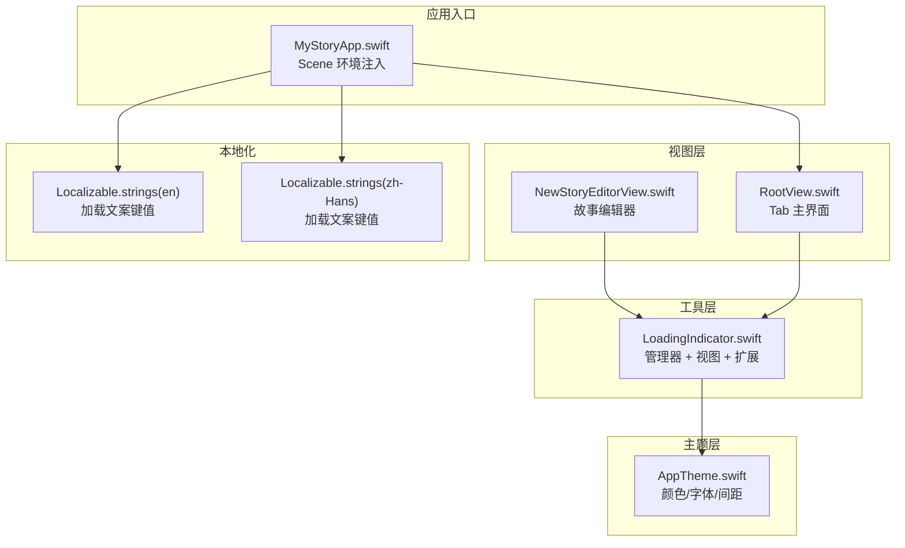
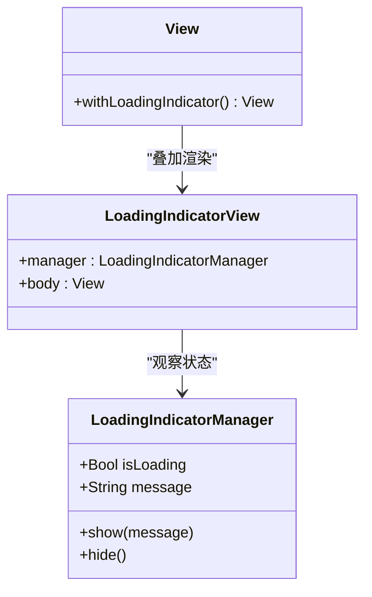
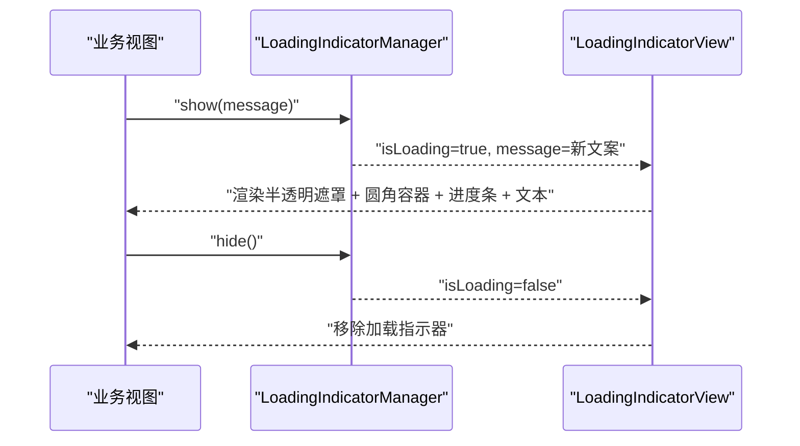
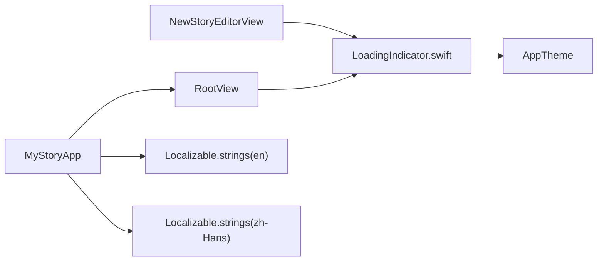

# 加载指示器

<cite>
**本文引用的文件**
- [LoadingIndicator.swift](file://MyStory/Utils/LoadingIndicator.swift)
- [NewStoryEditorView.swift](file://MyStory/Views/Editor/NewStoryEditorView.swift)
- [AppTheme.swift](file://MyStory/Components/Theme/AppTheme.swift)
- [RootView.swift](file://MyStory/Views/RootView.swift)
- [MyStoryApp.swift](file://MyStory/MyStoryApp.swift)
- [Localizable.strings (英文)](file://MyStory/Resources/Localizable/en.lproj/Localizable.strings)
- [Localizable.strings (中文)](file://MyStory/Resources/Localizable/zh-Hans.lproj/Localizable.strings)
</cite>

## 目录
1. [简介](#简介)
2. [项目结构](#项目结构)
3. [核心组件](#核心组件)
4. [架构总览](#架构总览)
5. [组件详解](#组件详解)
6. [依赖关系分析](#依赖关系分析)
7. [性能考量](#性能考量)
8. [故障排查指南](#故障排查指南)
9. [结论](#结论)
10. [附录](#附录)

## 简介
本文件围绕加载指示器工具类进行系统性说明，目标是帮助开发者理解 LoadingIndicator 的设计目的、实现原理与最佳实践。文档覆盖以下方面：
- 设计目的与适用场景：在异步操作期间向用户反馈“正在处理”的状态，避免界面冻结感与误操作。
- 实现原理：基于单例管理器与 SwiftUI 视图组合，通过发布订阅驱动 UI 更新。
- 状态管理：isLoading 与 message 的双向绑定，确保显示与隐藏时机可控。
- 视觉反馈：半透明遮罩、圆角背景、白色文字与白色环形进度条，统一在暗色背景下呈现。
- 使用示例：在媒体加载与定位请求中正确显示与隐藏加载指示器。
- 自定义样式与主题适配：如何在现有基础上调整尺寸、颜色与动画。
- 性能与体验：主线程调度、过渡动画、避免频繁重绘与卡顿。

## 项目结构
加载指示器位于工具层 Utils，配合视图扩展与业务视图共同使用；主题系统 AppTheme 提供颜色与排版基础，保证加载指示器在不同主题下具备一致的可读性与对比度。

图表来源
- [LoadingIndicator.swift](file://MyStory/Utils/LoadingIndicator.swift#L1-L69)
- [NewStoryEditorView.swift](file://MyStory/Views/Editor/NewStoryEditorView.swift#L50-L90)
- [RootView.swift](file://MyStory/Views/RootView.swift#L1-L43)
- [AppTheme.swift](file://MyStory/Components/Theme/AppTheme.swift#L154-L307)
- [MyStoryApp.swift](file://MyStory/MyStoryApp.swift#L21-L29)
- [Localizable.strings (英文)](file://MyStory/Resources/Localizable/en.lproj/Localizable.strings#L15-L45)
- [Localizable.strings (中文)](file://MyStory/Resources/Localizable/zh-Hans.lproj/Localizable.strings#L15-L45)

章节来源
- [LoadingIndicator.swift](file://MyStory/Utils/LoadingIndicator.swift#L1-L69)
- [NewStoryEditorView.swift](file://MyStory/Views/Editor/NewStoryEditorView.swift#L50-L90)
- [RootView.swift](file://MyStory/Views/RootView.swift#L1-L43)
- [AppTheme.swift](file://MyStory/Components/Theme/AppTheme.swift#L154-L307)
- [MyStoryApp.swift](file://MyStory/MyStoryApp.swift#L21-L29)

## 核心组件
- LoadingIndicatorManager：全局单例，持有 isLoading 与 message 两个发布属性，提供 show(message:) 与 hide() 方法，确保在主线程更新状态。
- LoadingIndicatorView：ZStack 组合视图，仅在 isLoading 为真时渲染，包含半透明遮罩、圆角背景容器、环形进度条与提示文本，并配置过渡动画。
- View 扩展 withLoadingIndicator：将 LoadingIndicatorView 作为子视图叠加在任意视图之上，便于在多个页面复用。

章节来源
- [LoadingIndicator.swift](file://MyStory/Utils/LoadingIndicator.swift#L4-L26)
- [LoadingIndicator.swift](file://MyStory/Utils/LoadingIndicator.swift#L29-L58)
- [LoadingIndicator.swift](file://MyStory/Utils/LoadingIndicator.swift#L61-L68)

## 架构总览
加载指示器采用“管理器 + 视图 + 扩展”的分层设计，遵循 SwiftUI 的声明式 UI 与响应式数据流：
- 数据层：LoadingIndicatorManager 作为 ObservableObject，集中管理加载状态与提示文案。
- 视图层：LoadingIndicatorView 基于管理器状态渲染 UI，使用 ZStack 与过渡动画提升体验。
- 扩展层：withLoadingIndicator 将加载指示器无缝嵌入任意视图，降低耦合与重复代码。
- 业务层：在异步任务前后调用 show/hide，确保用户感知明确。

图表来源
- [LoadingIndicator.swift](file://MyStory/Utils/LoadingIndicator.swift#L4-L26)
- [LoadingIndicator.swift](file://MyStory/Utils/LoadingIndicator.swift#L29-L58)
- [LoadingIndicator.swift](file://MyStory/Utils/LoadingIndicator.swift#L61-L68)

## 组件详解

### 管理器：LoadingIndicatorManager
- 单例共享：通过静态 shared 提供全局唯一实例，避免多处重复初始化。
- 状态字段：isLoading 控制是否显示；message 用于动态更新提示文案。
- 主线程更新：在 show/hide 中使用主线程异步更新，保证 UI 线程安全。
- 使用建议：在业务逻辑开始前调用 show，结束后调用 hide；若需动态更新文案，可在 show 时传入新消息。

章节来源
- [LoadingIndicator.swift](file://MyStory/Utils/LoadingIndicator.swift#L4-L26)

### 视图：LoadingIndicatorView
- 渲染条件：仅当 manager.isLoading 为真时渲染，避免无意义的视图开销。
- 视觉元素：半透明黑色遮罩覆盖全屏，圆角深色背景容器包裹进度条与文本，白色文字与进度条确保在深色背景下清晰可见。
- 动画与过渡：配置了淡入淡出与缩放+透明度组合过渡，时长 0.2 秒，提升出现/消失的顺滑度。
- 文案来源：直接绑定 manager.message，支持国际化键值。

章节来源
- [LoadingIndicator.swift](file://MyStory/Utils/LoadingIndicator.swift#L29-L58)

### 视图扩展：withLoadingIndicator
- 组合策略：将原视图与 LoadingIndicatorView 进行 ZStack 叠加，使加载指示器成为被叠加层。
- 使用方式：在任意视图上调用 .withLoadingIndicator() 即可启用全局加载指示器。

章节来源
- [LoadingIndicator.swift](file://MyStory/Utils/LoadingIndicator.swift#L61-L68)

### 在业务视图中的使用示例
- 故事编辑器媒体处理：在预期加载视频时先显示加载提示，完成后隐藏。
- 定位服务：请求当前位置前显示提示，回调中隐藏并更新界面状态。
- 主界面集成：RootView 作为主入口，可直接叠加加载指示器，便于在导航栈内统一控制。

图表来源
- [NewStoryEditorView.swift](file://MyStory/Views/Editor/NewStoryEditorView.swift#L715-L745)
- [NewStoryEditorView.swift](file://MyStory/Views/Editor/NewStoryEditorView.swift#L811-L822)
- [LoadingIndicator.swift](file://MyStory/Utils/LoadingIndicator.swift#L12-L25)

章节来源
- [NewStoryEditorView.swift](file://MyStory/Views/Editor/NewStoryEditorView.swift#L57-L59)
- [NewStoryEditorView.swift](file://MyStory/Views/Editor/NewStoryEditorView.swift#L715-L745)
- [NewStoryEditorView.swift](file://MyStory/Views/Editor/NewStoryEditorView.swift#L811-L822)

### 显示与隐藏时机
- 显示时机：在异步任务开始前（如网络请求、文件读写、视频解码、定位请求）调用 show(message:)。
- 隐藏时机：在异步任务完成或失败回调中调用 hide()，确保无论成功与否都及时关闭。
- 注意事项：确保在主线程更新 UI，避免界面卡顿或状态错乱。

章节来源
- [NewStoryEditorView.swift](file://MyStory/Views/Editor/NewStoryEditorView.swift#L715-L745)
- [NewStoryEditorView.swift](file://MyStory/Views/Editor/NewStoryEditorView.swift#L811-L822)

### 动画效果与用户体验
- 出现/消失：使用淡入淡出与缩放+透明度组合过渡，时长 0.2 秒，减少突兀感。
- 可读性：深色背景 + 白色文字 + 白色进度条，保证在不同主题下均具备良好对比度。
- 屏幕覆盖：遮罩覆盖全屏，避免用户误触，同时突出加载状态。

章节来源
- [LoadingIndicator.swift](file://MyStory/Utils/LoadingIndicator.swift#L34-L56)

### 自定义样式与主题适配
- 颜色与背景：当前使用深色半透明背景与白色文字，适配浅色与深色主题。若需适配特定主题，可在 AppTheme 中引入主题色常量并替换背景与文字颜色。
- 尺寸与间距：可通过修改圆角半径、内边距、进度条缩放比例等参数调整视觉尺寸。
- 字体与文案：文案来自本地化键值，可在 Localizable.strings 中新增或修改键值，以满足多语言需求。
- 主题联动：RootView 与 AppTheme 已对主题变化进行强制重渲染，加载指示器可随主题变化保持一致的可读性。

章节来源
- [AppTheme.swift](file://MyStory/Components/Theme/AppTheme.swift#L154-L307)
- [Localizable.strings (英文)](file://MyStory/Resources/Localizable/en.lproj/Localizable.strings#L15-L45)
- [Localizable.strings (中文)](file://MyStory/Resources/Localizable/zh-Hans.lproj/Localizable.strings#L15-L45)

### 性能与最佳实践
- 主线程更新：所有 show/hide 操作均在主线程执行，避免跨线程更新 UI 导致的异常。
- 最小化重绘：仅在 isLoading 变化时触发动画与重绘，避免频繁刷新。
- 合理的提示文案：使用本地化键值，确保文案简洁明确，避免过长导致布局抖动。
- 一致性：在相同业务场景下统一使用同一提示文案，提升用户认知效率。
- 防止滥用：仅在确实需要等待的异步操作中显示，避免短时闪烁造成干扰。

章节来源
- [LoadingIndicator.swift](file://MyStory/Utils/LoadingIndicator.swift#L12-L25)

## 依赖关系分析
- 与业务视图的耦合：通过 View 扩展与单例管理器，降低对具体业务的耦合度，便于在多处复用。
- 与主题系统的协作：加载指示器的颜色与对比度与 AppTheme 的颜色体系协同，确保在不同主题下保持一致的可读性。
- 与本地化的协作：提示文案通过本地化键值管理，支持多语言切换。

图表来源
- [NewStoryEditorView.swift](file://MyStory/Views/Editor/NewStoryEditorView.swift#L57-L59)
- [RootView.swift](file://MyStory/Views/RootView.swift#L1-L43)
- [LoadingIndicator.swift](file://MyStory/Utils/LoadingIndicator.swift#L1-L69)
- [AppTheme.swift](file://MyStory/Components/Theme/AppTheme.swift#L154-L307)
- [MyStoryApp.swift](file://MyStory/MyStoryApp.swift#L21-L29)
- [Localizable.strings (英文)](file://MyStory/Resources/Localizable/en.lproj/Localizable.strings#L15-L45)
- [Localizable.strings (中文)](file://MyStory/Resources/Localizable/zh-Hans.lproj/Localizable.strings#L15-L45)

章节来源
- [NewStoryEditorView.swift](file://MyStory/Views/Editor/NewStoryEditorView.swift#L57-L59)
- [RootView.swift](file://MyStory/Views/RootView.swift#L1-L43)
- [LoadingIndicator.swift](file://MyStory/Utils/LoadingIndicator.swift#L1-L69)
- [AppTheme.swift](file://MyStory/Components/Theme/AppTheme.swift#L154-L307)
- [MyStoryApp.swift](file://MyStory/MyStoryApp.swift#L21-L29)

## 性能考量
- 主线程调度：所有状态更新在主线程执行，避免 UI 卡顿与状态不一致。
- 动画时长：0.2 秒的过渡时长兼顾流畅与即时，适合大多数加载场景。
- 视图层级：ZStack 叠加不会引入额外复杂布局计算，渲染成本较低。
- 文案长度：建议本地化文案保持简洁，避免因文本过长导致布局抖动与重绘。

## 故障排查指南
- 指示器不显示
  - 检查是否在主线程调用 show/hide。
  - 确认 isLoading 是否被其他逻辑覆盖。
- 指示器不消失
  - 确保异步任务结束时调用 hide()，并在回调中回到主线程。
- 文案不更新
  - 确认传入的本地化键值存在且正确。
- 主题下可读性差
  - 调整背景与文字颜色，使其在当前主题下具备足够对比度。

章节来源
- [LoadingIndicator.swift](file://MyStory/Utils/LoadingIndicator.swift#L12-L25)
- [NewStoryEditorView.swift](file://MyStory/Views/Editor/NewStoryEditorView.swift#L811-L822)

## 结论
LoadingIndicator 通过简洁的单例管理器与 SwiftUI 视图组合，提供了统一、易用、可定制的加载反馈机制。结合本地化与主题系统，能够在不同语言与主题下保持一致的用户体验。建议在所有需要等待的异步操作中规范使用，以提升应用的可感知性能与用户满意度。

## 附录
- 使用清单
  - 在业务开始前调用 LoadingIndicatorManager.shared.show(message:)
  - 在业务结束后调用 LoadingIndicatorManager.shared.hide()
  - 在视图上叠加 .withLoadingIndicator() 以启用全局加载指示器
  - 通过本地化键值管理提示文案，确保多语言支持