# 工具类和实用程序

<cite>
**本文引用的文件**
- [LocalizationManager.swift](file://MyStory/Utils/LocalizationManager.swift)
- [String+Localization.swift](file://MyStory/Utils/String+Localization.swift)
- [LoadingIndicator.swift](file://MyStory/Utils/LoadingIndicator.swift)
- [MarkdownProcessor.swift](file://MyStory/Utils/MarkdownProcessor.swift)
- [SensitiveFilter.swift](file://MyStory/Utils/SensitiveFilter.swift)
- [CustomIconHelper.swift](file://MyStory/Utils/CustomIconHelper.swift)
- [VideoTransferable.swift](file://MyStory/Utils/VideoTransferable.swift)
- [ToastView.swift（组件）](file://MyStory/Components/ToastView.swift)
- [CropShape.swift](file://MyStory/Models/Category/CropShape.swift)
- [en.lproj/Localizable.strings](file://MyStory/Resources/Localizable/en.lproj/Localizable.strings)
- [zh-Hans.lproj/Localizable.strings](file://MyStory/Resources/Localizable/zh-Hans.lproj/Localizable.strings)
- [多语言使用快速参考.md](file://多语言使用快速参考.md)
- [多语言支持实现说明.md](file://多语言支持实现说明.md)
</cite>

## 目录
1. [简介](#简介)
2. [项目结构](#项目结构)
3. [核心组件](#核心组件)
4. [架构总览](#架构总览)
5. [详细组件分析](#详细组件分析)
6. [依赖关系分析](#依赖关系分析)
7. [性能考量](#性能考量)
8. [故障排查指南](#故障排查指南)
9. [结论](#结论)
10. [附录](#附录)

## 简介
本文件系统性梳理 MyStory 项目中的工具类与实用程序，覆盖本地化管理、加载指示器、Markdown 处理、敏感词过滤、字符串本地化扩展、图标处理、视频拖拽传输以及 Toast 提示等模块。文档从设计原则、使用场景、配置选项、调用流程、扩展方法到测试与质量保障，逐项给出说明与可视化图示，帮助开发者在项目中正确、一致地使用这些工具。

## 项目结构
工具类主要位于 Utils 目录，配合 Components 中的 ToastView、Models 中的 CropShape，以及 Resources 下的多语言字符串资源共同构成工具体系。

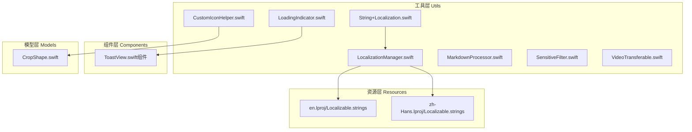

图表来源
- [LocalizationManager.swift](file://MyStory/Utils/LocalizationManager.swift#L1-L107)
- [String+Localization.swift](file://MyStory/Utils/String+Localization.swift#L1-L47)
- [LoadingIndicator.swift](file://MyStory/Utils/LoadingIndicator.swift#L1-L69)
- [MarkdownProcessor.swift](file://MyStory/Utils/MarkdownProcessor.swift#L1-L9)
- [SensitiveFilter.swift](file://MyStory/Utils/SensitiveFilter.swift#L1-L18)
- [CustomIconHelper.swift](file://MyStory/Utils/CustomIconHelper.swift#L1-L162)
- [VideoTransferable.swift](file://MyStory/Utils/VideoTransferable.swift#L1-L34)
- [ToastView.swift（组件）](file://MyStory/Components/ToastView.swift#L1-L158)
- [CropShape.swift](file://MyStory/Models/Category/CropShape.swift#L1-L34)
- [en.lproj/Localizable.strings](file://MyStory/Resources/Localizable/en.lproj/Localizable.strings#L1-L307)
- [zh-Hans.lproj/Localizable.strings](file://MyStory/Resources/Localizable/zh-Hans.lproj/Localizable.strings#L1-L307)

章节来源
- [LocalizationManager.swift](file://MyStory/Utils/LocalizationManager.swift#L1-L107)
- [String+Localization.swift](file://MyStory/Utils/String+Localization.swift#L1-L47)
- [LoadingIndicator.swift](file://MyStory/Utils/LoadingIndicator.swift#L1-L69)
- [MarkdownProcessor.swift](file://MyStory/Utils/MarkdownProcessor.swift#L1-L9)
- [SensitiveFilter.swift](file://MyStory/Utils/SensitiveFilter.swift#L1-L18)
- [CustomIconHelper.swift](file://MyStory/Utils/CustomIconHelper.swift#L1-L162)
- [VideoTransferable.swift](file://MyStory/Utils/VideoTransferable.swift#L1-L34)
- [ToastView.swift（组件）](file://MyStory/Components/ToastView.swift#L1-L158)
- [CropShape.swift](file://MyStory/Models/Category/CropShape.swift#L1-L34)
- [en.lproj/Localizable.strings](file://MyStory/Resources/Localizable/en.lproj/Localizable.strings#L1-L307)
- [zh-Hans.lproj/Localizable.strings](file://MyStory/Resources/Localizable/zh-Hans.lproj/Localizable.strings#L1-L307)

## 核心组件
- 本地化管理器：负责语言切换、Bundle 选择、通知广播与字符串获取。
- 字符串本地化扩展：提供便捷的本地化字符串访问与参数化格式化。
- 加载指示器：全局统一的加载遮罩与消息展示。
- Markdown 处理器：当前为占位实现，便于后续扩展。
- 敏感词过滤器：静态词库替换，便于扩展为外部词库。
- 图标处理工具：图片裁剪、圆形处理、尺寸调整、数据互转与校验。
- 视频可传输封装：基于 UniformTypeIdentifiers 的跨应用视频拖拽传输。
- Toast 提示组件：统一的成功/错误/信息/警告提示，支持自动消失与触觉反馈。

章节来源
- [LocalizationManager.swift](file://MyStory/Utils/LocalizationManager.swift#L30-L107)
- [String+Localization.swift](file://MyStory/Utils/String+Localization.swift#L10-L47)
- [LoadingIndicator.swift](file://MyStory/Utils/LoadingIndicator.swift#L4-L69)
- [MarkdownProcessor.swift](file://MyStory/Utils/MarkdownProcessor.swift#L3-L9)
- [SensitiveFilter.swift](file://MyStory/Utils/SensitiveFilter.swift#L3-L18)
- [CustomIconHelper.swift](file://MyStory/Utils/CustomIconHelper.swift#L6-L162)
- [VideoTransferable.swift](file://MyStory/Utils/VideoTransferable.swift#L5-L34)
- [ToastView.swift（组件）](file://MyStory/Components/ToastView.swift#L10-L158)

## 架构总览
工具类围绕“单一职责”和“可组合”设计，通过单例或静态方法提供全局能力，同时与 SwiftUI 视图层通过环境对象、修饰符、绑定等方式集成。

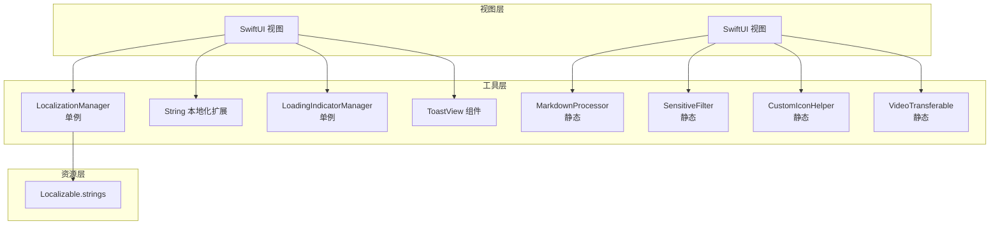

图表来源
- [LocalizationManager.swift](file://MyStory/Utils/LocalizationManager.swift#L30-L107)
- [String+Localization.swift](file://MyStory/Utils/String+Localization.swift#L10-L26)
- [LoadingIndicator.swift](file://MyStory/Utils/LoadingIndicator.swift#L4-L26)
- [ToastView.swift（组件）](file://MyStory/Components/ToastView.swift#L54-L158)
- [MarkdownProcessor.swift](file://MyStory/Utils/MarkdownProcessor.swift#L3-L8)
- [SensitiveFilter.swift](file://MyStory/Utils/SensitiveFilter.swift#L3-L17)
- [CustomIconHelper.swift](file://MyStory/Utils/CustomIconHelper.swift#L6-L162)
- [VideoTransferable.swift](file://MyStory/Utils/VideoTransferable.swift#L5-L33)
- [en.lproj/Localizable.strings](file://MyStory/Resources/Localizable/en.lproj/Localizable.strings#L1-L307)
- [zh-Hans.lproj/Localizable.strings](file://MyStory/Resources/Localizable/zh-Hans.lproj/Localizable.strings#L1-L307)

## 详细组件分析

### 本地化管理器（LocalizationManager）
- 功能概述
  - 支持语言枚举（中文、英文），提供显示名与代码。
  - 单例管理当前语言，持久化至 UserDefaults，变更时广播通知。
  - 动态选择对应 lproj Bundle，提供本地化字符串获取与参数化格式化。
- 关键点
  - 初始化优先读取 UserDefaults，否则根据系统语言推断默认值。
  - 语言切换后更新 Bundle 并通过通知驱动视图刷新。
- 使用场景
  - 设置页面语言切换、视图文本本地化、动态 Bundle 加载。
- 配置选项
  - 语言枚举扩展显示名与代码，便于 UI 展示与逻辑判断。
- 最佳实践
  - 通过 String 扩展访问本地化字符串，避免直接拼接键值。
  - 对频繁使用的文本进行缓存复用，减少重复查找。
- 测试策略
  - 单元测试：验证语言切换、Bundle 选择、字符串格式化。
  - 集成测试：模拟设置页面切换语言，验证视图刷新与通知传播。

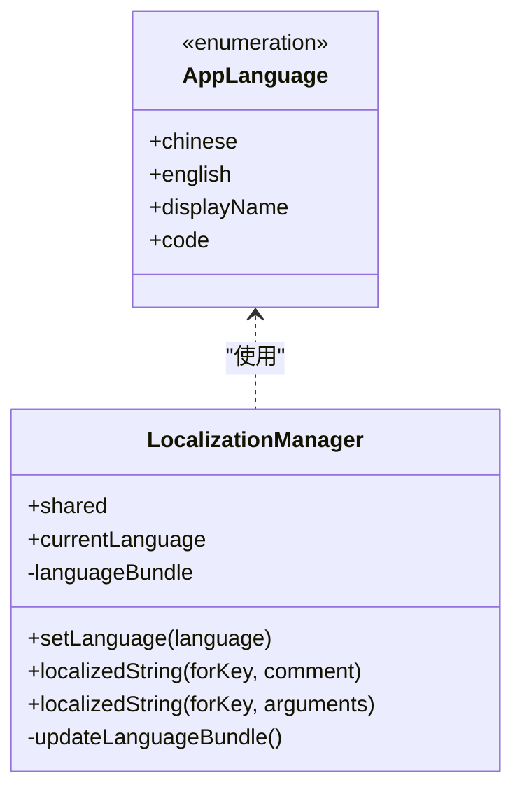

图表来源
- [LocalizationManager.swift](file://MyStory/Utils/LocalizationManager.swift#L11-L107)

章节来源
- [LocalizationManager.swift](file://MyStory/Utils/LocalizationManager.swift#L11-L107)
- [多语言使用快速参考.md](file://多语言使用快速参考.md#L167-L227)
- [多语言支持实现说明.md](file://多语言支持实现说明.md#L1-L98)
- [en.lproj/Localizable.strings](file://MyStory/Resources/Localizable/en.lproj/Localizable.strings#L1-L307)
- [zh-Hans.lproj/Localizable.strings](file://MyStory/Resources/Localizable/zh-Hans.lproj/Localizable.strings#L1-L307)

### 字符串本地化扩展（String+Localization）
- 功能概述
  - 提供便捷的本地化字符串访问与参数化格式化。
  - 预定义常用键的静态属性，便于集中管理。
- 使用场景
  - 快速获取本地化文本、参数化提示文案。
- 最佳实践
  - 优先使用扩展属性，避免硬编码键值。
  - 参数化格式化时注意占位符与参数数量匹配。
- 测试策略
  - 单元测试：验证键值存在性、格式化结果、注释参数传递。

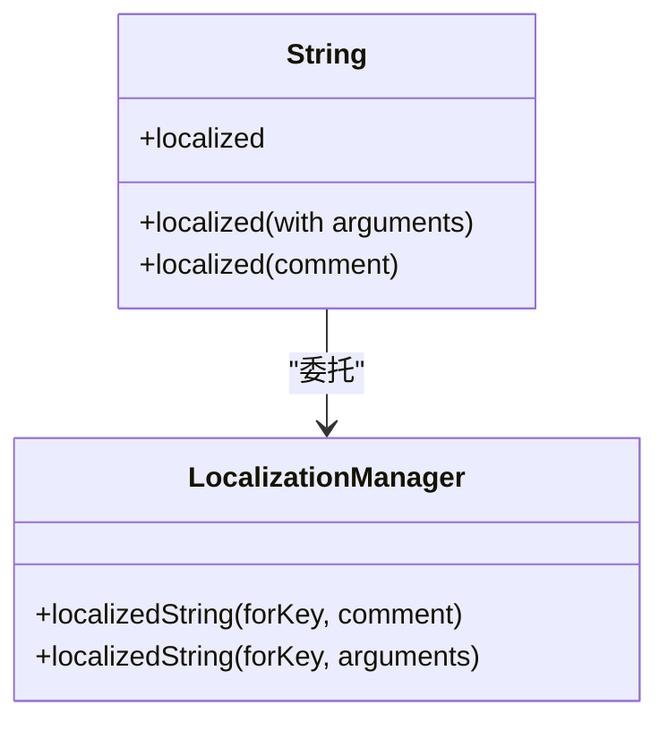

图表来源
- [String+Localization.swift](file://MyStory/Utils/String+Localization.swift#L10-L26)
- [LocalizationManager.swift](file://MyStory/Utils/LocalizationManager.swift#L76-L88)

章节来源
- [String+Localization.swift](file://MyStory/Utils/String+Localization.swift#L10-L47)

### 加载指示器（LoadingIndicator）
- 功能概述
  - 全局加载指示器管理器，提供显示/隐藏与消息更新。
  - 视图层以遮罩形式叠加在任意视图之上，支持动画过渡。
  - 提供 View 扩展，便于在任意视图上叠加加载指示器。
- 使用场景
  - 异步任务执行期间的全局提示，避免阻塞交互。
- 最佳实践
  - 在主线程更新状态，避免 UI 卡顿。
  - 合理设置消息文案，提升用户感知。
- 测试策略
  - 单元测试：验证显示/隐藏状态、消息更新。
  - UI 测试：验证遮罩层级、动画效果与交互响应。

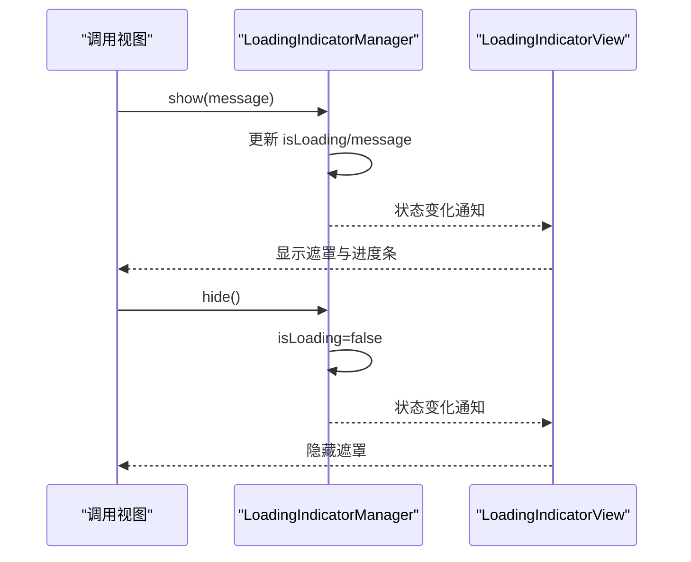

图表来源
- [LoadingIndicator.swift](file://MyStory/Utils/LoadingIndicator.swift#L4-L69)

章节来源
- [LoadingIndicator.swift](file://MyStory/Utils/LoadingIndicator.swift#L4-L69)

### Markdown 处理器（MarkdownProcessor）
- 功能概述
  - 当前为占位实现，直接返回原文本，便于后续接入系统 Markdown 渲染或自定义解析。
- 使用场景
  - 故事内容渲染、富文本预处理。
- 最佳实践
  - 保留扩展点，按需引入解析库或自定义规则。
- 测试策略
  - 单元测试：验证输入输出一致性、边界字符处理。

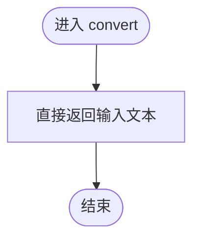

图表来源
- [MarkdownProcessor.swift](file://MyStory/Utils/MarkdownProcessor.swift#L3-L8)

章节来源
- [MarkdownProcessor.swift](file://MyStory/Utils/MarkdownProcessor.swift#L3-L9)

### 敏感词过滤器（SensitiveFilter）
- 功能概述
  - 基于静态词库进行敏感词替换，当前示例包含若干测试词，可扩展为外部词库。
- 使用场景
  - 内容发布前的敏感词筛查与替换。
- 最佳实践
  - 将词库外置（如 JSON/数据库），支持热更新与多语言词库。
  - 提供白名单机制，避免误伤。
- 测试策略
  - 单元测试：验证替换行为、空词处理、边界情况。

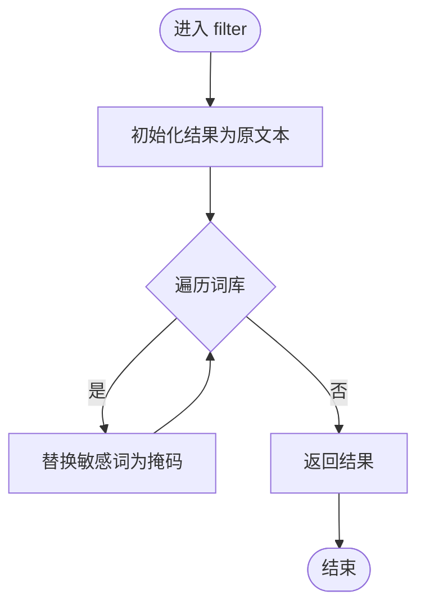

图表来源
- [SensitiveFilter.swift](file://MyStory/Utils/SensitiveFilter.swift#L3-L17)

章节来源
- [SensitiveFilter.swift](file://MyStory/Utils/SensitiveFilter.swift#L3-L18)

### 图标处理工具（CustomIconHelper）
- 功能概述
  - 图片裁剪（矩形/圆形）、尺寸调整、数据互转、有效性校验、适合尺寸计算。
  - 提供统一的图标处理流程：裁剪 → 调整 → 编码。
- 使用场景
  - 用户头像、分类图标生成与标准化。
- 最佳实践
  - 保持输入图片有效性校验，避免崩溃。
  - 圆形处理使用裁剪路径，保证边缘平滑。
- 测试策略
  - 单元测试：验证裁剪区域、比例缩放、圆形裁剪、数据转换。
  - 集成测试：端到端生成图标数据并回读。

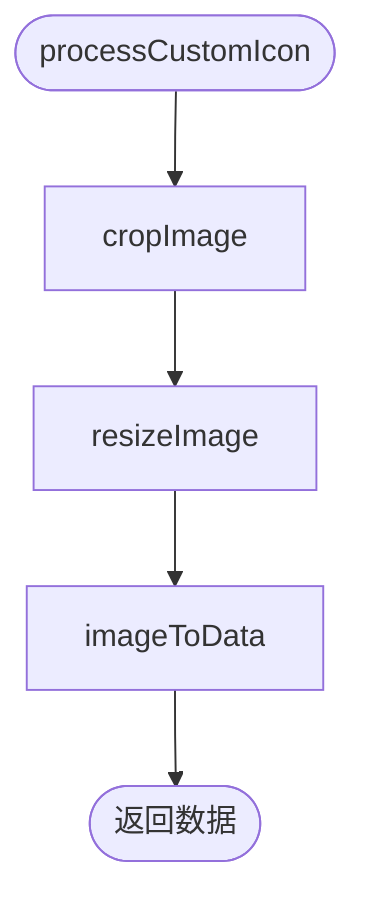

图表来源
- [CustomIconHelper.swift](file://MyStory/Utils/CustomIconHelper.swift#L116-L134)

章节来源
- [CustomIconHelper.swift](file://MyStory/Utils/CustomIconHelper.swift#L6-L162)
- [CropShape.swift](file://MyStory/Models/Category/CropShape.swift#L5-L26)

### 视频可传输封装（VideoTransferable）
- 功能概述
  - 基于 UniformTypeIdentifiers 的 Transferable 实现，支持拖拽接收多种视频格式并复制到文档目录。
- 使用场景
  - 从系统文件或其他应用拖入视频素材。
- 最佳实践
  - 接收时生成唯一文件名，避免冲突。
  - 注意磁盘空间与文件权限。
- 测试策略
  - 单元测试：验证导入/导出表示、文件复制、URL 生成。

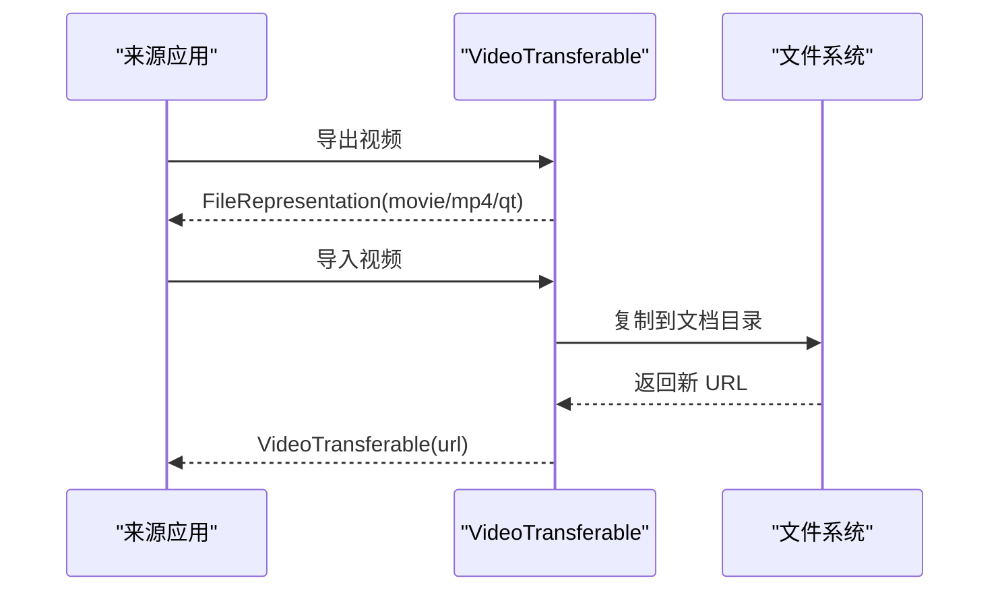

图表来源
- [VideoTransferable.swift](file://MyStory/Utils/VideoTransferable.swift#L5-L33)

章节来源
- [VideoTransferable.swift](file://MyStory/Utils/VideoTransferable.swift#L5-L34)

### Toast 提示组件（ToastView）
- 功能概述
  - 统一的提示类型（成功/错误/信息/警告），支持自动消失与触觉反馈。
  - 通过 View 扩展与修饰符集成，简化使用。
- 使用场景
  - 操作反馈、错误提示、信息提醒。
- 最佳实践
  - 控制时长与消息长度，避免遮挡重要 UI。
  - 与业务状态解耦，避免滥用。
- 测试策略
  - 单元测试：验证类型映射、等价比较、自动消失逻辑。
  - UI 测试：验证动画、布局与交互。

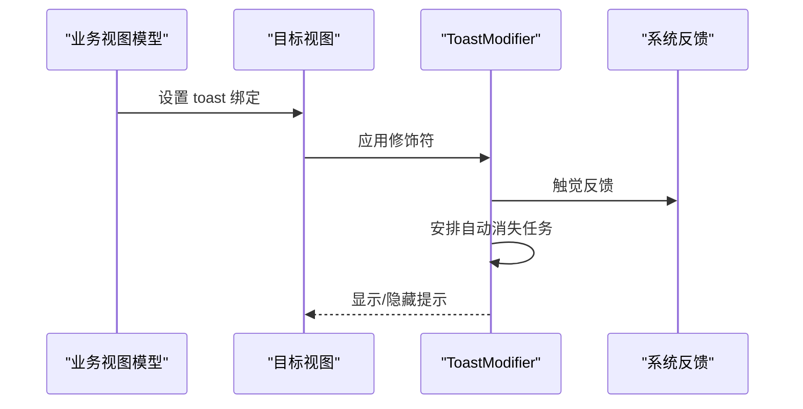

图表来源
- [ToastView.swift（组件）](file://MyStory/Components/ToastView.swift#L54-L158)

章节来源
- [ToastView.swift（组件）](file://MyStory/Components/ToastView.swift#L10-L158)

## 依赖关系分析
- 低耦合高内聚：各工具类独立提供能力，通过简单接口组合使用。
- 依赖方向
  - 视图层依赖工具层（通过扩展、修饰符、环境对象）。
  - 工具层依赖系统框架（Foundation、SwiftUI、UIKit、UniformTypeIdentifiers）。
  - 本地化依赖资源文件（Localizable.strings）。
- 循环依赖
  - 未发现循环依赖，工具层之间无直接相互引用。

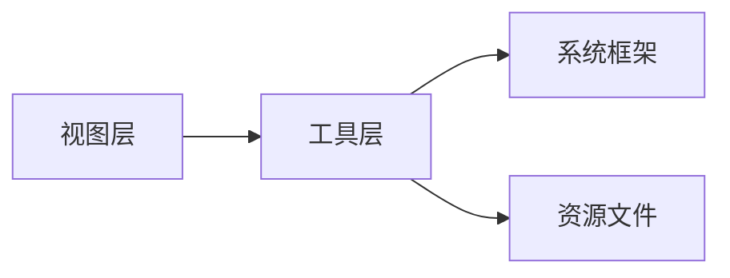

图表来源
- [LocalizationManager.swift](file://MyStory/Utils/LocalizationManager.swift#L8-L107)
- [String+Localization.swift](file://MyStory/Utils/String+Localization.swift#L8-L26)
- [LoadingIndicator.swift](file://MyStory/Utils/LoadingIndicator.swift#L1-L2)
- [VideoTransferable.swift](file://MyStory/Utils/VideoTransferable.swift#L1-L4)
- [en.lproj/Localizable.strings](file://MyStory/Resources/Localizable/en.lproj/Localizable.strings#L1-L307)
- [zh-Hans.lproj/Localizable.strings](file://MyStory/Resources/Localizable/zh-Hans.lproj/Localizable.strings#L1-L307)

章节来源
- [LocalizationManager.swift](file://MyStory/Utils/LocalizationManager.swift#L8-L107)
- [String+Localization.swift](file://MyStory/Utils/String+Localization.swift#L8-L26)
- [LoadingIndicator.swift](file://MyStory/Utils/LoadingIndicator.swift#L1-L2)
- [VideoTransferable.swift](file://MyStory/Utils/VideoTransferable.swift#L1-L4)

## 性能考量
- 本地化
  - 复用本地化字符串，避免重复查找；必要时缓存常用文本。
  - 语言切换后批量刷新视图，减少多次重建。
- 加载指示器
  - 主线程异步更新，避免阻塞 UI。
  - 合理设置消息文案长度，降低布局计算成本。
- 图标处理
  - 避免对大图进行多次缩放；优先使用合适的目标尺寸。
  - 圆形处理使用裁剪路径，减少额外绘制。
- 敏感词过滤
  - 词库按需加载，避免全量驻留内存；支持增量更新。
- Markdown/视频传输
  - 处理器预留扩展点，避免在热路径做重型运算。
  - 视频传输复制到文档目录，注意磁盘 IO 与并发控制。

## 故障排查指南
- 本地化
  - 症状：切换语言后部分文本未更新。
  - 排查：确认视图订阅了 LocalizationManager；检查键值是否存在于两个语言文件；验证是否调用 .localized。
- 加载指示器
  - 症状：遮罩无法隐藏或闪烁异常。
  - 排查：确保在主线程调用 show/hide；检查状态更新链路。
- Toast
  - 症状：提示不消失或布局错乱。
  - 排查：检查绑定状态与自动消失定时器；验证消息长度与布局约束。
- 图标处理
  - 症状：圆形边缘锯齿或尺寸异常。
  - 排查：确认裁剪区域与缩放比例；检查绘图上下文与 clip 路径。
- 视频传输
  - 症状：拖拽无响应或复制失败。
  - 排查：确认 UniformTypeIdentifiers 类型匹配；检查文件权限与磁盘空间。

章节来源
- [多语言使用快速参考.md](file://多语言使用快速参考.md#L212-L227)
- [LoadingIndicator.swift](file://MyStory/Utils/LoadingIndicator.swift#L12-L25)
- [ToastView.swift（组件）](file://MyStory/Components/ToastView.swift#L88-L111)
- [CustomIconHelper.swift](file://MyStory/Utils/CustomIconHelper.swift#L44-L62)
- [VideoTransferable.swift](file://MyStory/Utils/VideoTransferable.swift#L8-L32)

## 结论
MyStory 的工具类与实用程序遵循“单一职责、可组合、易测试”的设计原则，覆盖本地化、加载提示、内容处理、媒体处理与用户反馈等关键领域。通过清晰的接口与资源配合，既满足当前需求，又为未来扩展预留空间。建议在团队内推广统一的使用规范与测试策略，持续提升代码质量与用户体验。

## 附录
- 使用示例（路径指引）
  - 切换语言：[编程方式切换](file://多语言使用快速参考.md#L167-L171)
  - 获取本地化文本：[字符串扩展访问](file://MyStory/Utils/String+Localization.swift#L12-L14)
  - 显示加载指示器：[显示/隐藏调用](file://MyStory/Utils/LoadingIndicator.swift#L13-L25)
  - 显示 Toast：[修饰符应用](file://MyStory/Components/ToastView.swift#L153-L157)
  - 图标处理：[统一处理流程](file://MyStory/Utils/CustomIconHelper.swift#L116-L134)
  - 视频拖拽：[导入/导出表示](file://MyStory/Utils/VideoTransferable.swift#L8-L32)
- 资源文件
  - 英文本地化：[Localizable.strings](file://MyStory/Resources/Localizable/en.lproj/Localizable.strings#L1-L307)
  - 中文本地化：[Localizable.strings](file://MyStory/Resources/Localizable/zh-Hans.lproj/Localizable.strings#L1-L307)