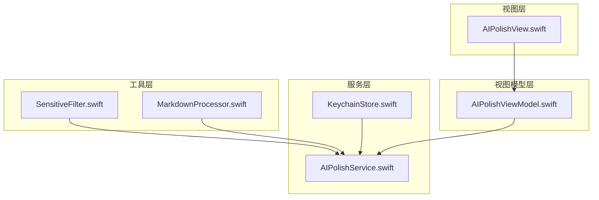
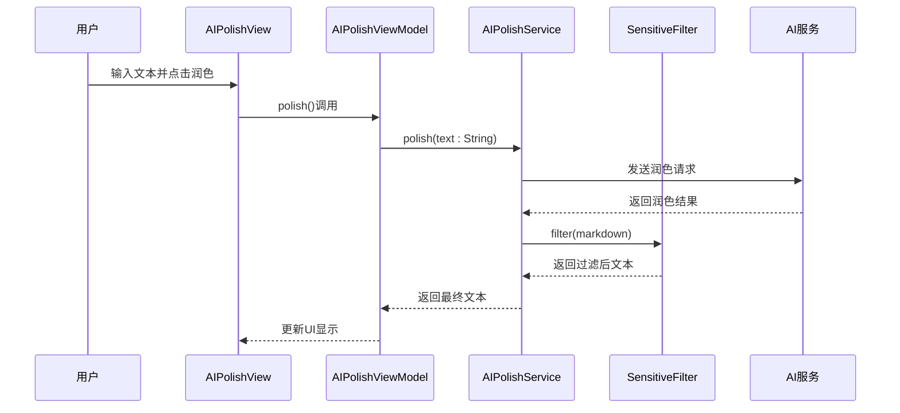
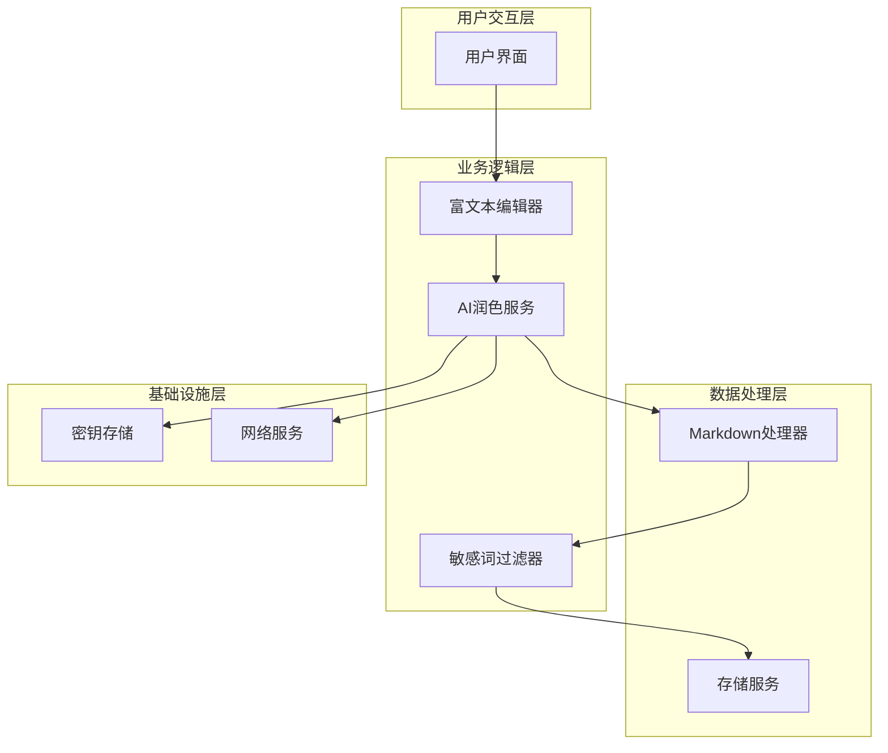
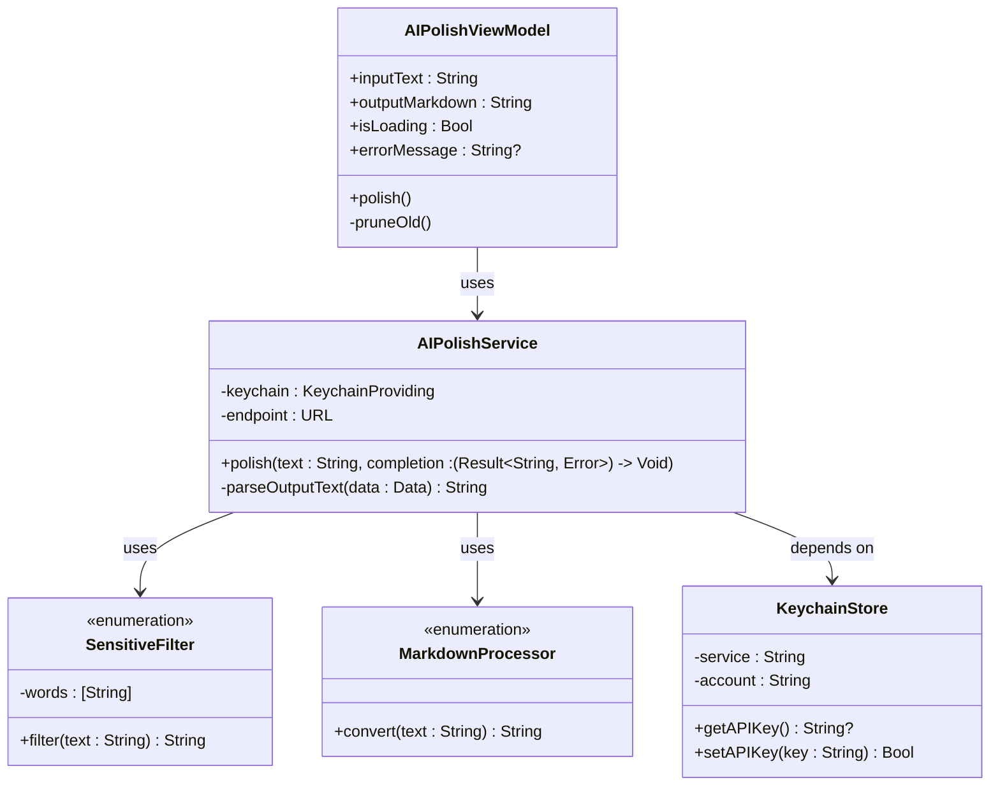
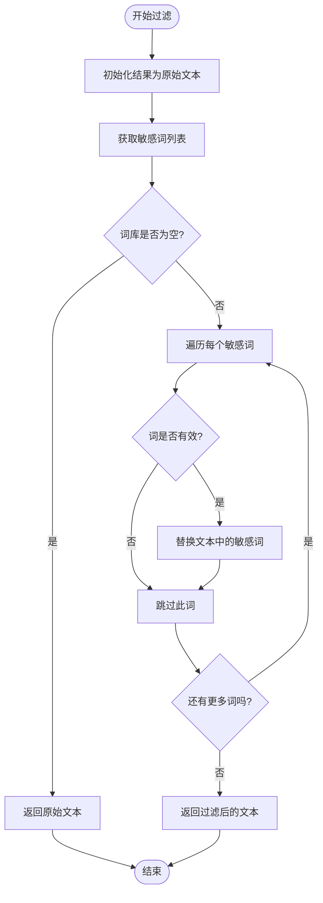
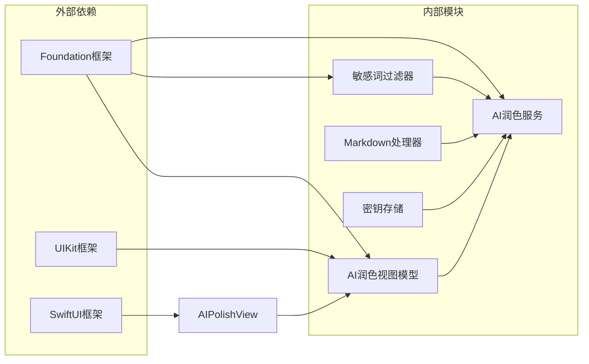
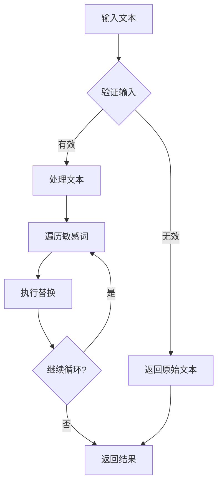

# 敏感词过滤器

<cite>
**本文档引用的文件**
- [SensitiveFilter.swift](file://MyStory/Utils/SensitiveFilter.swift)
- [AIPolishService.swift](file://MyStory/Services/AIService/AIPolishService.swift)
- [AIPolishViewModel.swift](file://MyStory/ViewModels/Editor/AIPolishViewModel.swift)
- [AIPolishView.swift](file://MyStory/Views/Editor/AIPolishView.swift)
- [MarkdownProcessor.swift](file://MyStory/Utils/MarkdownProcessor.swift)
- [KeychainStore.swift](file://MyStory/Core/Storage/KeychainStore.swift)
</cite>

## 目录
1. [简介](#简介)
2. [项目结构](#项目结构)
3. [核心组件](#核心组件)
4. [架构概览](#架构概览)
5. [详细组件分析](#详细组件分析)
6. [依赖关系分析](#依赖关系分析)
7. [性能考虑](#性能考虑)
8. [故障排除指南](#故障排除指南)
9. [结论](#结论)
10. [附录](#附录)

## 简介

敏感词过滤器是MyStory应用中的一个关键内容安全组件，主要用于在文本处理流程中识别和替换敏感词汇。该组件采用简单的字符串替换策略，在AI润色服务的输出文本中进行敏感词检测和过滤，确保生成的内容符合内容安全要求。

当前实现基于基础的字符串匹配算法，将预定义的敏感词列表中的词汇替换为指定的屏蔽字符。虽然实现相对简单，但已经能够满足基本的内容安全需求，并为后续的功能扩展奠定了基础。

## 项目结构

敏感词过滤器在项目中的组织结构如下：



**图表来源**
- [SensitiveFilter.swift](file://MyStory/Utils/SensitiveFilter.swift#L1-L18)
- [AIPolishService.swift](file://MyStory/Services/AIService/AIPolishService.swift#L1-L77)
- [AIPolishViewModel.swift](file://MyStory/ViewModels/Editor/AIPolishViewModel.swift#L1-L46)
- [AIPolishView.swift](file://MyStory/Views/Editor/AIPolishView.swift#L1-L47)

**章节来源**
- [SensitiveFilter.swift](file://MyStory/Utils/SensitiveFilter.swift#L1-L18)
- [AIPolishService.swift](file://MyStory/Services/AIService/AIPolishService.swift#L1-L77)

## 核心组件

### 敏感词过滤器核心实现

敏感词过滤器采用枚举类型设计，提供静态方法进行文本过滤。其核心特性包括：

- **静态词库管理**：内置敏感词列表，支持扩展和自定义
- **简单替换机制**：将匹配的敏感词替换为指定的屏蔽字符
- **线程安全设计**：使用静态方法，避免实例化开销

### AI润色服务集成

敏感词过滤器主要在AI润色服务中发挥作用，作为内容处理流程的一部分：



**图表来源**
- [AIPolishView.swift](file://MyStory/Views/Editor/AIPolishView.swift#L17-L40)
- [AIPolishViewModel.swift](file://MyStory/ViewModels/Editor/AIPolishViewModel.swift#L18-L39)
- [AIPolishService.swift](file://MyStory/Services/AIService/AIPolishService.swift#L30-L61)
- [SensitiveFilter.swift](file://MyStory/Utils/SensitiveFilter.swift#L10-L16)

**章节来源**
- [SensitiveFilter.swift](file://MyStory/Utils/SensitiveFilter.swift#L3-L17)
- [AIPolishService.swift](file://MyStory/Services/AIService/AIPolishService.swift#L30-L61)

## 架构概览

敏感词过滤器在整个应用架构中的位置和作用：



**图表来源**
- [AIPolishView.swift](file://MyStory/Views/Editor/AIPolishView.swift#L1-L47)
- [AIPolishViewModel.swift](file://MyStory/ViewModels/Editor/AIPolishViewModel.swift#L1-L46)
- [AIPolishService.swift](file://MyStory/Services/AIService/AIPolishService.swift#L1-L77)
- [SensitiveFilter.swift](file://MyStory/Utils/SensitiveFilter.swift#L1-L18)

## 详细组件分析

### 敏感词过滤器类结构



**图表来源**
- [SensitiveFilter.swift](file://MyStory/Utils/SensitiveFilter.swift#L3-L17)
- [AIPolishService.swift](file://MyStory/Services/AIService/AIPolishService.swift#L8-L77)
- [AIPolishViewModel.swift](file://MyStory/ViewModels/Editor/AIPolishViewModel.swift#L4-L46)
- [MarkdownProcessor.swift](file://MyStory/Utils/MarkdownProcessor.swift#L3-L8)
- [KeychainStore.swift](file://MyStory/Core/Storage/KeychainStore.swift#L4-L40)

### 过滤算法实现

敏感词过滤器采用线性扫描算法，其工作流程如下：



**图表来源**
- [SensitiveFilter.swift](file://MyStory/Utils/SensitiveFilter.swift#L10-L16)

### 数据结构分析

敏感词过滤器的核心数据结构：

| 组件 | 类型 | 描述 | 复杂度 |
|------|------|------|--------|
| 词库 | Array<String> | 静态敏感词列表 | O(n) 初始化 |
| 过滤操作 | String.replace | 基础字符串替换 | O(m×n) |
| 内存使用 | 动态分配 | 每次过滤创建新字符串 | O(m) |

其中：
- n = 敏感词数量
- m = 文本长度

**章节来源**
- [SensitiveFilter.swift](file://MyStory/Utils/SensitiveFilter.swift#L4-L8)
- [SensitiveFilter.swift](file://MyStory/Utils/SensitiveFilter.swift#L10-L16)

### 性能特征分析

当前实现的性能特点：

- **时间复杂度**：O(m×n)，其中m为文本长度，n为敏感词数量
- **空间复杂度**：O(m)，每次过滤都创建新的字符串对象
- **实时性**：适合中小规模文本处理，大文本可能影响性能
- **内存效率**：存在多次字符串复制，可能产生内存碎片

## 依赖关系分析

### 组件间依赖关系



**图表来源**
- [SensitiveFilter.swift](file://MyStory/Utils/SensitiveFilter.swift#L1-L2)
- [AIPolishService.swift](file://MyStory/Services/AIService/AIPolishService.swift#L1-L2)
- [AIPolishViewModel.swift](file://MyStory/ViewModels/Editor/AIPolishViewModel.swift#L1-L3)
- [AIPolishView.swift](file://MyStory/Views/Editor/AIPolishView.swift#L1-L2)

### 错误处理机制

敏感词过滤器的错误处理策略：



**图表来源**
- [SensitiveFilter.swift](file://MyStory/Utils/SensitiveFilter.swift#L10-L16)

**章节来源**
- [AIPolishService.swift](file://MyStory/Services/AIService/AIPolishService.swift#L30-L61)

## 性能考虑

### 当前实现的性能特征

1. **算法复杂度**
   - 线性时间复杂度，适合中小规模文本
   - 对于大文本可能存在性能瓶颈

2. **内存使用**
   - 每次过滤创建新字符串，可能导致内存压力
   - 建议对大文本分块处理

3. **并发安全性**
   - 静态方法设计，天然线程安全
   - 无状态设计，避免竞态条件

### 优化建议

1. **算法优化**
   ```swift
   // 建议：使用更高效的字符串匹配算法
   // - Boyer-Moore算法
   // - KMP算法
   // - AC自动机算法
   ```

2. **数据结构优化**
   ```swift
   // 建议：使用Trie树存储敏感词
   // - 前缀共享，减少内存占用
   // - 快速查找，提高匹配效率
   ```

3. **缓存策略**
   ```swift
   // 建议：实现词库缓存
   // - 内存缓存敏感词树
   // - 磁盘持久化词库
   // - 自适应缓存淘汰
   ```

4. **异步处理**
   ```swift
   // 建议：异步过滤大文本
   // - 分块处理
   // - 進度回调
   // - 取消机制
   ```

## 故障排除指南

### 常见问题及解决方案

1. **敏感词未被正确过滤**
   - 检查词库配置是否正确
   - 验证文本编码格式
   - 确认替换字符设置

2. **性能问题**
   - 优化词库大小
   - 实现词库分片加载
   - 考虑异步处理

3. **内存泄漏**
   - 确保及时释放临时字符串
   - 避免循环引用
   - 监控内存使用情况

### 调试技巧

```swift
// 建议：添加调试日志
func debugFilter(_ text: String) -> String {
    print("原始文本: \(text)")
    let result = filter(text)
    print("过滤结果: \(result)")
    return result
}
```

**章节来源**
- [AIPolishService.swift](file://MyStory/Services/AIService/AIPolishService.swift#L30-L61)

## 结论

敏感词过滤器作为MyStory应用的重要组成部分，虽然当前实现相对简单，但已经能够满足基本的内容安全需求。其设计具有以下特点：

**优势**：
- 实现简单，易于理解和维护
- 线程安全，无状态设计
- 集成度高，与AI润色服务无缝结合

**局限性**：
- 算法效率有限，不适合大规模文本处理
- 词库管理简单，缺乏动态更新机制
- 过滤策略单一，无法处理复杂的敏感词变体

**未来发展方向**：
1. 实现更高效的字符串匹配算法
2. 建立动态词库管理系统
3. 支持正则表达式和模糊匹配
4. 添加过滤规则配置功能
5. 实现性能监控和优化

## 附录

### 使用示例

#### 基本使用方法
```swift
let originalText = "这是一段包含测试敏感词的文本"
let filteredText = SensitiveFilter.filter(originalText)
print(filteredText) // 输出：包含***的文本
```

#### 在AI润色中使用
```swift
// 在AIPolishService中自动应用
let polishedText = markdownProcessor.convert(aiResult)
let finalText = SensitiveFilter.filter(polishedText)
```

### 配置建议

1. **词库管理**
   - 定期更新敏感词列表
   - 支持批量导入导出
   - 提供词库版本控制

2. **过滤策略**
   - 支持精确匹配和模糊匹配
   - 允许自定义替换字符
   - 提供过滤级别设置

3. **性能优化**
   - 实现词库缓存
   - 支持增量更新
   - 提供性能监控

### 最佳实践

1. **内容安全**
   - 建立多层次的内容审核机制
   - 定期审查过滤效果
   - 建立人工复核流程

2. **用户体验**
   - 提供透明的过滤反馈
   - 支持用户申诉机制
   - 保持过滤的准确性

3. **合规性**
   - 遵循相关法律法规
   - 定期更新合规要求
   - 建立审计日志