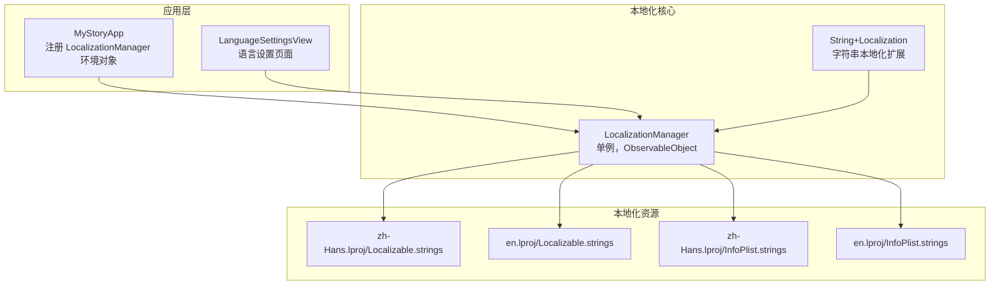
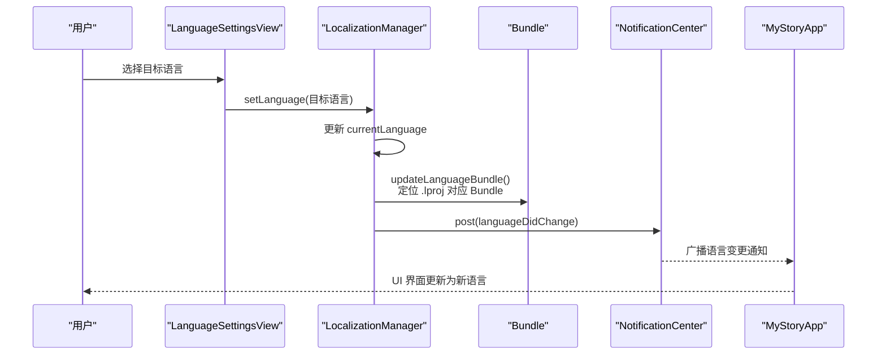
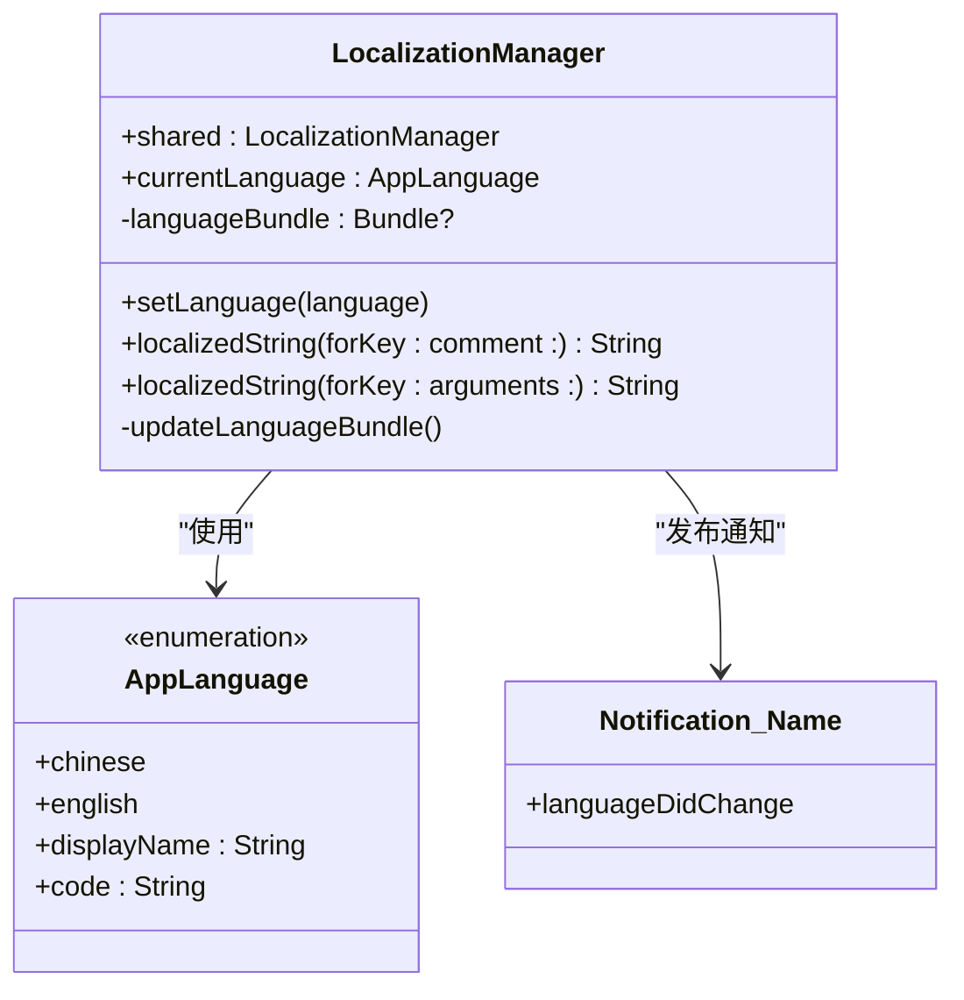
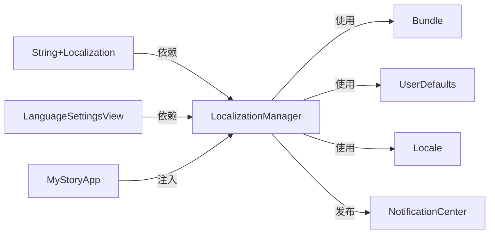

# 本地化管理器

<cite>
**本文引用的文件**
- [LocalizationManager.swift](file://MyStory/Utils/LocalizationManager.swift)
- [String+Localization.swift](file://MyStory/Utils/String+Localization.swift)
- [LanguageSettingsView.swift](file://MyStory/Views/Settings/LanguageSettingsView.swift)
- [en.lproj/Localizable.strings](file://MyStory/Resources/Localizable/en.lproj/Localizable.strings)
- [zh-Hans.lproj/Localizable.strings](file://MyStory/Resources/Localizable/zh-Hans.lproj/Localizable.strings)
- [MyStoryApp.swift](file://MyStory/MyStoryApp.swift)
- [Info.plist](file://MyStory/Info.plist)
- [多语言支持实现说明.md](file://多语言支持实现说明.md)
- [多语言使用快速参考.md](file://多语言使用快速参考.md)
</cite>

## 目录
1. [简介](#简介)
2. [项目结构](#项目结构)
3. [核心组件](#核心组件)
4. [架构总览](#架构总览)
5. [详细组件分析](#详细组件分析)
6. [依赖关系分析](#依赖关系分析)
7. [性能考虑](#性能考虑)
8. [故障排查指南](#故障排查指南)
9. [结论](#结论)
10. [附录](#附录)

## 简介
本文件系统性地介绍 MyStory 应用中的本地化管理器设计与实现，涵盖多语言支持机制、语言切换功能、Bundle 管理、AppLanguage 枚举使用、语言状态管理与 UserDefaults 持久化、通知机制、语言包结构与本地化文件组织、以及最佳实践与性能优化策略。文档面向开发者与产品/测试人员，既提供代码级细节，也提供概念性说明与可视化图表。

## 项目结构
MyStory 的本地化体系围绕三个核心文件展开：
- 语言管理器：负责语言状态、Bundle 切换、持久化与通知
- 字符串扩展：提供便捷的本地化访问方式
- 语言设置视图：提供 UI 层的语言切换入口

此外，本地化资源文件位于 Resources/Localizable 下，分别维护中英文两套 Localizable.strings 与 InfoPlist.strings。

**图表来源**
- [MyStoryApp.swift](file://MyStory/MyStoryApp.swift#L18-L27)
- [LanguageSettingsView.swift](file://MyStory/Views/Settings/LanguageSettingsView.swift#L10-L64)
- [LocalizationManager.swift](file://MyStory/Utils/LocalizationManager.swift#L31-L100)
- [String+Localization.swift](file://MyStory/Utils/String+Localization.swift#L10-L26)
- [zh-Hans.lproj/Localizable.strings](file://MyStory/Resources/Localizable/zh-Hans.lproj/Localizable.strings#L1-L307)
- [en.lproj/Localizable.strings](file://MyStory/Resources/Localizable/en.lproj/Localizable.strings#L1-L307)

**章节来源**
- [MyStoryApp.swift](file://MyStory/MyStoryApp.swift#L18-L27)
- [LanguageSettingsView.swift](file://MyStory/Views/Settings/LanguageSettingsView.swift#L10-L64)
- [LocalizationManager.swift](file://MyStory/Utils/LocalizationManager.swift#L31-L100)
- [String+Localization.swift](file://MyStory/Utils/String+Localization.swift#L10-L26)

## 核心组件
- LocalizationManager：单例语言管理器，提供语言切换、本地化字符串获取、Bundle 管理、UserDefaults 持久化与语言变更通知。
- AppLanguage：语言枚举，定义支持的语言及其显示名与代码。
- String+Localization：字符串扩展，提供便捷的本地化访问与参数化格式化。
- LanguageSettingsView：语言设置页面，提供 UI 交互与语言应用。

**章节来源**
- [LocalizationManager.swift](file://MyStory/Utils/LocalizationManager.swift#L11-L28)
- [LocalizationManager.swift](file://MyStory/Utils/LocalizationManager.swift#L31-L100)
- [String+Localization.swift](file://MyStory/Utils/String+Localization.swift#L10-L26)
- [LanguageSettingsView.swift](file://MyStory/Views/Settings/LanguageSettingsView.swift#L10-L64)

## 架构总览
本地化架构采用“单例管理 + Bundle 切换 + 观察者模式”的组合：
- 单例管理：LocalizationManager 作为全局状态中心，统一管理语言状态与 Bundle。
- Bundle 切换：根据当前语言动态定位对应 .lproj 资源 Bundle，优先使用自定义 Bundle，回退到主 Bundle。
- 观察者模式：语言变更时通过通知中心广播，触发 UI 更新。
- 持久化：UserDefaults 存储用户选择的语言，应用启动时读取并初始化。

**图表来源**
- [LanguageSettingsView.swift](file://MyStory/Views/Settings/LanguageSettingsView.swift#L61-L64)
- [LocalizationManager.swift](file://MyStory/Utils/LocalizationManager.swift#L70-L74)
- [LocalizationManager.swift](file://MyStory/Utils/LocalizationManager.swift#L92-L99)
- [LocalizationManager.swift](file://MyStory/Utils/LocalizationManager.swift#L37-L43)
- [MyStoryApp.swift](file://MyStory/MyStoryApp.swift#L18-L27)

## 详细组件分析

### LocalizationManager 组件分析
- 设计要点
  - 单例模式：shared 提供全局访问点。
  - ObservableObject：currentLanguage 使用 @Published，配合 SwiftUI 视图自动刷新。
  - 初始化逻辑：优先从 UserDefaults 读取，否则根据系统语言推断默认值，再更新 Bundle。
  - Bundle 管理：根据当前语言查找 .lproj 路径并创建 Bundle，异常时回退到主 Bundle。
  - 通知机制：语言变更时发布自定义通知，供观察者响应。
  - 持久化：将语言代码写入 UserDefaults，键名为 AppLanguage。

- 关键方法
  - setLanguage：设置语言并更新 Bundle。
  - localizedString(forKey:comment:)：获取本地化字符串，优先使用当前语言 Bundle。
  - localizedString(forKey:arguments:)：带参数的本地化字符串格式化。

**图表来源**
- [LocalizationManager.swift](file://MyStory/Utils/LocalizationManager.swift#L11-L28)
- [LocalizationManager.swift](file://MyStory/Utils/LocalizationManager.swift#L31-L100)
- [LocalizationManager.swift](file://MyStory/Utils/LocalizationManager.swift#L104-L106)

**章节来源**
- [LocalizationManager.swift](file://MyStory/Utils/LocalizationManager.swift#L31-L100)

### AppLanguage 枚举分析
- 定义
  - chinese：简体中文，代码为 zh-Hans。
  - english：英语，代码为 en。
- 行为
  - displayName：返回语言显示名（中文环境下为“简体中文”，英文环境下为“English”）。
  - code：返回语言代码 rawValue。

**章节来源**
- [LocalizationManager.swift](file://MyStory/Utils/LocalizationManager.swift#L11-L28)

### String+Localization 扩展分析
- 功能
  - localized：获取本地化字符串。
  - localized(with:)：带参数的本地化字符串格式化。
  - localized(comment:)：带注释的本地化字符串获取。
  - 便捷属性：预定义常用键值，减少重复调用。

**章节来源**
- [String+Localization.swift](file://MyStory/Utils/String+Localization.swift#L10-L26)
- [String+Localization.swift](file://MyStory/Utils/String+Localization.swift#L30-L46)

### LanguageSettingsView 组件分析
- 功能
  - 展示支持的语言列表，显示当前语言并允许用户选择。
  - 应用语言变更：调用 LocalizationManager.setLanguage 并关闭页面。
  - 导航栏按钮：取消与完成，完成按钮根据语言变化启用/禁用。

**章节来源**
- [LanguageSettingsView.swift](file://MyStory/Views/Settings/LanguageSettingsView.swift#L10-L64)

### 语言包结构与本地化文件组织
- 结构
  - Resources/Localizable/
    - zh-Hans.lproj：中文本地化资源
      - Localizable.strings：应用内文本
      - InfoPlist.strings：Info.plist 本地化
    - en.lproj：英文本地化资源
      - Localizable.strings：应用内文本
      - InfoPlist.strings：Info.plist 本地化
- 键值组织
  - 按功能模块分类，如 Common、Tab Bar、Timeline、Story Editor、Category、Settings、Permissions、App Info 等。
  - 参数化字符串使用占位符，如 %d、%@ 等，便于 String(format:) 格式化。

**章节来源**
- [zh-Hans.lproj/Localizable.strings](file://MyStory/Resources/Localizable/zh-Hans.lproj/Localizable.strings#L1-L307)
- [en.lproj/Localizable.strings](file://MyStory/Resources/Localizable/en.lproj/Localizable.strings#L1-L307)

### 通知机制
- 通知名称：languageDidChange（自定义 Notification.Name）。
- 触发时机：LocalizationManager.currentLanguage didSet 中发布。
- 使用场景：UI 响应语言变更、刷新缓存文本、触发全局状态更新。

**章节来源**
- [LocalizationManager.swift](file://MyStory/Utils/LocalizationManager.swift#L37-L43)
- [LocalizationManager.swift](file://MyStory/Utils/LocalizationManager.swift#L104-L106)

### UserDefaults 持久化存储
- 存储键：AppLanguage（字符串）。
- 读取：应用启动时从 UserDefaults 读取，若不存在则根据系统语言推断默认值。
- 写入：每次语言变更时写入 UserDefaults。

**章节来源**
- [LocalizationManager.swift](file://MyStory/Utils/LocalizationManager.swift#L50-L66)
- [LocalizationManager.swift](file://MyStory/Utils/LocalizationManager.swift#L39)

### Bundle 管理与资源定位
- Bundle 定位：根据 currentLanguage.rawValue 查找 .lproj 路径并创建 Bundle。
- 回退策略：若找不到对应 Bundle，则回退到 Bundle.main。
- 作用范围：localizedString 优先使用当前语言 Bundle，确保文本来自正确语言资源。

**章节来源**
- [LocalizationManager.swift](file://MyStory/Utils/LocalizationManager.swift#L92-L99)

## 依赖关系分析
- 组件耦合
  - LanguageSettingsView 依赖 LocalizationManager（@StateObject 注入）。
  - MyStoryApp 将 LocalizationManager 注册为环境对象，供全应用使用。
  - String+Localization 依赖 LocalizationManager.shared。
- 外部依赖
  - Foundation：NSLocalizedString、Bundle、UserDefaults、Locale。
  - SwiftUI：@Published、ObservableObject、@StateObject/@ObservedObject。
  - 通知中心：NotificationCenter。

**图表来源**
- [LocalizationManager.swift](file://MyStory/Utils/LocalizationManager.swift#L8-L9)
- [String+Localization.swift](file://MyStory/Utils/String+Localization.swift#L8)
- [LanguageSettingsView.swift](file://MyStory/Views/Settings/LanguageSettingsView.swift#L12)
- [MyStoryApp.swift](file://MyStory/MyStoryApp.swift#L18-L27)

**章节来源**
- [LocalizationManager.swift](file://MyStory/Utils/LocalizationManager.swift#L8-L9)
- [String+Localization.swift](file://MyStory/Utils/String+Localization.swift#L8)
- [LanguageSettingsView.swift](file://MyStory/Views/Settings/LanguageSettingsView.swift#L12)
- [MyStoryApp.swift](file://MyStory/MyStoryApp.swift#L18-L27)

## 性能考虑
- 复用本地化字符串：避免在视图中重复调用 .localized，建议在视图初始化时缓存结果。
- 使用便捷属性：通过 String 的静态属性预定义常用文本，减少重复查找。
- Bundle 缓存：LocalizationManager 已缓存 languageBundle，避免频繁路径查找。
- 通知风暴：语言变更通知仅在 currentLanguage 变更时触发，避免不必要的 UI 刷新。

**章节来源**
- [多语言使用快速参考.md](file://多语言使用快速参考.md#L191-L210)

## 故障排查指南
- 文本未本地化
  - 检查键值是否存在于两个语言文件中。
  - 检查拼写与大小写。
  - 确认调用了 .localized 或 String+Localization 的便捷属性。
  - 确认 Xcode 项目中已正确添加本地化资源文件。
- 切换语言后部分文本未更新
  - SwiftUI 视图应自动更新，确保订阅了 LocalizationManager。
  - 某些缓存文本可能需要手动刷新。
- 日期格式不正确
  - 使用本地化的日期格式键值，如 "timeline.dateFormat"。
- 如何测试不同语言
  - 应用内切换语言。
  - 修改模拟器/设备系统语言。
  - Xcode Scheme 设置应用语言。

**章节来源**
- [多语言使用快速参考.md](file://多语言使用快速参考.md#L212-L239)

## 结论
MyStory 的本地化管理器通过单例模式、Bundle 动态切换、UserDefaults 持久化与通知机制，实现了简洁高效的多语言支持。结合字符串扩展与语言设置页面，开发者可以以最小成本实现语言切换、参数化文本与统一的本地化资源管理。建议在新增文本时遵循命名规范与双语同步原则，并利用便捷属性与缓存策略提升性能与一致性。

## 附录

### 使用示例与最佳实践
- 在代码中使用本地化文本
  - 基础用法：Text("common.cancel".localized)
  - 带参数：Text(String(format: "category.storyCount".localized, count))
  - 便捷属性：Text(String.cancel)
- 新增本地化文本
  - 确定键值名称（模块.具体含义），在两个语言文件中添加对应翻译。
  - 可选：在 String+Localization.swift 中添加便捷属性。
- 语言切换
  - 用户操作：设置页面选择语言并完成。
  - 编程方式：LocalizationManager.shared.setLanguage(.chinese/.english)
  - 获取当前语言：LocalizationManager.shared.currentLanguage

**章节来源**
- [多语言使用快速参考.md](file://多语言使用快速参考.md#L5-L27)
- [多语言使用快速参考.md](file://多语言使用快速参考.md#L111-L155)
- [多语言使用快速参考.md](file://多语言使用快速参考.md#L157-L177)

### 语言包结构与键值组织
- 语言包结构
  - Resources/Localizable/zh-Hans.lproj 与 en.lproj 下的 Localizable.strings 与 InfoPlist.strings。
- 键值组织
  - 按功能模块分类，如 Common、Tab Bar、Timeline、Story Editor、Category、Settings、Permissions、App Info 等。
  - 参数化字符串使用占位符，便于 String(format:) 格式化。

**章节来源**
- [zh-Hans.lproj/Localizable.strings](file://MyStory/Resources/Localizable/zh-Hans.lproj/Localizable.strings#L1-L307)
- [en.lproj/Localizable.strings](file://MyStory/Resources/Localizable/en.lproj/Localizable.strings#L1-L307)

### 项目配置与集成
- Info.plist
  - CFBundleLocalizations：声明支持的语言列表。
- 应用入口
  - MyStoryApp 将 LocalizationManager 注册为环境对象，供全应用使用。
- 语言设置页面
  - LanguageSettingsView 提供 UI 交互与语言应用。

**章节来源**
- [Info.plist](file://MyStory/Info.plist#L15-L19)
- [MyStoryApp.swift](file://MyStory/MyStoryApp.swift#L18-L27)
- [LanguageSettingsView.swift](file://MyStory/Views/Settings/LanguageSettingsView.swift#L10-L64)