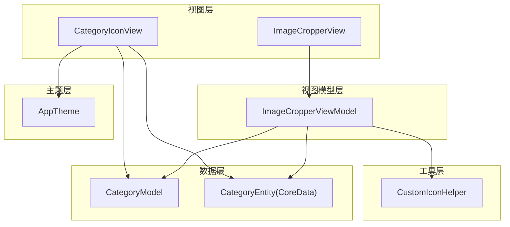
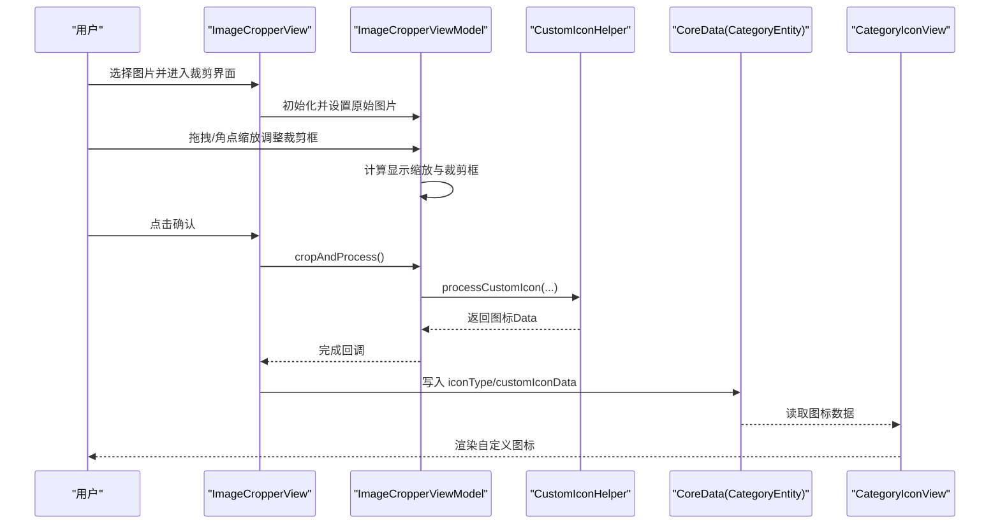
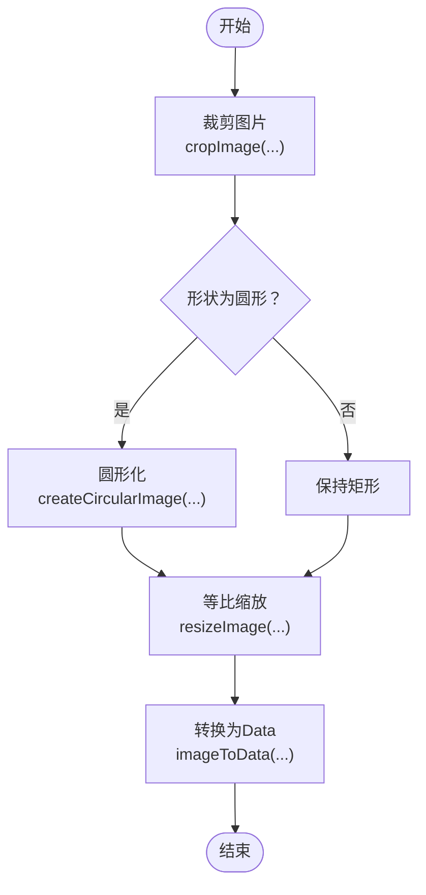
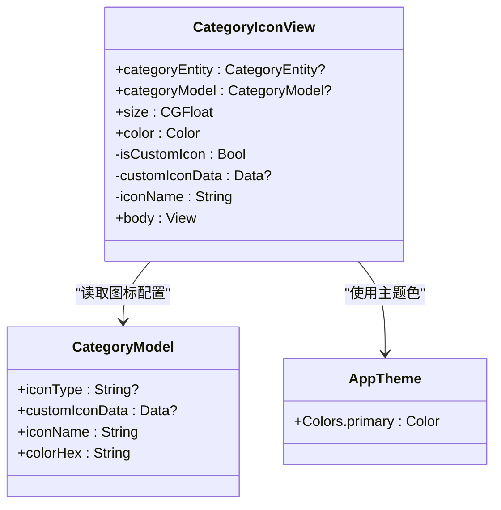
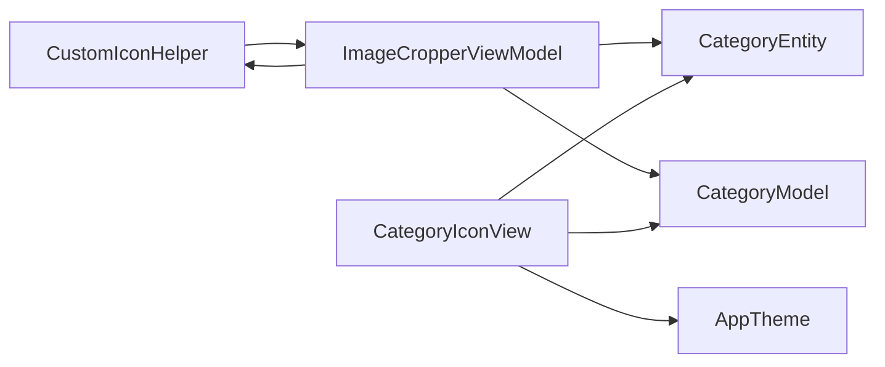

# 自定义图标助手

<cite>
**本文引用的文件**
- [CustomIconHelper.swift](file://MyStory/Utils/CustomIconHelper.swift)
- [CategoryIconView.swift](file://MyStory/Components/Category/CategoryIconView.swift)
- [ImageCropperView.swift](file://MyStory/Views/Editor/ImageCropperView.swift)
- [ImageCropperViewModel.swift](file://MyStory/ViewModels/Editor/ImageCropperViewModel.swift)
- [CropShape.swift](file://MyStory/Models/Category/CropShape.swift)
- [AppTheme.swift](file://MyStory/Components/Theme/AppTheme.swift)
- [CategoryModel.swift](file://MyStory/Models/Category/CategoryModel.swift)
- [CategoryEntity+CoreDataProperties.swift](file://MyStory/Models/Entities/CategoryEntity+CoreDataProperties.swift)
- [CoreDataStack.swift](file://MyStory/Core/Storage/CoreDataStack.swift)
- [icons/Contents.json](file://MyStory/Resources/Assets.xcassets/icons/Contents.json)
</cite>

## 目录
1. [简介](#简介)
2. [项目结构](#项目结构)
3. [核心组件](#核心组件)
4. [架构总览](#架构总览)
5. [组件详解](#组件详解)
6. [依赖关系分析](#依赖关系分析)
7. [性能与内存优化](#性能与内存优化)
8. [故障排查指南](#故障排查指南)
9. [结论](#结论)
10. [附录](#附录)

## 简介
本文件面向“自定义图标助手”的设计与实现，围绕 CustomIconHelper 的职责、图标资源管理、动态图标加载、样式定制、尺寸适配、主题切换、缓存与内存优化、兼容性处理以及在用户体验与品牌一致性方面的价值展开。文档同时给出图标库组织结构、命名规范、使用示例与最佳实践，帮助开发者在应用中稳定地集成与扩展自定义图标能力。

## 项目结构
自定义图标系统主要由以下层次构成：
- 工具层：CustomIconHelper 提供统一的图片裁剪、缩放、圆形化、尺寸适配与数据转换能力
- 视图层：CategoryIconView 负责根据数据源选择系统图标、Assets 图标或自定义图标，并支持颜色与尺寸定制
- 编辑层：ImageCropperView 与 ImageCropperViewModel 提供图片裁剪与处理流程，调用 CustomIconHelper 完成最终图标生成
- 数据层：CategoryModel 与 CoreData 属性承载图标类型、图标名称、颜色与自定义图标二进制数据
- 主题层：AppTheme 提供颜色体系，影响图标颜色与整体视觉风格

图表来源
- [CategoryIconView.swift](file://MyStory/Components/Category/CategoryIconView.swift#L1-L145)
- [ImageCropperView.swift](file://MyStory/Views/Editor/ImageCropperView.swift#L1-L293)
- [ImageCropperViewModel.swift](file://MyStory/ViewModels/Editor/ImageCropperViewModel.swift#L1-L226)
- [CustomIconHelper.swift](file://MyStory/Utils/CustomIconHelper.swift#L1-L162)
- [CategoryModel.swift](file://MyStory/Models/Category/CategoryModel.swift#L1-L22)
- [CategoryEntity+CoreDataProperties.swift](file://MyStory/Models/Entities/CategoryEntity+CoreDataProperties.swift#L1-L74)
- [AppTheme.swift](file://MyStory/Components/Theme/AppTheme.swift#L1-L328)

章节来源
- [CategoryIconView.swift](file://MyStory/Components/Category/CategoryIconView.swift#L1-L145)
- [ImageCropperView.swift](file://MyStory/Views/Editor/ImageCropperView.swift#L1-L293)
- [ImageCropperViewModel.swift](file://MyStory/ViewModels/Editor/ImageCropperViewModel.swift#L1-L226)
- [CustomIconHelper.swift](file://MyStory/Utils/CustomIconHelper.swift#L1-L162)
- [CategoryModel.swift](file://MyStory/Models/Category/CategoryModel.swift#L1-L22)
- [CategoryEntity+CoreDataProperties.swift](file://MyStory/Models/Entities/CategoryEntity+CoreDataProperties.swift#L1-L74)
- [AppTheme.swift](file://MyStory/Components/Theme/AppTheme.swift#L1-L328)

## 核心组件
- CustomIconHelper：提供图片裁剪、圆形化、尺寸缩放、数据转换与尺寸适配等通用能力
- CategoryIconView：根据分类实体/模型选择图标来源（系统/SF Symbols、Assets 预置、自定义），支持颜色与尺寸定制
- ImageCropperView/ViewModel：提供拖拽与角点缩放的可视化裁剪体验，并通过 CustomIconHelper 输出标准化图标数据
- CropShape：定义裁剪形状（矩形/圆形）及其 UI 名称与显示名
- AppTheme：提供主题色与字体缩放，影响图标颜色与排版
- CategoryModel/CategoryEntity：承载图标类型、图标名称、颜色与自定义图标二进制数据

章节来源
- [CustomIconHelper.swift](file://MyStory/Utils/CustomIconHelper.swift#L1-L162)
- [CategoryIconView.swift](file://MyStory/Components/Category/CategoryIconView.swift#L1-L145)
- [ImageCropperView.swift](file://MyStory/Views/Editor/ImageCropperView.swift#L1-L293)
- [ImageCropperViewModel.swift](file://MyStory/ViewModels/Editor/ImageCropperViewModel.swift#L1-L226)
- [CropShape.swift](file://MyStory/Models/Category/CropShape.swift#L1-L34)
- [AppTheme.swift](file://MyStory/Components/Theme/AppTheme.swift#L1-L328)
- [CategoryModel.swift](file://MyStory/Models/Category/CategoryModel.swift#L1-L22)
- [CategoryEntity+CoreDataProperties.swift](file://MyStory/Models/Entities/CategoryEntity+CoreDataProperties.swift#L1-L74)

## 架构总览
自定义图标系统采用“视图-视图模型-工具-数据-主题”的分层架构：
- 视图层负责呈现与交互
- 视图模型负责业务逻辑与状态管理
- 工具层提供纯函数式能力，避免状态耦合
- 数据层持久化图标元数据与二进制图标
- 主题层统一颜色与排版风格

图表来源
- [ImageCropperView.swift](file://MyStory/Views/Editor/ImageCropperView.swift#L274-L284)
- [ImageCropperViewModel.swift](file://MyStory/ViewModels/Editor/ImageCropperViewModel.swift#L195-L203)
- [CustomIconHelper.swift](file://MyStory/Utils/CustomIconHelper.swift#L116-L134)
- [CategoryEntity+CoreDataProperties.swift](file://MyStory/Models/Entities/CategoryEntity+CoreDataProperties.swift#L21-L33)
- [CategoryIconView.swift](file://MyStory/Components/Category/CategoryIconView.swift#L50-L73)

## 组件详解

### CustomIconHelper 设计与实现
- 图片裁剪：基于原始图片坐标系与 scale 计算实际裁剪区域，支持矩形与圆形输出
- 圆形化：通过贝塞尔路径裁剪为圆形，保证边缘平滑
- 尺寸缩放：按容器比例等比缩放，确保图标在不同设备与尺寸下一致
- 数据转换：提供 UIImage 与 Data 的互转，便于持久化与传输
- 尺寸适配：计算适合容器显示的尺寸，避免拉伸或溢出
- 图像校验：验证图片有效性，防止空图或无效尺寸导致崩溃

图表来源
- [CustomIconHelper.swift](file://MyStory/Utils/CustomIconHelper.swift#L10-L134)

章节来源
- [CustomIconHelper.swift](file://MyStory/Utils/CustomIconHelper.swift#L1-L162)

### 图标资源管理与命名规范
- 资源组织：Assets.xcassets/icons 下按功能语义命名 imageset，如 address、airport、badminton 等
- 多分辨率：每个 imageset 包含多倍率位图（如 64、100），确保清晰度
- 命名建议：使用小写下划线或短横线风格，避免特殊字符；与业务语义强关联
- 颜色一致性：建议统一使用单色矢量或灰度位图，以便通过 AppTheme 动态着色

章节来源
- [icons/Contents.json](file://MyStory/Resources/Assets.xcassets/icons/Contents.json#L1-L7)

### 动态图标加载与样式定制
- 加载策略：CategoryIconView 根据 iconType 与 iconName 决策来源；自定义图标优先从 CoreData 读取 Data 并转换为 UIImage
- 样式定制：通过 Color 参数与 AppTheme.Colors.primary 实现主题色联动；尺寸通过 size 参数控制
- 降级策略：当自定义图标数据缺失时回退到系统图标（如 folder.fill）

图表来源
- [CategoryIconView.swift](file://MyStory/Components/Category/CategoryIconView.swift#L1-L145)
- [CategoryModel.swift](file://MyStory/Models/Category/CategoryModel.swift#L1-L22)
- [AppTheme.swift](file://MyStory/Components/Theme/AppTheme.swift#L154-L216)

章节来源
- [CategoryIconView.swift](file://MyStory/Components/Category/CategoryIconView.swift#L1-L145)
- [CategoryModel.swift](file://MyStory/Models/Category/CategoryModel.swift#L1-L22)
- [AppTheme.swift](file://MyStory/Components/Theme/AppTheme.swift#L154-L216)

### 图标样式与主题切换
- 主题联动：AppTheme.Colors.primary 会随 ThemeManager.currentTheme 改变而变化，CategoryIconView 的颜色自动更新
- 字体缩放：FontScaleManager 通过 AppTheme.Typography.* 影响标题与正文字号，间接影响图标布局与间距
- 颜色扩展：Color(hex:) 扩展支持十六进制字符串解析，便于从模型读取颜色值

章节来源
- [AppTheme.swift](file://MyStory/Components/Theme/AppTheme.swift#L134-L216)
- [AppTheme.swift](file://MyStory/Components/Theme/AppTheme.swift#L310-L327)

### 图标库组织结构与命名规范
- 结构：icons/imageset 下按功能语义分组，每个 imageset 包含 Contents.json 与多分辨率位图
- 命名：推荐使用语义化英文小写加下划线（如 hand_up、heart_balloon），便于检索与维护
- 规范：统一尺寸与色彩风格，避免过度装饰；必要时提供浅色/深色版本以适配暗黑模式

章节来源
- [icons/Contents.json](file://MyStory/Resources/Assets.xcassets/icons/Contents.json#L1-L7)

### 尺寸适配与响应式设计
- 适配策略：CustomIconHelper.calculateFitSize 与 ImageCropperViewModel.updateDisplayInfo 保证在不同容器尺寸下保持比例
- 缩放比例：通过显示尺寸与原始尺寸计算 scale，确保裁剪框与显示坐标一致
- 圆形裁剪：圆形化时以最小边为直径，避免椭圆失真

章节来源
- [CustomIconHelper.swift](file://MyStory/Utils/CustomIconHelper.swift#L145-L160)
- [ImageCropperViewModel.swift](file://MyStory/ViewModels/Editor/ImageCropperViewModel.swift#L50-L62)

### 使用示例与最佳实践
- 在表单中选择系统图标：CategoryFormView 中的 iconSection 提供预置图标网格，点击后设置 iconType 为 system 并清空自定义数据
- 上传自定义图标：通过 PhotosPicker 选择图片，打开 ImageCropperView 进行裁剪与圆形化，完成后写入 CoreData
- 渲染自定义图标：CategoryIconView 读取 CoreData 的 customIconData，若为空则回退到系统图标
- 主题切换：修改 ThemeManager.currentTheme 后，AppTheme.Colors.primary 自动更新，图标颜色随之变化

章节来源
- [CategoryFormView.swift](file://MyStory/Views/Category/CategoryFormView.swift#L190-L233)
- [CategoryFormView.swift](file://MyStory/Views/Category/CategoryFormView.swift#L276-L311)
- [ImageCropperView.swift](file://MyStory/Views/Editor/ImageCropperView.swift#L274-L284)
- [CategoryIconView.swift](file://MyStory/Components/Category/CategoryIconView.swift#L50-L73)
- [AppTheme.swift](file://MyStory/Components/Theme/AppTheme.swift#L134-L152)

## 依赖关系分析
- CategoryIconView 依赖 CategoryModel/CategoryEntity 的图标字段与 AppTheme 的颜色
- ImageCropperViewModel 依赖 CustomIconHelper 的处理流程，并与 CoreData 的 CategoryEntity 交互
- CropShape 为枚举型常量，被视图与视图模型共同使用
- AppTheme 为全局主题入口，影响颜色与排版

图表来源
- [CustomIconHelper.swift](file://MyStory/Utils/CustomIconHelper.swift#L1-L162)
- [ImageCropperViewModel.swift](file://MyStory/ViewModels/Editor/ImageCropperViewModel.swift#L1-L226)
- [CategoryIconView.swift](file://MyStory/Components/Category/CategoryIconView.swift#L1-L145)
- [CategoryModel.swift](file://MyStory/Models/Category/CategoryModel.swift#L1-L22)
- [CategoryEntity+CoreDataProperties.swift](file://MyStory/Models/Entities/CategoryEntity+CoreDataProperties.swift#L1-L74)
- [AppTheme.swift](file://MyStory/Components/Theme/AppTheme.swift#L1-L328)

章节来源
- [CustomIconHelper.swift](file://MyStory/Utils/CustomIconHelper.swift#L1-L162)
- [ImageCropperViewModel.swift](file://MyStory/ViewModels/Editor/ImageCropperViewModel.swift#L1-L226)
- [CategoryIconView.swift](file://MyStory/Components/Category/CategoryIconView.swift#L1-L145)
- [CategoryModel.swift](file://MyStory/Models/Category/CategoryModel.swift#L1-L22)
- [CategoryEntity+CoreDataProperties.swift](file://MyStory/Models/Entities/CategoryEntity+CoreDataProperties.swift#L1-L74)
- [AppTheme.swift](file://MyStory/Components/Theme/AppTheme.swift#L1-L328)

## 性能与内存优化
- 图像处理链路：裁剪 → 缩放 → PNG 序列化，避免重复解码与无意义放大
- 缓存策略：当前未见显式缓存；可在视图层对已渲染的 UIImage 进行弱引用缓存，减少重复解码
- 内存优化：及时释放 UIGraphics 上下文（已通过 defer 释放）；避免在主线程进行大图解码与绘制
- 异步处理：图片选择与裁剪过程已在主线程安全处理，建议在复杂图像操作时考虑后台队列
- 数据持久化：自定义图标以 Data 存储于 CoreData，注意控制数据体积与更新频率

章节来源
- [CustomIconHelper.swift](file://MyStory/Utils/CustomIconHelper.swift#L48-L61)
- [ImageCropperViewModel.swift](file://MyStory/ViewModels/Editor/ImageCropperViewModel.swift#L50-L62)

## 故障排查指南
- 自定义图标不显示：检查 iconType 是否为 custom，customIconData 是否存在且有效；CategoryIconView 会在数据缺失时回退到系统图标
- 图标变形或模糊：确认裁剪框尺寸与显示缩放比例一致；CustomIconHelper.resizeImage 采用等比缩放，避免拉伸
- 主题色不生效：确认 AppTheme.Colors.primary 是否被正确读取；ThemeManager.currentTheme 变更后需触发视图刷新
- 图片处理失败：ImageCropperView 在 cropAndProcess 失败时会弹出错误提示，检查输入图片有效性与裁剪区域

章节来源
- [CategoryIconView.swift](file://MyStory/Components/Category/CategoryIconView.swift#L50-L73)
- [ImageCropperView.swift](file://MyStory/Views/Editor/ImageCropperView.swift#L274-L284)
- [CustomIconHelper.swift](file://MyStory/Utils/CustomIconHelper.swift#L138-L143)
- [AppTheme.swift](file://MyStory/Components/Theme/AppTheme.swift#L154-L167)

## 结论
CustomIconHelper 为自定义图标系统提供了稳健的底层能力，结合 CategoryIconView 的灵活加载策略、ImageCropperView 的可视化编辑体验以及 AppTheme 的主题联动，实现了从“选择/上传 → 裁剪/处理 → 渲染/持久化”的完整闭环。通过规范化的图标库组织与命名、严格的尺寸适配与主题一致性，系统在用户体验与品牌一致性方面表现良好。建议后续引入视图层缓存与异步处理，进一步提升性能与稳定性。

## 附录
- 图标库扩展：新增 imageset 时，需同步更新 CategoryIconView 的资产图标集合与命名规范
- 数据迁移：CoreData 已新增 iconType 与 customIconData 字段，确保历史数据兼容与默认值处理
- 主题扩展：新增主题时，AppTheme.Colors.primary 与 Typography.* 将自动适配图标颜色与排版

章节来源
- [CoreDataStack.swift](file://MyStory/Core/Storage/CoreDataStack.swift#L250-L265)
- [CategoryEntity+CoreDataProperties.swift](file://MyStory/Models/Entities/CategoryEntity+CoreDataProperties.swift#L21-L33)
- [AppTheme.swift](file://MyStory/Components/Theme/AppTheme.swift#L154-L216)