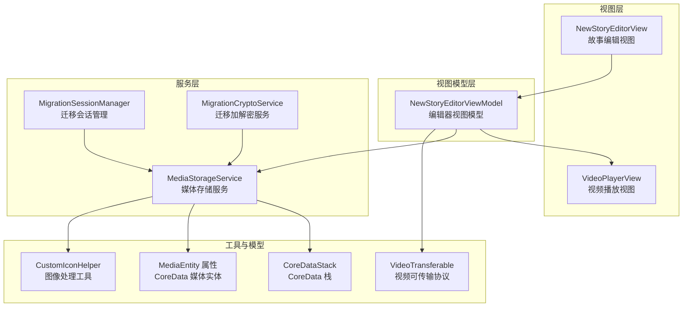
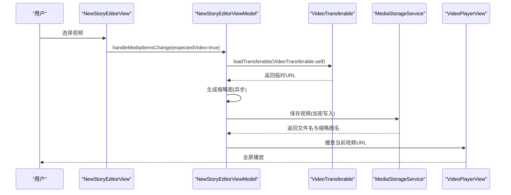
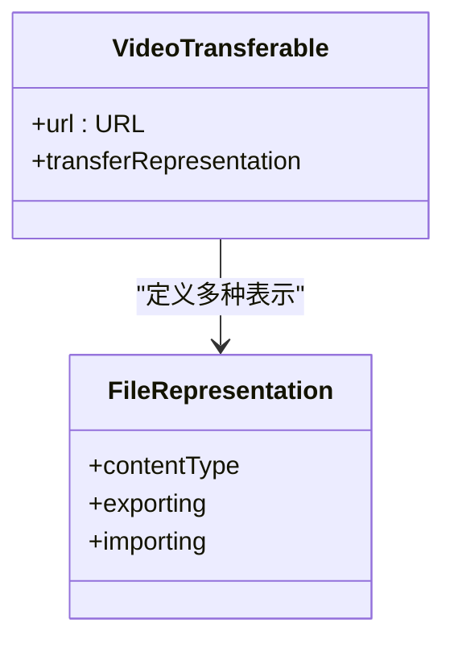
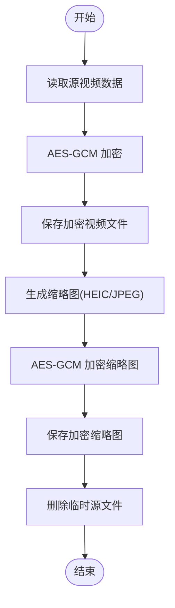
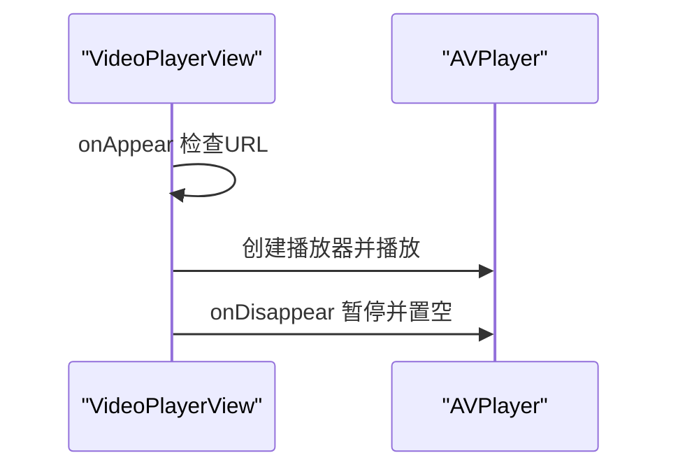
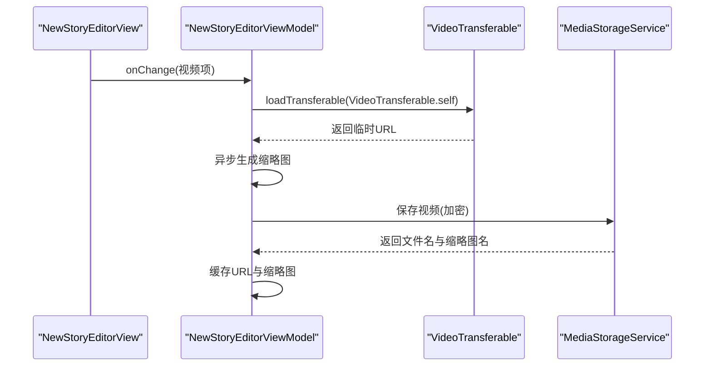
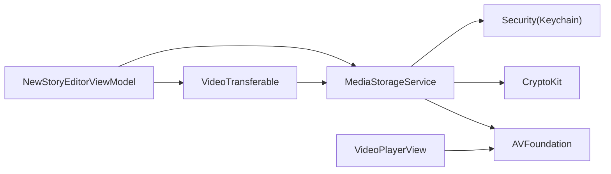

# 视频传输工具

<cite>
**本文引用的文件**
- [VideoTransferable.swift](file://MyStory/Utils/VideoTransferable.swift)
- [MediaStorageService.swift](file://MyStory/Services/MediaStorageService.swift)
- [VideoPlayerView.swift](file://MyStory/Components/VideoPlayerView.swift)
- [NewStoryEditorView.swift](file://MyStory/Views/Editor/NewStoryEditorView.swift)
- [MediaEntity+CoreDataProperties.swift](file://MyStory/Models/Entities/MediaEntity+CoreDataProperties.swift)
- [CoreDataStack.swift](file://MyStory/Core/Storage/CoreDataStack.swift)
- [CustomIconHelper.swift](file://MyStory/Utils/CustomIconHelper.swift)
- [MigrationSessionManager.swift](file://MyStory/Services/MigrationSessionManager.swift)
- [MigrationCryptoService.swift](file://MyStory/Services/MigrationCryptoService.swift)
</cite>

## 目录
1. [简介](#简介)
2. [项目结构](#项目结构)
3. [核心组件](#核心组件)
4. [架构总览](#架构总览)
5. [详细组件分析](#详细组件分析)
6. [依赖关系分析](#依赖关系分析)
7. [性能考量](#性能考量)
8. [故障排查指南](#故障排查指南)
9. [结论](#结论)
10. [附录](#附录)

## 简介
本文件系统性梳理“视频传输工具”的设计与实现，围绕 VideoTransferable 的可传输协议、视频文件的读写与加密存储、元数据提取与质量控制、以及在应用中的上传/下载/预览流程展开。文档同时覆盖编解码与内存管理、网络传输优化等技术细节，并总结多媒体应用的关键技术点与最佳实践。

## 项目结构
该工程采用分层与按功能域组织的结构：视图层（SwiftUI）、视图模型层（ViewModel）、服务层（MediaStorageService、迁移服务等）、模型层（CoreData 实体）与工具层（加密、缩略图生成等）。视频相关能力主要集中在工具与服务层，通过可传输协议与存储服务协同工作。

图表来源
- [VideoPlayerView.swift](file://MyStory/Components/VideoPlayerView.swift#L1-L52)
- [NewStoryEditorView.swift](file://MyStory/Views/Editor/NewStoryEditorView.swift#L1-L800)
- [MediaStorageService.swift](file://MyStory/Services/MediaStorageService.swift#L1-L348)
- [VideoTransferable.swift](file://MyStory/Utils/VideoTransferable.swift#L1-L34)
- [CustomIconHelper.swift](file://MyStory/Utils/CustomIconHelper.swift#L1-L162)
- [MediaEntity+CoreDataProperties.swift](file://MyStory/Models/Entities/MediaEntity+CoreDataProperties.swift#L1-L35)
- [CoreDataStack.swift](file://MyStory/Core/Storage/CoreDataStack.swift#L1-L382)
- [MigrationSessionManager.swift](file://MyStory/Services/MigrationSessionManager.swift#L144-L285)
- [MigrationCryptoService.swift](file://MyStory/Services/MigrationCryptoService.swift#L1-L66)

章节来源
- [VideoTransferable.swift](file://MyStory/Utils/VideoTransferable.swift#L1-L34)
- [MediaStorageService.swift](file://MyStory/Services/MediaStorageService.swift#L1-L348)
- [VideoPlayerView.swift](file://MyStory/Components/VideoPlayerView.swift#L1-L52)
- [NewStoryEditorView.swift](file://MyStory/Views/Editor/NewStoryEditorView.swift#L1-L800)
- [MediaEntity+CoreDataProperties.swift](file://MyStory/Models/Entities/MediaEntity+CoreDataProperties.swift#L1-L35)
- [CoreDataStack.swift](file://MyStory/Core/Storage/CoreDataStack.swift#L1-L382)
- [CustomIconHelper.swift](file://MyStory/Utils/CustomIconHelper.swift#L1-L162)
- [MigrationSessionManager.swift](file://MyStory/Services/MigrationSessionManager.swift#L144-L285)
- [MigrationCryptoService.swift](file://MyStory/Services/MigrationCryptoService.swift#L1-L66)

## 核心组件
- VideoTransferable：基于 Transferable 协议的视频可传输封装，支持 .movie、.mpeg4Movie、.quickTimeMovie 三种内容类型的导入导出，自动复制到文档目录并生成临时文件名，便于后续处理与播放。
- MediaStorageService：统一的媒体存储与安全服务，负责视频的保存、加载、缩略图生成、加解密与目录组织；提供视频 URL 的临时解密还原能力，便于播放器直接消费。
- VideoPlayerView：基于 AVKit 的全屏视频播放视图，负责播放器生命周期管理与 UI 呈现。
- NewStoryEditorViewModel：编辑器视图模型，集成视频选择、缩略图生成、播放控制与持久化关联。
- MediaEntity：CoreData 媒体实体属性集合，承载视频文件名、缩略图名、尺寸、时长等元数据。
- CustomIconHelper：图像处理工具，提供裁剪、缩放、圆形处理等能力，常用于生成视频封面。
- 迁移服务：MigrationSessionManager 与 MigrationCryptoService 提供跨设备传输与备份加解密能力，保障视频数据在传输链路中的安全性。

章节来源
- [VideoTransferable.swift](file://MyStory/Utils/VideoTransferable.swift#L5-L33)
- [MediaStorageService.swift](file://MyStory/Services/MediaStorageService.swift#L8-L224)
- [VideoPlayerView.swift](file://MyStory/Components/VideoPlayerView.swift#L4-L51)
- [NewStoryEditorView.swift](file://MyStory/Views/Editor/NewStoryEditorView.swift#L595-L800)
- [MediaEntity+CoreDataProperties.swift](file://MyStory/Models/Entities/MediaEntity+CoreDataProperties.swift#L15-L34)
- [CustomIconHelper.swift](file://MyStory/Utils/CustomIconHelper.swift#L6-L162)
- [MigrationSessionManager.swift](file://MyStory/Services/MigrationSessionManager.swift#L144-L285)
- [MigrationCryptoService.swift](file://MyStory/Services/MigrationCryptoService.swift#L1-L66)

## 架构总览
视频处理与传输的端到端流程如下：

图表来源
- [NewStoryEditorView.swift](file://MyStory/Views/Editor/NewStoryEditorView.swift#L283-L288)
- [NewStoryEditorView.swift](file://MyStory/Views/Editor/NewStoryEditorView.swift#L715-L745)
- [VideoTransferable.swift](file://MyStory/Utils/VideoTransferable.swift#L8-L32)
- [MediaStorageService.swift](file://MyStory/Services/MediaStorageService.swift#L89-L112)
- [VideoPlayerView.swift](file://MyStory/Components/VideoPlayerView.swift#L38-L50)

## 详细组件分析

### VideoTransferable 设计与实现
- 协议与表示层
  - 实现 Transferable 协议，提供多种 FileRepresentation，分别针对 .movie、.mpeg4Movie、.quickTimeMovie 类型。
  - 导出时直接发送原始 URL；导入时将接收到的文件复制到文档目录并生成带随机后缀的临时文件，避免外部引用失效。
- 适用场景
  - 与 PhotosPicker 或系统分享机制配合，实现视频在应用内的接收与转发。
- 关键点
  - 临时文件命名使用 UUID，避免冲突；复制操作保证文件所有权归属应用沙盒。
  - 通过统一的导入回调，将 URL 交由上层逻辑处理（如保存、生成缩略图、播放）。

图表来源
- [VideoTransferable.swift](file://MyStory/Utils/VideoTransferable.swift#L5-L33)

章节来源
- [VideoTransferable.swift](file://MyStory/Utils/VideoTransferable.swift#L1-L34)

### MediaStorageService：视频读写、加密与缩略图
- 视频保存
  - 读取源 URL 的二进制数据，使用派生密钥进行 AES-GCM 加密封装，写入按年/月组织的目录结构。
  - 同步生成 JPEG 缩略图（HEIC/JPEG 编码回退），并加密写入同目录。
  - 删除临时源文件，避免重复占用空间。
- 视频加载
  - 通过文件名定位加密视频，解密后写入文档目录的临时文件，返回临时 URL 供播放器消费。
  - 缩略图加载同理，返回临时 URL。
- 缩略图生成策略
  - 使用 AVAssetImageGenerator，优先使用首帧附近时间点，设置容差与最大尺寸，兼顾速度与清晰度。
  - 根据视频自然尺寸与旋转矩阵动态计算显示尺寸，避免旋转导致的宽高错位。
- 加密与密钥管理
  - 使用 HKDF 从主密钥派生子密钥，按文件 ID 区分；主密钥存储于 Keychain，首次生成并持久化。
- 目录组织
  - 媒体根目录下按类型分 Videos/Images，再按年/月分桶，便于检索与清理。

图表来源
- [MediaStorageService.swift](file://MyStory/Services/MediaStorageService.swift#L89-L112)
- [MediaStorageService.swift](file://MyStory/Services/MediaStorageService.swift#L153-L192)
- [MediaStorageService.swift](file://MyStory/Services/MediaStorageService.swift#L194-L207)
- [MediaStorageService.swift](file://MyStory/Services/MediaStorageService.swift#L226-L271)

章节来源
- [MediaStorageService.swift](file://MyStory/Services/MediaStorageService.swift#L89-L123)
- [MediaStorageService.swift](file://MyStory/Services/MediaStorageService.swift#L153-L192)
- [MediaStorageService.swift](file://MyStory/Services/MediaStorageService.swift#L194-L207)
- [MediaStorageService.swift](file://MyStory/Services/MediaStorageService.swift#L226-L271)

### 视频播放器：VideoPlayerView
- 生命周期
  - onAppear 创建 AVPlayer 并播放；onDisappear 暂停并释放资源。
- UI 与交互
  - 黑色背景全屏播放，右上角关闭按钮触发 dismiss。
- 注意事项
  - 若传入 URL 为空，打印提示；建议在调用前确保 URL 已就绪。

图表来源
- [VideoPlayerView.swift](file://MyStory/Components/VideoPlayerView.swift#L38-L50)

章节来源
- [VideoPlayerView.swift](file://MyStory/Components/VideoPlayerView.swift#L1-L52)

### 编辑器中的视频处理：NewStoryEditorViewModel
- 视频选择与导入
  - 通过 PhotosPicker 接收 VideoTransferable，解析为临时 URL 并缓存。
- 缩略图生成
  - 异步生成首帧缩略图，适配显示尺寸，提升预览体验。
- 播放控制
  - 优先使用已保存视频的临时 URL，否则使用刚导入的临时 URL。
- 与 CoreData 的集成
  - 通过 MediaEntity 存储视频文件名、缩略图名、尺寸、时长等元数据，便于后续查询与展示。

图表来源
- [NewStoryEditorView.swift](file://MyStory/Views/Editor/NewStoryEditorView.swift#L283-L288)
- [NewStoryEditorView.swift](file://MyStory/Views/Editor/NewStoryEditorView.swift#L715-L758)
- [VideoTransferable.swift](file://MyStory/Utils/VideoTransferable.swift#L8-L32)
- [MediaStorageService.swift](file://MyStory/Services/MediaStorageService.swift#L89-L112)

章节来源
- [NewStoryEditorView.swift](file://MyStory/Views/Editor/NewStoryEditorView.swift#L595-L800)
- [VideoTransferable.swift](file://MyStory/Utils/VideoTransferable.swift#L1-L34)
- [MediaStorageService.swift](file://MyStory/Services/MediaStorageService.swift#L89-L123)

### 元数据与模型：MediaEntity
- 关键字段
  - fileName/thumbnailFileName：文件名与缩略图名，用于定位存储。
  - width/height/duration：视频尺寸与时长，用于 UI 布局与质量控制。
  - type：媒体类型标识，区分 image/video。
  - createdAt/id：时间戳与唯一标识，便于排序与去重。
- 关联关系
  - 与 StoryEntity 多对多关系，支持一个故事包含多个媒体资源。

章节来源
- [MediaEntity+CoreDataProperties.swift](file://MyStory/Models/Entities/MediaEntity+CoreDataProperties.swift#L15-L34)

### 编解码与内存管理
- 编解码策略
  - 视频保存阶段直接读取 Data，不做二次转码，减少 CPU 开销；缩略图生成使用 AVAssetImageGenerator，首帧附近采样，兼顾速度与质量。
- 内存与磁盘
  - 生成缩略图时根据视频真实显示尺寸设置 maximumSize，避免超大图像占用内存；临时文件写入文档目录，播放结束后由上层管理生命周期。
- 图像处理工具
  - CustomIconHelper 提供裁剪、缩放、圆形处理，作为封面生成的辅助工具，确保封面尺寸与形状一致。

章节来源
- [MediaStorageService.swift](file://MyStory/Services/MediaStorageService.swift#L153-L192)
- [CustomIconHelper.swift](file://MyStory/Utils/CustomIconHelper.swift#L10-L134)

### 网络传输优化与安全
- 本地传输（AirDrop/蓝牙）
  - MigrationSessionManager 基于 MultipeerConnectivity，支持发送/接收资源文件，观察进度并回调状态变化，适合跨设备传输视频备份。
- 传输安全
  - MigrationCryptoService 使用 AES-GCM 对备份包进行加解密，结合用户密码与备份 ID 派生密钥，保障数据机密性与完整性。
- 应用内传输
  - VideoTransferable 通过系统分享或 PhotosPicker 传递 URL，避免大文件拷贝；MediaStorageService 在应用内完成加密与解密，确保数据安全。

章节来源
- [MigrationSessionManager.swift](file://MyStory/Services/MigrationSessionManager.swift#L144-L285)
- [MigrationCryptoService.swift](file://MyStory/Services/MigrationCryptoService.swift#L1-L66)
- [VideoTransferable.swift](file://MyStory/Utils/VideoTransferable.swift#L8-L32)
- [MediaStorageService.swift](file://MyStory/Services/MediaStorageService.swift#L194-L207)

## 依赖关系分析
- 组件耦合
  - NewStoryEditorViewModel 依赖 VideoTransferable 与 MediaStorageService；MediaStorageService 依赖 AVFoundation、ImageIO、CryptoKit 与 Keychain。
  - VideoPlayerView 仅依赖 AVKit，低耦合，便于复用。
- 外部依赖
  - AVFoundation：视频资产与缩略图生成。
  - CryptoKit：AES-GCM 加密与 HKDF 密钥派生。
  - Security：Keychain 存取主密钥。
  - UniformTypeIdentifiers/CoreTransferable：系统级文件类型识别与传输协议。

图表来源
- [VideoTransferable.swift](file://MyStory/Utils/VideoTransferable.swift#L1-L3)
- [MediaStorageService.swift](file://MyStory/Services/MediaStorageService.swift#L1-L7)
- [VideoPlayerView.swift](file://MyStory/Components/VideoPlayerView.swift#L1-L2)

章节来源
- [VideoTransferable.swift](file://MyStory/Utils/VideoTransferable.swift#L1-L34)
- [MediaStorageService.swift](file://MyStory/Services/MediaStorageService.swift#L1-L348)
- [VideoPlayerView.swift](file://MyStory/Components/VideoPlayerView.swift#L1-L52)

## 性能考量
- 缩略图生成
  - 使用首帧附近时间点与较小容差，避免长时间解码；根据视频真实显示尺寸设置 maximumSize，降低内存峰值。
- 加密与解密
  - 采用流式读取与一次性写入，避免大文件多次 IO；密钥派生使用 HKDF，减少密钥管理开销。
- 播放器资源管理
  - onDisappear 主动暂停并释放播放器，防止后台占用；临时文件由上层统一管理，避免泄漏。
- 目录组织
  - 年/月分桶存储，便于批量清理与统计，降低单目录文件数量带来的索引压力。

## 故障排查指南
- 视频无法播放
  - 检查 MediaStorageService.loadVideoURL 是否成功生成临时 URL；确认 URL 有效且未被提前删除。
  - 查看 VideoPlayerView 的 URL 日志输出，确认传入非空。
- 缩略图为空
  - 确认 AVAssetImageGenerator 的时间点与容差设置合理；检查视频是否含视频轨道。
- 保存失败
  - 检查加密过程是否抛出异常；确认 Keychain 可读写；核对目录权限与磁盘空间。
- 传输中断
  - 检查 MigrationSessionManager 的连接状态与进度回调；确认 AES-GCM 密钥与密码匹配。

章节来源
- [MediaStorageService.swift](file://MyStory/Services/MediaStorageService.swift#L114-L123)
- [VideoPlayerView.swift](file://MyStory/Components/VideoPlayerView.swift#L42-L44)
- [MigrationSessionManager.swift](file://MyStory/Services/MigrationSessionManager.swift#L170-L176)

## 结论
该视频传输工具以 VideoTransferable 为核心入口，结合 MediaStorageService 的加密存储与缩略图生成能力，在编辑器中实现了从选择、保存、预览到播放的完整闭环。通过合理的编解码策略、内存管理与安全机制，满足了移动端对视频处理的性能与可靠性要求。迁移场景下的 MultipeerConnectivity 与 AES-GCM 加解密进一步增强了数据在传输链路中的安全性。建议在生产环境中持续监控缩略图生成耗时与磁盘使用情况，并定期清理过期临时文件。

## 附录
- 使用示例（概念性步骤）
  - 视频上传
    - 通过 PhotosPicker 选择视频，使用 VideoTransferable 导入临时 URL。
    - 调用 MediaStorageService.saveVideo 加密保存，获得文件名与缩略图名。
    - 将 MediaEntity 元数据写入 CoreData，以便后续检索。
  - 视频下载与预览
    - 从 CoreData 读取 MediaEntity，调用 MediaStorageService.loadVideoURL 获取临时 URL。
    - 在 VideoPlayerView 中播放，或在编辑器中生成缩略图进行预览。
  - 跨设备传输
    - 使用 MigrationSessionManager 发送资源文件，配合 MigrationCryptoService 进行加解密，保障传输安全。