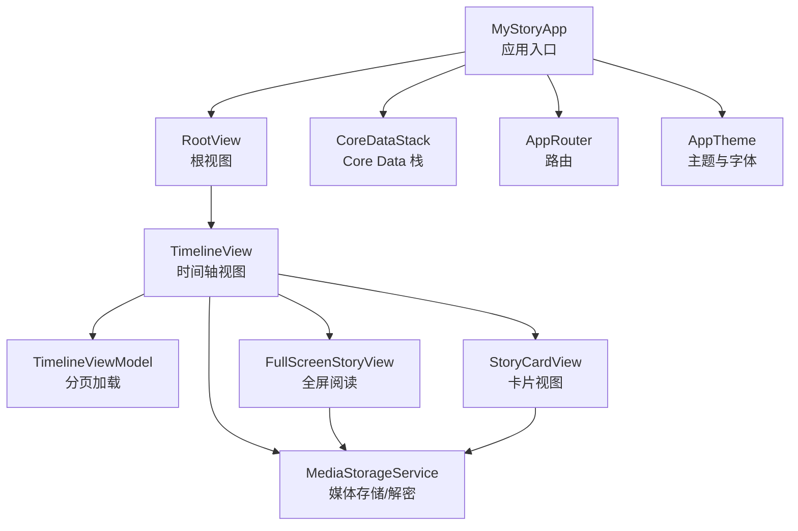
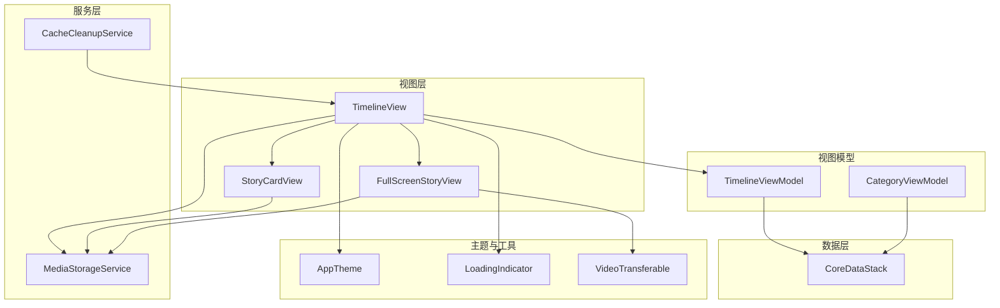
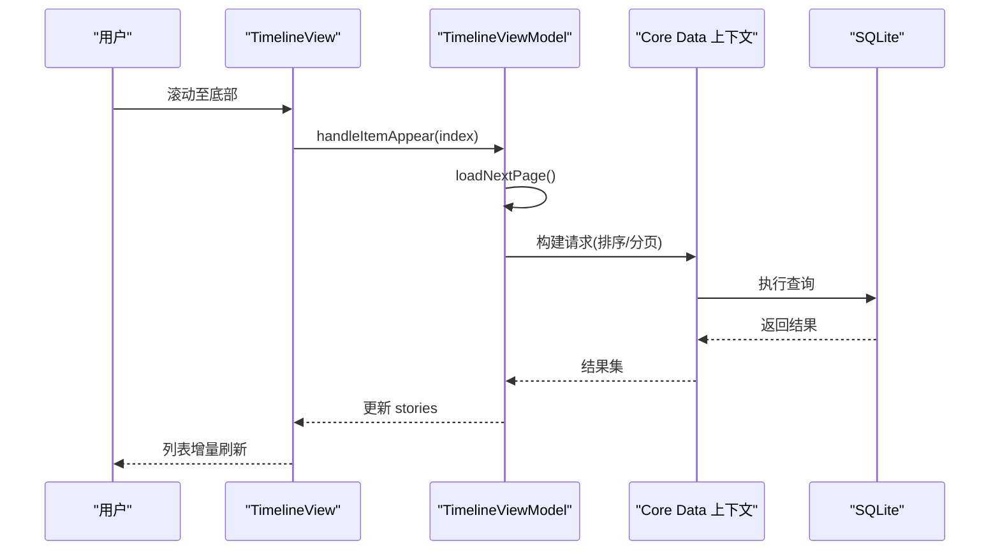
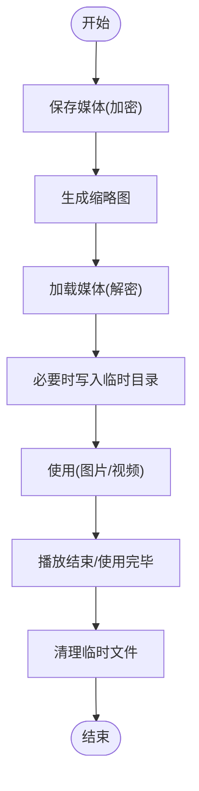
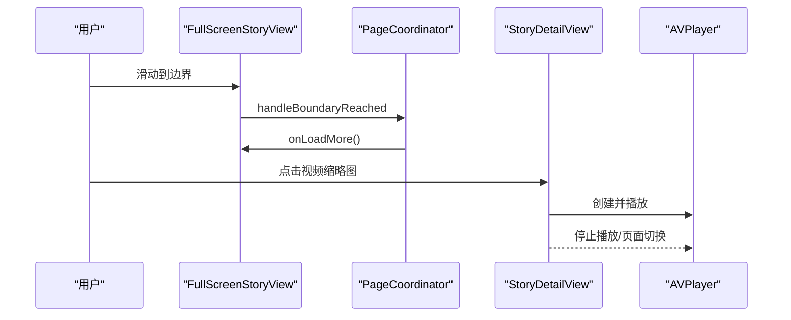
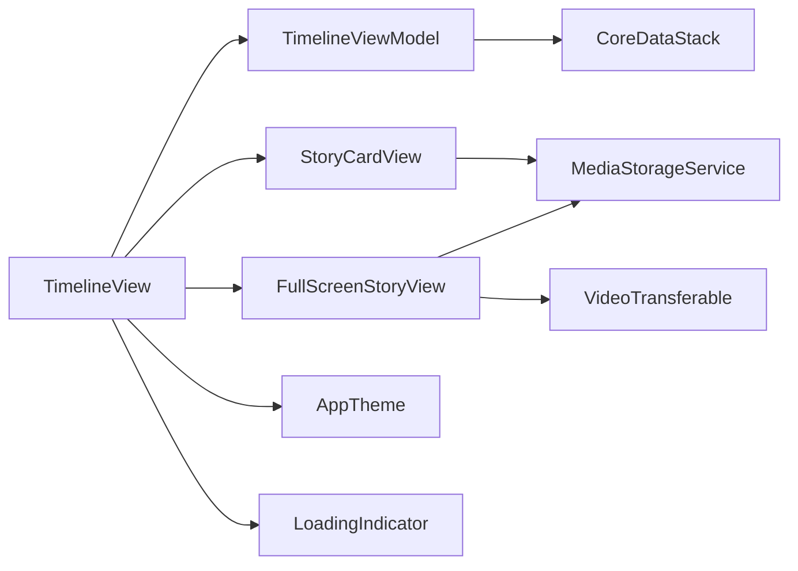

# 性能优化

<cite>
**本文引用的文件**
- [MyStoryApp.swift](file://MyStory/MyStoryApp.swift)
- [CoreDataStack.swift](file://MyStory/Core/Storage/CoreDataStack.swift)
- [TimelineView.swift](file://MyStory/Views/Timeline/TimelineView.swift)
- [TimelineViewModel.swift](file://MyStory/Views/Timeline/TimelineViewModel.swift)
- [StoryCardView.swift](file://MyStory/Components/StoryCardView.swift)
- [FullScreenStoryView.swift](file://MyStory/Views/Timeline/FullScreenStoryView.swift)
- [MediaStorageService.swift](file://MyStory/Services/MediaStorageService.swift)
- [LoadingIndicator.swift](file://MyStory/Utils/LoadingIndicator.swift)
- [AppTheme.swift](file://MyStory/Components/Theme/AppTheme.swift)
- [CategoryViewModel.swift](file://MyStory/ViewModels/Category/CategoryViewModel.swift)
- [CacheCleanupService.swift](file://MyStory/Services/CacheCleanupService.swift)
- [VideoTransferable.swift](file://MyStory/Utils/VideoTransferable.swift)
- [Design.md](file://Design.md)
</cite>

## 目录
1. [简介](#简介)
2. [项目结构](#项目结构)
3. [核心组件](#核心组件)
4. [架构总览](#架构总览)
5. [详细组件分析](#详细组件分析)
6. [依赖分析](#依赖分析)
7. [性能考量](#性能考量)
8. [故障排查指南](#故障排查指南)
9. [结论](#结论)
10. [附录](#附录)

## 简介
本指南聚焦 MyStory 应用的性能优化实践，覆盖内存管理、网络请求优化、数据库查询优化、UI 渲染优化与 SwiftUI 性能特性利用，并结合现有代码实现给出可落地的优化策略与实施方案。重点包括：
- Core Data 查询优化与关系预加载
- 媒体资源加载与缓存策略
- SwiftUI 懒加载与视图更新优化
- 大规模数据滚动与分页加载
- 性能监控与回归预防

## 项目结构
MyStory 采用 SwiftUI + Core Data 架构，核心入口通过应用主文件注入 Core Data 上下文与路由，时间轴视图负责故事列表渲染与分页加载，媒体服务负责图片/视频的加解密与缩略图生成，主题与字体管理统一 UI 规范。

图表来源
- [MyStoryApp.swift](file://MyStory/MyStoryApp.swift#L10-L30)
- [TimelineView.swift](file://MyStory/Views/Timeline/TimelineView.swift#L6-L53)
- [TimelineViewModel.swift](file://MyStory/Views/Timeline/TimelineViewModel.swift#L4-L42)
- [StoryCardView.swift](file://MyStory/Components/StoryCardView.swift#L3-L113)
- [FullScreenStoryView.swift](file://MyStory/Views/Timeline/FullScreenStoryView.swift#L6-L99)
- [CoreDataStack.swift](file://MyStory/Core/Storage/CoreDataStack.swift#L4-L35)
- [MediaStorageService.swift](file://MyStory/Services/MediaStorageService.swift#L8-L124)
- [AppTheme.swift](file://MyStory/Components/Theme/AppTheme.swift#L154-L307)

章节来源
- [MyStoryApp.swift](file://MyStory/MyStoryApp.swift#L10-L30)
- [TimelineView.swift](file://MyStory/Views/Timeline/TimelineView.swift#L6-L53)
- [CoreDataStack.swift](file://MyStory/Core/Storage/CoreDataStack.swift#L4-L35)

## 核心组件
- 应用入口与环境注入：在应用入口注入 Core Data 上下文、路由与多语言管理器，保证全局可用。
- Core Data 栈：集中管理持久化容器、视图上下文合并策略与自动合并。
- 时间轴视图与分页模型：基于 SwiftUI 懒加载列表与分页加载，结合 onAppear 触发下一页。
- 媒体服务：负责图片/视频的加解密、缩略图生成与临时文件管理。
- 主题与字体：统一颜色、排版与字号缩放，减少样式计算开销。
- 缓存清理：定期扫描并清理临时文件，避免磁盘膨胀影响 IO。

章节来源
- [MyStoryApp.swift](file://MyStory/MyStoryApp.swift#L10-L30)
- [CoreDataStack.swift](file://MyStory/Core/Storage/CoreDataStack.swift#L4-L35)
- [TimelineView.swift](file://MyStory/Views/Timeline/TimelineView.swift#L56-L64)
- [TimelineViewModel.swift](file://MyStory/Views/Timeline/TimelineViewModel.swift#L17-L41)
- [MediaStorageService.swift](file://MyStory/Services/MediaStorageService.swift#L8-L124)
- [AppTheme.swift](file://MyStory/Components/Theme/AppTheme.swift#L154-L307)
- [CacheCleanupService.swift](file://MyStory/Services/CacheCleanupService.swift#L10-L67)

## 架构总览
应用采用 MVVM + Core Data 的分层架构，视图层通过 ObservableObject 驱动，业务逻辑集中在 ViewModel 与 Service 中，数据持久化由 Core Data 提供，媒体资源通过独立服务进行安全与性能优化。

图表来源
- [TimelineView.swift](file://MyStory/Views/Timeline/TimelineView.swift#L6-L53)
- [TimelineViewModel.swift](file://MyStory/Views/Timeline/TimelineViewModel.swift#L4-L42)
- [StoryCardView.swift](file://MyStory/Components/StoryCardView.swift#L3-L113)
- [FullScreenStoryView.swift](file://MyStory/Views/Timeline/FullScreenStoryView.swift#L6-L99)
- [MediaStorageService.swift](file://MyStory/Services/MediaStorageService.swift#L8-L124)
- [CacheCleanupService.swift](file://MyStory/Services/CacheCleanupService.swift#L10-L67)
- [CoreDataStack.swift](file://MyStory/Core/Storage/CoreDataStack.swift#L4-L35)
- [AppTheme.swift](file://MyStory/Components/Theme/AppTheme.swift#L154-L307)
- [LoadingIndicator.swift](file://MyStory/Utils/LoadingIndicator.swift#L4-L26)
- [VideoTransferable.swift](file://MyStory/Utils/VideoTransferable.swift#L5-L33)

## 详细组件分析

### 时间轴视图与分页加载
- 懒加载列表：使用 LazyVStack + ForEach 配合对象 ID 作为稳定标识，避免重建。
- 分页加载：在 onAppear 中判断接近底部时触发 loadNextPage，避免一次性加载全部数据。
- Core Data 查询：按时间倒序分页，fetchLimit + fetchOffset 控制每次加载数量。
- 关系预加载：在分类查询中对关系进行预加载，减少 N+1 查询风险。

图表来源
- [TimelineView.swift](file://MyStory/Views/Timeline/TimelineView.swift#L208-L212)
- [TimelineViewModel.swift](file://MyStory/Views/Timeline/TimelineViewModel.swift#L24-L41)

章节来源
- [TimelineView.swift](file://MyStory/Views/Timeline/TimelineView.swift#L56-L64)
- [TimelineView.swift](file://MyStory/Views/Timeline/TimelineView.swift#L208-L212)
- [TimelineViewModel.swift](file://MyStory/Views/Timeline/TimelineViewModel.swift#L17-L41)

### 媒体加载与缓存策略
- 加密存储：图片/视频保存与加载均进行加解密，临时文件写入文档目录，避免明文暴露。
- 缩略图生成：图片缩略图与视频封面按最大边缩放，降低内存占用。
- 临时文件管理：视频播放前解密到临时目录，播放完成后及时清理。
- 缓存清理：提供缓存扫描与清理能力，排除用户媒体与数据库文件，防止误删。

图表来源
- [MediaStorageService.swift](file://MyStory/Services/MediaStorageService.swift#L14-L123)
- [CacheCleanupService.swift](file://MyStory/Services/CacheCleanupService.swift#L29-L67)

章节来源
- [MediaStorageService.swift](file://MyStory/Services/MediaStorageService.swift#L14-L123)
- [CacheCleanupService.swift](file://MyStory/Services/CacheCleanupService.swift#L29-L67)

### 全屏阅读与视频播放优化
- 页面控制器：使用 UIPageViewController 包装 SwiftUI 视图，边界到达时触发加载更多。
- 视频播放：仅在当前页面播放，离开时停止播放并释放资源；支持缩略图点击播放。
- 图片缩放：双击放大/双指缩放，拖拽仅在放大状态下启用，避免与页面滑动冲突。

图表来源
- [FullScreenStoryView.swift](file://MyStory/Views/Timeline/FullScreenStoryView.swift#L77-L98)
- [FullScreenStoryView.swift](file://MyStory/Views/Timeline/FullScreenStoryView.swift#L102-L157)
- [FullScreenStoryView.swift](file://MyStory/Views/Timeline/FullScreenStoryView.swift#L498-L521)

章节来源
- [FullScreenStoryView.swift](file://MyStory/Views/Timeline/FullScreenStoryView.swift#L77-L98)
- [FullScreenStoryView.swift](file://MyStory/Views/Timeline/FullScreenStoryView.swift#L102-L157)
- [FullScreenStoryView.swift](file://MyStory/Views/Timeline/FullScreenStoryView.swift#L498-L521)

### 主题与字体缩放
- 字体缩放：通过 FontScaleManager 与 AppTheme 统一字号缩放，减少布局重算成本。
- 主题切换：ThemeManager 管理主题，颜色与阴影等静态资源按主题动态计算。

章节来源
- [AppTheme.swift](file://MyStory/Components/Theme/AppTheme.swift#L69-L90)
- [AppTheme.swift](file://MyStory/Components/Theme/AppTheme.swift#L135-L152)
- [AppTheme.swift](file://MyStory/Components/Theme/AppTheme.swift#L218-L278)

### 类别视图模型与关系预加载
- 关系预加载：在查询类别及其子类别时，预加载 stories、children、children.stories，降低后续访问延迟。
- 统计信息：提供子节点与故事总数统计，便于 UI 展示与交互优化。

章节来源
- [CategoryViewModel.swift](file://MyStory/ViewModels/Category/CategoryViewModel.swift#L18-L102)
- [CategoryService.swift](file://MyStory/Services/CategoryService/CategoryService.swift#L226-L257)

## 依赖分析
- 视图层依赖视图模型与服务层，避免直接访问 Core Data。
- 视图模型持有 Core Data 上下文，执行分页查询与状态管理。
- 媒体服务独立于视图层，提供统一的媒体读写接口。
- 主题与工具类为纯函数式组件，不引入副作用。

图表来源
- [TimelineView.swift](file://MyStory/Views/Timeline/TimelineView.swift#L6-L53)
- [TimelineViewModel.swift](file://MyStory/Views/Timeline/TimelineViewModel.swift#L4-L42)
- [StoryCardView.swift](file://MyStory/Components/StoryCardView.swift#L3-L113)
- [FullScreenStoryView.swift](file://MyStory/Views/Timeline/FullScreenStoryView.swift#L6-L99)
- [CoreDataStack.swift](file://MyStory/Core/Storage/CoreDataStack.swift#L4-L35)
- [MediaStorageService.swift](file://MyStory/Services/MediaStorageService.swift#L8-L124)
- [AppTheme.swift](file://MyStory/Components/Theme/AppTheme.swift#L154-L307)
- [LoadingIndicator.swift](file://MyStory/Utils/LoadingIndicator.swift#L4-L26)
- [VideoTransferable.swift](file://MyStory/Utils/VideoTransferable.swift#L5-L33)

## 性能考量
- 内存管理
  - 媒体加载采用缩略图与按需解密，避免大图常驻内存。
  - 视频播放仅保留当前页面播放器，切换时停止并释放。
  - 缓存清理服务定期扫描并删除临时文件，防止内存与磁盘压力累积。

- 网络请求优化
  - 媒体服务涉及本地文件读写与解密，建议在网络请求场景下复用该模式：本地缓存 + 条件请求 + 错误重试。
  - 对于外部服务，建议增加请求去重、超时控制与重试退避策略。

- 数据库查询优化
  - 使用 fetchLimit + fetchOffset 实现分页，避免一次性加载大量数据。
  - 对频繁访问的关系使用 relationshipKeyPathsForPrefetching 预加载，减少 N+1 查询。
  - 在 StoryEntity 上建立 timestamp 的索引，确保排序与分页高效。

- UI 渲染优化
  - 使用 LazyVStack + 稳定标识符，避免不必要的视图重建。
  - 图片网格采用 LazyVGrid，限制首屏展示数量（如前 9 张），减少布局复杂度。
  - 避免在 onAppear 中执行重任务，改为懒加载或延后执行。

- SwiftUI 性能特性利用
  - 使用 @StateObject 管理生命周期，避免重复初始化。
  - 使用 @Published 与单向数据流，减少不必要的重绘。
  - 使用 withLoadingIndicator 提供轻量反馈，避免阻塞主线程。

- 大规模数据处理
  - 分页加载 + 预加载策略，结合 onAppear 触发下一页。
  - 对时间轴进行分组展示（按日期），减少单列表项数量。
  - 对媒体资源进行缩略图与临时文件管理，降低渲染压力。

- 性能监控与回归预防
  - 使用 Xcode Instruments 的 Time Profiler 与 GPU Frame Debugger。
  - 设计基准测试场景（100/500/1000/5000 条数据滚动），设定 FPS 阈值。
  - 建立缓存清理与媒体文件完整性校验流程，防止性能退化。

章节来源
- [TimelineView.swift](file://MyStory/Views/Timeline/TimelineView.swift#L56-L64)
- [TimelineView.swift](file://MyStory/Views/Timeline/TimelineView.swift#L208-L212)
- [TimelineViewModel.swift](file://MyStory/Views/Timeline/TimelineViewModel.swift#L24-L41)
- [StoryCardView.swift](file://MyStory/Components/StoryCardView.swift#L117-L134)
- [FullScreenStoryView.swift](file://MyStory/Views/Timeline/FullScreenStoryView.swift#L498-L521)
- [MediaStorageService.swift](file://MyStory/Services/MediaStorageService.swift#L14-L123)
- [CacheCleanupService.swift](file://MyStory/Services/CacheCleanupService.swift#L29-L67)
- [Design.md](file://Design.md#L940-L1260)

## 故障排查指南
- 时间轴加载缓慢
  - 检查分页参数与排序字段是否命中索引。
  - 确认是否存在未预加载的关系导致额外查询。
  - 评估首屏媒体数量，必要时限制展示数量。

- 媒体加载失败或卡顿
  - 检查加密/解密流程与临时文件清理时机。
  - 确认缩略图尺寸与压缩质量平衡，避免过大内存占用。
  - 避免在主线程执行耗时 IO 操作。

- 视频播放异常
  - 确保页面切换时停止播放器并释放资源。
  - 检查临时文件路径与权限，避免播放中断。

- 缓存清理无效
  - 确认排除规则（Media/数据库文件）是否正确。
  - 检查缓存扫描范围与权限。

章节来源
- [TimelineViewModel.swift](file://MyStory/Views/Timeline/TimelineViewModel.swift#L24-L41)
- [MediaStorageService.swift](file://MyStory/Services/MediaStorageService.swift#L14-L123)
- [FullScreenStoryView.swift](file://MyStory/Views/Timeline/FullScreenStoryView.swift#L498-L521)
- [CacheCleanupService.swift](file://MyStory/Services/CacheCleanupService.swift#L29-L67)

## 结论
MyStory 的性能优化围绕“分页加载 + 关系预加载 + 媒体资源优化 + SwiftUI 懒加载”展开。通过合理使用 Core Data 的预加载与索引、媒体服务的缩略图与临时文件管理、以及 SwiftUI 的懒加载与状态管理，可在大规模数据场景下维持流畅的用户体验。建议持续引入性能监控与回归测试，确保优化效果长期稳定。

## 附录
- 性能基准与测试场景参考：[Design.md](file://Design.md#L940-L1260)
- 全局加载指示器：[LoadingIndicator.swift](file://MyStory/Utils/LoadingIndicator.swift#L4-L26)
- 视频传输适配：[VideoTransferable.swift](file://MyStory/Utils/VideoTransferable.swift#L5-L33)