# 扩展开发指南

<cite>
**本文档引用的文件**
- [MyStoryApp.swift](file://MyStory/MyStoryApp.swift)
- [AppRouter.swift](file://MyStory/Core/Router/AppRouter.swift)
- [AppTheme.swift](file://MyStory/Components/Theme/AppTheme.swift)
- [AIPolishService.swift](file://MyStory/Services/AIService/AIPolishService.swift)
- [CategoryService.swift](file://MyStory/Services/CategoryService/CategoryService.swift)
- [CategoryViewModel.swift](file://MyStory/ViewModels/Category/CategoryViewModel.swift)
- [CategoryView.swift](file://MyStory/Views/Category/CategoryView.swift)
- [CustomIconHelper.swift](file://MyStory/Utils/CustomIconHelper.swift)
- [LocalizationManager.swift](file://MyStory/Utils/LocalizationManager.swift)
- [CoreDataStack.swift](file://MyStory/Core/Storage/CoreDataStack.swift)
- [AIPolishViewModel.swift](file://MyStory/ViewModels/Editor/AIPolishViewModel.swift)
- [NewStoryEditorView.swift](file://MyStory/Views/Editor/NewStoryEditorView.swift)
- [String+Localization.swift](file://MyStory/Utils/String+Localization.swift)
- [CategoryModel.swift](file://MyStory/Models/Category/CategoryModel.swift)
- [CategoryEntity+CoreDataClass.swift](file://MyStory/Models/Entities/CategoryEntity+CoreDataClass.swift)
</cite>

## 目录
1. [简介](#简介)
2. [项目结构](#项目结构)
3. [核心组件](#核心组件)
4. [架构概览](#架构概览)
5. [详细组件分析](#详细组件分析)
6. [依赖关系分析](#依赖关系分析)
7. [性能考量](#性能考量)
8. [故障排除指南](#故障排除指南)
9. [结论](#结论)
10. [附录](#附录)

## 简介
本指南面向希望在 MyStory 应用基础上进行功能扩展与定制的开发者。文档覆盖以下关键领域：
- 在现有架构上添加新功能模块与扩展现有组件
- 集成第三方服务（如 AI 润色服务）
- 自定义组件开发方法、主题系统扩展与图标库维护
- 服务层扩展机制、数据模型新增与路由系统扩展
- 插件化开发与模块化设计最佳实践
- 新功能开发的标准流程、代码规范与设计模式应用

## 项目结构
MyStory 采用 SwiftUI + CoreData 的现代 iOS 架构，遵循 MVVM 模式与服务抽象，具备清晰的分层与职责分离：
- 应用入口与环境注入：MyStoryApp.swift
- 路由管理：Core/Router/AppRouter.swift
- 视图层：Views/*（按功能域组织）
- 视图模型：ViewModels/*（按功能域组织）
- 服务层：Services/*（业务服务与基础设施服务）
- 模型层：Models/*（CoreData 实体与轻量模型）
- 工具与资源：Utils/*、Resources/*
- 主题与样式：Components/Theme/AppTheme.swift

**图表来源**
- [MyStoryApp.swift](file://MyStory/MyStoryApp.swift#L11-L28)
- [AppRouter.swift](file://MyStory/Core/Router/AppRouter.swift#L81-L122)
- [CoreDataStack.swift](file://MyStory/Core/Storage/CoreDataStack.swift#L4-L35)

**章节来源**
- [MyStoryApp.swift](file://MyStory/MyStoryApp.swift#L11-L28)
- [AppRouter.swift](file://MyStory/Core/Router/AppRouter.swift#L10-L79)
- [CoreDataStack.swift](file://MyStory/Core/Storage/CoreDataStack.swift#L4-L35)

## 核心组件
本节梳理扩展开发中最常涉及的核心组件及其职责边界，帮助开发者快速定位扩展点。

- 应用入口与环境注入
  - MyStoryApp：初始化 CoreDataStack、AppRouter、LocalizationManager，并通过环境注入到视图层
  - 扩展建议：新增服务或工具时，优先通过环境注入，避免全局状态污染

- 路由管理
  - AppRouter：统一管理页面导航、Sheet 与全屏展示；AppRoute 枚举定义了所有路由类型
  - 扩展建议：新增页面时先在 AppRoute 中声明，再在 AppRouter 中实现导航逻辑

- 主题系统
  - AppTheme：集中管理颜色、字体、间距、圆角与阴影等视觉令牌；ThemeManager 与 FontScaleManager 提供主题与字号持久化
  - 扩展建议：新增主题或字号策略时，在 AppTheme 中定义令牌并在 ThemeManager/FontScaleManager 中持久化

- 服务层
  - CategoryService：抽象分类服务接口，提供内存实现与 CoreData 实现
  - AIPolishService：AI 润色服务封装，支持 Keychain 提供者接口
  - 扩展建议：新增服务时实现协议接口，确保可替换性与测试友好

- 视图模型与视图
  - CategoryViewModel：分类业务逻辑聚合，负责加载、搜索与统计
  - CategoryView：分类页面视图，支持卡片与列表两种展示模式
  - 扩展建议：新增功能时先在 ViewModel 中聚合业务逻辑，再在 View 中组合组件

**章节来源**
- [MyStoryApp.swift](file://MyStory/MyStoryApp.swift#L13-L27)
- [AppRouter.swift](file://MyStory/Core/Router/AppRouter.swift#L10-L79)
- [AppTheme.swift](file://MyStory/Components/Theme/AppTheme.swift#L135-L152)
- [CategoryService.swift](file://MyStory/Services/CategoryService/CategoryService.swift#L22-L42)
- [AIPolishService.swift](file://MyStory/Services/AIService/AIPolishService.swift#L8-L14)
- [CategoryViewModel.swift](file://MyStory/ViewModels/Category/CategoryViewModel.swift#L18-L30)
- [CategoryView.swift](file://MyStory/Views/Category/CategoryView.swift#L3-L23)

## 架构概览
MyStory 采用分层架构与依赖倒置原则：
- 视图层仅依赖视图模型，不直接访问服务
- 视图模型依赖服务接口，具体实现可替换
- 服务层依赖模型与存储层，提供业务能力
- 存储层基于 CoreData，提供数据持久化

**图表来源**
- [CategoryView.swift](file://MyStory/Views/Category/CategoryView.swift#L3-L23)
- [CategoryViewModel.swift](file://MyStory/ViewModels/Category/CategoryViewModel.swift#L25-L29)
- [CategoryService.swift](file://MyStory/Services/CategoryService/CategoryService.swift#L44-L185)
- [CoreDataStack.swift](file://MyStory/Core/Storage/CoreDataStack.swift#L4-L35)

## 详细组件分析

### 路由系统扩展
- 新增路由类型：在 AppRoute 中添加枚举值，定义携带参数
- 导航控制：在 AppRouter 中实现 navigate/present 方法
- 页面接入：在视图中通过 @EnvironmentObject(AppRouter) 获取路由实例，调用导航方法

**图表来源**
- [AppRouter.swift](file://MyStory/Core/Router/AppRouter.swift#L81-L122)

**章节来源**
- [AppRouter.swift](file://MyStory/Core/Router/AppRouter.swift#L10-L79)
- [AppRouter.swift](file://MyStory/Core/Router/AppRouter.swift#L81-L122)

### 主题系统扩展
- 新增主题：在 ThemeType 中添加枚举值，定义预览颜色与描述
- 字体缩放：在 FontScale 中添加枚举值，映射到 scale 与 slider 值
- 视觉令牌：在 AppTheme 中定义颜色、字体、间距、圆角与阴影令牌
- 持久化：ThemeManager/FontScaleManager 通过 UserDefaults 持久化用户选择

**图表来源**
- [AppTheme.swift](file://MyStory/Components/Theme/AppTheme.swift#L135-L152)
- [AppTheme.swift](file://MyStory/Components/Theme/AppTheme.swift#L69-L90)

**章节来源**
- [AppTheme.swift](file://MyStory/Components/Theme/AppTheme.swift#L93-L132)
- [AppTheme.swift](file://MyStory/Components/Theme/AppTheme.swift#L135-L152)
- [AppTheme.swift](file://MyStory/Components/Theme/AppTheme.swift#L69-L90)

### 服务层扩展（以分类服务为例）
- 接口设计：CategoryService 定义查询、增删改、统计与搜索等契约
- 内存实现：InMemoryCategoryService 便于测试与预览
- CoreData 实现：CoreDataCategoryService 提供持久化能力，包含复杂关系与异常处理
- 扩展建议：新增服务时实现协议接口，确保与 ViewModel 解耦

```mermaid
classDiagram
class CategoryService {
<<interface>>
+fetchTree() [CategoryTreeNode]
+fetchCategory(id) CategoryEntity?
+fetchCategories(level) [CategoryEntity]
+fetchChildren(parentId) [CategoryEntity]
+addCategory(...)
+updateCategory(...)
+deleteCategory(...)
+deleteCategoryRecursively(...)
+storyCount(for) Int
+totalStoryCount(for) Int
+childrenCount(for) Int
+searchStories(keyword) [CategorySearchResult]
}
class InMemoryCategoryService {
-categories : [UUID : CategoryModel]
-childrenMap : [UUID : [UUID]]
-storyCounts : [UUID : Int]
}
class CoreDataCategoryService {
-context : NSManagedObjectContext
}
CategoryService <|.. InMemoryCategoryService
CategoryService <|.. CoreDataCategoryService
```

**图表来源**
- [CategoryService.swift](file://MyStory/Services/CategoryService/CategoryService.swift#L22-L42)
- [CategoryService.swift](file://MyStory/Services/CategoryService/CategoryService.swift#L44-L185)
- [CategoryService.swift](file://MyStory/Services/CategoryService/CategoryService.swift#L190-L675)

**章节来源**
- [CategoryService.swift](file://MyStory/Services/CategoryService/CategoryService.swift#L22-L42)
- [CategoryService.swift](file://MyStory/Services/CategoryService/CategoryService.swift#L44-L185)
- [CategoryService.swift](file://MyStory/Services/CategoryService/CategoryService.swift#L190-L675)

### AI 润色服务集成
- 协议与实现：AIPolishService 通过 KeychainProviding 抽象密钥存储
- 请求与响应：定义请求体结构，支持增量输出与超时控制
- 错误处理：统一错误码与本地化提示
- 速率限制：AIPolishViewModel 对请求频率进行限制

**图表来源**
- [AIPolishService.swift](file://MyStory/Services/AIService/AIPolishService.swift#L30-L61)
- [AIPolishViewModel.swift](file://MyStory/ViewModels/Editor/AIPolishViewModel.swift#L18-L39)

**章节来源**
- [AIPolishService.swift](file://MyStory/Services/AIService/AIPolishService.swift#L8-L14)
- [AIPolishService.swift](file://MyStory/Services/AIService/AIPolishService.swift#L30-L61)
- [AIPolishViewModel.swift](file://MyStory/ViewModels/Editor/AIPolishViewModel.swift#L18-L39)

### 自定义图标与媒体处理
- 自定义图标：CustomIconHelper 提供裁剪、缩放、圆形处理与数据转换
- 图标使用：CategoryIconView 与 CategoryEntity 的 iconType/customIconData 字段配合
- 媒体存储：MediaStorageService 与 CoreData 关系管理故事与媒体的生命周期

**图表来源**
- [CustomIconHelper.swift](file://MyStory/Utils/CustomIconHelper.swift#L16-L39)
- [CustomIconHelper.swift](file://MyStory/Utils/CustomIconHelper.swift#L116-L134)

**章节来源**
- [CustomIconHelper.swift](file://MyStory/Utils/CustomIconHelper.swift#L6-L162)
- [CategoryService.swift](file://MyStory/Services/CategoryService/CategoryService.swift#L320-L327)

### 多语言支持扩展
- 语言管理：LocalizationManager 管理当前语言与 Bundle 切换
- 字符串扩展：String.localized 提供便捷本地化方法
- 国际化资源：Localizable/*.lproj 下的 strings 文件

**图表来源**
- [LocalizationManager.swift](file://MyStory/Utils/LocalizationManager.swift#L70-L74)
- [String+Localization.swift](file://MyStory/Utils/String+Localization.swift#L10-L26)

**章节来源**
- [LocalizationManager.swift](file://MyStory/Utils/LocalizationManager.swift#L31-L107)
- [String+Localization.swift](file://MyStory/Utils/String+Localization.swift#L10-L47)

### 数据模型新增与迁移
- 新增实体：在 CoreDataStack 中定义实体属性与关系
- 关系设计：故事与媒体、故事与分类、分类父子关系
- 迁移策略：通过 NSPersistentHistory 与备份/恢复服务实现数据迁移

**图表来源**
- [CoreDataStack.swift](file://MyStory/Core/Storage/CoreDataStack.swift#L102-L200)
- [CoreDataStack.swift](file://MyStory/Core/Storage/CoreDataStack.swift#L268-L377)
- [CoreDataStack.swift](file://MyStory/Core/Storage/CoreDataStack.swift#L348-L364)

**章节来源**
- [CoreDataStack.swift](file://MyStory/Core/Storage/CoreDataStack.swift#L98-L381)
- [CategoryEntity+CoreDataClass.swift](file://MyStory/Models/Entities/CategoryEntity+CoreDataClass.swift#L14-L17)

### 编辑器视图扩展
- 编辑器视图：NewStoryEditorView 负责内容编辑、媒体选择、位置与分类
- 视图模型：NewStoryEditorViewModel 聚合业务逻辑，处理富文本、媒体与保存
- 扩展建议：新增编辑功能时，先在 ViewModel 中聚合逻辑，再在 View 中组合组件

**图表来源**
- [NewStoryEditorView.swift](file://MyStory/Views/Editor/NewStoryEditorView.swift#L35-L42)
- [NewStoryEditorView.swift](file://MyStory/Views/Editor/NewStoryEditorView.swift#L641-L654)
- [NewStoryEditorView.swift](file://MyStory/Views/Editor/NewStoryEditorView.swift#L715-L745)

**章节来源**
- [NewStoryEditorView.swift](file://MyStory/Views/Editor/NewStoryEditorView.swift#L8-L59)
- [NewStoryEditorView.swift](file://MyStory/Views/Editor/NewStoryEditorView.swift#L595-L711)
- [NewStoryEditorView.swift](file://MyStory/Views/Editor/NewStoryEditorView.swift#L715-L800)

## 依赖关系分析
- 视图依赖视图模型：通过 @ObservedObject/@StateObject 注入
- 视图模型依赖服务接口：通过构造函数注入，便于替换实现
- 服务依赖存储与工具：CoreData 上下文与工具类（如媒体、位置、本地化）
- 路由与主题：通过环境注入到视图层，避免全局状态

**图表来源**
- [CategoryView.swift](file://MyStory/Views/Category/CategoryView.swift#L3-L23)
- [CategoryViewModel.swift](file://MyStory/ViewModels/Category/CategoryViewModel.swift#L25-L29)
- [CoreDataStack.swift](file://MyStory/Core/Storage/CoreDataStack.swift#L4-L35)
- [AppRouter.swift](file://MyStory/Core/Router/AppRouter.swift#L81-L122)
- [AppTheme.swift](file://MyStory/Components/Theme/AppTheme.swift#L154-L307)

**章节来源**
- [CategoryView.swift](file://MyStory/Views/Category/CategoryView.swift#L3-L23)
- [CategoryViewModel.swift](file://MyStory/ViewModels/Category/CategoryViewModel.swift#L25-L29)
- [CoreDataStack.swift](file://MyStory/Core/Storage/CoreDataStack.swift#L4-L35)
- [AppRouter.swift](file://MyStory/Core/Router/AppRouter.swift#L81-L122)
- [AppTheme.swift](file://MyStory/Components/Theme/AppTheme.swift#L154-L307)

## 性能考量
- 预加载关系：CoreDataCategoryService 在查询时预加载相关关系，避免 fault 导致的二次查询与计数错误
- 异步处理：媒体加载与视频缩略图生成使用异步任务，避免阻塞主线程
- 速率限制：AI 润色服务在 ViewModel 中进行请求频率限制，避免 API 限流
- 缓存与持久化：ThemeManager/FontScaleManager 使用 UserDefaults 缓存用户偏好，减少重复计算

**章节来源**
- [CategoryService.swift](file://MyStory/Services/CategoryService/CategoryService.swift#L210-L211)
- [CategoryService.swift](file://MyStory/Services/CategoryService/CategoryService.swift#L256-L257)
- [CategoryService.swift](file://MyStory/Services/CategoryService/CategoryService.swift#L464-L464)
- [NewStoryEditorView.swift](file://MyStory/Views/Editor/NewStoryEditorView.swift#L782-L799)
- [AIPolishViewModel.swift](file://MyStory/ViewModels/Editor/AIPolishViewModel.swift#L22-L26)

## 故障排除指南
- 路由问题：检查 AppRoute 是否定义完整，AppRouter 的 navigate/present 方法是否被调用
- 主题不生效：确认 ThemeManager/FontScaleManager 的 currentTheme/currentScale 是否正确持久化
- 服务异常：检查服务实现中的错误分支与本地化提示，确保 ViewModel 正确处理 Result
- CoreData 问题：关注预加载关系与异常处理，避免 fault 导致的数据为空或循环引用
- 多语言问题：确认 LocalizationManager 的 Bundle 切换与通知广播是否触发视图刷新

**章节来源**
- [AppRouter.swift](file://MyStory/Core/Router/AppRouter.swift#L86-L121)
- [AppTheme.swift](file://MyStory/Components/Theme/AppTheme.swift#L138-L151)
- [AIPolishService.swift](file://MyStory/Services/AIService/AIPolishService.swift#L30-L61)
- [CategoryService.swift](file://MyStory/Services/CategoryService/CategoryService.swift#L594-L612)
- [LocalizationManager.swift](file://MyStory/Utils/LocalizationManager.swift#L92-L99)

## 结论
MyStory 的架构清晰、职责明确，为扩展开发提供了良好的基础。遵循以下原则可高效扩展：
- 通过协议与依赖注入隔离变化，确保可测试与可替换
- 在 ViewModel 中聚合业务逻辑，视图仅负责渲染与交互
- 在服务层处理复杂业务规则与数据一致性
- 使用 CoreData 的关系与预加载优化性能
- 通过路由与主题系统统一管理导航与外观

## 附录
- 新功能开发标准流程
  1) 设计路由与视图模型契约
  2) 实现服务接口与具体实现
  3) 在 ViewModel 中聚合业务逻辑
  4) 在 View 中组合组件并接入路由与主题
  5) 编写单元测试与集成测试
  6) 集成到应用入口并通过环境注入

- 代码规范与设计模式
  - 单一职责：每个类/协议仅负责单一职责
  - 依赖倒置：高层模块依赖抽象而非具体实现
  - MVVM：视图与视图模型解耦，服务接口抽象
  - 策略模式：通过协议与不同实现切换服务策略
  - 观察者模式：ObservableObject 与 @Published 管理状态

- 插件化与模块化最佳实践
  - 通过协议定义插件接口，实现可插拔的服务
  - 使用命名空间与目录结构区分功能域
  - 通过环境注入与依赖注入容器管理依赖
  - 为每个模块提供独立的 ViewModel 与 View