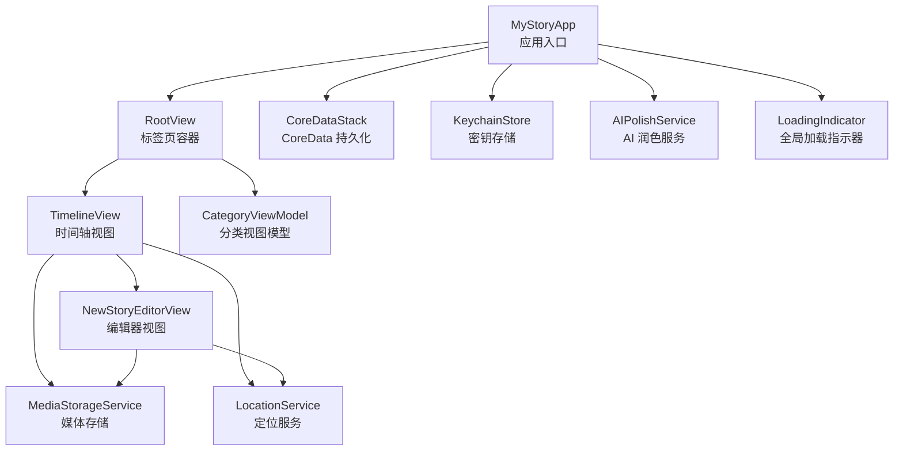
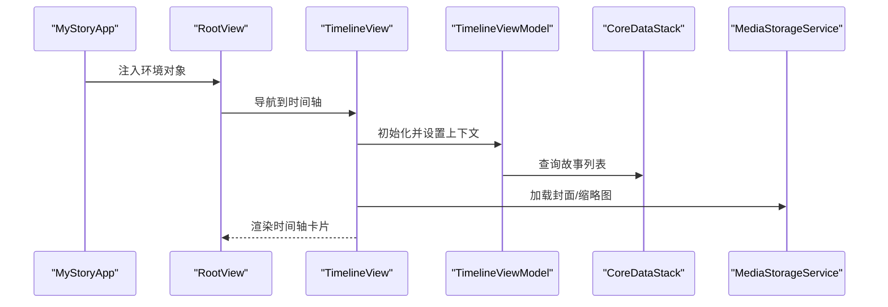
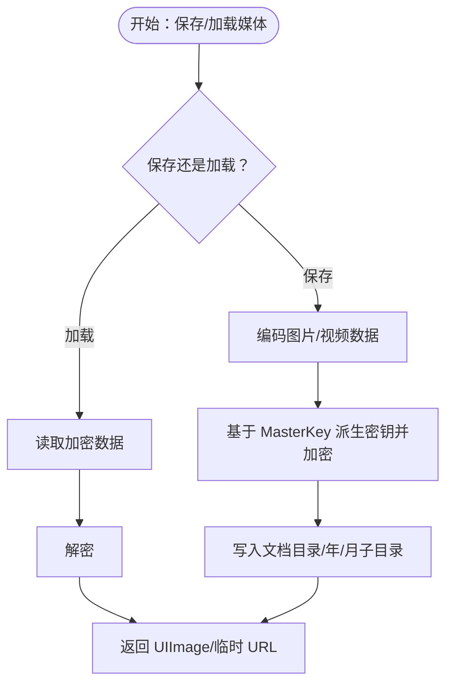
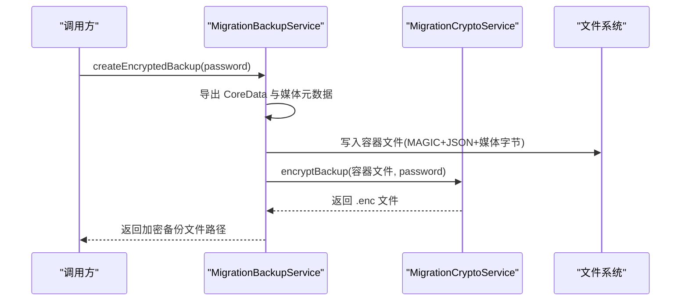
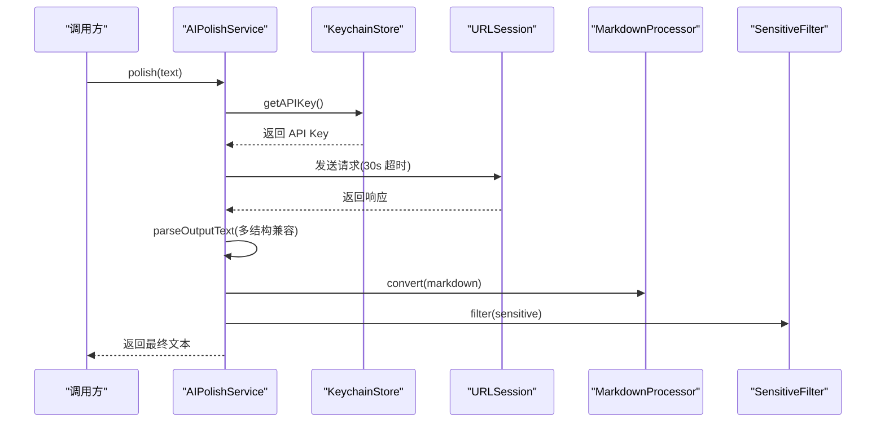
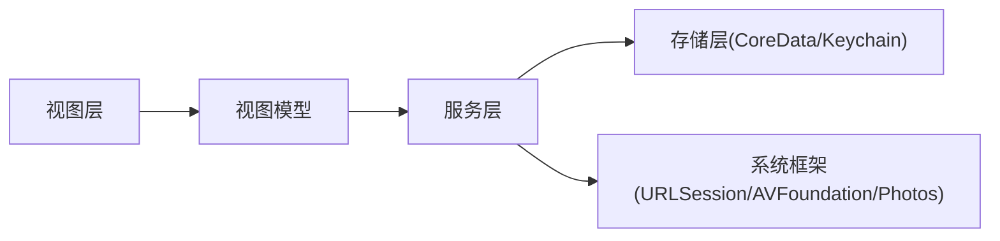

# 故障排除和调试

<cite>
**本文引用的文件**
- [MyStoryApp.swift](file://MyStory/MyStoryApp.swift)
- [CoreDataStack.swift](file://MyStory/Core/Storage/CoreDataStack.swift)
- [KeychainStore.swift](file://MyStory/Core/Storage/KeychainStore.swift)
- [MigrationBackupService.swift](file://MyStory/Services/MigrationBackupService.swift)
- [MigrationRestoreService.swift](file://MyStory/Services/MigrationRestoreService.swift)
- [AIPolishService.swift](file://MyStory/Services/AIService/AIPolishService.swift)
- [LocationService.swift](file://MyStory/Services/LocationService.swift)
- [MediaStorageService.swift](file://MyStory/Services/MediaStorageService.swift)
- [LoadingIndicator.swift](file://MyStory/Utils/LoadingIndicator.swift)
- [SensitiveFilter.swift](file://MyStory/Utils/SensitiveFilter.swift)
- [MarkdownProcessor.swift](file://MyStory/Utils/MarkdownProcessor.swift)
- [RootView.swift](file://MyStory/Views/RootView.swift)
- [TimelineView.swift](file://MyStory/Views/Timeline/TimelineView.swift)
- [NewStoryEditorView.swift](file://MyStory/Views/Editor/NewStoryEditorView.swift)
- [AIPolishViewModel.swift](file://MyStory/ViewModels/Editor/AIPolishViewModel.swift)
- [CategoryViewModel.swift](file://MyStory/ViewModels/Category/CategoryViewModel.swift)
</cite>

## 目录
1. [简介](#简介)
2. [项目结构](#项目结构)
3. [核心组件](#核心组件)
4. [架构总览](#架构总览)
5. [详细组件分析](#详细组件分析)
6. [依赖分析](#依赖分析)
7. [性能考虑](#性能考虑)
8. [故障排除指南](#故障排除指南)
9. [结论](#结论)
10. [附录](#附录)

## 简介
本指南面向 MyStory 应用的开发与运维人员，提供系统化的故障排除与调试方法，覆盖编译错误、运行时异常、数据同步与迁移问题、网络请求与 AI 服务调用、数据库与媒体存储、UI 布局与交互等场景。文档同时给出调试工具使用建议、日志记录策略、错误追踪技术、Xcode 高级调试技巧以及生产环境监控与应急处理方案。

## 项目结构
MyStory 采用 SwiftUI + CoreData + 服务层的分层架构，核心模块包括：
- 应用入口与环境注入：MyStoryApp、RootView
- 存储层：CoreDataStack、KeychainStore
- 业务服务：AI 润色、位置服务、媒体存储、迁移备份/恢复
- 工具与通用组件：敏感词过滤、Markdown 处理、全局加载指示器
- 视图与视图模型：时间轴、编辑器、分类等

图表来源
- [MyStoryApp.swift](file://MyStory/MyStoryApp.swift#L10-L30)
- [RootView.swift](file://MyStory/Views/RootView.swift#L10-L35)
- [TimelineView.swift](file://MyStory/Views/Timeline/TimelineView.swift#L22-L53)
- [NewStoryEditorView.swift](file://MyStory/Views/Editor/NewStoryEditorView.swift#L23-L59)
- [CoreDataStack.swift](file://MyStory/Core/Storage/CoreDataStack.swift#L4-L35)
- [KeychainStore.swift](file://MyStory/Core/Storage/KeychainStore.swift#L4-L39)
- [MediaStorageService.swift](file://MyStory/Services/MediaStorageService.swift#L8-L224)
- [LocationService.swift](file://MyStory/Services/LocationService.swift#L4-L55)
- [AIPolishService.swift](file://MyStory/Services/AIService/AIPolishService.swift#L8-L77)
- [LoadingIndicator.swift](file://MyStory/Utils/LoadingIndicator.swift#L4-L26)

章节来源
- [MyStoryApp.swift](file://MyStory/MyStoryApp.swift#L10-L30)
- [RootView.swift](file://MyStory/Views/RootView.swift#L10-L35)

## 核心组件
- 应用入口与环境注入
  - 在应用入口注入 CoreDataStack、AppRouter、LocalizationManager，并通过环境传递给视图树。
- CoreData 持久化
  - 初始化持久化容器、加载 Store、合并策略与自动合并；DEBUG 模式下可清理旧数据库以解决模型变更导致的加载失败。
- Keychain 存储
  - 用于保存 DashScope API Key 与 MasterKey，提供读写接口。
- 媒体存储与加密
  - 媒体按年/月分目录存放，支持图片与视频的加密封装与缩略图生成。
- 迁移备份与恢复
  - 备份容器格式包含元数据 JSON 与媒体字节流，支持加密与解密。
- AI 润色服务
  - 从 Keychain 读取 API Key，构造请求并解析多形态响应，最终经 Markdown 处理与敏感词过滤。
- 位置服务
  - 请求用户授权、反向地理编码并返回位置信息。
- 全局加载指示器
  - 提供统一的加载状态管理与 UI 展示。

章节来源
- [MyStoryApp.swift](file://MyStory/MyStoryApp.swift#L10-L30)
- [CoreDataStack.swift](file://MyStory/Core/Storage/CoreDataStack.swift#L4-L35)
- [KeychainStore.swift](file://MyStory/Core/Storage/KeychainStore.swift#L4-L39)
- [MediaStorageService.swift](file://MyStory/Services/MediaStorageService.swift#L8-L224)
- [MigrationBackupService.swift](file://MyStory/Services/MigrationBackupService.swift#L6-L142)
- [MigrationRestoreService.swift](file://MyStory/Services/MigrationRestoreService.swift#L6-L152)
- [AIPolishService.swift](file://MyStory/Services/AIService/AIPolishService.swift#L8-L77)
- [LocationService.swift](file://MyStory/Services/LocationService.swift#L4-L55)
- [LoadingIndicator.swift](file://MyStory/Utils/LoadingIndicator.swift#L4-L26)

## 架构总览
MyStory 的控制流从应用入口开始，通过环境对象将 CoreData、路由与国际化注入到各视图；视图通过服务层访问网络、定位与媒体存储；数据变更通过 CoreData 上下文持久化，迁移服务负责跨设备的数据迁移。

图表来源
- [MyStoryApp.swift](file://MyStory/MyStoryApp.swift#L10-L30)
- [RootView.swift](file://MyStory/Views/RootView.swift#L10-L35)
- [TimelineView.swift](file://MyStory/Views/Timeline/TimelineView.swift#L201-L206)
- [CoreDataStack.swift](file://MyStory/Core/Storage/CoreDataStack.swift#L4-L35)
- [MediaStorageService.swift](file://MyStory/Services/MediaStorageService.swift#L71-L123)

## 详细组件分析

### CoreData 持久化与调试要点
- 加载失败排查
  - 检查持久化容器初始化与 Store 加载回调中的错误信息；DEBUG 模式下会删除旧数据库文件以规避模型不兼容。
  - 若出现“Failed to load store”，优先确认模型变更是否导致 Store 不兼容，必要时清理沙盒数据或执行迁移。
- 合并与并发
  - viewContext 合并策略与自动合并开启，避免主线程外频繁 save 导致的并发冲突。
- 保存失败
  - save() 包裹在 do/catch 中打印错误，便于定位具体实体与属性问题。

章节来源
- [CoreDataStack.swift](file://MyStory/Core/Storage/CoreDataStack.swift#L8-L35)
- [CoreDataStack.swift](file://MyStory/Core/Storage/CoreDataStack.swift#L86-L91)

### 媒体存储与加密（MediaStorageService）
- 问题类型
  - 无法保存/加载图片/视频、缩略图为空、解密失败、Keychain 读取异常。
- 排查步骤
  - 确认媒体目录结构（按年/月分层），检查文件是否存在与权限。
  - 加密/解密失败时，检查 MasterKey 是否存在于 Keychain，以及派生密钥过程是否成功。
  - 视频缩略图生成失败时，检查视频源与 AVAssetImageGenerator 的参数设置。
- 关键路径
  - 保存图片/视频：[saveImage](file://MyStory/Services/MediaStorageService.swift#L14-L26)、[saveVideo](file://MyStory/Services/MediaStorageService.swift#L89-L112)
  - 加载与解密：[loadImage](file://MyStory/Services/MediaStorageService.swift#L71-L78)、[loadVideoURL](file://MyStory/Services/MediaStorageService.swift#L114-L123)
  - 加密/解密与 Keychain：[encrypt](file://MyStory/Services/MediaStorageService.swift#L194-L201)、[decrypt](file://MyStory/Services/MediaStorageService.swift#L203-L207)、[KeyManager](file://MyStory/Services/MediaStorageService.swift#L226-L271)

图表来源
- [MediaStorageService.swift](file://MyStory/Services/MediaStorageService.swift#L14-L26)
- [MediaStorageService.swift](file://MyStory/Services/MediaStorageService.swift#L71-L123)
- [MediaStorageService.swift](file://MyStory/Services/MediaStorageService.swift#L194-L207)

章节来源
- [MediaStorageService.swift](file://MyStory/Services/MediaStorageService.swift#L8-L224)

### 迁移备份与恢复（MigrationBackupService / MigrationRestoreService）
- 备份流程
  - 导出 CoreData 与媒体元数据 → 构建容器文件（含元数据 JSON 与媒体字节流）→ 加密输出 → 清理中间产物。
- 恢复流程
  - 解密容器 → 读取元数据与媒体偏移 → 恢复 MasterKey 与媒体文件 → 清空并重建 CoreData 实体 → 清理中间产物。
- 常见问题
  - 容器格式不正确、JSON 长度读取失败、媒体文件缺失、解密失败、Keychain 写入失败。
- 关键路径
  - 备份：[createEncryptedBackup](file://MyStory/Services/MigrationBackupService.swift#L115-L142)、[buildContainerFile](file://MyStory/Services/MigrationBackupService.swift#L352-L411)
  - 恢复：[restoreFromEncryptedBackup](file://MyStory/Services/MigrationRestoreService.swift#L108-L152)、[readContainerFile](file://MyStory/Services/MigrationRestoreService.swift#L166-L206)

图表来源
- [MigrationBackupService.swift](file://MyStory/Services/MigrationBackupService.swift#L115-L142)
- [MigrationBackupService.swift](file://MyStory/Services/MigrationBackupService.swift#L352-L411)

章节来源
- [MigrationBackupService.swift](file://MyStory/Services/MigrationBackupService.swift#L6-L142)
- [MigrationRestoreService.swift](file://MyStory/Services/MigrationRestoreService.swift#L6-L152)

### AI 润色服务（AIPolishService）
- 问题类型
  - 未配置 API Key、网络超时、响应解析失败、Markdown 处理与敏感词过滤。
- 排查步骤
  - 确认 Keychain 中存在 DashScope API Key；检查请求超时与序列化错误；解析多种返回结构并回退为原文。
- 关键路径
  - 请求与解析：[polish](file://MyStory/Services/AIService/AIPolishService.swift#L30-L61)、[parseOutputText](file://MyStory/Services/AIService/AIPolishService.swift#L63-L75)
  - 文本处理：[MarkdownProcessor](file://MyStory/Utils/MarkdownProcessor.swift#L4-L8)、[SensitiveFilter](file://MyStory/Utils/SensitiveFilter.swift#L10-L16)

图表来源
- [AIPolishService.swift](file://MyStory/Services/AIService/AIPolishService.swift#L30-L61)
- [MarkdownProcessor.swift](file://MyStory/Utils/MarkdownProcessor.swift#L4-L8)
- [SensitiveFilter.swift](file://MyStory/Utils/SensitiveFilter.swift#L10-L16)

章节来源
- [AIPolishService.swift](file://MyStory/Services/AIService/AIPolishService.swift#L8-L77)
- [KeychainStore.swift](file://MyStory/Core/Storage/KeychainStore.swift#L10-L21)

### 位置服务（LocationService）
- 问题类型
  - 未授权、定位失败、反向地理编码无结果。
- 排查步骤
  - 检查授权状态与请求精度；确认地理编码回调是否触发；核对返回的地址字段组合逻辑。
- 关键路径
  - 请求与回调：[requestCurrentLocation](file://MyStory/Services/LocationService.swift#L14-L21)、[locationManager](file://MyStory/Services/LocationService.swift#L42-L54)

章节来源
- [LocationService.swift](file://MyStory/Services/LocationService.swift#L4-L55)

### 全局加载指示器（LoadingIndicator）
- 问题类型
  - 指示器不消失、UI 卡顿。
- 排查步骤
  - 确认在主线程切换 isLoading 状态；检查异步任务完成后是否调用 hide()。
- 关键路径
  - 显示/隐藏：[show](file://MyStory/Utils/LoadingIndicator.swift#L13-L18)、[hide](file://MyStory/Utils/LoadingIndicator.swift#L21-L25)

章节来源
- [LoadingIndicator.swift](file://MyStory/Utils/LoadingIndicator.swift#L4-L26)

### 时间轴与编辑器（TimelineView / NewStoryEditorView）
- 问题类型
  - 列表加载不全、封面加载失败、编辑器保存异常、媒体选择无响应。
- 排查步骤
  - 检查分页加载触发条件与媒体服务加载逻辑；确认保存时 CoreData 上下文变更与保存调用。
- 关键路径
  - 时间轴加载与封面：[setupViewModel](file://MyStory/Views/Timeline/TimelineView.swift#L201-L206)、[loadCoverImage](file://MyStory/Views/Timeline/TimelineView.swift#L214-L229)
  - 编辑器媒体处理：[handleMediaItemsChange](file://MyStory/Views/Editor/NewStoryEditorView.swift#L715-L745)、[save](file://MyStory/Views/Editor/NewStoryEditorView.swift#L80-L95)

章节来源
- [TimelineView.swift](file://MyStory/Views/Timeline/TimelineView.swift#L201-L229)
- [NewStoryEditorView.swift](file://MyStory/Views/Editor/NewStoryEditorView.swift#L80-L95)
- [NewStoryEditorView.swift](file://MyStory/Views/Editor/NewStoryEditorView.swift#L715-L745)

## 依赖分析
- 组件耦合
  - 视图依赖视图模型，视图模型依赖服务层；服务层依赖存储层与系统框架。
- 外部依赖
  - CoreData、Security(Keychain)、AVFoundation、PhotosUI、URLSession。
- 潜在循环
  - 未发现明显循环依赖；服务层通过协议抽象（如 KeychainProviding）降低耦合。

图表来源
- [TimelineView.swift](file://MyStory/Views/Timeline/TimelineView.swift#L22-L53)
- [NewStoryEditorView.swift](file://MyStory/Views/Editor/NewStoryEditorView.swift#L23-L59)
- [AIPolishService.swift](file://MyStory/Services/AIService/AIPolishService.swift#L8-L14)
- [MediaStorageService.swift](file://MyStory/Services/MediaStorageService.swift#L8-L224)
- [CoreDataStack.swift](file://MyStory/Core/Storage/CoreDataStack.swift#L4-L35)
- [KeychainStore.swift](file://MyStory/Core/Storage/KeychainStore.swift#L4-L39)

## 性能考虑
- 媒体处理
  - 生成缩略图时设置合理的最大尺寸与容差，避免过大的内存占用；视频缩略图优先使用早期帧以减少计算。
- CoreData
  - 合理使用 viewContext 自动合并与合并策略；批量操作时减少 save 次数。
- 网络请求
  - 设置合理超时与重试策略；对 AI 润色请求进行速率限制，避免触发服务端限流。
- UI 渲染
  - 使用惰性列表与条件渲染，避免不必要的视图重建。

[本节为通用指导，无需列出章节来源]

## 故障排除指南

### 一、编译错误
- 常见症状
  - 模型不匹配导致 Store 加载失败、Keychain 权限问题、SwiftUI 环境对象未注入。
- 处理步骤
  - 清理构建产物与沙盒数据，重新运行；确认 Info.plist 与 Bundle 配置；检查 Keychain 权限与 Entitlements。
- 关联文件
  - [CoreDataStack.swift](file://MyStory/Core/Storage/CoreDataStack.swift#L8-L35)
  - [MyStoryApp.swift](file://MyStory/MyStoryApp.swift#L10-L30)

章节来源
- [CoreDataStack.swift](file://MyStory/Core/Storage/CoreDataStack.swift#L8-L35)
- [MyStoryApp.swift](file://MyStory/MyStoryApp.swift#L10-L30)

### 二、运行时异常
- CoreData 异常
  - 现象：崩溃于加载 Store 或保存上下文。
  - 排查：查看加载回调错误；确认模型变更后清理旧 Store；避免在后台线程直接 save。
- 媒体相关异常
  - 现象：无法加载图片/视频、缩略图为空。
  - 排查：检查媒体目录是否存在、文件名与相对路径；确认加密/解密流程与 MasterKey。
- Keychain 异常
  - 现象：API Key 读取失败或 MasterKey 写入失败。
  - 排查：确认 Keychain 权限、账户名与可读写状态；必要时重置 Keychain 数据。
- 关联文件
  - [CoreDataStack.swift](file://MyStory/Core/Storage/CoreDataStack.swift#L27-L34)
  - [MediaStorageService.swift](file://MyStory/Services/MediaStorageService.swift#L71-L123)
  - [KeychainStore.swift](file://MyStory/Core/Storage/KeychainStore.swift#L10-L21)

章节来源
- [CoreDataStack.swift](file://MyStory/Core/Storage/CoreDataStack.swift#L27-L34)
- [MediaStorageService.swift](file://MyStory/Services/MediaStorageService.swift#L71-L123)
- [KeychainStore.swift](file://MyStory/Core/Storage/KeychainStore.swift#L10-L21)

### 三、数据同步与迁移问题
- 备份失败
  - 现象：容器文件构建失败、媒体字节写入异常。
  - 排查：检查媒体目录扫描与文件存在性；确认 JSON 编码与容器格式；验证加密流程。
- 恢复失败
  - 现象：解密失败、媒体恢复不完整、CoreData 清空/重建异常。
  - 排查：校验备份 ID 与文件名；检查容器 MAGIC 与 JSON 长度；确认 Keychain 写入与 MasterKey 恢复。
- 关联文件
  - [MigrationBackupService.swift](file://MyStory/Services/MigrationBackupService.swift#L115-L142)
  - [MigrationRestoreService.swift](file://MyStory/Services/MigrationRestoreService.swift#L108-L152)

章节来源
- [MigrationBackupService.swift](file://MyStory/Services/MigrationBackupService.swift#L115-L142)
- [MigrationRestoreService.swift](file://MyStory/Services/MigrationRestoreService.swift#L108-L152)

### 四、网络请求与 AI 服务
- 现象：请求超时、解析失败、未配置 API Key。
- 排查：检查 Keychain 中 API Key、请求超时与序列化错误；解析多种返回结构并回退；确认 Markdown 与敏感词处理链路。
- 关联文件
  - [AIPolishService.swift](file://MyStory/Services/AIService/AIPolishService.swift#L30-L61)
  - [AIPolishViewModel.swift](file://MyStory/ViewModels/Editor/AIPolishViewModel.swift#L18-L39)

章节来源
- [AIPolishService.swift](file://MyStory/Services/AIService/AIPolishService.swift#L30-L61)
- [AIPolishViewModel.swift](file://MyStory/ViewModels/Editor/AIPolishViewModel.swift#L18-L39)

### 五、UI 布局与交互
- 现象：时间轴列表不加载、封面不显示、编辑器媒体无响应。
- 排查：检查分页触发阈值、媒体服务加载逻辑、PhotosPicker 回调；确认保存后刷新与上下文变更。
- 关联文件
  - [TimelineView.swift](file://MyStory/Views/Timeline/TimelineView.swift#L208-L212)
  - [TimelineView.swift](file://MyStory/Views/Timeline/TimelineView.swift#L214-L229)
  - [NewStoryEditorView.swift](file://MyStory/Views/Editor/NewStoryEditorView.swift#L262-L288)

章节来源
- [TimelineView.swift](file://MyStory/Views/Timeline/TimelineView.swift#L208-L229)
- [NewStoryEditorView.swift](file://MyStory/Views/Editor/NewStoryEditorView.swift#L262-L288)

### 六、调试工具与日志策略
- Xcode 调试器
  - 断点：在关键函数入口（如 polish、save、load）设置断点；变量监视：观察 context、mediaURL、API Key。
  - 条件断点：针对媒体文件名、URL、错误码设置条件断点。
  - 布局调试：使用 Debug View Hierarchy 查看层级与约束；使用 Canvas 预览关键视图。
- 日志记录
  - 在 CoreData 加载、媒体读写、Keychain 操作、网络请求与迁移流程中打印关键信息，便于回溯。
- 错误追踪
  - 对网络与文件操作使用 Result 类型封装，统一错误处理与提示。

[本节为通用指导，无需列出章节来源]

### 七、问题重现、分类与修复验证
- 重现步骤
  - 明确前置条件（如未授权、无网络、模型变更）；记录最小复现路径（特定页面、操作序列）。
- 问题分类
  - 编译类、运行时类、数据类、网络类、UI 类；依据影响范围与紧急程度分级。
- 修复验证
  - 单元测试（如媒体加解密）、集成测试（如备份/恢复流程）、端到端测试（编辑器保存与加载）。

[本节为通用指导，无需列出章节来源]

### 八、生产环境监控与应急处理
- 监控指标
  - CoreData 加载成功率、媒体读写耗时、Keychain 访问错误率、网络请求失败率、迁移成功率。
- 应急预案
  - 快速回滚（模型/代码版本）、清空并重建（CoreData/媒体目录）、重置 Keychain、降级功能（如关闭 AI 润色）。
- 日志与告警
  - 对关键错误事件打点并上报；设置阈值告警与自动化通知。

[本节为通用指导，无需列出章节来源]

## 结论
MyStory 的故障排除应围绕“数据层（CoreData/Keychain/媒体）—服务层（网络/定位/迁移）—视图层（UI/交互）”展开，结合 Xcode 调试工具与日志策略，形成标准化的问题定位与修复流程。对于生产环境，建议建立完善的监控与应急机制，确保快速恢复与最小化影响。

[本节为总结性内容，无需列出章节来源]

## 附录

### A. 常见问题清单与定位指引
- CoreData 加载失败
  - 检查模型变更与 Store 兼容性；必要时清理旧数据库。
  - 参考：[CoreDataStack.swift](file://MyStory/Core/Storage/CoreDataStack.swift#L8-L35)
- 媒体无法加载
  - 核对媒体目录结构与文件存在性；检查加密/解密与 MasterKey。
  - 参考：[MediaStorageService.swift](file://MyStory/Services/MediaStorageService.swift#L71-L123)
- API Key 未配置
  - 确认 Keychain 中存在 DashScope API Key；检查权限与读取逻辑。
  - 参考：[KeychainStore.swift](file://MyStory/Core/Storage/KeychainStore.swift#L10-L21)、[AIPolishService.swift](file://MyStory/Services/AIService/AIPolishService.swift#L30-L34)
- 备份/恢复失败
  - 校验容器格式、JSON 编码与媒体偏移；确认 Keychain 写入与 MasterKey 恢复。
  - 参考：[MigrationBackupService.swift](file://MyStory/Services/MigrationBackupService.swift#L166-L206)、[MigrationRestoreService.swift](file://MyStory/Services/MigrationRestoreService.swift#L108-L152)

### B. Xcode 调试技巧速查
- 断点：函数入口、关键变量赋值、错误分支。
- 变量监视：context、mediaURL、API Key、错误码。
- 布局调试：Debug View Hierarchy、Canvas 预览。
- 性能：Instruments Time Profiler、Allocations、Leaks。

[本节为通用指导，无需列出章节来源]