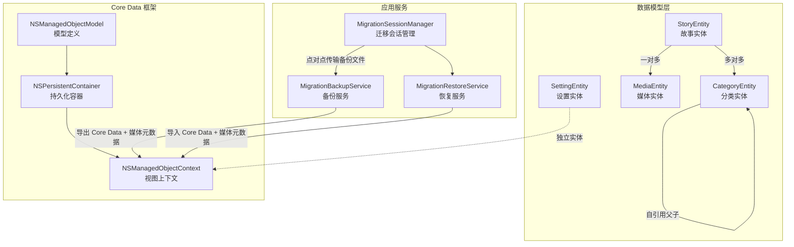
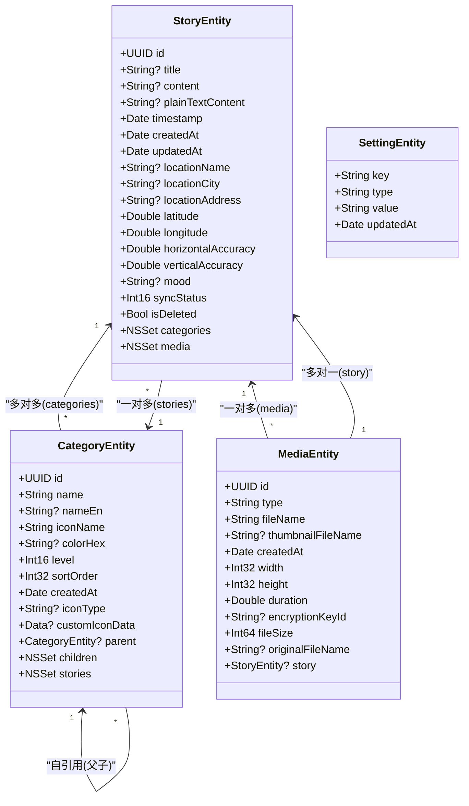
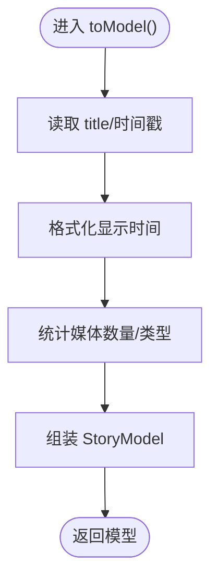
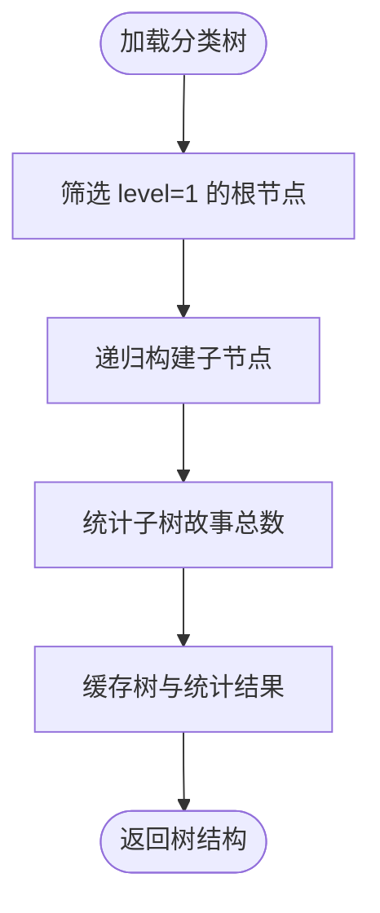
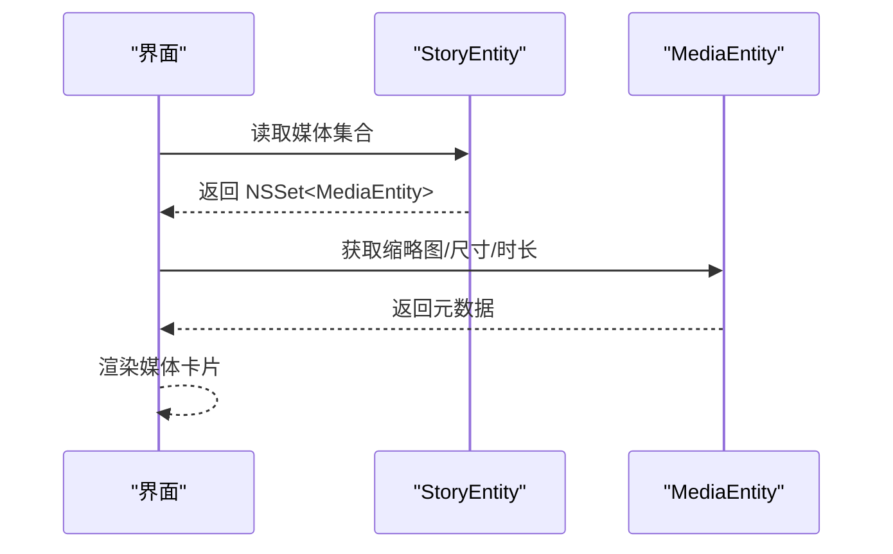
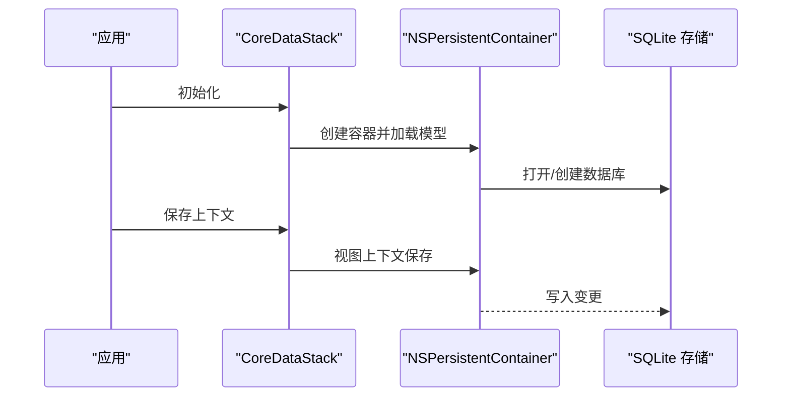
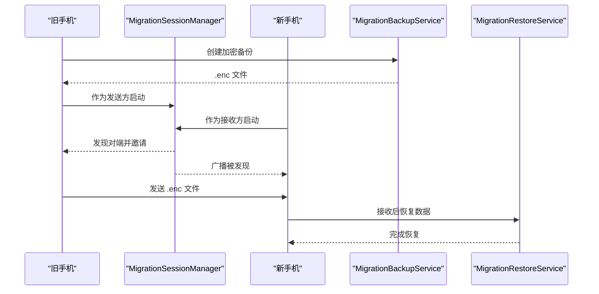
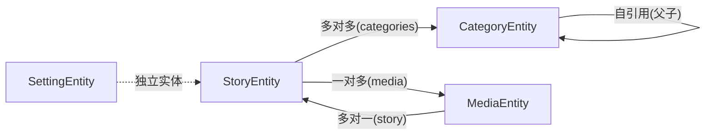

# Core Data 模型概览

<cite>
**本文引用的文件**
- [CoreDataStack.swift](file://MyStory/Core/Storage/CoreDataStack.swift)
- [contents](file://MyStory/Resources/MyStory.xcdatamodeld/MyStory.xcdatamodel/contents)
- [StoryEntity+CoreDataClass.swift](file://MyStory/Models/Entities/StoryEntity+CoreDataClass.swift)
- [StoryEntity+CoreDataProperties.swift](file://MyStory/Models/Entities/StoryEntity+CoreDataProperties.swift)
- [CategoryEntity+CoreDataClass.swift](file://MyStory/Models/Entities/CategoryEntity+CoreDataClass.swift)
- [CategoryEntity+CoreDataProperties.swift](file://MyStory/Models/Entities/CategoryEntity+CoreDataProperties.swift)
- [MediaEntity+CoreDataClass.swift](file://MyStory/Models/Entities/MediaEntity+CoreDataClass.swift)
- [MediaEntity+CoreDataProperties.swift](file://MyStory/Models/Entities/MediaEntity+CoreDataProperties.swift)
- [SettingEntity+CoreDataClass.swift](file://MyStory/Models/Entities/SettingEntity+CoreDataClass.swift)
- [SettingEntity+CoreDataProperties.swift](file://MyStory/Models/Entities/SettingEntity+CoreDataProperties.swift)
- [MigrationBackupService.swift](file://MyStory/Services/MigrationBackupService.swift)
- [MigrationRestoreService.swift](file://MyStory/Services/MigrationRestoreService.swift)
- [MigrationSessionManager.swift](file://MyStory/Services/MigrationSessionManager.swift)
- [StorageDesign.md](file://StorageDesign.md)
</cite>

## 目录
1. [简介](#简介)
2. [项目结构](#项目结构)
3. [核心组件](#核心组件)
4. [架构总览](#架构总览)
5. [详细组件分析](#详细组件分析)
6. [依赖关系分析](#依赖关系分析)
7. [性能考量](#性能考量)
8. [故障排查指南](#故障排查指南)
9. [结论](#结论)
10. [附录](#附录)

## 简介
本文件为 MyStory 的 Core Data 数据模型概览文档，面向开发者与产品/测试人员，系统阐述四类核心实体（StoryEntity、CategoryEntity、MediaEntity、SettingEntity）的设计理念、实体关系、数据持久化机制与迁移策略。文档同时提供实体关系图与数据流图，帮助读者快速理解整体布局与演进方式。

## 项目结构
MyStory 的数据层采用 Core Data 框架，结合 Swift 实体类与 Xcode 模型文件共同构成数据模型。核心文件分布如下：
- Core Data 模型与实体：位于资源目录的 .xcdatamodeld 文件中，定义实体、属性与关系。
- 实体类与属性扩展：位于 Models/Entities 目录，提供实体类与 NSManaged 属性访问器。
- 数据栈与上下文：CoreDataStack 提供持久化容器、视图上下文与保存逻辑。
- 迁移与备份：MigrationBackupService、MigrationRestoreService、MigrationSessionManager 提供跨设备迁移与备份恢复能力。

图表来源
- [CoreDataStack.swift](file://MyStory/Core/Storage/CoreDataStack.swift#L4-L35)
- [contents](file://MyStory/Resources/MyStory.xcdatamodeld/MyStory.xcdatamodel/contents#L3-L79)
- [MigrationBackupService.swift](file://MyStory/Services/MigrationBackupService.swift#L103-L142)
- [MigrationRestoreService.swift](file://MyStory/Services/MigrationRestoreService.swift#L96-L152)
- [MigrationSessionManager.swift](file://MyStory/Services/MigrationSessionManager.swift#L5-L48)

章节来源
- [CoreDataStack.swift](file://MyStory/Core/Storage/CoreDataStack.swift#L4-L35)
- [contents](file://MyStory/Resources/MyStory.xcdatamodeld/MyStory.xcdatamodel/contents#L1-L79)

## 核心组件
本节聚焦四类核心实体的设计目标、关键属性与关系规则，帮助快速掌握数据模型要点。

- StoryEntity（故事实体）
  - 设计目标：承载单条“故事”记录，包含标题、内容、时间戳、位置信息、同步状态与软删除标记；支持与分类（多对多）和媒体（一对多）关联。
  - 关键关系：categories（多对多）、media（一对多）。
  - 删除规则：story -> media 使用级联删除（Cascade），media -> story 使用置空删除（Nullify）。

- CategoryEntity（分类实体）
  - 设计目标：构建三级分类体系（Level 1/2/3），支持父子自引用关系；提供图标、颜色、排序与创建时间等元数据。
  - 关键关系：parent（一对一）、children（一对多）、stories（一对多）。
  - 删除规则：parent -> children 使用级联删除（Cascade），children -> parent 使用置空删除（Nullify）。

- MediaEntity（媒体实体）
  - 设计目标：记录图片/视频等媒体文件的元数据（类型、尺寸、时长、加密标识等），并与故事建立“所属”关系。
  - 关键关系：story（多对一）。
  - 删除规则：story -> media 使用级联删除（Cascade），media -> story 使用置空删除（Nullify）。

- SettingEntity（设置实体）
  - 设计目标：存储键值型配置项，具备唯一键约束，便于全局设置管理。
  - 关键属性：key（唯一）、type、value、updatedAt。

章节来源
- [contents](file://MyStory/Resources/MyStory.xcdatamodeld/MyStory.xcdatamodel/contents#L3-L79)
- [StoryEntity+CoreDataProperties.swift](file://MyStory/Models/Entities/StoryEntity+CoreDataProperties.swift#L15-L41)
- [CategoryEntity+CoreDataProperties.swift](file://MyStory/Models/Entities/CategoryEntity+CoreDataProperties.swift#L15-L35)
- [MediaEntity+CoreDataProperties.swift](file://MyStory/Models/Entities/MediaEntity+CoreDataProperties.swift#L15-L33)
- [SettingEntity+CoreDataProperties.swift](file://MyStory/Models/Entities/SettingEntity+CoreDataProperties.swift#L15-L25)

## 架构总览
MyStory 的数据架构围绕 Core Data 持久化容器展开，采用“模型定义 + 实体类 + 上下文”的分层设计，并通过迁移服务实现跨设备的数据备份与恢复。

图表来源
- [StoryEntity+CoreDataProperties.swift](file://MyStory/Models/Entities/StoryEntity+CoreDataProperties.swift#L15-L41)
- [CategoryEntity+CoreDataProperties.swift](file://MyStory/Models/Entities/CategoryEntity+CoreDataProperties.swift#L15-L35)
- [MediaEntity+CoreDataProperties.swift](file://MyStory/Models/Entities/MediaEntity+CoreDataProperties.swift#L15-L33)
- [SettingEntity+CoreDataProperties.swift](file://MyStory/Models/Entities/SettingEntity+CoreDataProperties.swift#L15-L25)

## 详细组件分析

### StoryEntity（故事实体）
- 数据结构与复杂度
  - 属性数量适中，查询主要围绕时间戳、分类集合与媒体集合进行，适合配合索引优化。
  - 多对多关系（categories）由 Core Data 自动管理中间表，插入/删除操作的时间复杂度与集合大小成正比。
- 处理逻辑与性能
  - toModel() 方法用于视图层展示，包含时间格式化与媒体计数等计算，建议在视图层懒加载或缓存结果以减少重复计算。
- 错误处理
  - 对于可选属性（如 content、location*），在转换与展示时应做好空值判断，避免运行时异常。

图表来源
- [StoryEntity+CoreDataClass.swift](file://MyStory/Models/Entities/StoryEntity+CoreDataClass.swift#L14-L28)

章节来源
- [StoryEntity+CoreDataClass.swift](file://MyStory/Models/Entities/StoryEntity+CoreDataClass.swift#L14-L28)
- [StoryEntity+CoreDataProperties.swift](file://MyStory/Models/Entities/StoryEntity+CoreDataProperties.swift#L15-L41)

### CategoryEntity（分类实体）
- 数据结构与复杂度
  - 支持三级分类与自引用父子关系，查询时可通过 level 与 parent 过滤，建议对 level 与 sortOrder 建立索引。
  - 多对多关系（stories）与一对多关系（children）均使用 Nullify 删除规则，确保删除分类不破坏故事数据。
- 处理逻辑与性能
  - 自引用父子关系在树形展示时需要递归遍历，建议在 ViewModel 层缓存树结构与统计信息（如子分类故事总数）。
- 错误处理
  - 父子层级一致性校验应在服务层执行，防止出现环路或越级层级。

图表来源
- [CategoryEntity+CoreDataProperties.swift](file://MyStory/Models/Entities/CategoryEntity+CoreDataProperties.swift#L15-L35)
- [StorageDesign.md](file://StorageDesign.md#L16-L64)

章节来源
- [CategoryEntity+CoreDataProperties.swift](file://MyStory/Models/Entities/CategoryEntity+CoreDataProperties.swift#L15-L35)
- [StorageDesign.md](file://StorageDesign.md#L16-L64)

### MediaEntity（媒体实体）
- 数据结构与复杂度
  - 媒体文件元数据与故事关联紧密，查询通常伴随 StoryEntity 的 FetchRequest，建议对 story 进行索引以提升联结效率。
  - 媒体文件的物理存储与 Core Data 元数据分离，迁移服务负责打包与恢复。
- 处理逻辑与性能
  - 媒体缩略图与原文件名等字段用于前端展示，建议在后台线程批量处理缩略图生成与元数据写入。
- 错误处理
  - 文件缺失或损坏时，迁移服务提供损坏计数与统计，便于用户感知与后续修复。

图表来源
- [MediaEntity+CoreDataProperties.swift](file://MyStory/Models/Entities/MediaEntity+CoreDataProperties.swift#L15-L33)
- [StoryEntity+CoreDataProperties.swift](file://MyStory/Models/Entities/StoryEntity+CoreDataProperties.swift#L38-L39)

章节来源
- [MediaEntity+CoreDataProperties.swift](file://MyStory/Models/Entities/MediaEntity+CoreDataProperties.swift#L15-L33)

### SettingEntity（设置实体）
- 数据结构与复杂度
  - 键值对结构简单，查询以 key 为主，建议对 key 建立唯一索引以保证查询与去重效率。
- 处理逻辑与性能
  - 设置项变更频率较低，可在应用启动时一次性加载并缓存，避免频繁访问磁盘。
- 错误处理
  - 对于非法 key 或类型不匹配的情况，应在写入前进行校验与转换。

章节来源
- [SettingEntity+CoreDataProperties.swift](file://MyStory/Models/Entities/SettingEntity+CoreDataProperties.swift#L15-L25)

### 数据持久化与上下文管理
- 持久化容器与上下文
  - CoreDataStack 负责创建 NSPersistentContainer，设置 SQLite 存储、合并策略与自动合并变更。
  - 视图上下文（viewContext）用于 UI 层读取，保存时先检查是否有变更再执行保存。
- 预览模式
  - 提供预览实例，自动创建示例分类与故事数据，便于 SwiftUI 预览与调试。

图表来源
- [CoreDataStack.swift](file://MyStory/Core/Storage/CoreDataStack.swift#L8-L35)

章节来源
- [CoreDataStack.swift](file://MyStory/Core/Storage/CoreDataStack.swift#L8-L35)

### 数据模型演进与版本兼容
- 轻量级迁移
  - 采用 Core Data 轻量级迁移策略，新增版本时自动处理可逆的结构变更（如新增可选属性、新增实体等）。
- 迁移前备份
  - 迁移服务在执行迁移前会备份数据库，确保回滚与恢复能力。
- 索引优化
  - 建议为常用查询字段（如 Category.level、Category.sortOrder、Story.timestamp、Story.isDeleted）建立索引，提升查询性能。

章节来源
- [StorageDesign.md](file://StorageDesign.md#L284-L304)

### 数据迁移流程（点对点）
- 备份导出
  - MigrationBackupService 导出 Core Data 实体数据与媒体元数据，打包为自定义容器文件，随后加密生成 .enc 文件。
- 传输与接收
  - MigrationSessionManager 基于 MultipeerConnectivity 实现点对点传输，包含 PIN 验证与进度监控。
- 恢复导入
  - MigrationRestoreService 解密并解析容器文件，恢复 MasterKey、媒体文件与 Core Data 数据，清理中间产物。

图表来源
- [MigrationBackupService.swift](file://MyStory/Services/MigrationBackupService.swift#L115-L142)
- [MigrationRestoreService.swift](file://MyStory/Services/MigrationRestoreService.swift#L108-L152)
- [MigrationSessionManager.swift](file://MyStory/Services/MigrationSessionManager.swift#L62-L106)

章节来源
- [MigrationBackupService.swift](file://MyStory/Services/MigrationBackupService.swift#L115-L142)
- [MigrationRestoreService.swift](file://MyStory/Services/MigrationRestoreService.swift#L108-L152)
- [MigrationSessionManager.swift](file://MyStory/Services/MigrationSessionManager.swift#L62-L106)

## 依赖关系分析
- 实体间耦合
  - StoryEntity 与 CategoryEntity 通过 NSSet 建立多对多关系，耦合度低，便于独立扩展。
  - CategoryEntity 的自引用父子关系与 StoryEntity 的媒体集合分别承担“分类树”和“媒体管理”的职责，边界清晰。
- 外键约束与删除规则
  - 级联删除（Cascade）用于“父->子”和“故事->媒体”，确保删除操作的一致性。
  - 置空删除（Nullify）用于“子->父”和“媒体->故事”，避免误删业务数据。
- 外部依赖
  - 迁移服务依赖加密服务与 Keychain，确保备份文件与 MasterKey 的安全存储。

图表来源
- [contents](file://MyStory/Resources/MyStory.xcdatamodeld/MyStory.xcdatamodel/contents#L14-L16)
- [contents](file://MyStory/Resources/MyStory.xcdatamodeld/MyStory.xcdatamodel/contents#L35-L35)
- [contents](file://MyStory/Resources/MyStory.xcdatamodeld/MyStory.xcdatamodel/contents#L71-L72)

章节来源
- [contents](file://MyStory/Resources/MyStory.xcdatamodeld/MyStory.xcdatamodel/contents#L14-L16)
- [contents](file://MyStory/Resources/MyStory.xcdatamodeld/MyStory.xcdatamodel/contents#L35-L35)
- [contents](file://MyStory/Resources/MyStory.xcdatamodeld/MyStory.xcdatamodel/contents#L71-L72)

## 性能考量
- 查询优化
  - 为 Category.level、Category.sortOrder、Story.timestamp、Story.isDeleted 建立索引，显著降低过滤与排序成本。
- 写入优化
  - 批量写入时尽量合并保存，避免频繁触发磁盘 IO；在后台上下文执行耗时任务，主线程只做 UI 更新。
- 迁移性能
  - 备份与恢复采用分阶段进度回调，媒体文件按顺序写入，避免一次性大块内存占用。

## 故障排查指南
- 数据库加载失败
  - 检查持久化容器初始化与存储 URL 设置，确认 SQLite 文件可读写。
- 保存失败
  - 查看保存前的上下文变更状态，捕获并记录错误信息，必要时回滚事务。
- 迁移失败
  - 核对备份文件格式（MAGIC、JSON 长度、媒体偏移），确认密码正确与 Keychain 中 MasterKey 可用。
- 点对点传输中断
  - 检查 MultipeerConnectivity 权限与网络环境，确认 PIN 验证流程与进度观察者正常工作。

章节来源
- [CoreDataStack.swift](file://MyStory/Core/Storage/CoreDataStack.swift#L27-L31)
- [MigrationRestoreService.swift](file://MyStory/Services/MigrationRestoreService.swift#L166-L206)
- [MigrationSessionManager.swift](file://MyStory/Services/MigrationSessionManager.swift#L239-L333)

## 结论
MyStory 的 Core Data 模型以清晰的三层分类体系为核心，结合多对多与自引用关系，实现了灵活而稳定的业务数据组织。通过合理的删除规则、索引策略与迁移服务，系统在易用性、性能与安全性方面达到良好平衡。建议在后续迭代中持续完善索引与缓存策略，并在 ViewModel 层进一步抽象数据访问逻辑，提升代码可维护性。

## 附录
- 关键实体属性与关系速览
  - StoryEntity：id、title、content、plainTextContent、timestamp、createdAt、updatedAt、location*、mood、syncStatus、isDeleted、categories、media
  - CategoryEntity：id、name、nameEn、iconName、colorHex、level、sortOrder、createdAt、iconType、customIconData、parent、children、stories
  - MediaEntity：id、type、fileName、thumbnailFileName、createdAt、width、height、duration、encryptionKeyId、fileSize、originalFileName、story
  - SettingEntity：key（唯一）、type、value、updatedAt

章节来源
- [StoryEntity+CoreDataProperties.swift](file://MyStory/Models/Entities/StoryEntity+CoreDataProperties.swift#L21-L39)
- [CategoryEntity+CoreDataProperties.swift](file://MyStory/Models/Entities/CategoryEntity+CoreDataProperties.swift#L21-L33)
- [MediaEntity+CoreDataProperties.swift](file://MyStory/Models/Entities/MediaEntity+CoreDataProperties.swift#L21-L32)
- [SettingEntity+CoreDataProperties.swift](file://MyStory/Models/Entities/SettingEntity+CoreDataProperties.swift#L21-L24)