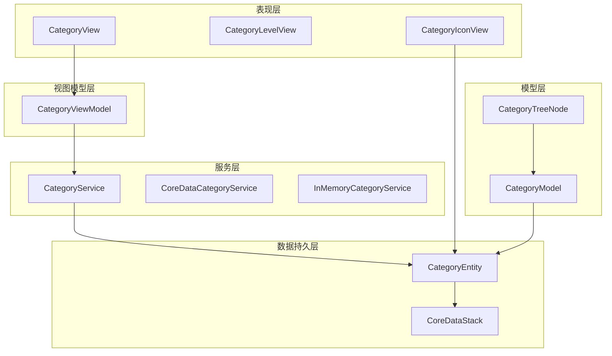
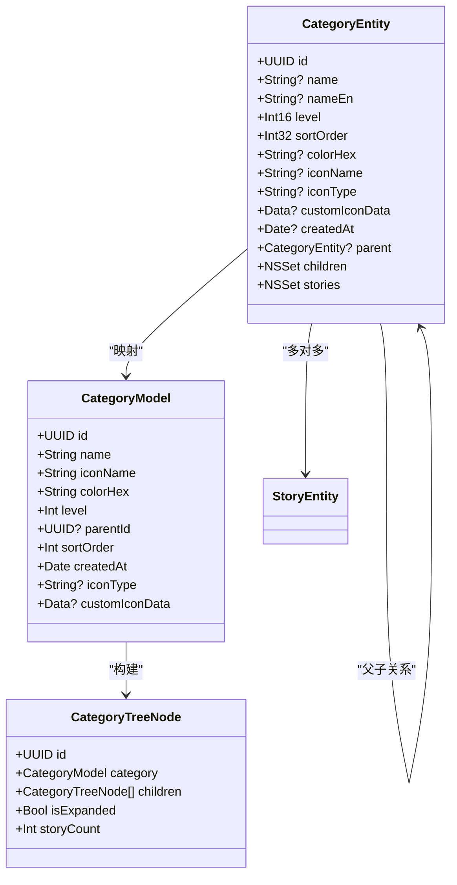
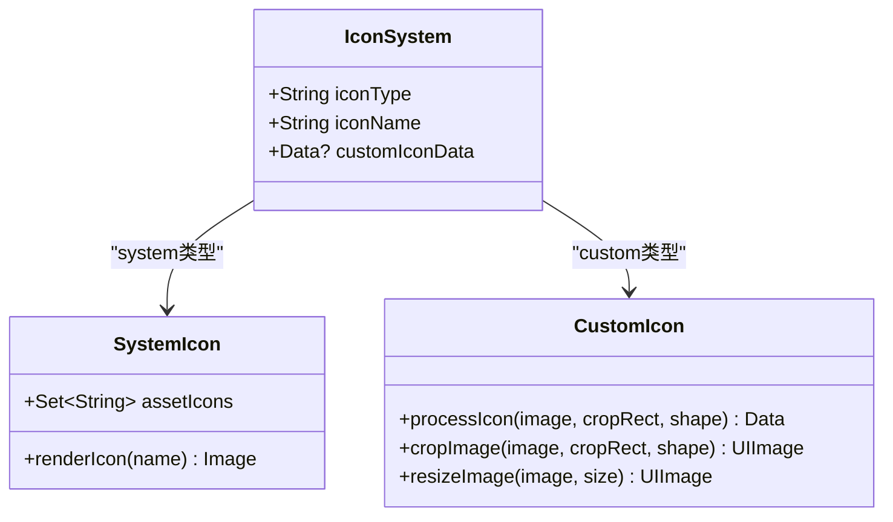
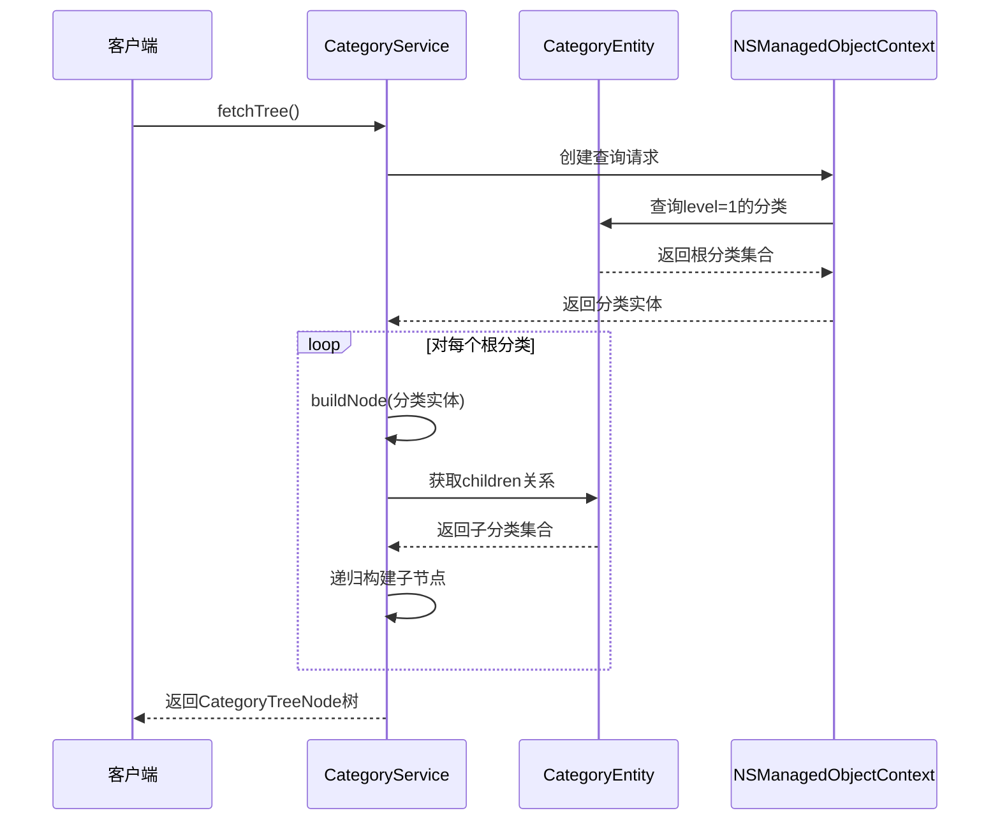
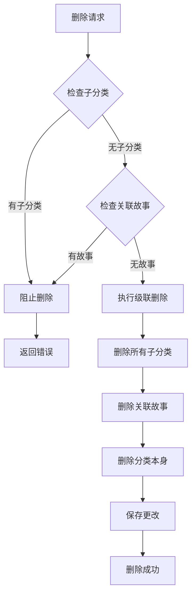
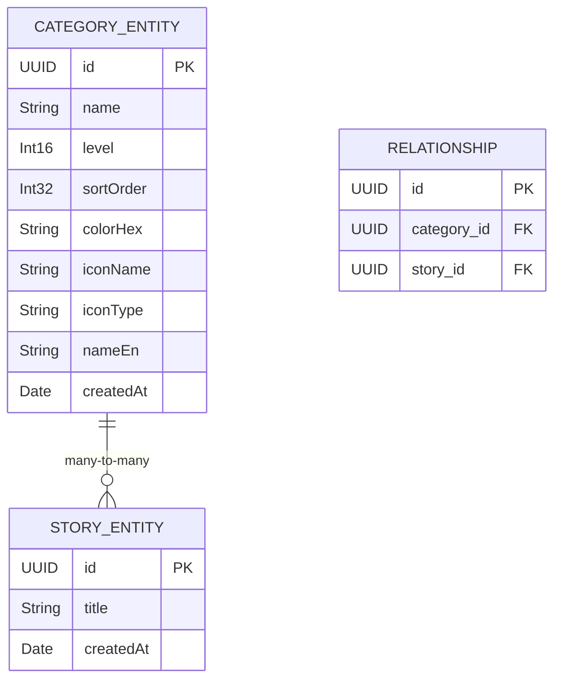
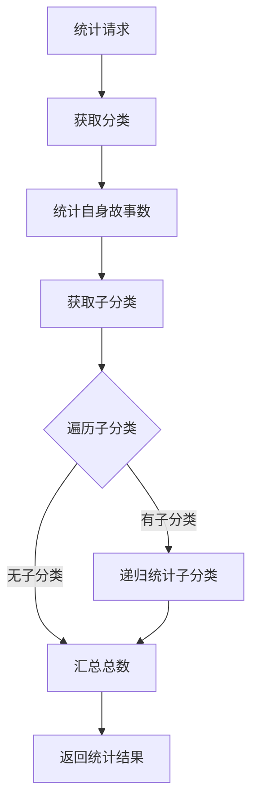
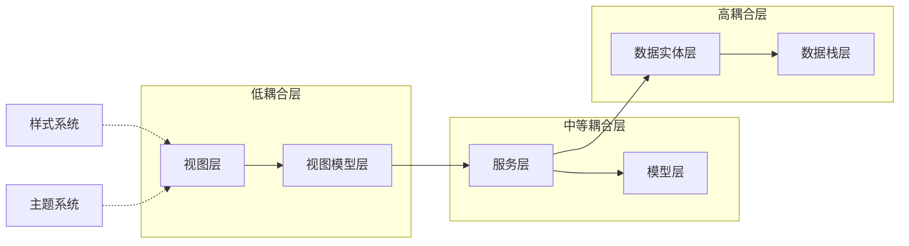
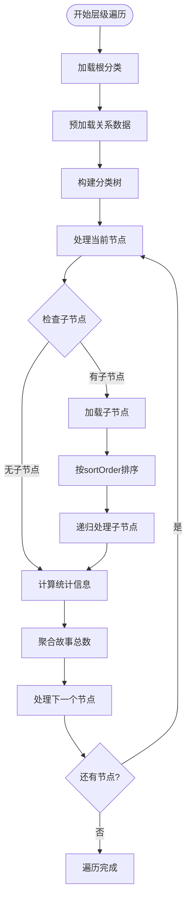

# 分类实体设计

<cite>
**本文档引用的文件**
- [CategoryEntity+CoreDataClass.swift](file://MyStory/Models/Entities/CategoryEntity+CoreDataClass.swift)
- [CategoryEntity+CoreDataProperties.swift](file://MyStory/Models/Entities/CategoryEntity+CoreDataProperties.swift)
- [CategoryService.swift](file://MyStory/Services/CategoryService/CategoryService.swift)
- [CategoryViewModel.swift](file://MyStory/ViewModels/Category/CategoryViewModel.swift)
- [CategoryIconView.swift](file://MyStory/Components/Category/CategoryIconView.swift)
- [CategoryModel.swift](file://MyStory/Models/Category/CategoryModel.swift)
- [CustomIconHelper.swift](file://MyStory/Utils/CustomIconHelper.swift)
- [CoreDataStack.swift](file://MyStory/Core/Storage/CoreDataStack.swift)
- [CategoryView.swift](file://MyStory/Views/Category/CategoryView.swift)
- [CategoryLevelView.swift](file://MyStory/Views/Category/CategoryLevelView.swift)
</cite>

## 目录
1. [简介](#简介)
2. [项目结构](#项目结构)
3. [核心组件](#核心组件)
4. [架构概览](#架构概览)
5. [详细组件分析](#详细组件分析)
6. [依赖关系分析](#依赖关系分析)
7. [性能考虑](#性能考虑)
8. [故障排除指南](#故障排除指南)
9. [结论](#结论)

## 简介

本文档深入解析 MyStory 应用中的三级分类系统设计，基于 CategoryEntity 数据模型进行全面的技术文档化。该系统采用严格的三层分类架构（level 1-3），实现了完整的分类管理功能，包括分类图标系统、颜色管理、父子关系递归设计以及与故事实体的多对多关系映射。

## 项目结构

分类系统的整体架构采用分层设计模式，主要包含以下层次：



**图表来源**
- [CategoryView.swift](file://MyStory/Views/Category/CategoryView.swift#L1-L200)
- [CategoryViewModel.swift](file://MyStory/ViewModels/Category/CategoryViewModel.swift#L1-L103)
- [CategoryService.swift](file://MyStory/Services/CategoryService/CategoryService.swift#L1-L675)

**章节来源**
- [CategoryView.swift](file://MyStory/Views/Category/CategoryView.swift#L1-L200)
- [CategoryViewModel.swift](file://MyStory/ViewModels/Category/CategoryViewModel.swift#L1-L103)
- [CategoryService.swift](file://MyStory/Services/CategoryService/CategoryService.swift#L1-L675)

## 核心组件

### 数据模型设计

CategoryEntity 作为 Core Data 实体，定义了完整的三级分类系统数据结构：

| 字段名 | 类型 | 必填 | 默认值 | 业务含义 |
|--------|------|------|--------|----------|
| id | UUID | 是 | 自动生成 | 分类唯一标识符 |
| name | String | 否 | null | 分类名称（中文） |
| nameEn | String | 否 | null | 分类名称（英文） |
| level | Int16 | 是 | 1 | 分类层级（1-3） |
| sortOrder | Int32 | 是 | 0 | 排序权重 |
| colorHex | String | 否 | null | 颜色十六进制值 |
| iconName | String | 否 | null | 图标名称 |
| iconType | String | 是 | "system" | 图标类型（"system" 或 "custom"） |
| customIconData | Data | 否 | null | 自定义图标二进制数据 |
| createdAt | Date | 是 | 当前时间 | 创建时间戳 |

**章节来源**
- [CategoryEntity+CoreDataProperties.swift](file://MyStory/Models/Entities/CategoryEntity+CoreDataProperties.swift#L21-L33)
- [CoreDataStack.swift](file://MyStory/Core/Storage/CoreDataStack.swift#L236-L265)

### 分类模型结构



**图表来源**
- [CategoryEntity+CoreDataProperties.swift](file://MyStory/Models/Entities/CategoryEntity+CoreDataProperties.swift#L15-L35)
- [CategoryModel.swift](file://MyStory/Models/Category/CategoryModel.swift#L3-L22)

**章节来源**
- [CategoryModel.swift](file://MyStory/Models/Category/CategoryModel.swift#L1-L23)
- [CategoryEntity+CoreDataProperties.swift](file://MyStory/Models/Entities/CategoryEntity+CoreDataProperties.swift#L15-L35)

## 架构概览

### 三级分类系统设计

系统采用严格的三级分类架构，每级都有明确的业务规则和限制：

```mermaid
flowchart TD
Start([开始创建分类]) --> LevelCheck{检查层级}
LevelCheck --> |层级1| Level1Check[检查一级分类数量<br/>限制为10个]
LevelCheck --> |层级2| Level2Check[检查父分类是否为层级1<br/>子分类数量限制20个]
LevelCheck --> |层级3| Level3Check[检查父分类是否为层级2<br/>子分类数量限制30个]
Level1Check --> ParentCheck1{是否有父分类}
Level2Check --> ParentCheck2{是否有父分类}
Level3Check --> ParentCheck3{是否有父分类}
ParentCheck1 --> |是| InvalidParent1[父分类层级不正确]
ParentCheck1 --> |否| ValidLevel1[创建一级分类]
ParentCheck2 --> |否| InvalidParent2[必须有父分类]
ParentCheck2 --> |是| ValidLevel2[创建二级分类]
ParentCheck3 --> |否| InvalidParent3[必须有父分类]
ParentCheck3 --> |是| ValidLevel3[创建三级分类]
ValidLevel1 --> IconType{图标类型}
ValidLevel2 --> IconType
ValidLevel3 --> IconType
IconType --> |系统图标| SystemIcon[设置iconType="system"]
IconType --> |自定义图标| CustomIcon[设置iconType="custom"<br/>存储customIconData]
SystemIcon --> Save[保存到数据库]
CustomIcon --> Save
InvalidParent1 --> End([结束])
InvalidParent2 --> End
InvalidParent3 --> End
Save --> End
```

**图表来源**
- [CategoryService.swift](file://MyStory/Services/CategoryService/CategoryService.swift#L266-L330)

### 分类图标系统

图标系统支持两种类型：系统图标和自定义图标，通过 iconType 字段区分：



**图表来源**
- [CategoryIconView.swift](file://MyStory/Components/Category/CategoryIconView.swift#L5-L123)
- [CustomIconHelper.swift](file://MyStory/Utils/CustomIconHelper.swift#L6-L162)

**章节来源**
- [CategoryIconView.swift](file://MyStory/Components/Category/CategoryIconView.swift#L1-L145)
- [CustomIconHelper.swift](file://MyStory/Utils/CustomIconHelper.swift#L1-L162)

## 详细组件分析

### 父子分类递归关系

系统实现了完整的父子分类递归关系设计，支持无限层级的嵌套：



**图表来源**
- [CategoryService.swift](file://MyStory/Services/CategoryService/CategoryService.swift#L204-L219)
- [CategoryService.swift](file://MyStory/Services/CategoryService/CategoryService.swift#L556-L585)

### 级联删除策略

系统采用级联删除策略处理分类的层级删除：



**图表来源**
- [CategoryService.swift](file://MyStory/Services/CategoryService/CategoryService.swift#L375-L409)

**章节来源**
- [CategoryService.swift](file://MyStory/Services/CategoryService/CategoryService.swift#L353-L409)
- [CoreDataStack.swift](file://MyStory/Core/Storage/CoreDataStack.swift#L348-L371)

### 多对多关系映射

分类与故事之间建立多对多关系，通过中间表实现灵活的关联：



**图表来源**
- [CoreDataStack.swift](file://MyStory/Core/Storage/CoreDataStack.swift#L330-L346)

**章节来源**
- [CoreDataStack.swift](file://MyStory/Core/Storage/CoreDataStack.swift#L330-L346)

### 分类统计功能

系统提供了完整的分类统计功能，包括故事数量统计和层级遍历：



**图表来源**
- [CategoryService.swift](file://MyStory/Services/CategoryService/CategoryService.swift#L426-L449)

**章节来源**
- [CategoryService.swift](file://MyStory/Services/CategoryService/CategoryService.swift#L411-L449)

## 依赖关系分析

### 组件耦合度分析



**图表来源**
- [CategoryView.swift](file://MyStory/Views/Category/CategoryView.swift#L1-L200)
- [CategoryViewModel.swift](file://MyStory/ViewModels/Category/CategoryViewModel.swift#L1-L103)
- [CategoryService.swift](file://MyStory/Services/CategoryService/CategoryService.swift#L1-L675)

### 错误处理机制

系统建立了完善的错误处理机制，针对不同场景提供明确的错误信息：

| 错误类型 | 触发条件 | 用户提示 |
|----------|----------|----------|
| levelOutOfRange | 分类层级不在1-3范围内 | "分类层级必须在 1-3 范围内" |
| overLimit | 达到分类数量上限 | "该层级或父分类已达到数量上限" |
| hasStories | 分类仍有故事关联 | "该分类或其子分类仍有关联故事，无法删除" |
| notFound | 未找到分类 | "未找到分类" |
| invalidParentLevel | 父分类层级不匹配 | "父分类层级不匹配" |

**章节来源**
- [CategoryService.swift](file://MyStory/Services/CategoryService/CategoryService.swift#L4-L20)

## 性能考虑

### 查询优化策略

系统采用了多项查询优化技术来提升性能：

1. **关系预加载优化**
   - 在获取分类树时预加载 `stories`、`children` 关系
   - 避免 N+1 查询问题，减少数据库访问次数

2. **索引设计建议**
   - 为 `level`、`parent.id`、`sortOrder` 字段建立索引
   - 优化层级查询和排序性能

3. **缓存策略**
   - 使用内存缓存存储常用分类数据
   - 避免重复的 Core Data 查询

### 层级遍历算法



**图表来源**
- [CategoryService.swift](file://MyStory/Services/CategoryService/CategoryService.swift#L204-L219)
- [CategoryService.swift](file://MyStory/Services/CategoryService/CategoryService.swift#L556-L585)

### 内存管理优化

1. **懒加载机制**
   - 分类树采用懒加载方式，只在需要时加载子节点
   - 减少内存占用，提升响应速度

2. **数据类型优化**
   - 使用 `Int16` 存储层级，节省内存空间
   - 使用 `Int32` 存储排序权重，支持大量分类

**章节来源**
- [CategoryService.swift](file://MyStory/Services/CategoryService/CategoryService.swift#L204-L264)

## 故障排除指南

### 常见问题诊断

1. **分类删除失败**
   - 检查是否存在子分类或关联故事
   - 确认级联删除规则是否正确配置

2. **图标显示异常**
   - 验证 `iconType` 字段值是否正确
   - 检查 `customIconData` 是否为空或损坏

3. **分类树加载缓慢**
   - 确认关系预加载是否启用
   - 检查数据库索引是否完整

### 调试技巧

1. **日志监控**
   - 启用详细的日志输出，跟踪分类操作流程
   - 监控数据库查询性能指标

2. **内存分析**
   - 使用 Instruments 分析内存使用情况
   - 检查是否存在内存泄漏

**章节来源**
- [CategoryService.swift](file://MyStory/Services/CategoryService/CategoryService.swift#L415-L424)
- [CategoryService.swift](file://MyStory/Services/CategoryService/CategoryService.swift#L588-L615)

## 结论

MyStory 的三级分类系统设计体现了良好的软件工程实践，通过清晰的分层架构、完善的错误处理机制和性能优化策略，构建了一个功能完整、易于维护的分类管理系统。系统的核心优势包括：

1. **严格的业务规则**：通过层级验证和数量限制确保数据完整性
2. **灵活的扩展性**：支持系统图标和自定义图标，满足不同需求
3. **高效的性能**：通过关系预加载和查询优化提升用户体验
4. **可靠的稳定性**：完善的错误处理和故障恢复机制

该设计为后续的功能扩展和性能优化奠定了坚实的基础，是一个值得借鉴的企业级应用架构案例。