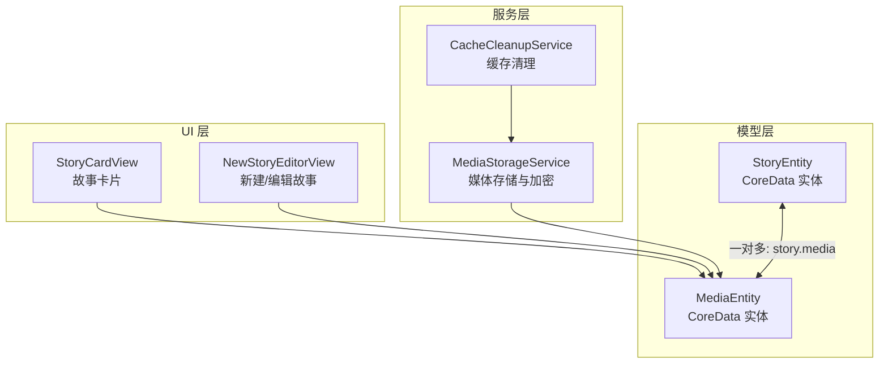
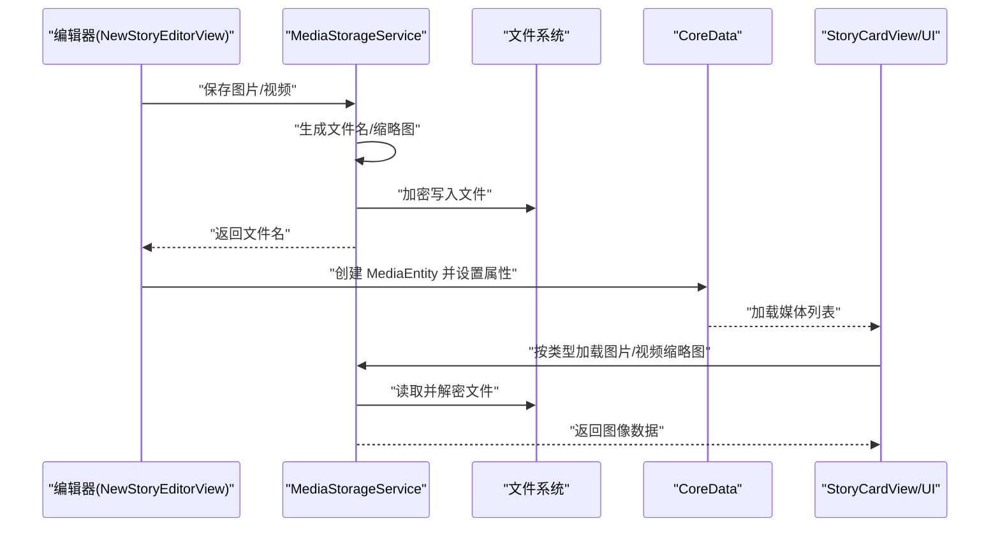
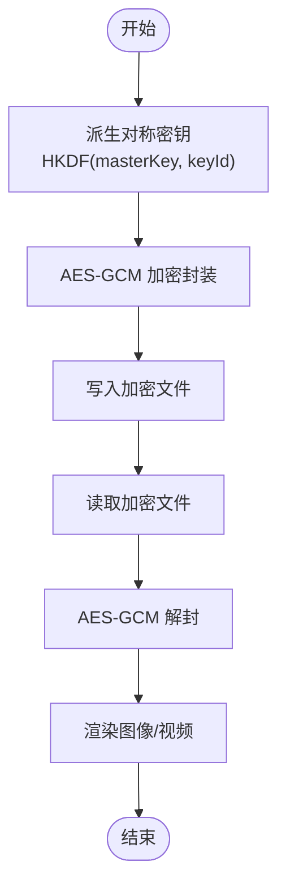
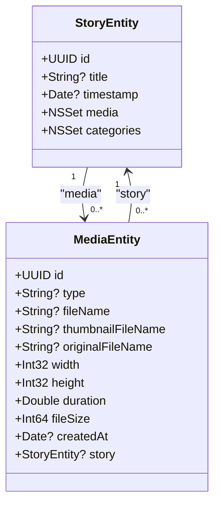
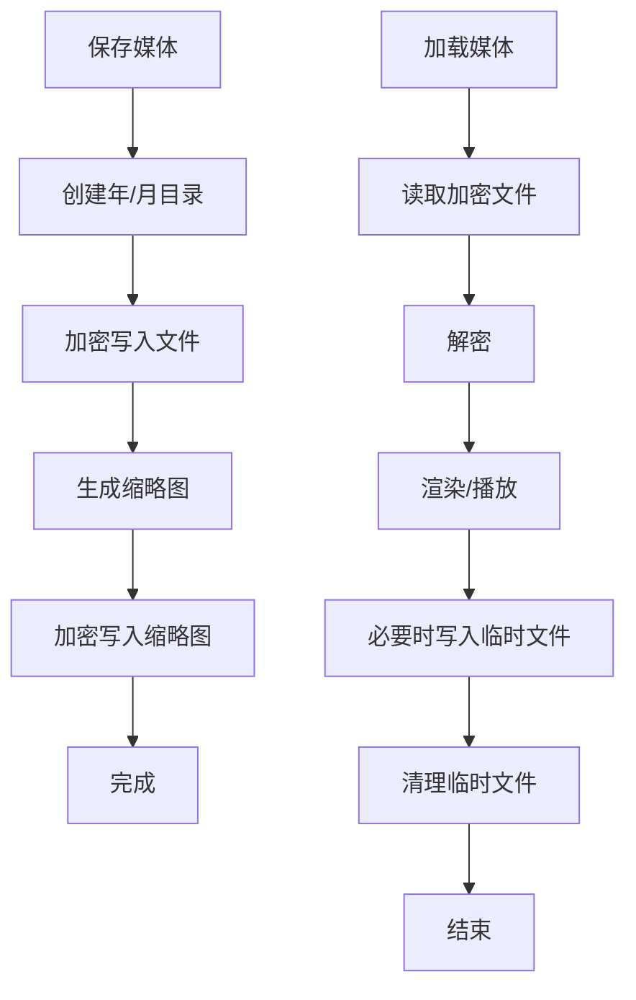
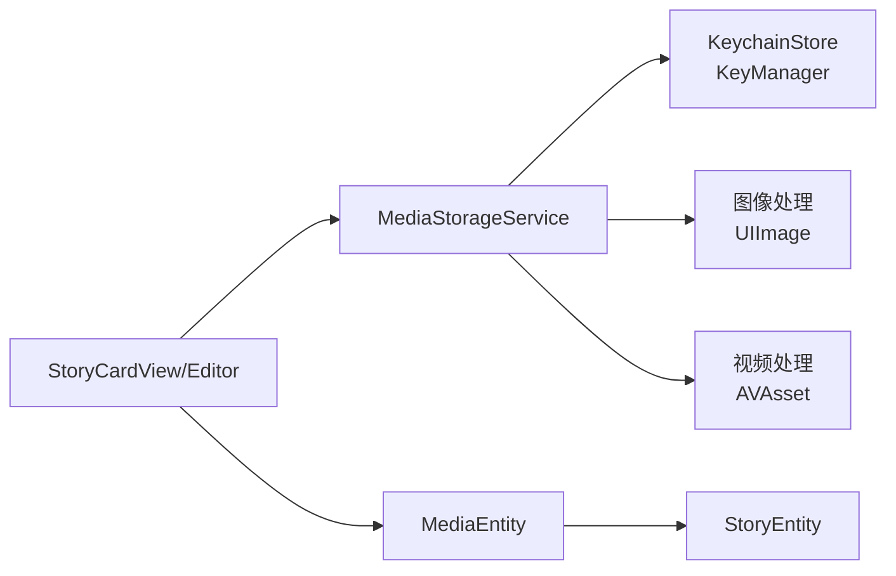

# 媒体实体设计

<cite>
**本文引用的文件**
- [MediaEntity+CoreDataClass.swift](file://MyStory/Models/Entities/MediaEntity+CoreDataClass.swift)
- [MediaEntity+CoreDataProperties.swift](file://MyStory/Models/Entities/MediaEntity+CoreDataProperties.swift)
- [StoryEntity+CoreDataClass.swift](file://MyStory/Models/Entities/StoryEntity+CoreDataClass.swift)
- [StoryEntity+CoreDataProperties.swift](file://MyStory/Models/Entities/StoryEntity+CoreDataProperties.swift)
- [MediaStorageService.swift](file://MyStory/Services/MediaStorageService.swift)
- [CoreDataStack.swift](file://MyStory/Core/Storage/CoreDataStack.swift)
- [CacheCleanupService.swift](file://MyStory/Services/CacheCleanupService.swift)
- [VideoTransferable.swift](file://MyStory/Utils/VideoTransferable.swift)
- [NewStoryEditorView.swift](file://MyStory/Views/Editor/NewStoryEditorView.swift)
- [StoryCardView.swift](file://MyStory/Components/StoryCardView.swift)
</cite>

## 目录
1. [简介](#简介)
2. [项目结构](#项目结构)
3. [核心组件](#核心组件)
4. [架构总览](#架构总览)
5. [详细组件分析](#详细组件分析)
6. [依赖关系分析](#依赖关系分析)
7. [性能考虑](#性能考虑)
8. [故障排查指南](#故障排查指南)
9. [结论](#结论)
10. [附录](#附录)

## 简介
本文围绕 MediaEntity 媒体实体，系统梳理其数据模型设计、命名策略与存储机制、尺寸与时长信息的存储设计、加密与安全机制、与 StoryEntity 的一对多关系映射，以及媒体文件的生命周期管理、存储空间优化与缓存策略，并提供查询性能优化、批量操作处理与数据完整性保障的实践建议。目标是帮助开发者与产品、测试人员全面理解媒体数据在应用内的组织方式与运行机制。

## 项目结构
MediaEntity 所属的模块位于 Models/Entities 下，配合 Core Data 的 CoreDataStack 进行持久化；媒体文件的实际存储由 MediaStorageService 负责，采用分层目录结构与加密存储；UI 层通过 StoryCardView、FullScreenStoryView 与编辑器 NewStoryEditorView 使用 MediaEntity 关联的媒体资源。

图表来源
- [CoreDataStack.swift](file://MyStory/Core/Storage/CoreDataStack.swift#L267-L325)
- [MediaEntity+CoreDataProperties.swift](file://MyStory/Models/Entities/MediaEntity+CoreDataProperties.swift#L15-L34)
- [StoryEntity+CoreDataProperties.swift](file://MyStory/Models/Entities/StoryEntity+CoreDataProperties.swift#L15-L41)
- [MediaStorageService.swift](file://MyStory/Services/MediaStorageService.swift#L1-L348)
- [CacheCleanupService.swift](file://MyStory/Services/CacheCleanupService.swift#L1-L263)
- [StoryCardView.swift](file://MyStory/Components/StoryCardView.swift#L1-L43)
- [NewStoryEditorView.swift](file://MyStory/Views/Editor/NewStoryEditorView.swift#L1028-L1056)

章节来源
- [CoreDataStack.swift](file://MyStory/Core/Storage/CoreDataStack.swift#L267-L325)
- [MediaEntity+CoreDataProperties.swift](file://MyStory/Models/Entities/MediaEntity+CoreDataProperties.swift#L15-L34)
- [StoryEntity+CoreDataProperties.swift](file://MyStory/Models/Entities/StoryEntity+CoreDataProperties.swift#L15-L41)

## 核心组件
- MediaEntity：CoreData 实体，承载媒体文件的元数据与与 Story 的关系。
- StoryEntity：CoreData 实体，承载故事主体信息，并维护与 MediaEntity 的一对多关系。
- MediaStorageService：负责媒体文件的保存、加载、缩略图生成、加密与解密、目录组织与临时文件处理。
- CacheCleanupService：负责清理临时文件与缓存，避免占用存储空间。
- UI 组件：StoryCardView、NewStoryEditorView 等通过 MediaEntity 的元数据驱动展示与交互。

章节来源
- [MediaEntity+CoreDataClass.swift](file://MyStory/Models/Entities/MediaEntity+CoreDataClass.swift#L11-L14)
- [MediaEntity+CoreDataProperties.swift](file://MyStory/Models/Entities/MediaEntity+CoreDataProperties.swift#L15-L34)
- [StoryEntity+CoreDataClass.swift](file://MyStory/Models/Entities/StoryEntity+CoreDataClass.swift#L11-L12)
- [StoryEntity+CoreDataProperties.swift](file://MyStory/Models/Entities/StoryEntity+CoreDataProperties.swift#L15-L41)
- [MediaStorageService.swift](file://MyStory/Services/MediaStorageService.swift#L1-L348)
- [CacheCleanupService.swift](file://MyStory/Services/CacheCleanupService.swift#L1-L263)

## 架构总览
媒体数据在应用内的流转路径如下：
- 编辑器保存图片/视频时，调用 MediaStorageService 生成文件名与缩略图，加密后写入磁盘，同时创建 MediaEntity 并建立与 Story 的关系。
- UI 展示时，根据 MediaEntity 的 type 选择加载原图或缩略图，视频封面通过 thumbnailFileName 获取。
- 存储清理服务定期扫描并清理临时文件，保护用户媒体文件不被误删。

图表来源
- [NewStoryEditorView.swift](file://MyStory/Views/Editor/NewStoryEditorView.swift#L1028-L1056)
- [MediaStorageService.swift](file://MyStory/Services/MediaStorageService.swift#L14-L123)
- [MediaEntity+CoreDataProperties.swift](file://MyStory/Models/Entities/MediaEntity+CoreDataProperties.swift#L21-L32)
- [StoryCardView.swift](file://MyStory/Components/StoryCardView.swift#L193-L203)

## 详细组件分析

### 数据模型与命名策略
- fileName（文件名）
  - 图片：采用 UUID + .heic 后缀，便于去重与唯一性。
  - 视频：采用 UUID + .mov 后缀，便于识别与播放。
  - 原始文件名：originalFileName 字段存在但未在当前流程中使用，建议在导入场景下补充写入以保留来源信息。
- thumbnailFileName（缩略图文件名）
  - 图片缩略图：基于同一 UUID 生成 _thumb.heic，尺寸按最大边不超过 800 的规则压缩。
  - 视频缩略图：基于视频首帧生成 JPEG，命名规则同上，便于快速预览。
- 命名一致性
  - 建议统一使用 UUID 前缀，缩略图以 _thumb 后缀区分，避免混用不同命名策略导致的查找困难。

章节来源
- [MediaStorageService.swift](file://MyStory/Services/MediaStorageService.swift#L14-L47)
- [MediaStorageService.swift](file://MyStory/Services/MediaStorageService.swift#L89-L112)
- [MediaEntity+CoreDataProperties.swift](file://MyStory/Models/Entities/MediaEntity+CoreDataProperties.swift#L24-L29)

### 尺寸与时长信息的存储设计
- width、height：记录媒体的像素尺寸，用于 UI 布局与缩略图渲染。
- fileSize：记录加密后文件的字节数，可用于存储统计与清理策略。
- duration：记录视频时长（秒），用于 UI 展示与排序。
- 原始文件名：originalFileName 字段存在，建议在导入场景补充写入，便于后续迁移与审计。

章节来源
- [MediaEntity+CoreDataProperties.swift](file://MyStory/Models/Entities/MediaEntity+CoreDataProperties.swift#L25-L31)
- [MediaStorageService.swift](file://MyStory/Services/MediaStorageService.swift#L153-L192)

### 加密存储与安全机制
- 加密算法：AES-GCM，提供机密性与完整性保护。
- 密钥派生：基于主密钥与 keyId（通常为文件名或 UUID）通过 HKDF(SHA256) 派生对称密钥，确保相同 keyId 产生一致密钥。
- 主密钥管理：首次运行时随机生成 32 字节主密钥，存储于 Keychain，后续复用；Keychain 权限设置为“解锁后可用”，提升安全性。
- 文件读写：保存时先加密再写入，加载时先解密再渲染；视频加载时会临时写入到临时目录供播放器使用。

图表来源
- [MediaStorageService.swift](file://MyStory/Services/MediaStorageService.swift#L194-L207)
- [MediaStorageService.swift](file://MyStory/Services/MediaStorageService.swift#L226-L271)

章节来源
- [MediaStorageService.swift](file://MyStory/Services/MediaStorageService.swift#L194-L207)
- [MediaStorageService.swift](file://MyStory/Services/MediaStorageService.swift#L226-L271)

### 媒体类型分类与关系映射
- 类型字段 type：支持 "image"、"video"，用于 UI 区分加载逻辑与展示样式。
- 与 StoryEntity 的关系：
  - StoryEntity.media：一对多集合，用于承载故事下的所有媒体。
  - MediaEntity.story：多对一，指向所属故事。
- 删除规则：
  - Story 删除时，其媒体集合级联删除（Cascade Delete）。
  - Media 删除时，对 Story 不产生影响（Nullify Delete）。

图表来源
- [CoreDataStack.swift](file://MyStory/Core/Storage/CoreDataStack.swift#L267-L325)
- [StoryEntity+CoreDataProperties.swift](file://MyStory/Models/Entities/StoryEntity+CoreDataProperties.swift#L15-L41)
- [MediaEntity+CoreDataProperties.swift](file://MyStory/Models/Entities/MediaEntity+CoreDataProperties.swift#L15-L34)

章节来源
- [CoreDataStack.swift](file://MyStory/Core/Storage/CoreDataStack.swift#L267-L325)
- [StoryEntity+CoreDataProperties.swift](file://MyStory/Models/Entities/StoryEntity+CoreDataProperties.swift#L15-L41)
- [MediaEntity+CoreDataProperties.swift](file://MyStory/Models/Entities/MediaEntity+CoreDataProperties.swift#L15-L34)

### 生命周期管理与存储空间优化
- 文件组织：按年/月两级目录存放，便于归档与清理。
- 缩略图策略：图片与视频均生成缩略图，减少首屏渲染压力。
- 临时文件：视频加载时写入临时文件，使用后清理，避免长期占用。
- 缓存清理：CacheCleanupService 识别并清理以 temp 开头、压缩包、缓存等临时文件，排除 Media、SQLite 等关键文件，防止误删。

图表来源
- [MediaStorageService.swift](file://MyStory/Services/MediaStorageService.swift#L125-L141)
- [MediaStorageService.swift](file://MyStory/Services/MediaStorageService.swift#L143-L192)
- [MediaStorageService.swift](file://MyStory/Services/MediaStorageService.swift#L114-L123)
- [CacheCleanupService.swift](file://MyStory/Services/CacheCleanupService.swift#L69-L151)

章节来源
- [MediaStorageService.swift](file://MyStory/Services/MediaStorageService.swift#L125-L141)
- [MediaStorageService.swift](file://MyStory/Services/MediaStorageService.swift#L143-L192)
- [MediaStorageService.swift](file://MyStory/Services/MediaStorageService.swift#L114-L123)
- [CacheCleanupService.swift](file://MyStory/Services/CacheCleanupService.swift#L69-L151)

### 查询性能优化、批量操作与数据完整性
- 查询优化
  - 使用 fetchRequest() 获取 MediaEntity 列表，UI 层按 createdAt 排序，避免全量扫描。
  - 通过 NSSet 集合访问 media，注意在 UI 层转换为数组进行排序与筛选。
- 批量操作
  - CoreData 支持批量插入/更新/删除，建议在编辑器保存时统一提交上下文，减少频繁写入。
  - 批量生成缩略图时，优先处理图片，视频缩略图可异步生成，避免阻塞主线程。
- 数据完整性
  - Cascade Delete 保证故事删除时媒体自动清理，避免悬挂关系。
  - Nullify Delete 保证媒体删除不影响故事，保持数据一致性。
  - Keychain 存储主密钥，避免明文硬编码；文件扩展名与命名策略统一，降低损坏风险。

章节来源
- [MediaEntity+CoreDataProperties.swift](file://MyStory/Models/Entities/MediaEntity+CoreDataProperties.swift#L17-L19)
- [StoryCardView.swift](file://MyStory/Components/StoryCardView.swift#L17-L20)
- [CoreDataStack.swift](file://MyStory/Core/Storage/CoreDataStack.swift#L312-L325)

## 依赖关系分析
- MediaEntity 依赖 CoreDataStack 定义的关系与属性。
- MediaStorageService 依赖 KeychainStore（通过 KeyManager）与系统图像/视频处理框架。
- UI 组件依赖 MediaStorageService 提供的加载接口，依赖 CoreData 提供的媒体集合。

图表来源
- [MediaStorageService.swift](file://MyStory/Services/MediaStorageService.swift#L226-L271)
- [StoryCardView.swift](file://MyStory/Components/StoryCardView.swift#L10-L10)
- [NewStoryEditorView.swift](file://MyStory/Views/Editor/NewStoryEditorView.swift#L1017-L1056)

章节来源
- [MediaStorageService.swift](file://MyStory/Services/MediaStorageService.swift#L226-L271)
- [StoryCardView.swift](file://MyStory/Components/StoryCardView.swift#L10-L10)
- [NewStoryEditorView.swift](file://MyStory/Views/Editor/NewStoryEditorView.swift#L1017-L1056)

## 性能考虑
- 图像方向修正：保存前修正方向，避免加载时重复处理，提高渲染效率。
- 缩略图尺寸控制：最大边 800，兼顾清晰度与内存占用。
- 视频封面生成：使用快速模式与较小 tolerance，提升生成速度。
- 临时文件管理：视频播放前写入临时文件，播放结束后清理，避免长期占用磁盘。
- 缓存清理：定期清理临时文件与压缩包，释放空间，避免碎片化。

章节来源
- [MediaStorageService.swift](file://MyStory/Services/MediaStorageService.swift#L143-L192)
- [MediaStorageService.swift](file://MyStory/Services/MediaStorageService.swift#L114-L123)
- [CacheCleanupService.swift](file://MyStory/Services/CacheCleanupService.swift#L69-L151)

## 故障排查指南
- 加载失败
  - 检查文件是否存在与可读；确认 keyId 与文件名一致；验证解密过程是否抛出异常。
- 缩略图为空
  - 确认 thumbnailFileName 是否正确写入；检查生成逻辑与尺寸参数。
- 视频播放卡顿
  - 检查临时文件是否成功写入；确认解密后数据完整性；评估压缩质量与尺寸。
- 存储空间不足
  - 使用缓存清理服务扫描并清理临时文件；检查媒体目录是否异常增长。

章节来源
- [MediaStorageService.swift](file://MyStory/Services/MediaStorageService.swift#L71-L87)
- [MediaStorageService.swift](file://MyStory/Services/MediaStorageService.swift#L114-L123)
- [CacheCleanupService.swift](file://MyStory/Services/CacheCleanupService.swift#L69-L151)

## 结论
MediaEntity 的设计遵循“元数据 + 关系 + 加密”的原则，结合 MediaStorageService 的分层目录与缩略图策略，实现了高效、安全、可维护的媒体管理方案。通过 CoreData 的关系约束与删除规则，保障了数据一致性；通过缓存清理与临时文件管理，维持了良好的用户体验与系统性能。建议在导入场景补充 originalFileName 写入，并在批量操作中统一提交上下文，进一步提升稳定性与性能。

## 附录
- 文件命名规范建议
  - 图片：UUID.heic；缩略图：UUID_thumb.heic
  - 视频：UUID.mov；缩略图：UUID_thumb.jpg
- 缩略图生成策略
  - 图片：按最大边 800 压缩，HEIC/JPEG 双通道容错
  - 视频：按首帧生成 JPEG，最大边 800，tolerance 1 秒
- 安全与合规
  - 主密钥存储于 Keychain，访问权限为“解锁后可用”
  - 加密算法为 AES-GCM，确保机密性与完整性