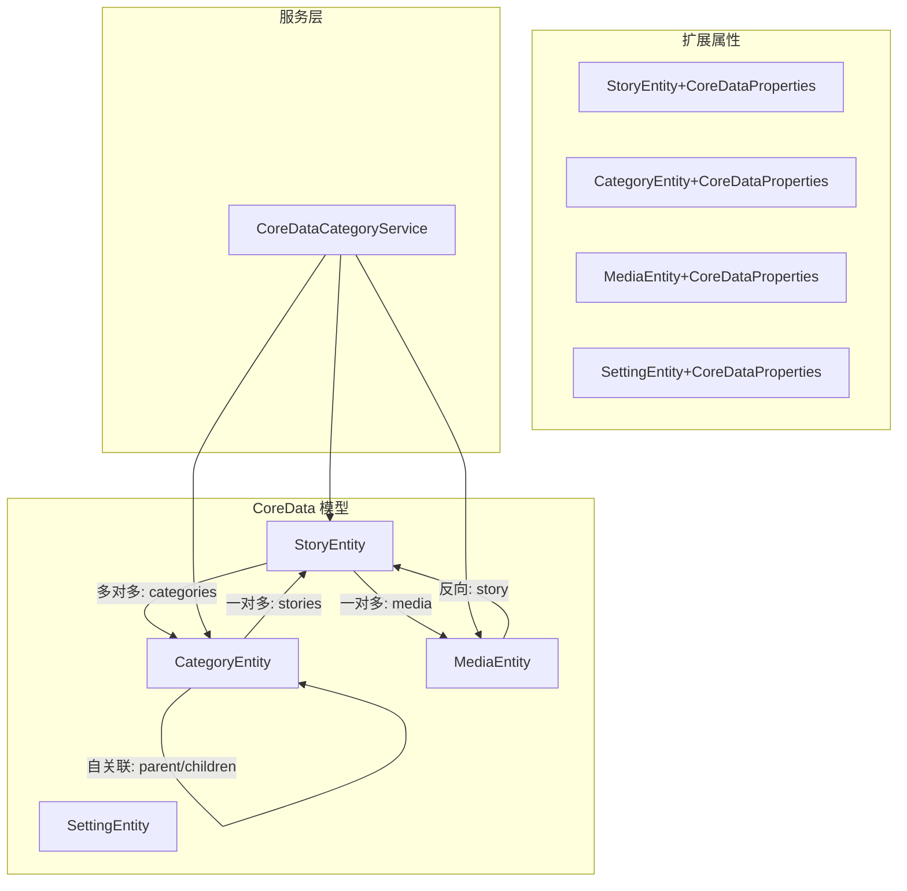
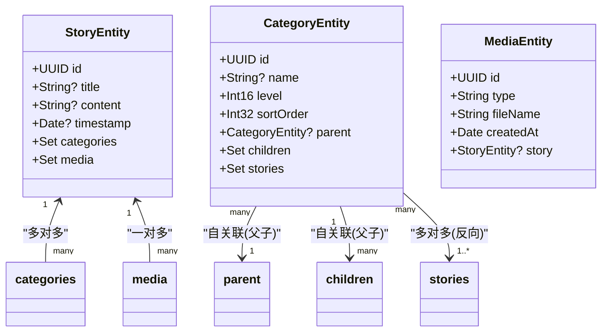
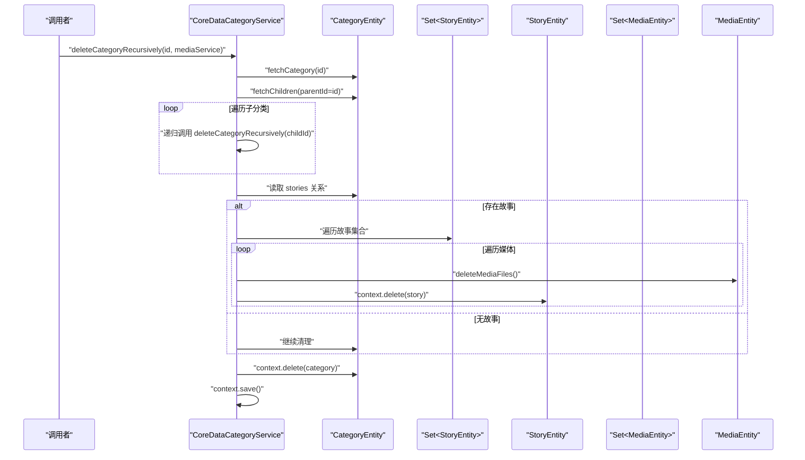
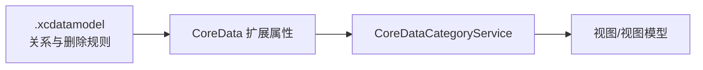

# 实体关系映射

<cite>
**本文档引用的文件**
- [StoryEntity+CoreDataProperties.swift](file://MyStory/Models/Entities/StoryEntity+CoreDataProperties.swift)
- [CategoryEntity+CoreDataProperties.swift](file://MyStory/Models/Entities/CategoryEntity+CoreDataProperties.swift)
- [MediaEntity+CoreDataProperties.swift](file://MyStory/Models/Entities/MediaEntity+CoreDataProperties.swift)
- [SettingEntity+CoreDataProperties.swift](file://MyStory/Models/Entities/SettingEntity+CoreDataProperties.swift)
- [MyStory.xcdatamodel contents](file://MyStory/Resources/MyStory.xcdatamodeld/MyStory.xcdatamodel/contents)
- [CoreDataStack.swift](file://MyStory/Core/Storage/CoreDataStack.swift)
- [CategoryService.swift](file://MyStory/Services/CategoryService/CategoryService.swift)
- [StorageDesign.md](file://StorageDesign.md)
</cite>

## 目录
1. [简介](#简介)
2. [项目结构](#项目结构)
3. [核心组件](#核心组件)
4. [架构总览](#架构总览)
5. [详细组件分析](#详细组件分析)
6. [依赖分析](#依赖分析)
7. [性能考虑](#性能考虑)
8. [故障排查指南](#故障排查指南)
9. [结论](#结论)
10. [附录](#附录)

## 简介
本文件系统化梳理 MyStory 的实体关系映射，聚焦四个核心实体之间的关系设计与行为策略，包括：
- StoryEntity 与 CategoryEntity 的多对多关系
- StoryEntity 与 MediaEntity 的一对多关系
- CategoryEntity 的自关联父子关系

重点覆盖以下方面：
- 删除规则（Cascade、Nullify）与级联策略
- 反向映射与双向关联设计
- 关系查询的性能优化（预加载、批量加载、懒加载）
- 关系完整性约束、外键一致性检查与数据一致性保障
- 复杂关系查询的实现示例与最佳实践

## 项目结构
MyStory 使用 CoreData 作为本地持久化方案，实体关系在 .xcdatamodel 中定义，并通过扩展文件暴露属性与关系访问器；服务层（如 CategoryService）负责业务逻辑与关系维护。

图表来源
- [MyStory.xcdatamodel contents](file://MyStory/Resources/MyStory.xcdatamodeld/MyStory.xcdatamodel/contents#L3-L79)
- [StoryEntity+CoreDataProperties.swift](file://MyStory/Models/Entities/StoryEntity+CoreDataProperties.swift#L15-L76)
- [CategoryEntity+CoreDataProperties.swift](file://MyStory/Models/Entities/CategoryEntity+CoreDataProperties.swift#L15-L74)
- [MediaEntity+CoreDataProperties.swift](file://MyStory/Models/Entities/MediaEntity+CoreDataProperties.swift#L15-L35)
- [CategoryService.swift](file://MyStory/Services/CategoryService/CategoryService.swift#L190-L450)

章节来源
- [MyStory.xcdatamodel contents](file://MyStory/Resources/MyStory.xcdatamodeld/MyStory.xcdatamodel/contents#L1-L79)
- [StoryEntity+CoreDataProperties.swift](file://MyStory/Models/Entities/StoryEntity+CoreDataProperties.swift#L1-L76)
- [CategoryEntity+CoreDataProperties.swift](file://MyStory/Models/Entities/CategoryEntity+CoreDataProperties.swift#L1-L74)
- [MediaEntity+CoreDataProperties.swift](file://MyStory/Models/Entities/MediaEntity+CoreDataProperties.swift#L1-L35)
- [CategoryService.swift](file://MyStory/Services/CategoryService/CategoryService.swift#L1-L675)

## 核心组件
- StoryEntity：承载故事内容、地理位置、时间戳等元数据，维护与 CategoryEntity 的多对多关系以及与 MediaEntity 的一对多关系。
- CategoryEntity：表示分类树，支持三级结构（level=1..3），维护与 StoryEntity 的多对多关系以及自关联父子关系。
- MediaEntity：表示媒体资源（图片/视频），维护与 StoryEntity 的多对一关系。
- SettingEntity：系统设置项，当前与关系映射无直接关联。

章节来源
- [StoryEntity+CoreDataProperties.swift](file://MyStory/Models/Entities/StoryEntity+CoreDataProperties.swift#L15-L76)
- [CategoryEntity+CoreDataProperties.swift](file://MyStory/Models/Entities/CategoryEntity+CoreDataProperties.swift#L15-L74)
- [MediaEntity+CoreDataProperties.swift](file://MyStory/Models/Entities/MediaEntity+CoreDataProperties.swift#L15-L35)
- [SettingEntity+CoreDataProperties.swift](file://MyStory/Models/Entities/SettingEntity+CoreDataProperties.swift#L15-L31)

## 架构总览
CoreData 在 .xcdatamodel 中声明实体与关系，删除规则与反向关系均在此处集中定义；运行时通过扩展文件暴露属性与关系访问器；服务层（如 CoreDataCategoryService）负责查询、更新与删除操作，并通过预加载策略提升关系查询性能。

图表来源
- [MyStory.xcdatamodel contents](file://MyStory/Resources/MyStory.xcdatamodeld/MyStory.xcdatamodel/contents#L3-L79)
- [StoryEntity+CoreDataProperties.swift](file://MyStory/Models/Entities/StoryEntity+CoreDataProperties.swift#L15-L76)
- [CategoryEntity+CoreDataProperties.swift](file://MyStory/Models/Entities/CategoryEntity+CoreDataProperties.swift#L15-L74)
- [MediaEntity+CoreDataProperties.swift](file://MyStory/Models/Entities/MediaEntity+CoreDataProperties.swift#L15-L35)

## 详细组件分析

### 关系设计与删除规则
- StoryEntity 与 CategoryEntity（多对多）
  - 删除规则：双方均为 Nullify。删除一方不会影响另一方，仅解除关联。
  - 反向映射：StoryEntity 的 categories 与 CategoryEntity 的 stories 彼此互为反向。
- StoryEntity 与 MediaEntity（一对多）
  - 删除规则：StoryEntity → MediaEntity 为 Cascade；MediaEntity → StoryEntity 为 Nullify。
  - 反向映射：MediaEntity 的 story 为 to-one，指向 StoryEntity。
- CategoryEntity 自关联（父子）
  - parent → children：Cascade（删除父分类时级联删除子分类）
  - children → parent：Nullify（删除子分类不影响父分类）

章节来源
- [MyStory.xcdatamodel contents](file://MyStory/Resources/MyStory.xcdatamodeld/MyStory.xcdatamodel/contents#L14-L16)
- [MyStory.xcdatamodel contents](file://MyStory/Resources/MyStory.xcdatamodeld/MyStory.xcdatamodel/contents#L35-L35)
- [MyStory.xcdatamodel contents](file://MyStory/Resources/MyStory.xcdatamodeld/MyStory.xcdatamodel/contents#L14-L16)
- [MyStory.xcdatamodel contents](file://MyStory/Resources/MyStory.xcdatamodeld/MyStory.xcdatamodel/contents#L35-L35)
- [MyStory.xcdatamodel contents](file://MyStory/Resources/MyStory.xcdatamodeld/MyStory.xcdatamodel/contents#L14-L16)
- [MyStory.xcdatamodel contents](file://MyStory/Resources/MyStory.xcdatamodeld/MyStory.xcdatamodel/contents#L35-L35)
- [CoreDataStack.swift](file://MyStory/Core/Storage/CoreDataStack.swift#L312-L364)

### 反向映射与双向关联
- StoryEntity.categories ↔ CategoryEntity.stories：多对多，双方均有 NSSet 访问器方法，支持批量增删。
- StoryEntity.media ↔ MediaEntity.story：一对多/一对一，MediaEntity 的 story 为可选 to-one。
- CategoryEntity.parent/children：自关联，children 为 to-many，parent 为 to-one。

章节来源
- [StoryEntity+CoreDataProperties.swift](file://MyStory/Models/Entities/StoryEntity+CoreDataProperties.swift#L44-L75)
- [CategoryEntity+CoreDataProperties.swift](file://MyStory/Models/Entities/CategoryEntity+CoreDataProperties.swift#L37-L69)
- [MediaEntity+CoreDataProperties.swift](file://MyStory/Models/Entities/MediaEntity+CoreDataProperties.swift#L15-L35)

### 关系查询与性能优化
- 预加载策略
  - CoreDataCategoryService 在关键查询中使用 relationshipKeyPathsForPrefetching 预加载 stories、children 及其嵌套关系，避免后续访问触发 lazy loading 与额外查询。
  - 示例场景：树形查询、子分类查询、搜索三级分类下的故事。
- 批量加载
  - 通过 NSSet 访问器批量添加/移除关系对象，减少多次 save 的开销。
- 懒加载机制
  - 关系默认懒加载；当需要访问关系集合时，CoreData 会按需从存储加载，可能引发 N+1 查询问题。应结合预加载策略使用。
- 查询路径与异常处理
  - 对 isFault 检查、对象有效性校验、循环引用防护与层级上限控制，确保在复杂树结构下的稳定性。

章节来源
- [CategoryService.swift](file://MyStory/Services/CategoryService/CategoryService.swift#L204-L219)
- [CategoryService.swift](file://MyStory/Services/CategoryService/CategoryService.swift#L221-L235)
- [CategoryService.swift](file://MyStory/Services/CategoryService/CategoryService.swift#L250-L264)
- [CategoryService.swift](file://MyStory/Services/CategoryService/CategoryService.swift#L453-L552)
- [StoryEntity+CoreDataProperties.swift](file://MyStory/Models/Entities/StoryEntity+CoreDataProperties.swift#L44-L75)
- [CategoryEntity+CoreDataProperties.swift](file://MyStory/Models/Entities/CategoryEntity+CoreDataProperties.swift#L37-L69)

### 复杂关系查询流程（序列图）
以下序列图展示“递归删除分类及其故事与媒体”的关键调用链，体现关系删除规则与级联策略：

图表来源
- [CategoryService.swift](file://MyStory/Services/CategoryService/CategoryService.swift#L375-L409)
- [MyStory.xcdatamodel contents](file://MyStory/Resources/MyStory.xcdatamodeld/MyStory.xcdatamodel/contents#L14-L16)
- [MyStory.xcdatamodel contents](file://MyStory/Resources/MyStory.xcdatamodeld/MyStory.xcdatamodel/contents#L35-L35)

### 删除规则与级联策略详解
- CategoryEntity.parent → children：Cascade
  - 删除父分类时，子分类被级联删除；删除子分类不影响父分类。
- CategoryEntity.children → parent：Nullify
  - 子分类删除后，其 parent 字段置空，保持父分类存在。
- StoryEntity.categories：Nullify
  - 解除关联时仅移除中间关系，不删除故事。
- StoryEntity.media：Cascade
  - 删除故事时，媒体记录被级联删除；媒体删除不影响故事（通过 Nullify 保持故事存在）。
- MediaEntity.story：Nullify
  - 媒体记录删除后，其 story 字段置空，保持故事存在。

章节来源
- [MyStory.xcdatamodel contents](file://MyStory/Resources/MyStory.xcdatamodeld/MyStory.xcdatamodel/contents#L14-L16)
- [MyStory.xcdatamodel contents](file://MyStory/Resources/MyStory.xcdatamodeld/MyStory.xcdatamodel/contents#L35-L35)
- [CoreDataStack.swift](file://MyStory/Core/Storage/CoreDataStack.swift#L312-L364)

### 关系完整性约束与一致性保障
- 唯一约束
  - StoryEntity、CategoryEntity、MediaEntity、SettingEntity 的唯一约束均基于主键字段（id 或 key），确保实体标识唯一性。
- 外键一致性
  - 通过 CoreData 的关系与删除规则自动维护外键一致性：删除父分类级联删除子分类；删除故事级联删除媒体；解除多对多关系不删除实体。
- 运行时校验
  - 服务层在新增/更新/删除前进行层级合法性、数量上限、是否存在子分类与故事等校验，避免破坏关系完整性。

章节来源
- [MyStory.xcdatamodel contents](file://MyStory/Resources/MyStory.xcdatamodeld/MyStory.xcdatamodel/contents#L17-L21)
- [MyStory.xcdatamodel contents](file://MyStory/Resources/MyStory.xcdatamodeld/MyStory.xcdatamodel/contents#L36-L40)
- [MyStory.xcdatamodel contents](file://MyStory/Resources/MyStory.xcdatamodeld/MyStory.xcdatamodel/contents#L47-L51)
- [CategoryService.swift](file://MyStory/Services/CategoryService/CategoryService.swift#L266-L330)
- [CategoryService.swift](file://MyStory/Services/CategoryService/CategoryService.swift#L353-L373)

### 复杂关系查询实现示例与最佳实践
- 树形结构查询
  - 使用 predicate 限定 level==1 并按 sortOrder 排序；通过 relationshipKeyPathsForPrefetching 预加载 children、stories 及嵌套关系，避免后续访问触发 lazy loading。
- 三级分类搜索
  - 限定 level==3，预加载 stories、parent、parent.parent，再在内存中对故事标题/内容进行模糊匹配，最后按匹配分数排序。
- 递归删除
  - 先递归删除子分类，再删除分类下的所有故事与媒体文件，最后删除分类自身，确保删除规则生效且文件清理到位。

章节来源
- [CategoryService.swift](file://MyStory/Services/CategoryService/CategoryService.swift#L204-L219)
- [CategoryService.swift](file://MyStory/Services/CategoryService/CategoryService.swift#L453-L552)
- [CategoryService.swift](file://MyStory/Services/CategoryService/CategoryService.swift#L375-L409)

## 依赖分析
- 实体关系定义集中在 .xcdatamodel，删除规则与反向关系在此处统一声明。
- 运行时通过扩展文件暴露属性与关系访问器，供服务层直接使用。
- 服务层（如 CoreDataCategoryService）承担业务规则与性能优化职责，包括预加载策略与异常处理。

图表来源
- [MyStory.xcdatamodel contents](file://MyStory/Resources/MyStory.xcdatamodeld/MyStory.xcdatamodel/contents#L3-L79)
- [CategoryService.swift](file://MyStory/Services/CategoryService/CategoryService.swift#L190-L450)

章节来源
- [MyStory.xcdatamodel contents](file://MyStory/Resources/MyStory.xcdatamodeld/MyStory.xcdatamodel/contents#L1-L79)
- [CategoryService.swift](file://MyStory/Services/CategoryService/CategoryService.swift#L1-L675)

## 性能考虑
- 预加载优先：在需要频繁访问关系的场景（树形、搜索、统计）使用 relationshipKeyPathsForPrefetching，避免 N+1 查询。
- 批量操作：通过 NSSet 访问器批量增删关系，减少 save 次数。
- 懒加载谨慎使用：在复杂树结构中避免逐级访问导致的多次数据库往返。
- 异常与边界：对 isFault、空值、循环引用进行检查，确保查询稳定与性能可控。

## 故障排查指南
- 关系计数异常
  - 症状：分类故事数统计为 0 或不稳定。
  - 排查：确认查询请求是否设置了 relationshipKeyPathsForPrefetching，避免 fault 导致关系集合为空。
- 循环引用与无限递归
  - 症状：构建分类路径或统计总数时卡死或报错。
  - 排查：增加 objectID 去重与层级上限保护，防止自关联导致的循环引用。
- 删除不生效
  - 症状：删除父分类未删除子分类，或删除故事未删除媒体。
  - 排查：核对 .xcdatamodel 中的删除规则与反向关系配置，确保 Cascade/Nullify 正确。
- 大量查询导致卡顿
  - 症状：树形展开或搜索响应慢。
  - 排查：启用预加载、限制查询范围、避免深层嵌套关系的重复访问。

章节来源
- [CategoryService.swift](file://MyStory/Services/CategoryService/CategoryService.swift#L209-L210)
- [CategoryService.swift](file://MyStory/Services/CategoryService/CategoryService.swift#L459-L464)
- [CategoryService.swift](file://MyStory/Services/CategoryService/CategoryService.swift#L588-L615)
- [MyStory.xcdatamodel contents](file://MyStory/Resources/MyStory.xcdatamodeld/MyStory.xcdatamodel/contents#L14-L16)
- [MyStory.xcdatamodel contents](file://MyStory/Resources/MyStory.xcdatamodeld/MyStory.xcdatamodel/contents#L35-L35)

## 结论
MyStory 的实体关系映射围绕 CoreData 的模型定义与扩展属性展开，通过明确的删除规则与反向关系，实现了稳定的多对多、一对多与自关联设计。服务层通过预加载与批量操作策略显著提升了复杂关系查询的性能与可靠性，同时在业务层面提供了层级校验、数量上限与一致性保障，满足实际使用场景的需求。

## 附录
- 删除规则速览
  - CategoryEntity.parent → children：Cascade
  - CategoryEntity.children → parent：Nullify
  - StoryEntity.categories：Nullify
  - StoryEntity.media：Cascade
  - MediaEntity.story：Nullify
- 关系访问器
  - StoryEntity：addToCategories/removeFromCategories、addToMedia/removeFromMedia
  - CategoryEntity：addToStories/removeFromStories、addToChildren/removeFromChildren
- 设计文档参考
  - [StorageDesign.md](file://StorageDesign.md#L61-L156)