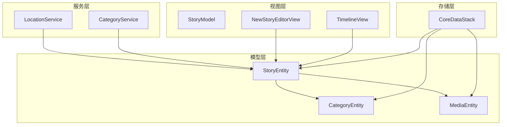
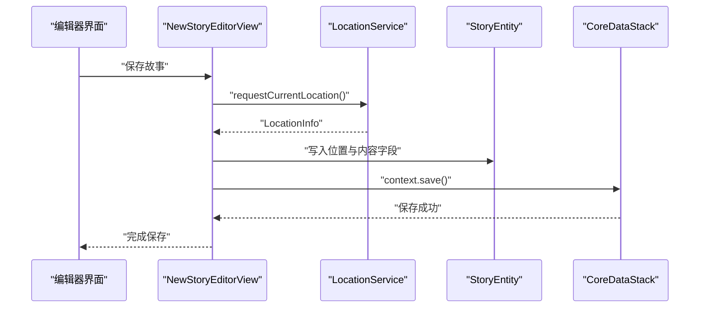
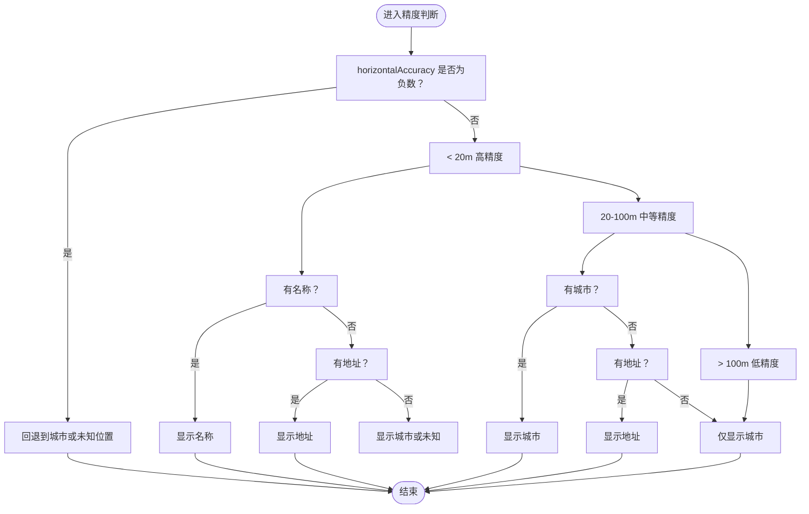
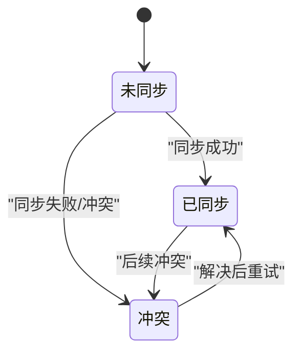
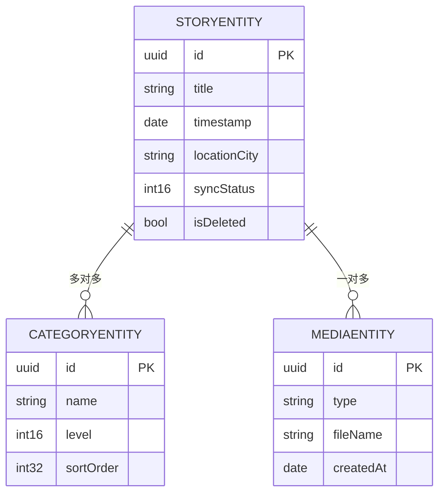
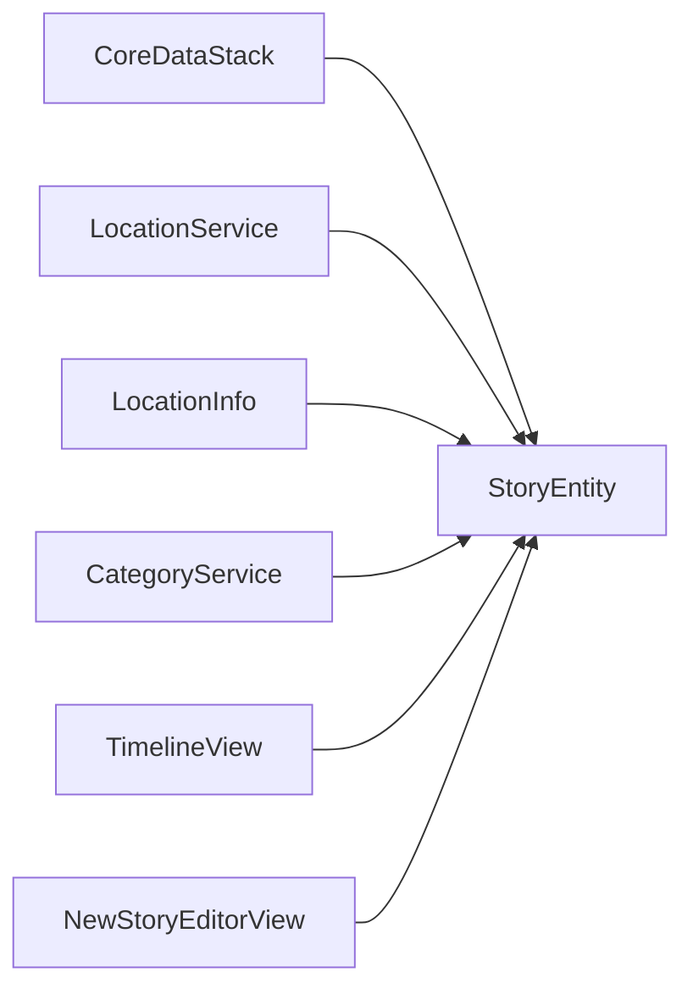

# 故事实体设计

<cite>
**本文引用的文件**
- [StoryEntity+CoreDataClass.swift](file://MyStory/Models/Entities/StoryEntity+CoreDataClass.swift)
- [StoryEntity+CoreDataProperties.swift](file://MyStory/Models/Entities/StoryEntity+CoreDataProperties.swift)
- [CoreDataStack.swift](file://MyStory/Core/Storage/CoreDataStack.swift)
- [LocationService.swift](file://MyStory/Services/LocationService.swift)
- [LocationInfo.swift](file://MyStory/Models/ViewModels/LocationInfo.swift)
- [CategoryEntity+CoreDataClass.swift](file://MyStory/Models/Entities/CategoryEntity+CoreDataClass.swift)
- [MediaEntity+CoreDataClass.swift](file://MyStory/Models/Entities/MediaEntity+CoreDataClass.swift)
- [StoryModel.swift](file://MyStory/Models/ViewModels/StoryModel.swift)
- [StorageDesign.md](file://StorageDesign.md)
- [NewStoryEditorView.swift](file://MyStory/Views/Editor/NewStoryEditorView.swift)
- [CategoryService.swift](file://MyStory/Services/CategoryService/CategoryService.swift)
- [TimelineView.swift](file://MyStory/Views/Timeline/TimelineView.swift)
- [SearchResultModel.swift](file://MyStory/Models/ViewModels/SearchResultModel.swift)
</cite>

## 目录
1. [简介](#简介)
2. [项目结构](#项目结构)
3. [核心组件](#核心组件)
4. [架构概览](#架构概览)
5. [详细组件分析](#详细组件分析)
6. [依赖分析](#依赖分析)
7. [性能考虑](#性能考虑)
8. [故障排查指南](#故障排查指南)
9. [结论](#结论)
10. [附录](#附录)

## 简介
本文件围绕 StoryEntity（故事实体）进行系统性数据模型设计说明，涵盖字段定义、数据类型与默认值、字段验证与约束、地理位置字段的设计与精度处理、状态管理字段的业务含义、与 CategoryEntity 的多对多关系映射以及与 MediaEntity 的一对多关系。同时提供查询优化策略与索引设计建议，帮助开发者在保证功能正确性的前提下提升性能与可维护性。

## 项目结构
StoryEntity 所在模块位于应用的“模型-存储-服务-视图”层次中，核心文件分布如下：
- 实体与CoreData属性：StoryEntity+CoreDataClass.swift、StoryEntity+CoreDataProperties.swift
- 数据模型定义与关系：CoreDataStack.swift
- 位置服务与位置信息模型：LocationService.swift、LocationInfo.swift
- 关联实体：CategoryEntity+CoreDataClass.swift、MediaEntity+CoreDataClass.swift
- 视图模型与UI展示：StoryModel.swift、NewStoryEditorView.swift
- 存储与查询设计文档：StorageDesign.md
- 业务查询与过滤：CategoryService.swift、TimelineView.swift、SearchResultModel.swift

图表来源
- [CoreDataStack.swift](file://MyStory/Core/Storage/CoreDataStack.swift#L98-L380)
- [StoryEntity+CoreDataProperties.swift](file://MyStory/Models/Entities/StoryEntity+CoreDataProperties.swift#L15-L76)
- [CategoryEntity+CoreDataClass.swift](file://MyStory/Models/Entities/CategoryEntity+CoreDataClass.swift#L14-L17)
- [MediaEntity+CoreDataClass.swift](file://MyStory/Models/Entities/MediaEntity+CoreDataClass.swift#L11-L14)
- [LocationService.swift](file://MyStory/Services/LocationService.swift#L4-L55)
- [CategoryService.swift](file://MyStory/Services/CategoryService/CategoryService.swift#L469-L498)
- [NewStoryEditorView.swift](file://MyStory/Views/Editor/NewStoryEditorView.swift#L660-L859)
- [TimelineView.swift](file://MyStory/Views/Timeline/TimelineView.swift#L130-L175)

章节来源
- [CoreDataStack.swift](file://MyStory/Core/Storage/CoreDataStack.swift#L98-L380)
- [StoryEntity+CoreDataProperties.swift](file://MyStory/Models/Entities/StoryEntity+CoreDataProperties.swift#L15-L76)

## 核心组件
- StoryEntity：承载故事的持久化数据，包含内容、标题、时间戳、位置信息、同步状态与软删除标记，以及与 CategoryEntity 的多对多关系和与 MediaEntity 的一对多关系。
- LocationService 与 LocationInfo：负责位置授权、定位请求、逆地理编码与位置信息模型的构建与展示逻辑。
- CategoryService：提供分类维度的故事检索与匹配，涉及 StoryEntity 的过滤与排序。
- StoryModel：UI 展示层的业务模型，用于 Timeline、全屏故事页等界面渲染。

章节来源
- [StoryEntity+CoreDataClass.swift](file://MyStory/Models/Entities/StoryEntity+CoreDataClass.swift#L11-L51)
- [StoryEntity+CoreDataProperties.swift](file://MyStory/Models/Entities/StoryEntity+CoreDataProperties.swift#L15-L76)
- [LocationService.swift](file://MyStory/Services/LocationService.swift#L4-L55)
- [LocationInfo.swift](file://MyStory/Models/ViewModels/LocationInfo.swift#L10-L76)
- [CategoryService.swift](file://MyStory/Services/CategoryService/CategoryService.swift#L469-L498)
- [StoryModel.swift](file://MyStory/Models/ViewModels/StoryModel.swift#L10-L29)

## 架构概览
StoryEntity 的数据流从 UI 编辑器触发，经由 LocationService 获取位置信息，写入 StoryEntity 的位置字段；随后通过 CoreDataStack 持久化；在查询阶段，Timeline 与分类服务通过 NSPredicate 对 StoryEntity 进行过滤与排序，最终以 StoryModel 渲染到界面。

图表来源
- [NewStoryEditorView.swift](file://MyStory/Views/Editor/NewStoryEditorView.swift#L811-L827)
- [LocationService.swift](file://MyStory/Services/LocationService.swift#L14-L21)
- [CoreDataStack.swift](file://MyStory/Core/Storage/CoreDataStack.swift#L86-L91)

## 详细组件分析

### 字段定义与数据类型
- 标识与基础信息
  - id: UUID，非可选，作为主键
  - title: String，非可选，用于展示与索引
  - content: String，可选，支持Markdown
  - plainTextContent: String，可选，用于全文检索
  - timestamp: Date，非可选，用于时间轴排序
  - createdAt/updatedAt: Date，非可选，用于审计与排序
- 位置信息
  - locationName: String，可选，地点名称
  - locationAddress: String，可选，详细地址
  - locationCity: String，可选，城市（建议建立索引）
  - latitude/longitude: Double，可选，用于地图与距离计算
  - horizontalAccuracy/verticalAccuracy: Double，可选，默认值为 -1.0，表示精度未知
- 其他
  - mood: String，可选，预留
  - syncStatus: Int16，非可选，默认值 0，用于同步状态管理
  - isDeleted: Bool，非可选，默认值 false，软删除标记
- 关系
  - categories: Set<CategoryEntity>，多对多
  - media: Set<MediaEntity>，一对多

字段来源与默认值依据
- CoreDataStack 中对 StoryEntity 的属性定义与默认值设置
- StoryEntity+CoreDataProperties 中的 @NSManaged 声明

章节来源
- [CoreDataStack.swift](file://MyStory/Core/Storage/CoreDataStack.swift#L106-L194)
- [StoryEntity+CoreDataProperties.swift](file://MyStory/Models/Entities/StoryEntity+CoreDataProperties.swift#L21-L39)

### 地理位置字段设计与精度处理
- 字段设计
  - latitude/longitude：双精度浮点，满足地图与距离计算精度
  - horizontalAccuracy/verticalAccuracy：双精度浮点，单位米，用于评估定位可信度
  - locationName/locationAddress/locationCity：字符串，支持逆地理编码结果展示
- 精度处理策略
  - 默认值 -1.0 表示精度未知，便于 UI 与业务逻辑区分
  - LocationInfo 提供多种展示策略：
    - 高精度（< 20m）：优先显示地点名称或详细地址
    - 中等精度（20-100m）：显示城市或地址
    - 低精度（> 100m）：仅显示城市
  - secondaryAddressText：当名称与地址均可用且不同，用于副标题展示

图表来源
- [LocationInfo.swift](file://MyStory/Models/ViewModels/LocationInfo.swift#L34-L62)
- [StoryEntity+CoreDataProperties.swift](file://MyStory/Models/Entities/StoryEntity+CoreDataProperties.swift#L23-L30)

章节来源
- [LocationService.swift](file://MyStory/Services/LocationService.swift#L23-L38)
- [LocationInfo.swift](file://MyStory/Models/ViewModels/LocationInfo.swift#L10-L76)
- [StoryEntity+CoreDataProperties.swift](file://MyStory/Models/Entities/StoryEntity+CoreDataProperties.swift#L23-L30)

### 状态管理字段：isDeleted 与 syncStatus
- isDeleted: 布尔型，非可选，默认 false，用于软删除。配合查询过滤可隐藏已删除项，避免物理删除造成数据丢失。
- syncStatus: 整型（Int16），非可选，默认 0，用于云端同步状态：
  - 0：未同步
  - 1：已同步
  - 2：冲突（需人工介入）

图表来源
- [CoreDataStack.swift](file://MyStory/Core/Storage/CoreDataStack.swift#L183-L194)
- [StoryEntity+CoreDataProperties.swift](file://MyStory/Models/Entities/StoryEntity+CoreDataProperties.swift#L33-L34)

章节来源
- [CoreDataStack.swift](file://MyStory/Core/Storage/CoreDataStack.swift#L183-L194)
- [StoryEntity+CoreDataProperties.swift](file://MyStory/Models/Entities/StoryEntity+CoreDataProperties.swift#L25-L34)

### 关系映射：StoryEntity 与 CategoryEntity（多对多）
- 关系定义
  - StoryEntity.categories: Set<CategoryEntity>，多对多
  - CategoryEntity.stories: Set<StoryEntity>，多对多
- 删除规则
  - 解除关联时，不删除实体（Nullify），保证数据完整性
- 查询与过滤
  - 使用 ANY categories.id IN %@ 过滤指定分类及其子分类的故事
  - 时间轴按 timestamp 降序排序

图表来源
- [CoreDataStack.swift](file://MyStory/Core/Storage/CoreDataStack.swift#L330-L347)
- [StorageDesign.md](file://StorageDesign.md#L66-L95)

章节来源
- [CoreDataStack.swift](file://MyStory/Core/Storage/CoreDataStack.swift#L330-L347)
- [StorageDesign.md](file://StorageDesign.md#L66-L95)

### 关系映射：StoryEntity 与 MediaEntity（一对多）
- 关系定义
  - StoryEntity.media: Set<MediaEntity>，一对多
  - MediaEntity.story: StoryEntity，多对一
- 删除规则
  - 删除故事时级联删除媒体（Cascade Delete）
  - 移除媒体时解除关联（Nullify）
- 使用场景
  - 编辑器加载图片/视频与缩略图
  - 全屏故事页展示媒体资源

章节来源
- [CoreDataStack.swift](file://MyStory/Core/Storage/CoreDataStack.swift#L312-L329)
- [NewStoryEditorView.swift](file://MyStory/Views/Editor/NewStoryEditorView.swift#L677-L697)

### 字段验证规则与默认值
- 非可选字段（必须赋值）：id、title、timestamp、createdAt、updatedAt、syncStatus、isDeleted
- 可选字段（允许为空）：content、plainTextContent、locationName、locationAddress、locationCity、latitude、longitude、horizontalAccuracy、verticalAccuracy、mood
- 默认值策略（CoreDataStack 中定义）：
  - horizontalAccuracy/verticalAccuracy：-1.0（未知精度）
  - syncStatus：0（未同步）
  - isDeleted：false（未删除）
  - colorHex（CategoryEntity）：默认颜色值
- 验证建议（业务层补充）：
  - 标题长度与字符集校验
  - 时间戳与创建/更新时间的先后关系
  - 位置精度阈值与 UI 展示联动

章节来源
- [CoreDataStack.swift](file://MyStory/Core/Storage/CoreDataStack.swift#L106-L194)
- [StoryEntity+CoreDataProperties.swift](file://MyStory/Models/Entities/StoryEntity+CoreDataProperties.swift#L21-L39)

### 查询优化策略与索引设计
- 建议索引（StorageDesign.md 提出）：
  - StoryEntity：timestamp（时间排序）、locationCity（位置搜索）、isDeleted（软删除过滤）
  - CategoryEntity：level（层级查询）、sortOrder（排序）
- 查询模式与示例：
  - 分类过滤：ANY categories.id IN %@，结合时间排序
  - 搜索匹配：标题/内容/地点的 CONTAINS 查询，配合权重排序
  - 时间轴：按 timestamp 降序，分页加载
- 性能建议：
  - 使用 NSFetchRequest 的分页与懒加载
  - 对常用过滤字段建立索引
  - 避免 N+1 查询，批量加载 media 与 categories

章节来源
- [StorageDesign.md](file://StorageDesign.md#L292-L304)
- [StorageDesign.md](file://StorageDesign.md#L216-L244)
- [SearchResultModel.swift](file://MyStory/Models/ViewModels/SearchResultModel.swift#L14-L38)
- [CategoryService.swift](file://MyStory/Services/CategoryService/CategoryService.swift#L469-L498)

## 依赖分析
- StoryEntity 依赖 CoreDataStack 的实体描述与关系定义
- LocationService 与 LocationInfo 为 StoryEntity 的位置字段提供输入与展示策略
- CategoryService 与 TimelineView 依赖 StoryEntity 的过滤与排序能力
- NewStoryEditorView 依赖 StoryEntity 的内容与媒体加载逻辑

图表来源
- [CoreDataStack.swift](file://MyStory/Core/Storage/CoreDataStack.swift#L98-L380)
- [LocationService.swift](file://MyStory/Services/LocationService.swift#L4-L55)
- [LocationInfo.swift](file://MyStory/Models/ViewModels/LocationInfo.swift#L10-L76)
- [CategoryService.swift](file://MyStory/Services/CategoryService/CategoryService.swift#L469-L498)
- [TimelineView.swift](file://MyStory/Views/Timeline/TimelineView.swift#L130-L175)
- [NewStoryEditorView.swift](file://MyStory/Views/Editor/NewStoryEditorView.swift#L660-L859)

## 性能考虑
- 索引与查询
  - 为 timestamp、locationCity、isDeleted 建立索引，减少排序与过滤成本
  - 使用 ANY categories.id IN %@ 进行分类过滤，避免跨实体 JOIN
- 数据加载
  - 懒加载 media 与 categories，避免一次性加载大量关联数据
  - 分页加载时间轴与搜索结果
- 位置精度
  - 利用 horizontalAccuracy/verticalAccuracy 控制 UI 展示粒度，减少无效渲染
- 同步状态
  - 通过 syncStatus 与 isDeleted 实现增量同步与软删除，降低全量扫描开销

## 故障排查指南
- 位置信息异常
  - 现象：horizontalAccuracy/verticalAccuracy 为 -1.0
  - 处理：检查 LocationService 的权限与定位结果，确认逆地理编码是否成功
- 分类过滤不生效
  - 现象：CategoryStoryListView 未显示预期故事
  - 处理：确认 categories.id 集合是否正确传递，predicate 格式是否为 ANY categories.id IN %@
- 时间轴排序异常
  - 现象：故事未按时间倒序排列
  - 处理：检查 NSSortDescriptor 的 keyPath 与 ascending 设置
- 媒体资源缺失
  - 现象：编辑器无法加载图片/视频
  - 处理：核对 media.type 与 fileName 字段，确认 MediaStorageService 的加载逻辑

章节来源
- [LocationService.swift](file://MyStory/Services/LocationService.swift#L14-L21)
- [NewStoryEditorView.swift](file://MyStory/Views/Editor/NewStoryEditorView.swift#L677-L697)
- [StorageDesign.md](file://StorageDesign.md#L216-L244)

## 结论
StoryEntity 的数据模型围绕“内容-时间-位置-关系”四个维度设计，通过 CoreData 的强类型与关系映射实现与 CategoryEntity、MediaEntity 的稳定协作。结合合理的默认值、状态管理字段与查询优化策略，可在保证功能完整性的同时提升性能与可维护性。建议在生产环境中为关键字段建立索引，并持续完善业务层的字段验证与错误处理机制。

## 附录
- 字段来源与默认值清单
  - id/title/timestamp/createdAt/updatedAt/syncStatus/isDeleted：CoreDataStack 定义
  - latitude/longitude/horizontalAccuracy/verticalAccuracy：CoreDataStack 定义
  - content/plainTextContent/locationName/locationAddress/locationCity/mood：CoreDataStack 定义
- 关系与删除规则
  - StoryEntity ↔ CategoryEntity：多对多，解除关联时 Nullify
  - StoryEntity ↔ MediaEntity：一对多，删除故事时 Cascade Delete

章节来源
- [CoreDataStack.swift](file://MyStory/Core/Storage/CoreDataStack.swift#L106-L194)
- [CoreDataStack.swift](file://MyStory/Core/Storage/CoreDataStack.swift#L312-L347)