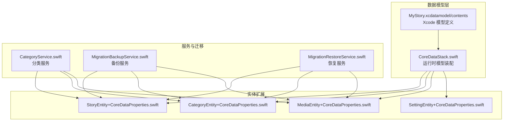
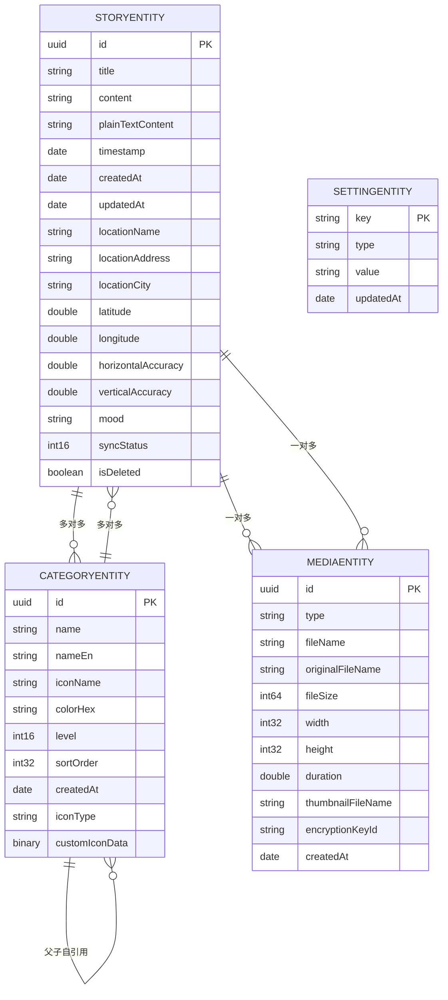
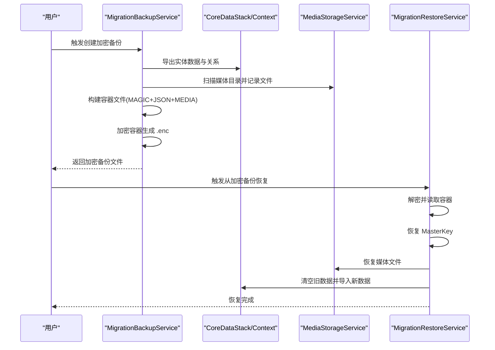
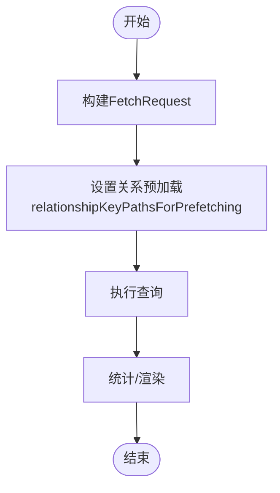
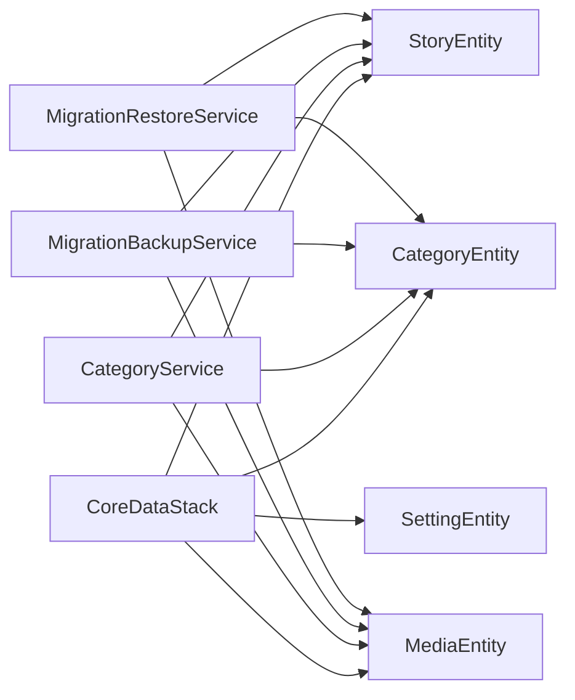

# 数据模型设计

<cite>
**本文引用的文件**
- [MyStory.xcdatamodel/contents](file://MyStory/Resources/MyStory.xcdatamodeld/MyStory.xcdatamodel/contents)
- [CoreDataStack.swift](file://MyStory/Core/Storage/CoreDataStack.swift)
- [StorageDesign.md](file://StorageDesign.md)
- [CategoryService.swift](file://MyStory/Services/CategoryService/CategoryService.swift)
- [MigrationBackupService.swift](file://MyStory/Services/MigrationBackupService.swift)
- [MigrationRestoreService.swift](file://MyStory/Services/MigrationRestoreService.swift)
- [StoryEntity+CoreDataClass.swift](file://MyStory/Models/Entities/StoryEntity+CoreDataClass.swift)
- [StoryEntity+CoreDataProperties.swift](file://MyStory/Models/Entities/StoryEntity+CoreDataProperties.swift)
- [CategoryEntity+CoreDataClass.swift](file://MyStory/Models/Entities/CategoryEntity+CoreDataClass.swift)
- [CategoryEntity+CoreDataProperties.swift](file://MyStory/Models/Entities/CategoryEntity+CoreDataProperties.swift)
- [MediaEntity+CoreDataClass.swift](file://MyStory/Models/Entities/MediaEntity+CoreDataClass.swift)
- [MediaEntity+CoreDataProperties.swift](file://MyStory/Models/Entities/MediaEntity+CoreDataProperties.swift)
- [SettingEntity+CoreDataClass.swift](file://MyStory/Models/Entities/SettingEntity+CoreDataClass.swift)
- [SettingEntity+CoreDataProperties.swift](file://MyStory/Models/Entities/SettingEntity+CoreDataProperties.swift)
</cite>

## 目录
1. [简介](#简介)
2. [项目结构](#项目结构)
3. [核心组件](#核心组件)
4. [架构概览](#架构概览)
5. [详细组件分析](#详细组件分析)
6. [依赖分析](#依赖分析)
7. [性能考量](#性能考量)
8. [故障排查指南](#故障排查指南)
9. [结论](#结论)
10. [附录](#附录)

## 简介
本设计文档围绕 MyStory 的 Core Data 数据模型进行系统化梳理，重点解析 StoryEntity、CategoryEntity、MediaEntity 与 SettingEntity 的字段定义、数据类型、业务含义与关系映射；阐明实体间的外键约束与删除规则；总结数据模型演进策略、版本兼容与迁移方案；并提供实体关系图、数据字典、查询优化与缓存策略、数据完整性约束与索引设计等工程实践要点。

## 项目结构
MyStory 的数据模型由 Xcode Core Data 模型文件与 Swift 扩展共同构成，配合 CoreDataStack 提供运行时模型装配与持久化容器初始化。迁移相关能力通过独立的服务类实现，确保数据与媒体文件的备份与恢复流程可控、可追踪。

图表来源
- [MyStory.xcdatamodel/contents](file://MyStory/Resources/MyStory.xcdatamodeld/MyStory.xcdatamodel/contents#L1-L79)
- [CoreDataStack.swift](file://MyStory/Core/Storage/CoreDataStack.swift#L98-L380)
- [CategoryService.swift](file://MyStory/Services/CategoryService/CategoryService.swift#L22-L42)
- [MigrationBackupService.swift](file://MyStory/Services/MigrationBackupService.swift#L103-L142)
- [MigrationRestoreService.swift](file://MyStory/Services/MigrationRestoreService.swift#L96-L152)

章节来源
- [MyStory.xcdatamodel/contents](file://MyStory/Resources/MyStory.xcdatamodeld/MyStory.xcdatamodel/contents#L1-L79)
- [CoreDataStack.swift](file://MyStory/Core/Storage/CoreDataStack.swift#L1-L382)

## 核心组件
- StoryEntity：故事节点，承载文本内容、时间戳、地理位置、同步状态与软删除标记；与 CategoryEntity 多对多、与 MediaEntity 一对多。
- CategoryEntity：分类体系，支持三级结构（Level 1/2/3），父子自引用关系；与 StoryEntity 多对多。
- MediaEntity：媒体资源，记录类型、尺寸、时长、文件名与加密标识；与 StoryEntity 一对多。
- SettingEntity：应用设置项，键值对形式，唯一键约束保证键的唯一性。

章节来源
- [MyStory.xcdatamodel/contents](file://MyStory/Resources/MyStory.xcdatamodeld/MyStory.xcdatamodel/contents#L3-L78)
- [StoryEntity+CoreDataProperties.swift](file://MyStory/Models/Entities/StoryEntity+CoreDataProperties.swift#L15-L76)
- [CategoryEntity+CoreDataProperties.swift](file://MyStory/Models/Entities/CategoryEntity+CoreDataProperties.swift#L15-L74)
- [MediaEntity+CoreDataProperties.swift](file://MyStory/Models/Entities/MediaEntity+CoreDataProperties.swift#L15-L35)
- [SettingEntity+CoreDataProperties.swift](file://MyStory/Models/Entities/SettingEntity+CoreDataProperties.swift#L15-L31)

## 架构概览
下图展示了四类实体之间的关系与约束，以及删除规则与唯一约束。

图表来源
- [MyStory.xcdatamodel/contents](file://MyStory/Resources/MyStory.xcdatamodeld/MyStory.xcdatamodel/contents#L3-L78)
- [StoryEntity+CoreDataProperties.swift](file://MyStory/Models/Entities/StoryEntity+CoreDataProperties.swift#L21-L39)
- [CategoryEntity+CoreDataProperties.swift](file://MyStory/Models/Entities/CategoryEntity+CoreDataProperties.swift#L21-L33)
- [MediaEntity+CoreDataProperties.swift](file://MyStory/Models/Entities/MediaEntity+CoreDataProperties.swift#L21-L32)
- [SettingEntity+CoreDataProperties.swift](file://MyStory/Models/Entities/SettingEntity+CoreDataProperties.swift#L21-L24)

## 详细组件分析

### StoryEntity（故事实体）
- 字段与类型
  - 标识与时间：id（UUID）、timestamp（Date）、createdAt（Date）、updatedAt（Date）
  - 文本内容：title（String?）、content（String?）、plainTextContent（String?）
  - 地理位置：locationName（String?）、locationAddress（String?）、locationCity（String?）、latitude（Double?）、longitude（Double?）、horizontalAccuracy（Double?）、verticalAccuracy（Double?）
  - 其他：mood（String?）、syncStatus（Int16）、isDeleted（Bool）
- 关系
  - categories：Set<CategoryEntity>，多对多，删除规则 Nullify
  - media：Set<MediaEntity>，一对多，删除规则 Cascade
- 默认值与约束
  - horizontalAccuracy、verticalAccuracy 默认值 -1
  - syncStatus 默认值 0
  - isDeleted 默认值 false
  - 唯一约束：id
- 业务含义
  - 表示时间轴上的一个节点，可携带文本、位置与媒体附件；支持软删除与同步状态管理。

章节来源
- [MyStory.xcdatamodel/contents](file://MyStory/Resources/MyStory.xcdatamodeld/MyStory.xcdatamodel/contents#L53-L78)
- [StoryEntity+CoreDataProperties.swift](file://MyStory/Models/Entities/StoryEntity+CoreDataProperties.swift#L21-L39)
- [StoryEntity+CoreDataClass.swift](file://MyStory/Models/Entities/StoryEntity+CoreDataClass.swift#L14-L28)

### CategoryEntity（分类实体）
- 字段与类型
  - 标识与层级：id（UUID）、level（Int16）、sortOrder（Int32）、createdAt（Date）
  - 名称与展示：name（String）、nameEn（String?）、iconName（String）、colorHex（String?）、iconType（String）、customIconData（Data?）
- 关系
  - parent：CategoryEntity?，父子自引用，删除规则 Nullify
  - children：Set<CategoryEntity>，父子自引用，删除规则 Cascade
  - stories：Set<StoryEntity>，多对多，删除规则 Nullify
- 默认值与约束
  - level 默认值 1
  - sortOrder 默认值 0
  - colorHex 默认值 "#007AFF"
  - iconType 默认值 "system"
  - 唯一约束：id
- 业务含义
  - 三级分类体系（Level 1/2/3），支持父子继承与排序；可配置系统图标或自定义图标。

章节来源
- [MyStory.xcdatamodel/contents](file://MyStory/Resources/MyStory.xcdatamodeld/MyStory.xcdatamodel/contents#L3-L22)
- [CategoryEntity+CoreDataProperties.swift](file://MyStory/Models/Entities/CategoryEntity+CoreDataProperties.swift#L21-L33)

### MediaEntity（媒体实体）
- 字段与类型
  - 标识与元数据：id（UUID）、type（String）、fileName（String）、originalFileName（String?）、thumbnailFileName（String?）、encryptionKeyId（String）
  - 尺寸与时长：width（Int32）、height（Int32）、duration（Double）
  - 文件大小：fileSize（Int64）、createdAt（Date）
- 关系
  - story：StoryEntity?，一对多，删除规则 Nullify
- 默认值与约束
  - width、height、duration 默认值 0
  - fileSize 默认值 0
  - 唯一约束：id
- 业务含义
  - 记录图片/视频资源的元信息与加密标识，支持缩略图与原文件分离存储。

章节来源
- [MyStory.xcdatamodel/contents](file://MyStory/Resources/MyStory.xcdatamodeld/MyStory.xcdatamodel/contents#L23-L41)
- [MediaEntity+CoreDataProperties.swift](file://MyStory/Models/Entities/MediaEntity+CoreDataProperties.swift#L21-L32)

### SettingEntity（设置实体）
- 字段与类型
  - key（String，唯一键）、type（String）、value（String）、updatedAt（Date）
- 约束
  - 唯一约束：key
- 业务含义
  - 键值对形式的应用设置项，便于集中管理与检索。

章节来源
- [MyStory.xcdatamodel/contents](file://MyStory/Resources/MyStory.xcdatamodeld/MyStory.xcdatamodel/contents#L42-L52)
- [SettingEntity+CoreDataProperties.swift](file://MyStory/Models/Entities/SettingEntity+CoreDataProperties.swift#L21-L24)

### 关系映射与删除规则
- StoryEntity ↔ CategoryEntity：多对多（中间表由 Core Data 管理）
  - 删除规则：Nullify（解除关联，不删除实体）
- StoryEntity ↔ MediaEntity：一对多
  - 删除规则：Cascade（删除故事时级联删除媒体）
- CategoryEntity 自引用：parent → children
  - 删除规则：parent→children Cascade；children→parent Nullify
- SettingEntity：单键唯一

章节来源
- [MyStory.xcdatamodel/contents](file://MyStory/Resources/MyStory.xcdatamodeld/MyStory.xcdatamodel/contents#L14-L16)
- [MyStory.xcdatamodel/contents](file://MyStory/Resources/MyStory.xcdatamodeld/MyStory.xcdatamodel/contents#L35)
- [MyStory.xcdatamodel/contents](file://MyStory/Resources/MyStory.xcdatamodeld/MyStory.xcdatamodel/contents#L69-L72)

### 数据模型演进策略、版本兼容与迁移方案
- 版本策略
  - 使用轻量级迁移（Lightweight Migration）以降低模型变更成本
  - 每次模型变更创建新版本，保留历史版本以便回溯
- 迁移前备份
  - 备份数据库与媒体文件，生成加密容器，包含元数据与媒体字节流
- 迁移流程
  - 备份：导出实体数据与媒体元信息，扫描媒体目录，打包为自定义容器并加密
  - 恢复：解密容器，恢复 MasterKey、媒体文件与 Core Data 实体，重建关系
- 运行时模型装配
  - CoreDataStack 在运行时动态构建实体与属性，确保与 Xcode 模型一致

图表来源
- [MigrationBackupService.swift](file://MyStory/Services/MigrationBackupService.swift#L115-L142)
- [MigrationRestoreService.swift](file://MyStory/Services/MigrationRestoreService.swift#L108-L152)
- [CoreDataStack.swift](file://MyStory/Core/Storage/CoreDataStack.swift#L8-L35)

章节来源
- [MigrationBackupService.swift](file://MyStory/Services/MigrationBackupService.swift#L1-L414)
- [MigrationRestoreService.swift](file://MyStory/Services/MigrationRestoreService.swift#L1-L383)
- [CoreDataStack.swift](file://MyStory/Core/Storage/CoreDataStack.swift#L98-L380)

### 数据访问模式与查询优化
- 预加载与 Fault 避免
  - 在分类树与搜索场景中，通过 relationshipKeyPathsForPrefetching 预加载 stories、children 等关系，避免后续访问触发 fault 导致计数或数据为空
- 查询示例
  - 分类树：按 level=1 查询根节点并按 sortOrder 排序
  - 分类故事过滤：使用 ANY categories.id IN %@ 聚合分类与其子分类 ID
- 缓存机制
  - CoreDataStack 使用 viewContext 并开启自动合并变更，减少主线程阻塞
  - 预览模式提供示例数据，便于 UI 开发与调试

图表来源
- [CategoryService.swift](file://MyStory/Services/CategoryService/CategoryService.swift#L209-L210)
- [CategoryService.swift](file://MyStory/Services/CategoryService/CategoryService.swift#L255-L256)
- [CategoryService.swift](file://MyStory/Services/CategoryService/CategoryService.swift#L463-L464)

章节来源
- [CategoryService.swift](file://MyStory/Services/CategoryService/CategoryService.swift#L204-L264)
- [CategoryService.swift](file://MyStory/Services/CategoryService/CategoryService.swift#L453-L552)
- [CoreDataStack.swift](file://MyStory/Core/Storage/CoreDataStack.swift#L37-L84)

### 数据完整性约束与索引设计
- 唯一约束
  - CategoryEntity：id 唯一
  - StoryEntity：id 唯一
  - MediaEntity：id 唯一
  - SettingEntity：key 唯一
- 索引建议（基于查询热点）
  - CategoryEntity：level、sortOrder
  - StoryEntity：timestamp、locationCity、isDeleted
- 删除规则
  - 级联删除：CategoryEntity.children Cascade；StoryEntity.media Cascade
  - 解除关联：CategoryEntity.parent Nullify；StoryEntity.categories Nullify；StoryEntity.media Nullify

章节来源
- [MyStory.xcdatamodel/contents](file://MyStory/Resources/MyStory.xcdatamodeld/MyStory.xcdatamodel/contents#L17-L21)
- [MyStory.xcdatamodel/contents](file://MyStory/Resources/MyStory.xcdatamodeld/MyStory.xcdatamodel/contents#L36-L40)
- [MyStory.xcdatamodel/contents](file://MyStory/Resources/MyStory.xcdatamodeld/MyStory.xcdatamodel/contents#L73-L77)
- [MyStory.xcdatamodel/contents](file://MyStory/Resources/MyStory.xcdatamodeld/MyStory.xcdatamodel/contents#L47-L51)

## 依赖分析
- 实体扩展与 Core Data 运行时
  - 实体扩展文件提供 @NSManaged 属性与关系访问器，配合 CoreDataStack 动态模型装配
- 服务层耦合
  - CategoryService 依赖 NSManagedObjectContext 进行 CRUD 与复杂查询
  - MigrationBackupService/RestoreService 依赖 Core Data 上下文与媒体存储服务，负责跨实体与媒体文件的迁移
- 外部依赖
  - Keychain 用于存储 MasterKey
  - FileManager 用于媒体文件读写与目录操作

图表来源
- [CoreDataStack.swift](file://MyStory/Core/Storage/CoreDataStack.swift#L98-L380)
- [CategoryService.swift](file://MyStory/Services/CategoryService/CategoryService.swift#L190-L200)
- [MigrationBackupService.swift](file://MyStory/Services/MigrationBackupService.swift#L103-L108)
- [MigrationRestoreService.swift](file://MyStory/Services/MigrationRestoreService.swift#L96-L101)

章节来源
- [CoreDataStack.swift](file://MyStory/Core/Storage/CoreDataStack.swift#L1-L382)
- [CategoryService.swift](file://MyStory/Services/CategoryService/CategoryService.swift#L1-L675)
- [MigrationBackupService.swift](file://MyStory/Services/MigrationBackupService.swift#L1-L414)
- [MigrationRestoreService.swift](file://MyStory/Services/MigrationRestoreService.swift#L1-L383)

## 性能考量
- 查询优化
  - 使用 relationshipKeyPathsForPrefetching 预加载常用关系，减少后续访问的 fault 与数据库往返
  - 对热点字段建立索引（level、sortOrder、timestamp、locationCity、isDeleted）
- 存储与 I/O
  - 媒体文件采用异步与分块写入策略，避免大文件导致的内存峰值
  - 备份与恢复采用自定义容器格式，便于顺序读写与进度反馈
- 缓存与上下文
  - viewContext 自动合并变更，减少主线程阻塞；仅在必要时 save

章节来源
- [CategoryService.swift](file://MyStory/Services/CategoryService/CategoryService.swift#L209-L210)
- [CategoryService.swift](file://MyStory/Services/CategoryService/CategoryService.swift#L255-L256)
- [MigrationBackupService.swift](file://MyStory/Services/MigrationBackupService.swift#L388-L408)
- [MigrationRestoreService.swift](file://MyStory/Services/MigrationRestoreService.swift#L248-L279)
- [CoreDataStack.swift](file://MyStory/Core/Storage/CoreDataStack.swift#L32-L34)

## 故障排查指南
- 常见错误与定位
  - 分类层级/数量限制：当 level 不在 1..3、父分类层级不匹配或超过限制时抛出 CategoryError
  - 删除异常：若分类仍有子分类或关联故事，禁止删除
  - 关系异常：搜索与统计时注意处理 fault 对象与循环引用
- 建议排查步骤
  - 检查实体唯一约束是否被破坏（id/key）
  - 核对删除规则是否符合预期（Cascade/Nullify）
  - 确认预加载关系是否覆盖到目标查询路径
  - 备份/恢复失败时检查容器格式与媒体文件偏移

章节来源
- [CategoryService.swift](file://MyStory/Services/CategoryService/CategoryService.swift#L4-L20)
- [CategoryService.swift](file://MyStory/Services/CategoryService/CategoryService.swift#L353-L373)
- [CategoryService.swift](file://MyStory/Services/CategoryService/CategoryService.swift#L587-L615)

## 结论
MyStory 的数据模型以 Core Data 为核心，围绕“故事-分类-媒体”的主干关系组织，辅以设置项与迁移服务保障数据一致性与可演进性。通过合理的删除规则、唯一约束与索引建议，结合预加载与分块 I/O 等优化手段，可在保证用户体验的同时维持良好的性能与可维护性。

## 附录

### 数据字典（字段说明、默认值与验证规则）
- StoryEntity
  - 字段：id、title、content、plainTextContent、timestamp、createdAt、updatedAt、locationName、locationAddress、locationCity、latitude、longitude、horizontalAccuracy、verticalAccuracy、mood、syncStatus、isDeleted
  - 默认值：horizontalAccuracy=-1、verticalAccuracy=-1、syncStatus=0、isDeleted=false
  - 验证：非空字段（如 id、timestamp、createdAt、updatedAt）在模型中声明为非可选
- CategoryEntity
  - 字段：id、name、nameEn、iconName、colorHex、level、sortOrder、createdAt、iconType、customIconData
  - 默认值：level=1、sortOrder=0、colorHex="#007AFF"、iconType="system"
  - 验证：层级与父分类匹配校验、数量限制
- MediaEntity
  - 字段：id、type、fileName、originalFileName、thumbnailFileName、encryptionKeyId、width、height、duration、fileSize、createdAt
  - 默认值：width=0、height=0、duration=0、fileSize=0
- SettingEntity
  - 字段：key（唯一）、type、value、updatedAt
  - 验证：key 唯一

章节来源
- [MyStory.xcdatamodel/contents](file://MyStory/Resources/MyStory.xcdatamodeld/MyStory.xcdatamodel/contents#L3-L78)
- [StoryEntity+CoreDataProperties.swift](file://MyStory/Models/Entities/StoryEntity+CoreDataProperties.swift#L21-L39)
- [CategoryEntity+CoreDataProperties.swift](file://MyStory/Models/Entities/CategoryEntity+CoreDataProperties.swift#L21-L33)
- [MediaEntity+CoreDataProperties.swift](file://MyStory/Models/Entities/MediaEntity+CoreDataProperties.swift#L21-L32)
- [SettingEntity+CoreDataProperties.swift](file://MyStory/Models/Entities/SettingEntity+CoreDataProperties.swift#L21-L24)