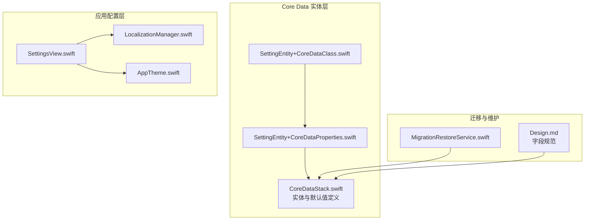
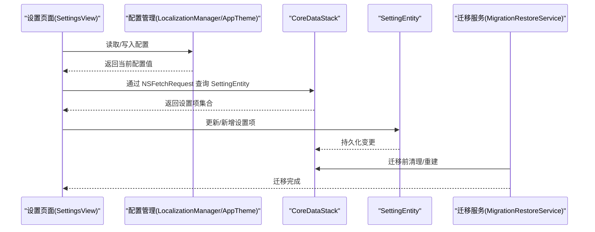
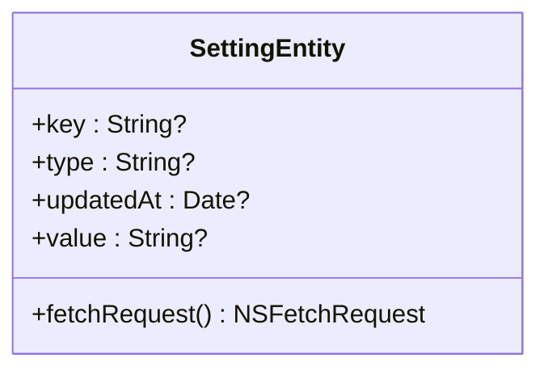
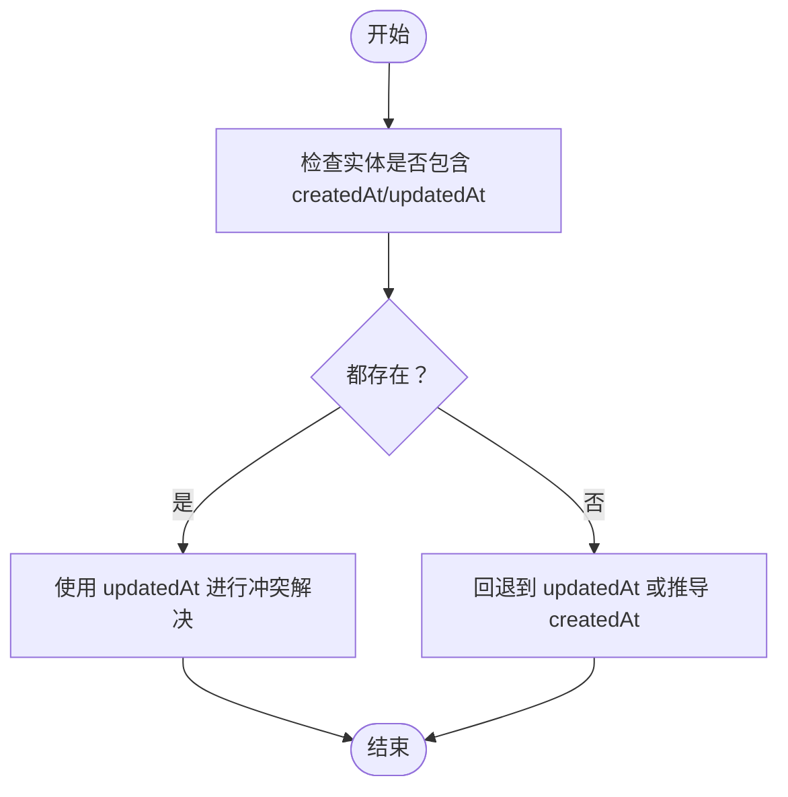
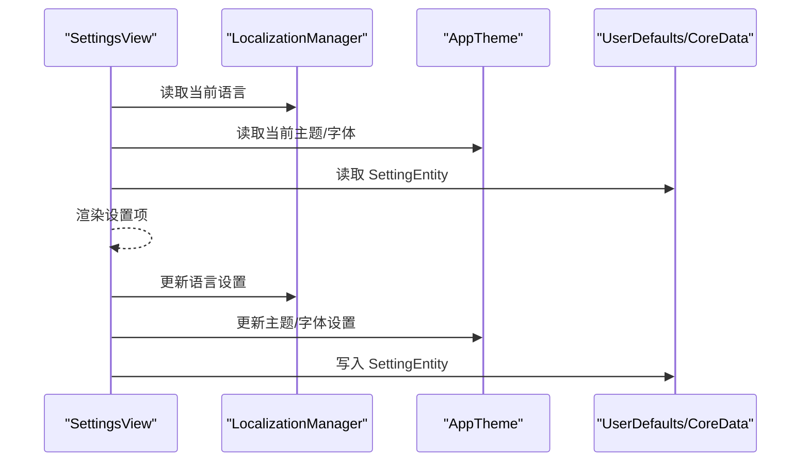
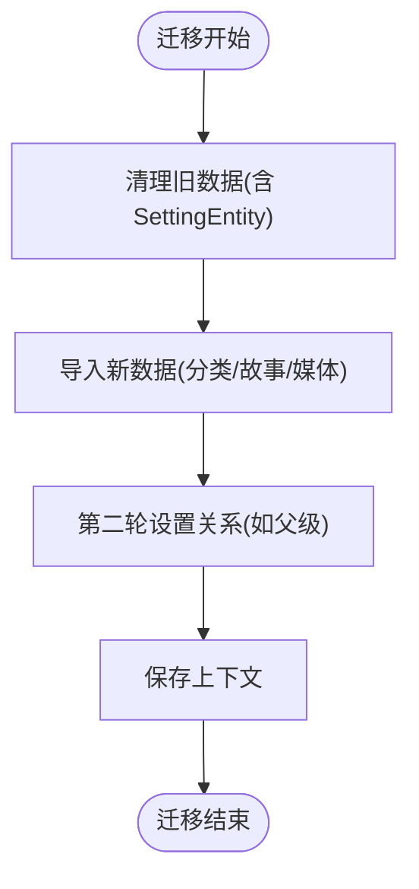
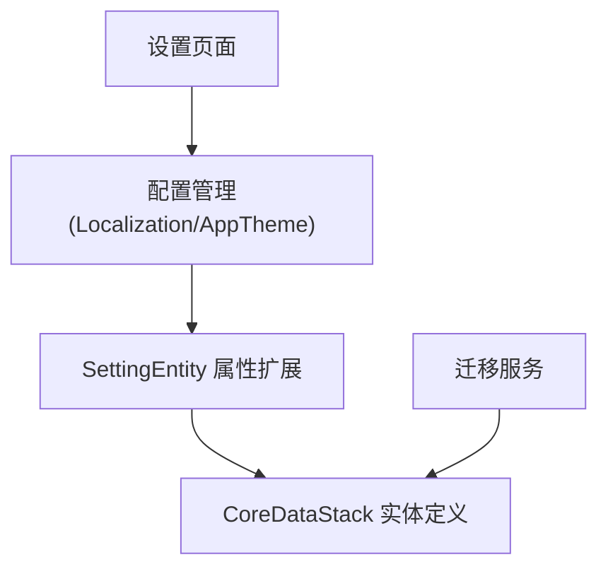

# 设置实体设计

<cite>
**本文引用的文件**
- [SettingEntity+CoreDataClass.swift](file://MyStory/Models/Entities/SettingEntity+CoreDataClass.swift)
- [SettingEntity+CoreDataProperties.swift](file://MyStory/Models/Entities/SettingEntity+CoreDataProperties.swift)
- [CoreDataStack.swift](file://MyStory/Core/Storage/CoreDataStack.swift)
- [Design.md](file://Design.md)
- [SettingsView.swift](file://MyStory/Views/Settings/SettingsView.swift)
- [LocalizationManager.swift](file://MyStory/Utils/LocalizationManager.swift)
- [AppTheme.swift](file://MyStory/Components/Theme/AppTheme.swift)
- [MigrationRestoreService.swift](file://MyStory/Services/MigrationRestoreService.swift)
</cite>

## 目录
1. [简介](#简介)
2. [项目结构](#项目结构)
3. [核心组件](#核心组件)
4. [架构总览](#架构总览)
5. [详细组件分析](#详细组件分析)
6. [依赖分析](#依赖分析)
7. [性能考量](#性能考量)
8. [故障排查指南](#故障排查指南)
9. [结论](#结论)
10. [附录](#附录)

## 简介
本文件围绕 SettingEntity 的数据模型进行系统化设计文档整理，聚焦以下主题：
- 键值对设计：key（设置键）、type（数据类型）、value（设置值）的灵活存储机制
- 时间戳与版本控制：createdAt、updatedAt 的管理策略
- 分类与默认值：如何通过 type 和 value 的组合表达不同类型的设置项
- 应用配置管理：设置实体与应用配置（语言、主题、字体等）的关系
- 动态加载与更新：设置项的查询、批量操作与迁移兼容性
- 验证规则、类型转换与错误恢复：如何保证设置项的正确性与一致性
- 查询优化与迁移：索引、批量查询、迁移兼容性与回滚策略

## 项目结构
SettingEntity 位于 Core Data 实体层，采用“类扩展 + 属性扩展”的分层设计：
- SettingEntity+CoreDataClass.swift：定义实体类本身，作为 NSManagedObject 的子类
- SettingEntity+CoreDataProperties.swift：定义实体属性（key、type、value、updatedAt），并提供 NSFetchRequest 工厂方法
- CoreDataStack.swift：定义实体模型与关系，包含默认值与约束
- 设计文档（Design.md）：给出 Setting 的字段规范与约束
- 设置页面（SettingsView.swift）：展示设置项入口，体现设置项在 UI 中的应用
- 配置管理工具：LocalizationManager、AppTheme 等通过 UserDefaults 或运行时状态管理设置项
- 迁移服务（MigrationRestoreService.swift）：涉及 SettingEntity 的迁移与恢复逻辑

**图表来源**
- [SettingEntity+CoreDataClass.swift](file://MyStory/Models/Entities/SettingEntity+CoreDataClass.swift#L11-L14)
- [SettingEntity+CoreDataProperties.swift](file://MyStory/Models/Entities/SettingEntity+CoreDataProperties.swift#L17-L24)
- [CoreDataStack.swift](file://MyStory/Core/Storage/CoreDataStack.swift#L98-L380)
- [Design.md](file://Design.md#L841-L848)
- [SettingsView.swift](file://MyStory/Views/Settings/SettingsView.swift#L10-L159)
- [LocalizationManager.swift](file://MyStory/Utils/LocalizationManager.swift#L31-L82)
- [AppTheme.swift](file://MyStory/Components/Theme/AppTheme.swift#L69-L90)
- [MigrationRestoreService.swift](file://MyStory/Services/MigrationRestoreService.swift#L294-L381)

**章节来源**
- [SettingEntity+CoreDataClass.swift](file://MyStory/Models/Entities/SettingEntity+CoreDataClass.swift#L11-L14)
- [SettingEntity+CoreDataProperties.swift](file://MyStory/Models/Entities/SettingEntity+CoreDataProperties.swift#L17-L24)
- [CoreDataStack.swift](file://MyStory/Core/Storage/CoreDataStack.swift#L98-L380)
- [Design.md](file://Design.md#L841-L848)
- [SettingsView.swift](file://MyStory/Views/Settings/SettingsView.swift#L10-L159)
- [LocalizationManager.swift](file://MyStory/Utils/LocalizationManager.swift#L31-L82)
- [AppTheme.swift](file://MyStory/Components/Theme/AppTheme.swift#L69-L90)
- [MigrationRestoreService.swift](file://MyStory/Services/MigrationRestoreService.swift#L294-L381)

## 核心组件
- SettingEntity 实体类：承载设置项的持久化对象
- 属性扩展：提供 key、type、value、updatedAt 的托管属性与 fetchRequest 工厂方法
- CoreDataStack 模型：定义实体属性、默认值与约束（如 createdAt、updatedAt 的存在性）
- 设计规范：明确 key、value、type、updatedAt 的约束与用途
- 应用配置：语言、主题、字体等通过 UserDefaults 或运行时状态管理，与 SettingEntity 形成互补
- 迁移服务：在数据迁移过程中对 SettingEntity 的处理与兼容

**章节来源**
- [SettingEntity+CoreDataClass.swift](file://MyStory/Models/Entities/SettingEntity+CoreDataClass.swift#L11-L14)
- [SettingEntity+CoreDataProperties.swift](file://MyStory/Models/Entities/SettingEntity+CoreDataProperties.swift#L17-L24)
- [CoreDataStack.swift](file://MyStory/Core/Storage/CoreDataStack.swift#L98-L380)
- [Design.md](file://Design.md#L841-L848)

## 架构总览
SettingEntity 在系统中的角色是“配置项的持久化载体”。应用配置（语言、主题、字体等）通过 UserDefaults 或运行时状态管理；当需要跨会话持久化或集中管理时，可通过 SettingEntity 存储。迁移阶段，迁移服务负责清理与重建实体。

**图表来源**
- [SettingsView.swift](file://MyStory/Views/Settings/SettingsView.swift#L10-L159)
- [LocalizationManager.swift](file://MyStory/Utils/LocalizationManager.swift#L31-L82)
- [AppTheme.swift](file://MyStory/Components/Theme/AppTheme.swift#L69-L90)
- [CoreDataStack.swift](file://MyStory/Core/Storage/CoreDataStack.swift#L98-L380)
- [MigrationRestoreService.swift](file://MyStory/Services/MigrationRestoreService.swift#L294-L381)

## 详细组件分析

### SettingEntity 数据模型
- 字段与类型
  - key：设置键，作为设置项标识
  - type：值类型，用于区分 string、int、bool、json 等
  - value：设置值，以字符串形式存储（建议为 JSON 字符串）
  - updatedAt：更新时间戳
- 约束与默认值
  - 设计文档要求 key、value、type、updatedAt 为非空
  - CoreDataStack 中未定义 createdAt 字段，但其他实体定义了 createdAt、updatedAt 的存在性约束
- 查询与标识
  - 提供 fetchRequest 工厂方法，便于统一查询
  - 实现 Identifiable 协议，便于 SwiftUI 列表绑定

**图表来源**
- [SettingEntity+CoreDataProperties.swift](file://MyStory/Models/Entities/SettingEntity+CoreDataProperties.swift#L17-L24)

**章节来源**
- [SettingEntity+CoreDataProperties.swift](file://MyStory/Models/Entities/SettingEntity+CoreDataProperties.swift#L17-L24)
- [Design.md](file://Design.md#L841-L848)

### 键值对设计与灵活存储
- key：唯一标识设置项，建议采用命名空间前缀（如 ui.theme、ai.enabled）以避免冲突
- type：声明 value 的真实类型，便于序列化/反序列化与 UI 显示
- value：以字符串存储，推荐使用 JSON 表达复杂结构；简单类型可直接存储基础类型字符串
- 优点
  - 统一存储格式，便于迁移与备份
  - 通过 type 实现强类型转换与校验
- 注意事项
  - 需在应用层实现类型转换与校验
  - 对于大对象，建议使用外部存储（如文件系统）并以字符串保存引用

**章节来源**
- [Design.md](file://Design.md#L841-L848)
- [SettingEntity+CoreDataProperties.swift](file://MyStory/Models/Entities/SettingEntity+CoreDataProperties.swift#L21-L24)

### 时间戳与版本控制
- updatedAt：每次更新设置项时刷新，用于追踪变更
- createdAt：设计文档未见 createdAt 字段，CoreDataStack 中其他实体定义了 createdAt、updatedAt 的存在性约束
- 版本控制策略建议
  - 通过 updatedAt 比较实现“最后写入获胜”合并策略
  - 对于跨设备同步，建议引入版本号字段并在冲突时采用“时间戳+版本号”的复合比较
  - 在迁移阶段，对缺失 createdAt 的实体进行补齐或按 updatedAt 推导

**图表来源**
- [Design.md](file://Design.md#L841-L848)
- [CoreDataStack.swift](file://MyStory/Core/Storage/CoreDataStack.swift#L131-L139)

**章节来源**
- [Design.md](file://Design.md#L841-L848)
- [CoreDataStack.swift](file://MyStory/Core/Storage/CoreDataStack.swift#L131-L139)

### 分类组织与默认值管理
- 分类组织
  - 建议通过 key 的命名空间实现分类（如 ui.theme、ai.model、privacy.policy）
  - 对于复杂结构，value 使用 JSON，并通过 type 标注为 json
- 默认值管理
  - 应用层在首次启动或初始化时写入默认设置项
  - 对于可选设置项，提供合理的默认值以避免空值
  - 对于 UI 相关设置（如字体、主题），优先使用 UserDefaults 或运行时状态，必要时再落盘到 SettingEntity

**章节来源**
- [LocalizationManager.swift](file://MyStory/Utils/LocalizationManager.swift#L31-L82)
- [AppTheme.swift](file://MyStory/Components/Theme/AppTheme.swift#L69-L90)

### 与应用配置管理的关系
- SettingEntity 与 UserDefaults 的分工
  - UserDefaults：轻量、易用、适合短期或用户偏好类配置
  - SettingEntity：适合需要持久化、跨会话、集中管理的配置
- 设置页面与实体的联动
  - SettingsView 作为入口，调用配置管理器（LocalizationManager、AppTheme）读取当前值
  - 当用户修改设置时，配置管理器更新 UserDefaults 或 SettingEntity，并刷新 UI

**图表来源**
- [SettingsView.swift](file://MyStory/Views/Settings/SettingsView.swift#L10-L159)
- [LocalizationManager.swift](file://MyStory/Utils/LocalizationManager.swift#L31-L82)
- [AppTheme.swift](file://MyStory/Components/Theme/AppTheme.swift#L69-L90)

**章节来源**
- [SettingsView.swift](file://MyStory/Views/Settings/SettingsView.swift#L10-L159)
- [LocalizationManager.swift](file://MyStory/Utils/LocalizationManager.swift#L31-L82)
- [AppTheme.swift](file://MyStory/Components/Theme/AppTheme.swift#L69-L90)

### 动态加载与更新策略
- 动态加载
  - 使用 fetchRequest 进行条件查询（如按 key 精确匹配）
  - 对高频读取的设置项建立内存缓存，减少 Core Data 访问
- 更新策略
  - 写入时更新 updatedAt
  - 对批量更新采用批处理写入，减少事务次数
  - 对于跨设备同步，采用“最后写入获胜”或“时间戳+版本号”策略

**章节来源**
- [SettingEntity+CoreDataProperties.swift](file://MyStory/Models/Entities/SettingEntity+CoreDataProperties.swift#L17-L19)
- [Design.md](file://Design.md#L841-L848)

### 验证规则、类型转换与错误恢复
- 验证规则
  - key 必填且唯一
  - type 必须为受支持的枚举（string、int、bool、json）
  - value 需满足 type 的约束（如 int 需为整数字符串）
- 类型转换
  - 应用层根据 type 将 value 解析为对应类型
  - JSON 类型建议使用结构化编码/解码
- 错误恢复
  - 解析失败时回退到默认值
  - 对于损坏的设置项，提供修复或删除选项

**章节来源**
- [Design.md](file://Design.md#L841-L848)

### 查询优化、批量操作与迁移兼容性
- 查询优化
  - 为 key 建立索引，支持高频精确查询
  - 对 updatedAt 建立索引，支持排序与范围查询
- 批量操作
  - 使用批处理写入减少事务开销
  - 对批量删除/更新采用批处理请求
- 迁移兼容性
  - 迁移服务中对 SettingEntity 的处理预留清理与重建逻辑
  - 迁移前后对比 updatedAt，决定是否覆盖或跳过

**图表来源**
- [MigrationRestoreService.swift](file://MyStory/Services/MigrationRestoreService.swift#L294-L381)

**章节来源**
- [MigrationRestoreService.swift](file://MyStory/Services/MigrationRestoreService.swift#L294-L381)

## 依赖分析
SettingEntity 的依赖关系如下：
- 属性扩展依赖 CoreDataStack 中的实体定义与默认值
- 应用配置层通过 UserDefaults 与运行时状态管理设置项
- 迁移服务在数据迁移阶段对 SettingEntity 进行清理与重建

**图表来源**
- [SettingEntity+CoreDataProperties.swift](file://MyStory/Models/Entities/SettingEntity+CoreDataProperties.swift#L17-L24)
- [CoreDataStack.swift](file://MyStory/Core/Storage/CoreDataStack.swift#L98-L380)
- [SettingsView.swift](file://MyStory/Views/Settings/SettingsView.swift#L10-L159)
- [LocalizationManager.swift](file://MyStory/Utils/LocalizationManager.swift#L31-L82)
- [AppTheme.swift](file://MyStory/Components/Theme/AppTheme.swift#L69-L90)
- [MigrationRestoreService.swift](file://MyStory/Services/MigrationRestoreService.swift#L294-L381)

**章节来源**
- [SettingEntity+CoreDataProperties.swift](file://MyStory/Models/Entities/SettingEntity+CoreDataProperties.swift#L17-L24)
- [CoreDataStack.swift](file://MyStory/Core/Storage/CoreDataStack.swift#L98-L380)
- [SettingsView.swift](file://MyStory/Views/Settings/SettingsView.swift#L10-L159)
- [LocalizationManager.swift](file://MyStory/Utils/LocalizationManager.swift#L31-L82)
- [AppTheme.swift](file://MyStory/Components/Theme/AppTheme.swift#L69-L90)
- [MigrationRestoreService.swift](file://MyStory/Services/MigrationRestoreService.swift#L294-L381)

## 性能考量
- 查询性能
  - 为 key、updatedAt 建立索引，避免全表扫描
  - 对高频读取的设置项进行内存缓存
- 写入性能
  - 批量写入减少事务次数
  - 合理拆分设置项，避免单条记录过大
- 迁移性能
  - 迁移阶段尽量减少不必要的实体重建
  - 使用批处理请求与后台队列执行

## 故障排查指南
- 常见问题
  - 设置项为空：检查 key 是否正确、type 与 value 是否匹配
  - 更新未生效：确认 updatedAt 是否更新、UI 是否重新拉取
  - 迁移后丢失：检查迁移服务中 SettingEntity 的清理与重建逻辑
- 排查步骤
  - 核对设计规范与实体定义
  - 检查 fetchRequest 条件与索引
  - 验证类型转换与默认值回退逻辑

**章节来源**
- [Design.md](file://Design.md#L841-L848)
- [SettingEntity+CoreDataProperties.swift](file://MyStory/Models/Entities/SettingEntity+CoreDataProperties.swift#L17-L24)
- [MigrationRestoreService.swift](file://MyStory/Services/MigrationRestoreService.swift#L294-L381)

## 结论
SettingEntity 提供了统一、灵活的设置项存储机制，结合应用配置管理与迁移服务，能够满足跨会话持久化与集中管理的需求。通过合理的键命名空间、类型标注与时间戳管理，可实现可靠的配置读写与版本控制。建议在应用层完善类型转换与错误恢复逻辑，并在迁移阶段确保 SettingEntity 的兼容性与一致性。

## 附录
- 字段清单与约束
  - key：非空，唯一标识
  - type：非空，值类型枚举
  - value：非空，字符串（建议 JSON）
  - updatedAt：非空，更新时间戳
- 建议的命名空间
  - ui.*：界面相关设置
  - ai.*：AI 功能相关设置
  - privacy.*：隐私与安全相关设置
  - data.*：数据与迁移相关设置

**章节来源**
- [Design.md](file://Design.md#L841-L848)