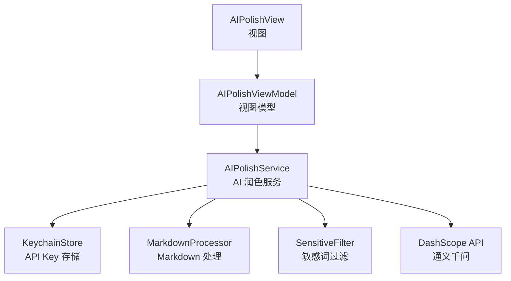
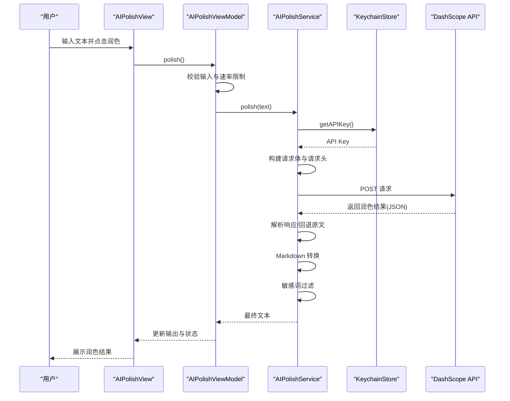
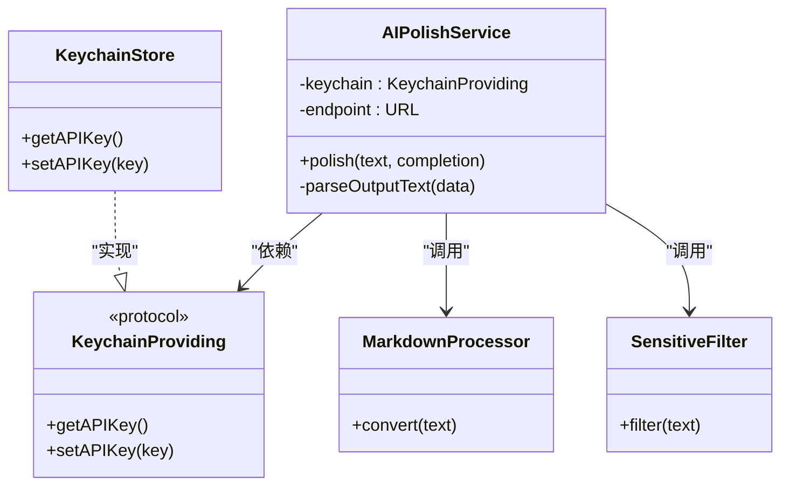
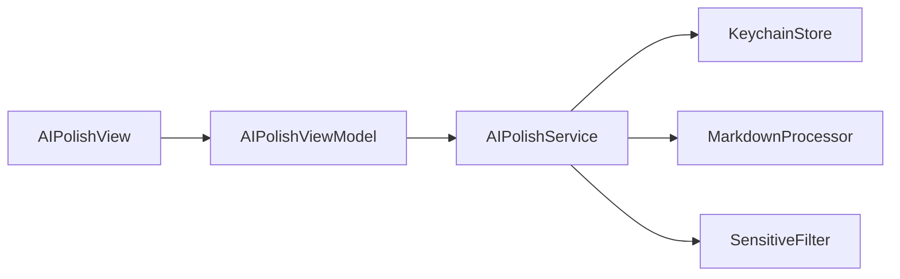
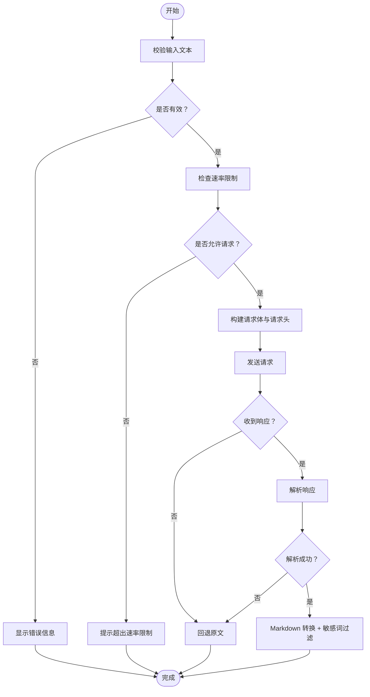

# AI 文本润色服务

<cite>
**本文档引用的文件**
- [AIPolishService.swift](file://MyStory/Services/AIService/AIPolishService.swift)
- [AIPolishViewModel.swift](file://MyStory/ViewModels/Editor/AIPolishViewModel.swift)
- [AIPolishView.swift](file://MyStory/Views/Editor/AIPolishView.swift)
- [SensitiveFilter.swift](file://MyStory/Utils/SensitiveFilter.swift)
- [MarkdownProcessor.swift](file://MyStory/Utils/MarkdownProcessor.swift)
- [KeychainStore.swift](file://MyStory/Core/Storage/KeychainStore.swift)
- [NewStoryEditorView.swift](file://MyStory/Views/Editor/NewStoryEditorView.swift)
- [en.lproj/Localizable.strings](file://MyStory/Resources/Localizable/en.lproj/Localizable.strings)
- [zh-Hans.lproj/Localizable.strings](file://MyStory/Resources/Localizable/zh-Hans.lproj/Localizable.strings)
- [Design.md](file://MyStory/Design.md)
</cite>

## 目录
1. [简介](#简介)
2. [项目结构](#项目结构)
3. [核心组件](#核心组件)
4. [架构总览](#架构总览)
5. [详细组件分析](#详细组件分析)
6. [依赖关系分析](#依赖关系分析)
7. [性能考虑](#性能考虑)
8. [故障排查指南](#故障排查指南)
9. [结论](#结论)
10. [附录](#附录)

## 简介
本文件面向“AI 文本润色服务”的技术实现，聚焦于通义千问（DashScope）API 的集成与使用，涵盖请求构建、响应解析、错误处理、文本润色业务流程、敏感词过滤、Markdown 处理以及速率限制等。文档同时提供接口规范、请求参数格式、响应数据结构、状态码含义及常见问题排查方案，帮助开发者快速理解与扩展该功能。

## 项目结构
AI 文本润色功能位于应用的编辑器模块中，采用 MVVM 架构：
- 视图层：负责用户交互与展示（如润色按钮、输入框、错误提示、渲染后的富文本）
- 视图模型层：管理状态（输入文本、输出 Markdown、加载状态、错误信息），协调服务调用与 UI 更新
- 服务层：封装 DashScope API 调用、请求构建、响应解析、后处理（Markdown 转换、敏感词过滤）
- 工具层：敏感词过滤、Markdown 处理
- 存储层：API Key 的安全存储（Keychain）

图表来源
- [AIPolishView.swift](file://MyStory/Views/Editor/AIPolishView.swift#L1-L47)
- [AIPolishViewModel.swift](file://MyStory/ViewModels/Editor/AIPolishViewModel.swift#L1-L46)
- [AIPolishService.swift](file://MyStory/Services/AIService/AIPolishService.swift#L1-L77)
- [KeychainStore.swift](file://MyStory/Core/Storage/KeychainStore.swift#L1-L40)
- [MarkdownProcessor.swift](file://MyStory/Utils/MarkdownProcessor.swift#L1-L9)
- [SensitiveFilter.swift](file://MyStory/Utils/SensitiveFilter.swift#L1-L18)

章节来源
- [AIPolishView.swift](file://MyStory/Views/Editor/AIPolishView.swift#L1-L47)
- [AIPolishViewModel.swift](file://MyStory/ViewModels/Editor/AIPolishViewModel.swift#L1-L46)
- [AIPolishService.swift](file://MyStory/Services/AIService/AIPolishService.swift#L1-L77)
- [KeychainStore.swift](file://MyStory/Core/Storage/KeychainStore.swift#L1-L40)
- [MarkdownProcessor.swift](file://MyStory/Utils/MarkdownProcessor.swift#L1-L9)
- [SensitiveFilter.swift](file://MyStory/Utils/SensitiveFilter.swift#L1-L18)

## 核心组件
- AIPolishService：封装 DashScope API 调用，负责请求构建、发送、响应解析与后处理
- AIPolishViewModel：管理润色流程的状态与 UI 行为，包含速率限制控制
- AIPolishView：提供润色界面，绑定输入、触发润色、展示结果
- KeychainStore：安全存储与读取 DashScope API Key
- MarkdownProcessor：Markdown 文本处理（当前为直通）
- SensitiveFilter：敏感词过滤

章节来源
- [AIPolishService.swift](file://MyStory/Services/AIService/AIPolishService.swift#L1-L77)
- [AIPolishViewModel.swift](file://MyStory/ViewModels/Editor/AIPolishViewModel.swift#L1-L46)
- [AIPolishView.swift](file://MyStory/Views/Editor/AIPolishView.swift#L1-L47)
- [KeychainStore.swift](file://MyStory/Core/Storage/KeychainStore.swift#L1-L40)
- [MarkdownProcessor.swift](file://MyStory/Utils/MarkdownProcessor.swift#L1-L9)
- [SensitiveFilter.swift](file://MyStory/Utils/SensitiveFilter.swift#L1-L18)

## 架构总览
AI 文本润色的整体流程如下：
- 用户在编辑器界面输入文本并点击“开始润色”
- 视图模型校验输入并触发服务调用
- 服务从 Keychain 获取 API Key，构建 DashScope 请求体
- 通过 URLSession 发送请求，解析响应并进行 Markdown 转换与敏感词过滤
- 返回最终文本给视图模型，UI 展示结果或错误信息

图表来源
- [AIPolishView.swift](file://MyStory/Views/Editor/AIPolishView.swift#L1-L47)
- [AIPolishViewModel.swift](file://MyStory/ViewModels/Editor/AIPolishViewModel.swift#L1-L46)
- [AIPolishService.swift](file://MyStory/Services/AIService/AIPolishService.swift#L1-L77)
- [KeychainStore.swift](file://MyStory/Core/Storage/KeychainStore.swift#L1-L40)

## 详细组件分析

### AIPolishService：DashScope API 集成
- 职责
  - 从 Keychain 获取 API Key
  - 构建 DashScope 请求体（模型、消息、参数）
  - 设置 Authorization 与 Content-Type 请求头
  - 发送请求并解析响应
  - 对响应进行兼容性解析，失败时回退原文
  - 调用 MarkdownProcessor 与 SensitiveFilter 进行后处理
- 关键点
  - 请求端点：DashScope 文本生成服务
  - 模型：qwen-plus
  - 参数：result_format、incremental_output、max_tokens、temperature
  - 超时：30 秒
  - 错误处理：API Key 缺失、空响应、解析失败等
- 响应解析策略
  - 优先尝试解析标准结构
  - 回退到通用字典结构
  - 解析失败则返回原文

图表来源
- [AIPolishService.swift](file://MyStory/Services/AIService/AIPolishService.swift#L1-L77)
- [KeychainStore.swift](file://MyStory/Core/Storage/KeychainStore.swift#L1-L40)
- [MarkdownProcessor.swift](file://MyStory/Utils/MarkdownProcessor.swift#L1-L9)
- [SensitiveFilter.swift](file://MyStory/Utils/SensitiveFilter.swift#L1-L18)

章节来源
- [AIPolishService.swift](file://MyStory/Services/AIService/AIPolishService.swift#L1-L77)

### AIPolishViewModel：润色流程与速率限制
- 职责
  - 维护输入文本、输出 Markdown、加载状态、错误信息
  - 触发润色调用，处理回调并在主线程更新 UI
  - 本地速率限制：每分钟最多 5 次请求
- 关键点
  - 输入校验：去除首尾空白，若为空则提示
  - 速率限制：维护最近 60 秒内的请求时间戳，超过阈值则拒绝
  - 错误处理：将错误信息映射为本地化字符串

章节来源
- [AIPolishViewModel.swift](file://MyStory/ViewModels/Editor/AIPolishViewModel.swift#L1-L46)

### AIPolishView：润色界面
- 职责
  - 提供文本输入框与润色按钮
  - 显示错误信息与润色结果（Markdown 渲染）
- 关键点
  - 本地化文案：润色标题与按钮文本
  - 结果展示：使用 AttributedString 渲染 Markdown

章节来源
- [AIPolishView.swift](file://MyStory/Views/Editor/AIPolishView.swift#L1-L47)
- [en.lproj/Localizable.strings](file://MyStory/Resources/Localizable/en.lproj/Localizable.strings#L145-L148)
- [zh-Hans.lproj/Localizable.strings](file://MyStory/Resources/Localizable/zh-Hans.lproj/Localizable.strings#L145-L148)

### KeychainStore：API Key 安全存储
- 职责
  - 通过 Keychain 读取与写入 DashScope API Key
  - 支持更新与新增两种场景
- 关键点
  - 使用通用密码类条目
  - 服务名与账户名固定，便于跨模块复用

章节来源
- [KeychainStore.swift](file://MyStory/Core/Storage/KeychainStore.swift#L1-L40)

### MarkdownProcessor 与 SensitiveFilter：后处理
- MarkdownProcessor
  - 当前为直通实现，后续可扩展为 Markdown 规则转换
- SensitiveFilter
  - 内置敏感词列表，逐词替换为“***”
  - 可扩展为外部词库或远程更新

章节来源
- [MarkdownProcessor.swift](file://MyStory/Utils/MarkdownProcessor.swift#L1-L9)
- [SensitiveFilter.swift](file://MyStory/Utils/SensitiveFilter.swift#L1-L18)

## 依赖关系分析
- 组件耦合
  - AIPolishViewModel 依赖 AIPolishService
  - AIPolishService 依赖 KeychainStore（通过协议 KeychainProviding）
  - AIPolishService 依赖 MarkdownProcessor 与 SensitiveFilter
  - AIPolishView 依赖 AIPolishViewModel
- 外部依赖
  - URLSession 用于网络请求
  - Keychain Services 用于密钥存储
  - SwiftUI 用于界面渲染

图表来源
- [AIPolishView.swift](file://MyStory/Views/Editor/AIPolishView.swift#L1-L47)
- [AIPolishViewModel.swift](file://MyStory/ViewModels/Editor/AIPolishViewModel.swift#L1-L46)
- [AIPolishService.swift](file://MyStory/Services/AIService/AIPolishService.swift#L1-L77)
- [KeychainStore.swift](file://MyStory/Core/Storage/KeychainStore.swift#L1-L40)
- [MarkdownProcessor.swift](file://MyStory/Utils/MarkdownProcessor.swift#L1-L9)
- [SensitiveFilter.swift](file://MyStory/Utils/SensitiveFilter.swift#L1-L18)

## 性能考虑
- 速率限制
  - 本地每分钟最多 5 次请求，避免频繁调用导致资源浪费与被限流
- 超时与重试
  - 请求超时设为 30 秒；当前未实现自动重试，建议在上层调用处增加指数退避重试
- 解析与回退
  - 响应解析失败时回退原文，保证用户体验连续性
- UI 线程
  - 回调在主线程更新 UI，避免并发问题

章节来源
- [AIPolishViewModel.swift](file://MyStory/ViewModels/Editor/AIPolishViewModel.swift#L1-L46)
- [AIPolishService.swift](file://MyStory/Services/AIService/AIPolishService.swift#L1-L77)

## 故障排查指南
- 未配置 API Key
  - 现象：润色失败，错误提示“未配置通义千问 API Key”
  - 处理：在设置页配置 DashScope API Key
- 空响应
  - 现象：网络请求成功但返回空数据
  - 处理：服务回退原文，检查网络与目标端点
- 响应解析失败
  - 现象：返回 JSON 不符合预期结构
  - 处理：服务回退原文；建议记录日志并上报
- 速率限制
  - 现象：提示“已超出速率限制，请稍后再试”
  - 处理：等待 60 秒或减少请求频率
- 敏感词过滤
  - 现象：文本被替换为“***”
  - 处理：检查敏感词列表或调整过滤策略

章节来源
- [AIPolishService.swift](file://MyStory/Services/AIService/AIPolishService.swift#L30-L77)
- [AIPolishViewModel.swift](file://MyStory/ViewModels/Editor/AIPolishViewModel.swift#L18-L46)

## 结论
本实现以简洁可靠为目标，通过 MVVM 架构与清晰的职责划分，完成了从用户输入到最终输出的完整润色链路。DashScope API 集成采用标准请求格式与健壮的响应解析策略，配合本地速率限制与敏感词过滤，满足基本使用需求。未来可在重试机制、缓存策略、批量处理等方面进一步增强。

## 附录

### API 接口规范
- 服务端点
  - 方法：POST
  - 地址：DashScope 文本生成服务
- 请求头
  - Authorization: Bearer {API_KEY}
  - Content-Type: application/json
- 请求体结构
  - model: qwen-plus
  - input.messages: 数组，元素包含 role 与 content
  - parameters:
    - result_format: message
    - incremental_output: true
    - max_tokens: 2000
    - temperature: 0.7
- 响应数据结构
  - 优先解析：{"output":{"text":"..."}}
  - 兼容解析：{"choices":[{"message":{"content":"..."}}]}
  - 回退：返回原文
- 状态码
  - 401：未配置 API Key
  - -1：空响应
  - -2：解析失败

章节来源
- [AIPolishService.swift](file://MyStory/Services/AIService/AIPolishService.swift#L10-L61)

### 业务流程图

图表来源
- [AIPolishService.swift](file://MyStory/Services/AIService/AIPolishService.swift#L30-L77)
- [AIPolishViewModel.swift](file://MyStory/ViewModels/Editor/AIPolishViewModel.swift#L18-L46)

### 代码示例路径
- 调用润色服务
  - 触发入口：[AIPolishView.swift](file://MyStory/Views/Editor/AIPolishView.swift#L25-L29)
  - 服务实现：[AIPolishService.swift](file://MyStory/Services/AIService/AIPolishService.swift#L30-L61)
  - 视图模型协调：[AIPolishViewModel.swift](file://MyStory/ViewModels/Editor/AIPolishViewModel.swift#L18-L39)
- 敏感词过滤
  - 过滤实现：[SensitiveFilter.swift](file://MyStory/Utils/SensitiveFilter.swift#L10-L16)
- Markdown 处理
  - 处理实现：[MarkdownProcessor.swift](file://MyStory/Utils/MarkdownProcessor.swift#L5-L7)
- API Key 存储
  - Keychain 实现：[KeychainStore.swift](file://MyStory/Core/Storage/KeychainStore.swift#L10-L38)

### 批量处理与上下文保持
- 当前实现
  - 单次请求处理单段文本
  - 未实现上下文保持与批量处理
- 建议
  - 扩展 RequestBody 中 messages 字段，支持多轮对话上下文
  - 批量处理时按模型最大 tokens 限制拆分文本，逐段请求并合并结果

章节来源
- [AIPolishService.swift](file://MyStory/Services/AIService/AIPolishService.swift#L16-L28)
- [Design.md](file://MyStory/Design.md#L219-L270)