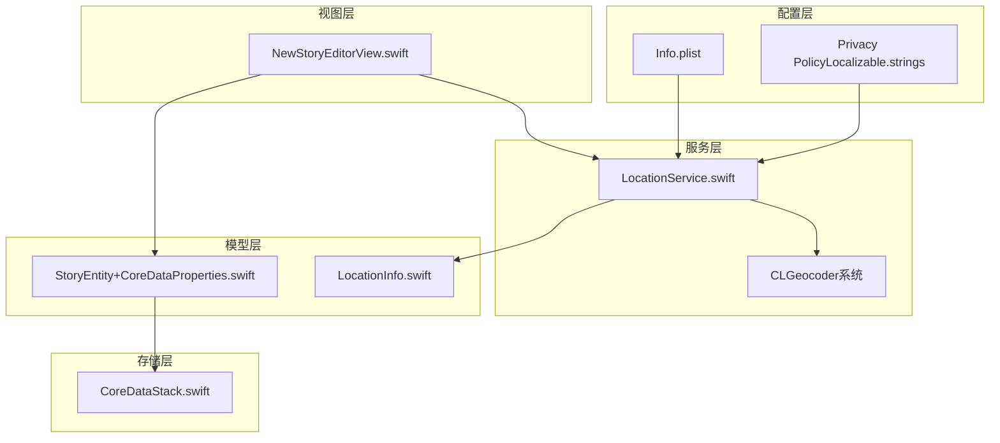
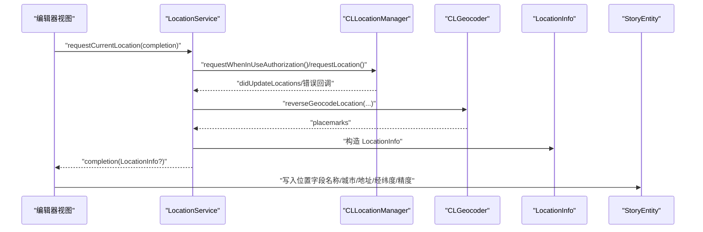
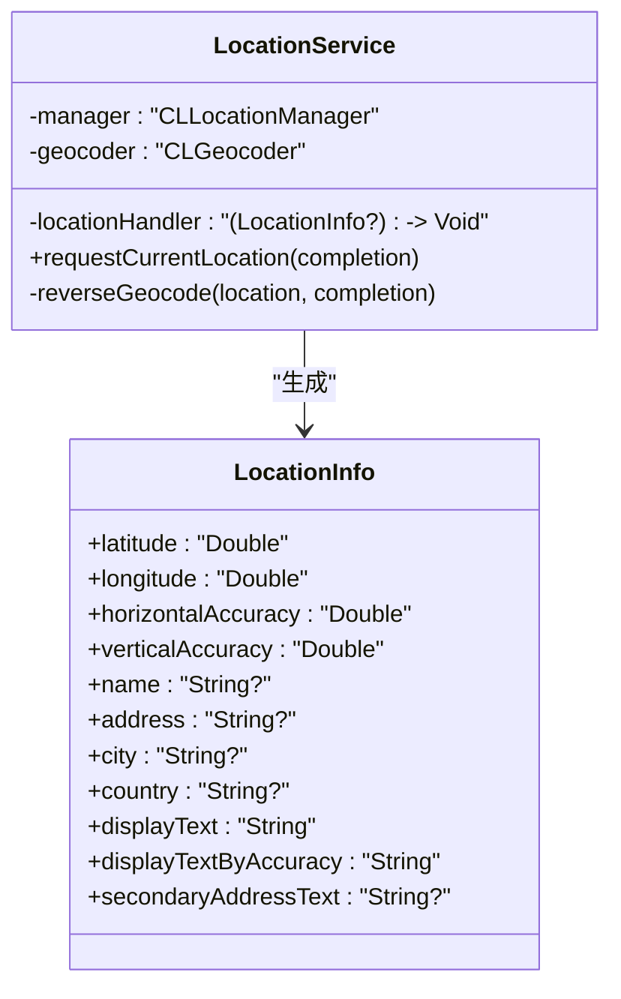
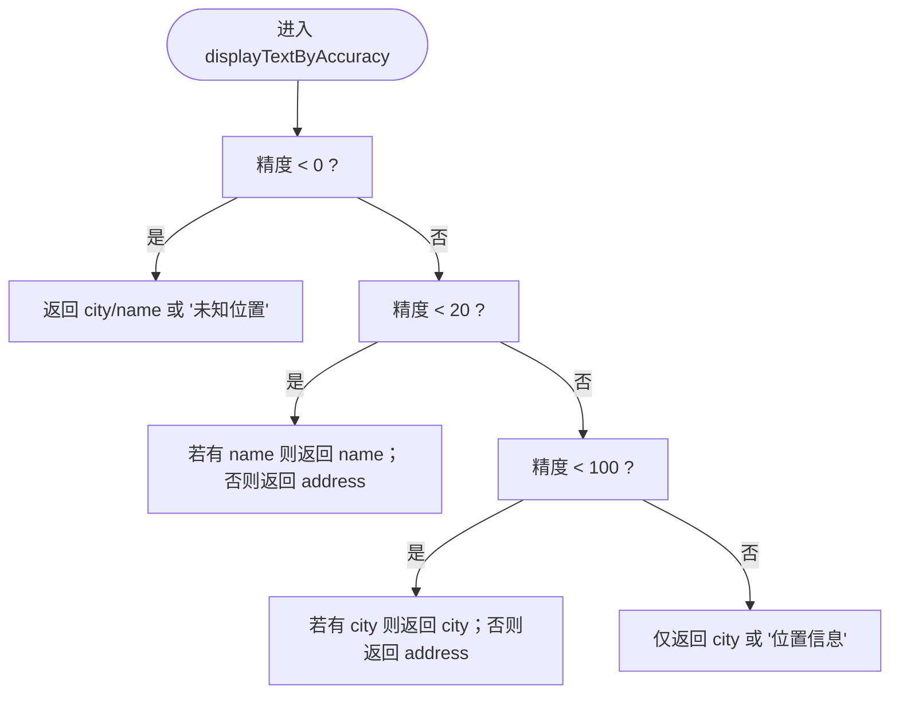
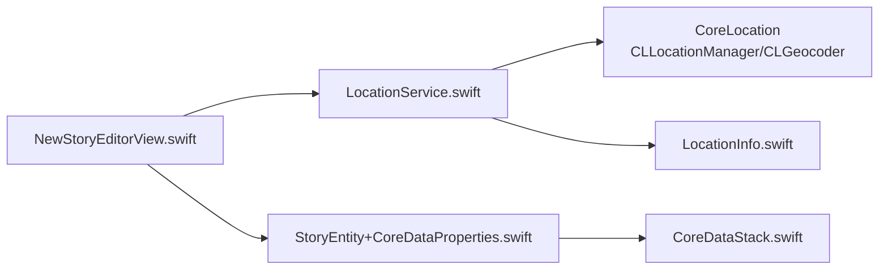
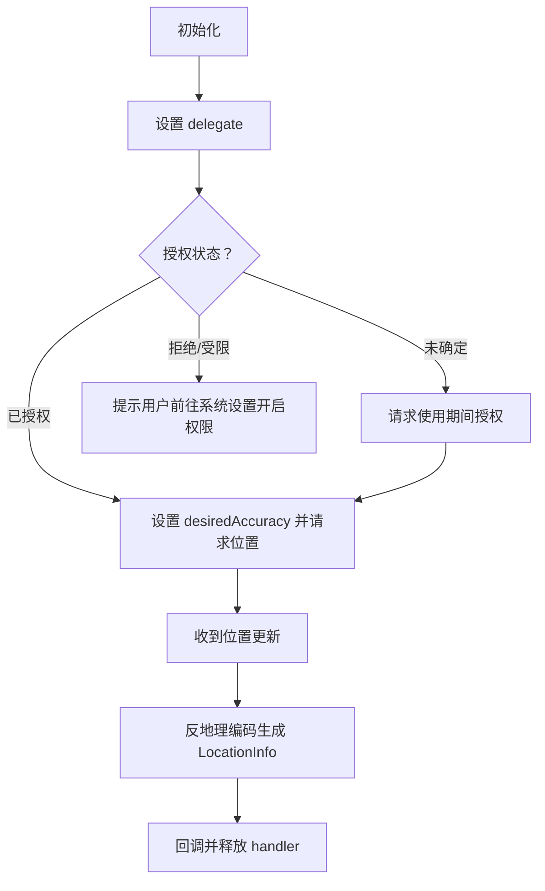

# 位置信息服务

<cite>
**本文引用的文件**
- [LocationService.swift](file://MyStory/Services/LocationService.swift)
- [LocationInfo.swift](file://MyStory/Models/ViewModels/LocationInfo.swift)
- [NewStoryEditorView.swift](file://MyStory/Views/Editor/NewStoryEditorView.swift)
- [Info.plist](file://MyStory/Info.plist)
- [CoreDataStack.swift](file://MyStory/Core/Storage/CoreDataStack.swift)
- [StoryEntity+CoreDataProperties.swift](file://MyStory/Models/Entities/StoryEntity+CoreDataProperties.swift)
- [Design.md](file://Design.md)
- [Localizable.strings（英文）](file://MyStory/Resources/Localizable/en.lproj/Localizable.strings)
</cite>

## 目录
1. [简介](#简介)
2. [项目结构](#项目结构)
3. [核心组件](#核心组件)
4. [架构总览](#架构总览)
5. [组件详解](#组件详解)
6. [依赖关系分析](#依赖关系分析)
7. [性能与电池优化](#性能与电池优化)
8. [故障排查指南](#故障排查指南)
9. [结论](#结论)
10. [附录](#附录)

## 简介
本文件面向“位置信息服务”的技术实现，系统性阐述 iOS 位置服务在本项目中的集成方式，涵盖 CoreLocation 使用、权限申请与位置更新监听、地理编码与反地理编码、位置精度控制、生命周期管理、后台定位策略、位置历史记录存储与查询、错误处理与隐私保护、测试与调试方法，以及性能优化与最佳实践。

## 项目结构
位置服务相关代码主要分布在以下模块：
- 服务层：位置服务与地理编码封装
- 模型层：位置信息模型与持久化实体属性
- 视图层：编辑器中对位置信息的展示与写入
- 配置层：Info.plist 中的权限描述与隐私声明
- 存储层：CoreData 模型中对位置字段的定义与持久化

图表来源
- [LocationService.swift](file://MyStory/Services/LocationService.swift#L1-L55)
- [LocationInfo.swift](file://MyStory/Models/ViewModels/LocationInfo.swift#L1-L76)
- [NewStoryEditorView.swift](file://MyStory/Views/Editor/NewStoryEditorView.swift#L900-L914)
- [Info.plist](file://MyStory/Info.plist#L41-L42)
- [CoreDataStack.swift](file://MyStory/Core/Storage/CoreDataStack.swift#L161-L176)
- [StoryEntity+CoreDataProperties.swift](file://MyStory/Models/Entities/StoryEntity+CoreDataProperties.swift#L21-L39)
- [Localizable.strings（英文）](file://MyStory/Resources/Localizable/en.lproj/Localizable.strings#L280-L291)

章节来源
- [LocationService.swift](file://MyStory/Services/LocationService.swift#L1-L55)
- [LocationInfo.swift](file://MyStory/Models/ViewModels/LocationInfo.swift#L1-L76)
- [NewStoryEditorView.swift](file://MyStory/Views/Editor/NewStoryEditorView.swift#L900-L914)
- [Info.plist](file://MyStory/Info.plist#L41-L42)
- [CoreDataStack.swift](file://MyStory/Core/Storage/CoreDataStack.swift#L161-L176)
- [StoryEntity+CoreDataProperties.swift](file://MyStory/Models/Entities/StoryEntity+CoreDataProperties.swift#L21-L39)
- [Localizable.strings（英文）](file://MyStory/Resources/Localizable/en.lproj/Localizable.strings#L280-L291)

## 核心组件
- 位置服务（LocationService）
  - 使用 CLLocationManager 进行权限申请与位置请求
  - 使用 CLGeocoder 进行反地理编码，生成 LocationInfo
  - 实现 CLLocationManagerDelegate，处理位置更新与错误回调
- 位置信息模型（LocationInfo）
  - 结构化存储经纬度、精度、地名、地址、城市、国家等
  - 提供按精度选择显示文案的逻辑
- 编辑器视图（NewStoryEditorView）
  - 调用位置服务获取当前位置
  - 将 LocationInfo 写入 StoryEntity 的位置相关字段
- 配置与隐私（Info.plist、Privacy Policy）
  - Info.plist 中配置“使用期间”定位权限说明
  - 隐私政策声明数据本地化与权限最小化原则
- 存储层（CoreData）
  - StoryEntity 定义了位置相关字段（名称、城市、地址、经纬度、水平/垂直精度）

章节来源
- [LocationService.swift](file://MyStory/Services/LocationService.swift#L4-L38)
- [LocationInfo.swift](file://MyStory/Models/ViewModels/LocationInfo.swift#L10-L76)
- [NewStoryEditorView.swift](file://MyStory/Views/Editor/NewStoryEditorView.swift#L905-L914)
- [Info.plist](file://MyStory/Info.plist#L41-L42)
- [CoreDataStack.swift](file://MyStory/Core/Storage/CoreDataStack.swift#L161-L176)
- [StoryEntity+CoreDataProperties.swift](file://MyStory/Models/Entities/StoryEntity+CoreDataProperties.swift#L21-L39)

## 架构总览
下图展示了从编辑器触发位置请求，到位置服务完成反地理编码并将结果写入故事实体的整体流程。

图表来源
- [LocationService.swift](file://MyStory/Services/LocationService.swift#L14-L38)
- [LocationInfo.swift](file://MyStory/Models/ViewModels/LocationInfo.swift#L10-L32)
- [NewStoryEditorView.swift](file://MyStory/Views/Editor/NewStoryEditorView.swift#L905-L914)

## 组件详解

### 位置服务（LocationService）
- 职责
  - 管理权限状态与授权请求
  - 控制 desiredAccuracy 并发起单次位置请求
  - 监听位置更新，调用反地理编码生成 LocationInfo
  - 错误回调时清理回调句柄
- 关键行为
  - 权限判断：若为未确定则请求使用期间授权
  - 精度设置：使用最佳精度
  - 反地理编码：提取地名、地址、城市、国家等字段
  - 回调释放：每次请求完成后清理 handler，避免重复回调

图表来源
- [LocationService.swift](file://MyStory/Services/LocationService.swift#L4-L38)
- [LocationInfo.swift](file://MyStory/Models/ViewModels/LocationInfo.swift#L10-L76)

章节来源
- [LocationService.swift](file://MyStory/Services/LocationService.swift#L14-L38)
- [LocationService.swift](file://MyStory/Services/LocationService.swift#L41-L54)

### 位置信息模型（LocationInfo）
- 字段
  - 经纬度、水平/垂直精度（米）
  - 名称、地址、城市、国家
  - 使用频率（useFrequency），用于后续历史统计
- 显示逻辑
  - displayText：优先名称，其次城市，再次地址，最后“未知位置”
  - displayTextByAccuracy：根据精度阈值选择不同粒度的显示文案
  - secondaryAddressText：当精度高且名称与地址存在差异时，作为副标题显示地址

图表来源
- [LocationInfo.swift](file://MyStory/Models/ViewModels/LocationInfo.swift#L34-L62)

章节来源
- [LocationInfo.swift](file://MyStory/Models/ViewModels/LocationInfo.swift#L22-L70)

### 编辑器视图中的位置写入（NewStoryEditorView）
- 写入逻辑
  - 将 LocationInfo 的名称、城市、地址、经纬度、水平/垂直精度写入 StoryEntity
- UI 展示
  - 当存在位置信息时，显示主副标题与精度指示
  - 支持清除位置信息

章节来源
- [NewStoryEditorView.swift](file://MyStory/Views/Editor/NewStoryEditorView.swift#L905-L914)
- [NewStoryEditorView.swift](file://MyStory/Views/Editor/NewStoryEditorView.swift#L386-L431)

### 配置与隐私（Info.plist 与隐私政策）
- Info.plist
  - NSLocationWhenInUseUsageDescription：用于在使用期间获取位置以添加到故事
- 隐私政策
  - 数据本地化存储、权限最小化、用户可控等原则

章节来源
- [Info.plist](file://MyStory/Info.plist#L41-L42)
- [Localizable.strings（英文）](file://MyStory/Resources/Localizable/en.lproj/Localizable.strings#L280-L291)

### 存储层（CoreData）
- StoryEntity 位置字段
  - locationName、locationCity、locationAddress、latitude、longitude、horizontalAccuracy、verticalAccuracy
- 默认值与约束
  - horizontalAccuracy、verticalAccuracy 默认值为 -1.0，表示未设置或无效
- 模型构建
  - CoreDataStack 中定义 StoryEntity 的属性集合，包含上述字段

章节来源
- [StoryEntity+CoreDataProperties.swift](file://MyStory/Models/Entities/StoryEntity+CoreDataProperties.swift#L21-L39)
- [CoreDataStack.swift](file://MyStory/Core/Storage/CoreDataStack.swift#L161-L176)

## 依赖关系分析
- 编辑器视图依赖位置服务进行位置获取
- 位置服务依赖 CoreLocation（CLLocationManager、CLGeocoder）
- 位置服务产出 LocationInfo，供编辑器写入 StoryEntity
- StoryEntity 的位置字段由 CoreData 持久化

图表来源
- [NewStoryEditorView.swift](file://MyStory/Views/Editor/NewStoryEditorView.swift#L905-L914)
- [LocationService.swift](file://MyStory/Services/LocationService.swift#L4-L38)
- [LocationInfo.swift](file://MyStory/Models/ViewModels/LocationInfo.swift#L10-L32)
- [StoryEntity+CoreDataProperties.swift](file://MyStory/Models/Entities/StoryEntity+CoreDataProperties.swift#L21-L39)
- [CoreDataStack.swift](file://MyStory/Core/Storage/CoreDataStack.swift#L161-L176)

章节来源
- [NewStoryEditorView.swift](file://MyStory/Views/Editor/NewStoryEditorView.swift#L905-L914)
- [LocationService.swift](file://MyStory/Services/LocationService.swift#L4-L38)
- [LocationInfo.swift](file://MyStory/Models/ViewModels/LocationInfo.swift#L10-L32)
- [StoryEntity+CoreDataProperties.swift](file://MyStory/Models/Entities/StoryEntity+CoreDataProperties.swift#L21-L39)
- [CoreDataStack.swift](file://MyStory/Core/Storage/CoreDataStack.swift#L161-L176)

## 性能与电池优化
- 精度控制
  - 使用最佳精度（kCLLocationAccuracyBest）满足编辑场景
  - 通过 LocationInfo 的 displayTextByAccuracy 降低 UI 展示的精度要求，避免过度依赖高精度
- 请求时机
  - 单次请求（requestLocation）而非持续监听，减少电量消耗
- 回调释放
  - 每次请求后清理回调句柄，避免重复回调导致的资源占用
- 后台定位
  - 当前实现基于使用期间授权与单次请求，未启用后台定位
  - 如需后台定位，需在 Info.plist 中补充后台模式与权限描述，并在服务端扩展监听能力

章节来源
- [LocationService.swift](file://MyStory/Services/LocationService.swift#L19-L21)
- [LocationInfo.swift](file://MyStory/Models/ViewModels/LocationInfo.swift#L34-L62)
- [LocationService.swift](file://MyStory/Services/LocationService.swift#L41-L54)

## 故障排查指南
- 权限相关
  - 未授权：若授权状态为未确定，服务会自动请求使用期间授权；若被拒绝或受限，需引导用户在系统设置中开启
  - 配置检查：确认 Info.plist 中已配置 NSLocationWhenInUseUsageDescription
- 位置获取失败
  - 网络或系统服务异常：服务回调错误时会返回空值，需在 UI 上提示用户重试或手动选择位置
- 精度显示异常
  - horizontalAccuracy 为负值或缺失时，采用降级显示策略
- 数据持久化
  - 检查 StoryEntity 的位置字段是否正确写入；若精度为 -1.0，表示未设置或无效

章节来源
- [LocationService.swift](file://MyStory/Services/LocationService.swift#L16-L18)
- [Info.plist](file://MyStory/Info.plist#L41-L42)
- [LocationService.swift](file://MyStory/Services/LocationService.swift#L50-L53)
- [LocationInfo.swift](file://MyStory/Models/ViewModels/LocationInfo.swift#L36-L38)
- [StoryEntity+CoreDataProperties.swift](file://MyStory/Models/Entities/StoryEntity+CoreDataProperties.swift#L21-L39)

## 结论
本项目通过 LocationService 将 CoreLocation 与 CLGeocoder 有机结合，实现了从权限申请、位置请求、反地理编码到 UI 展示与数据持久化的完整链路。通过精度控制与单次请求策略，兼顾了用户体验与电池续航。隐私方面遵循最小权限原则并在隐私政策中明确说明。未来可在后台定位、位置历史查询与更细粒度的精度策略上进一步完善。

## 附录

### 位置服务生命周期与权限流程

图表来源
- [LocationService.swift](file://MyStory/Services/LocationService.swift#L9-L21)
- [LocationService.swift](file://MyStory/Services/LocationService.swift#L41-L54)

### 地理编码与反地理编码实现要点
- 反地理编码
  - 使用 CLGeocoder 的 reverseGeocodeLocation，从坐标解析地名、地址、城市、国家
  - 将解析结果映射到 LocationInfo
- 地理编码
  - 当前实现聚焦于反地理编码；如需地址到坐标的正向地理编码，可在服务层扩展相应接口

章节来源
- [LocationService.swift](file://MyStory/Services/LocationService.swift#L23-L38)

### 位置历史记录与查询（设计建议）
- 历史记录模型
  - 可复用 LocationInfo 或新增 HistoryLocation 模型，包含时间戳、经纬度、精度等
- 查询策略
  - 基于时间范围、精度阈值、城市/国家过滤
- 存储建议
  - 可沿用 CoreData，或引入轻量级本地数据库（如 SQLite）以提升查询效率

章节来源
- [LocationInfo.swift](file://MyStory/Models/ViewModels/LocationInfo.swift#L10-L21)

### 测试方法与调试技巧
- 单元测试
  - 对 LocationInfo 的显示逻辑进行断言测试（不同精度下的文案）
- 集成测试
  - 使用模拟 LocationService（Mock）注入，验证编辑器写入 StoryEntity 的字段一致性
- 调试技巧
  - 在 Info.plist 中开启“位置模拟”（开发期），使用 Xcode 设备菜单选择模拟位置
  - 观察 horizontalAccuracy 与 UI 显示是否一致

章节来源
- [LocationInfo.swift](file://MyStory/Models/ViewModels/LocationInfo.swift#L34-L70)
- [Design.md](file://Design.md#L632-L668)