# 分类管理服务

<cite>
**本文档引用的文件**
- [CategoryService.swift](file://MyStory/Services/CategoryService/CategoryService.swift)
- [CategoryModel.swift](file://MyStory/Models/Category/CategoryModel.swift)
- [CategoryEntity+CoreDataClass.swift](file://MyStory/Models/Entities/CategoryEntity+CoreDataClass.swift)
- [CategoryEntity+CoreDataProperties.swift](file://MyStory/Models/Entities/CategoryEntity+CoreDataProperties.swift)
- [CategoryViewModel.swift](file://MyStory/ViewModels/Category/CategoryViewModel.swift)
- [CategoryView.swift](file://MyStory/Views/Category/CategoryView.swift)
- [CategoryFormView.swift](file://MyStory/Views/Category/CategoryFormView.swift)
- [CategorySearchView.swift](file://MyStory/Views/Category/CategorySearchView.swift)
- [CategorySearchResultView.swift](file://MyStory/Views/Category/CategorySearchResultView.swift)
- [CategoryStoryListView.swift](file://MyStory/Views/Category/CategoryStoryListView.swift)
- [CategoryCardView.swift](file://MyStory/Components/Category/CategoryCardView.swift)
- [CoreDataStack.swift](file://MyStory/Core/Storage/CoreDataStack.swift)
- [MediaStorageService.swift](file://MyStory/Services/MediaStorageService.swift)
- [StoryEntity+CoreDataProperties.swift](file://MyStory/Models/Entities/StoryEntity+CoreDataProperties.swift)
</cite>

## 目录
1. [简介](#简介)
2. [项目结构](#项目结构)
3. [核心组件](#核心组件)
4. [架构概览](#架构概览)
5. [详细组件分析](#详细组件分析)
6. [依赖关系分析](#依赖关系分析)
7. [性能考虑](#性能考虑)
8. [故障排除指南](#故障排除指南)
9. [结论](#结论)
10. [附录](#附录)

## 简介

分类管理服务是 MyStory 应用程序中的核心功能模块，负责管理三级分类系统（1级 > 2级 > 3级）。该服务提供了完整的分类 CRUD 操作、树形结构管理、搜索功能、统计计算和与 UI 组件的交互机制。

系统采用分层架构设计，包含服务层、模型层、数据持久化层和视图层，通过 CoreData 进行数据持久化，支持分类树的构建、维护和查询算法。

## 项目结构

项目采用基于功能域的组织方式，分类管理服务位于以下目录结构中：

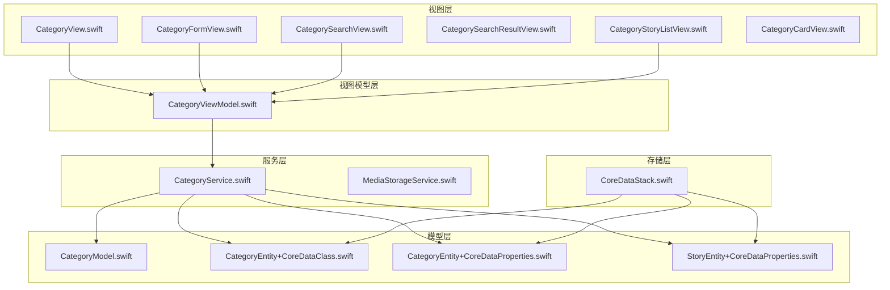

**图表来源**
- [CategoryService.swift](file://MyStory/Services/CategoryService/CategoryService.swift#L1-L675)
- [CategoryModel.swift](file://MyStory/Models/Category/CategoryModel.swift#L1-L23)
- [CoreDataStack.swift](file://MyStory/Core/Storage/CoreDataStack.swift#L1-L382)

**章节来源**
- [CategoryService.swift](file://MyStory/Services/CategoryService/CategoryService.swift#L1-L675)
- [CoreDataStack.swift](file://MyStory/Core/Storage/CoreDataStack.swift#L1-L382)

## 核心组件

### 分类服务接口

分类服务采用协议导向的设计，定义了完整的分类管理接口：

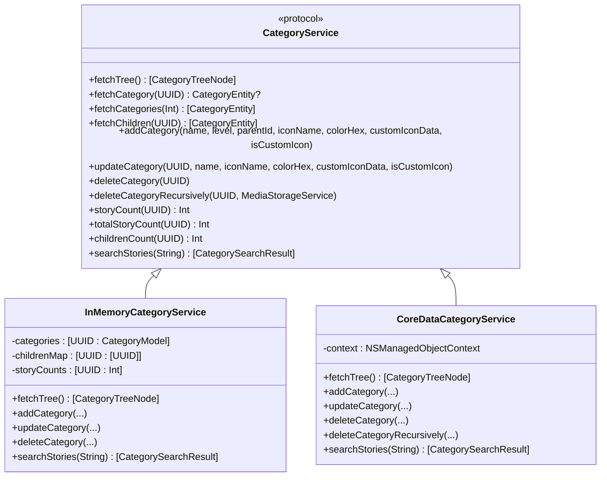

**图表来源**
- [CategoryService.swift](file://MyStory/Services/CategoryService/CategoryService.swift#L22-L42)
- [CategoryService.swift](file://MyStory/Services/CategoryService/CategoryService.swift#L44-L185)
- [CategoryService.swift](file://MyStory/Services/CategoryService/CategoryService.swift#L190-L675)

### 数据模型

系统使用双模型架构，既支持内存模式也支持 CoreData 模式：

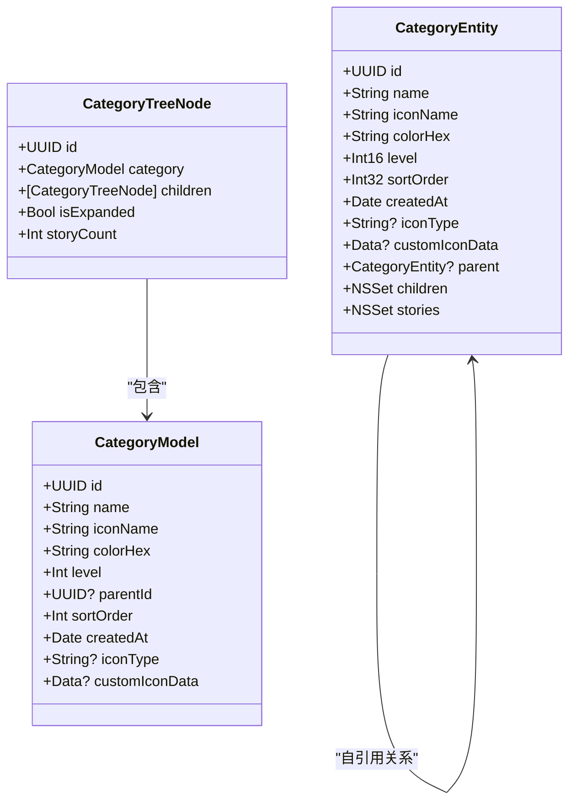

**图表来源**
- [CategoryModel.swift](file://MyStory/Models/Category/CategoryModel.swift#L3-L22)
- [CategoryEntity+CoreDataProperties.swift](file://MyStory/Models/Entities/CategoryEntity+CoreDataProperties.swift#L15-L34)

**章节来源**
- [CategoryModel.swift](file://MyStory/Models/Category/CategoryModel.swift#L1-L23)
- [CategoryEntity+CoreDataProperties.swift](file://MyStory/Models/Entities/CategoryEntity+CoreDataProperties.swift#L1-L74)

## 架构概览

分类管理服务采用分层架构，实现了清晰的关注点分离：

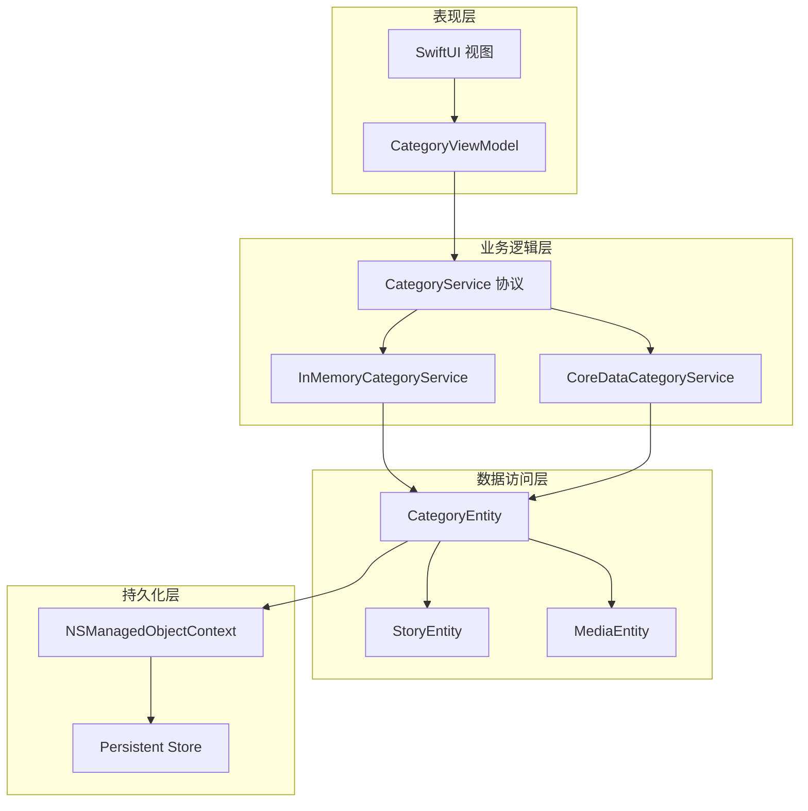

**图表来源**
- [CategoryView.swift](file://MyStory/Views/Category/CategoryView.swift#L1-L495)
- [CategoryViewModel.swift](file://MyStory/ViewModels/Category/CategoryViewModel.swift#L1-L103)
- [CategoryService.swift](file://MyStory/Services/CategoryService/CategoryService.swift#L190-L675)

### 分类树形结构

系统支持三级分类树形结构，每级都有特定的约束和限制：

| 层级 | 最大数量 | 父级要求 | 子级限制 |
|------|----------|----------|----------|
| 1级 | 10个 | 无 | 每个1级分类最多20个2级子分类 |
| 2级 | 无限制 | 必须是1级分类 | 每个2级分类最多30个3级子分类 |
| 3级 | 无限制 | 必须是2级分类 | 无子级限制 |

**章节来源**
- [CategoryService.swift](file://MyStory/Services/CategoryService/CategoryService.swift#L92-L122)
- [CategoryService.swift](file://MyStory/Services/CategoryService/CategoryService.swift#L266-L330)

## 详细组件分析

### 分类服务实现

#### 内存模式实现

InMemoryCategoryService 提供了完整的分类管理功能，适用于测试和演示场景：

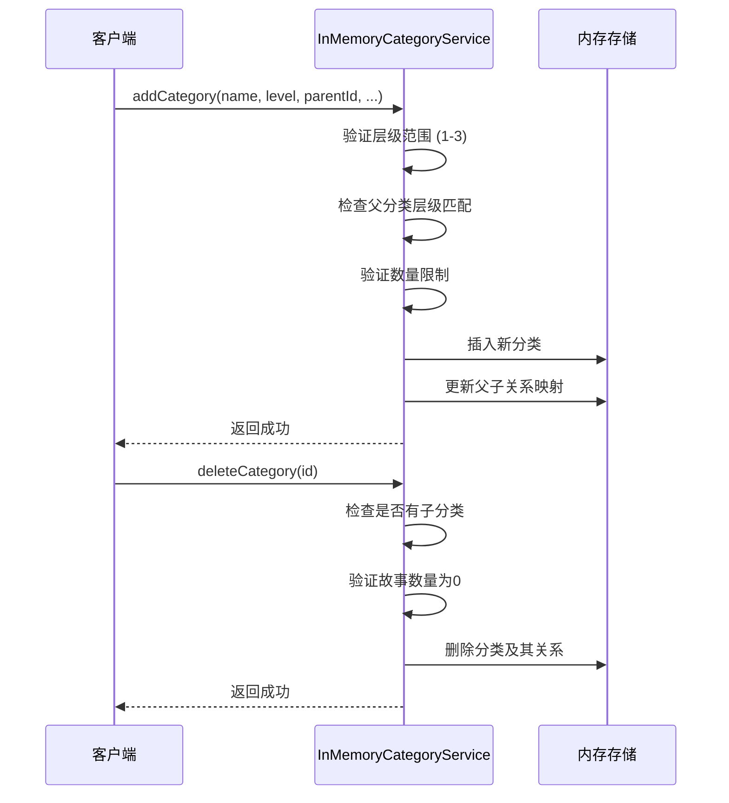

**图表来源**
- [CategoryService.swift](file://MyStory/Services/CategoryService/CategoryService.swift#L92-L153)

#### CoreData 模式实现

CoreDataCategoryService 提供了完整的数据持久化功能：

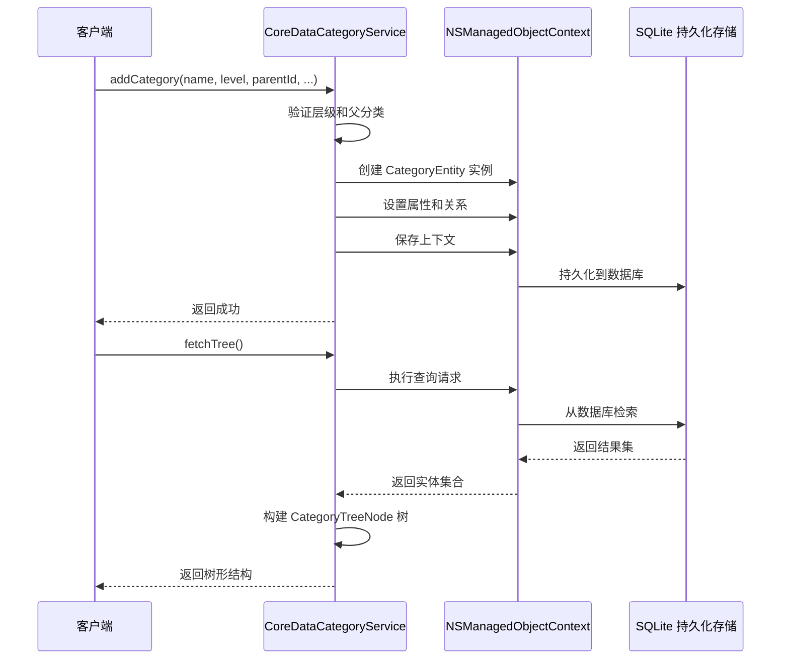

**图表来源**
- [CategoryService.swift](file://MyStory/Services/CategoryService/CategoryService.swift#L204-L219)
- [CategoryService.swift](file://MyStory/Services/CategoryService/CategoryService.swift#L309-L330)

**章节来源**
- [CategoryService.swift](file://MyStory/Services/CategoryService/CategoryService.swift#L190-L675)

### 分类 CRUD 操作

#### 创建操作

创建分类时需要验证多个约束条件：

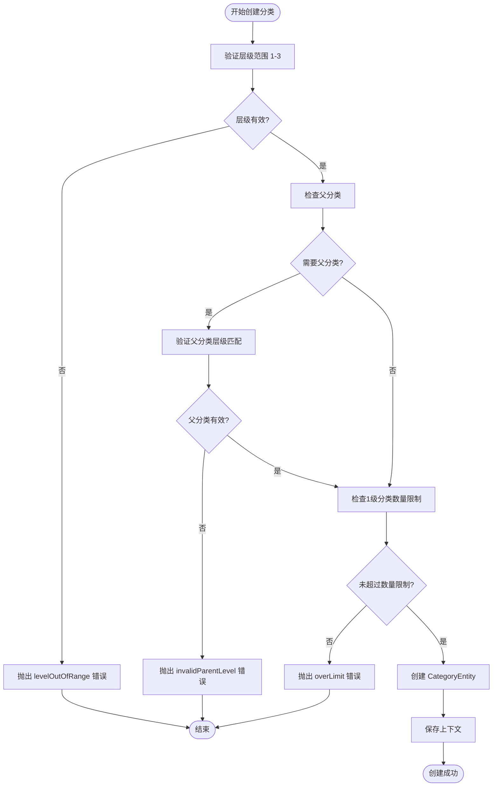

**图表来源**
- [CategoryService.swift](file://MyStory/Services/CategoryService/CategoryService.swift#L266-L330)

#### 删除操作

删除分类时需要执行严格的完整性检查：

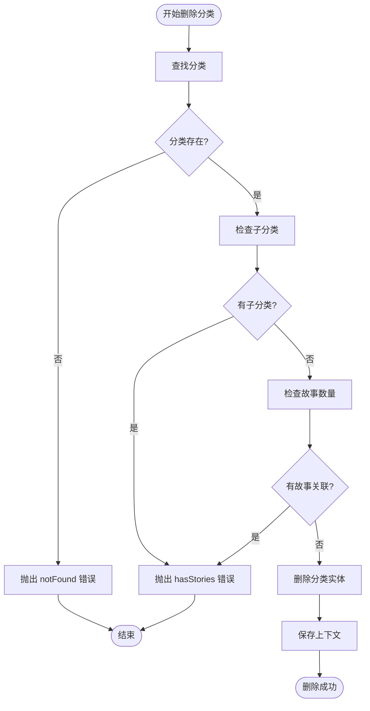

**图表来源**
- [CategoryService.swift](file://MyStory/Services/CategoryService/CategoryService.swift#L353-L373)

**章节来源**
- [CategoryService.swift](file://MyStory/Services/CategoryService/CategoryService.swift#L266-L409)

### 搜索功能实现

搜索功能支持在三级分类下的故事内容搜索：

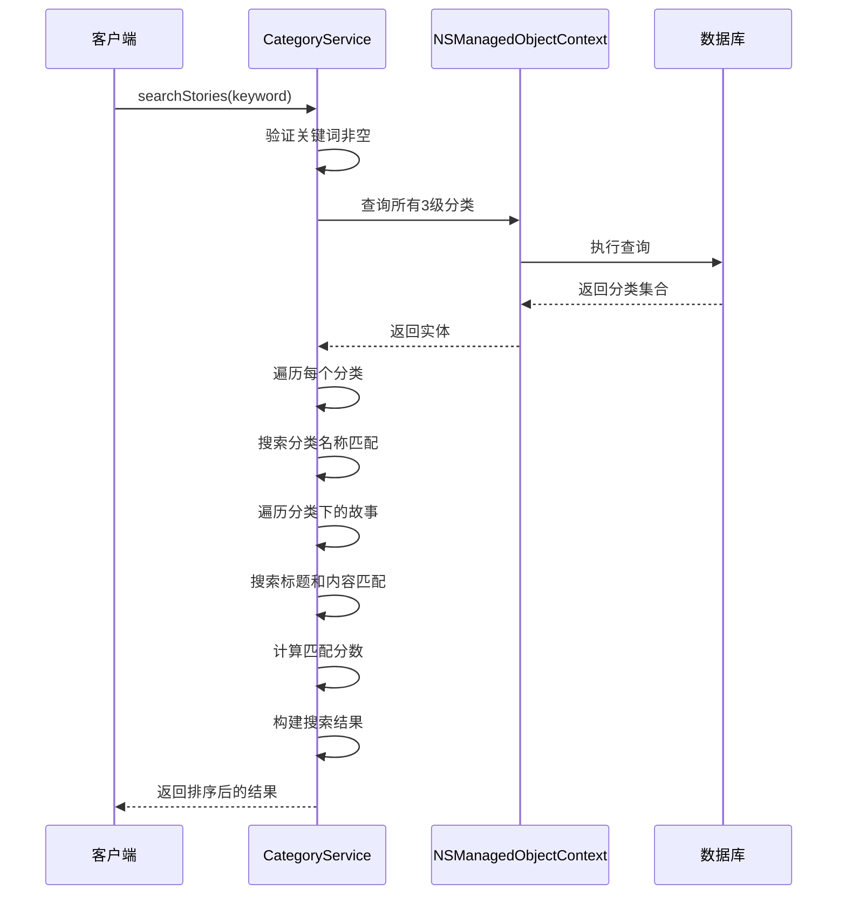

**图表来源**
- [CategoryService.swift](file://MyStory/Services/CategoryService/CategoryService.swift#L453-L552)

**章节来源**
- [CategoryService.swift](file://MyStory/Services/CategoryService/CategoryService.swift#L453-L552)

### 统计计算功能

系统提供多种统计计算功能：

| 统计类型 | 计算方式 | 性能特征 |
|----------|----------|----------|
| 子分类数量 | 直接查询 children 关系 | O(1) |
| 故事数量 | 查询 stories 关系数量 | O(1) |
| 总故事数量 | 递归计算子分类故事数 | O(n) |
| 分类层级 | 通过 parent 关系遍历 | O(h) |

**章节来源**
- [CategoryService.swift](file://MyStory/Services/CategoryService/CategoryService.swift#L411-L449)

### UI 组件交互

#### 主分类视图

主分类视图支持两种显示模式和完整的交互功能：

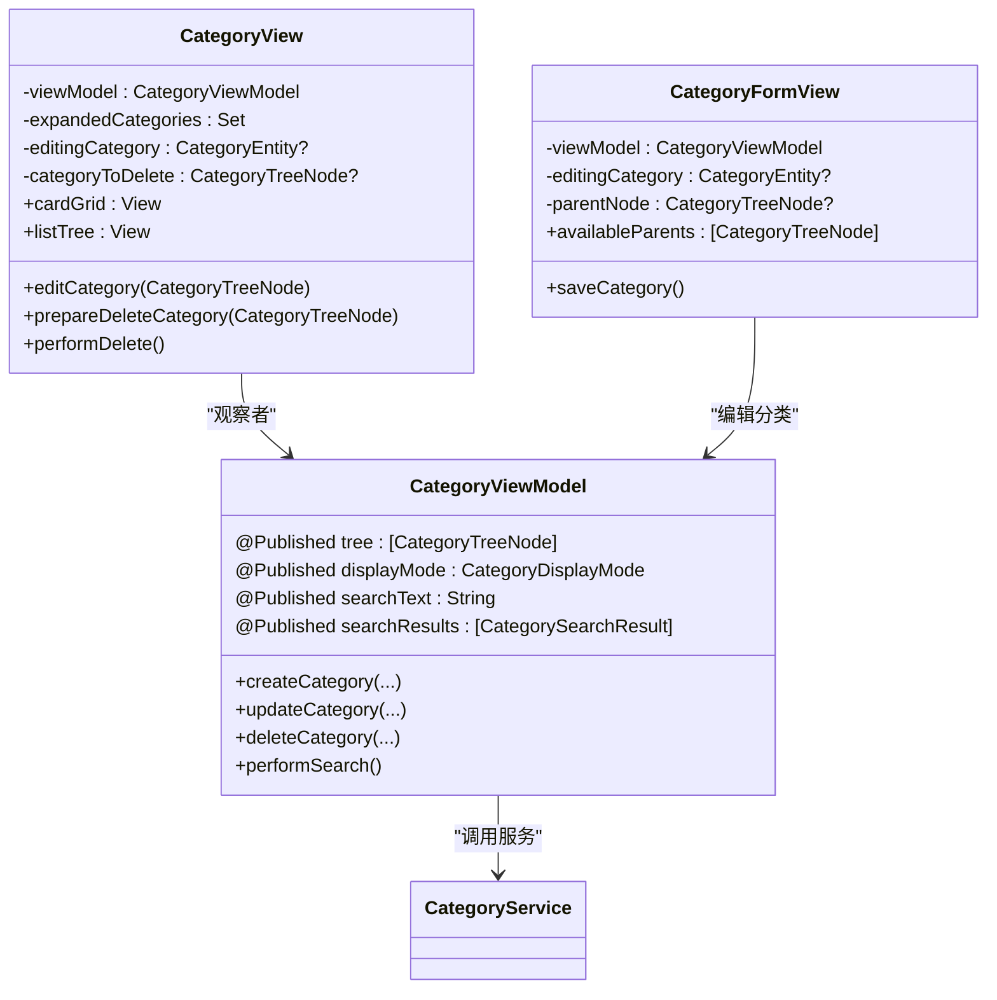

**图表来源**
- [CategoryView.swift](file://MyStory/Views/Category/CategoryView.swift#L3-L495)
- [CategoryViewModel.swift](file://MyStory/ViewModels/Category/CategoryViewModel.swift#L18-L103)
- [CategoryFormView.swift](file://MyStory/Views/Category/CategoryFormView.swift#L12-L461)

**章节来源**
- [CategoryView.swift](file://MyStory/Views/Category/CategoryView.swift#L1-L495)
- [CategoryViewModel.swift](file://MyStory/ViewModels/Category/CategoryViewModel.swift#L1-L103)
- [CategoryFormView.swift](file://MyStory/Views/Category/CategoryFormView.swift#L1-L461)

## 依赖关系分析

### 外部依赖

系统主要依赖以下外部框架和服务：

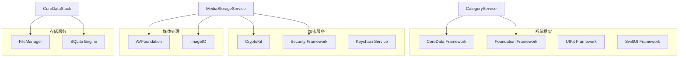

**图表来源**
- [CategoryService.swift](file://MyStory/Services/CategoryService/CategoryService.swift#L1-L3)
- [MediaStorageService.swift](file://MyStory/Services/MediaStorageService.swift#L1-L7)

### 内部依赖关系

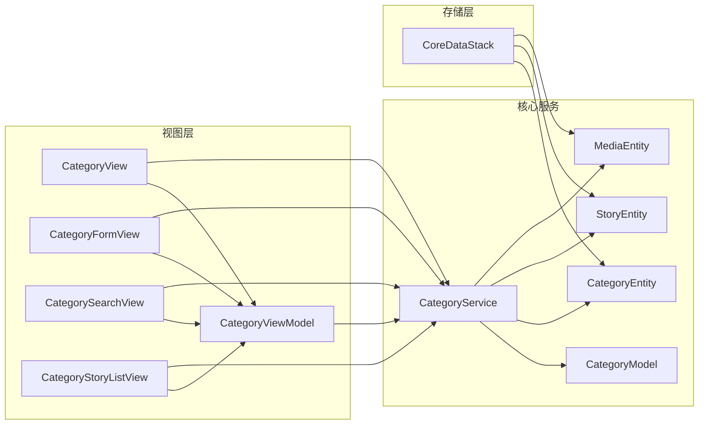

**图表来源**
- [CategoryService.swift](file://MyStory/Services/CategoryService/CategoryService.swift#L190-L675)
- [CategoryViewModel.swift](file://MyStory/ViewModels/Category/CategoryViewModel.swift#L18-L30)

**章节来源**
- [CoreDataStack.swift](file://MyStory/Core/Storage/CoreDataStack.swift#L348-L371)

## 性能考虑

### 查询优化

系统采用了多种查询优化策略：

1. **关系预加载**：使用 `relationshipKeyPathsForPrefetching` 预加载关联数据，避免 N+1 查询问题
2. **批量查询**：使用 `ANY categories.id IN %` 批量查询故事
3. **索引优化**：在 CoreData 模型中为常用查询字段建立索引

### 内存管理

1. **懒加载**：树形结构按需构建，避免一次性加载所有数据
2. **缓存策略**：ViewModel 缓存查询结果，减少重复查询
3. **弱引用**：避免循环引用导致的内存泄漏

### 并发控制

1. **上下文隔离**：每个服务使用独立的 NSManagedObjectContext
2. **合并策略**：配置适当的合并策略处理并发更新
3. **事务管理**：使用 save 方法确保数据一致性

## 故障排除指南

### 常见错误类型

| 错误类型 | 触发条件 | 解决方案 |
|----------|----------|----------|
| levelOutOfRange | 分类层级不在 1-3 范围内 | 验证用户输入，提供默认值 |
| overLimit | 达到数量上限 | 提供用户反馈，引导清理操作 |
| hasStories | 分类仍有子分类或故事 | 提示用户先删除子分类和故事 |
| notFound | 分类不存在 | 检查 UUID 有效性，重新加载数据 |
| invalidParentLevel | 父分类层级不匹配 | 验证父分类层级关系 |

### 调试技巧

1. **启用详细日志**：在开发环境中启用详细的日志输出
2. **断点调试**：在关键方法处设置断点检查数据状态
3. **单元测试**：编写针对边界条件的测试用例

**章节来源**
- [CategoryService.swift](file://MyStory/Services/CategoryService/CategoryService.swift#L4-L20)

## 结论

分类管理服务通过清晰的分层架构和协议导向的设计，实现了功能完整、性能优良的三级分类管理系统。系统支持多种显示模式、完整的 CRUD 操作、智能搜索功能和丰富的统计计算能力。

通过 CoreData 的持久化支持和完善的错误处理机制，系统能够稳定地处理复杂的分类关系和大量数据。UI 组件与服务层的松耦合设计使得系统具有良好的可扩展性和可维护性。

## 附录

### 扩展点和自定义配置

1. **服务实现扩展**：可以通过实现 CategoryService 协议添加新的存储后端
2. **UI 组件定制**：可以扩展现有的视图组件以支持新的显示需求
3. **搜索算法优化**：可以实现更高级的搜索算法和排序规则
4. **统计功能扩展**：可以添加更多维度的统计分析功能

### 最佳实践建议

1. **数据验证**：始终在服务层进行完整的数据验证
2. **错误处理**：提供清晰的错误信息和恢复机制
3. **性能监控**：定期监控查询性能和内存使用情况
4. **测试覆盖**：确保关键功能有足够的单元测试和集成测试