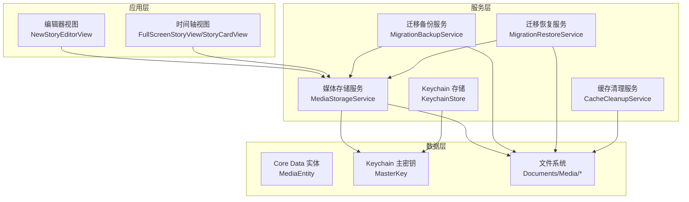
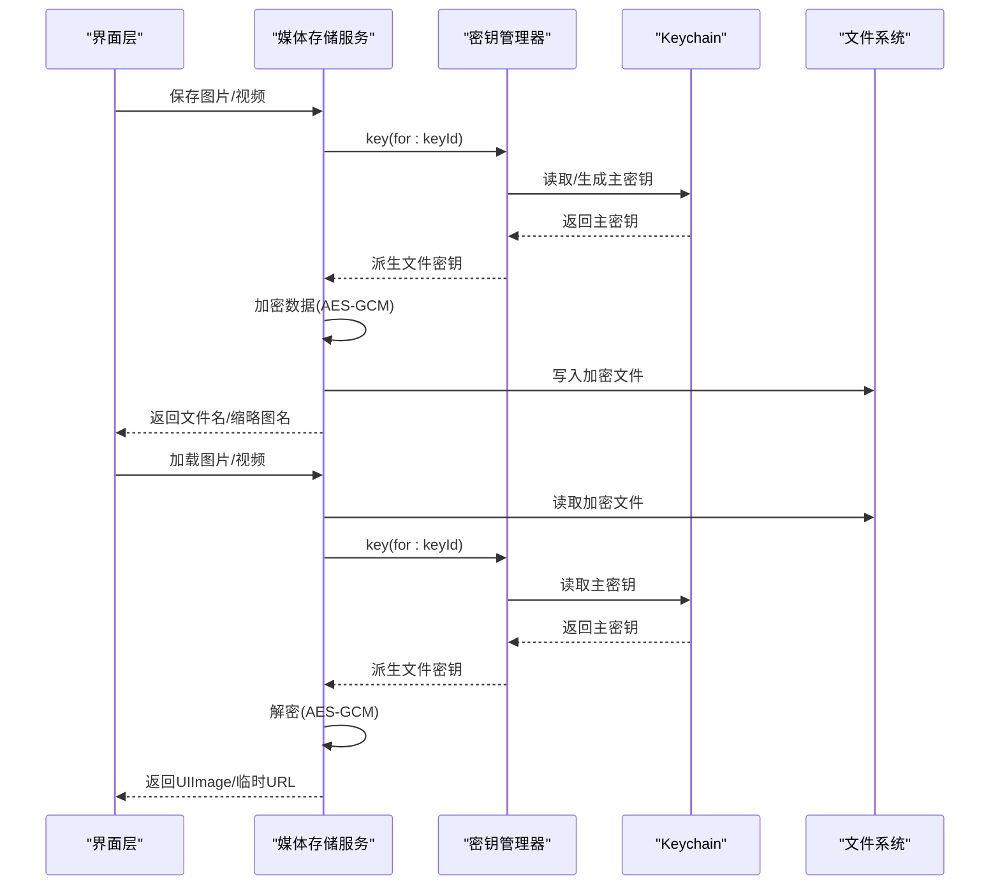
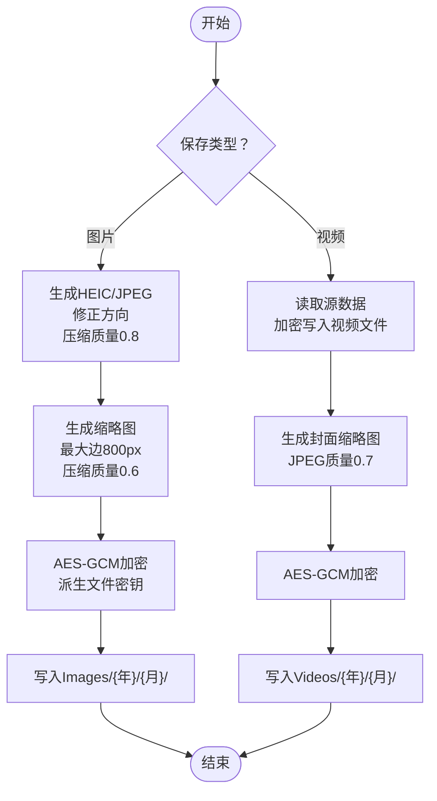
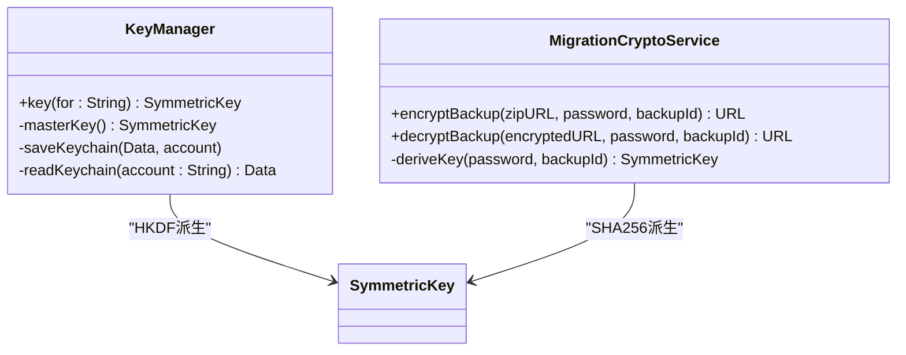
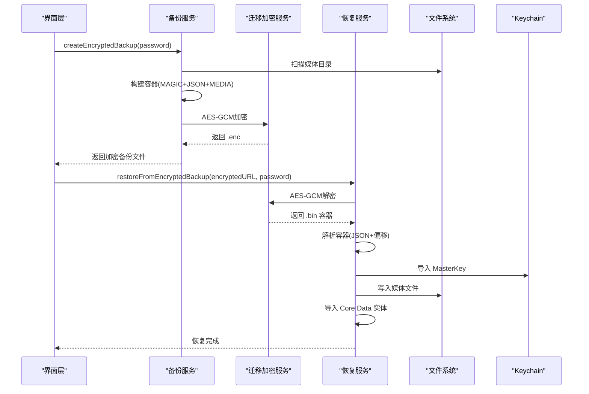
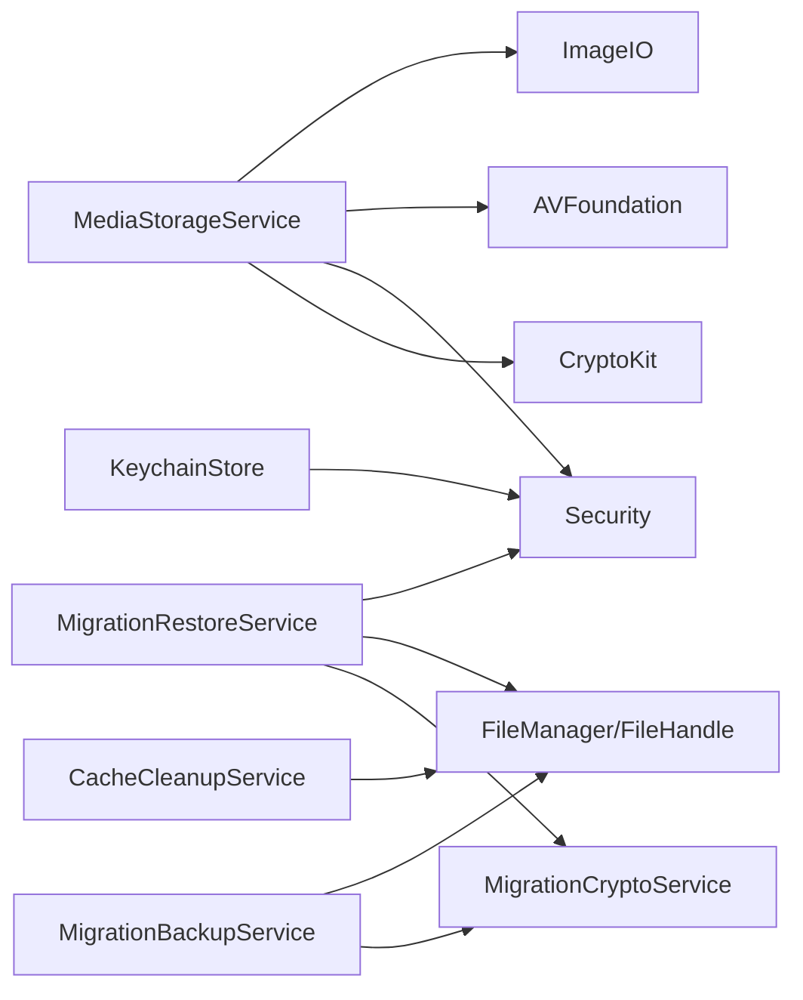

# 媒体存储服务

<cite>
**本文引用的文件**
- [MediaStorageService.swift](file://MyStory/Services/MediaStorageService.swift)
- [KeychainStore.swift](file://MyStory/Core/Storage/KeychainStore.swift)
- [MigrationCryptoService.swift](file://MyStory/Services/MigrationCryptoService.swift)
- [MigrationBackupService.swift](file://MyStory/Services/MigrationBackupService.swift)
- [MigrationRestoreService.swift](file://MyStory/Services/MigrationRestoreService.swift)
- [CacheCleanupService.swift](file://MyStory/Services/CacheCleanupService.swift)
- [MediaEntity+CoreDataProperties.swift](file://MyStory/Models/Entities/MediaEntity+CoreDataProperties.swift)
- [MediaEntity+CoreDataClass.swift](file://MyStory/Models/Entities/MediaEntity+CoreDataClass.swift)
- [StorageDesign.md](file://StorageDesign.md)
- [Design.md](file://Design.md)
- [NewStoryEditorView.swift](file://MyStory/Views/Editor/NewStoryEditorView.swift)
- [StoryCardView.swift](file://MyStory/Components/StoryCardView.swift)
- [FullScreenStoryView.swift](file://MyStory/Views/Timeline/FullScreenStoryView.swift)
</cite>

## 目录
1. [简介](#简介)
2. [项目结构](#项目结构)
3. [核心组件](#核心组件)
4. [架构总览](#架构总览)
5. [详细组件分析](#详细组件分析)
6. [依赖关系分析](#依赖关系分析)
7. [性能考量](#性能考量)
8. [故障排查指南](#故障排查指南)
9. [结论](#结论)
10. [附录](#附录)

## 简介
本技术文档面向“媒体存储服务”，系统性阐述图片与视频的本地存储机制、文件组织结构、加密存储实现、媒体上传/下载/删除/预览流程、格式支持与大小限制、缓存与内存优化、大文件处理最佳实践、元数据管理、缩略图生成与格式转换、错误处理与数据恢复/迁移机制，以及性能监控、配额管理与隐私保护措施。文档以仓库现有代码为依据，结合设计文档与视图层调用链路，提供可操作的实现参考与运维建议。

## 项目结构
媒体存储服务位于应用的 Services 与 Models 层，配合 Core Data 实体与 Keychain 存储，形成“元数据 + 加密文件”的双轨存储架构。主要模块如下：
- 媒体存储服务：负责图片/视频的保存、加载、缩略图生成、路径组织与加解密
- 迁移服务：负责备份与恢复，包含加密容器、元数据与媒体文件打包
- 缓存清理服务：负责临时文件与缓存目录的清理与统计
- Keychain 存储：负责 API Key 与 MasterKey 的安全存储
- Core Data 实体：承载媒体元数据（类型、尺寸、时长、关联故事等）

图表来源
- [MediaStorageService.swift](file://MyStory/Services/MediaStorageService.swift#L8-L224)
- [MigrationBackupService.swift](file://MyStory/Services/MigrationBackupService.swift#L1-L414)
- [MigrationRestoreService.swift](file://MyStory/Services/MigrationRestoreService.swift#L1-L383)
- [CacheCleanupService.swift](file://MyStory/Services/CacheCleanupService.swift#L1-L263)
- [KeychainStore.swift](file://MyStory/Core/Storage/KeychainStore.swift#L1-L40)
- [MediaEntity+CoreDataProperties.swift](file://MyStory/Models/Entities/MediaEntity+CoreDataProperties.swift#L1-L35)

章节来源
- [MediaStorageService.swift](file://MyStory/Services/MediaStorageService.swift#L1-L348)
- [MigrationBackupService.swift](file://MyStory/Services/MigrationBackupService.swift#L1-L414)
- [MigrationRestoreService.swift](file://MyStory/Services/MigrationRestoreService.swift#L1-L383)
- [CacheCleanupService.swift](file://MyStory/Services/CacheCleanupService.swift#L1-L263)
- [KeychainStore.swift](file://MyStory/Core/Storage/KeychainStore.swift#L1-L40)
- [MediaEntity+CoreDataProperties.swift](file://MyStory/Models/Entities/MediaEntity+CoreDataProperties.swift#L1-L35)

## 核心组件
- 媒体存储服务：提供图片与视频的保存、加载、缩略图生成、路径组织与加解密；采用 AES-GCM 对称加密，密钥由主密钥与文件ID派生
- 迁移备份/恢复服务：将 Core Data 元数据与媒体文件打包为自定义容器，再以 AES-GCM 加密输出 .enc 文件；恢复时解密容器、导入 MasterKey、重建媒体目录与 Core Data
- 缓存清理服务：清理临时文件与缓存目录，避免磁盘膨胀
- Keychain 存储：安全存储 API Key 与 MasterKey
- Core Data 实体：承载媒体元数据，便于检索与关系维护

章节来源
- [MediaStorageService.swift](file://MyStory/Services/MediaStorageService.swift#L8-L224)
- [MigrationCryptoService.swift](file://MyStory/Services/MigrationCryptoService.swift#L1-L67)
- [MigrationBackupService.swift](file://MyStory/Services/MigrationBackupService.swift#L1-L414)
- [MigrationRestoreService.swift](file://MyStory/Services/MigrationRestoreService.swift#L1-L383)
- [CacheCleanupService.swift](file://MyStory/Services/CacheCleanupService.swift#L1-L263)
- [KeychainStore.swift](file://MyStory/Core/Storage/KeychainStore.swift#L1-L40)
- [MediaEntity+CoreDataProperties.swift](file://MyStory/Models/Entities/MediaEntity+CoreDataProperties.swift#L15-L35)

## 架构总览
媒体存储服务采用“元数据 + 加密文件”的分层设计：
- 元数据：Core Data 实体（MediaEntity）记录媒体类型、尺寸、时长、文件名、缩略图名、创建时间等
- 文件系统：Documents/Media/Images|Videos/{年}/{月}/ 下按日期组织，文件名加密存储
- 加密：主密钥（Keychain）派生文件密钥（HKDF-SHA256），使用 AES-GCM 加密封装
- 缓存：临时文件与缓存目录定期清理，避免占用磁盘空间

图表来源
- [MediaStorageService.swift](file://MyStory/Services/MediaStorageService.swift#L194-L207)
- [MediaStorageService.swift](file://MyStory/Services/MediaStorageService.swift#L226-L271)
- [MediaStorageService.swift](file://MyStory/Services/MediaStorageService.swift#L125-L141)

## 详细组件分析

### 媒体存储服务（MediaStorageService）
职责与能力
- 图片保存：生成 HEIC/JPEG，修正方向，压缩质量 0.8，加密后写入 Images/{年}/{月}/
- 图片缩略图：生成最大边 800px 的缩略图，压缩质量 0.6，加密后写入同目录
- 视频保存：读取源数据，加密写入 Videos/{年}/{月}/，生成封面缩略图（JPEG，质量 0.7）
- 加载与预览：读取加密文件，解密后返回 UIImage；视频加载返回临时 URL 供播放器使用
- 路径组织：按年/月两级目录组织，文件名使用 UUID 命名，扩展名区分 HEIC/HEVC/JPG
- 加密：AES-GCM，密钥由主密钥与文件ID派生（HKDF-SHA256）

图表来源
- [MediaStorageService.swift](file://MyStory/Services/MediaStorageService.swift#L14-L47)
- [MediaStorageService.swift](file://MyStory/Services/MediaStorageService.swift#L89-L112)
- [MediaStorageService.swift](file://MyStory/Services/MediaStorageService.swift#L143-L192)

章节来源
- [MediaStorageService.swift](file://MyStory/Services/MediaStorageService.swift#L8-L224)

### 密钥管理与加密（KeyManager + MigrationCryptoService）
- 主密钥：首次运行随机生成 32 字节，存储于 Keychain（kSecAttrAccessibleWhenUnlocked）
- 文件密钥：以文件ID为盐，使用 HKDF-SHA256 从主密钥派生 32 字节对称密钥
- 加密算法：AES-GCM，封装组合格式（combined），包含密文与认证标签
- 迁移加密：备份容器使用用户迁移密码与 backupId 派生密钥，同样采用 AES-GCM

图表来源
- [MediaStorageService.swift](file://MyStory/Services/MediaStorageService.swift#L226-L271)
- [MigrationCryptoService.swift](file://MyStory/Services/MigrationCryptoService.swift#L1-L67)

章节来源
- [MediaStorageService.swift](file://MyStory/Services/MediaStorageService.swift#L226-L271)
- [MigrationCryptoService.swift](file://MyStory/Services/MigrationCryptoService.swift#L1-L67)

### 路径组织与文件命名
- 根目录：Documents/Media
- 图片：Images/{年}/{月}/，文件名 UUID.heic
- 视频：Videos/{年}/{月}/，文件名 UUID.mov，缩略图 UUID_thumb.jpg
- 日期组织：按当前年/月动态创建目录，避免单目录文件过多

章节来源
- [MediaStorageService.swift](file://MyStory/Services/MediaStorageService.swift#L49-L69)
- [MediaStorageService.swift](file://MyStory/Services/MediaStorageService.swift#L125-L141)

### 缩略图生成与格式转换
- 图片缩略图：按最大边 800px 等比缩放，HEIC/JPEG 压缩质量 0.6
- 视频缩略图：使用 AVAssetImageGenerator，优先取 0.1s 左右帧，考虑视频旋转与显示尺寸，最大边 800px，JPEG 压缩质量 0.7
- 生成时机：保存时生成缩略图并加密存储；加载时优先使用缩略图

章节来源
- [MediaStorageService.swift](file://MyStory/Services/MediaStorageService.swift#L143-L192)

### 加载与预览（UI 层调用）
- 图片加载：直接解密返回 UIImage
- 视频加载：解密后写入临时文件，返回临时 URL 供播放器使用
- 缩略图加载：视频缩略图与图片缩略图均走相同流程

章节来源
- [MediaStorageService.swift](file://MyStory/Services/MediaStorageService.swift#L71-L123)
- [NewStoryEditorView.swift](file://MyStory/Views/Editor/NewStoryEditorView.swift#L782-L799)
- [StoryCardView.swift](file://MyStory/Components/StoryCardView.swift#L193-L203)
- [FullScreenStoryView.swift](file://MyStory/Views/Timeline/FullScreenStoryView.swift#L449-L478)

### 迁移备份与恢复（MigrationBackupService / MigrationRestoreService）
- 备份流程：导出 Core Data 元数据与媒体统计，扫描媒体目录生成相对路径与大小，构建自定义容器（MAGIC + JSON 长度 + JSON + 媒体字节），最后 AES-GCM 加密输出 .enc
- 恢复流程：从文件名解析 backupId，解密得到容器，解析 JSON 与媒体偏移，导入 MasterKey，重建媒体目录并写入媒体文件，最后导入 Core Data 实体
- 进度回调：分阶段推进（收集数据、构建容器、加密、解密、恢复 MasterKey、恢复媒体文件、恢复 Core Data）

图表来源
- [MigrationBackupService.swift](file://MyStory/Services/MigrationBackupService.swift#L115-L142)
- [MigrationCryptoService.swift](file://MyStory/Services/MigrationCryptoService.swift#L35-L65)
- [MigrationRestoreService.swift](file://MyStory/Services/MigrationRestoreService.swift#L108-L152)

章节来源
- [MigrationBackupService.swift](file://MyStory/Services/MigrationBackupService.swift#L1-L414)
- [MigrationRestoreService.swift](file://MyStory/Services/MigrationRestoreService.swift#L1-L383)
- [MigrationCryptoService.swift](file://MyStory/Services/MigrationCryptoService.swift#L1-L67)

### 缓存清理与内存优化（CacheCleanupService）
- 清理范围：Documents、Temporary、Caches 目录
- 清理规则：删除以 temp 开头、压缩包、.tmp、cache 标识的文件；排除 Media 目录、SQLite 文件、非 temp 开头的媒体文件
- 统计接口：计算可清理缓存大小，不实际删除
- 结果结构：包含删除数量、释放空间（字节/MB）、错误列表

章节来源
- [CacheCleanupService.swift](file://MyStory/Services/CacheCleanupService.swift#L1-L263)

### Core Data 元数据模型（MediaEntity）
- 字段：id、type、fileName、originalFileName、fileSize、width、height、duration、thumbnailFileName、encryptionKeyId、createdAt、story（关系）
- 关系：与 StoryEntity 一对多（级联删除）

章节来源
- [MediaEntity+CoreDataProperties.swift](file://MyStory/Models/Entities/MediaEntity+CoreDataProperties.swift#L15-L35)
- [MediaEntity+CoreDataClass.swift](file://MyStory/Models/Entities/MediaEntity+CoreDataClass.swift#L11-L15)

## 依赖关系分析
- 媒体存储服务依赖 CryptoKit 进行 AES-GCM 加密，依赖 Security 进行 Keychain 读写，依赖 AVFoundation/ImageIO 进行缩略图生成与格式转换
- 迁移服务依赖 MigrationCryptoService 进行备份/恢复加密，依赖 FileManager 与 FileHandle 进行容器读写
- 缓存清理服务依赖 FileManager 进行目录枚举与删除
- KeychainStore 依赖 Security 进行 API Key 存取

图表来源
- [MediaStorageService.swift](file://MyStory/Services/MediaStorageService.swift#L1-L7)
- [MigrationBackupService.swift](file://MyStory/Services/MigrationBackupService.swift#L1-L4)
- [MigrationRestoreService.swift](file://MyStory/Services/MigrationRestoreService.swift#L1-L4)
- [CacheCleanupService.swift](file://MyStory/Services/CacheCleanupService.swift#L1-L9)
- [KeychainStore.swift](file://MyStory/Core/Storage/KeychainStore.swift#L1-L4)

章节来源
- [MediaStorageService.swift](file://MyStory/Services/MediaStorageService.swift#L1-L7)
- [MigrationBackupService.swift](file://MyStory/Services/MigrationBackupService.swift#L1-L4)
- [MigrationRestoreService.swift](file://MyStory/Services/MigrationRestoreService.swift#L1-L4)
- [CacheCleanupService.swift](file://MyStory/Services/CacheCleanupService.swift#L1-L9)
- [KeychainStore.swift](file://MyStory/Core/Storage/KeychainStore.swift#L1-L4)

## 性能考量
- 图片压缩：HEIC/JPEG 压缩质量 0.8（原图）、0.6（缩略图），最大边 800px，兼顾画质与体积
- 视频封面：JPEG 质量 0.7，最大边 800px，满足预览需求
- 视频缩略图生成：使用快速模式（容差 1s），优先取早期帧，减少 CPU 占用
- 大文件处理：迁移容器写入媒体文件时按顺序拼接，避免一次性加载至内存
- 缓存清理：定期清理临时文件与缓存，防止磁盘膨胀影响 IO 性能

章节来源
- [MediaStorageService.swift](file://MyStory/Services/MediaStorageService.swift#L143-L192)
- [MigrationBackupService.swift](file://MyStory/Services/MigrationBackupService.swift#L394-L408)
- [CacheCleanupService.swift](file://MyStory/Services/CacheCleanupService.swift#L1-L263)

## 故障排查指南
- 加密失败：检查主密钥是否成功写入 Keychain；确认文件ID与密钥派生一致
- 解密失败：核对密码与 backupId 是否匹配；检查 .enc 文件完整性
- 缩略图为空：确认视频缩略图生成逻辑是否执行；检查视频轨道与旋转矩阵
- 播放失败：确认临时 URL 是否成功写入；检查临时目录权限
- 迁移恢复异常：检查容器 MAGIC、JSON 长度与 JSON 解析；核对媒体偏移与文件大小一致性
- 缓存清理误删：确认清理规则是否排除 Media/SQLite/非 temp 媒体文件

章节来源
- [MediaStorageService.swift](file://MyStory/Services/MediaStorageService.swift#L194-L207)
- [MigrationCryptoService.swift](file://MyStory/Services/MigrationCryptoService.swift#L53-L65)
- [MigrationRestoreService.swift](file://MyStory/Services/MigrationRestoreService.swift#L166-L206)
- [CacheCleanupService.swift](file://MyStory/Services/CacheCleanupService.swift#L113-L131)

## 结论
媒体存储服务通过“元数据 + 加密文件”的架构实现了安全、可迁移、可扩展的本地媒体管理。借助 AES-GCM 与 HKDF 派生密钥，保障了数据机密性与完整性；按年/月组织的文件结构提升了可维护性；迁移备份/恢复流程确保了跨设备与版本升级的数据一致性。配合缓存清理与合理的压缩策略，系统在性能与用户体验之间取得良好平衡。

## 附录

### 文件格式支持与大小限制
- 图片：HEIC/JPEG，压缩质量 0.8（原图）、0.6（缩略图），最大边 800px
- 视频：MOV（HEVC 编码），封面 JPEG 质量 0.7
- 大小限制：迁移服务扫描媒体目录时记录文件大小，未见硬性上限；建议结合缓存清理策略控制磁盘占用

章节来源
- [MediaStorageService.swift](file://MyStory/Services/MediaStorageService.swift#L14-L47)
- [MediaStorageService.swift](file://MyStory/Services/MediaStorageService.swift#L89-L112)
- [MigrationBackupService.swift](file://MyStory/Services/MigrationBackupService.swift#L270-L327)

### 存储空间管理与配额
- 媒体目录：Documents/Media/Images|Videos/{年}/{月}/
- 缓存清理：定期清理临时文件与缓存目录，释放磁盘空间
- 建议：结合业务场景设置配额阈值，触发清理或提示用户

章节来源
- [CacheCleanupService.swift](file://MyStory/Services/CacheCleanupService.swift#L1-L263)

### 元数据管理与关系维护
- Core Data 实体：MediaEntity 记录媒体类型、尺寸、时长、文件名、缩略图名、创建时间等
- 关系：与 StoryEntity 一对多，支持级联删除
- 建议：在 UI 层通过 FetchRequest 过滤与排序，提升查询效率

章节来源
- [MediaEntity+CoreDataProperties.swift](file://MyStory/Models/Entities/MediaEntity+CoreDataProperties.swift#L15-L35)

### 隐私保护与安全策略
- 主密钥：Keychain 存储，设备解锁可见
- 文件密钥：HKDF-SHA256 派生，仅用于对应文件解密
- 迁移加密：用户迁移密码 + backupId 派生密钥，AES-GCM 加密
- 建议：迁移密码强度校验、错误提示与重试机制

章节来源
- [MediaStorageService.swift](file://MyStory/Services/MediaStorageService.swift#L226-L271)
- [MigrationCryptoService.swift](file://MyStory/Services/MigrationCryptoService.swift#L1-L67)
- [KeychainStore.swift](file://MyStory/Core/Storage/KeychainStore.swift#L1-L40)