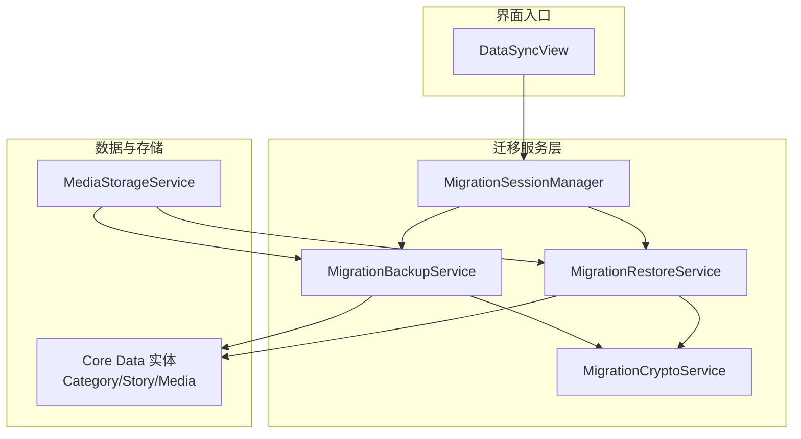
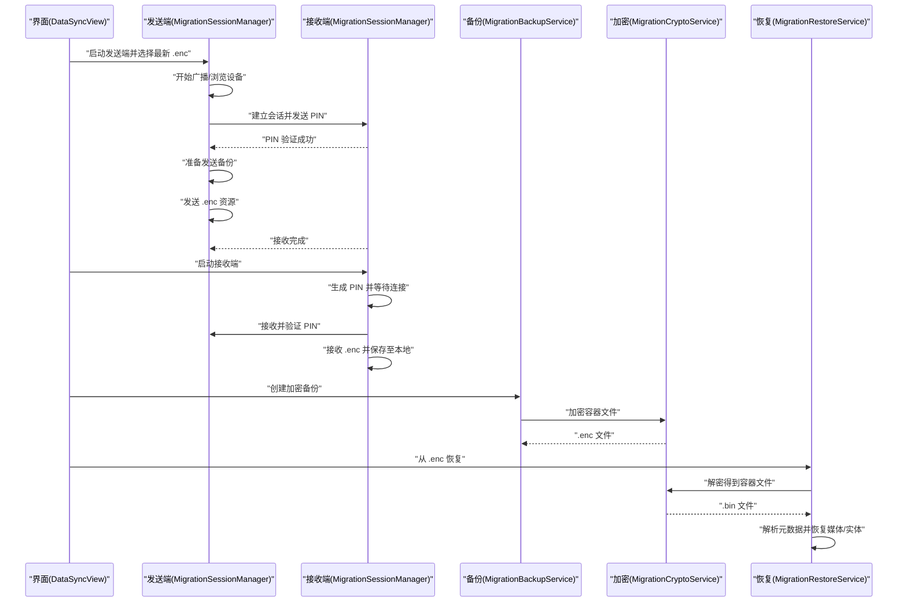
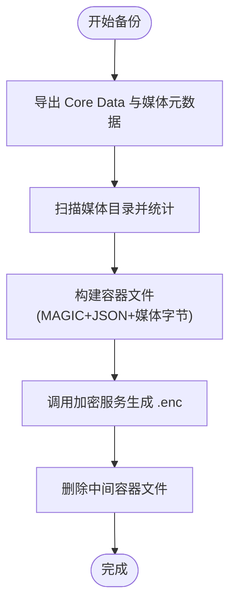
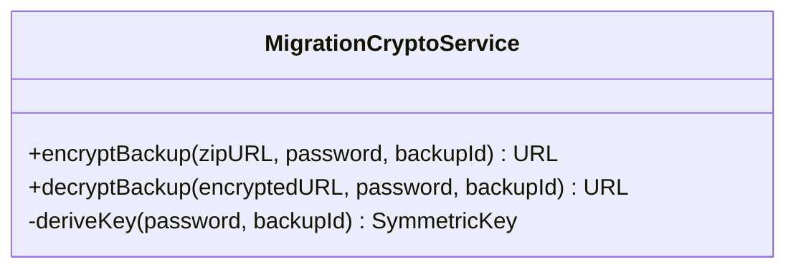
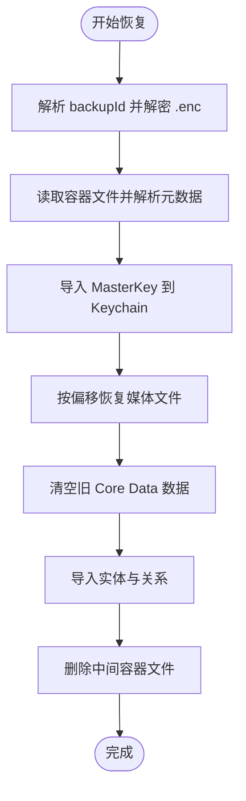
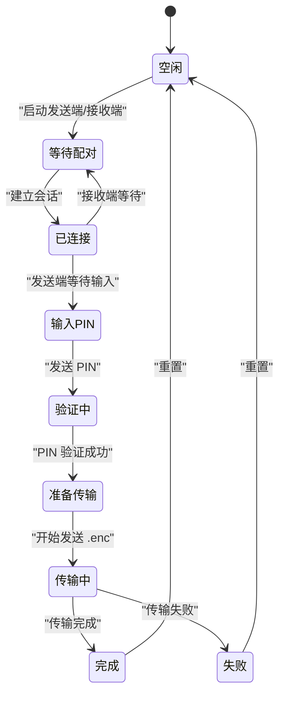
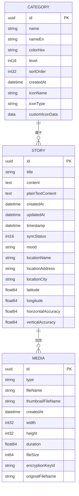
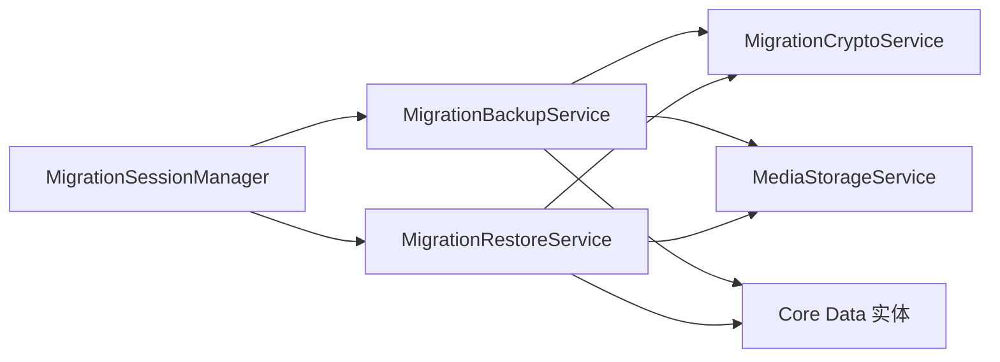

# 数据迁移服务

<cite>
**本文引用的文件**
- [MigrationBackupService.swift](file://MyStory/Services/MigrationBackupService.swift)
- [MigrationCryptoService.swift](file://MyStory/Services/MigrationCryptoService.swift)
- [MigrationRestoreService.swift](file://MyStory/Services/MigrationRestoreService.swift)
- [MigrationSessionManager.swift](file://MyStory/Services/MigrationSessionManager.swift)
- [MediaStorageService.swift](file://MyStory/Services/MediaStorageService.swift)
- [DataSyncView.swift](file://MyStory/Views/Settings/DataSyncView.swift)
- [CategoryEntity+CoreDataClass.swift](file://MyStory/Models/Entities/CategoryEntity+CoreDataClass.swift)
- [CategoryEntity+CoreDataProperties.swift](file://MyStory/Models/Entities/CategoryEntity+CoreDataProperties.swift)
- [StoryEntity+CoreDataClass.swift](file://MyStory/Models/Entities/StoryEntity+CoreDataClass.swift)
- [StoryEntity+CoreDataProperties.swift](file://MyStory/Models/Entities/StoryEntity+CoreDataProperties.swift)
- [MediaEntity+CoreDataClass.swift](file://MyStory/Models/Entities/MediaEntity+CoreDataClass.swift)
- [MediaEntity+CoreDataProperties.swift](file://MyStory/Models/Entities/MediaEntity+CoreDataProperties.swift)
</cite>

## 目录
1. [简介](#简介)
2. [项目结构](#项目结构)
3. [核心组件](#核心组件)
4. [架构总览](#架构总览)
5. [详细组件分析](#详细组件分析)
6. [依赖关系分析](#依赖关系分析)
7. [性能考虑](#性能考虑)
8. [故障排查指南](#故障排查指南)
9. [结论](#结论)
10. [附录](#附录)

## 简介
本技术文档围绕数据迁移服务展开，系统性阐述备份、加密、点对点传输与恢复的完整流程，以及迁移会话的生命周期管理、进度跟踪、错误恢复与一致性保障。文档重点覆盖以下服务的协同工作机制：
- MigrationBackupService：导出 Core Data 实体与媒体元数据，构建自定义容器文件，并调用加密服务生成 .enc 文件
- MigrationCryptoService：基于用户迁移密码与备份 ID 派生对称密钥，执行 AES-GCM 加解密
- MigrationRestoreService：从 .enc 解密得到容器文件，恢复 MasterKey、媒体文件与 Core Data 实体
- MigrationSessionManager：基于 MultipeerConnectivity 的点对点迁移会话，支持 PIN 验证与进度观察

此外，文档还说明了迁移安全策略（加密传输、完整性校验、版本兼容）、断点续传与错误恢复机制、进度反馈与取消操作、数据一致性与冲突解决、回滚策略、性能优化与并发控制、测试与故障诊断方法，以及最佳实践与常见问题。

## 项目结构
迁移相关代码主要位于 Services 目录，配合 Models/Entities 的 Core Data 实体与 Views/Settings 的界面入口。关键文件如下：
- Services：MigrationBackupService、MigrationCryptoService、MigrationRestoreService、MigrationSessionManager、MediaStorageService
- Models/Entities：CategoryEntity、StoryEntity、MediaEntity 的类与属性定义
- Views/Settings：DataSyncView 提供迁移 UI 与交互入口

图表来源
- [MigrationBackupService.swift](file://MyStory/Services/MigrationBackupService.swift#L1-L414)
- [MigrationRestoreService.swift](file://MyStory/Services/MigrationRestoreService.swift#L1-L383)
- [MigrationCryptoService.swift](file://MyStory/Services/MigrationCryptoService.swift#L1-L67)
- [MigrationSessionManager.swift](file://MyStory/Services/MigrationSessionManager.swift#L1-L374)
- [MediaStorageService.swift](file://MyStory/Services/MediaStorageService.swift#L1-L348)
- [DataSyncView.swift](file://MyStory/Views/Settings/DataSyncView.swift#L82-L531)
- [CategoryEntity+CoreDataProperties.swift](file://MyStory/Models/Entities/CategoryEntity+CoreDataProperties.swift#L15-L74)
- [StoryEntity+CoreDataProperties.swift](file://MyStory/Models/Entities/StoryEntity+CoreDataProperties.swift#L15-L76)
- [MediaEntity+CoreDataProperties.swift](file://MyStory/Models/Entities/MediaEntity+CoreDataProperties.swift#L15-L35)

章节来源
- [MigrationBackupService.swift](file://MyStory/Services/MigrationBackupService.swift#L1-L414)
- [MigrationRestoreService.swift](file://MyStory/Services/MigrationRestoreService.swift#L1-L383)
- [MigrationCryptoService.swift](file://MyStory/Services/MigrationCryptoService.swift#L1-L67)
- [MigrationSessionManager.swift](file://MyStory/Services/MigrationSessionManager.swift#L1-L374)
- [MediaStorageService.swift](file://MyStory/Services/MediaStorageService.swift#L1-L348)
- [DataSyncView.swift](file://MyStory/Views/Settings/DataSyncView.swift#L82-L531)

## 核心组件
- MigrationBackupService：负责导出 Core Data 实体与媒体元数据，构建自定义容器文件（含 JSON 元数据与媒体字节），随后调用加密服务生成 .enc 文件；提供进度回调，支持中间产物清理
- MigrationCryptoService：基于用户输入密码与 backupId 派生对称密钥，使用 AES-GCM 进行加解密，输出/输入 .enc/.bin 文件
- MigrationRestoreService：从 .enc 解密得到容器文件，解析元数据，恢复 MasterKey、媒体文件与 Core Data 实体；提供进度回调，支持中间产物清理
- MigrationSessionManager：基于 MultipeerConnectivity 的点对点迁移会话，支持角色切换（发送端/接收端）、PIN 验证、进度观察与错误状态上报
- MediaStorageService：媒体文件的加密存储与解密加载，为迁移过程中的媒体文件读写提供基础能力

章节来源
- [MigrationBackupService.swift](file://MyStory/Services/MigrationBackupService.swift#L115-L142)
- [MigrationCryptoService.swift](file://MyStory/Services/MigrationCryptoService.swift#L35-L65)
- [MigrationRestoreService.swift](file://MyStory/Services/MigrationRestoreService.swift#L108-L152)
- [MigrationSessionManager.swift](file://MyStory/Services/MigrationSessionManager.swift#L62-L106)
- [MediaStorageService.swift](file://MyStory/Services/MediaStorageService.swift#L14-L123)

## 架构总览
迁移流程分为“备份—加密—点对点传输—解密—恢复”五个阶段，各组件职责清晰、边界明确：

图表来源
- [DataSyncView.swift](file://MyStory/Views/Settings/DataSyncView.swift#L410-L531)
- [MigrationSessionManager.swift](file://MyStory/Services/MigrationSessionManager.swift#L62-L106)
- [MigrationBackupService.swift](file://MyStory/Services/MigrationBackupService.swift#L115-L142)
- [MigrationRestoreService.swift](file://MyStory/Services/MigrationRestoreService.swift#L108-L152)
- [MigrationCryptoService.swift](file://MyStory/Services/MigrationCryptoService.swift#L35-L65)

## 详细组件分析

### MigrationBackupService 分析
- 功能要点
  - 导出 Core Data 实体：Category、Story、Media 及其关系（Story-Category）
  - 扫描媒体目录，统计媒体文件与总大小，记录损坏文件计数
  - 导出 MasterKey（Base64 编码）并写入元数据
  - 构建自定义容器文件：MAGIC + JSON 长度 + JSON + 媒体字节
  - 调用加密服务生成 .enc 文件，删除中间容器文件
  - 提供多阶段进度回调（收集数据、构建容器、写媒体、加密、完成）

图表来源
- [MigrationBackupService.swift](file://MyStory/Services/MigrationBackupService.swift#L115-L142)
- [MigrationBackupService.swift](file://MyStory/Services/MigrationBackupService.swift#L146-L266)
- [MigrationBackupService.swift](file://MyStory/Services/MigrationBackupService.swift#L270-L327)
- [MigrationBackupService.swift](file://MyStory/Services/MigrationBackupService.swift#L352-L411)

章节来源
- [MigrationBackupService.swift](file://MyStory/Services/MigrationBackupService.swift#L115-L142)
- [MigrationBackupService.swift](file://MyStory/Services/MigrationBackupService.swift#L146-L266)
- [MigrationBackupService.swift](file://MyStory/Services/MigrationBackupService.swift#L270-L327)
- [MigrationBackupService.swift](file://MyStory/Services/MigrationBackupService.swift#L352-L411)

### MigrationCryptoService 分析
- 功能要点
  - 基于用户密码与 backupId 派生对称密钥（SHA-256 + AES-GCM）
  - 加密：读取容器文件，AES-GCM 加密封装，输出 .enc
  - 解密：读取 .enc，AES-GCM 开封，输出 .bin 容器文件
  - 错误类型：无效密码或数据损坏、IO 错误

图表来源
- [MigrationCryptoService.swift](file://MyStory/Services/MigrationCryptoService.swift#L5-L67)

章节来源
- [MigrationCryptoService.swift](file://MyStory/Services/MigrationCryptoService.swift#L11-L27)
- [MigrationCryptoService.swift](file://MyStory/Services/MigrationCryptoService.swift#L35-L45)
- [MigrationCryptoService.swift](file://MyStory/Services/MigrationCryptoService.swift#L53-L65)

### MigrationRestoreService 分析
- 功能要点
  - 从文件名解析 backupId
  - 解密得到容器文件，解析元数据（含媒体偏移）
  - 恢复 MasterKey 至 Keychain
  - 按偏移顺序读取媒体字节，重建媒体目录
  - 清空旧 Core Data 数据，导入新实体与关系（含二级回填父分类）
  - 删除中间容器文件，提供进度回调

图表来源
- [MigrationRestoreService.swift](file://MyStory/Services/MigrationRestoreService.swift#L108-L152)
- [MigrationRestoreService.swift](file://MyStory/Services/MigrationRestoreService.swift#L166-L206)
- [MigrationRestoreService.swift](file://MyStory/Services/MigrationRestoreService.swift#L229-L279)
- [MigrationRestoreService.swift](file://MyStory/Services/MigrationRestoreService.swift#L283-L380)

章节来源
- [MigrationRestoreService.swift](file://MyStory/Services/MigrationRestoreService.swift#L108-L152)
- [MigrationRestoreService.swift](file://MyStory/Services/MigrationRestoreService.swift#L166-L206)
- [MigrationRestoreService.swift](file://MyStory/Services/MigrationRestoreService.swift#L229-L279)
- [MigrationRestoreService.swift](file://MyStory/Services/MigrationRestoreService.swift#L283-L380)

### MigrationSessionManager 分析
- 角色与状态
  - 角色：sender（发送端）、receiver（接收端）
  - 状态：idle、waitingForPeer、connected、pinWaitingInput、pinVerifying、readyToTransfer、transferring、completed、failed
- 功能要点
  - 发送端：搜索对端、建立会话、发送 PIN、验证成功后发送 .enc 资源
  - 接收端：生成 PIN、等待连接、接收并验证 PIN、保存 .enc 至本地
  - 进度观察：对资源传输与接收进度进行 KVO 观察，实时更新状态
  - 错误处理：统一错误信息与失败状态上报

图表来源
- [MigrationSessionManager.swift](file://MyStory/Services/MigrationSessionManager.swift#L11-L21)
- [MigrationSessionManager.swift](file://MyStory/Services/MigrationSessionManager.swift#L62-L106)
- [MigrationSessionManager.swift](file://MyStory/Services/MigrationSessionManager.swift#L144-L176)
- [MigrationSessionManager.swift](file://MyStory/Services/MigrationSessionManager.swift#L239-L333)

章节来源
- [MigrationSessionManager.swift](file://MyStory/Services/MigrationSessionManager.swift#L62-L106)
- [MigrationSessionManager.swift](file://MyStory/Services/MigrationSessionManager.swift#L144-L176)
- [MigrationSessionManager.swift](file://MyStory/Services/MigrationSessionManager.swift#L239-L333)

### 数据模型与关系
- 实体关系
  - Story 与 Category 多对多（NSSet）
  - Media 与 Story 多对一（可选关系）
  - Category 支持父子层级（parent/children）

图表来源
- [CategoryEntity+CoreDataProperties.swift](file://MyStory/Models/Entities/CategoryEntity+CoreDataProperties.swift#L15-L74)
- [StoryEntity+CoreDataProperties.swift](file://MyStory/Models/Entities/StoryEntity+CoreDataProperties.swift#L15-L76)
- [MediaEntity+CoreDataProperties.swift](file://MyStory/Models/Entities/MediaEntity+CoreDataProperties.swift#L15-L35)

章节来源
- [CategoryEntity+CoreDataClass.swift](file://MyStory/Models/Entities/CategoryEntity+CoreDataClass.swift#L14-L17)
- [CategoryEntity+CoreDataProperties.swift](file://MyStory/Models/Entities/CategoryEntity+CoreDataProperties.swift#L15-L74)
- [StoryEntity+CoreDataClass.swift](file://MyStory/Models/Entities/StoryEntity+CoreDataClass.swift#L12-L50)
- [StoryEntity+CoreDataProperties.swift](file://MyStory/Models/Entities/StoryEntity+CoreDataProperties.swift#L15-L76)
- [MediaEntity+CoreDataClass.swift](file://MyStory/Models/Entities/MediaEntity+CoreDataClass.swift#L11-L14)
- [MediaEntity+CoreDataProperties.swift](file://MyStory/Models/Entities/MediaEntity+CoreDataProperties.swift#L15-L35)

## 依赖关系分析
- 组件耦合
  - MigrationBackupService 与 MigrationRestoreService 共享 BackupPayload 结构，确保元数据一致性
  - MigrationSessionManager 与 MigrationBackupService/RestoreService 协同工作，前者负责传输，后者负责数据处理
  - MigrationCryptoService 作为通用加解密模块，被备份与恢复流程共同调用
  - MediaStorageService 为媒体文件的读写提供基础能力，与备份/恢复流程中的媒体处理相辅相成

图表来源
- [MigrationSessionManager.swift](file://MyStory/Services/MigrationSessionManager.swift#L1-L374)
- [MigrationBackupService.swift](file://MyStory/Services/MigrationBackupService.swift#L1-L414)
- [MigrationRestoreService.swift](file://MyStory/Services/MigrationRestoreService.swift#L1-L383)
- [MigrationCryptoService.swift](file://MyStory/Services/MigrationCryptoService.swift#L1-L67)
- [MediaStorageService.swift](file://MyStory/Services/MediaStorageService.swift#L1-L348)

章节来源
- [MigrationSessionManager.swift](file://MyStory/Services/MigrationSessionManager.swift#L1-L374)
- [MigrationBackupService.swift](file://MyStory/Services/MigrationBackupService.swift#L1-L414)
- [MigrationRestoreService.swift](file://MyStory/Services/MigrationRestoreService.swift#L1-L383)
- [MigrationCryptoService.swift](file://MyStory/Services/MigrationCryptoService.swift#L1-L67)
- [MediaStorageService.swift](file://MyStory/Services/MediaStorageService.swift#L1-L348)

## 性能考虑
- I/O 与内存
  - 备份/恢复媒体文件采用分块读取（如 64KB），减少峰值内存占用
  - 容器文件采用顺序写入与偏移记录，避免一次性加载全部媒体
- 加密与解密
  - 使用 AES-GCM，具备认证加密特性，适合大体量数据
  - 密钥派生结合 backupId，确保同一备份文件与密码组合的唯一性
- 并发与线程
  - Core Data 操作通过 performAndWait 在后台队列执行，避免主线程阻塞
  - 界面进度与错误提示在主线程更新，保证 UI 响应
- 资源管理
  - 中间产物（.bin 容器文件）及时清理，避免磁盘空间浪费
  - 传输进度通过 KVO 观察，避免重复订阅导致的资源泄漏

章节来源
- [MigrationBackupService.swift](file://MyStory/Services/MigrationBackupService.swift#L394-L408)
- [MigrationRestoreService.swift](file://MyStory/Services/MigrationRestoreService.swift#L257-L264)
- [MigrationRestoreService.swift](file://MyStory/Services/MigrationRestoreService.swift#L283-L301)
- [MigrationSessionManager.swift](file://MyStory/Services/MigrationSessionManager.swift#L170-L175)

## 故障排查指南
- 常见错误与定位
  - 备份/恢复进度卡住：检查媒体目录是否存在、文件权限与磁盘空间
  - 解密失败：确认密码正确、backupId 与 .enc 文件匹配、文件未被篡改
  - 传输中断：MultipeerConnectivity 状态变化，检查网络与蓝牙权限
  - Core Data 导入异常：核对实体映射与关系导入顺序（先导入实体，再设置父分类）
- 日志与调试
  - 各服务打印关键步骤日志（如扫描媒体、写入媒体、删除中间文件等），便于定位问题
  - 使用 DataSyncView 的 Toast 与状态栏显示错误信息，便于用户反馈
- 回滚与清理
  - 恢复成功后可清理迁移备份目录，避免残留文件影响后续操作
  - 会话失败时调用 reset() 重置状态，避免竞态条件

章节来源
- [MigrationBackupService.swift](file://MyStory/Services/MigrationBackupService.swift#L285-L326)
- [MigrationRestoreService.swift](file://MyStory/Services/MigrationRestoreService.swift#L175-L191)
- [MigrationSessionManager.swift](file://MyStory/Services/MigrationSessionManager.swift#L350-L372)
- [DataSyncView.swift](file://MyStory/Views/Settings/DataSyncView.swift#L397-L406)

## 结论
该数据迁移服务通过“备份—加密—传输—解密—恢复”的闭环设计，实现了端到端的安全与可靠性。MigrationBackupService、MigrationCryptoService、MigrationRestoreService 与 MigrationSessionManager 协同工作，既满足了用户对易用性的要求，也兼顾了安全性与性能。建议在生产环境中进一步完善断点续传、版本兼容与冲突解决策略，并持续优化媒体处理与并发控制。

## 附录

### 数据迁移安全策略
- 加密传输
  - 使用 AES-GCM 对 .enc 文件进行认证加密，确保机密性与完整性
  - 密钥派生结合 backupId，提升抗暴力破解能力
- 完整性校验
  - 解密过程中捕获异常并抛出“无效密码或数据损坏”错误
  - 容器文件包含 MAGIC 标识与 JSON 长度字段，便于快速校验
- 版本兼容性
  - 元数据包含 appVersion 与 schemaVersion，便于未来版本演进与兼容判断

章节来源
- [MigrationCryptoService.swift](file://MyStory/Services/MigrationCryptoService.swift#L35-L65)
- [MigrationBackupService.swift](file://MyStory/Services/MigrationBackupService.swift#L240-L242)
- [MigrationRestoreService.swift](file://MyStory/Services/MigrationRestoreService.swift#L175-L191)

### 迁移会话生命周期与进度跟踪
- 生命周期
  - 发送端：广播/浏览设备 → 建立会话 → 输入 PIN → 验证 → 准备传输 → 发送 .enc → 完成/失败
  - 接收端：生成 PIN → 等待连接 → 接收 PIN → 验证 → 接收 .enc → 保存 → 完成/失败
- 进度跟踪
  - 传输进度通过 KVO 观察 Progress.fractionCompleted，实时更新 UI
  - 备份/恢复阶段提供多步进度回调，便于用户感知整体进度

章节来源
- [MigrationSessionManager.swift](file://MyStory/Services/MigrationSessionManager.swift#L62-L106)
- [MigrationSessionManager.swift](file://MyStory/Services/MigrationSessionManager.swift#L272-L284)
- [MigrationBackupService.swift](file://MyStory/Services/MigrationBackupService.swift#L118-L140)
- [MigrationRestoreService.swift](file://MyStory/Services/MigrationRestoreService.swift#L115-L151)

### 断点续传与错误恢复机制
- 断点续传
  - 当前实现以整文件传输为主，建议在后续版本引入基于偏移的增量传输与校验
- 错误恢复
  - 会话失败时统一进入 failed 状态并提供人类可读错误信息
  - 恢复流程中遇到 IO 或解密错误，立即终止并提示用户重新尝试

章节来源
- [MigrationSessionManager.swift](file://MyStory/Services/MigrationSessionManager.swift#L240-L264)
- [MigrationCryptoService.swift](file://MyStory/Services/MigrationCryptoService.swift#L62-L65)

### 数据一致性保证、冲突解决与回滚策略
- 一致性
  - 恢复前清空旧 Core Data 数据，避免脏数据污染
  - 实体导入顺序合理，关系导入后进行第二轮父分类设置
- 冲突解决
  - 建议在后续版本增加时间戳/版本号比较，优先保留较新数据
- 回滚策略
  - 建议在恢复前创建数据库快照，失败时回滚至快照状态

章节来源
- [MigrationRestoreService.swift](file://MyStory/Services/MigrationRestoreService.swift#L283-L301)
- [MigrationRestoreService.swift](file://MyStory/Services/MigrationRestoreService.swift#L370-L376)

### 性能优化、并发控制与资源管理
- 性能优化
  - 媒体文件分块读写，降低内存峰值
  - AES-GCM 适配大文件，缩短处理时间
- 并发控制
  - Core Data 操作在后台队列执行，UI 更新在主线程
- 资源管理
  - 及时清理中间文件，避免磁盘占用

章节来源
- [MigrationBackupService.swift](file://MyStory/Services/MigrationBackupService.swift#L394-L408)
- [MigrationRestoreService.swift](file://MyStory/Services/MigrationRestoreService.swift#L257-L264)
- [MigrationRestoreService.swift](file://MyStory/Services/MigrationRestoreService.swift#L147-L149)

### 测试方法、模拟环境与故障诊断工具
- 测试方法
  - 使用 DataSyncView 的“创建备份/恢复”按钮进行端到端测试
  - 通过 MigrationSessionManager 的状态变化验证会话流程
- 模拟环境
  - 使用固定密码进行自动化测试，便于重现问题
- 故障诊断
  - 查看服务日志与 Toast 提示，定位具体环节
  - 检查迁移备份目录与 Keychain 中的 MasterKey

章节来源
- [DataSyncView.swift](file://MyStory/Views/Settings/DataSyncView.swift#L410-L531)
- [MigrationSessionManager.swift](file://MyStory/Services/MigrationSessionManager.swift#L239-L333)

### 最佳实践与常见问题
- 最佳实践
  - 备份前确保网络稳定与设备电量充足
  - 使用强密码并妥善保管，避免遗忘
  - 恢复完成后及时清理迁移备份目录
- 常见问题
  - PIN 验证失败：检查双方输入一致且无多余空白字符
  - 媒体文件缺失：检查媒体目录权限与磁盘空间
  - 传输失败：重启蓝牙与网络，重新发起会话

章节来源
- [DataSyncView.swift](file://MyStory/Views/Settings/DataSyncView.swift#L295-L333)
- [MigrationSessionManager.swift](file://MyStory/Services/MigrationSessionManager.swift#L189-L204)