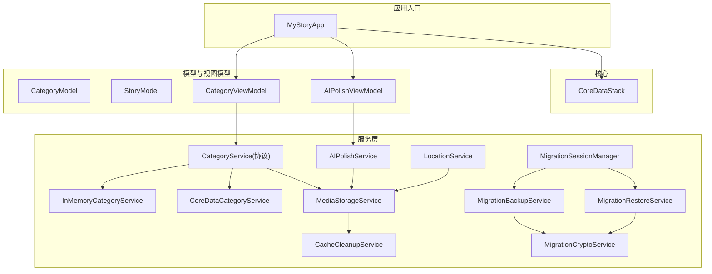
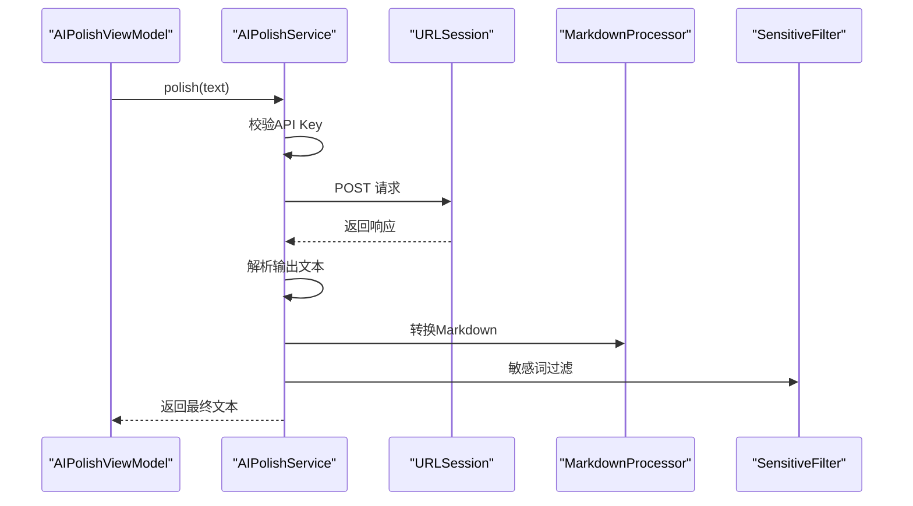
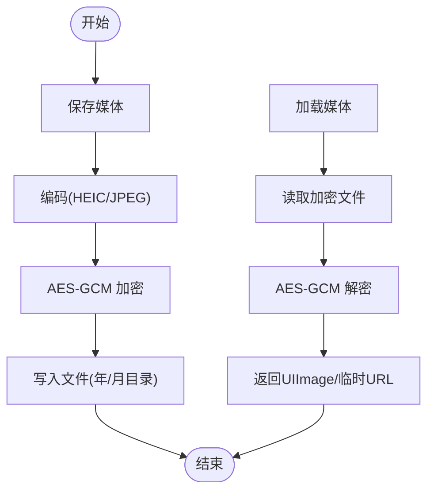
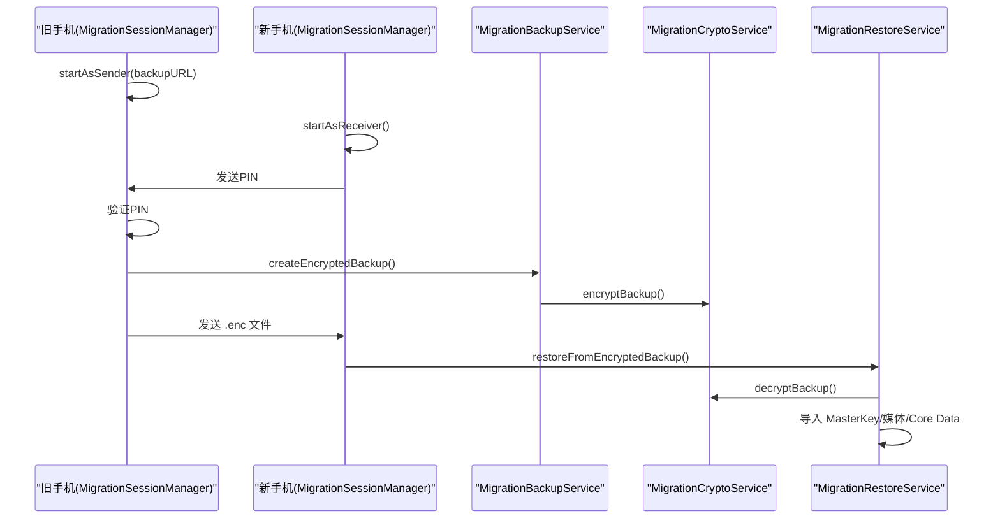
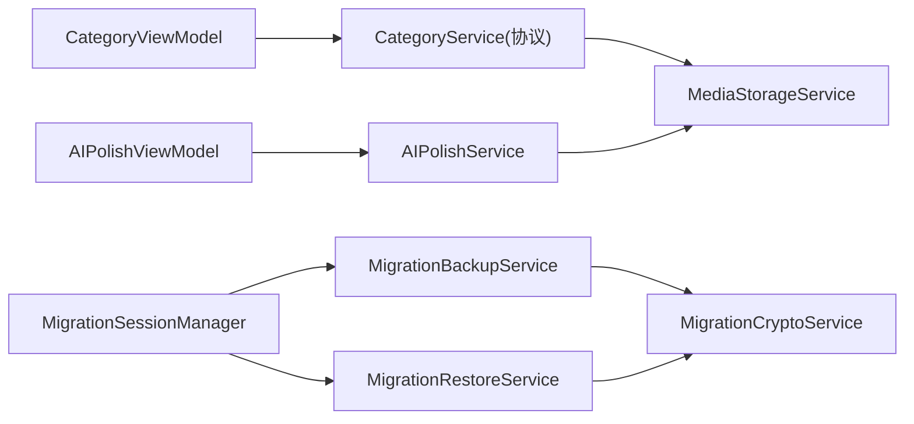

# 服务层架构

<cite>
**本文档引用的文件**
- [AIPolishService.swift](file://MyStory/Services/AIService/AIPolishService.swift)
- [CategoryService.swift](file://MyStory/Services/CategoryService/CategoryService.swift)
- [LocationService.swift](file://MyStory/Services/LocationService.swift)
- [MediaStorageService.swift](file://MyStory/Services/MediaStorageService.swift)
- [CacheCleanupService.swift](file://MyStory/Services/CacheCleanupService.swift)
- [MigrationBackupService.swift](file://MyStory/Services/MigrationBackupService.swift)
- [MigrationCryptoService.swift](file://MyStory/Services/MigrationCryptoService.swift)
- [MigrationRestoreService.swift](file://MyStory/Services/MigrationRestoreService.swift)
- [MigrationSessionManager.swift](file://MyStory/Services/MigrationSessionManager.swift)
- [CoreDataStack.swift](file://MyStory/Core/Storage/CoreDataStack.swift)
- [CategoryModel.swift](file://MyStory/Models/Category/CategoryModel.swift)
- [StoryModel.swift](file://MyStory/Models/ViewModels/StoryModel.swift)
- [CategoryViewModel.swift](file://MyStory/ViewModels/Category/CategoryViewModel.swift)
- [AIPolishViewModel.swift](file://MyStory/ViewModels/Editor/AIPolishViewModel.swift)
- [MyStoryApp.swift](file://MyStory/App/MyStoryApp.swift)
</cite>

## 目录
1. [简介](#简介)
2. [项目结构](#项目结构)
3. [核心组件](#核心组件)
4. [架构总览](#架构总览)
5. [详细组件分析](#详细组件分析)
6. [依赖分析](#依赖分析)
7. [性能考虑](#性能考虑)
8. [故障排查指南](#故障排查指南)
9. [结论](#结论)
10. [附录](#附录)

## 简介
本文件面向 MyStory 的服务层，系统化梳理业务服务的设计原则与实现模式，覆盖 AI 服务、分类服务、位置服务、媒体存储服务以及迁移与缓存清理等核心模块。文档重点阐述：
- 服务层职责分离与依赖注入机制
- 错误处理策略与异常分支
- 接口定义、参数与返回值规范
- 服务间协调、异步处理与性能优化
- 可测试性设计、Mock 实现与集成测试方法
- 扩展与定制的最佳实践

## 项目结构
MyStory 采用 MVVM + 路由模式，服务层位于 Services 目录，围绕业务域划分模块，配合 Core Data 存储栈与 SwiftUI 视图模型协同工作。

图表来源
- [MyStoryApp.swift](file://MyStory/App/MyStoryApp.swift#L1-L31)
- [CoreDataStack.swift](file://MyStory/Core/Storage/CoreDataStack.swift#L1-L382)
- [CategoryService.swift](file://MyStory/Services/CategoryService/CategoryService.swift#L22-L90)
- [AIPolishService.swift](file://MyStory/Services/AIService/AIPolishService.swift#L1-L77)
- [LocationService.swift](file://MyStory/Services/LocationService.swift#L1-L55)
- [MediaStorageService.swift](file://MyStory/Services/MediaStorageService.swift#L1-L348)
- [CacheCleanupService.swift](file://MyStory/Services/CacheCleanupService.swift#L1-L263)
- [MigrationSessionManager.swift](file://MyStory/Services/MigrationSessionManager.swift#L1-L374)
- [MigrationBackupService.swift](file://MyStory/Services/MigrationBackupService.swift#L1-L414)
- [MigrationRestoreService.swift](file://MyStory/Services/MigrationRestoreService.swift#L1-L383)
- [MigrationCryptoService.swift](file://MyStory/Services/MigrationCryptoService.swift#L1-L67)
- [CategoryModel.swift](file://MyStory/Models/Category/CategoryModel.swift#L1-L23)
- [StoryModel.swift](file://MyStory/Models/ViewModels/StoryModel.swift#L1-L29)
- [CategoryViewModel.swift](file://MyStory/ViewModels/Category/CategoryViewModel.swift#L1-L103)
- [AIPolishViewModel.swift](file://MyStory/ViewModels/Editor/AIPolishViewModel.swift#L1-L46)

章节来源
- [MyStoryApp.swift](file://MyStory/App/MyStoryApp.swift#L1-L31)
- [CoreDataStack.swift](file://MyStory/Core/Storage/CoreDataStack.swift#L1-L382)

## 核心组件
- 分类服务（CategoryService）：抽象协议定义查询、增删改、统计与搜索能力；提供内存实现与 Core Data 实现，满足不同场景需求。
- AI 润色服务（AIPolishService）：封装外部 API 调用，负责请求构造、鉴权、响应解析与内容过滤。
- 位置服务（LocationService）：封装定位与逆地理编码，提供位置信息结构化输出。
- 媒体存储服务（MediaStorageService）：负责图片/视频的加密存储、缩略图生成、解密读取与临时文件管理。
- 缓存清理服务（CacheCleanupService）：扫描并清理临时文件与缓存，保障磁盘空间。
- 迁移服务（Migration*）：提供备份、加密、解密、恢复与点对点传输的完整链路。
- 视图模型（CategoryViewModel、AIPolishViewModel）：作为服务层消费者，负责状态管理与 UI 协调。

章节来源
- [CategoryService.swift](file://MyStory/Services/CategoryService/CategoryService.swift#L22-L90)
- [AIPolishService.swift](file://MyStory/Services/AIService/AIPolishService.swift#L1-L77)
- [LocationService.swift](file://MyStory/Services/LocationService.swift#L1-L55)
- [MediaStorageService.swift](file://MyStory/Services/MediaStorageService.swift#L1-L348)
- [CacheCleanupService.swift](file://MyStory/Services/CacheCleanupService.swift#L1-L263)
- [MigrationBackupService.swift](file://MyStory/Services/MigrationBackupService.swift#L1-L414)
- [MigrationRestoreService.swift](file://MyStory/Services/MigrationRestoreService.swift#L1-L383)
- [MigrationSessionManager.swift](file://MyStory/Services/MigrationSessionManager.swift#L1-L374)
- [MigrationCryptoService.swift](file://MyStory/Services/MigrationCryptoService.swift#L1-L67)
- [CategoryViewModel.swift](file://MyStory/ViewModels/Category/CategoryViewModel.swift#L1-L103)
- [AIPolishViewModel.swift](file://MyStory/ViewModels/Editor/AIPolishViewModel.swift#L1-L46)

## 架构总览
服务层遵循“协议隔离 + 多实现”的设计，通过依赖注入将具体实现注入到视图模型中，从而实现：
- 职责分离：UI 层只依赖协议，不关心具体实现细节
- 可测试性：可在测试环境中注入 Mock 实现
- 可扩展性：新增实现无需修改上层逻辑

```mermaid
classDiagram
class CategoryService {
+fetchTree() [CategoryTreeNode]
+fetchCategory(id) CategoryEntity?
+fetchCategories(level) [CategoryEntity]
+fetchChildren(parentId) [CategoryEntity]
+addCategory(...)
+updateCategory(...)
+deleteCategory(...)
+deleteCategoryRecursively(id, mediaService)
+storyCount(for) Int
+totalStoryCount(for) Int
+childrenCount(for) Int
+searchStories(keyword) [CategorySearchResult]
}
class InMemoryCategoryService {
-categories : [UUID : CategoryModel]
-childrenMap : [UUID : [UUID]]
-storyCounts : [UUID : Int]
}
class CoreDataCategoryService {
-context : NSManagedObjectContext
}
class AIPolishService {
-keychain : KeychainProviding
-endpoint : URL
+polish(text, completion)
-parseOutputText(from)
}
class LocationService {
+requestCurrentLocation(completion)
-reverseGeocode(location, completion)
}
class MediaStorageService {
+saveImage(image) String
+saveImageWithThumbnail(image) (String, String)
+url(for, type) URL?
+loadImage(fileName) UIImage?
+loadVideoThumbnail(fileName) UIImage?
+saveVideo(sourceURL) (String, String)
+loadVideoURL(fileName) URL?
}
class CacheCleanupService {
+cleanupCache() CleanupResult
+calculateCacheSize() Int64
}
class MigrationSessionManager {
+startAsReceiver()
+startAsSender(backupURL)
+sendPIN(input)
+reset()
}
class MigrationBackupService {
+createEncryptedBackup(password, progressHandler)
}
class MigrationRestoreService {
+restoreFromEncryptedBackup(encryptedURL, password, progressHandler)
}
class MigrationCryptoService {
+encryptBackup(zipURL, password, backupId)
+decryptBackup(encryptedURL, password, backupId)
}
CategoryService <|.. InMemoryCategoryService
CategoryService <|.. CoreDataCategoryService
```

图表来源
- [CategoryService.swift](file://MyStory/Services/CategoryService/CategoryService.swift#L22-L90)
- [AIPolishService.swift](file://MyStory/Services/AIService/AIPolishService.swift#L8-L77)
- [LocationService.swift](file://MyStory/Services/LocationService.swift#L4-L55)
- [MediaStorageService.swift](file://MyStory/Services/MediaStorageService.swift#L8-L224)
- [CacheCleanupService.swift](file://MyStory/Services/CacheCleanupService.swift#L10-L263)
- [MigrationSessionManager.swift](file://MyStory/Services/MigrationSessionManager.swift#L5-L374)
- [MigrationBackupService.swift](file://MyStory/Services/MigrationBackupService.swift#L6-L414)
- [MigrationRestoreService.swift](file://MyStory/Services/MigrationRestoreService.swift#L6-L383)
- [MigrationCryptoService.swift](file://MyStory/Services/MigrationCryptoService.swift#L5-L67)

## 详细组件分析

### 分类服务（CategoryService）
- 设计要点
  - 协议抽象：统一查询、增删改、统计与搜索接口，便于替换实现
  - 双实现：内存实现用于演示与测试；Core Data 实现用于持久化
  - 递归删除：结合媒体服务清理媒体文件，保证数据一致性
- 接口定义
  - 查询：树形结构、按层级/父节点查询
  - 增删改：名称、图标、颜色、自定义图标开关
  - 统计：子项与故事数量
  - 搜索：关键词匹配故事，返回带路径的结果集
- 错误处理
  - 层级越界、数量上限、存在关联故事、父层级不匹配、未找到等
- 性能优化
  - Core Data 预加载关系，避免 Fault 导致的二次查询
  - 递归统计时缓存中间结果，减少重复计算
- 可测试性
  - 提供内存实现，便于单元测试
  - 视图模型通过依赖注入使用协议，支持 Mock

章节来源
- [CategoryService.swift](file://MyStory/Services/CategoryService/CategoryService.swift#L22-L90)
- [CategoryService.swift](file://MyStory/Services/CategoryService/CategoryService.swift#L189-L675)
- [CategoryModel.swift](file://MyStory/Models/Category/CategoryModel.swift#L1-L23)
- [CategoryViewModel.swift](file://MyStory/ViewModels/Category/CategoryViewModel.swift#L1-L103)

### AI 润色服务（AIPolishService）
- 设计要点
  - 外部 API 调用：构造请求体、设置 Authorization 头、超时控制
  - 响应解析：兼容多种返回结构，失败回退原文
  - 内容处理：Markdown 转换、敏感词过滤
  - 速率限制：每分钟请求数控制
- 接口定义
  - polish(text: String, completion: (Result<String, Error>) -> Void)
- 错误处理
  - 未配置 API Key、网络错误、空响应、解析失败
- 性能优化
  - 异步网络请求，避免阻塞主线程
  - 解析失败回退原文，提升鲁棒性
- 可测试性
  - 通过 KeychainProviding 抽象注入，便于 Mock

图表来源
- [AIPolishService.swift](file://MyStory/Services/AIService/AIPolishService.swift#L30-L61)
- [AIPolishViewModel.swift](file://MyStory/ViewModels/Editor/AIPolishViewModel.swift#L18-L39)

章节来源
- [AIPolishService.swift](file://MyStory/Services/AIService/AIPolishService.swift#L1-L77)
- [AIPolishViewModel.swift](file://MyStory/ViewModels/Editor/AIPolishViewModel.swift#L1-L46)

### 位置服务（LocationService）
- 设计要点
  - CLLocationManager 封装，授权与精度控制
  - CLGeocoder 逆地理编码，组装 LocationInfo
- 接口定义
  - requestCurrentLocation(completion: (LocationInfo?) -> Void)
- 错误处理
  - 定位失败、反向地理编码失败
- 性能优化
  - 最佳精度与一次性请求，避免频繁定位

章节来源
- [LocationService.swift](file://MyStory/Services/LocationService.swift#L1-L55)

### 媒体存储服务（MediaStorageService）
- 设计要点
  - 加密存储：AES-GCM，KeyManager 基于 Keychain 的派生密钥
  - 图片/视频：HEIC/JPEG 编码、缩略图生成、封面提取
  - 路径组织：年/月维度分目录，避免单目录过大
  - 临时文件：视频播放前解密至临时目录
- 接口定义
  - saveImage、saveImageWithThumbnail、url、loadImage、loadVideoThumbnail、saveVideo、loadVideoURL
- 错误处理
  - 编码失败、解密失败、Keychain 读写失败
- 性能优化
  - 缩略图按最大边缩放，避免大图渲染
  - 视频封面使用快速模式与近似时间点，提升生成速度

图表来源
- [MediaStorageService.swift](file://MyStory/Services/MediaStorageService.swift#L14-L123)

章节来源
- [MediaStorageService.swift](file://MyStory/Services/MediaStorageService.swift#L1-L348)

### 缓存清理服务（CacheCleanupService）
- 设计要点
  - 扫描 Documents、Temp、Caches 目录，识别临时文件与压缩包
  - 安全过滤：排除 Media、SQLite、特定扩展名
  - 统计空间回收量，提供清理结果
- 接口定义
  - cleanupCache() -> CleanupResult
  - calculateCacheSize() -> Int64
- 错误处理
  - 文件读取/删除失败记录错误列表

章节来源
- [CacheCleanupService.swift](file://MyStory/Services/CacheCleanupService.swift#L1-L263)

### 迁移服务（Migration*）
- 设计要点
  - 备份：导出 Core Data 实体与媒体元数据，打包容器文件，加密生成 .enc
  - 恢复：解密 .enc 为容器，导入 MasterKey、媒体文件与 Core Data
  - 传输：MultipeerConnectivity 点对点会话，PIN 验证，进度回调
- 接口定义
  - MigrationSessionManager：启动发送/接收、PIN 验证、进度观察
  - MigrationBackupService：createEncryptedBackup(password, progressHandler)
  - MigrationRestoreService：restoreFromEncryptedBackup(encryptedURL, password, progressHandler)
  - MigrationCryptoService：encryptBackup/decryptBackup
- 错误处理
  - 格式不正确、解密失败、Keychain 写入失败、媒体缺失

图表来源
- [MigrationSessionManager.swift](file://MyStory/Services/MigrationSessionManager.swift#L62-L176)
- [MigrationBackupService.swift](file://MyStory/Services/MigrationBackupService.swift#L115-L142)
- [MigrationRestoreService.swift](file://MyStory/Services/MigrationRestoreService.swift#L108-L152)
- [MigrationCryptoService.swift](file://MyStory/Services/MigrationCryptoService.swift#L35-L65)

章节来源
- [MigrationSessionManager.swift](file://MyStory/Services/MigrationSessionManager.swift#L1-L374)
- [MigrationBackupService.swift](file://MyStory/Services/MigrationBackupService.swift#L1-L414)
- [MigrationRestoreService.swift](file://MyStory/Services/MigrationRestoreService.swift#L1-L383)
- [MigrationCryptoService.swift](file://MyStory/Services/MigrationCryptoService.swift#L1-L67)

## 依赖分析
- 视图模型依赖服务协议，通过初始化注入具体实现
- 分类服务依赖媒体存储服务执行递归删除
- AI 服务依赖 Keychain 提供者与媒体存储服务的辅助（Markdown/敏感词）
- 迁移服务链路内部协作，Session 管理器驱动备份/恢复流程

图表来源
- [CategoryViewModel.swift](file://MyStory/ViewModels/Category/CategoryViewModel.swift#L25-L70)
- [AIPolishViewModel.swift](file://MyStory/ViewModels/Editor/AIPolishViewModel.swift#L10-L39)
- [CategoryService.swift](file://MyStory/Services/CategoryService/CategoryService.swift#L33-L33)
- [AIPolishService.swift](file://MyStory/Services/AIService/AIPolishService.swift#L9-L14)
- [MigrationSessionManager.swift](file://MyStory/Services/MigrationSessionManager.swift#L89-L106)
- [MigrationBackupService.swift](file://MyStory/Services/MigrationBackupService.swift#L106-L142)
- [MigrationRestoreService.swift](file://MyStory/Services/MigrationRestoreService.swift#L108-L152)
- [MigrationCryptoService.swift](file://MyStory/Services/MigrationCryptoService.swift#L5-L67)

章节来源
- [CategoryViewModel.swift](file://MyStory/ViewModels/Category/CategoryViewModel.swift#L1-L103)
- [AIPolishViewModel.swift](file://MyStory/ViewModels/Editor/AIPolishViewModel.swift#L1-L46)
- [CategoryService.swift](file://MyStory/Services/CategoryService/CategoryService.swift#L22-L90)
- [AIPolishService.swift](file://MyStory/Services/AIService/AIPolishService.swift#L1-L77)
- [MigrationSessionManager.swift](file://MyStory/Services/MigrationSessionManager.swift#L1-L374)

## 性能考虑
- 分类服务
  - 预加载关系，减少 Fault 导致的多次查询
  - 递归统计时避免深层遍历，必要时缓存中间结果
- 媒体服务
  - 缩略图按最大边缩放，避免大图渲染
  - 视频封面使用快速模式与近似时间点
  - 临时文件及时清理，避免占用磁盘
- AI 服务
  - 异步请求，避免阻塞 UI
  - 速率限制，防止触发外部限流
- 迁移服务
  - 分块读写媒体文件，监控进度
  - 加密/解密采用 GCM 模式，兼顾安全与性能

[本节为通用指导，无需列出章节来源]

## 故障排查指南
- API Key 未配置
  - 现象：AI 润色失败，错误码 401
  - 处理：在 Keychain 提供者中设置有效 Key
- 网络/解析失败
  - 现象：空响应或解析失败
  - 处理：检查 Endpoint、请求体与返回结构兼容性
- 媒体文件损坏/缺失
  - 现象：加载失败或迁移恢复中断
  - 处理：检查加密密钥、Keychain 权限与文件路径
- 定位失败
  - 现象：位置信息为空
  - 处理：检查权限与设备定位服务
- 迁移 PIN 验证失败
  - 现象：会话状态停留在验证阶段
  - 处理：确认双方 PIN 一致与 MultipeerConnectivity 权限

章节来源
- [AIPolishService.swift](file://MyStory/Services/AIService/AIPolishService.swift#L30-L61)
- [MediaStorageService.swift](file://MyStory/Services/MediaStorageService.swift#L194-L207)
- [MigrationSessionManager.swift](file://MyStory/Services/MigrationSessionManager.swift#L188-L220)
- [LocationService.swift](file://MyStory/Services/LocationService.swift#L42-L53)

## 结论
MyStory 服务层通过协议抽象与多实现策略实现了良好的可测试性与可扩展性；在性能方面针对 IO 与网络进行了针对性优化；在可靠性方面提供了完善的错误处理与回退策略。建议在后续迭代中持续完善测试覆盖率与监控埋点，进一步增强可观测性与稳定性。

[本节为总结性内容，无需列出章节来源]

## 附录

### 服务接口与参数说明（摘要）
- 分类服务（CategoryService）
  - 查询：fetchTree、fetchCategory、fetchCategories、fetchChildren
  - 增删改：addCategory、updateCategory、deleteCategory、deleteCategoryRecursively
  - 统计：storyCount、totalStoryCount、childrenCount
  - 搜索：searchStories
- AI 润色服务（AIPolishService）
  - polish(text: String, completion: (Result<String, Error>) -> Void)
- 位置服务（LocationService）
  - requestCurrentLocation(completion: (LocationInfo?) -> Void)
- 媒体存储服务（MediaStorageService）
  - saveImage、saveImageWithThumbnail、url、loadImage、loadVideoThumbnail、saveVideo、loadVideoURL
- 缓存清理服务（CacheCleanupService）
  - cleanupCache、calculateCacheSize
- 迁移服务（MigrationSessionManager、MigrationBackupService、MigrationRestoreService、MigrationCryptoService）
  - startAsReceiver/startAsSender、sendPIN
  - createEncryptedBackup、restoreFromEncryptedBackup
  - encryptBackup/decryptBackup

章节来源
- [CategoryService.swift](file://MyStory/Services/CategoryService/CategoryService.swift#L22-L90)
- [AIPolishService.swift](file://MyStory/Services/AIService/AIPolishService.swift#L30-L61)
- [LocationService.swift](file://MyStory/Services/LocationService.swift#L14-L21)
- [MediaStorageService.swift](file://MyStory/Services/MediaStorageService.swift#L14-L123)
- [CacheCleanupService.swift](file://MyStory/Services/CacheCleanupService.swift#L29-L67)
- [MigrationSessionManager.swift](file://MyStory/Services/MigrationSessionManager.swift#L62-L106)
- [MigrationBackupService.swift](file://MyStory/Services/MigrationBackupService.swift#L115-L142)
- [MigrationRestoreService.swift](file://MyStory/Services/MigrationRestoreService.swift#L108-L152)
- [MigrationCryptoService.swift](file://MyStory/Services/MigrationCryptoService.swift#L35-L65)

### 可测试性与 Mock 实现建议
- 分类服务
  - 使用 InMemoryCategoryService 替代 Core Data 实现，便于单元测试
  - 在视图模型中通过初始化注入 CategoryService 协议
- AI 服务
  - Mock KeychainProviding，返回固定 Key 或抛出预期错误
- 媒体服务
  - 使用内存占位或临时目录，避免真实磁盘 IO
- 迁移服务
  - Mock SessionManager，模拟 PIN 验证与进度回调
  - 使用内存容器文件替代真实文件 IO

章节来源
- [CategoryService.swift](file://MyStory/Services/CategoryService/CategoryService.swift#L44-L185)
- [AIPolishService.swift](file://MyStory/Services/AIService/AIPolishService.swift#L3-L6)
- [MigrationSessionManager.swift](file://MyStory/Services/MigrationSessionManager.swift#L50-L106)