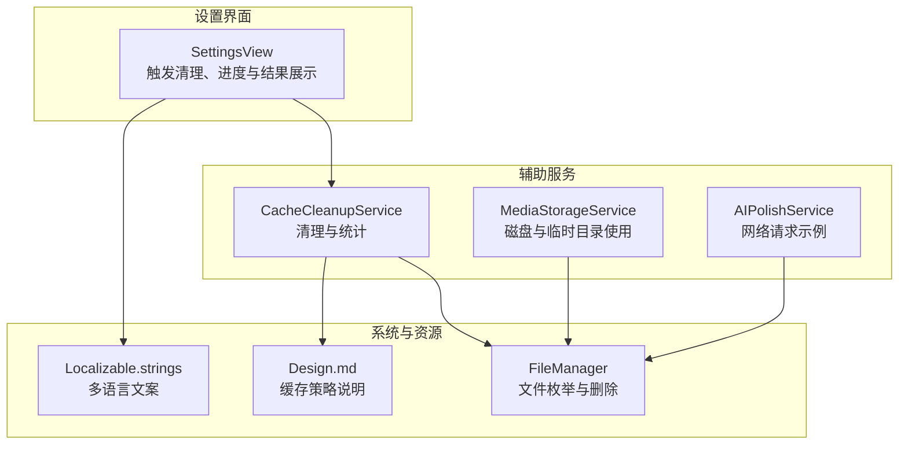
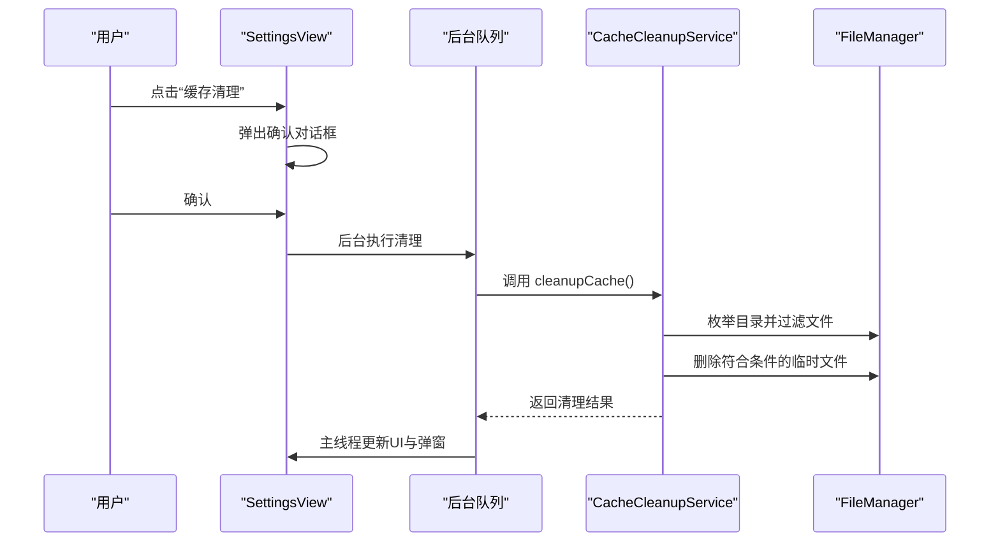
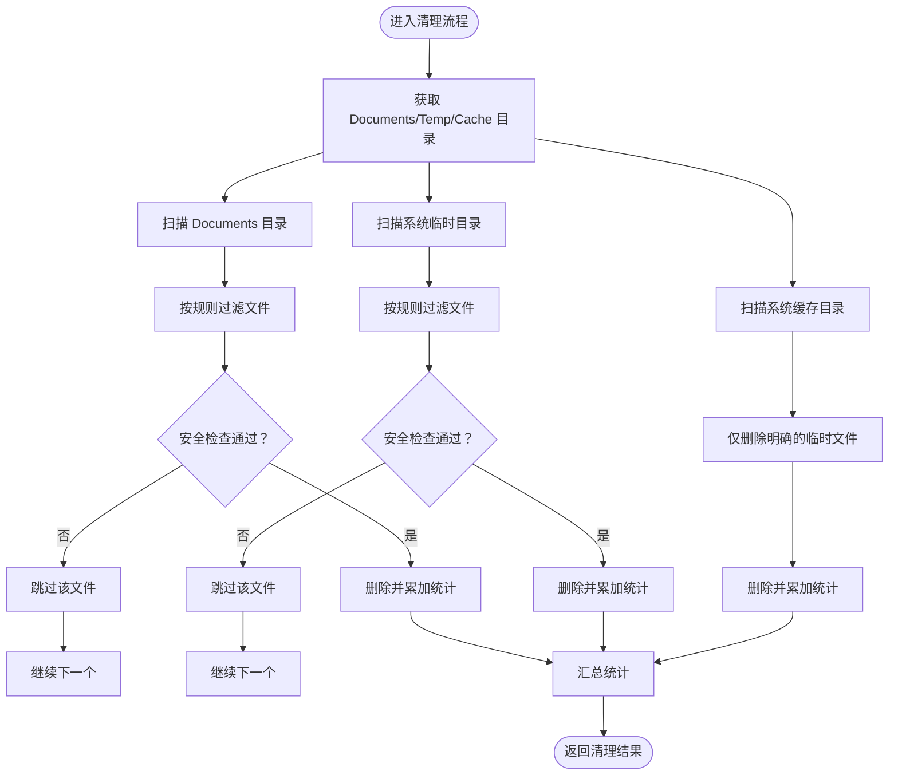
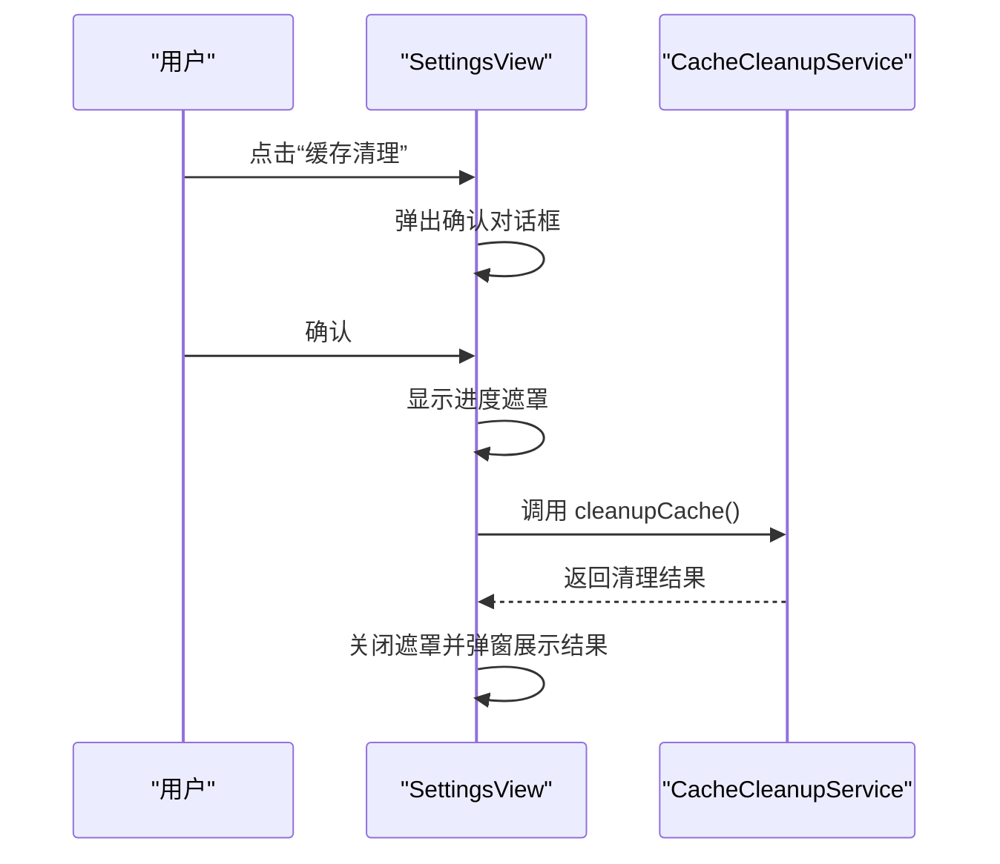
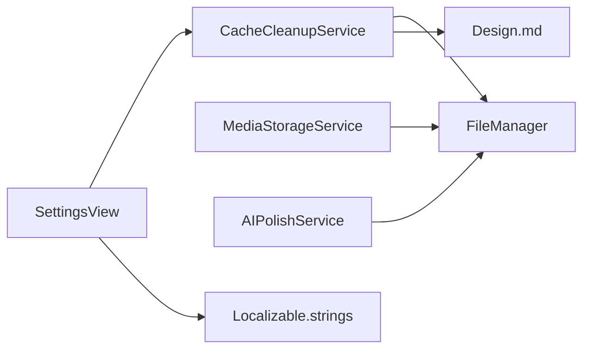

# 辅助服务模块

<cite>
**本文引用的文件**
- [CacheCleanupService.swift](file://MyStory/Services/CacheCleanupService.swift)
- [SettingsView.swift](file://MyStory/Views/Settings/SettingsView.swift)
- [MediaStorageService.swift](file://MyStory/Services/MediaStorageService.swift)
- [AIPolishService.swift](file://MyStory/Services/AIService/AIPolishService.swift)
- [Localizable.strings（中文）](file://MyStory/Resources/Localizable/zh-Hans.lproj/Localizable.strings)
- [Localizable.strings（英文）](file://MyStory/Resources/Localizable/en.lproj/Localizable.strings)
- [Design.md](file://Design.md)
</cite>

## 目录
1. [简介](#简介)
2. [项目结构](#项目结构)
3. [核心组件](#核心组件)
4. [架构总览](#架构总览)
5. [组件详解](#组件详解)
6. [依赖关系分析](#依赖关系分析)
7. [性能考量](#性能考量)
8. [故障排查指南](#故障排查指南)
9. [结论](#结论)
10. [附录](#附录)

## 简介
本文件面向“辅助服务模块”，聚焦于“缓存清理服务”的设计与实现，覆盖缓存策略、清理规则、触发与执行时机、清理范围控制、不同缓存类型的管理优先级、配置项与日志监控、性能影响评估与优化建议、测试方法与模拟场景、以及扩展点与自定义清理策略的实现指南。文档同时结合应用内设置界面与本地化资源，给出用户交互与结果反馈的说明。

## 项目结构
- 缓存清理服务位于 Services 层，提供静态清理与统计能力，并由设置页面触发。
- 设置页面负责用户交互、进度提示与结果弹窗展示。
- 媒体存储服务涉及磁盘与临时目录的使用，与缓存清理范围存在边界关系。
- 设计文档明确了图片缓存的层级策略，有助于理解清理范围与优先级。

图表来源
- [SettingsView.swift](file://MyStory/Views/Settings/SettingsView.swift#L91-L159)
- [CacheCleanupService.swift](file://MyStory/Services/CacheCleanupService.swift#L28-L67)
- [MediaStorageService.swift](file://MyStory/Services/MediaStorageService.swift#L109-L123)
- [AIPolishService.swift](file://MyStory/Services/AIService/AIPolishService.swift#L30-L61)
- [Localizable.strings（中文）](file://MyStory/Resources/Localizable/zh-Hans.lproj/Localizable.strings#L246-L255)
- [Design.md](file://Design.md#L452-L460)

章节来源
- [SettingsView.swift](file://MyStory/Views/Settings/SettingsView.swift#L91-L159)
- [CacheCleanupService.swift](file://MyStory/Services/CacheCleanupService.swift#L28-L67)
- [MediaStorageService.swift](file://MyStory/Services/MediaStorageService.swift#L109-L123)
- [AIPolishService.swift](file://MyStory/Services/AIService/AIPolishService.swift#L30-L61)
- [Localizable.strings（中文）](file://MyStory/Resources/Localizable/zh-Hans.lproj/Localizable.strings#L246-L255)
- [Design.md](file://Design.md#L452-L460)

## 核心组件
- 缓存清理服务（CacheCleanupService）
  - 提供清理入口与统计能力，按目录扫描并删除符合规则的临时文件；计算可清理空间但不删除。
  - 结果结构包含删除数量、释放空间（字节与MB）、错误列表，并提供成功判定。
- 设置界面（SettingsView）
  - 用户点击“缓存清理”后弹出确认对话框，后台执行清理并在主线程更新UI与弹窗。
  - 支持进度遮罩与多语言文案。
- 媒体存储服务（MediaStorageService）
  - 使用 Documents 目录下的 Media 子目录存放加密媒体文件；临时目录用于视频解密后临时播放。
  - 与缓存清理范围存在边界：清理逻辑会排除 Media 目录与数据库文件，避免误删用户数据。
- 设计文档（Design.md）
  - 明确图片缓存策略（内存、磁盘、原始文件），为理解清理范围与优先级提供依据。

章节来源
- [CacheCleanupService.swift](file://MyStory/Services/CacheCleanupService.swift#L12-L24)
- [SettingsView.swift](file://MyStory/Views/Settings/SettingsView.swift#L91-L159)
- [MediaStorageService.swift](file://MyStory/Services/MediaStorageService.swift#L109-L123)
- [Design.md](file://Design.md#L452-L460)

## 架构总览
缓存清理服务采用“目录扫描 + 规则过滤 + 安全白名单”的策略，分别清理 Documents、临时目录与缓存目录中的临时文件，避免误删用户数据与数据库文件。设置界面负责触发与结果反馈，媒体存储服务与网络服务作为系统与外部依赖参与整体运行环境。

图表来源
- [SettingsView.swift](file://MyStory/Views/Settings/SettingsView.swift#L91-L159)
- [CacheCleanupService.swift](file://MyStory/Services/CacheCleanupService.swift#L28-L67)

## 组件详解

### 缓存清理服务（CacheCleanupService）
- 清理范围
  - Documents 目录：递归扫描，删除临时文件、压缩包与包含特定标识的文件，排除 Media 目录、数据库文件与部分媒体文件。
  - 临时目录：同上策略，仅删除临时文件。
  - 缓存目录：仅删除明确的临时文件（以 temp 开头或包含 .tmp 的文件）。
- 清理规则
  - 文件名前缀：以 temp 开头。
  - 扩展名：受支持的压缩格式集合。
  - 名称关键字：包含 .tmp 或 cache。
  - 安全白名单：排除 Media 目录、数据库文件（sqlite、sqlite-shm、sqlite-wal）与特定媒体扩展名（HEIC、MOV、JPG/JPEG、PNG），除非文件名以 temp 开头。
- 性能与安全
  - 使用文件枚举器遍历目录，跳过隐藏文件；按需读取文件大小与属性，减少 IO 开销。
  - 错误收集：对单个文件删除失败进行错误记录，不影响整体清理流程。
  - 不删除缓存目录中的非临时文件，避免破坏系统缓存。
- 统计能力
  - 提供计算可清理空间的方法，按相同规则统计，不实际删除。
- 结果结构
  - 包含删除数量、释放空间（字节与MB）、错误列表，并提供成功判定字段。

图表来源
- [CacheCleanupService.swift](file://MyStory/Services/CacheCleanupService.swift#L28-L67)
- [CacheCleanupService.swift](file://MyStory/Services/CacheCleanupService.swift#L69-L151)
- [CacheCleanupService.swift](file://MyStory/Services/CacheCleanupService.swift#L153-L181)

章节来源
- [CacheCleanupService.swift](file://MyStory/Services/CacheCleanupService.swift#L28-L67)
- [CacheCleanupService.swift](file://MyStory/Services/CacheCleanupService.swift#L69-L151)
- [CacheCleanupService.swift](file://MyStory/Services/CacheCleanupService.swift#L153-L181)
- [CacheCleanupService.swift](file://MyStory/Services/CacheCleanupService.swift#L183-L261)

### 设置界面（SettingsView）与用户交互
- 触发条件
  - 用户在设置页点击“缓存清理”按钮，弹出确认对话框。
- 执行时机
  - 确认后在后台队列执行清理，完成后回到主线程更新 UI 并弹窗展示结果。
- 结果反馈
  - 成功：显示删除数量与释放空间（MB）。
  - 无文件可清理：提示无需清理。
  - 出错：拼接错误列表并提示清理失败。
- 进度提示
  - 显示加载遮罩与进度视图，提升用户体验。

图表来源
- [SettingsView.swift](file://MyStory/Views/Settings/SettingsView.swift#L91-L159)
- [SettingsView.swift](file://MyStory/Views/Settings/SettingsView.swift#L192-L226)

章节来源
- [SettingsView.swift](file://MyStory/Views/Settings/SettingsView.swift#L91-L159)
- [SettingsView.swift](file://MyStory/Views/Settings/SettingsView.swift#L192-L226)
- [Localizable.strings（中文）](file://MyStory/Resources/Localizable/zh-Hans.lproj/Localizable.strings#L249-L255)
- [Localizable.strings（英文）](file://MyStory/Resources/Localizable/en.lproj/Localizable.strings#L248-L249)

### 媒体存储服务（MediaStorageService）与缓存范围边界
- 磁盘与临时目录使用
  - 媒体文件保存在 Documents/Media 下，按年/月分层组织。
  - 视频解密后写入临时目录用于播放，随后清理临时文件。
- 与缓存清理的关系
  - 清理逻辑明确排除 Media 目录与数据库文件，避免误删用户数据。
  - 临时目录中的临时文件会被清理，但视频解密产生的临时文件在使用后会被清理，属于“临时文件”范畴。

章节来源
- [MediaStorageService.swift](file://MyStory/Services/MediaStorageService.swift#L109-L123)
- [MediaStorageService.swift](file://MyStory/Services/MediaStorageService.swift#L125-L141)

### 网络缓存与清理优先级
- 应用内网络请求示例（AI 文本润色服务）展示了网络请求的超时与错误处理，但未直接体现网络缓存清理逻辑。
- 对于网络缓存的清理优先级，建议遵循以下原则：
  - 临时文件优先：清理范围内的临时文件优先。
  - 用户数据保护：Media 目录与数据库文件优先保护。
  - 系统缓存：仅清理明确的临时文件，不破坏系统缓存结构。

章节来源
- [AIPolishService.swift](file://MyStory/Services/AIService/AIPolishService.swift#L30-L61)

### 缓存策略与清理优先级（来自设计文档）
- 图片缓存策略
  - 内存缓存：NSCache，最大容量约 100MB。
  - 磁盘缓存：临时目录，最大容量约 500MB。
  - 原始文件：加密存储在 Documents。
- 清理优先级
  - 临时文件优先清理，其次为磁盘缓存中的临时文件，最后保护用户数据与数据库文件。

章节来源
- [Design.md](file://Design.md#L452-L460)

## 依赖关系分析
- CacheCleanupService 依赖系统文件管理（FileManager）进行目录枚举与删除。
- SettingsView 依赖 CacheCleanupService 的清理结果进行 UI 更新与弹窗展示。
- MediaStorageService 与缓存清理存在目录边界关系，需遵守安全白名单规则。
- AIPolishService 展示网络请求的错误处理方式，为缓存清理的错误收集提供一致的处理思路。

图表来源
- [SettingsView.swift](file://MyStory/Views/Settings/SettingsView.swift#L91-L159)
- [CacheCleanupService.swift](file://MyStory/Services/CacheCleanupService.swift#L28-L67)
- [MediaStorageService.swift](file://MyStory/Services/MediaStorageService.swift#L109-L123)
- [AIPolishService.swift](file://MyStory/Services/AIService/AIPolishService.swift#L30-L61)
- [Localizable.strings（中文）](file://MyStory/Resources/Localizable/zh-Hans.lproj/Localizable.strings#L246-L255)
- [Design.md](file://Design.md#L452-L460)

章节来源
- [SettingsView.swift](file://MyStory/Views/Settings/SettingsView.swift#L91-L159)
- [CacheCleanupService.swift](file://MyStory/Services/CacheCleanupService.swift#L28-L67)
- [MediaStorageService.swift](file://MyStory/Services/MediaStorageService.swift#L109-L123)
- [AIPolishService.swift](file://MyStory/Services/AIService/AIPolishService.swift#L30-L61)
- [Localizable.strings（中文）](file://MyStory/Resources/Localizable/zh-Hans.lproj/Localizable.strings#L246-L255)
- [Design.md](file://Design.md#L452-L460)

## 性能考量
- 清理策略的性能特征
  - 目录扫描：使用文件枚举器遍历，跳过隐藏文件，减少无效 IO。
  - 条件判断：基于文件名前缀、扩展名与关键字进行快速过滤，降低复杂度。
  - 错误处理：单文件删除失败不影响整体流程，避免阻塞。
- 优化建议
  - 分批处理：对于大型目录，可考虑分批处理并允许中断。
  - 并发控制：在后台队列执行，避免阻塞 UI；必要时可引入并发限制。
  - 统计预览：利用计算可清理空间的方法，在清理前向用户展示预期收益。
  - 日志与监控：记录清理耗时、删除数量与错误详情，便于后续优化。

[本节为通用性能讨论，不直接分析具体文件]

## 故障排查指南
- 常见问题
  - 清理无响应：检查后台队列是否被阻塞，确认 UI 线程未被占用。
  - 删除失败：查看错误列表，定位具体文件与失败原因（权限、占用等）。
  - 误删风险：确认清理范围与安全白名单规则，确保 Media 与数据库文件未被删除。
- 建议措施
  - 在 SettingsView 中展示错误详情，便于用户反馈。
  - 在 CacheCleanupService 中增加更详细的日志记录（如耗时、删除数量）。
  - 对大目录清理增加进度回调或分段提示，提升用户体验。

章节来源
- [SettingsView.swift](file://MyStory/Views/Settings/SettingsView.swift#L192-L226)
- [CacheCleanupService.swift](file://MyStory/Services/CacheCleanupService.swift#L144-L146)

## 结论
缓存清理服务通过明确的清理范围与安全白名单，实现了对临时文件的高效清理，同时保护了用户数据与数据库文件。设置界面提供了良好的交互体验与结果反馈。结合设计文档中的缓存策略，可进一步明确清理优先级与范围边界。建议在现有基础上增强日志与监控、优化大目录处理策略，并提供更丰富的配置选项以满足不同场景需求。

[本节为总结性内容，不直接分析具体文件]

## 附录

### 配置选项与日志监控
- 配置项建议
  - 清理范围开关：允许用户选择是否清理缓存目录。
  - 扩展名白名单：允许自定义支持的压缩格式集合。
  - 安全阈值：设定最大删除数量或空间上限，防止极端情况。
- 日志与监控
  - 记录每次清理的开始时间、结束时间、删除数量、释放空间与错误列表。
  - 提供统计面板，展示清理频率与效果趋势。

[本节为通用建议，不直接分析具体文件]

### 测试方法与模拟场景
- 单元测试
  - 模拟目录与文件：构造包含临时文件与受保护文件的目录树，验证清理结果与错误列表。
  - 边界测试：空目录、只有受保护文件、只有临时文件等场景。
- 集成测试
  - 与设置界面联调：验证后台执行、进度遮罩与结果弹窗。
  - 与媒体存储服务联调：确保 Media 目录与数据库文件未被删除。
- 场景验证
  - 大量临时文件：验证清理耗时与 UI 响应。
  - 权限异常：模拟删除失败场景，验证错误收集与提示。

[本节为通用测试建议，不直接分析具体文件]

### 扩展点与自定义清理策略
- 扩展点
  - 清理规则接口：抽象出规则匹配器，支持动态配置与插件化。
  - 清理执行器：支持多种执行策略（顺序、并发、分批）。
  - 监控上报：统一的日志与指标上报接口。
- 自定义策略实现指南
  - 定义规则：基于文件名、扩展名、路径、时间戳等维度定义规则。
  - 实现执行器：封装删除与统计逻辑，保证错误隔离与结果聚合。
  - 集成界面：在设置页新增配置项与开关，提供预览与确认流程。

[本节为通用扩展建议，不直接分析具体文件]