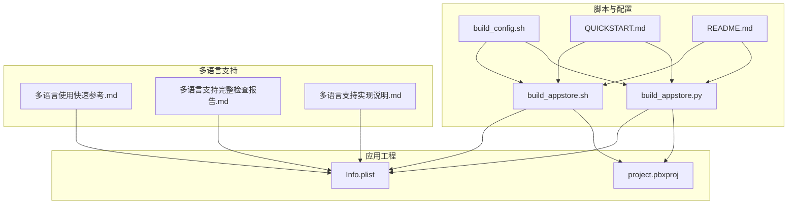
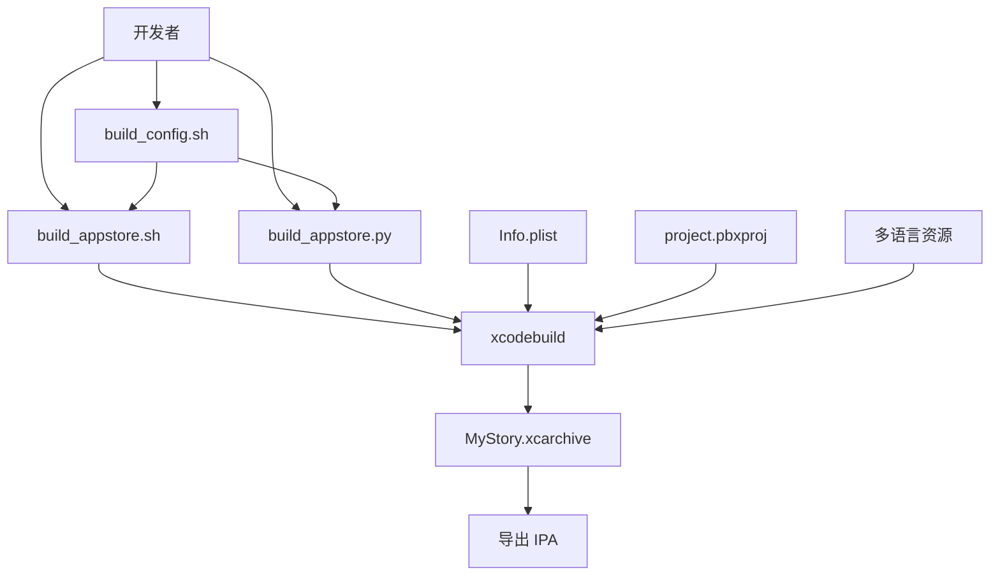
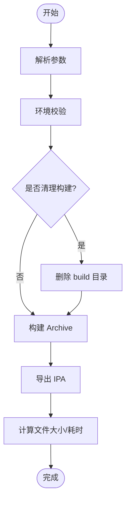
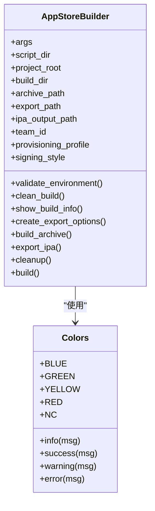
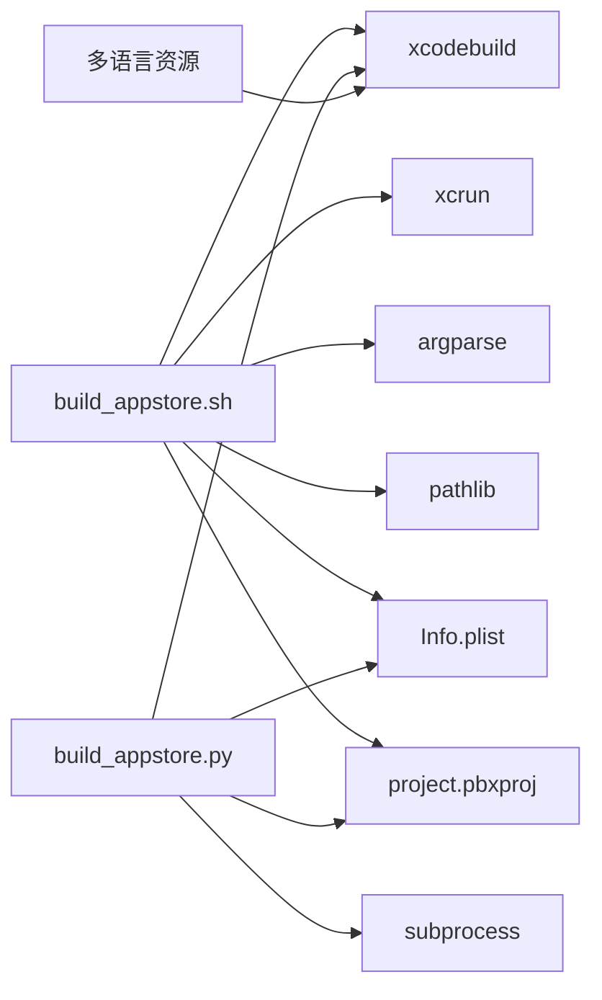
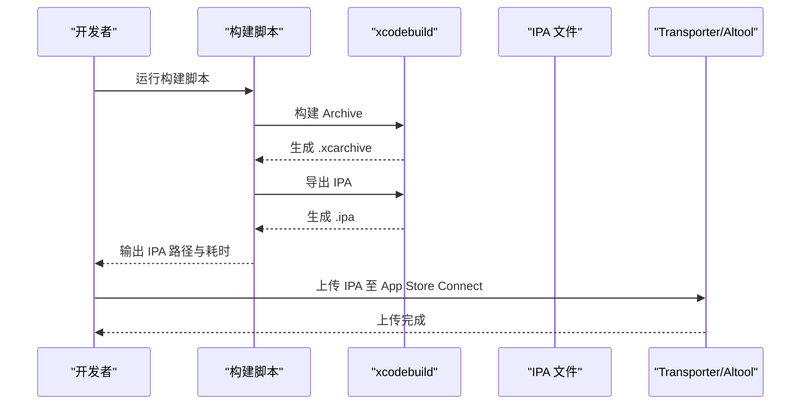

# 构建和部署

<cite>
**本文档引用的文件**
- [script/build_appstore.sh](file://script/build_appstore.sh)
- [script/build_appstore.py](file://script/build_appstore.py)
- [script/build_config.sh](file://script/build_config.sh)
- [script/QUICKSTART.md](file://script/QUICKSTART.md)
- [script/README.md](file://script/README.md)
- [MyStory/Info.plist](file://MyStory/Info.plist)
- [MyStory.xcodeproj/project.pbxproj](file://MyStory.xcodeproj/project.pbxproj)
- [多语言使用快速参考.md](file://多语言使用快速参考.md)
- [多语言支持完整检查报告.md](file://多语言支持完整检查报告.md)
- [多语言支持实现说明.md](file://多语言支持实现说明.md)
</cite>

## 目录
1. [简介](#简介)
2. [项目结构](#项目结构)
3. [核心组件](#核心组件)
4. [架构总览](#架构总览)
5. [详细组件分析](#详细组件分析)
6. [依赖关系分析](#依赖关系分析)
7. [性能考虑](#性能考虑)
8. [故障排查指南](#故障排查指南)
9. [结论](#结论)
10. [附录](#附录)

## 简介
本指南面向 MyStory iOS 项目的开发与发布团队，提供从开发环境配置、编译参数设置、自动化构建脚本使用，到 App Store 发布流程、CI/CD 集成与持续部署策略的完整说明。文档同时涵盖版本管理、签名配置、分发渠道管理、构建优化技巧、性能监控与问题排查方法，帮助团队高效完成应用的构建、测试与发布。

## 项目结构
MyStory 项目采用 Swift 与 SwiftUI 开发，使用 Xcode 工程管理，构建与发布通过脚本化工具实现。核心构建与发布相关文件集中在 script 目录，包含 Shell 与 Python 两套自动化脚本，以及配置模板与快速入门文档。

**图表来源**
- [script/build_appstore.sh](file://script/build_appstore.sh#L1-L387)
- [script/build_appstore.py](file://script/build_appstore.py#L1-L414)
- [script/build_config.sh](file://script/build_config.sh#L1-L143)
- [script/QUICKSTART.md](file://script/QUICKSTART.md#L1-L164)
- [script/README.md](file://script/README.md#L1-L271)
- [MyStory/Info.plist](file://MyStory/Info.plist#L1-L73)
- [MyStory.xcodeproj/project.pbxproj](file://MyStory.xcodeproj/project.pbxproj#L1-L200)
- [多语言使用快速参考.md](file://多语言使用快速参考.md#L1-L262)
- [多语言支持完整检查报告.md](file://多语言支持完整检查报告.md#L1-L300)
- [多语言支持实现说明.md](file://多语言支持实现说明.md#L1-L204)

**章节来源**
- [script/build_appstore.sh](file://script/build_appstore.sh#L1-L387)
- [script/build_appstore.py](file://script/build_appstore.py#L1-L414)
- [script/build_config.sh](file://script/build_config.sh#L1-L143)
- [script/QUICKSTART.md](file://script/QUICKSTART.md#L1-L164)
- [script/README.md](file://script/README.md#L1-L271)
- [MyStory/Info.plist](file://MyStory/Info.plist#L1-L73)
- [MyStory.xcodeproj/project.pbxproj](file://MyStory.xcodeproj/project.pbxproj#L1-L200)
- [多语言使用快速参考.md](file://多语言使用快速参考.md#L1-L262)
- [多语言支持完整检查报告.md](file://多语言支持完整检查报告.md#L1-L300)
- [多语言支持实现说明.md](file://多语言支持实现说明.md#L1-L204)

## 核心组件
- 自动化构建脚本（Shell/Python）：封装 xcodebuild 与 xcode-archive 导出流程，支持自动/手动签名、描述文件配置、输出 IPA 并记录耗时。
- 构建配置模板：集中管理项目名称、Bundle ID、导出方法、团队 ID、签名方式、输出目录等参数，便于团队标准化与个性化配置。
- 快速入门与使用说明：提供环境准备、权限配置、常见问题排查与高级选项使用方法。
- 多语言支持：通过 Info.plist 与本地化资源文件实现中英双语支持，配合工具类与检查报告保障一致性与可维护性。

**章节来源**
- [script/build_appstore.sh](file://script/build_appstore.sh#L1-L387)
- [script/build_appstore.py](file://script/build_appstore.py#L1-L414)
- [script/build_config.sh](file://script/build_config.sh#L1-L143)
- [script/QUICKSTART.md](file://script/QUICKSTART.md#L1-L164)
- [script/README.md](file://script/README.md#L1-L271)
- [多语言使用快速参考.md](file://多语言使用快速参考.md#L1-L262)
- [多语言支持完整检查报告.md](file://多语言支持完整检查报告.md#L1-L300)
- [多语言支持实现说明.md](file://多语言支持实现说明.md#L1-L204)

## 架构总览
MyStory 的构建与发布采用“脚本驱动 + 配置中心 + 工程元数据”的架构模式。脚本负责执行构建与导出，配置模板提供参数化能力，工程元数据（Info.plist、project.pbxproj）承载版本与目标配置，多语言资源确保国际化体验。

**图表来源**
- [script/build_appstore.sh](file://script/build_appstore.sh#L238-L322)
- [script/build_appstore.py](file://script/build_appstore.py#L211-L294)
- [script/build_config.sh](file://script/build_config.sh#L1-L143)
- [MyStory/Info.plist](file://MyStory/Info.plist#L1-L73)
- [MyStory.xcodeproj/project.pbxproj](file://MyStory.xcodeproj/project.pbxproj#L1-L200)
- [多语言使用快速参考.md](file://多语言使用快速参考.md#L1-L262)

## 详细组件分析

### Shell 自动化构建脚本（build_appstore.sh）
- 功能概述
  - 环境校验：检查 xcodebuild、xcrun、项目文件与 Scheme。
  - 清理构建：可选清理 build 目录。
  - 构建 Archive：使用 xcodebuild archive，支持自动/手动签名与团队 ID。
  - 导出 IPA：生成 ExportOptions.plist，调用 xcodebuild -exportArchive 导出。
  - 输出与统计：输出最终 IPA 路径与耗时，清理临时导出目录。
- 关键参数与行为
  - 支持 -c/--clean、-t/--team、-p/--profile、-v/--verbose 等选项。
  - 自动签名默认 automatic，手动签名需提供描述文件名称并切换 manual。
  - 输出文件带时间戳，便于版本追踪与归档。
- 错误处理
  - 命令缺失、项目文件不存在、Scheme 不存在、Archive 失败均会终止并输出错误信息。

**图表来源**
- [script/build_appstore.sh](file://script/build_appstore.sh#L154-L322)

**章节来源**
- [script/build_appstore.sh](file://script/build_appstore.sh#L1-L387)
- [script/README.md](file://script/README.md#L47-L158)

### Python 自动化构建脚本（build_appstore.py）
- 功能概述
  - 类化设计：AppStoreBuilder 封装构建流程；Colors 提供彩色输出。
  - 环境校验：同 Shell 版本，检查命令与项目文件。
  - 构建与导出：与 Shell 版本一致，支持自动/手动签名与团队 ID。
  - 输出与统计：输出 IPA 路径、耗时与上传建议。
- 关键参数与行为
  - 支持 --clean、--team-id、--provisioning-profile、--verbose。
  - 导出配置通过 create_export_options 动态生成 ExportOptions.plist。
- 错误处理
  - 命令执行异常捕获与详细日志输出，便于定位问题。

**图表来源**
- [script/build_appstore.py](file://script/build_appstore.py#L71-L350)

**章节来源**
- [script/build_appstore.py](file://script/build_appstore.py#L1-L414)
- [script/README.md](file://script/README.md#L67-L80)

### 构建配置模板（build_config.sh）
- 功能概述
  - 集中管理项目名称、Bundle ID、导出方法、团队 ID、签名方式、路径与开关等参数。
  - 支持复制为本地配置文件（build_config.local.sh）进行个性化定制。
  - 可选配置 App Store Connect 上传参数与通知配置，便于集成 CI/CD。
- 使用建议
  - 在脚本中 source 该配置文件，或通过环境变量覆盖默认值。
  - 对于 CI 环境，建议通过环境变量注入团队 ID、证书与描述文件信息。

**章节来源**
- [script/build_config.sh](file://script/build_config.sh#L1-L143)
- [script/README.md](file://script/README.md#L225-L241)

### 快速入门与使用说明（QUICKSTART.md、README.md）
- 快速入门
  - 环境准备：安装 Xcode 与命令行工具，登录 Apple ID，确保自动签名可用。
  - 执行打包：赋予脚本执行权限后运行，首次构建约 3-5 分钟。
  - 上传发布：使用 Transporter 或命令行工具上传至 App Store Connect。
- 常见问题
  - xcodebuild 命令未找到、签名错误、描述文件匹配失败、权限不足等问题的解决方案。
- 高级选项
  - 清理后构建、指定团队 ID、查看详细日志、查看帮助等。

**章节来源**
- [script/QUICKSTART.md](file://script/QUICKSTART.md#L1-L164)
- [script/README.md](file://script/README.md#L1-L271)

### 多语言支持（Info.plist、本地化资源与工具类）
- 工程配置
  - Info.plist 中声明支持语言与本地化资源，确保权限描述等文本本地化。
- 资源组织
  - zh-Hans.lproj 与 en.lproj 下的 Localizable.strings 与 InfoPlist.strings。
- 工具类与实现
  - LocalizationManager 单例管理语言偏好与切换；String+Localization 提供便捷访问。
- 质量保证
  - 完整检查报告覆盖所有用户可见文本，确保中英文键值一致与格式规范。

**章节来源**
- [MyStory/Info.plist](file://MyStory/Info.plist#L15-L20)
- [多语言使用快速参考.md](file://多语言使用快速参考.md#L1-L262)
- [多语言支持完整检查报告.md](file://多语言支持完整检查报告.md#L1-L300)
- [多语言支持实现说明.md](file://多语言支持实现说明.md#L1-L204)

## 依赖关系分析
- 脚本依赖
  - Shell 脚本依赖 xcodebuild、xcrun、xcpretty（可选）与系统命令。
  - Python 脚本依赖 Python 3.6+ 与标准库 subprocess、argparse、pathlib 等。
- 工程依赖
  - Info.plist 与 project.pbxproj 决定版本号、Bundle ID、目标配置与本地化资源。
- 多语言依赖
  - 本地化资源文件与工具类共同决定 UI 文本与权限描述的本地化呈现。

**图表来源**
- [script/build_appstore.sh](file://script/build_appstore.sh#L93-L107)
- [script/build_appstore.py](file://script/build_appstore.py#L10-L16)
- [MyStory/Info.plist](file://MyStory/Info.plist#L1-L73)
- [MyStory.xcodeproj/project.pbxproj](file://MyStory.xcodeproj/project.pbxproj#L1-L200)
- [多语言使用快速参考.md](file://多语言使用快速参考.md#L1-L262)

**章节来源**
- [script/build_appstore.sh](file://script/build_appstore.sh#L93-L107)
- [script/build_appstore.py](file://script/build_appstore.py#L10-L16)
- [MyStory/Info.plist](file://MyStory/Info.plist#L1-L73)
- [MyStory.xcodeproj/project.pbxproj](file://MyStory.xcodeproj/project.pbxproj#L1-L200)
- [多语言使用快速参考.md](file://多语言使用快速参考.md#L1-L262)

## 性能考虑
- 构建性能
  - 首次构建需下载依赖，建议在稳定网络环境下进行；后续增量构建可显著缩短时间。
  - 使用 xcpretty 美化输出，便于快速定位问题，减少无效重试。
- 导出与上传
  - 导出 IPA 后建议进行压缩或分发前预检，避免大体积包影响上传效率。
  - 上传至 App Store Connect 建议使用 Transporter，其对网络波动与断点续传更友好。
- 多语言资源
  - 保持中英文资源键值一致，减少运行时查找与回退成本；必要时对高频文本进行缓存。

[本节为通用指导，无需特定文件引用]

## 故障排查指南
- 签名与证书
  - 确认 Xcode 已登录 Apple ID，团队 ID 正确，自动签名开启或手动签名所需描述文件与证书已安装。
- 描述文件匹配
  - 若提示找不到匹配的描述文件，需在 Apple Developer 网站创建 App Store Distribution 描述文件并安装。
- Archive 失败
  - 先在 Xcode 中手动构建一次确认无编译错误；使用 -v 查看详细日志；必要时使用 --clean 清理后重试。
- 权限与命令
  - 若提示命令未找到，安装 Xcode 命令行工具并设置 Xcode 路径；赋予脚本执行权限。
- 多语言文本
  - 检查本地化键值是否存在于两个语言文件中，拼写是否正确，是否调用了 .localized。

**章节来源**
- [script/README.md](file://script/README.md#L136-L186)
- [script/QUICKSTART.md](file://script/QUICKSTART.md#L88-L122)
- [多语言使用快速参考.md](file://多语言使用快速参考.md#L212-L239)

## 结论
通过脚本化构建与集中化配置，MyStory 项目实现了稳定的 App Store 发布流程。结合多语言支持与完善的质量检查报告，团队可以在保证用户体验的同时，高效完成版本迭代与发布。建议在 CI/CD 环境中集成上述脚本，并结合配置模板与通知机制，进一步提升自动化与可观测性。

[本节为总结性内容，无需特定文件引用]

## 附录

### App Store 发布流程（端到端）

**图表来源**
- [script/build_appstore.sh](file://script/build_appstore.sh#L238-L322)
- [script/build_appstore.py](file://script/build_appstore.py#L211-L294)
- [script/README.md](file://script/README.md#L112-L135)

### CI/CD 集成与持续部署策略
- 建议流程
  - 触发条件：分支合并或打 Tag。
  - 步骤：拉取代码 → 安装依赖 → 运行构建脚本 → 产出 IPA → 上传至 App Store Connect → 通知团队。
- 参数注入
  - 团队 ID、证书与描述文件通过环境变量注入；导出方法与输出目录通过配置模板或环境变量控制。
- 产物管理
  - 将 IPA 与符号表归档，便于后续审计与问题排查；对不同渠道（App Store、TestFlight、Ad Hoc）分别管理。

**章节来源**
- [script/README.md](file://script/README.md#L225-L241)
- [script/build_config.sh](file://script/build_config.sh#L89-L118)

### 版本管理与签名配置
- 版本号与 Bundle ID
  - Info.plist 中的 CFBundleShortVersionString 与 CFBundleVersion 用于版本标识；Bundle ID 与导出方法需与 Apple Developer 账号配置一致。
- 签名方式
  - 推荐自动签名以降低维护成本；若使用手动签名，需明确团队 ID、证书与描述文件名称。
- 分发渠道
  - 导出方法（app-store/ad-hoc/enterprise/development）决定分发范围与审核流程。

**章节来源**
- [MyStory/Info.plist](file://MyStory/Info.plist#L24-L27)
- [script/build_config.sh](file://script/build_config.sh#L29-L34)
- [script/build_config.sh](file://script/build_config.sh#L44-L55)
- [script/README.md](file://script/README.md#L214-L224)