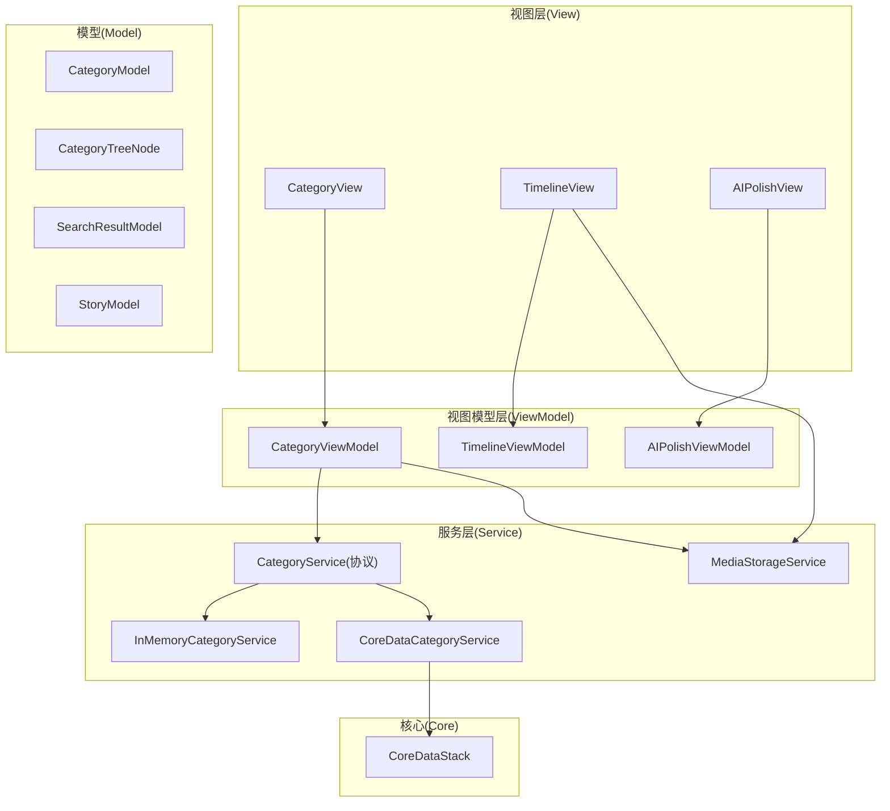
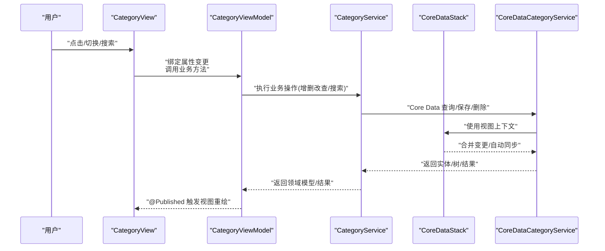
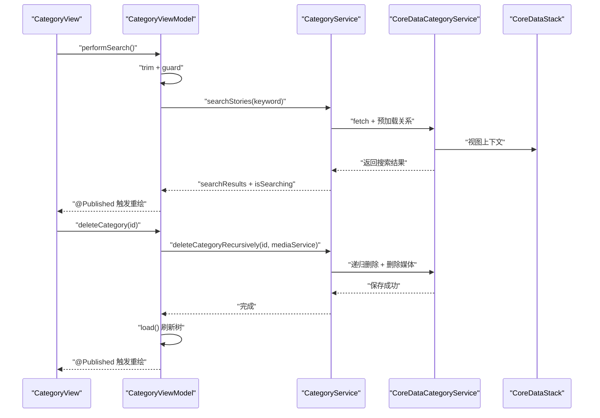
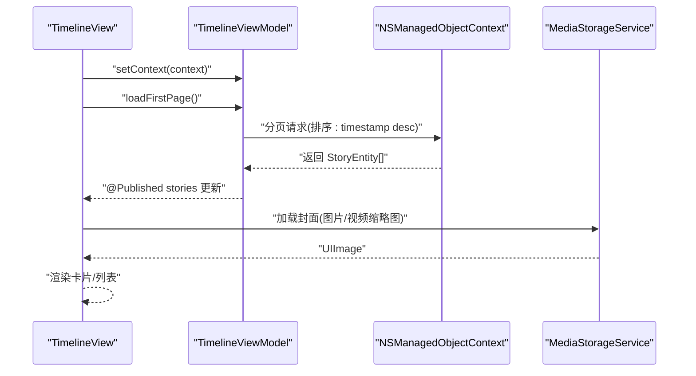
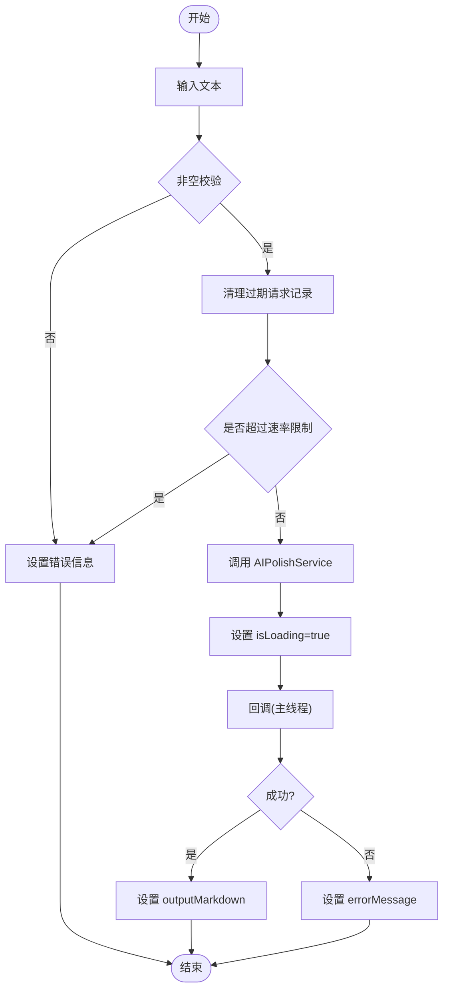
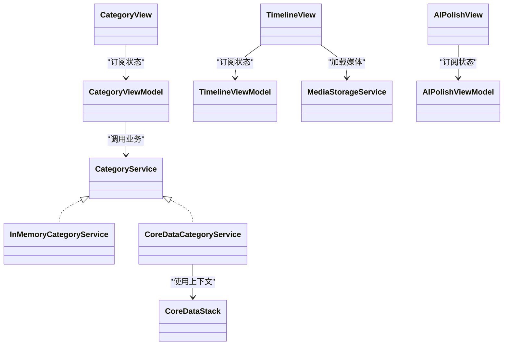
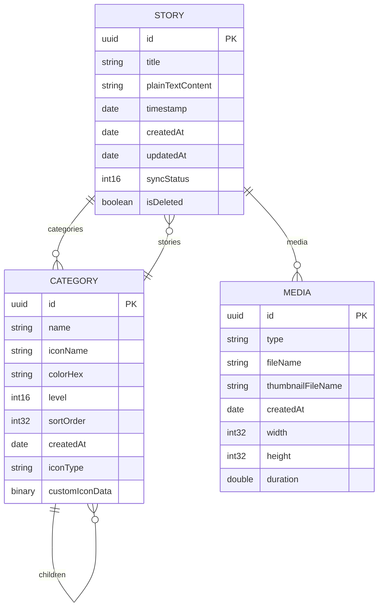

# MVVM 架构详解

<cite>
**本文引用的文件**   
- [MyStory/ViewModels/Category/CategoryViewModel.swift](file://MyStory/ViewModels/Category/CategoryViewModel.swift)
- [MyStory/Views/Category/CategoryView.swift](file://MyStory/Views/Category/CategoryView.swift)
- [MyStory/Services/CategoryService/CategoryService.swift](file://MyStory/Services/CategoryService/CategoryService.swift)
- [MyStory/Core/Storage/CoreDataStack.swift](file://MyStory/Core/Storage/CoreDataStack.swift)
- [MyStory/Views/Timeline/TimelineView.swift](file://MyStory/Views/Timeline/TimelineView.swift)
- [MyStory/Views/Timeline/TimelineViewModel.swift](file://MyStory/Views/Timeline/TimelineViewModel.swift)
- [MyStory/Services/MediaStorageService.swift](file://MyStory/Services/MediaStorageService.swift)
- [MyStory/ViewModels/Editor/AIPolishViewModel.swift](file://MyStory/ViewModels/Editor/AIPolishViewModel.swift)
- [MyStory/Views/Editor/AIPolishView.swift](file://MyStory/Views/Editor/AIPolishView.swift)
- [MyStory/Models/Category/CategoryModel.swift](file://MyStory/Models/Category/CategoryModel.swift)
- [MyStory/Models/ViewModels/SearchResultModel.swift](file://MyStory/Models/ViewModels/SearchResultModel.swift)
- [MyStory/Models/ViewModels/StoryModel.swift](file://MyStory/Models/ViewModels/StoryModel.swift)
</cite>

## 目录
1. [简介](#简介)
2. [项目结构](#项目结构)
3. [核心组件](#核心组件)
4. [架构总览](#架构总览)
5. [组件详细分析](#组件详细分析)
6. [依赖关系分析](#依赖关系分析)
7. [性能考量](#性能考量)
8. [故障排查指南](#故障排查指南)
9. [结论](#结论)
10. [附录](#附录)

## 简介
本文件系统化阐述 MyStory 应用的 MVVM 架构设计与实现，覆盖 Model-View-ViewModel 的职责划分、数据流与状态管理、@Published 响应式更新机制、SwiftUI 最佳实践，以及 Service 层与 Core Data 的协作方式。文档以 Category 与 Timeline 两大场景为主线，辅以 AI 润色编辑器作为异步服务示例，帮助读者理解从 UI 到数据持久化的完整链路。

## 项目结构
MyStory 采用按功能域分层的组织方式：
- View 层：SwiftUI 视图与组件，负责用户交互与展示
- ViewModel 层：ObservableObject，封装业务状态与流程控制
- Service 层：抽象协议与具体实现（内存/Core Data），处理数据访问与业务规则
- Model 层：数据模型与树形结构模型
- Core 层：CoreDataStack 管理持久化容器与上下文
- Utils/Components：通用工具与可复用 UI 组件

图表来源
- [MyStory/Views/Category/CategoryView.swift](file://MyStory/Views/Category/CategoryView.swift#L1-L495)
- [MyStory/ViewModels/Category/CategoryViewModel.swift](file://MyStory/ViewModels/Category/CategoryViewModel.swift#L1-L103)
- [MyStory/Services/CategoryService/CategoryService.swift](file://MyStory/Services/CategoryService/CategoryService.swift#L1-L675)
- [MyStory/Core/Storage/CoreDataStack.swift](file://MyStory/Core/Storage/CoreDataStack.swift#L1-L382)
- [MyStory/Views/Timeline/TimelineView.swift](file://MyStory/Views/Timeline/TimelineView.swift#L1-L304)
- [MyStory/Views/Timeline/TimelineViewModel.swift](file://MyStory/Views/Timeline/TimelineViewModel.swift#L1-L43)
- [MyStory/Services/MediaStorageService.swift](file://MyStory/Services/MediaStorageService.swift#L1-L348)
- [MyStory/ViewModels/Editor/AIPolishViewModel.swift](file://MyStory/ViewModels/Editor/AIPolishViewModel.swift#L1-L46)
- [MyStory/Views/Editor/AIPolishView.swift](file://MyStory/Views/Editor/AIPolishView.swift#L1-L47)
- [MyStory/Models/Category/CategoryModel.swift](file://MyStory/Models/Category/CategoryModel.swift#L1-L23)
- [MyStory/Models/ViewModels/SearchResultModel.swift](file://MyStory/Models/ViewModels/SearchResultModel.swift#L1-L63)
- [MyStory/Models/ViewModels/StoryModel.swift](file://MyStory/Models/ViewModels/StoryModel.swift#L1-L29)

章节来源
- [MyStory/Views/Category/CategoryView.swift](file://MyStory/Views/Category/CategoryView.swift#L1-L495)
- [MyStory/ViewModels/Category/CategoryViewModel.swift](file://MyStory/ViewModels/Category/CategoryViewModel.swift#L1-L103)
- [MyStory/Services/CategoryService/CategoryService.swift](file://MyStory/Services/CategoryService/CategoryService.swift#L1-L675)
- [MyStory/Core/Storage/CoreDataStack.swift](file://MyStory/Core/Storage/CoreDataStack.swift#L1-L382)
- [MyStory/Views/Timeline/TimelineView.swift](file://MyStory/Views/Timeline/TimelineView.swift#L1-L304)
- [MyStory/Views/Timeline/TimelineViewModel.swift](file://MyStory/Views/Timeline/TimelineViewModel.swift#L1-L43)
- [MyStory/Services/MediaStorageService.swift](file://MyStory/Services/MediaStorageService.swift#L1-L348)
- [MyStory/ViewModels/Editor/AIPolishViewModel.swift](file://MyStory/ViewModels/Editor/AIPolishViewModel.swift#L1-L46)
- [MyStory/Views/Editor/AIPolishView.swift](file://MyStory/Views/Editor/AIPolishView.swift#L1-L47)
- [MyStory/Models/Category/CategoryModel.swift](file://MyStory/Models/Category/CategoryModel.swift#L1-L23)
- [MyStory/Models/ViewModels/SearchResultModel.swift](file://MyStory/Models/ViewModels/SearchResultModel.swift#L1-L63)
- [MyStory/Models/ViewModels/StoryModel.swift](file://MyStory/Models/ViewModels/StoryModel.swift#L1-L29)

## 核心组件
- CategoryViewModel：封装分类树、展示模式、搜索状态与业务操作；通过 @Published 暴露状态，驱动视图响应式更新
- CategoryView：基于 Binding 与 @ObservedObject 与 ViewModel 交互；处理导航、上下文菜单、删除确认等 UI 行为
- CategoryService 协议与实现：抽象数据访问接口；提供内存实现与 Core Data 实现；负责层级校验、数量限制、递归删除、搜索与统计
- CoreDataStack：管理持久化容器、视图上下文合并策略与保存
- TimelineViewModel/TimelineView：分页加载故事列表，触发媒体加载与导航
- MediaStorageService：媒体存取、缩略图生成、加密存储与解密读取
- AIPolishViewModel/AIPolishView：演示异步服务调用与速率限制

章节来源
- [MyStory/ViewModels/Category/CategoryViewModel.swift](file://MyStory/ViewModels/Category/CategoryViewModel.swift#L1-L103)
- [MyStory/Views/Category/CategoryView.swift](file://MyStory/Views/Category/CategoryView.swift#L1-L495)
- [MyStory/Services/CategoryService/CategoryService.swift](file://MyStory/Services/CategoryService/CategoryService.swift#L1-L675)
- [MyStory/Core/Storage/CoreDataStack.swift](file://MyStory/Core/Storage/CoreDataStack.swift#L1-L382)
- [MyStory/Views/Timeline/TimelineView.swift](file://MyStory/Views/Timeline/TimelineView.swift#L1-L304)
- [MyStory/Views/Timeline/TimelineViewModel.swift](file://MyStory/Views/Timeline/TimelineViewModel.swift#L1-L43)
- [MyStory/Services/MediaStorageService.swift](file://MyStory/Services/MediaStorageService.swift#L1-L348)
- [MyStory/ViewModels/Editor/AIPolishViewModel.swift](file://MyStory/ViewModels/Editor/AIPolishViewModel.swift#L1-L46)
- [MyStory/Views/Editor/AIPolishView.swift](file://MyStory/Views/Editor/AIPolishView.swift#L1-L47)

## 架构总览
下图展示了从 View 到 ViewModel、Service 与 Core Data 的数据流与职责边界：

图表来源
- [MyStory/Views/Category/CategoryView.swift](file://MyStory/Views/Category/CategoryView.swift#L1-L495)
- [MyStory/ViewModels/Category/CategoryViewModel.swift](file://MyStory/ViewModels/Category/CategoryViewModel.swift#L1-L103)
- [MyStory/Services/CategoryService/CategoryService.swift](file://MyStory/Services/CategoryService/CategoryService.swift#L1-L675)
- [MyStory/Core/Storage/CoreDataStack.swift](file://MyStory/Core/Storage/CoreDataStack.swift#L1-L382)

## 组件详细分析

### Category 场景：MVVM 数据流与状态管理
- 视图层通过 @ObservedObject 绑定 ViewModel，使用 @State/@Binding 管理局部 UI 状态
- ViewModel 使用 @Published 暴露 tree、displayMode、searchText、searchResults、isSearching 等状态
- ViewModel 将业务操作委托给 Service，Service 再与 Core Data 协作
- 删除流程中，ViewModel 调用 Service 的递归删除并刷新树；视图弹出确认与错误提示

图表来源
- [MyStory/Views/Category/CategoryView.swift](file://MyStory/Views/Category/CategoryView.swift#L1-L495)
- [MyStory/ViewModels/Category/CategoryViewModel.swift](file://MyStory/ViewModels/Category/CategoryViewModel.swift#L1-L103)
- [MyStory/Services/CategoryService/CategoryService.swift](file://MyStory/Services/CategoryService/CategoryService.swift#L1-L675)
- [MyStory/Core/Storage/CoreDataStack.swift](file://MyStory/Core/Storage/CoreDataStack.swift#L1-L382)

章节来源
- [MyStory/Views/Category/CategoryView.swift](file://MyStory/Views/Category/CategoryView.swift#L1-L495)
- [MyStory/ViewModels/Category/CategoryViewModel.swift](file://MyStory/ViewModels/Category/CategoryViewModel.swift#L1-L103)
- [MyStory/Services/CategoryService/CategoryService.swift](file://MyStory/Services/CategoryService/CategoryService.swift#L1-L675)

### Timeline 场景：分页加载与媒体展示
- TimelineViewModel 负责分页请求、排序与加载状态
- TimelineView 注入环境上下文，设置 ViewModel 的 Core Data 上下文，首次进入时触发加载
- 媒体加载由 MediaStorageService 提供，支持图片与视频封面生成与解密读取

图表来源
- [MyStory/Views/Timeline/TimelineView.swift](file://MyStory/Views/Timeline/TimelineView.swift#L1-L304)
- [MyStory/Views/Timeline/TimelineViewModel.swift](file://MyStory/Views/Timeline/TimelineViewModel.swift#L1-L43)
- [MyStory/Services/MediaStorageService.swift](file://MyStory/Services/MediaStorageService.swift#L1-L348)

章节来源
- [MyStory/Views/Timeline/TimelineView.swift](file://MyStory/Views/Timeline/TimelineView.swift#L1-L304)
- [MyStory/Views/Timeline/TimelineViewModel.swift](file://MyStory/Views/Timeline/TimelineViewModel.swift#L1-L43)
- [MyStory/Services/MediaStorageService.swift](file://MyStory/Services/MediaStorageService.swift#L1-L348)

### AI 润色编辑器：异步服务与速率限制
- AIPolishViewModel 封装输入文本、输出 Markdown、加载状态与错误信息
- 通过弱引用避免循环引用，主线程更新 UI
- 速率限制：每分钟最多 N 次请求，超限则提示

图表来源
- [MyStory/ViewModels/Editor/AIPolishViewModel.swift](file://MyStory/ViewModels/Editor/AIPolishViewModel.swift#L1-L46)
- [MyStory/Views/Editor/AIPolishView.swift](file://MyStory/Views/Editor/AIPolishView.swift#L1-L47)

章节来源
- [MyStory/ViewModels/Editor/AIPolishViewModel.swift](file://MyStory/ViewModels/Editor/AIPolishViewModel.swift#L1-L46)
- [MyStory/Views/Editor/AIPolishView.swift](file://MyStory/Views/Editor/AIPolishView.swift#L1-L47)

### @Published 与响应式更新机制
- ViewModel 使用 @Published 标注状态属性，SwiftUI 在属性变更时自动重建相关视图
- 视图层通过 @ObservedObject 订阅 ViewModel，@State/@Binding 管理本地 UI 状态
- Service 返回的数据经 ViewModel 转换后写入 @Published 字段，驱动 UI 响应式刷新

章节来源
- [MyStory/ViewModels/Category/CategoryViewModel.swift](file://MyStory/ViewModels/Category/CategoryViewModel.swift#L1-L103)
- [MyStory/Views/Category/CategoryView.swift](file://MyStory/Views/Category/CategoryView.swift#L1-L495)
- [MyStory/Views/Timeline/TimelineView.swift](file://MyStory/Views/Timeline/TimelineView.swift#L1-L304)

### Service 层与 Core Data 协作
- CategoryService 协议定义统一接口，InMemoryCategoryService 用于预览与测试，CoreDataCategoryService 连接实际数据源
- CoreDataStack 负责容器加载、SQLite 存储、视图上下文合并策略与保存
- 关系预加载与异常保护：在查询时预加载 stories/children 等关系，避免 fault 导致计数与内容为空；对无效对象进行安全检查与日志提示

章节来源
- [MyStory/Services/CategoryService/CategoryService.swift](file://MyStory/Services/CategoryService/CategoryService.swift#L1-L675)
- [MyStory/Core/Storage/CoreDataStack.swift](file://MyStory/Core/Storage/CoreDataStack.swift#L1-L382)

## 依赖关系分析
- 视图依赖 ViewModel：通过 @ObservedObject 订阅状态变化
- ViewModel 依赖 Service：封装业务逻辑，屏蔽数据来源差异
- Service 依赖 Core Data：CoreDataCategoryService 使用 NSManagedObjectContext 完成持久化
- 视图依赖 Service：媒体展示依赖 MediaStorageService
- 模型层：CategoryModel/CategoryTreeNode 与 SearchResultModel/StoryModel 作为跨层数据载体

图表来源
- [MyStory/Views/Category/CategoryView.swift](file://MyStory/Views/Category/CategoryView.swift#L1-L495)
- [MyStory/ViewModels/Category/CategoryViewModel.swift](file://MyStory/ViewModels/Category/CategoryViewModel.swift#L1-L103)
- [MyStory/Services/CategoryService/CategoryService.swift](file://MyStory/Services/CategoryService/CategoryService.swift#L1-L675)
- [MyStory/Core/Storage/CoreDataStack.swift](file://MyStory/Core/Storage/CoreDataStack.swift#L1-L382)
- [MyStory/Views/Timeline/TimelineView.swift](file://MyStory/Views/Timeline/TimelineView.swift#L1-L304)
- [MyStory/Views/Timeline/TimelineViewModel.swift](file://MyStory/Views/Timeline/TimelineViewModel.swift#L1-L43)
- [MyStory/Services/MediaStorageService.swift](file://MyStory/Services/MediaStorageService.swift#L1-L348)
- [MyStory/Views/Editor/AIPolishView.swift](file://MyStory/Views/Editor/AIPolishView.swift#L1-L47)
- [MyStory/ViewModels/Editor/AIPolishViewModel.swift](file://MyStory/ViewModels/Editor/AIPolishViewModel.swift#L1-L46)

章节来源
- [MyStory/Views/Category/CategoryView.swift](file://MyStory/Views/Category/CategoryView.swift#L1-L495)
- [MyStory/ViewModels/Category/CategoryViewModel.swift](file://MyStory/ViewModels/Category/CategoryViewModel.swift#L1-L103)
- [MyStory/Services/CategoryService/CategoryService.swift](file://MyStory/Services/CategoryService/CategoryService.swift#L1-L675)
- [MyStory/Core/Storage/CoreDataStack.swift](file://MyStory/Core/Storage/CoreDataStack.swift#L1-L382)
- [MyStory/Views/Timeline/TimelineView.swift](file://MyStory/Views/Timeline/TimelineView.swift#L1-L304)
- [MyStory/Views/Timeline/TimelineViewModel.swift](file://MyStory/Views/Timeline/TimelineViewModel.swift#L1-L43)
- [MyStory/Services/MediaStorageService.swift](file://MyStory/Services/MediaStorageService.swift#L1-L348)
- [MyStory/Views/Editor/AIPolishView.swift](file://MyStory/Views/Editor/AIPolishView.swift#L1-L47)
- [MyStory/ViewModels/Editor/AIPolishViewModel.swift](file://MyStory/ViewModels/Editor/AIPolishViewModel.swift#L1-L46)

## 性能考量
- Core Data 关系预加载：在 fetchTree/fetchChildren/searchStories 中使用 relationshipKeyPathsForPrefetching，减少 fault 导致的二次访问与计数错误
- 分页加载：TimelineViewModel 使用 fetchLimit/fetchOffset 与排序，避免一次性加载大量数据
- 媒体处理：缩略图生成与加密/解密分离，临时文件及时清理，避免 IO 压力
- UI 响应：@Published 精准触发重绘；避免在视图中做重型计算，将复杂逻辑下沉至 ViewModel/Service
- 速率限制：AI 润色服务加入时间窗口内的请求数量限制，防止过度调用

章节来源
- [MyStory/Services/CategoryService/CategoryService.swift](file://MyStory/Services/CategoryService/CategoryService.swift#L204-L219)
- [MyStory/Services/CategoryService/CategoryService.swift](file://MyStory/Services/CategoryService/CategoryService.swift#L250-L264)
- [MyStory/Services/CategoryService/CategoryService.swift](file://MyStory/Services/CategoryService/CategoryService.swift#L453-L462)
- [MyStory/Views/Timeline/TimelineViewModel.swift](file://MyStory/Views/Timeline/TimelineViewModel.swift#L24-L41)
- [MyStory/Services/MediaStorageService.swift](file://MyStory/Services/MediaStorageService.swift#L143-L192)
- [MyStory/ViewModels/Editor/AIPolishViewModel.swift](file://MyStory/ViewModels/Editor/AIPolishViewModel.swift#L22-L26)

## 故障排查指南
- 删除失败：检查 CategoryError.hasStories 与子分类/故事数量；确认递归删除顺序与媒体清理
- 计数异常：确认 fetch 请求是否启用 relationshipKeyPathsForPrefetching；避免直接读取 fault 对象
- 搜索无结果：检查 keyword 非空与大小写处理；确认三级分类与 stories 关系已预加载
- 媒体加载失败：核对文件名、路径与加密密钥；确认缩略图与原图命名规则一致
- 保存失败：检查 CoreDataStack 的保存调用与上下文变更

章节来源
- [MyStory/Services/CategoryService/CategoryService.swift](file://MyStory/Services/CategoryService/CategoryService.swift#L375-L409)
- [MyStory/Services/CategoryService/CategoryService.swift](file://MyStory/Services/CategoryService/CategoryService.swift#L415-L449)
- [MyStory/Services/CategoryService/CategoryService.swift](file://MyStory/Services/CategoryService/CategoryService.swift#L453-L552)
- [MyStory/Services/MediaStorageService.swift](file://MyStory/Services/MediaStorageService.swift#L71-L123)
- [MyStory/Core/Storage/CoreDataStack.swift](file://MyStory/Core/Storage/CoreDataStack.swift#L86-L91)

## 结论
MyStory 的 MVVM 架构清晰地划分了职责：View 专注展示与交互，ViewModel 封装业务状态与流程，Service 抽象数据访问，Core Data 提供持久化能力。通过 @Published 的响应式机制与 Service 的关系预加载、异常保护与分页策略，系统在可维护性与性能之间取得平衡。建议在后续迭代中进一步完善错误统一处理、日志埋点与单元测试覆盖，持续提升稳定性与可观测性。

## 附录
- 数据模型概览（简化）

图表来源
- [MyStory/Core/Storage/CoreDataStack.swift](file://MyStory/Core/Storage/CoreDataStack.swift#L101-L378)