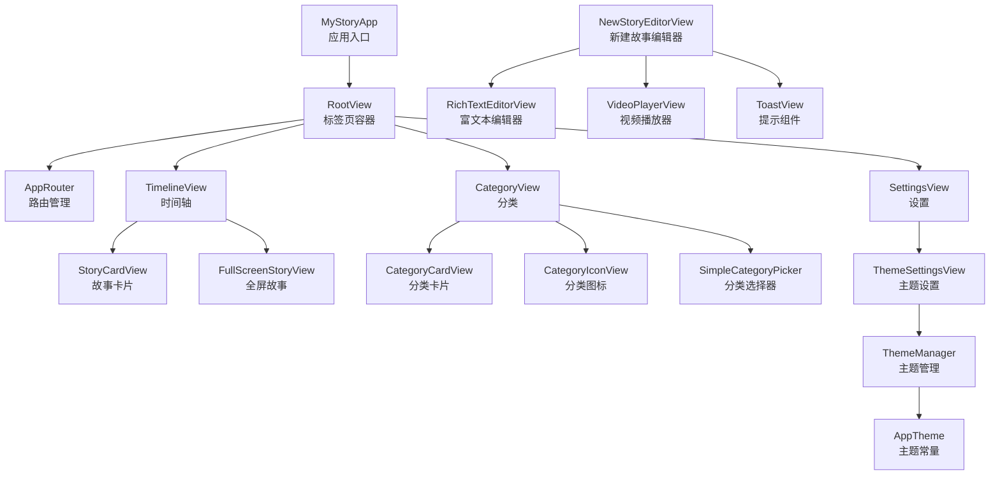
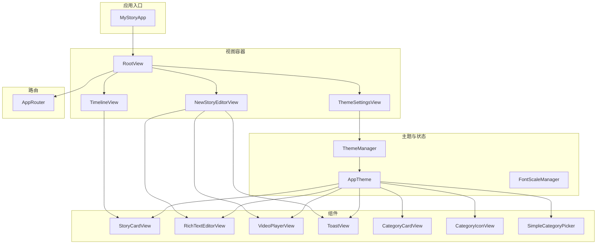
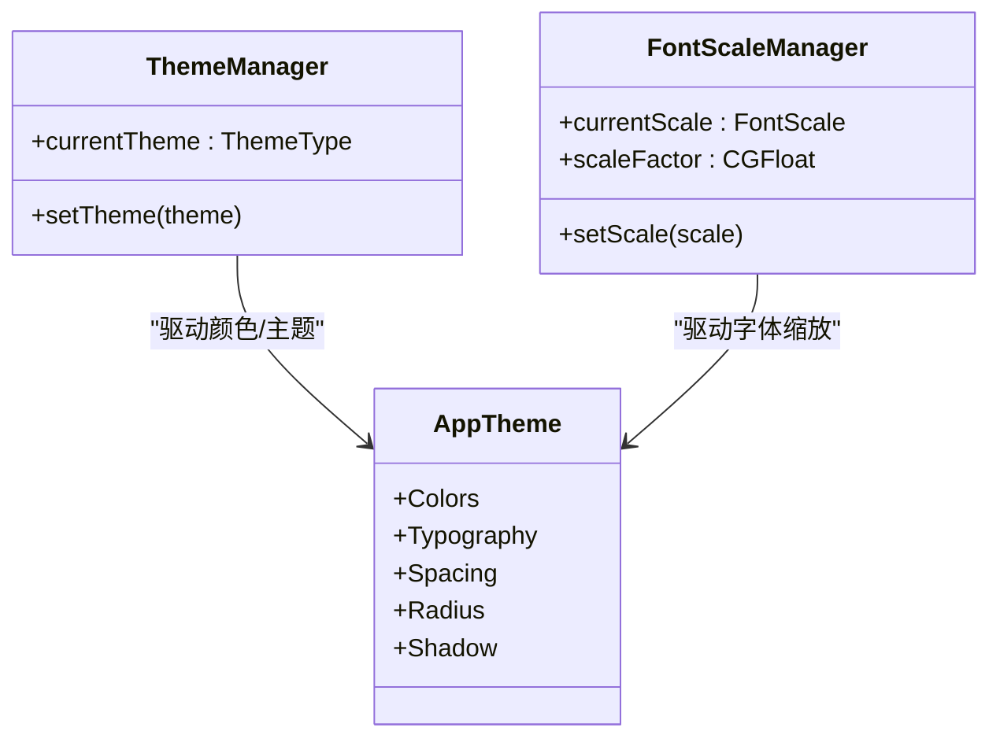
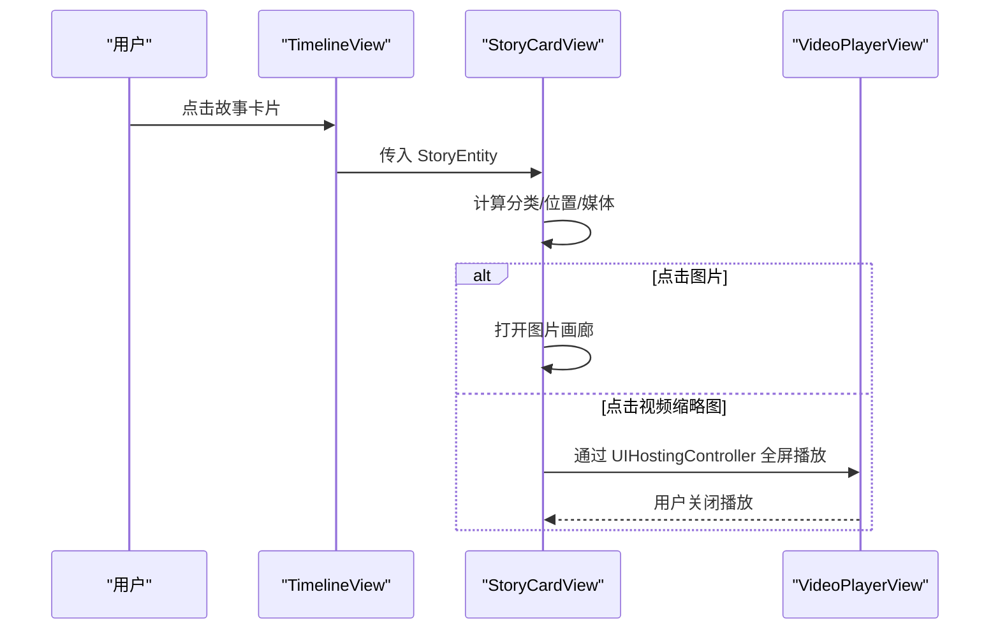
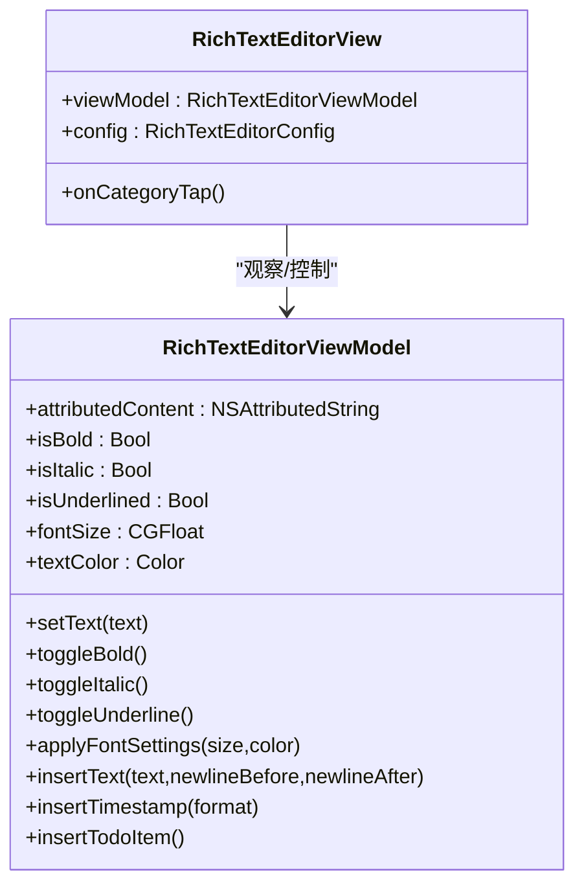
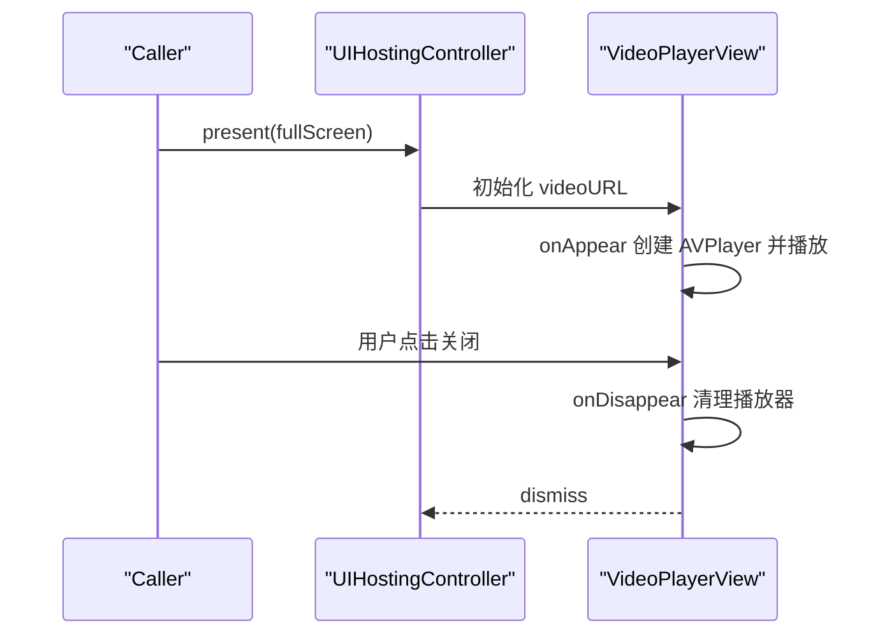
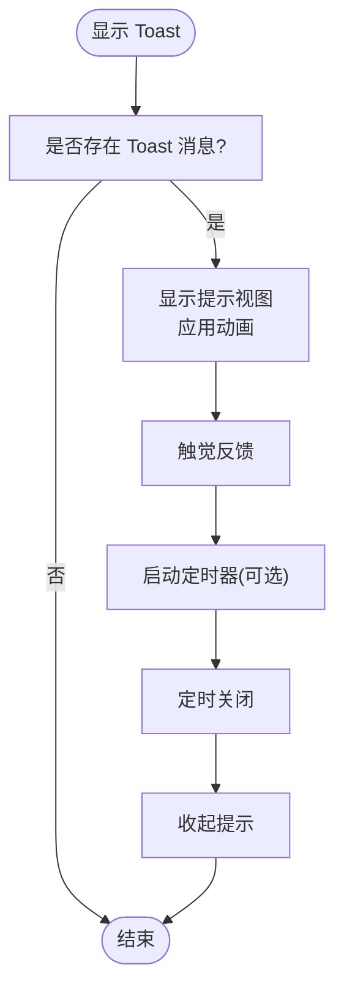
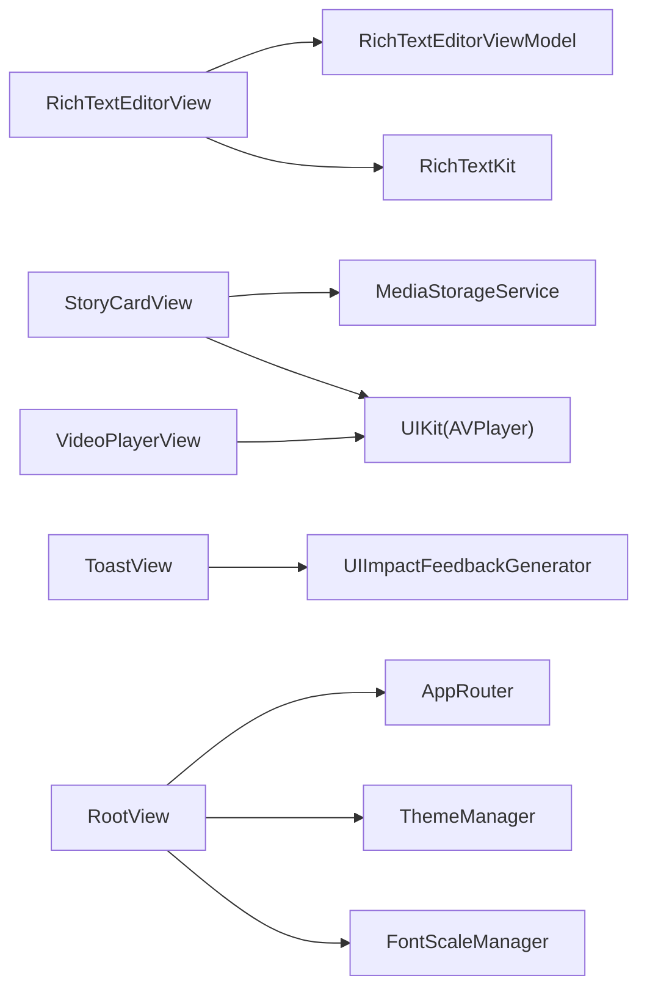

# UI 架构模式

<cite>
**本文引用的文件**
- [MyStoryApp.swift](file://MyStory/MyStoryApp.swift)
- [RootView.swift](file://MyStory/Views/RootView.swift)
- [AppRouter.swift](file://MyStory/Core/Router/AppRouter.swift)
- [TimelineView.swift](file://MyStory/Views/Timeline/TimelineView.swift)
- [AppTheme.swift](file://MyStory/Components/Theme/AppTheme.swift)
- [ThemeSettingsView.swift](file://MyStory/Views/Settings/ThemeSettingsView.swift)
- [StoryCardView.swift](file://MyStory/Components/StoryCardView.swift)
- [RichTextEditorView.swift](file://MyStory/Components/RichTextEditorView.swift)
- [VideoPlayerView.swift](file://MyStory/Components/VideoPlayerView.swift)
- [ToastView.swift](file://MyStory/Components/ToastView.swift)
- [CategoryCardView.swift](file://MyStory/Components/Category/CategoryCardView.swift)
- [CategoryIconView.swift](file://MyStory/Components/Category/CategoryIconView.swift)
- [SimpleCategoryPicker.swift](file://MyStory/Components/Category/SimpleCategoryPicker.swift)
- [NewStoryEditorView.swift](file://MyStory/Views/Editor/NewStoryEditorView.swift)
</cite>

## 目录
1. [引言](#引言)
2. [项目结构](#项目结构)
3. [核心组件](#核心组件)
4. [架构总览](#架构总览)
5. [组件详解](#组件详解)
6. [依赖关系分析](#依赖关系分析)
7. [性能考量](#性能考量)
8. [故障排查指南](#故障排查指南)
9. [结论](#结论)
10. [附录](#附录)

## 引言
本文件面向 MyStory 应用的 UI 架构模式，系统性阐述 SwiftUI 与 UIKit 混合开发的实现路径、主题系统设计与深浅模式适配、可复用 UI 组件的架构与参数传递机制、响应式设计与多设备适配策略，并总结动画、过渡与交互体验优化的最佳实践。目标是帮助开发者在不牺牲一致性与可维护性的前提下，高效构建高质量的跨设备界面。

## 项目结构
MyStory 采用以功能域为中心的模块化组织方式，UI 层主要由以下层次构成：
- 应用入口与场景：应用入口负责注入环境对象（Core Data、路由、本地化），根视图承载标签页与主题/字体缩放的响应式刷新。
- 视图层：以 SwiftUI 为主，配合必要的 UIKit 桥接（如视频播放）。
- 组件层：可复用 UI 组件（主题、卡片、编辑器、提示等）统一通过 AppTheme 提供的色彩、字体、间距、半径与阴影常量。
- 路由层：集中管理导航路径与弹窗呈现，保证页面跳转的一致性与可追踪性。
- 视图模型层：各页面与组件的业务逻辑与状态管理，如富文本编辑器的 ViewModel。

图表来源
- [MyStoryApp.swift](file://MyStory/MyStoryApp.swift#L21-L29)
- [RootView.swift](file://MyStory/Views/RootView.swift#L10-L35)
- [AppRouter.swift](file://MyStory/Core/Router/AppRouter.swift#L81-L122)
- [TimelineView.swift](file://MyStory/Views/Timeline/TimelineView.swift#L22-L53)
- [ThemeSettingsView.swift](file://MyStory/Views/Settings/ThemeSettingsView.swift#L14-L47)
- [AppTheme.swift](file://MyStory/Components/Theme/AppTheme.swift#L154-L307)
- [StoryCardView.swift](file://MyStory/Components/StoryCardView.swift#L3-L113)
- [RichTextEditorView.swift](file://MyStory/Components/RichTextEditorView.swift#L367-L430)
- [VideoPlayerView.swift](file://MyStory/Components/VideoPlayerView.swift#L4-L51)
- [ToastView.swift](file://MyStory/Components/ToastView.swift#L115-L150)
- [CategoryCardView.swift](file://MyStory/Components/Category/CategoryCardView.swift#L9-L46)
- [CategoryIconView.swift](file://MyStory/Components/Category/CategoryIconView.swift#L5-L90)
- [SimpleCategoryPicker.swift](file://MyStory/Components/Category/SimpleCategoryPicker.swift#L5-L101)
- [NewStoryEditorView.swift](file://MyStory/Views/Editor/NewStoryEditorView.swift#L8-L59)

章节来源
- [MyStoryApp.swift](file://MyStory/MyStoryApp.swift#L10-L30)
- [RootView.swift](file://MyStory/Views/RootView.swift#L3-L35)

## 核心组件
- 主题系统与 AppTheme
  - AppTheme 提供统一的颜色、字体、间距、圆角与阴影令牌，支持主题切换与字体缩放联动。
  - ThemeManager 与 FontScaleManager 作为 ObservableObject，驱动 UI 在主题/字体变化时自动重绘。
- 可复用 UI 组件
  - StoryCardView：内容摘要、媒体网格/视频缩略图、分类与位置信息展示，支持图片画廊与全屏视频播放。
  - RichTextEditorView：基于 RichTextKit 的富文本编辑器，提供格式状态同步、占位符、初始文本注入与字体设置面板联动。
  - VideoPlayerView：全屏视频播放器，结合 UIKit 的 AVPlayer 与 SwiftUI 的 UI。
  - ToastView：全局提示组件，支持多种类型与自动消失。
  - 分类相关组件：CategoryCardView、CategoryIconView、SimpleCategoryPicker，统一风格与交互。
- 路由与导航
  - AppRouter：集中管理 NavigationPath 与 Sheet/全屏弹窗，提供导航、返回与根页面跳转能力。
- 页面与容器
  - RootView：TabView 容器，绑定主题与字体缩放 ID，强制刷新。
  - TimelineView：时间轴列表，集成 StoryCardView、上下文菜单、全屏故事与分类跳转。
  - NewStoryEditorView：新建/编辑故事页面，整合富文本、媒体网格、位置与分类选择。

章节来源
- [AppTheme.swift](file://MyStory/Components/Theme/AppTheme.swift#L69-L90)
- [AppTheme.swift](file://MyStory/Components/Theme/AppTheme.swift#L135-L152)
- [AppTheme.swift](file://MyStory/Components/Theme/AppTheme.swift#L154-L307)
- [StoryCardView.swift](file://MyStory/Components/StoryCardView.swift#L3-L113)
- [RichTextEditorView.swift](file://MyStory/Components/RichTextEditorView.swift#L32-L90)
- [VideoPlayerView.swift](file://MyStory/Components/VideoPlayerView.swift#L4-L51)
- [ToastView.swift](file://MyStory/Components/ToastView.swift#L115-L150)
- [CategoryCardView.swift](file://MyStory/Components/Category/CategoryCardView.swift#L9-L46)
- [CategoryIconView.swift](file://MyStory/Components/Category/CategoryIconView.swift#L5-L90)
- [SimpleCategoryPicker.swift](file://MyStory/Components/Category/SimpleCategoryPicker.swift#L5-L101)
- [AppRouter.swift](file://MyStory/Core/Router/AppRouter.swift#L81-L122)
- [RootView.swift](file://MyStory/Views/RootView.swift#L10-L35)
- [TimelineView.swift](file://MyStory/Views/Timeline/TimelineView.swift#L22-L53)
- [NewStoryEditorView.swift](file://MyStory/Views/Editor/NewStoryEditorView.swift#L8-L59)

## 架构总览
MyStory 的 UI 架构遵循“声明式 SwiftUI + 必要 UIKit 桥接”的混合模式：
- SwiftUI 作为主框架，负责页面与组件的声明式构建、状态管理与主题/字体联动。
- UIKit 桥接用于需要原生能力的场景（如视频播放），通过 UIHostingController 或全屏覆盖方式接入。
- 组件间通过 AppTheme 统一风格，通过路由与环境对象解耦，提升可测试性与可维护性。

图表来源
- [MyStoryApp.swift](file://MyStory/MyStoryApp.swift#L21-L29)
- [RootView.swift](file://MyStory/Views/RootView.swift#L10-L35)
- [TimelineView.swift](file://MyStory/Views/Timeline/TimelineView.swift#L22-L53)
- [NewStoryEditorView.swift](file://MyStory/Views/Editor/NewStoryEditorView.swift#L8-L59)
- [ThemeSettingsView.swift](file://MyStory/Views/Settings/ThemeSettingsView.swift#L14-L47)
- [AppTheme.swift](file://MyStory/Components/Theme/AppTheme.swift#L154-L307)
- [AppRouter.swift](file://MyStory/Core/Router/AppRouter.swift#L81-L122)

## 组件详解

### 主题系统与深浅模式适配
- 设计思路
  - AppTheme 将颜色、字体、间距、圆角与阴影抽象为静态常量，统一由 ThemeManager 与 FontScaleManager 驱动。
  - ThemeManager 与 FontScaleManager 通过 UserDefaults 持久化用户偏好，并在变更时触发 UI 重绘。
- 颜色管理策略
  - 颜色按语义与主题维度分离：primary、background、surface、textPrimary/textSecondary、border、success/warning/error。
  - 支持主题切换时自动更新，背景与表面色随主题变化，文本色保持可读性。
- 深浅模式适配
  - AppTheme 的颜色与字体均基于系统资源与主题映射，无需额外暗色适配代码即可随系统模式变化。
- 字体缩放联动
  - FontScaleManager 提供滑块值与缩放系数映射，AppTheme.Typography 的所有字体均乘以当前缩放系数，确保无障碍阅读体验。

图表来源
- [AppTheme.swift](file://MyStory/Components/Theme/AppTheme.swift#L69-L90)
- [AppTheme.swift](file://MyStory/Components/Theme/AppTheme.swift#L135-L152)
- [AppTheme.swift](file://MyStory/Components/Theme/AppTheme.swift#L154-L307)

章节来源
- [AppTheme.swift](file://MyStory/Components/Theme/AppTheme.swift#L69-L90)
- [AppTheme.swift](file://MyStory/Components/Theme/AppTheme.swift#L135-L152)
- [AppTheme.swift](file://MyStory/Components/Theme/AppTheme.swift#L154-L307)
- [ThemeSettingsView.swift](file://MyStory/Views/Settings/ThemeSettingsView.swift#L14-L47)

### 可复用 UI 组件：StoryCardView
- 架构设计
  - 以 StoryEntity 为核心输入，计算分类路径、位置文本与媒体集合；根据媒体类型动态选择九宫格图片或视频缩略图。
  - 使用 AppTheme 的字体、颜色、间距与圆角，统一视觉风格。
- 参数传递机制
  - 输入：story、firstImage、hideCategoryDisplay、onCategoryTap 回调。
  - 状态：内部管理图片画廊与视频播放的 present 状态与索引。
- 交互与桥接
  - 图片点击进入 ImageGalleryViewer；视频点击通过 UIHostingController 全屏播放 VideoPlayerView。
- 性能与可访问性
  - 媒体加载延迟与裁剪，九宫格限制展示数量，避免过度渲染。

图表来源
- [TimelineView.swift](file://MyStory/Views/Timeline/TimelineView.swift#L113-L126)
- [StoryCardView.swift](file://MyStory/Components/StoryCardView.swift#L116-L190)
- [VideoPlayerView.swift](file://MyStory/Components/VideoPlayerView.swift#L4-L51)

章节来源
- [StoryCardView.swift](file://MyStory/Components/StoryCardView.swift#L3-L113)
- [TimelineView.swift](file://MyStory/Views/Timeline/TimelineView.swift#L113-L126)
- [VideoPlayerView.swift](file://MyStory/Components/VideoPlayerView.swift#L4-L51)

### 可复用 UI 组件：RichTextEditorView
- 架构设计
  - RichTextEditorView 作为 SwiftUI 组件，内部持有 RichTextEditorViewModel，负责富文本内容、格式状态与默认样式。
  - 支持占位符、最小高度、文本内边距与背景色配置；通过 UITextView 引用实现与 RichTextKit 的双向同步。
- 参数传递机制
  - 通过 RichTextEditorConfig 控制外观；通过 onCategoryTap 回调与外部交互。
  - 初始文本通过 ViewModel 的 setText 注入，确保在 UITextView 准备好后正确设置。
- 状态管理与事件处理
  - ViewModel 维护 isBold/isItalic/isUnderlined/fontSize/textColor 等状态，支持格式切换与字体设置应用。
  - 通过 objectWillChange 与 typingAttributes 同步 UI 响应与 RichTextContext。
- 性能与体验
  - 避免不必要的 onChange 监听，减少重绘；对初始文本注入进行队列与主线程保护。

图表来源
- [RichTextEditorView.swift](file://MyStory/Components/RichTextEditorView.swift#L367-L430)
- [RichTextEditorView.swift](file://MyStory/Components/RichTextEditorView.swift#L32-L90)
- [RichTextEditorView.swift](file://MyStory/Components/RichTextEditorView.swift#L191-L362)

章节来源
- [RichTextEditorView.swift](file://MyStory/Components/RichTextEditorView.swift#L32-L90)
- [RichTextEditorView.swift](file://MyStory/Components/RichTextEditorView.swift#L191-L362)
- [RichTextEditorView.swift](file://MyStory/Components/RichTextEditorView.swift#L367-L430)

### 可复用 UI 组件：VideoPlayerView（UIKit 桥接）
- 设计原则
  - 通过 UIHostingController 将 SwiftUI 的 VideoPlayerView 包裹在 UIKit 的全屏控制器中，实现与 AVPlayer 的无缝集成。
  - 使用 AppTheme 的阴影与颜色增强视觉反馈。
- 交互与生命周期
  - onAppear 加载 URL 并播放；onDisappear 清理播放器实例，避免内存泄漏。

图表来源
- [VideoPlayerView.swift](file://MyStory/Components/VideoPlayerView.swift#L4-L51)
- [NewStoryEditorView.swift](file://MyStory/Views/Editor/NewStoryEditorView.swift#L43-L57)

章节来源
- [VideoPlayerView.swift](file://MyStory/Components/VideoPlayerView.swift#L4-L51)
- [NewStoryEditorView.swift](file://MyStory/Views/Editor/NewStoryEditorView.swift#L43-L57)

### 可复用 UI 组件：ToastView
- 设计原则
  - ToastModifier 通过 overlay 在根视图上叠加提示层，支持弹簧动画与定时自动消失。
  - ToastMessage 以 Equatable 实现去重，避免重复提示。
- 交互与体验
  - 自动触发中等力度触觉反馈；支持手动关闭与自动关闭。

图表来源
- [ToastView.swift](file://MyStory/Components/ToastView.swift#L54-L112)
- [ToastView.swift](file://MyStory/Components/ToastView.swift#L115-L150)

章节来源
- [ToastView.swift](file://MyStory/Components/ToastView.swift#L54-L112)
- [ToastView.swift](file://MyStory/Components/ToastView.swift#L115-L150)

### 分类相关组件：CategoryCardView、CategoryIconView、SimpleCategoryPicker
- 设计原则
  - CategoryIconView 支持系统图标、Assets 预置图标与自定义图标三态切换，颜色与尺寸可配置。
  - CategoryCardView 以 AppTheme 的间距与圆角统一卡片风格，支持两种显示模式（子分类数/故事数）。
  - SimpleCategoryPicker 采用树形结构，支持展开/折叠与单选模式，选中态通过 AppTheme 的主色高亮。
- 参数传递与交互
  - 通过 Binding 维护选中集合；通过 onDismiss 回调完成确认/取消流程。

章节来源
- [CategoryCardView.swift](file://MyStory/Components/Category/CategoryCardView.swift#L9-L46)
- [CategoryIconView.swift](file://MyStory/Components/Category/CategoryIconView.swift#L5-L90)
- [SimpleCategoryPicker.swift](file://MyStory/Components/Category/SimpleCategoryPicker.swift#L5-L101)

### 页面与容器：RootView、TimelineView、NewStoryEditorView
- RootView
  - 以 TabView 承载三个标签页，绑定 ThemeManager 与 FontScaleManager 的 id，确保主题/字体变化时强制重建。
- TimelineView
  - 列表懒加载、上下文菜单、全屏故事与分类跳转；使用 StoryCardView 展示故事摘要与媒体。
- NewStoryEditorView
  - 整合富文本、媒体网格、位置与分类选择；通过全屏覆盖与 Sheet 管理复杂交互。

章节来源
- [RootView.swift](file://MyStory/Views/RootView.swift#L10-L35)
- [TimelineView.swift](file://MyStory/Views/Timeline/TimelineView.swift#L22-L53)
- [NewStoryEditorView.swift](file://MyStory/Views/Editor/NewStoryEditorView.swift#L8-L59)

## 依赖关系分析
- 组件耦合
  - StoryCardView 依赖 AppTheme 与 MediaStorageService；与 UIKit 的桥接通过 UIHostingController 解耦。
  - RichTextEditorView 依赖 RichTextKit 与 UITextView，通过 ViewModel 抽象与 SwiftUI 解耦。
  - VideoPlayerView 与 ToastView 作为独立组件，通过环境与修饰符注入。
- 路由与状态
  - AppRouter 与 RootView/各页面通过环境对象解耦，避免深层回调地狱。
- 外部依赖
  - RichTextKit 用于富文本编辑；ZIPFoundation 用于归档；AVKit 用于视频播放。

图表来源
- [RichTextEditorView.swift](file://MyStory/Components/RichTextEditorView.swift#L367-L430)
- [StoryCardView.swift](file://MyStory/Components/StoryCardView.swift#L10-L113)
- [VideoPlayerView.swift](file://MyStory/Components/VideoPlayerView.swift#L4-L51)
- [ToastView.swift](file://MyStory/Components/ToastView.swift#L54-L112)
- [RootView.swift](file://MyStory/Views/RootView.swift#L10-L35)
- [AppRouter.swift](file://MyStory/Core/Router/AppRouter.swift#L81-L122)
- [AppTheme.swift](file://MyStory/Components/Theme/AppTheme.swift#L69-L90)
- [AppTheme.swift](file://MyStory/Components/Theme/AppTheme.swift#L135-L152)

章节来源
- [AppRouter.swift](file://MyStory/Core/Router/AppRouter.swift#L81-L122)
- [RootView.swift](file://MyStory/Views/RootView.swift#L10-L35)

## 性能考量
- 渲染优化
  - 使用 LazyVGrid 与 LazyVStack 按需渲染；对图片与视频缩略图进行裁剪与尺寸控制，避免过度绘制。
  - 通过 AppTheme 的统一尺寸令牌减少布局计算差异。
- 状态与重绘
  - RootView 通过主题与字体缩放的 id 强制刷新，避免细粒度状态分散导致的重复渲染。
  - RichTextEditorViewModel 对初始文本注入与格式状态更新进行主线程与队列保护，降低竞态风险。
- 资源释放
  - VideoPlayerView 在 onDisappear 中清理播放器，防止后台播放与内存泄漏。

## 故障排查指南
- 富文本编辑器无初始文本
  - 检查 ViewModel 的 textView 引用是否在 didSet 中被赋值，以及 pendingInitialText 的处理逻辑。
- 视频播放失败
  - 确认 videoURL 非空；检查 UIHostingController 的 present 生命周期；确保在 onDisappear 中清理播放器。
- 主题切换无效
  - 确认 RootView 的 id 绑定是否生效；检查 ThemeManager 与 UserDefaults 的写入/读取。
- Toast 不显示或重复
  - 检查 ToastMessage 的 Equatable 实现与 ToastModifier 的动画与定时器逻辑。

章节来源
- [RichTextEditorView.swift](file://MyStory/Components/RichTextEditorView.swift#L58-L83)
- [VideoPlayerView.swift](file://MyStory/Components/VideoPlayerView.swift#L46-L49)
- [RootView.swift](file://MyStory/Views/RootView.swift#L33-L34)
- [ToastView.swift](file://MyStory/Components/ToastView.swift#L54-L112)

## 结论
MyStory 的 UI 架构以 SwiftUI 为主、必要时桥接 UIKit，通过 AppTheme 统一风格与状态管理，结合路由与环境对象实现清晰的解耦。组件化设计与参数化传递使界面具备高复用性与可维护性；主题与字体缩放的联动提升了可访问性与用户体验。建议在后续迭代中持续关注渲染性能与状态一致性，进一步完善动画与过渡的统一规范。

## 附录
- 响应式设计与多设备适配
  - 使用 AppTheme 的字体缩放系数与间距令牌，确保在不同设备与系统设置下的一致表现。
  - 图片网格宽度根据屏幕宽度与间距动态计算，保证在 iPhone 与 iPad 上的稳定布局。
- 动画与过渡
  - 主题切换使用弹簧动画；Toast 使用移动+透明度组合过渡；分类选择器使用展开/折叠动画。
- 事件处理最佳实践
  - 使用环境对象与 ObservableObject 管理状态；通过回调与 Sheet/全屏弹窗解耦复杂交互；在 UIKit 桥接中严格管理生命周期与资源释放。