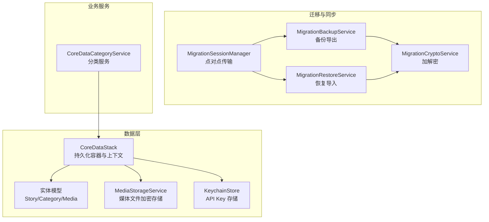
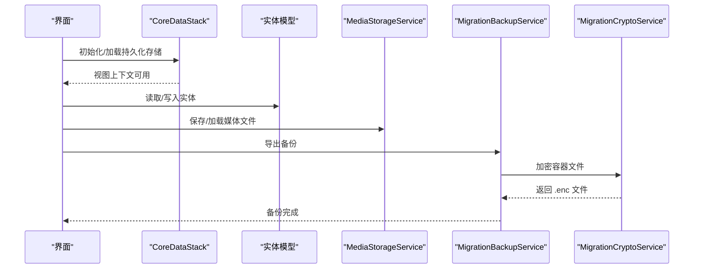
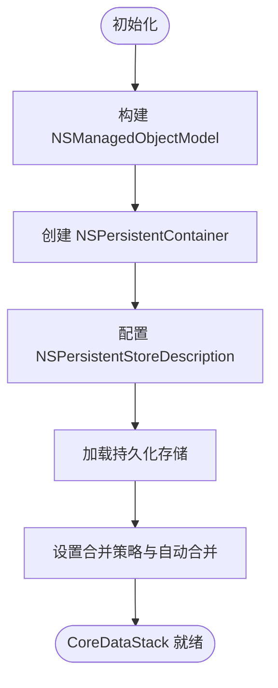
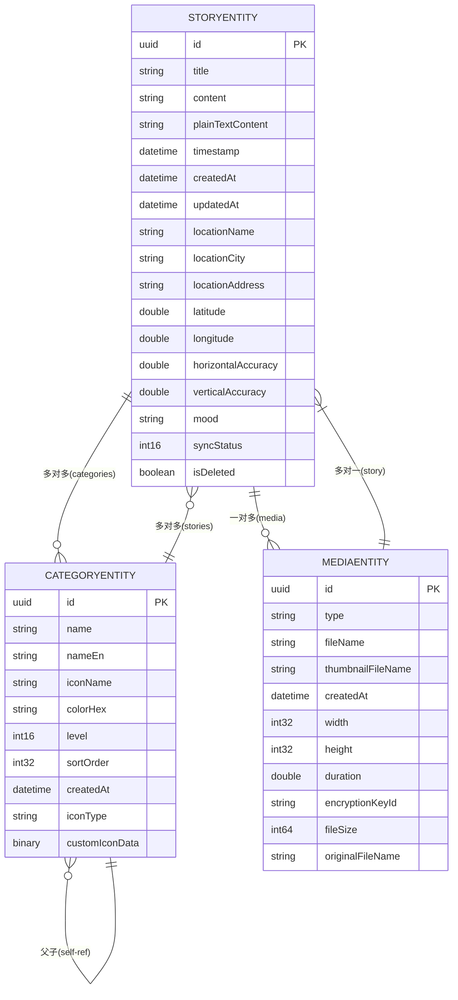
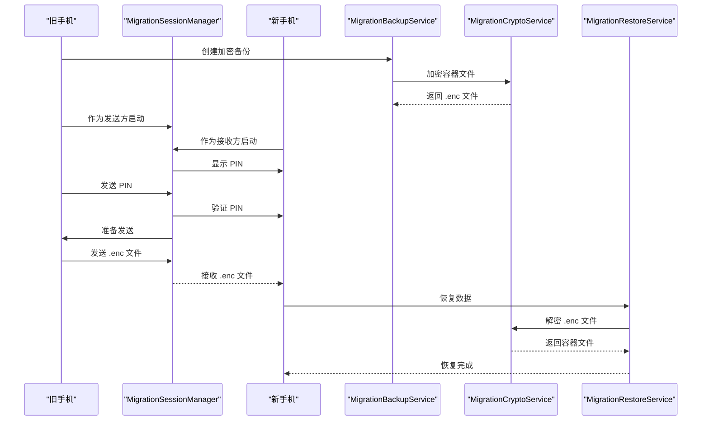
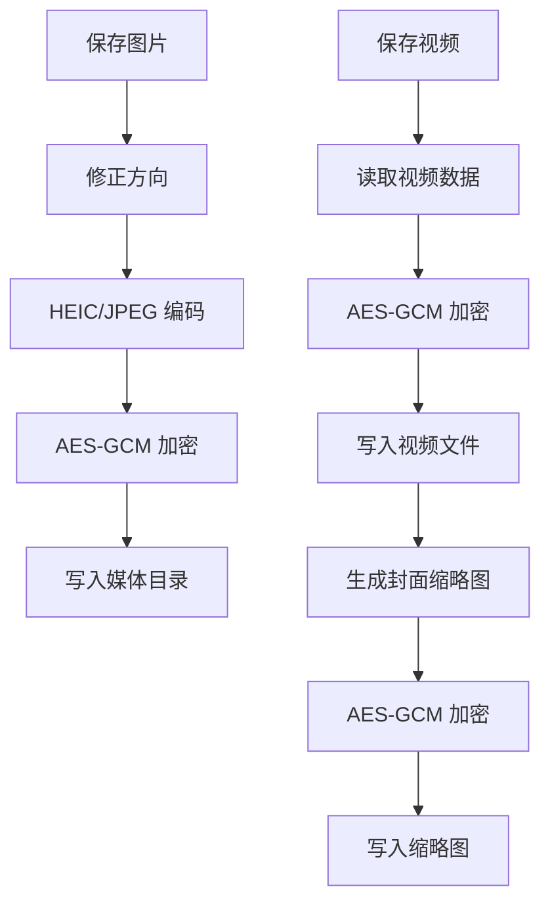
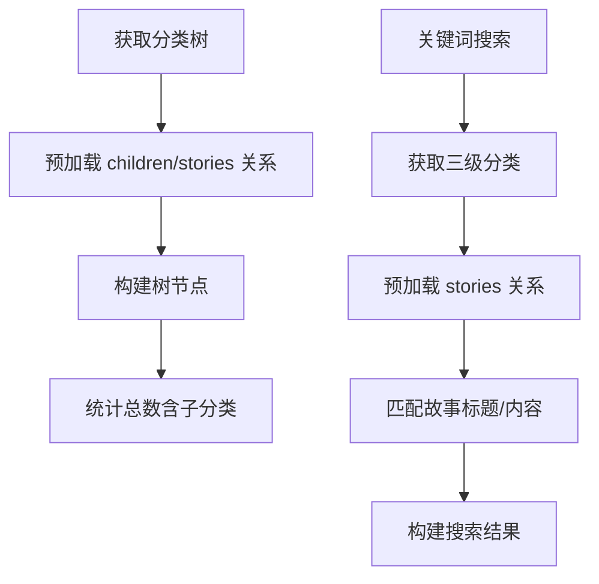
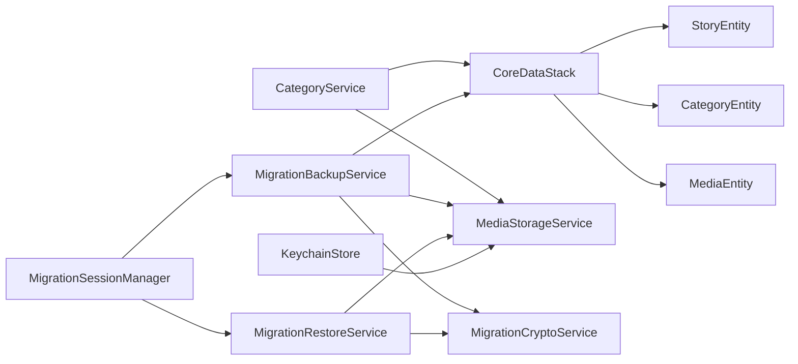

# 数据持久化架构

<cite>
**本文档引用的文件**
- [CoreDataStack.swift](file://MyStory/Core/Storage/CoreDataStack.swift)
- [MyStory.xcdatamodel/contents](file://MyStory/Resources/MyStory.xcdatamodeld/MyStory.xcdatamodel/contents)
- [StoryEntity+CoreDataClass.swift](file://MyStory/Models/Entities/StoryEntity+CoreDataClass.swift)
- [StoryEntity+CoreDataProperties.swift](file://MyStory/Models/Entities/StoryEntity+CoreDataProperties.swift)
- [CategoryEntity+CoreDataClass.swift](file://MyStory/Models/Entities/CategoryEntity+CoreDataClass.swift)
- [CategoryEntity+CoreDataProperties.swift](file://MyStory/Models/Entities/CategoryEntity+CoreDataProperties.swift)
- [MediaEntity+CoreDataClass.swift](file://MyStory/Models/Entities/MediaEntity+CoreDataClass.swift)
- [MediaEntity+CoreDataProperties.swift](file://MyStory/Models/Entities/MediaEntity+CoreDataProperties.swift)
- [MigrationBackupService.swift](file://MyStory/Services/MigrationBackupService.swift)
- [MigrationRestoreService.swift](file://MyStory/Services/MigrationRestoreService.swift)
- [MigrationSessionManager.swift](file://MyStory/Services/MigrationSessionManager.swift)
- [MigrationCryptoService.swift](file://MyStory/Services/MigrationCryptoService.swift)
- [MediaStorageService.swift](file://MyStory/Services/MediaStorageService.swift)
- [KeychainStore.swift](file://MyStory/Core/Storage/KeychainStore.swift)
- [CategoryService.swift](file://MyStory/Services/CategoryService/CategoryService.swift)
</cite>

## 目录
1. [简介](#简介)
2. [项目结构](#项目结构)
3. [核心组件](#核心组件)
4. [架构总览](#架构总览)
5. [详细组件分析](#详细组件分析)
6. [依赖关系分析](#依赖关系分析)
7. [性能考虑](#性能考虑)
8. [故障排查指南](#故障排查指南)
9. [结论](#结论)
10. [附录](#附录)

## 简介
本文件系统性阐述 MyStory 应用的数据持久化架构，重点围绕 Core Data 框架设计与实现，覆盖数据模型关系映射、实体属性定义与约束、上下文管理与并发策略、核心实体（StoryEntity、CategoryEntity、MediaEntity）设计、数据迁移与备份恢复机制，以及与 iCloud 同步预留接口的集成方案。文档同时提供查询优化、批量操作与性能调优建议，并给出常见问题的排查方法。

## 项目结构
MyStory 的数据层由 Core Data 核心栈、实体模型、媒体存储与迁移服务组成，采用“模型驱动 + 实体扩展”的方式组织代码，保证数据访问与业务逻辑分离。

图表来源
- [CoreDataStack.swift](file://MyStory/Core/Storage/CoreDataStack.swift#L1-L382)
- [MigrationBackupService.swift](file://MyStory/Services/MigrationBackupService.swift#L1-L414)
- [MigrationRestoreService.swift](file://MyStory/Services/MigrationRestoreService.swift#L1-L383)
- [MigrationSessionManager.swift](file://MyStory/Services/MigrationSessionManager.swift#L1-L374)
- [MigrationCryptoService.swift](file://MyStory/Services/MigrationCryptoService.swift#L1-L67)
- [MediaStorageService.swift](file://MyStory/Services/MediaStorageService.swift#L1-L348)
- [CategoryService.swift](file://MyStory/Services/CategoryService/CategoryService.swift#L1-L675)

章节来源
- [CoreDataStack.swift](file://MyStory/Core/Storage/CoreDataStack.swift#L1-L382)
- [MyStory.xcdatamodel/contents](file://MyStory/Resources/MyStory.xcdatamodeld/MyStory.xcdatamodel/contents#L1-L79)

## 核心组件
- CoreDataStack：负责创建 NSPersistentContainer、配置持久化存储描述、加载持久化存储、设置视图上下文合并策略与自动合并，提供保存入口。
- 实体扩展：通过 +CoreDataClass.swift 与 +CoreDataProperties.swift 定义实体类与属性访问器，提供 toModel() 等业务转换方法。
- 迁移服务：备份导出（含 Core Data 实体与媒体元数据）、加密、容器文件构建；恢复导入（解密、媒体文件恢复、Core Data 实体重建）。
- 媒体存储：媒体文件按年/月分目录加密存储，提供缩略图生成与视频封面提取。
- 分类服务：基于 Core Data 的分类树查询、增删改、统计与搜索，包含关系预加载与异常防护。
- Keychain 存储：安全存储第三方 API Key。

章节来源
- [CoreDataStack.swift](file://MyStory/Core/Storage/CoreDataStack.swift#L1-L382)
- [StoryEntity+CoreDataClass.swift](file://MyStory/Models/Entities/StoryEntity+CoreDataClass.swift#L1-L51)
- [CategoryEntity+CoreDataProperties.swift](file://MyStory/Models/Entities/CategoryEntity+CoreDataProperties.swift#L1-L74)
- [MediaEntity+CoreDataProperties.swift](file://MyStory/Models/Entities/MediaEntity+CoreDataProperties.swift#L1-L35)
- [MigrationBackupService.swift](file://MyStory/Services/MigrationBackupService.swift#L1-L414)
- [MigrationRestoreService.swift](file://MyStory/Services/MigrationRestoreService.swift#L1-L383)
- [MediaStorageService.swift](file://MyStory/Services/MediaStorageService.swift#L1-L348)
- [CategoryService.swift](file://MyStory/Services/CategoryService/CategoryService.swift#L1-L675)
- [KeychainStore.swift](file://MyStory/Core/Storage/KeychainStore.swift#L1-L40)

## 架构总览
MyStory 的数据持久化采用 Core Data 作为主要 ORM 框架，结合自定义容器文件与加密服务实现跨设备迁移与备份恢复。媒体文件独立于 Core Data，采用加密存储并按日期分层组织，确保隐私与性能兼顾。

图表来源
- [CoreDataStack.swift](file://MyStory/Core/Storage/CoreDataStack.swift#L8-L35)
- [MigrationBackupService.swift](file://MyStory/Services/MigrationBackupService.swift#L115-L142)
- [MigrationCryptoService.swift](file://MyStory/Services/MigrationCryptoService.swift#L35-L45)
- [MediaStorageService.swift](file://MyStory/Services/MediaStorageService.swift#L14-L47)

## 详细组件分析

### CoreDataStack 初始化与上下文管理
- 初始化流程
  - 创建 NSPersistentContainer，显式指定模型来源与存储描述。
  - 设置 SQLite 存储类型、异步加载关闭、存储文件 URL。
  - 在调试模式下可选择性删除旧数据库（便于模型变更时的开发测试）。
  - 加载持久化存储完成后，设置视图上下文合并策略为“属性级 trump”，并启用自动合并父上下文变更。
- 上下文管理
  - 提供 viewContext 作为 SwiftUI 主线程读取上下文。
  - save() 方法在视图上下文存在变更时执行保存，捕获并打印错误。
- 预览模式
  - 提供 preview 静态实例，在视图上下文中预先插入示例分类与故事数据，便于界面预览。

图表来源
- [CoreDataStack.swift](file://MyStory/Core/Storage/CoreDataStack.swift#L8-L35)

章节来源
- [CoreDataStack.swift](file://MyStory/Core/Storage/CoreDataStack.swift#L1-L382)

### 实体模型与关系映射
- StoryEntity
  - 属性：UUID 主键、标题、内容、纯文本摘要、时间戳、创建/更新时间、位置信息、精度、情绪、同步状态、软删除标记等。
  - 关系：与 CategoryEntity 多对多（categories），与 MediaEntity 一对多（media，级联删除）。
- CategoryEntity
  - 属性：UUID 主键、名称、英文名、图标名、颜色、层级、排序、创建时间、图标类型、自定义图标数据等。
  - 关系：父子自引用（parent/children，层级 1→2→3），与 StoryEntity 多对多（stories，空值删除）。
- MediaEntity
  - 属性：UUID 主键、类型、文件名、缩略图名、创建时间、宽高、时长、外键字段（如 encryptionKeyId、fileSize）等。
  - 关系：与 StoryEntity 多对一（story，空值删除）。

图表来源
- [MyStory.xcdatamodel/contents](file://MyStory/Resources/MyStory.xcdatamodeld/MyStory.xcdatamodel/contents#L3-L78)
- [StoryEntity+CoreDataProperties.swift](file://MyStory/Models/Entities/StoryEntity+CoreDataProperties.swift#L15-L41)
- [CategoryEntity+CoreDataProperties.swift](file://MyStory/Models/Entities/CategoryEntity+CoreDataProperties.swift#L15-L35)
- [MediaEntity+CoreDataProperties.swift](file://MyStory/Models/Entities/MediaEntity+CoreDataProperties.swift#L15-L33)

章节来源
- [MyStory.xcdatamodel/contents](file://MyStory/Resources/MyStory.xcdatamodeld/MyStory.xcdatamodel/contents#L1-L79)
- [StoryEntity+CoreDataClass.swift](file://MyStory/Models/Entities/StoryEntity+CoreDataClass.swift#L1-L51)
- [StoryEntity+CoreDataProperties.swift](file://MyStory/Models/Entities/StoryEntity+CoreDataProperties.swift#L1-L76)
- [CategoryEntity+CoreDataClass.swift](file://MyStory/Models/Entities/CategoryEntity+CoreDataClass.swift#L1-L18)
- [CategoryEntity+CoreDataProperties.swift](file://MyStory/Models/Entities/CategoryEntity+CoreDataProperties.swift#L1-L74)
- [MediaEntity+CoreDataClass.swift](file://MyStory/Models/Entities/MediaEntity+CoreDataClass.swift#L1-L15)
- [MediaEntity+CoreDataProperties.swift](file://MyStory/Models/Entities/MediaEntity+CoreDataProperties.swift#L1-L35)

### 数据迁移与备份恢复机制
- 备份导出
  - 从 Core Data 导出实体数据与媒体元数据，构建自定义容器文件（含 JSON 元数据与媒体字节流），随后加密生成 .enc 文件。
  - 支持扫描媒体目录、统计媒体文件与大小、导出 MasterKey 至备份包。
- 恢复导入
  - 解密 .enc 文件为容器文件，解析元数据与媒体偏移，恢复 MasterKey、媒体文件与 Core Data 实体。
  - 清空旧数据后重建实体与关系，第二轮设置分类父子关系，最后保存。
- 点对点传输
  - 基于 MultipeerConnectivity，新机作为接收方生成 PIN，旧机作为发送方验证 PIN 后发送备份资源，实时反馈进度与状态。

图表来源
- [MigrationBackupService.swift](file://MyStory/Services/MigrationBackupService.swift#L115-L142)
- [MigrationRestoreService.swift](file://MyStory/Services/MigrationRestoreService.swift#L108-L152)
- [MigrationSessionManager.swift](file://MyStory/Services/MigrationSessionManager.swift#L62-L106)
- [MigrationCryptoService.swift](file://MyStory/Services/MigrationCryptoService.swift#L35-L65)

章节来源
- [MigrationBackupService.swift](file://MyStory/Services/MigrationBackupService.swift#L1-L414)
- [MigrationRestoreService.swift](file://MyStory/Services/MigrationRestoreService.swift#L1-L383)
- [MigrationSessionManager.swift](file://MyStory/Services/MigrationSessionManager.swift#L1-L374)
- [MigrationCryptoService.swift](file://MyStory/Services/MigrationCryptoService.swift#L1-L67)

### 媒体存储与加密
- 存储策略
  - 媒体文件按年/月分目录存放，支持图片与视频两类，自动创建缩略图。
  - 加载时解密并返回原图或临时 URL。
- 加密机制
  - 基于 MasterKey 与 HKDF 派生每个文件的对称密钥，使用 AES-GCM 加密封装。
  - MasterKey 存储于 Keychain，首次使用时生成并安全保存。
- 图片与视频处理
  - 图片保存前修正方向，优先 HEIC 编码；视频保存并生成封面缩略图；支持从源 URL 直接加密保存。

图表来源
- [MediaStorageService.swift](file://MyStory/Services/MediaStorageService.swift#L14-L47)
- [MediaStorageService.swift](file://MyStory/Services/MediaStorageService.swift#L89-L112)
- [MediaStorageService.swift](file://MyStory/Services/MediaStorageService.swift#L194-L207)
- [MediaStorageService.swift](file://MyStory/Services/MediaStorageService.swift#L226-L271)

章节来源
- [MediaStorageService.swift](file://MyStory/Services/MediaStorageService.swift#L1-L348)

### 分类服务与查询优化
- 查询优化
  - 使用 relationshipKeyPathsForPrefetching 预加载 stories、children 及其子关系，避免 fault 导致的二次访问与计数错误。
  - 对根分类、子分类与搜索场景分别设置合适的预加载路径与排序。
- 异常防护
  - 对无效故事/分类对象进行跳过与日志输出，防止崩溃。
  - 搜索时对空值与越界进行保护，提取匹配片段并截断省略号。
- 递归删除
  - 支持递归删除分类、其子分类、关联故事与媒体文件，清理媒体目录对应文件。

图表来源
- [CategoryService.swift](file://MyStory/Services/CategoryService/CategoryService.swift#L204-L219)
- [CategoryService.swift](file://MyStory/Services/CategoryService/CategoryService.swift#L453-L552)
- [CategoryService.swift](file://MyStory/Services/CategoryService/CategoryService.swift#L375-L409)

章节来源
- [CategoryService.swift](file://MyStory/Services/CategoryService/CategoryService.swift#L1-L675)

### iCloud 同步预留接口
- 模型层面
  - 实体定义中启用了 syncable 标记，为后续接入 iCloud 同步奠定基础。
- 实现建议
  - 在 CoreDataStack 中增加 iCloud Store 描述与合并策略配置。
  - 为实体添加 syncStatus 字段与冲突解决策略，确保本地与云端一致性。
  - 对媒体文件采用独立同步策略，避免 Core Data 与大文件同步耦合。

章节来源
- [MyStory.xcdatamodel/contents](file://MyStory/Resources/MyStory.xcdatamodeld/MyStory.xcdatamodel/contents#L3-L78)

## 依赖关系分析
- 组件耦合
  - CoreDataStack 为数据层入口，被业务服务与实体扩展依赖。
  - MigrationBackupService/RestoreService 依赖 CryptoService 与 MediaStorageService。
  - MigrationSessionManager 作为传输层协调备份与恢复。
  - CategoryService 依赖 CoreDataStack 上下文与 MediaStorageService。
- 外部依赖
  - Core Data、MultipeerConnectivity、Security、CryptoKit、AVFoundation、ImageIO 等系统框架。

图表来源
- [CoreDataStack.swift](file://MyStory/Core/Storage/CoreDataStack.swift#L4-L6)
- [MigrationBackupService.swift](file://MyStory/Services/MigrationBackupService.swift#L103-L108)
- [MigrationRestoreService.swift](file://MyStory/Services/MigrationRestoreService.swift#L96-L101)
- [MigrationSessionManager.swift](file://MyStory/Services/MigrationSessionManager.swift#L34-L43)
- [MediaStorageService.swift](file://MyStory/Services/MediaStorageService.swift#L8-L12)
- [CategoryService.swift](file://MyStory/Services/CategoryService/CategoryService.swift#L194-L200)

章节来源
- [CoreDataStack.swift](file://MyStory/Core/Storage/CoreDataStack.swift#L1-L382)
- [MigrationBackupService.swift](file://MyStory/Services/MigrationBackupService.swift#L1-L414)
- [MigrationRestoreService.swift](file://MyStory/Services/MigrationRestoreService.swift#L1-L383)
- [MigrationSessionManager.swift](file://MyStory/Services/MigrationSessionManager.swift#L1-L374)
- [MediaStorageService.swift](file://MyStory/Services/MediaStorageService.swift#L1-L348)
- [CategoryService.swift](file://MyStory/Services/CategoryService/CategoryService.swift#L1-L675)

## 性能考虑
- 查询优化
  - 使用 relationshipKeyPathsForPrefetching 预加载多层关系，减少 N+1 查询。
  - 对频繁查询的属性（如 level、sortOrder、timestamp）建立索引（见下一节）。
- 并发与上下文
  - 视图上下文使用自动合并与属性级 trump 策略，适合主线程读取。
  - 建议在后台任务中使用私有队列上下文执行批量写入，完成后合并至视图上下文。
- 媒体处理
  - 图片与视频压缩质量参数可按场景调整，平衡清晰度与体积。
  - 视频缩略图生成使用快速模式与首帧附近时间点，提升性能。
- 迁移与备份
  - 备份与恢复采用分块读写与进度观察，避免内存峰值。
  - 加密/解密使用原子写入，确保文件完整性。

[本节为通用指导，无需特定文件来源]

## 故障排查指南
- Core Data 加载失败
  - 检查持久化存储 URL 与权限，确认容器描述配置正确。
  - 若处于调试模式，确认旧数据库删除逻辑未误删生产数据。
- 查询结果为空或计数错误
  - 确认请求设置了 relationshipKeyPathsForPrefetching，避免 fault 导致关系为空。
  - 检查对象是否有效（非 fault），必要时重新 fetch。
- 媒体文件缺失
  - 核对媒体目录结构与文件名，确认加密/解密密钥可用。
  - 检查缩略图命名与视频封面生成逻辑。
- 迁移失败
  - 核对 .enc 文件格式与备份 ID，确认密码正确。
  - 检查容器文件解析与媒体偏移计算，关注磁盘空间与权限。
- iCloud 同步异常
  - 确认实体已启用 syncable，检查合并策略与冲突解决规则。

章节来源
- [CoreDataStack.swift](file://MyStory/Core/Storage/CoreDataStack.swift#L27-L34)
- [CategoryService.swift](file://MyStory/Services/CategoryService/CategoryService.swift#L481-L520)
- [MediaStorageService.swift](file://MyStory/Services/MediaStorageService.swift#L194-L207)
- [MigrationRestoreService.swift](file://MyStory/Services/MigrationRestoreService.swift#L166-L206)

## 结论
MyStory 的数据持久化架构以 Core Data 为核心，结合自定义容器文件与加密服务实现了完整的备份与迁移能力，同时通过媒体文件独立加密存储保障隐私与性能。分类服务针对关系查询进行了预加载优化与异常防护，确保复杂树形结构的稳定访问。未来可进一步完善 iCloud 同步与索引设计，持续提升查询性能与用户体验。

[本节为总结性内容，无需特定文件来源]

## 附录
- 数据完整性与索引设计
  - 唯一约束：实体主键 id 设置为唯一约束，避免重复。
  - 索引建议：对常用过滤字段（如 level、sortOrder、timestamp、createdAt）建立索引，提升查询效率。
- 查询性能优化清单
  - 使用预加载关系，避免 N+1。
  - 合理使用谓词与排序，限制 fetchLimit。
  - 批量写入使用私有上下文，减少主线程阻塞。
- 备份与恢复最佳实践
  - 备份前校验媒体目录完整性，记录损坏文件数量。
  - 恢复时先清理旧数据再重建，最后设置父子关系，确保一致性。
  - 使用原子写入与进度回调，提升用户体验与可观测性。

[本节为通用指导，无需特定文件来源]