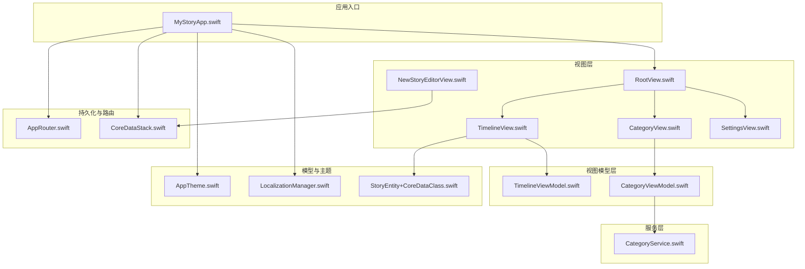
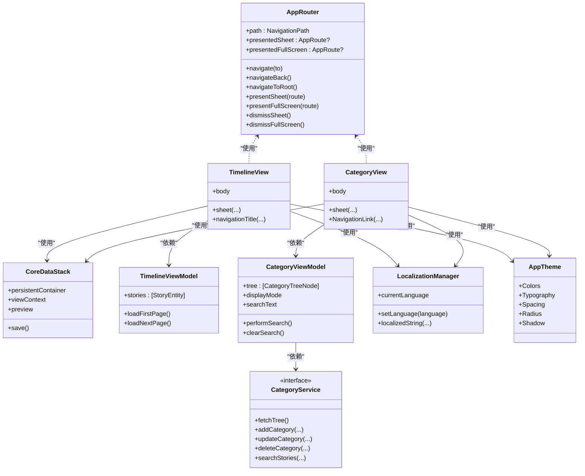
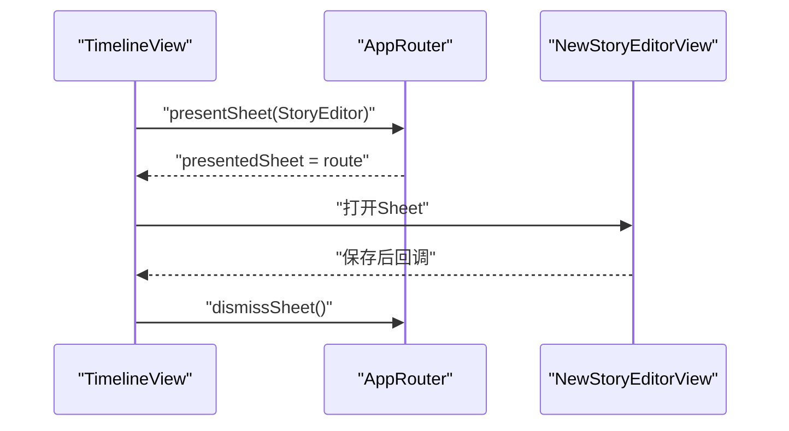
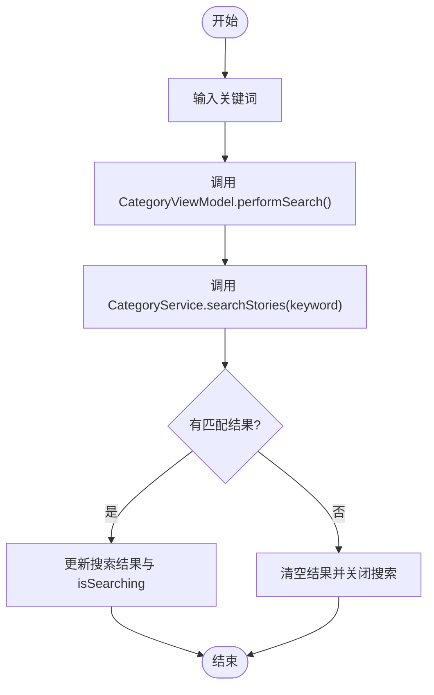
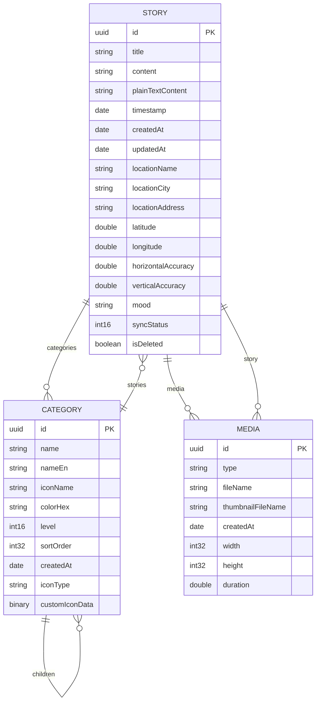
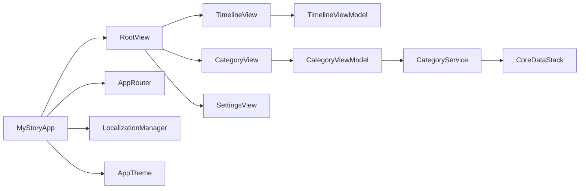

# 架构设计

<cite>
**本文档引用的文件**
- [MyStoryApp.swift](file://MyStory/MyStoryApp.swift)
- [AppRouter.swift](file://MyStory/Core/Router/AppRouter.swift)
- [CoreDataStack.swift](file://MyStory/Core/Storage/CoreDataStack.swift)
- [RootView.swift](file://MyStory/Views/RootView.swift)
- [TimelineView.swift](file://MyStory/Views/Timeline/TimelineView.swift)
- [CategoryView.swift](file://MyStory/Views/Category/CategoryView.swift)
- [CategoryViewModel.swift](file://MyStory/ViewModels/Category/CategoryViewModel.swift)
- [CategoryService.swift](file://MyStory/Services/CategoryService/CategoryService.swift)
- [TimelineViewModel.swift](file://MyStory/Views/Timeline/TimelineViewModel.swift)
- [LocalizationManager.swift](file://MyStory/Utils/LocalizationManager.swift)
- [AppTheme.swift](file://MyStory/Components/Theme/AppTheme.swift)
- [NewStoryEditorView.swift](file://MyStory/Views/Editor/NewStoryEditorView.swift)
- [SettingsView.swift](file://MyStory/Views/Settings/SettingsView.swift)
- [StoryEntity+CoreDataClass.swift](file://MyStory/Models/Entities/StoryEntity+CoreDataClass.swift)
</cite>

## 目录
1. [简介](#简介)
2. [项目结构](#项目结构)
3. [核心组件](#核心组件)
4. [架构总览](#架构总览)
5. [详细组件分析](#详细组件分析)
6. [依赖分析](#依赖分析)
7. [性能考虑](#性能考虑)
8. [故障排查指南](#故障排查指南)
9. [结论](#结论)
10. [附录](#附录)

## 简介
本文件面向 MyStory 应用，系统化阐述其基于 MVVM 的架构设计、路由体系、Core Data 持久化层、SwiftUI 与 UIKit 混合开发实践，以及关键设计决策与性能优化策略。文档旨在帮助开发者快速理解整体设计思路与组件交互流程。

## 项目结构
MyStory 采用以功能域为中心的分层组织方式：
- 应用入口与场景装配：MyStoryApp.swift
- 视图层：Views 下按功能域划分（Timeline、Category、Editor、Settings 等）
- 视图模型层：ViewModels 下按功能域划分（Category、Editor 等）
- 服务层：Services 下按领域划分（CategoryService、MediaStorageService 等）
- 模型与 Core Data：Models/Entities 下的实体与属性扩展
- 组件与主题：Components 下的复用组件与 AppTheme
- 工具与国际化：Utils 下的工具类与 LocalizationManager
- 核心基础设施：Core 下的 Router 与 Storage

**图表来源**
- [MyStoryApp.swift](file://MyStory/MyStoryApp.swift#L1-L32)
- [RootView.swift](file://MyStory/Views/RootView.swift#L1-L43)
- [TimelineView.swift](file://MyStory/Views/Timeline/TimelineView.swift#L1-L304)
- [CategoryView.swift](file://MyStory/Views/Category/CategoryView.swift#L1-L495)
- [CategoryViewModel.swift](file://MyStory/ViewModels/Category/CategoryViewModel.swift#L1-L103)
- [CategoryService.swift](file://MyStory/Services/CategoryService/CategoryService.swift#L1-L675)
- [AppRouter.swift](file://MyStory/Core/Router/AppRouter.swift#L1-L123)
- [CoreDataStack.swift](file://MyStory/Core/Storage/CoreDataStack.swift#L1-L382)
- [LocalizationManager.swift](file://MyStory/Utils/LocalizationManager.swift#L1-L107)
- [AppTheme.swift](file://MyStory/Components/Theme/AppTheme.swift#L1-L328)
- [NewStoryEditorView.swift](file://MyStory/Views/Editor/NewStoryEditorView.swift#L1-L1057)
- [SettingsView.swift](file://MyStory/Views/Settings/SettingsView.swift#L1-L228)
- [StoryEntity+CoreDataClass.swift](file://MyStory/Models/Entities/StoryEntity+CoreDataClass.swift#L1-L51)

**章节来源**
- [MyStoryApp.swift](file://MyStory/MyStoryApp.swift#L1-L32)
- [RootView.swift](file://MyStory/Views/RootView.swift#L1-L43)

## 核心组件
- 应用入口与环境注入
  - 应用通过 App 级别的环境注入 CoreDataStack、AppRouter、LocalizationManager，供全局视图使用。
- 路由系统
  - AppRouter 使用 NavigationPath 管理页面栈，使用 @Published 的 presentedSheet/presentedFullScreen 管理模态展示，统一导航 API（navigate、presentSheet、presentFullScreen、dismiss）。
- 持久化层
  - CoreDataStack 负责容器初始化、合并策略、自动合并、保存等；提供 viewContext 供视图层直接使用。
- 视图层与 MVVM
  - RootView 作为 TabView 入口，承载 Timeline、Category、Settings 三大主页面。
  - TimelineView 与 CategoryView 通过各自的 ViewModel（TimelineViewModel、CategoryViewModel）驱动数据与交互。
- 服务层
  - CategoryService 抽象分类能力，CoreDataCategoryService 提供 Core Data 实现，包含树形查询、父子关系、统计与搜索。
- 主题与国际化
  - AppTheme 提供颜色、字体、间距、阴影等主题令牌；LocalizationManager 管理语言切换与 Bundle 切换。

**章节来源**
- [MyStoryApp.swift](file://MyStory/MyStoryApp.swift#L1-L32)
- [AppRouter.swift](file://MyStory/Core/Router/AppRouter.swift#L1-L123)
- [CoreDataStack.swift](file://MyStory/Core/Storage/CoreDataStack.swift#L1-L382)
- [RootView.swift](file://MyStory/Views/RootView.swift#L1-L43)
- [TimelineView.swift](file://MyStory/Views/Timeline/TimelineView.swift#L1-L304)
- [CategoryView.swift](file://MyStory/Views/Category/CategoryView.swift#L1-L495)
- [CategoryViewModel.swift](file://MyStory/ViewModels/Category/CategoryViewModel.swift#L1-L103)
- [CategoryService.swift](file://MyStory/Services/CategoryService/CategoryService.swift#L1-L675)
- [TimelineViewModel.swift](file://MyStory/Views/Timeline/TimelineViewModel.swift#L1-L43)
- [LocalizationManager.swift](file://MyStory/Utils/LocalizationManager.swift#L1-L107)
- [AppTheme.swift](file://MyStory/Components/Theme/AppTheme.swift#L1-L328)

## 架构总览
MyStory 采用 MVVM + 轻量服务层的架构：
- 视图层（SwiftUI）负责 UI 表达与用户交互
- 视图模型（ObservableObject）负责状态管理与业务逻辑编排
- 服务层（Protocol + 实现）封装领域能力（如分类、媒体、位置、存储）
- 持久化层（Core Data）提供数据持久与关系建模
- 路由层（AppRouter）统一导航与模态展示

**图表来源**
- [AppRouter.swift](file://MyStory/Core/Router/AppRouter.swift#L81-L122)
- [CoreDataStack.swift](file://MyStory/Core/Storage/CoreDataStack.swift#L4-L91)
- [TimelineView.swift](file://MyStory/Views/Timeline/TimelineView.swift#L6-L53)
- [CategoryView.swift](file://MyStory/Views/Category/CategoryView.swift#L3-L93)
- [TimelineViewModel.swift](file://MyStory/Views/Timeline/TimelineViewModel.swift#L4-L42)
- [CategoryViewModel.swift](file://MyStory/ViewModels/Category/CategoryViewModel.swift#L18-L102)
- [CategoryService.swift](file://MyStory/Services/CategoryService/CategoryService.swift#L22-L42)
- [LocalizationManager.swift](file://MyStory/Utils/LocalizationManager.swift#L31-L106)
- [AppTheme.swift](file://MyStory/Components/Theme/AppTheme.swift#L154-L327)

## 详细组件分析

### 路由系统（NavigationStack、Sheet、FullScreen）
- 设计要点
  - 使用 AppRouter 统一管理 NavigationPath 与模态展示，避免在视图中直接操作路由。
  - 通过 AppRoute 枚举描述可导航目标，实现类型安全与可追踪性。
  - 视图层通过 sheet(...)、NavigationLink(...)、NavigationStack 结构化展示内容。
- 交互流程（新建故事编辑器）

**图表来源**
- [TimelineView.swift](file://MyStory/Views/Timeline/TimelineView.swift#L38-L48)
- [AppRouter.swift](file://MyStory/Core/Router/AppRouter.swift#L104-L116)

**章节来源**
- [AppRouter.swift](file://MyStory/Core/Router/AppRouter.swift#L1-L123)
- [TimelineView.swift](file://MyStory/Views/Timeline/TimelineView.swift#L1-L304)
- [CategoryView.swift](file://MyStory/Views/Category/CategoryView.swift#L1-L495)

### MVVM 与视图模型
- TimelineViewModel
  - 负责分页加载 StoryEntity 列表，控制 hasMore、currentPage、pageSize 等状态。
- CategoryViewModel
  - 负责分类树加载、显示模式切换、搜索与统计；调用 CategoryService 执行业务操作。
- 交互流程（分类搜索）

**图表来源**
- [CategoryViewModel.swift](file://MyStory/ViewModels/Category/CategoryViewModel.swift#L84-L95)
- [CategoryService.swift](file://MyStory/Services/CategoryService/CategoryService.swift#L453-L552)

**章节来源**
- [TimelineViewModel.swift](file://MyStory/Views/Timeline/TimelineViewModel.swift#L1-L43)
- [CategoryViewModel.swift](file://MyStory/ViewModels/Category/CategoryViewModel.swift#L1-L103)

### Core Data 持久化层
- 设计要点
  - CoreDataStack 提供 viewContext 并设置自动合并与合并策略，保证主线程渲染一致性。
  - 通过显式 relationship 预加载（prefetch）减少 fault 导致的二次查询与计数不准问题。
  - 关系建模：Story 与 Media 多对多、Story 与 Category 多对多、Category 自引用父子关系。
- 数据模型关系图

**图表来源**
- [CoreDataStack.swift](file://MyStory/Core/Storage/CoreDataStack.swift#L98-L380)
- [StoryEntity+CoreDataClass.swift](file://MyStory/Models/Entities/StoryEntity+CoreDataClass.swift#L11-L50)

**章节来源**
- [CoreDataStack.swift](file://MyStory/Core/Storage/CoreDataStack.swift#L1-L382)
- [CategoryService.swift](file://MyStory/Services/CategoryService/CategoryService.swift#L204-L264)

### SwiftUI 与 UIKit 混合开发
- 混合点
  - 视图层以 SwiftUI 为主，通过 PhotosPicker、AVKit（视频播放）等与 UIKit 能力集成。
  - 编辑器视图中使用 fullScreenCover 展示视频播放器，结合 PhotosPicker 进行媒体选择。
- 优势
  - SwiftUI 提供声明式 UI 与状态驱动，UIKit 组件用于特定能力（如系统相册、视频播放）。
  - 通过环境注入与 ObservableObject 降低耦合，便于测试与演进。

**章节来源**
- [NewStoryEditorView.swift](file://MyStory/Views/Editor/NewStoryEditorView.swift#L1-L1057)

### 主题与国际化
- 主题系统
  - AppTheme 提供 Colors、Typography、Spacing、Radius、Shadow 等主题令牌；ThemeManager/FontScaleManager 通过 UserDefaults 持久化用户偏好。
- 国际化
  - LocalizationManager 管理语言切换与 Bundle 切换，RootView 通过 id 绑定主题/字体缩放触发重渲染。

**章节来源**
- [AppTheme.swift](file://MyStory/Components/Theme/AppTheme.swift#L1-L328)
- [LocalizationManager.swift](file://MyStory/Utils/LocalizationManager.swift#L1-L107)
- [RootView.swift](file://MyStory/Views/RootView.swift#L32-L35)

## 依赖分析
- 组件耦合
  - 视图层依赖视图模型；视图模型依赖服务层；服务层依赖 Core Data 上下文；应用入口统一注入环境。
- 关键依赖链
  - RootView → TimelineView/CategoryView/SettingsView → 对应 ViewModel → Service → Core Data
  - AppRouter 与 CoreDataStack 作为横切关注点被注入到应用环境

**图表来源**
- [MyStoryApp.swift](file://MyStory/MyStoryApp.swift#L1-L32)
- [RootView.swift](file://MyStory/Views/RootView.swift#L1-L43)
- [TimelineView.swift](file://MyStory/Views/Timeline/TimelineView.swift#L1-L304)
- [CategoryView.swift](file://MyStory/Views/Category/CategoryView.swift#L1-L495)
- [CategoryViewModel.swift](file://MyStory/ViewModels/Category/CategoryViewModel.swift#L1-L103)
- [CategoryService.swift](file://MyStory/Services/CategoryService/CategoryService.swift#L1-L675)
- [CoreDataStack.swift](file://MyStory/Core/Storage/CoreDataStack.swift#L1-L382)
- [AppRouter.swift](file://MyStory/Core/Router/AppRouter.swift#L1-L123)
- [LocalizationManager.swift](file://MyStory/Utils/LocalizationManager.swift#L1-L107)
- [AppTheme.swift](file://MyStory/Components/Theme/AppTheme.swift#L1-L328)

**章节来源**
- [MyStoryApp.swift](file://MyStory/MyStoryApp.swift#L1-L32)
- [RootView.swift](file://MyStory/Views/RootView.swift#L1-L43)

## 性能考虑
- Core Data 查询优化
  - 使用 relationshipKeyPathsForPrefetching 预加载多层关系，避免 fault 导致的 N+1 查询与计数不准。
  - fetchLimit + fetchOffset 实现分页加载，控制内存占用。
- 视图渲染优化
  - 使用 LazyVGrid/LazyVStack 与最小化绑定，减少不必要的重绘。
  - 通过 @id 绑定主题与字体缩放，仅在变更时重建相关视图。
- I/O 与异步
  - 视频缩略图生成在后台任务中进行，完成后回到主线程更新 UI。
  - 缓存清理在后台队列执行，避免阻塞主线程。

[本节为通用指导，无需列出具体文件来源]

## 故障排查指南
- 路由异常
  - 若页面无法返回或模态无法关闭，检查 AppRouter 的 navigateBack/dismissSheet/dismissFullScreen 是否被正确调用。
- 数据不一致
  - 确认 CoreDataStack.save() 是否在合适时机调用；检查 viewContext 的自动合并策略是否生效。
- 查询结果为空或计数错误
  - 检查 CategoryService 的 fetch 请求是否包含 relationship 预加载；确保 storyCount/totalStoryCount 的递归计算逻辑。
- 国际化不生效
  - 确认 LocalizationManager 的 Bundle 切换与通知发送；RootView 的 id 绑定是否触发重渲染。

**章节来源**
- [AppRouter.swift](file://MyStory/Core/Router/AppRouter.swift#L86-L121)
- [CoreDataStack.swift](file://MyStory/Core/Storage/CoreDataStack.swift#L86-L91)
- [CategoryService.swift](file://MyStory/Services/CategoryService/CategoryService.swift#L209-L210)
- [LocalizationManager.swift](file://MyStory/Utils/LocalizationManager.swift#L37-L42)

## 结论
MyStory 通过清晰的 MVVM 分层、统一的路由与持久化抽象、完善的主题与国际化机制，构建了可维护、可扩展的 SwiftUI 应用架构。配合 Core Data 的关系建模与预加载策略，满足复杂业务场景的数据需求；同时在 SwiftUI 与 UIKit 的混合使用中保持了良好的边界与解耦。

[本节为总结性内容，无需列出具体文件来源]

## 附录
- 关键 API 速览
  - 路由：navigate(to), navigateBack, navigateToRoot, presentSheet, presentFullScreen, dismissSheet, dismissFullScreen
  - 持久化：CoreDataStack.save(), viewContext
  - 主题：ThemeManager.currentTheme, FontScaleManager.currentScale
  - 国际化：LocalizationManager.currentLanguage, localizedString

[本节为概览性内容，无需列出具体文件来源]