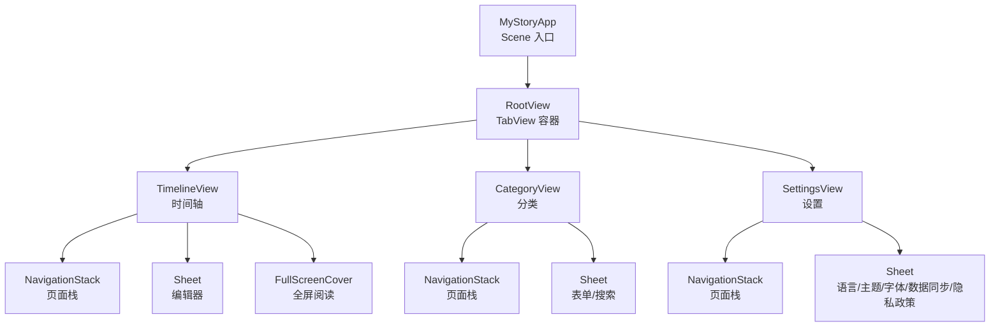
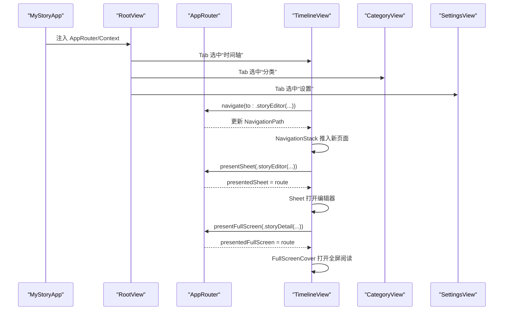
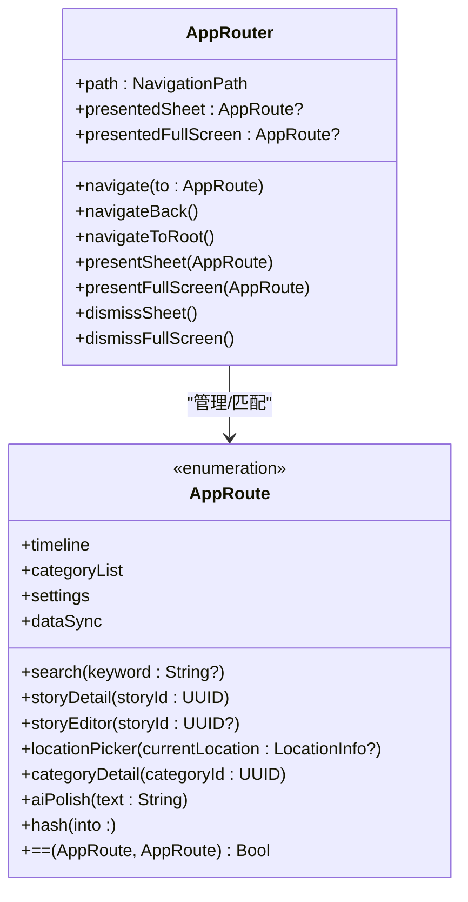
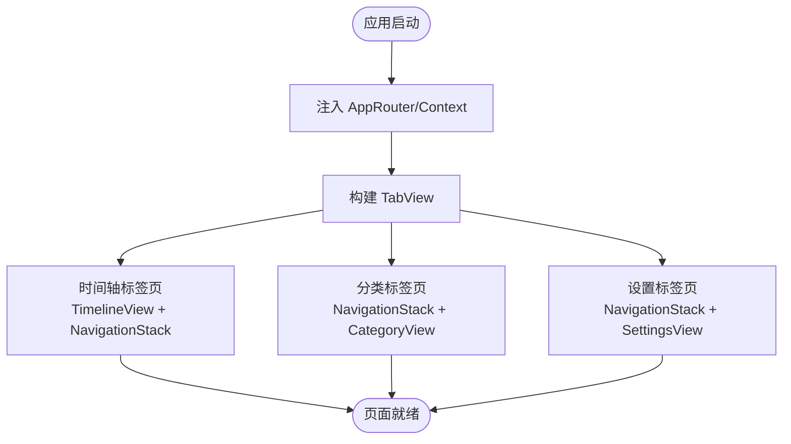
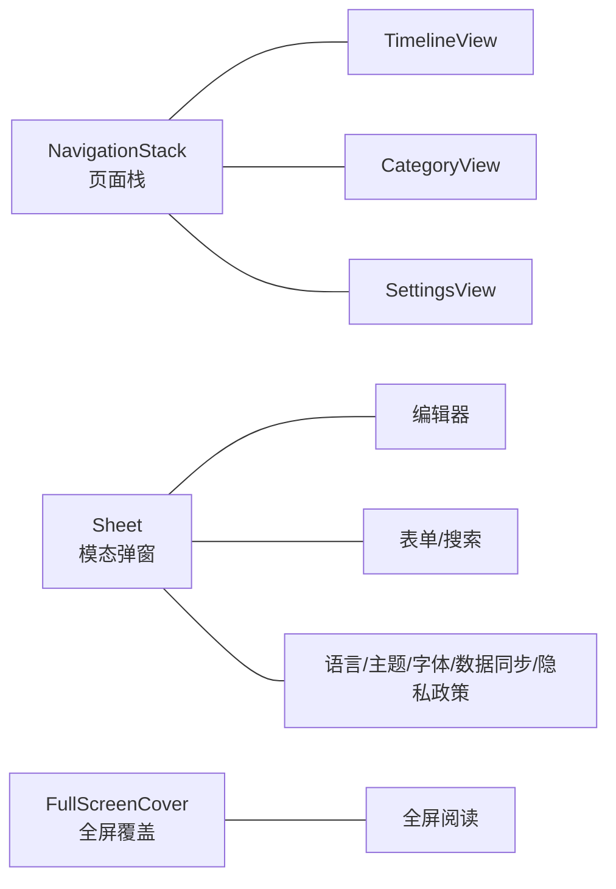
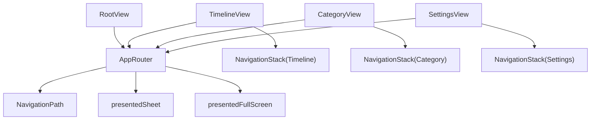

# 路由与导航系统

<cite>
**本文引用的文件**
- [AppRouter.swift](file://MyStory/Core/Router/AppRouter.swift)
- [RootView.swift](file://MyStory/Views/RootView.swift)
- [MyStoryApp.swift](file://MyStory/MyStoryApp.swift)
- [TimelineView.swift](file://MyStory/Views/Timeline/TimelineView.swift)
- [CategoryView.swift](file://MyStory/Views/Category/CategoryView.swift)
- [SettingsView.swift](file://MyStory/Views/Settings/SettingsView.swift)
- [NewStoryEditorView.swift](file://MyStory/Views/Editor/NewStoryEditorView.swift)
- [FullScreenStoryView.swift](file://MyStory/Views/Timeline/FullScreenStoryView.swift)
- [Design.md](file://Design.md)
</cite>

## 目录
1. [简介](#简介)
2. [项目结构](#项目结构)
3. [核心组件](#核心组件)
4. [架构总览](#架构总览)
5. [详细组件分析](#详细组件分析)
6. [依赖关系分析](#依赖关系分析)
7. [性能考量](#性能考量)
8. [故障排查指南](#故障排查指南)
9. [结论](#结论)
10. [附录](#附录)

## 简介
本文件系统性梳理 MyStory 应用的路由与导航体系，围绕统一路由枚举 AppRoute、路由协调器 AppRouter、根视图 RootView 的组织结构与页面初始化流程进行深入解析；同时总结 SwiftUI NavigationStack、Sheet 与 FullScreenCover 的使用策略与适用场景，给出深度链接实现方案与扩展建议，并提供路由状态管理、导航动画与用户体验优化的最佳实践。

## 项目结构
MyStory 的导航体系采用“TabView 主导航 + NavigationStack 二级导航 + Sheet/FullScreenCover 模态”的分层设计。应用通过 AppRouter 统一管理页面栈与模态展示，RootView 作为容器承载三个主标签页，各子页面内部再使用 NavigationStack 构建页面栈，配合 Sheet/FullScreenCover 完成编辑器与全屏阅读等交互。

图表来源
- [MyStoryApp.swift](file://MyStory/MyStoryApp.swift#L21-L29)
- [RootView.swift](file://MyStory/Views/RootView.swift#L10-L36)
- [TimelineView.swift](file://MyStory/Views/Timeline/TimelineView.swift#L22-L53)
- [CategoryView.swift](file://MyStory/Views/Category/CategoryView.swift#L25-L94)
- [SettingsView.swift](file://MyStory/Views/Settings/SettingsView.swift#L26-L188)

章节来源
- [MyStoryApp.swift](file://MyStory/MyStoryApp.swift#L11-L30)
- [RootView.swift](file://MyStory/Views/RootView.swift#L3-L36)

## 核心组件
- AppRoute：统一的路由枚举，承载所有可导航目标及其携带的参数（如故事 ID、分类 ID、关键字、文本等），并显式实现 Hashable 与等值比较，确保 NavigationPath 与 Sheet/FullScreen 的识别与去重。
- AppRouter：ObservableObject，持有 NavigationPath 与两个模态路由项（presentedSheet、presentedFullScreen），提供 navigate、navigateBack、navigateToRoot、presentSheet、presentFullScreen、dismissSheet、dismissFullScreen 等方法，作为全局导航控制中心。
- RootView：以 TabView 承载三大主页面，分别对应时间轴、分类与设置；通过环境注入 AppRouter，使各子页面共享同一套导航状态。
- 子页面导航：
  - TimelineView：使用 NavigationStack 包裹内容，结合 Sheet 展示编辑器，结合 FullScreenCover 展示全屏阅读。
  - CategoryView：使用 NavigationStack 包裹内容，结合 Sheet 展示表单与搜索，内部通过 NavigationLink 触发到故事列表。
  - SettingsView：使用 NavigationStack 包裹内容，结合多个 Sheet 展示语言、主题、字体、数据同步、隐私政策等设置页。

章节来源
- [AppRouter.swift](file://MyStory/Core/Router/AppRouter.swift#L10-L79)
- [AppRouter.swift](file://MyStory/Core/Router/AppRouter.swift#L81-L122)
- [RootView.swift](file://MyStory/Views/RootView.swift#L3-L36)
- [TimelineView.swift](file://MyStory/Views/Timeline/TimelineView.swift#L22-L53)
- [CategoryView.swift](file://MyStory/Views/Category/CategoryView.swift#L25-L94)
- [SettingsView.swift](file://MyStory/Views/Settings/SettingsView.swift#L26-L188)

## 架构总览
下图展示了从应用启动到页面导航的关键调用链路与状态流转：

图表来源
- [MyStoryApp.swift](file://MyStory/MyStoryApp.swift#L21-L29)
- [RootView.swift](file://MyStory/Views/RootView.swift#L10-L36)
- [AppRouter.swift](file://MyStory/Core/Router/AppRouter.swift#L81-L122)
- [TimelineView.swift](file://MyStory/Views/Timeline/TimelineView.swift#L22-L53)

## 详细组件分析

### AppRouter 设计与实现
- 路由枚举 AppRoute
  - 支持基础页面：时间轴、分类列表、设置、数据同步等。
  - 支持带参页面：搜索（keyword）、故事详情（storyId）、故事编辑（storyId?）、位置选择（currentLocation?）、分类详情（categoryId）、AI 润色（text）。
  - 显式实现 Hashable 与等值比较，保证 NavigationPath 与 Sheet/FullScreen 的唯一性与可识别性。
- 导航控制
  - 页面栈管理：@Published var path = NavigationPath()，提供 navigate、navigateBack、navigateToRoot。
  - 模态展示：@Published var presentedSheet、presentedFullScreen，提供 present/dismiss 方法。
- 使用建议
  - 对于需要保留历史记录的页面跳转，使用 navigate；对于一次性展示的编辑器、选择器等，优先使用 Sheet/FullScreen。
  - 对于复杂参数传递，尽量封装到 AppRoute 的 case 中，避免在视图间直接传递大量状态。

图表来源
- [AppRouter.swift](file://MyStory/Core/Router/AppRouter.swift#L10-L79)
- [AppRouter.swift](file://MyStory/Core/Router/AppRouter.swift#L81-L122)

章节来源
- [AppRouter.swift](file://MyStory/Core/Router/AppRouter.swift#L10-L79)
- [AppRouter.swift](file://MyStory/Core/Router/AppRouter.swift#L81-L122)

### RootView 组织结构与页面初始化
- 三大主标签页：
  - 时间轴：TimelineView，内置 NavigationStack。
  - 分类：NavigationStack 包裹 CategoryView。
  - 设置：SettingsView，内置 NavigationStack。
- 环境注入：
  - AppRouter、Core Data 上下文、国际化与主题管理器通过环境注入，确保全局可用。
- 主题与字体缩放：
  - 通过 .id(...) 强制在主题或字体缩放变化时触发重建，保障 UI 即时生效。

图表来源
- [MyStoryApp.swift](file://MyStory/MyStoryApp.swift#L21-L29)
- [RootView.swift](file://MyStory/Views/RootView.swift#L10-L36)

章节来源
- [RootView.swift](file://MyStory/Views/RootView.swift#L3-L36)
- [MyStoryApp.swift](file://MyStory/MyStoryApp.swift#L11-L30)

### SwiftUI 导航策略与适用场景
- NavigationStack（页面栈）
  - 适用于需要返回历史页面的场景，如时间轴到故事详情、分类到故事列表。
  - 在 TimelineView 与 CategoryView 中广泛使用，保证用户可回退。
- Sheet（半屏/抽屉式）
  - 适用于临时编辑、选择、配置等轻量交互，如故事编辑器、分类表单、搜索、语言/主题/字体设置、隐私政策等。
  - 在 TimelineView、CategoryView、SettingsView 中均有体现。
- FullScreenCover（全屏覆盖）
  - 适用于沉浸式体验，如全屏阅读故事。
  - 在 TimelineView 中对故事详情使用 FullScreenCover。

图表来源
- [TimelineView.swift](file://MyStory/Views/Timeline/TimelineView.swift#L22-L53)
- [CategoryView.swift](file://MyStory/Views/Category/CategoryView.swift#L25-L94)
- [SettingsView.swift](file://MyStory/Views/Settings/SettingsView.swift#L26-L188)
- [NewStoryEditorView.swift](file://MyStory/Views/Editor/NewStoryEditorView.swift#L43-L57)
- [FullScreenStoryView.swift](file://MyStory/Views/Timeline/FullScreenStoryView.swift#L159-L197)

章节来源
- [TimelineView.swift](file://MyStory/Views/Timeline/TimelineView.swift#L22-L53)
- [CategoryView.swift](file://MyStory/Views/Category/CategoryView.swift#L25-L94)
- [SettingsView.swift](file://MyStory/Views/Settings/SettingsView.swift#L26-L188)
- [NewStoryEditorView.swift](file://MyStory/Views/Editor/NewStoryEditorView.swift#L43-L57)
- [FullScreenStoryView.swift](file://MyStory/Views/Timeline/FullScreenStoryView.swift#L159-L197)

### 深度链接实现方案（URL Scheme）
- 设计原则
  - 采用统一的 URL Scheme 命名空间，例如 mystory://route/params。
  - 路由映射：将 URL 片段映射到 AppRoute 的对应 case，如 storyDetail、categoryDetail、search、aiPolish、dataSync 等。
- 参数解析
  - 解析路径段与查询参数，构造对应的 AppRoute 参数（如 UUID、String）。
  - 对非法或缺失参数进行容错处理，必要时回退到默认页面。
- 页面跳转逻辑
  - 在应用委托或 Scene 中监听 URL，解析后通过 AppRouter.navigate 或 presentSheet/presentFullScreen 触发跳转。
  - 对于需要预热的数据（如故事详情），可在跳转前异步加载，提升首屏体验。
- 与现有设计的契合
  - AppRoute 已具备带参 case，天然适配深度链接参数；AppRouter 的 navigate/present 方法可直接驱动跳转。

章节来源
- [Design.md](file://Design.md#L755-L767)
- [AppRouter.swift](file://MyStory/Core/Router/AppRouter.swift#L10-L79)
- [AppRouter.swift](file://MyStory/Core/Router/AppRouter.swift#L81-L122)

### 扩展方法与自定义导航组件
- 新增路由
  - 在 AppRoute 中新增 case，并在 AppRouter 中补充相应导航/模态方法。
  - 在目标视图中根据需要使用 NavigationLink/NavigationPath 或 Sheet/FullScreenCover。
- 自定义导航组件
  - 可封装通用的导航触发器（如导航按钮、菜单项），集中调用 AppRouter 的方法，便于统一风格与埋点。
  - 对复杂页面栈，可引入路由守卫（如保存确认、权限校验）后再执行 navigate。
- 模态组件最佳实践
  - 使用 .presentationDetents/.presentationDragIndicator 等修饰符提升 Sheet 的可用性。
  - 对全屏组件，注意生命周期管理与资源释放，避免内存泄漏。

章节来源
- [AppRouter.swift](file://MyStory/Core/Router/AppRouter.swift#L81-L122)
- [NewStoryEditorView.swift](file://MyStory/Views/Editor/NewStoryEditorView.swift#L43-L57)

## 依赖关系分析
- 组件耦合
  - RootView 与三大子页面通过 TabView 聚合，均依赖 AppRouter 进行导航协调。
  - 子页面内部使用 NavigationStack，彼此相对独立，降低耦合。
- 外部依赖
  - SwiftUI 导航原语（NavigationStack、NavigationLink、Sheet、FullScreenCover）。
  - CoreData 上下文用于数据读写（通过环境注入）。
- 潜在风险
  - 若多处直接操作 NavigationPath，可能导致状态不一致；应统一通过 AppRouter 管理。
  - Sheet/FullScreen 的状态需与页面栈保持一致，避免重复打开或无法关闭。

图表来源
- [AppRouter.swift](file://MyStory/Core/Router/AppRouter.swift#L81-L122)
- [RootView.swift](file://MyStory/Views/RootView.swift#L10-L36)
- [TimelineView.swift](file://MyStory/Views/Timeline/TimelineView.swift#L22-L53)
- [CategoryView.swift](file://MyStory/Views/Category/CategoryView.swift#L25-L94)
- [SettingsView.swift](file://MyStory/Views/Settings/SettingsView.swift#L26-L188)

章节来源
- [AppRouter.swift](file://MyStory/Core/Router/AppRouter.swift#L81-L122)
- [RootView.swift](file://MyStory/Views/RootView.swift#L10-L36)

## 性能考量
- 页面栈管理
  - 避免在短时间内频繁 push/pop，减少不必要的视图重建。
  - 对长列表（如时间轴、分类树）使用惰性渲染（LazyVStack/LazyVGrid）与分页加载。
- 模态展示
  - Sheet/FullScreen 的内容应按需加载，避免在未打开时占用资源。
  - 全屏阅读组件（如 FullScreenStoryView）需合理管理控制器生命周期与媒体资源。
- 动画与过渡
  - SwiftUI 默认动画较为流畅，若自定义过渡，注意帧率与内存占用。
- 状态一致性
  - 通过 AppRouter 统一管理导航状态，避免多源修改导致的卡顿或异常。

## 故障排查指南
- 问题：Sheet/FullScreen 无法关闭
  - 检查是否正确调用 AppRouter.dismissSheet()/dismissFullScreen()。
  - 确认绑定的可选项状态与 AppRouter 的 presentedSheet/presentedFullScreen 是否一致。
- 问题：页面无法返回
  - 检查 NavigationPath 是否为空（navigateBack 前先判断 isEmpty）。
  - 确认 NavigationLink/NavigationStack 的 destination 是否正确。
- 问题：主题/字体变化后 UI 不刷新
  - 确认 RootView 是否通过 .id(...) 强制重建。
- 问题：深度链接无效
  - 检查 URL Scheme 是否正确注册，解析逻辑是否将 URL 映射到 AppRoute 的对应 case。
  - 确认 AppRouter 的 navigate/present 方法被调用。

章节来源
- [AppRouter.swift](file://MyStory/Core/Router/AppRouter.swift#L81-L122)
- [RootView.swift](file://MyStory/Views/RootView.swift#L32-L35)
- [TimelineView.swift](file://MyStory/Views/Timeline/TimelineView.swift#L38-L48)
- [CategoryView.swift](file://MyStory/Views/Category/CategoryView.swift#L48-L62)
- [SettingsView.swift](file://MyStory/Views/Settings/SettingsView.swift#L136-L150)

## 结论
MyStory 的路由与导航系统以 AppRouter 为核心，结合 SwiftUI 的 NavigationStack、Sheet 与 FullScreenCover，形成了清晰的分层导航结构。通过统一的 AppRoute 枚举与严格的导航控制，系统在可维护性与用户体验之间取得了良好平衡。建议在后续迭代中完善深度链接能力，并持续通过 AppRouter 统一管理所有导航行为，确保状态一致性与性能稳定。

## 附录
- 最佳实践清单
  - 统一通过 AppRouter 管理所有导航与模态展示。
  - 对带参路由在 AppRoute 中显式声明，避免隐式参数。
  - 使用惰性渲染与分页加载优化长列表性能。
  - 为 Sheet/FullScreen 提供明确的关闭路径与回退策略。
  - 在主题/字体切换时强制重建关键视图，确保即时生效。
  - 为深度链接提供完善的参数解析与容错处理。