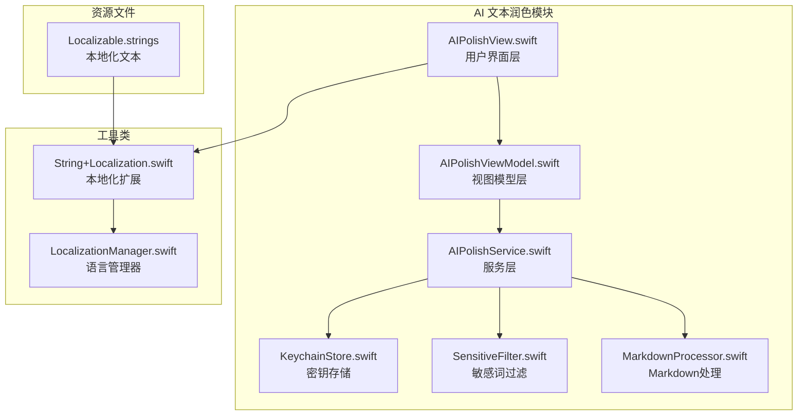
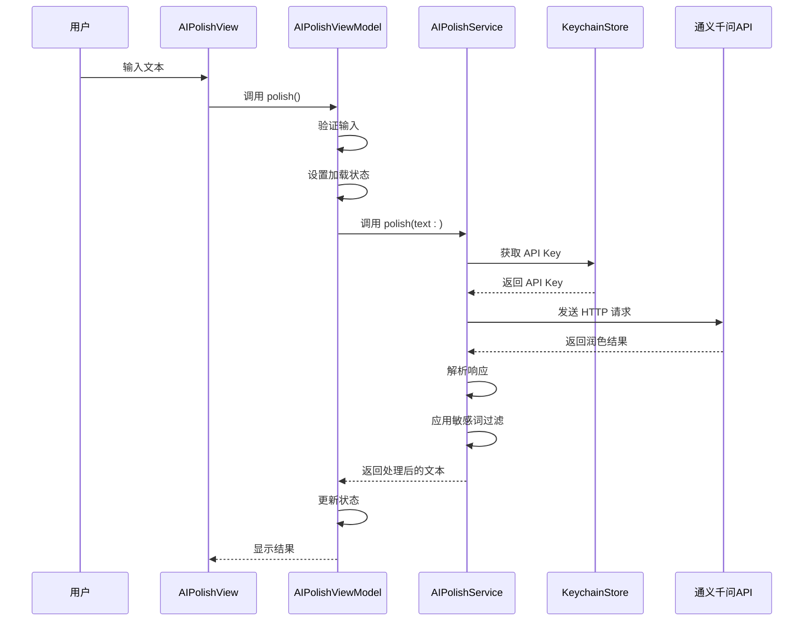
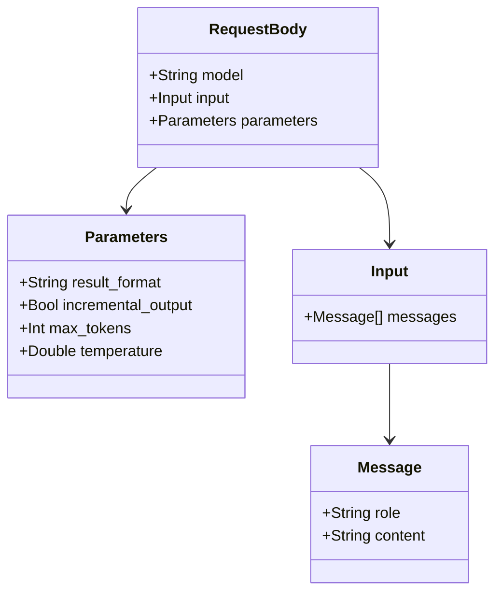
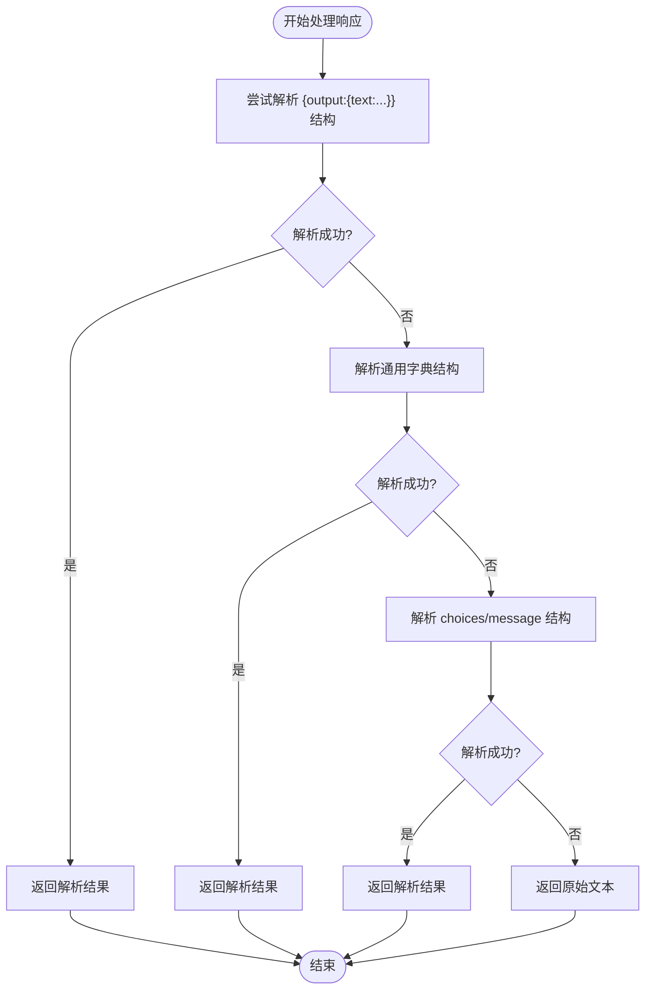
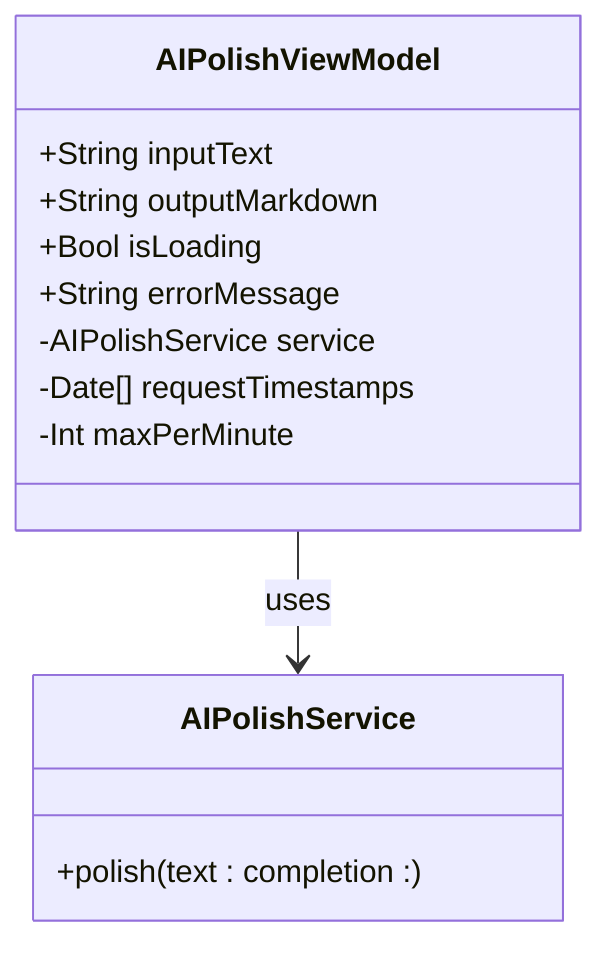
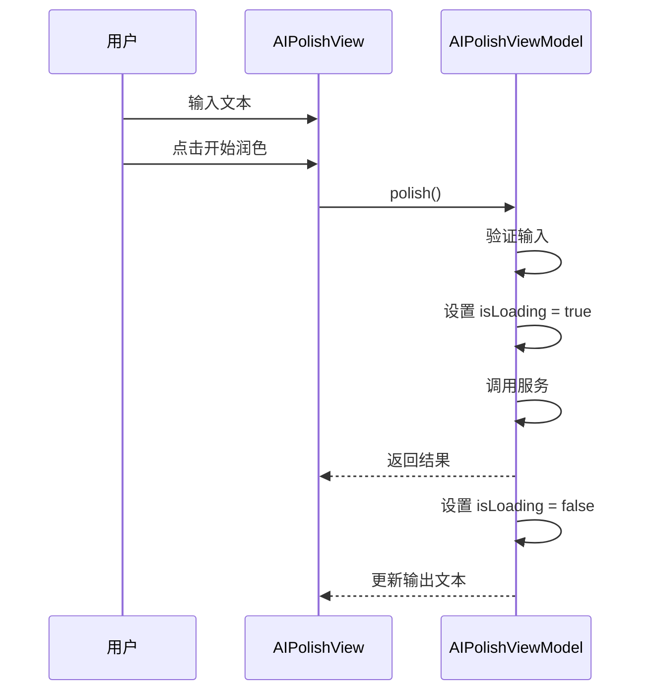
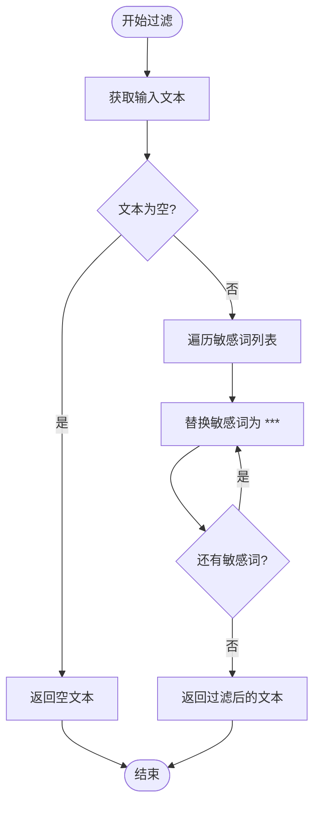
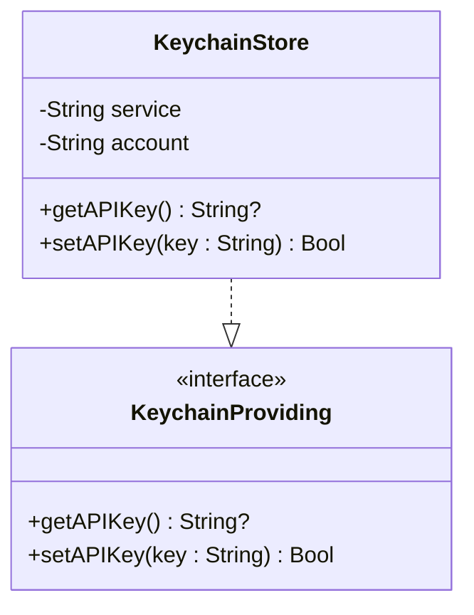
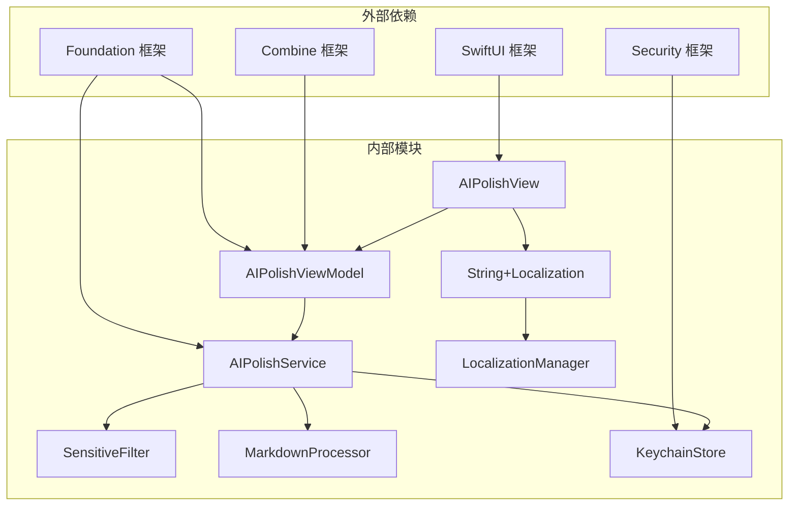

# AI 文本润色模块

<cite>
**本文档引用的文件**
- [AIPolishService.swift](file://MyStory/Services/AIService/AIPolishService.swift)
- [AIPolishView.swift](file://MyStory/Views/Editor/AIPolishView.swift)
- [AIPolishViewModel.swift](file://MyStory/ViewModels/Editor/AIPolishViewModel.swift)
- [SensitiveFilter.swift](file://MyStory/Utils/SensitiveFilter.swift)
- [MarkdownProcessor.swift](file://MyStory/Utils/MarkdownProcessor.swift)
- [KeychainStore.swift](file://MyStory/Core/Storage/KeychainStore.swift)
- [String+Localization.swift](file://MyStory/Utils/String+Localization.swift)
- [LocalizationManager.swift](file://MyStory/Utils/LocalizationManager.swift)
- [Localizable.strings (中文)](file://MyStory/Resources/Localizable/zh-Hans.lproj/Localizable.strings)
- [Localizable.strings (英文)](file://MyStory/Resources/Localizable/en.lproj/Localizable.strings)
</cite>

## 目录
1. [简介](#简介)
2. [项目结构](#项目结构)
3. [核心组件](#核心组件)
4. [架构概览](#架构概览)
5. [详细组件分析](#详细组件分析)
6. [依赖关系分析](#依赖关系分析)
7. [性能考虑](#性能考虑)
8. [故障排除指南](#故障排除指南)
9. [结论](#结论)

## 简介

AI 文本润色模块是 MyStory 应用中的一个核心功能，它允许用户通过通义千问 API 对文本进行智能润色。该模块实现了完整的端到端工作流程，从用户输入到最终输出，包括 API 集成、请求参数配置、响应处理、敏感词过滤和用户界面设计。

该模块采用 MVVM 架构模式，通过清晰的职责分离实现了高内聚、低耦合的设计。用户可以通过直观的界面输入文本，系统会自动调用 AI 服务进行润色，并提供实时的加载状态反馈和错误处理。

## 项目结构

AI 文本润色模块在项目中的组织结构如下：



**图表来源**
- [AIPolishView.swift](file://MyStory/Views/Editor/AIPolishView.swift#L1-L47)
- [AIPolishViewModel.swift](file://MyStory/ViewModels/Editor/AIPolishViewModel.swift#L1-L46)
- [AIPolishService.swift](file://MyStory/Services/AIService/AIPolishService.swift#L1-L77)

**章节来源**
- [AIPolishView.swift](file://MyStory/Views/Editor/AIPolishView.swift#L1-L47)
- [AIPolishViewModel.swift](file://MyStory/ViewModels/Editor/AIPolishViewModel.swift#L1-L46)
- [AIPolishService.swift](file://MyStory/Services/AIService/AIPolishService.swift#L1-L77)

## 核心组件

AI 文本润色模块由以下核心组件构成：

### 1. AIPolishService - AI 服务层
负责与通义千问 API 的集成，处理 HTTP 请求和响应解析。

### 2. AIPolishViewModel - 视图模型层
管理应用状态，处理用户交互，协调服务层调用。

### 3. AIPolishView - 视图层
提供用户界面，展示输入区域、润色选项和结果展示。

### 4. SensitiveFilter - 敏感词过滤器
实现文本敏感词检测和替换功能。

### 5. MarkdownProcessor - Markdown 处理器
处理 Markdown 格式转换。

### 6. KeychainStore - 密钥存储
安全存储和管理 API 密钥。

**章节来源**
- [AIPolishService.swift](file://MyStory/Services/AIService/AIPolishService.swift#L8-L77)
- [AIPolishViewModel.swift](file://MyStory/ViewModels/Editor/AIPolishViewModel.swift#L4-L46)
- [AIPolishView.swift](file://MyStory/Views/Editor/AIPolishView.swift#L3-L47)
- [SensitiveFilter.swift](file://MyStory/Utils/SensitiveFilter.swift#L3-L18)
- [MarkdownProcessor.swift](file://MyStory/Utils/MarkdownProcessor.swift#L3-L9)
- [KeychainStore.swift](file://MyStory/Core/Storage/KeychainStore.swift#L4-L40)

## 架构概览

AI 文本润色模块采用 MVVM 架构模式，实现了清晰的关注点分离：



**图表来源**
- [AIPolishView.swift](file://MyStory/Views/Editor/AIPolishView.swift#L25-L29)
- [AIPolishViewModel.swift](file://MyStory/ViewModels/Editor/AIPolishViewModel.swift#L18-L39)
- [AIPolishService.swift](file://MyStory/Services/AIService/AIPolishService.swift#L30-L61)

该架构具有以下特点：
- **单向数据流**：数据从服务层流向视图层，保证状态一致性
- **异步处理**：所有网络请求都是异步执行，避免阻塞主线程
- **错误处理**：完善的错误处理机制，提供用户友好的错误提示
- **状态管理**：通过 Combine 框架实现响应式状态更新

## 详细组件分析

### AIPolishService - AI 服务实现

AIPolishService 是模块的核心服务类，负责与通义千问 API 的完整集成：

#### API 集成配置

服务类使用通义千问的 DashScope API，配置如下：
- **端点地址**：`https://dashscope.aliyuncs.com/api/v1/services/aigc/text-generation/generation`
- **模型名称**：`qwen-plus`
- **HTTP 方法**：POST
- **认证方式**：Bearer Token
- **超时时间**：30 秒

#### 请求参数配置

请求体结构包含三个主要部分：



**图表来源**
- [AIPolishService.swift](file://MyStory/Services/AIService/AIPolishService.swift#L16-L28)

#### 响应处理逻辑

服务实现了灵活的响应解析机制，支持多种返回格式：



**图表来源**
- [AIPolishService.swift](file://MyStory/Services/AIService/AIPolishService.swift#L63-L75)

#### 错误处理机制

服务提供了多层次的错误处理：
- **API Key 验证**：检查密钥是否存在且有效
- **网络错误**：捕获网络请求异常
- **解析错误**：处理 JSON 解析失败的情况
- **空响应**：处理无数据返回的情况

**章节来源**
- [AIPolishService.swift](file://MyStory/Services/AIService/AIPolishService.swift#L8-L77)

### AIPolishViewModel - 状态管理

AIPolishViewModel 实现了完整的状态管理逻辑：

#### 状态属性



**图表来源**
- [AIPolishViewModel.swift](file://MyStory/ViewModels/Editor/AIPolishViewModel.swift#L4-L16)

#### 速率限制机制

实现了一个基于时间窗口的速率限制：
- **限制数量**：每分钟最多 5 次请求
- **时间窗口**：60 秒
- **实现方式**：维护请求时间戳数组，定期清理过期记录

#### 异步请求处理

使用弱引用避免循环引用：
- **主线程回调**：确保 UI 更新在主线程执行
- **错误处理**：将错误信息传递给视图层显示
- **状态更新**：自动管理加载状态

**章节来源**
- [AIPolishViewModel.swift](file://MyStory/ViewModels/Editor/AIPolishViewModel.swift#L4-L46)

### AIPolishView - 用户界面设计

AIPolishView 提供了直观的用户界面：

#### 界面布局

```mermaid
graph TB
subgraph "主容器"
Title[标题: "AI 文本润色"]
Input[文本编辑器]
Button[开始润色按钮]
Error[错误信息显示]
Result[结果展示区域]
end
Title --> Input
Input --> Button
Button --> Error
Error --> Result
```

**图表来源**
- [AIPolishView.swift](file://MyStory/Views/Editor/AIPolishView.swift#L10-L45)

#### 用户交互流程



**图表来源**
- [AIPolishView.swift](file://MyStory/Views/Editor/AIPolishView.swift#L25-L39)

**章节来源**
- [AIPolishView.swift](file://MyStory/Views/Editor/AIPolishView.swift#L3-L47)

### 敏感词过滤机制

敏感词过滤器提供了基础的文本安全检查：

#### 过滤规则配置



**图表来源**
- [SensitiveFilter.swift](file://MyStory/Utils/SensitiveFilter.swift#L10-L16)

#### 替换策略

- **替换字符**：使用 `***` 替换敏感词
- **大小写不敏感**：当前实现区分大小写
- **完整匹配**：只替换完整匹配的敏感词

**章节来源**
- [SensitiveFilter.swift](file://MyStory/Utils/SensitiveFilter.swift#L3-L18)

### Markdown 处理

MarkdownProcessor 提供了基础的 Markdown 支持：

#### 处理逻辑

当前版本的 Markdown 处理器直接返回输入文本，为后续扩展预留了接口：
- **设计原则**：保持简单，避免过度处理
- **扩展性**：可以轻松添加 Markdown 解析功能
- **兼容性**：确保现有功能不受影响

**章节来源**
- [MarkdownProcessor.swift](file://MyStory/Utils/MarkdownProcessor.swift#L3-L9)

### Keychain 存储集成

KeychainStore 实现了安全的 API Key 存储：

#### 存储机制



**图表来源**
- [KeychainStore.swift](file://MyStory/Core/Storage/KeychainStore.swift#L4-L39)

#### 安全特性

- **iOS 钥匙串**：利用系统安全存储
- **UTF-8 编码**：确保字符编码正确
- **更新优先**：优先尝试更新现有记录
- **自动创建**：不存在时自动创建新记录

**章节来源**
- [KeychainStore.swift](file://MyStory/Core/Storage/KeychainStore.swift#L4-L40)

## 依赖关系分析

AI 文本润色模块的依赖关系如下：



**图表来源**
- [AIPolishService.swift](file://MyStory/Services/AIService/AIPolishService.swift#L1-L2)
- [AIPolishViewModel.swift](file://MyStory/ViewModels/Editor/AIPolishViewModel.swift#L1-L2)
- [AIPolishView.swift](file://MyStory/Views/Editor/AIPolishView.swift#L1)

### 组件耦合度分析

- **低耦合**：各组件职责明确，相互独立
- **接口隔离**：通过协议定义依赖关系
- **依赖注入**：通过构造函数注入依赖
- **弱引用**：避免循环引用问题

**章节来源**
- [AIPolishService.swift](file://MyStory/Services/AIService/AIPolishService.swift#L1-L77)
- [AIPolishViewModel.swift](file://MyStory/ViewModels/Editor/AIPolishViewModel.swift#L1-L46)
- [AIPolishView.swift](file://MyStory/Views/Editor/AIPolishView.swift#L1-L47)

## 性能考虑

### 网络请求优化

1. **超时设置**：30 秒超时避免长时间等待
2. **异步处理**：所有网络请求都在后台线程执行
3. **错误快速返回**：网络错误时立即返回，避免资源浪费

### 内存管理

1. **弱引用**：ViewModel 中使用弱引用避免循环引用
2. **及时释放**：完成任务后及时清理状态
3. **内存监控**：注意大型文本的内存占用

### 用户体验优化

1. **加载状态**：提供视觉反馈避免用户困惑
2. **错误提示**：清晰的错误信息帮助用户理解问题
3. **输入验证**：提前验证用户输入减少无效请求

## 故障排除指南

### 常见问题及解决方案

#### 1. API Key 未配置
**症状**：调用服务时返回 "未配置通义千问 API Key" 错误
**解决方法**：
- 检查 KeychainStore 中的 API Key 是否存在
- 确认 API Key 格式正确
- 重新设置 API Key 并重启应用

#### 2. 网络请求超时
**症状**：请求超过 30 秒仍未响应
**解决方法**：
- 检查网络连接状态
- 确认 API 端点可达
- 重试请求或检查防火墙设置

#### 3. 响应解析失败
**症状**：返回的 JSON 格式不符合预期
**解决方法**：
- 检查 API 返回格式
- 查看服务端日志
- 更新解析逻辑以支持新格式

#### 4. 速率限制错误
**症状**：频繁请求被拒绝
**解决方法**：
- 等待 60 秒后重试
- 减少请求频率
- 检查是否有其他实例在使用相同的 API Key

#### 5. 敏感词过滤问题
**症状**：敏感词未被正确过滤
**解决方法**：
- 检查敏感词列表配置
- 确认替换策略符合预期
- 考虑添加更多敏感词到词库

**章节来源**
- [AIPolishService.swift](file://MyStory/Services/AIService/AIPolishService.swift#L31-L34)
- [AIPolishViewModel.swift](file://MyStory/ViewModels/Editor/AIPolishViewModel.swift#L23-L25)

## 结论

AI 文本润色模块是一个设计良好的功能模块，具有以下优点：

### 技术优势
- **架构清晰**：采用 MVVM 模式，职责分离明确
- **安全性强**：使用 iOS 钥匙串存储敏感信息
- **用户体验好**：提供实时反馈和错误处理
- **扩展性强**：模块化设计便于功能扩展

### 改进建议
1. **增强敏感词过滤**：支持正则表达式和大小写不敏感匹配
2. **添加缓存机制**：避免重复请求相同内容
3. **实现撤销功能**：允许用户撤销润色操作
4. **增加配置选项**：允许用户自定义润色风格
5. **优化网络层**：添加重试机制和连接池管理

### 最佳实践总结
- 使用协议定义接口，便于测试和替换
- 实现完整的错误处理和用户反馈
- 采用异步编程避免阻塞主线程
- 注重安全性，特别是敏感信息的存储
- 提供清晰的状态管理和生命周期控制

该模块为 MyStory 应用提供了强大的文本润色能力，为用户创造更好的写作体验。