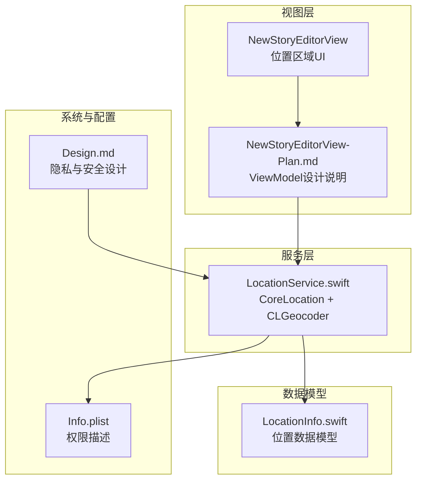
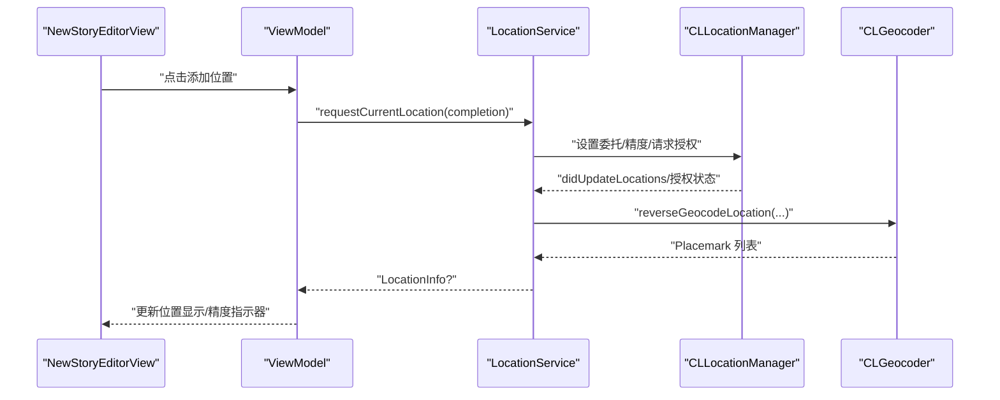
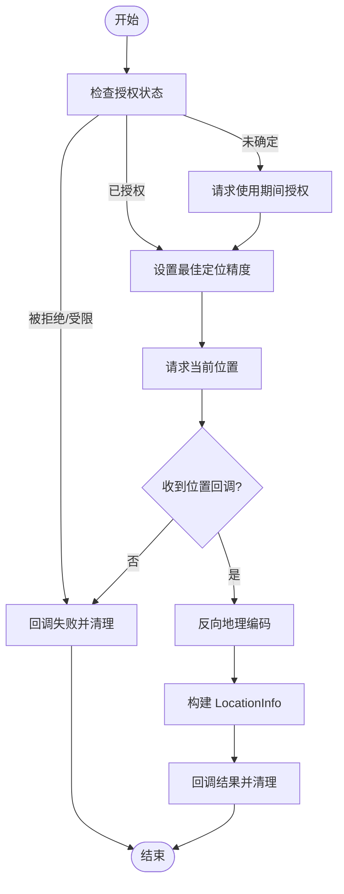
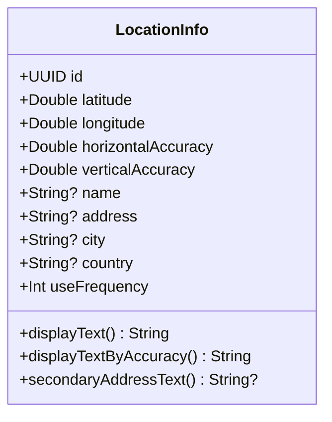
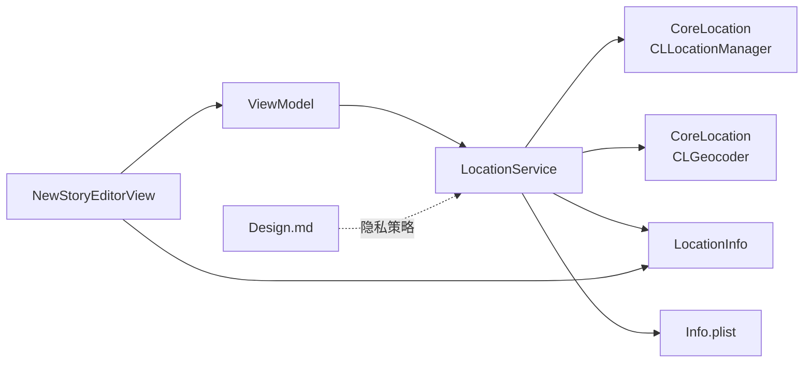

# 位置服务模块

<cite>
**本文引用的文件**
- [LocationService.swift](file://MyStory/Services/LocationService.swift)
- [LocationInfo.swift](file://MyStory/Models/ViewModels/LocationInfo.swift)
- [NewStoryEditorView.swift](file://MyStory/Views/Editor/NewStoryEditorView.swift)
- [NewStoryEditorView-Plan.md](file://MyStory/Views/Editor/NewStoryEditorView-Plan.md)
- [Info.plist](file://MyStory/Info.plist)
- [Design.md](file://Design.md)
</cite>

## 目录
1. [简介](#简介)
2. [项目结构](#项目结构)
3. [核心组件](#核心组件)
4. [架构总览](#架构总览)
5. [组件详细分析](#组件详细分析)
6. [依赖关系分析](#依赖关系分析)
7. [性能考虑](#性能考虑)
8. [故障排查指南](#故障排查指南)
9. [结论](#结论)
10. [附录](#附录)

## 简介
本文件系统性梳理位置服务模块的实现与设计，覆盖以下关键主题：
- LocationService 的架构与 CoreLocation 集成方式
- 位置权限管理与后台定位支持现状
- 地理位置获取与处理流程：坐标提取、反向地理编码、地址解析
- LocationInfo 数据模型设计：经纬度存储、地址信息封装、精度控制
- 隐私保护机制：用户授权管理、数据存储与权限撤销处理
- 错误处理策略：网络异常、权限拒绝、定位失败的应对
- 性能优化建议：电池消耗控制与用户体验设计原则

## 项目结构
位置服务模块主要由三部分组成：
- 服务层：LocationService，封装 CoreLocation 与 CLGeocoder
- 数据模型：LocationInfo，封装位置元数据与显示逻辑
- 视图层：NewStoryEditorView 及其 ViewModel，消费位置服务结果并展示

图表来源
- [LocationService.swift](file://MyStory/Services/LocationService.swift#L1-L55)
- [LocationInfo.swift](file://MyStory/Models/ViewModels/LocationInfo.swift#L1-L76)
- [NewStoryEditorView.swift](file://MyStory/Views/Editor/NewStoryEditorView.swift#L367-L464)
- [NewStoryEditorView-Plan.md](file://MyStory/Views/Editor/NewStoryEditorView-Plan.md#L348-L398)
- [Info.plist](file://MyStory/Info.plist#L40-L42)
- [Design.md](file://Design.md#L1117-L1128)

章节来源
- [LocationService.swift](file://MyStory/Services/LocationService.swift#L1-L55)
- [LocationInfo.swift](file://MyStory/Models/ViewModels/LocationInfo.swift#L1-L76)
- [NewStoryEditorView.swift](file://MyStory/Views/Editor/NewStoryEditorView.swift#L367-L464)
- [NewStoryEditorView-Plan.md](file://MyStory/Views/Editor/NewStoryEditorView-Plan.md#L348-L398)
- [Info.plist](file://MyStory/Info.plist#L40-L42)
- [Design.md](file://Design.md#L1117-L1128)

## 核心组件
- LocationService：单例式服务，负责请求当前位置、触发授权、设置定位精度、接收定位回调并进行反向地理编码，最终产出 LocationInfo。
- LocationInfo：轻量级数据模型，承载经纬度、精度、名称、地址、城市、国家等字段，并提供多种显示文本策略。
- NewStoryEditorView/ViewModel：消费 LocationService 结果，渲染位置区域、显示精度与指示器，支持清除位置。

章节来源
- [LocationService.swift](file://MyStory/Services/LocationService.swift#L4-L39)
- [LocationInfo.swift](file://MyStory/Models/ViewModels/LocationInfo.swift#L10-L75)
- [NewStoryEditorView.swift](file://MyStory/Views/Editor/NewStoryEditorView.swift#L595-L621)

## 架构总览
位置服务采用“服务-模型-视图”的分层设计：
- 服务层：LocationService 通过 CLLocationManager 请求定位，CLGeocoder 进行反向地理编码，输出标准化 LocationInfo。
- 模型层：LocationInfo 提供多层级显示文本策略，兼顾高精度与低精度场景下的用户体验。
- 视图层：NewStoryEditorView 基于 LocationInfo 渲染位置标签、副标题与精度指示器。

图表来源
- [LocationService.swift](file://MyStory/Services/LocationService.swift#L14-L38)
- [NewStoryEditorView.swift](file://MyStory/Views/Editor/NewStoryEditorView.swift#L400-L416)

## 组件详细分析

### LocationService：CoreLocation 集成与流程
- 授权与权限描述
  - 通过 Info.plist 中的 NSLocationWhenInUseUsageDescription 提示用户授权原因。
  - 当授权状态为未确定时，自动发起“使用期间”授权请求。
- 定位精度与请求
  - 设置 desiredAccuracy 为最佳精度，随后请求当前位置。
- 回调与反向地理编码
  - 在 didUpdateLocations 中取最新位置，调用 CLGeocoder 进行反向地理编码。
  - 将坐标、精度、名称、地址片段、城市、国家等组装为 LocationInfo 并回调。
- 错误处理
  - 在 didFailWithError 中清理回调，避免悬挂闭包。

图表来源
- [LocationService.swift](file://MyStory/Services/LocationService.swift#L14-L53)
- [Info.plist](file://MyStory/Info.plist#L40-L42)

章节来源
- [LocationService.swift](file://MyStory/Services/LocationService.swift#L14-L53)
- [Info.plist](file://MyStory/Info.plist#L40-L42)

### LocationInfo：数据模型与显示策略
- 字段设计
  - 基础字段：id、latitude、longitude、horizontalAccuracy、verticalAccuracy、name、address、city、country、useFrequency。
  - 编码键：Codable 支持，便于持久化或网络传输。
- 显示策略
  - displayText：优先名称，其次城市，再次地址，最后“未知位置”。
  - displayTextByAccuracy：根据水平精度分级显示不同粒度的地址信息；高精度（<20m）优先名称或详细地址；中精度（20-100m）优先城市或地址；低精度（>100m）仅显示城市。
  - secondaryAddressText：当高精度且名称与地址存在且不相等时，提供副标题用地址。
- 精度指示器
  - 视图层根据 horizontalAccuracy 渲染颜色与文案（高/中/低）。

图表来源
- [LocationInfo.swift](file://MyStory/Models/ViewModels/LocationInfo.swift#L10-L75)

章节来源
- [LocationInfo.swift](file://MyStory/Models/ViewModels/LocationInfo.swift#L10-L75)
- [NewStoryEditorView.swift](file://MyStory/Views/Editor/NewStoryEditorView.swift#L367-L464)

### 视图层：位置区域与精度指示
- UI 结构
  - 已有位置：显示主标题（名称/城市/地址）、副标题（次要地址）、清除按钮、精度信息与指示器。
  - 无位置：显示“添加位置”按钮。
- 精度指示器
  - 小圆点颜色与文案随精度阈值变化，直观提示用户当前定位质量。

章节来源
- [NewStoryEditorView.swift](file://MyStory/Views/Editor/NewStoryEditorView.swift#L367-L464)
- [NewStoryEditorView-Plan.md](file://MyStory/Views/Editor/NewStoryEditorView-Plan.md#L348-L398)

## 依赖关系分析
- LocationService 依赖 CoreLocation（CLLocationManager、CLGeocoder）与 LocationInfo。
- NewStoryEditorView/ViewModel 依赖 LocationService 与 LocationInfo。
- 权限描述依赖 Info.plist。
- 隐私与安全策略参考 Design.md。

图表来源
- [LocationService.swift](file://MyStory/Services/LocationService.swift#L4-L39)
- [LocationInfo.swift](file://MyStory/Models/ViewModels/LocationInfo.swift#L10-L75)
- [NewStoryEditorView.swift](file://MyStory/Views/Editor/NewStoryEditorView.swift#L595-L621)
- [Info.plist](file://MyStory/Info.plist#L40-L42)
- [Design.md](file://Design.md#L1117-L1128)

章节来源
- [LocationService.swift](file://MyStory/Services/LocationService.swift#L4-L39)
- [LocationInfo.swift](file://MyStory/Models/ViewModels/LocationInfo.swift#L10-L75)
- [NewStoryEditorView.swift](file://MyStory/Views/Editor/NewStoryEditorView.swift#L595-L621)
- [Info.plist](file://MyStory/Info.plist#L40-L42)
- [Design.md](file://Design.md#L1117-L1128)

## 性能考虑
- 定位精度与功耗
  - 当前设置为最佳精度，可提升准确性但可能增加能耗。建议在非关键场景降低 desiredAccuracy，或在后台/静默状态下使用较低精度。
- 回调与内存
  - 服务在回调后及时清理闭包引用，避免强引用循环与内存泄漏。
- UI 更新
  - 视图层仅在位置信息变化时刷新，减少不必要的重绘。
- 建议
  - 引入定位策略配置（如“省电模式”），在后台或离线场景降低频率与精度。
  - 对频繁调用的定位请求进行节流/去抖，避免过度唤醒定位模块。

## 故障排查指南
- 权限被拒
  - 现象：didFailWithError 回调触发，UI 显示“添加位置”按钮。
  - 处理：引导用户前往系统设置开启定位权限；在 Info.plist 中清晰说明用途。
- 授权未决
  - 现象：首次请求会弹出授权对话框；若用户未选择，后续请求可能失败。
  - 处理：确保 NSLocationWhenInUseUsageDescription 正确配置并本地化。
- 定位失败
  - 现象：无位置回调或精度异常。
  - 处理：检查 desiredAccuracy 设置、网络状态（反向地理编码依赖网络）、设备定位开关。
- 精度异常
  - 现象：horizontalAccuracy 为负值或极高。
  - 处理：UI 层对异常精度进行兜底显示；服务层可增加重试与降级策略。

章节来源
- [LocationService.swift](file://MyStory/Services/LocationService.swift#L41-L53)
- [Info.plist](file://MyStory/Info.plist#L40-L42)

## 结论
位置服务模块以简洁清晰的方式集成 CoreLocation 与 CLGeocoder，提供从定位到地址解析的完整链路，并通过 LocationInfo 的多级显示策略适配不同精度场景。当前实现聚焦“使用期间”授权与基本精度控制，建议后续补充后台定位策略、权限撤销处理与更细粒度的隐私控制选项，以进一步提升稳定性与用户体验。

## 附录
- 权限配置要点
  - Info.plist 中的 NSLocationWhenInUseUsageDescription 必须提供明确用途说明，并完成多语言本地化。
- 隐私与安全
  - 参考 Design.md 中的数据存储与传输策略，结合位置数据的敏感性，建议在持久化与跨进程共享时采取最小化与加密措施。

章节来源
- [Info.plist](file://MyStory/Info.plist#L40-L42)
- [Design.md](file://Design.md#L1117-L1128)