# 分类管理系统

<cite>
**本文档引用的文件**
- [CategoryService.swift](file://MyStory/Services/CategoryService/CategoryService.swift)
- [CategoryViewModel.swift](file://MyStory/ViewModels/Category/CategoryViewModel.swift)
- [CategoryView.swift](file://MyStory/Views/Category/CategoryView.swift)
- [CategoryFormView.swift](file://MyStory/Views/Category/CategoryFormView.swift)
- [CategorySearchView.swift](file://MyStory/Views/Category/CategorySearchView.swift)
- [CategorySearchResultView.swift](file://MyStory/Views/Category/CategorySearchResultView.swift)
- [CategoryStoryListView.swift](file://MyStory/Views/Category/CategoryStoryListView.swift)
- [CategoryCardView.swift](file://MyStory/Components/Category/CategoryCardView.swift)
- [CategoryIconView.swift](file://MyStory/Components/Category/CategoryIconView.swift)
- [CategoryModel.swift](file://MyStory/Models/Category/CategoryModel.swift)
- [CategoryEntity+CoreDataClass.swift](file://MyStory/Models/Entities/CategoryEntity+CoreDataClass.swift)
- [CategoryEntity+CoreDataProperties.swift](file://MyStory/Models/Entities/CategoryEntity+CoreDataProperties.swift)
- [SearchResultModel.swift](file://MyStory/Models/ViewModels/SearchResultModel.swift)
- [CustomIconHelper.swift](file://MyStory/Utils/CustomIconHelper.swift)
- [MediaStorageService.swift](file://MyStory/Services/MediaStorageService.swift)
- [CoreDataStack.swift](file://MyStory/Core/Storage/CoreDataStack.swift)
</cite>

## 目录
1. [简介](#简介)
2. [项目结构](#项目结构)
3. [核心组件](#核心组件)
4. [架构概览](#架构概览)
5. [详细组件分析](#详细组件分析)
6. [依赖关系分析](#依赖关系分析)
7. [性能考虑](#性能考虑)
8. [故障排除指南](#故障排除指南)
9. [结论](#结论)
10. [附录](#附录)

## 简介

分类管理系统是一个基于 Swift 和 SwiftUI 的三级分类管理体系，专为故事应用设计。该系统实现了完整的分类树形结构管理，包括分类的创建、编辑、删除、搜索和统计功能。

系统采用 Clean Architecture 设计模式，通过协议抽象实现服务层，支持内存模拟服务和 Core Data 实体服务两种实现方式。分类树形结构支持三级嵌套，每级都有严格的数量限制和层级约束。

## 项目结构

项目采用模块化的文件组织结构，按照功能域进行划分：

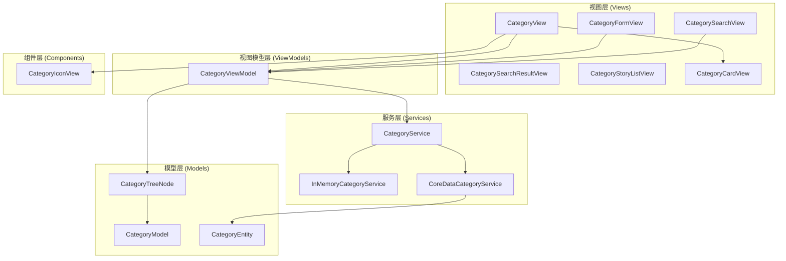

**图表来源**
- [CategoryView.swift](file://MyStory/Views/Category/CategoryView.swift#L1-L495)
- [CategoryViewModel.swift](file://MyStory/ViewModels/Category/CategoryViewModel.swift#L1-L103)
- [CategoryService.swift](file://MyStory/Services/CategoryService/CategoryService.swift#L22-L675)

**章节来源**
- [CategoryView.swift](file://MyStory/Views/Category/CategoryView.swift#L1-L495)
- [CategoryViewModel.swift](file://MyStory/ViewModels/Category/CategoryViewModel.swift#L1-L103)
- [CategoryService.swift](file://MyStory/Services/CategoryService/CategoryService.swift#L1-L675)

## 核心组件

### 分类服务接口 (CategoryService)

分类服务接口定义了完整的分类管理能力，包括查询、增删改、统计和搜索功能：

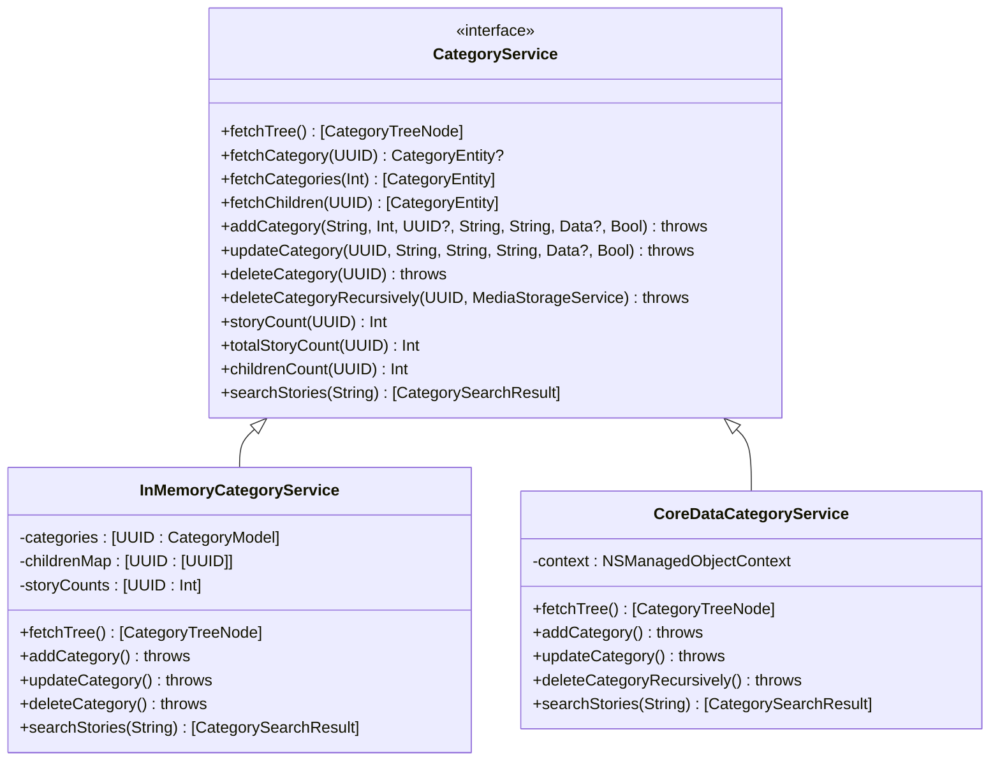

**图表来源**
- [CategoryService.swift](file://MyStory/Services/CategoryService/CategoryService.swift#L22-L675)

### 分类数据模型

系统使用轻量级的数据模型来表示分类信息：

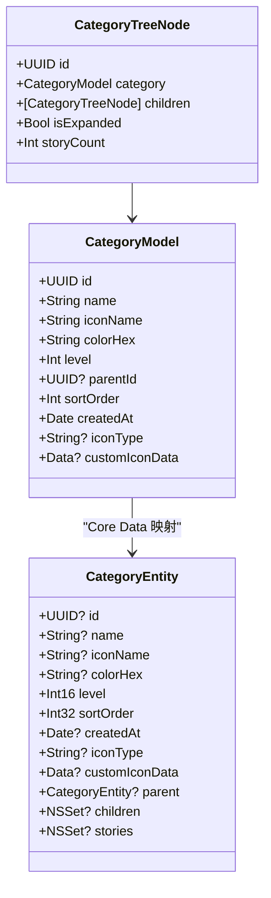

**图表来源**
- [CategoryModel.swift](file://MyStory/Models/Category/CategoryModel.swift#L1-L23)
- [CategoryEntity+CoreDataProperties.swift](file://MyStory/Models/Entities/CategoryEntity+CoreDataProperties.swift#L15-L74)

**章节来源**
- [CategoryModel.swift](file://MyStory/Models/Category/CategoryModel.swift#L1-L23)
- [CategoryEntity+CoreDataProperties.swift](file://MyStory/Models/Entities/CategoryEntity+CoreDataProperties.swift#L1-L74)

## 架构概览

系统采用 MVVM 架构模式，通过清晰的层次分离实现关注点隔离：

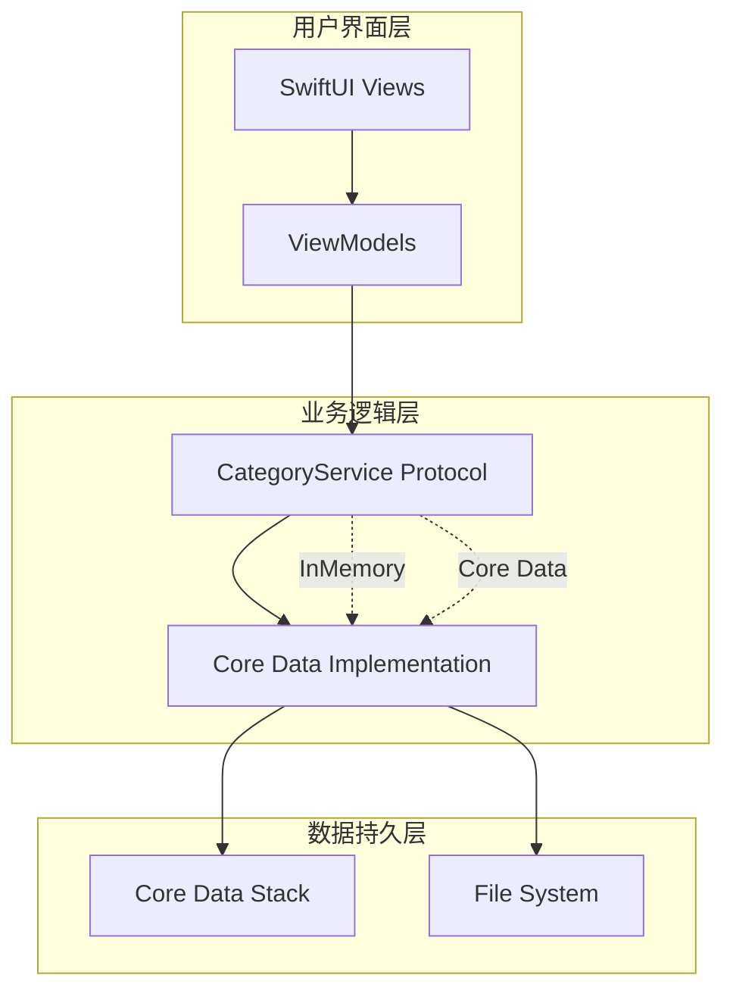

**图表来源**
- [CategoryView.swift](file://MyStory/Views/Category/CategoryView.swift#L1-L495)
- [CategoryViewModel.swift](file://MyStory/ViewModels/Category/CategoryViewModel.swift#L1-L103)
- [CategoryService.swift](file://MyStory/Services/CategoryService/CategoryService.swift#L189-L675)

### 分类树形结构构建算法

系统实现了高效的分类树形结构构建算法，支持动态加载和懒加载：

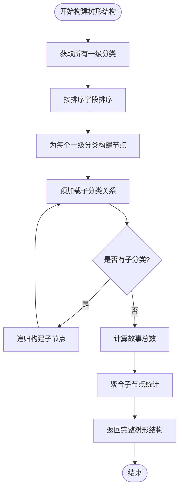

**图表来源**
- [CategoryService.swift](file://MyStory/Services/CategoryService/CategoryService.swift#L204-L219)
- [CategoryService.swift](file://MyStory/Services/CategoryService/CategoryService.swift#L556-L585)

**章节来源**
- [CategoryService.swift](file://MyStory/Services/CategoryService/CategoryService.swift#L204-L219)
- [CategoryService.swift](file://MyStory/Services/CategoryService/CategoryService.swift#L556-L585)

## 详细组件分析

### CategoryView - 主分类视图

CategoryView 是分类管理系统的主入口，提供了卡片视图和列表视图两种展示模式：

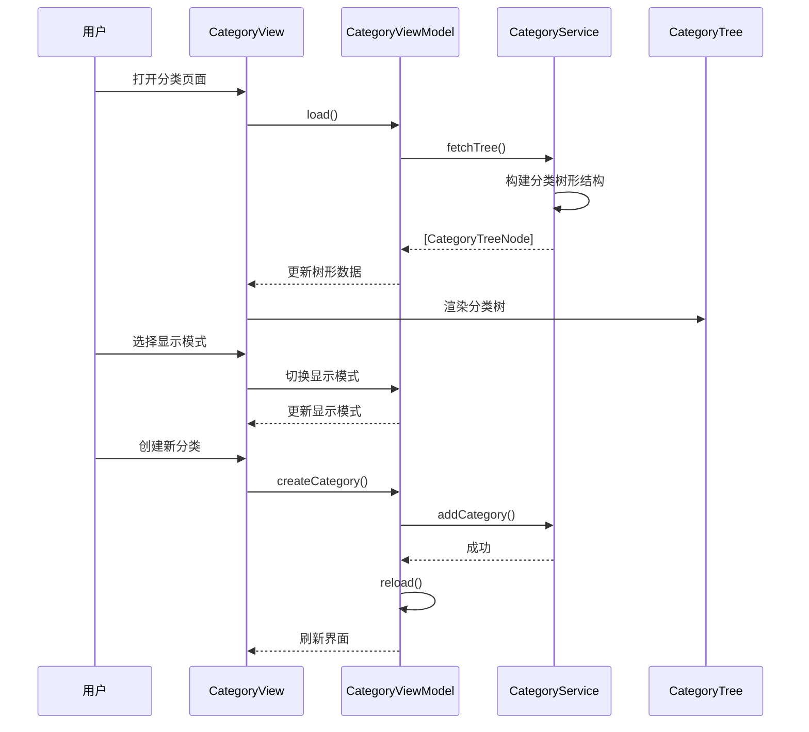

**图表来源**
- [CategoryView.swift](file://MyStory/Views/Category/CategoryView.swift#L25-L93)
- [CategoryViewModel.swift](file://MyStory/ViewModels/Category/CategoryViewModel.swift#L32-L34)

#### 分类显示模式

系统支持两种显示模式：

1. **卡片模式 (Card Mode)**: 适用于一级分类的网格显示
2. **列表模式 (List Mode)**: 适用于完整的树形结构展示

**章节来源**
- [CategoryView.swift](file://MyStory/Views/Category/CategoryView.swift#L25-L93)
- [CategoryViewModel.swift](file://MyStory/ViewModels/Category/CategoryViewModel.swift#L4-L16)

### CategoryFormView - 分类表单

分类表单提供了完整的分类创建和编辑功能，包含表单验证、图标选择和颜色配置：

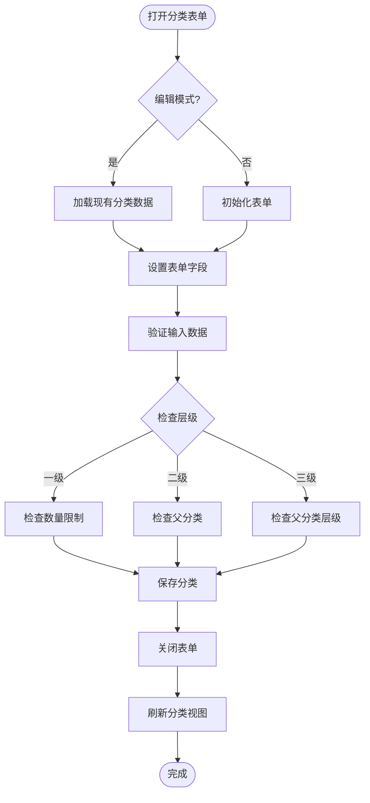

**图表来源**
- [CategoryFormView.swift](file://MyStory/Views/Category/CategoryFormView.swift#L311-L358)
- [CategoryService.swift](file://MyStory/Services/CategoryService/CategoryService.swift#L266-L330)

#### 表单验证机制

表单包含多层次的验证机制：

1. **必填字段验证**: 分类名称不能为空
2. **层级验证**: 确保层级在有效范围内 (1-3)
3. **父分类验证**: 二级和三级分类必须有有效的父分类
4. **数量限制验证**: 每级分类数量不超过限制 (一级: 10个, 二级: 20个, 三级: 30个)

**章节来源**
- [CategoryFormView.swift](file://MyStory/Views/Category/CategoryFormView.swift#L311-L358)
- [CategoryService.swift](file://MyStory/Services/CategoryService/CategoryService.swift#L266-L330)

### 分类图标系统

系统提供了灵活的图标系统，支持系统图标、预设图标和自定义图标：

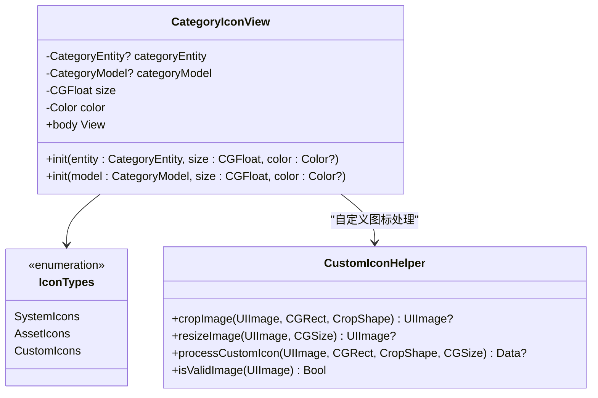

**图表来源**
- [CategoryIconView.swift](file://MyStory/Components/Category/CategoryIconView.swift#L1-L145)
- [CustomIconHelper.swift](file://MyStory/Utils/CustomIconHelper.swift#L1-L162)

**章节来源**
- [CategoryIconView.swift](file://MyStory/Components/Category/CategoryIconView.swift#L1-L145)
- [CustomIconHelper.swift](file://MyStory/Utils/CustomIconHelper.swift#L1-L162)

### 分类搜索功能

搜索功能专注于三级分类下的故事搜索，提供了智能的匹配和排序机制：

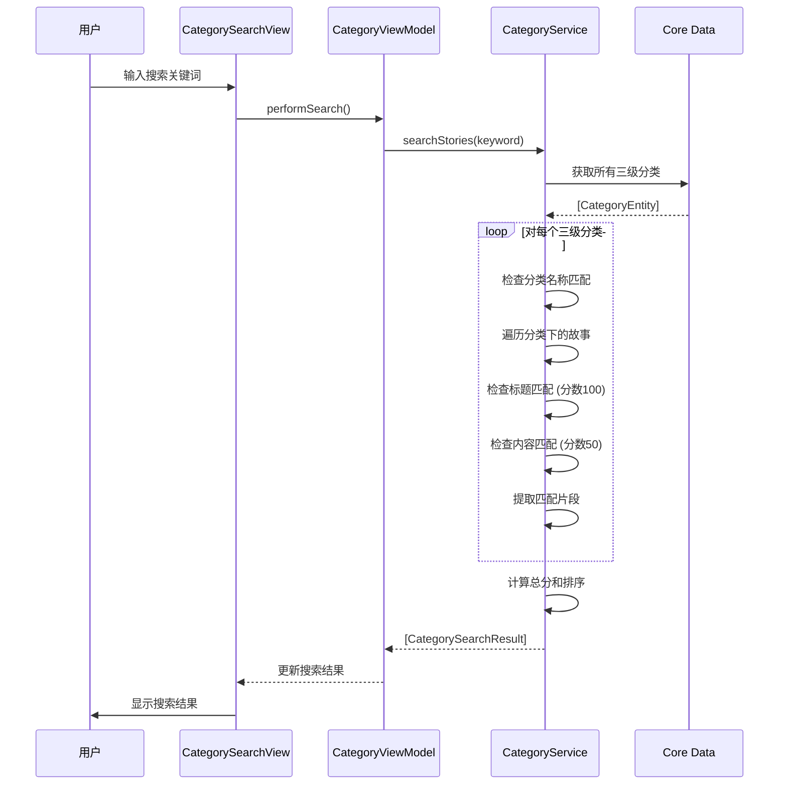

**图表来源**
- [CategorySearchView.swift](file://MyStory/Views/Category/CategorySearchView.swift#L17-L73)
- [CategoryService.swift](file://MyStory/Services/CategoryService/CategoryService.swift#L453-L552)

**章节来源**
- [CategorySearchView.swift](file://MyStory/Views/Category/CategorySearchView.swift#L17-L73)
- [CategoryService.swift](file://MyStory/Services/CategoryService/CategoryService.swift#L453-L552)

### 分类统计与故事关联

系统实现了完整的分类统计功能，支持多级分类的故事统计和关联关系管理：

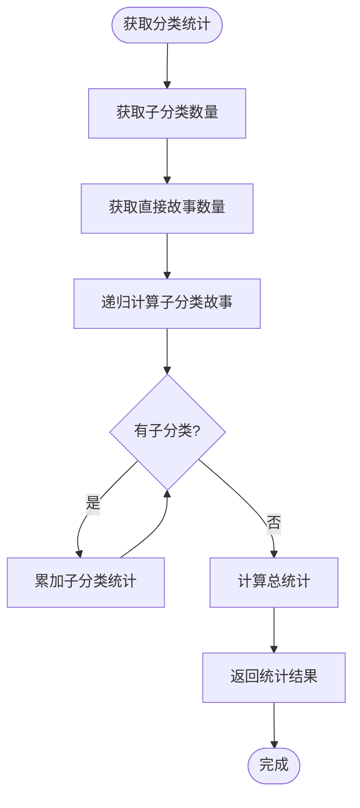

**图表来源**
- [CategoryViewModel.swift](file://MyStory/ViewModels/Category/CategoryViewModel.swift#L76-L80)
- [CategoryService.swift](file://MyStory/Services/CategoryService/CategoryService.swift#L411-L449)

**章节来源**
- [CategoryViewModel.swift](file://MyStory/ViewModels/Category/CategoryViewModel.swift#L76-L80)
- [CategoryService.swift](file://MyStory/Services/CategoryService/CategoryService.swift#L411-L449)

## 依赖关系分析

系统采用松耦合的设计，通过协议抽象实现依赖注入：

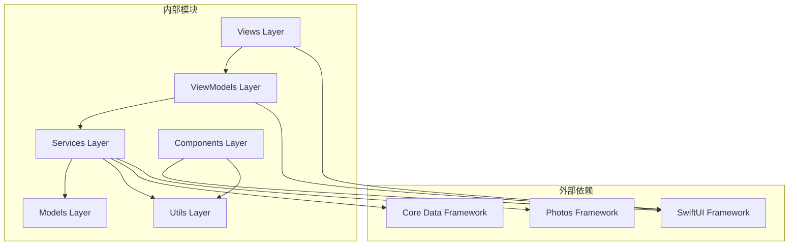

**图表来源**
- [CategoryView.swift](file://MyStory/Views/Category/CategoryView.swift#L1-L495)
- [CategoryViewModel.swift](file://MyStory/ViewModels/Category/CategoryViewModel.swift#L1-L103)
- [CategoryService.swift](file://MyStory/Services/CategoryService/CategoryService.swift#L1-L675)

### 错误处理机制

系统实现了完善的错误处理机制，确保数据一致性和用户体验：

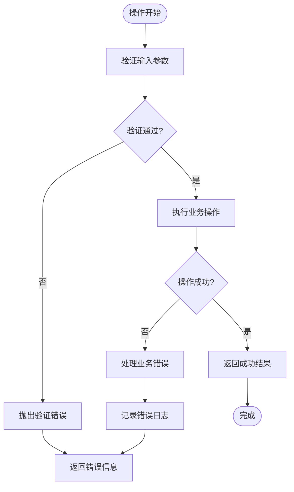

**图表来源**
- [CategoryService.swift](file://MyStory/Services/CategoryService/CategoryService.swift#L4-L20)
- [CategoryService.swift](file://MyStory/Services/CategoryService/CategoryService.swift#L92-L122)

**章节来源**
- [CategoryService.swift](file://MyStory/Services/CategoryService/CategoryService.swift#L4-L20)
- [CategoryService.swift](file://MyStory/Services/CategoryService/CategoryService.swift#L92-L122)

## 性能考虑

### 数据加载优化

系统采用了多种性能优化策略：

1. **关系预加载**: 使用 `relationshipKeyPathsForPrefetching` 预加载关联数据，避免 N+1 查询问题
2. **懒加载机制**: 树形结构采用懒加载，只在需要时加载子节点
3. **缓存策略**: ViewModel 缓存分类树形结构，减少重复计算

### 内存管理

```swift
// 关键优化点：预加载关系数据
request.relationshipKeyPathsForPrefetching = ["stories", "children", "children.stories"]

// 避免不必要的数据复制
let categoryModel = CategoryModel(
    id: entity.id ?? UUID(),
    name: entity.name ?? "",
    iconName: entity.iconName ?? "folder.fill",
    colorHex: entity.colorHex ?? "#007AFF",
    level: Int(entity.level),
    parentId: entity.parent?.id,
    sortOrder: Int(entity.sortOrder),
    createdAt: entity.createdAt ?? Date()
)
```

### 并发处理

系统支持异步操作和后台处理：

1. **照片选择**: 使用 `PhotosPicker` 异步加载图片
2. **媒体处理**: 自定义图标裁剪和处理在后台线程执行
3. **搜索功能**: 搜索操作在后台线程执行，避免阻塞主线程

## 故障排除指南

### 常见问题及解决方案

#### 分类删除失败

**问题**: 尝试删除分类时出现错误

**可能原因**:
1. 分类仍有子分类
2. 分类下有关联的故事
3. 分类不存在

**解决方法**:
```swift
// 检查分类状态
let children = fetchChildren(parentId: id)
guard children.isEmpty else {
    throw CategoryError.hasStories
}

let storyCount = self.storyCount(for: id)
guard storyCount == 0 else {
    throw CategoryError.hasStories
}
```

#### 图标显示异常

**问题**: 自定义图标无法正常显示

**可能原因**:
1. 图片数据损坏
2. 图片格式不支持
3. 图标尺寸不符合要求

**解决方法**:
```swift
// 验证图片有效性
static func isValidImage(_ image: UIImage) -> Bool {
    return image.cgImage != nil && 
           image.size.width > 0 && 
           image.size.height > 0
}

// 处理自定义图标
static func processCustomIcon(
    from image: UIImage,
    cropRect: CGRect,
    shape: CropShape,
    iconSize: CGSize = CGSize(width: 60, height: 60)
) -> Data? {
    // 1. 裁剪图片
    guard let croppedImage = cropImage(image, to: cropRect, shape: shape) else {
        return nil
    }
    
    // 2. 调整尺寸
    guard let resizedImage = resizeImage(croppedImage, to: iconSize) else {
        return nil
    }
    
    // 3. 转换为数据
    return imageToData(resizedImage)
}
```

#### 搜索结果不准确

**问题**: 搜索功能返回的结果不完整或不准确

**可能原因**:
1. 故事对象是 fault 对象
2. 分类层级循环引用
3. 文本匹配算法问题

**解决方法**:
```swift
// 异常处理：检查故事对象是否有效
guard !story.isFault, let storyId = story.id else {
    print("⚠️ [CategoryService] Skipping invalid story in category")
    continue
}

// 防止循环引用
var visitedCategories: Set<NSManagedObjectID> = []
while let cat = currentCategory {
    // 防止循环引用
    guard !visitedCategories.contains(cat.objectID) else {
        print("⚠️ [CategoryService] Circular reference detected")
        break
    }
    visitedCategories.insert(cat.objectID)
}
```

**章节来源**
- [CategoryService.swift](file://MyStory/Services/CategoryService/CategoryService.swift#L353-L373)
- [CustomIconHelper.swift](file://MyStory/Utils/CustomIconHelper.swift#L138-L160)
- [CategoryService.swift](file://MyStory/Services/CategoryService/CategoryService.swift#L483-L487)

## 结论

分类管理系统是一个设计精良、功能完整的分类管理解决方案。系统通过清晰的架构分离、完善的错误处理机制和性能优化策略，为用户提供了流畅的分类管理体验。

主要特点包括：
- **三层级分类体系**: 支持灵活的分类层级管理
- **双模式显示**: 卡片模式和列表模式满足不同使用场景
- **智能搜索**: 基于故事内容的智能搜索功能
- **图标系统**: 支持系统图标、预设图标和自定义图标
- **性能优化**: 采用多种优化策略确保系统响应速度
- **错误处理**: 完善的错误处理机制保证数据一致性

该系统为故事应用提供了强大的分类管理基础，支持未来的功能扩展和性能优化。

## 附录

### 配置选项

系统支持以下配置选项：

| 配置项 | 默认值 | 说明 |
|--------|--------|------|
| 一级分类数量限制 | 10个 | 每级分类的最大数量 |
| 二级分类数量限制 | 20个 | 每个一级分类下的最大数量 |
| 三级分类数量限制 | 30个 | 每个二级分类下的最大数量 |
| 图标尺寸 | 60x60像素 | 自定义图标的推荐尺寸 |
| 搜索匹配分数 | 标题:100, 内容:50 | 不同匹配类型的分数权重 |

### 最佳实践

1. **数据一致性**: 始终使用服务层进行数据操作，避免直接修改 Core Data 对象
2. **错误处理**: 在所有用户操作中都应包含适当的错误处理
3. **性能优化**: 使用关系预加载和懒加载机制优化数据访问
4. **用户体验**: 提供清晰的反馈和进度指示
5. **测试覆盖**: 为关键业务逻辑编写单元测试和集成测试