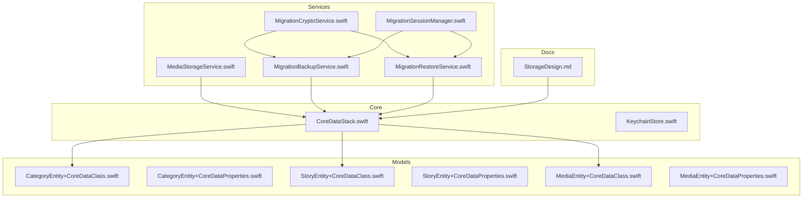
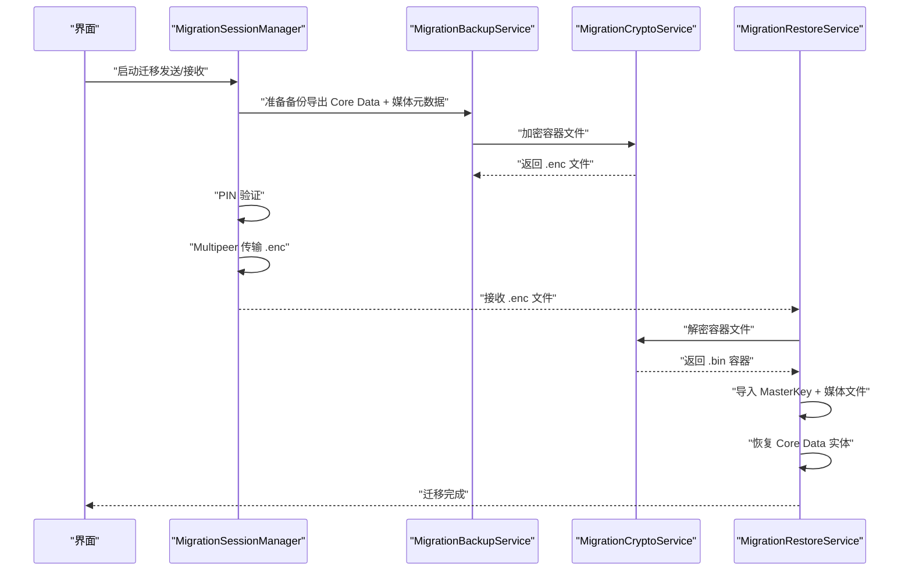
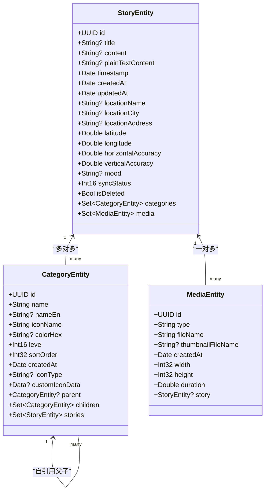
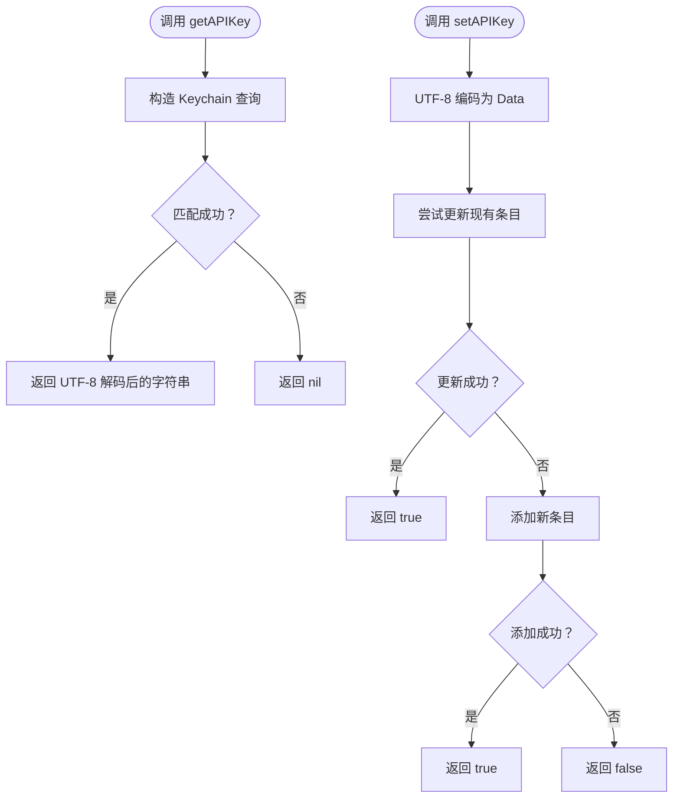
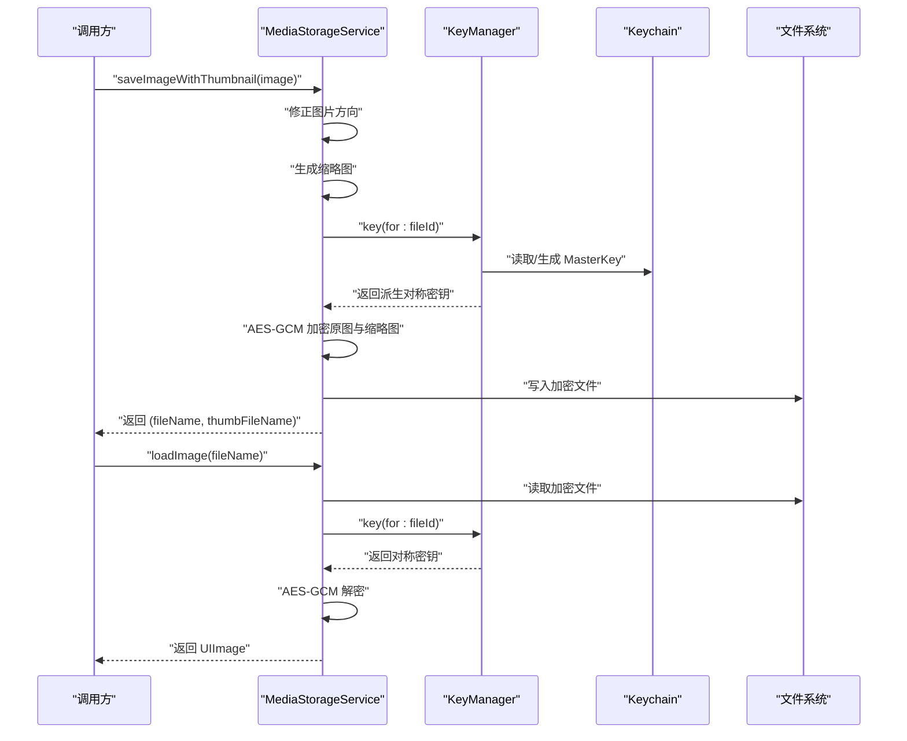
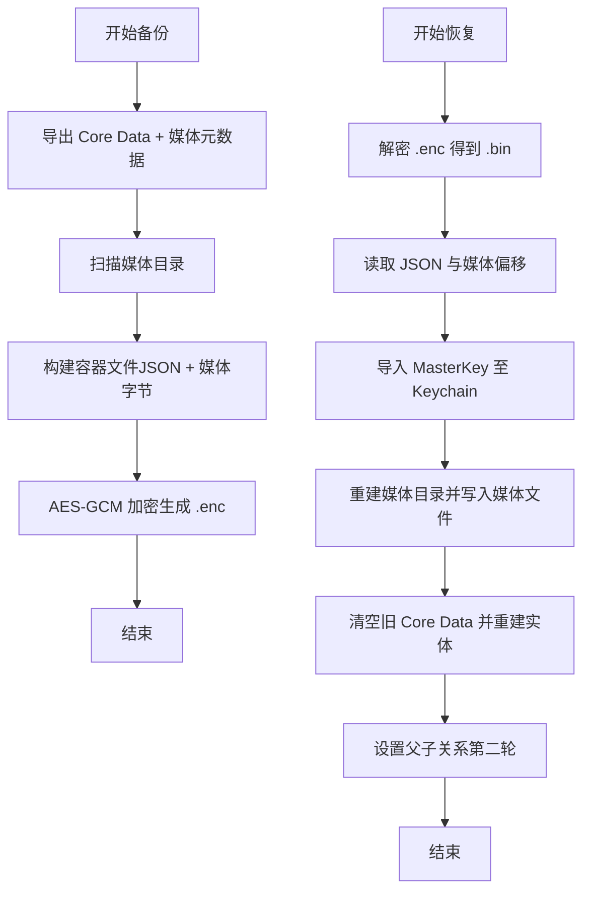
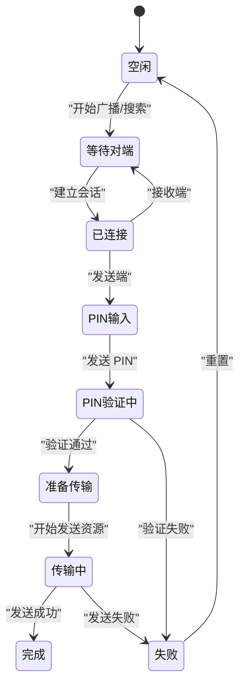
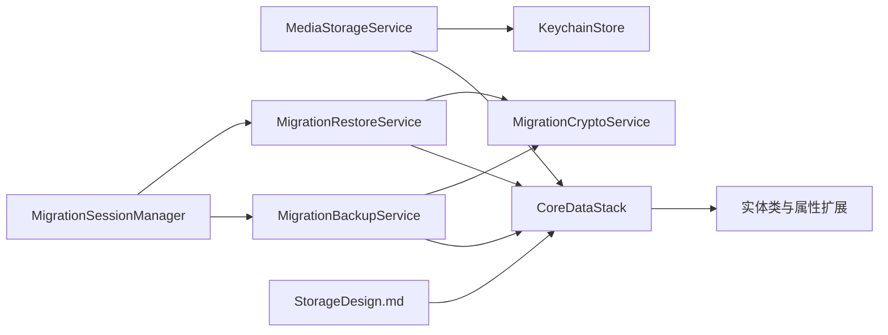

# 存储管理模块

<cite>
**本文引用的文件**
- [CoreDataStack.swift](file://MyStory/Core/Storage/CoreDataStack.swift)
- [KeychainStore.swift](file://MyStory/Core/Storage/KeychainStore.swift)
- [MediaStorageService.swift](file://MyStory/Services/MediaStorageService.swift)
- [MigrationBackupService.swift](file://MyStory/Services/MigrationBackupService.swift)
- [MigrationRestoreService.swift](file://MyStory/Services/MigrationRestoreService.swift)
- [MigrationCryptoService.swift](file://MyStory/Services/MigrationCryptoService.swift)
- [MigrationSessionManager.swift](file://MyStory/Services/MigrationSessionManager.swift)
- [CategoryEntity+CoreDataClass.swift](file://MyStory/Models/Entities/CategoryEntity+CoreDataClass.swift)
- [CategoryEntity+CoreDataProperties.swift](file://MyStory/Models/Entities/CategoryEntity+CoreDataProperties.swift)
- [StoryEntity+CoreDataClass.swift](file://MyStory/Models/Entities/StoryEntity+CoreDataClass.swift)
- [StoryEntity+CoreDataProperties.swift](file://MyStory/Models/Entities/StoryEntity+CoreDataProperties.swift)
- [MediaEntity+CoreDataClass.swift](file://MyStory/Models/Entities/MediaEntity+CoreDataClass.swift)
- [MediaEntity+CoreDataProperties.swift](file://MyStory/Models/Entities/MediaEntity+CoreDataProperties.swift)
- [StorageDesign.md](file://StorageDesign.md)
</cite>

## 目录
1. [简介](#简介)
2. [项目结构](#项目结构)
3. [核心组件](#核心组件)
4. [架构总览](#架构总览)
5. [组件详解](#组件详解)
6. [依赖关系分析](#依赖关系分析)
7. [性能考量](#性能考量)
8. [故障排查指南](#故障排查指南)
9. [结论](#结论)
10. [附录](#附录)

## 简介
本文件系统化梳理 MyStory 的存储管理模块，围绕 CoreDataStack 的数据模型与关系、事务与并发控制，MediaStorageService 的媒体文件存储与加密、缩略图生成与空间优化，KeychainStore 的安全存储与密钥管理，以及数据迁移（备份、恢复、加密、点对点传输）的完整流程进行深入解析。文档同时提供性能优化建议、扩展点与故障恢复机制说明，帮助开发者在保证安全性与性能的前提下高效扩展与维护。

## 项目结构
存储模块主要分布在以下层次：
- Core 层：CoreDataStack、KeychainStore 提供基础持久化与安全存储能力
- Models 层：Core Data 实体类与属性扩展，定义数据模型与关系
- Services 层：MediaStorageService、Migration*Service、MigrationSessionManager 提供媒体存储、迁移与点对点传输能力
- 文档与设计：StorageDesign.md 提供高层设计与关系说明



**图表来源**
- [CoreDataStack.swift](file://MyStory/Core/Storage/CoreDataStack.swift#L1-L382)
- [KeychainStore.swift](file://MyStory/Core/Storage/KeychainStore.swift#L1-L40)
- [MediaStorageService.swift](file://MyStory/Services/MediaStorageService.swift#L1-L348)
- [MigrationBackupService.swift](file://MyStory/Services/MigrationBackupService.swift#L1-L414)
- [MigrationRestoreService.swift](file://MyStory/Services/MigrationRestoreService.swift#L1-L383)
- [MigrationCryptoService.swift](file://MyStory/Services/MigrationCryptoService.swift#L1-L67)
- [MigrationSessionManager.swift](file://MyStory/Services/MigrationSessionManager.swift#L1-L374)
- [StorageDesign.md](file://StorageDesign.md#L1-L377)

**章节来源**
- [CoreDataStack.swift](file://MyStory/Core/Storage/CoreDataStack.swift#L1-L382)
- [StorageDesign.md](file://StorageDesign.md#L1-L377)

## 核心组件
- CoreDataStack：负责 Core Data 模型构建、持久化容器初始化、上下文配置与调试清理逻辑
- KeychainStore：提供 API Key 的安全读写，封装 Keychain 操作
- MediaStorageService：负责媒体文件的加密存储、缩略图生成、目录组织与临时文件管理
- MigrationBackupService：导出 Core Data 与媒体元数据，构建自定义容器文件并交由加密服务处理
- MigrationRestoreService：从加密备份中恢复 MasterKey、媒体文件与 Core Data 实体
- MigrationCryptoService：基于用户口令与备份 ID 派生对称密钥，执行 AES-GCM 加解密
- MigrationSessionManager：基于 MultipeerConnectivity 的点对点迁移会话，支持 PIN 验证与进度反馈

**章节来源**
- [CoreDataStack.swift](file://MyStory/Core/Storage/CoreDataStack.swift#L1-L382)
- [KeychainStore.swift](file://MyStory/Core/Storage/KeychainStore.swift#L1-L40)
- [MediaStorageService.swift](file://MyStory/Services/MediaStorageService.swift#L1-L348)
- [MigrationBackupService.swift](file://MyStory/Services/MigrationBackupService.swift#L1-L414)
- [MigrationRestoreService.swift](file://MyStory/Services/MigrationRestoreService.swift#L1-L383)
- [MigrationCryptoService.swift](file://MyStory/Services/MigrationCryptoService.swift#L1-L67)
- [MigrationSessionManager.swift](file://MyStory/Services/MigrationSessionManager.swift#L1-L374)

## 架构总览
存储模块采用“模型-服务-传输”分层：
- 模型层：Core Data 实体与关系定义，支撑分类、故事、媒体三层结构
- 服务层：媒体存储与迁移服务，统一处理加密、压缩、容器化与传输
- 传输层：MultipeerConnectivity 实现点对点迁移，结合加密服务保障数据安全



**图表来源**
- [MigrationSessionManager.swift](file://MyStory/Services/MigrationSessionManager.swift#L1-L374)
- [MigrationBackupService.swift](file://MyStory/Services/MigrationBackupService.swift#L1-L414)
- [MigrationRestoreService.swift](file://MyStory/Services/MigrationRestoreService.swift#L1-L383)
- [MigrationCryptoService.swift](file://MyStory/Services/MigrationCryptoService.swift#L1-L67)

## 组件详解

### CoreDataStack：数据模型与关系、事务与并发
- 模型构建：在运行时动态构建 StoryEntity、CategoryEntity、MediaEntity 及其属性与关系
- 关系映射：
  - StoryEntity ↔ MediaEntity：一对多，级联删除故事时删除媒体
  - StoryEntity ↔ CategoryEntity：多对多，解除关联不删除实体
  - CategoryEntity 自引用：父子关系，删除父级级联删除子级，子级删除不影响父级
- 上下文配置：视图上下文合并策略、自动合并变更
- 调试清理：DEBUG 下强制删除旧数据库与 WAL/SHM 文件，便于模型变更时的快速迭代
- 预览实例：提供预览模式的临时实例，内置示例数据



**图表来源**
- [CoreDataStack.swift](file://MyStory/Core/Storage/CoreDataStack.swift#L98-L380)
- [StoryEntity+CoreDataProperties.swift](file://MyStory/Models/Entities/StoryEntity+CoreDataProperties.swift#L15-L75)
- [CategoryEntity+CoreDataProperties.swift](file://MyStory/Models/Entities/CategoryEntity+CoreDataProperties.swift#L15-L34)
- [MediaEntity+CoreDataProperties.swift](file://MyStory/Models/Entities/MediaEntity+CoreDataProperties.swift#L15-L33)

**章节来源**
- [CoreDataStack.swift](file://MyStory/Core/Storage/CoreDataStack.swift#L1-L382)
- [StoryEntity+CoreDataClass.swift](file://MyStory/Models/Entities/StoryEntity+CoreDataClass.swift#L1-L51)
- [CategoryEntity+CoreDataClass.swift](file://MyStory/Models/Entities/CategoryEntity+CoreDataClass.swift#L1-L18)
- [MediaEntity+CoreDataClass.swift](file://MyStory/Models/Entities/MediaEntity+CoreDataClass.swift#L1-L15)

### KeychainStore：安全存储与密钥管理
- 功能：提供 API Key 的读取与写入，内部自动更新或新增
- 安全性：使用 Generic Password 类别，数据以 Keychain 保护
- 可扩展：可扩展为多账户或多密钥管理，遵循最小权限原则



**图表来源**
- [KeychainStore.swift](file://MyStory/Core/Storage/KeychainStore.swift#L10-L38)

**章节来源**
- [KeychainStore.swift](file://MyStory/Core/Storage/KeychainStore.swift#L1-L40)

### MediaStorageService：媒体文件存储、加密与缩略图
- 存储目录：按“媒体根目录/类型/年/月”组织，便于按时间检索与清理
- 加密机制：基于 HKDF 派生对称密钥，AES-GCM 加密封装，组合格式存储
- 缩略图生成：图片缩略图与视频封面生成，支持 HEIC/JPEG 编码与方向修正
- 临时文件：视频加载时生成临时解密文件，使用后清理
- 错误处理：对编码失败、解密失败、Keychain 读写失败进行显式错误返回



**图表来源**
- [MediaStorageService.swift](file://MyStory/Services/MediaStorageService.swift#L14-L123)
- [MediaStorageService.swift](file://MyStory/Services/MediaStorageService.swift#L226-L271)

**章节来源**
- [MediaStorageService.swift](file://MyStory/Services/MediaStorageService.swift#L1-L348)

### 迁移备份与恢复：数据导出、容器化与加密
- 备份流程：
  - 导出 Core Data 实体与关系、统计媒体文件与大小、扫描媒体目录
  - 构建自定义容器文件（MAGIC + JSON 长度 + JSON + 媒体字节），写入媒体文件
  - 使用 MigrationCryptoService 基于口令与备份 ID 派生密钥，AES-GCM 加密生成 .enc
- 恢复流程：
  - 解密容器文件，读取 JSON 与媒体偏移
  - 导入 MasterKey 至 Keychain，重建媒体目录并写入媒体文件
  - 清空旧 Core Data 数据，按 DTO 重建实体与关系，支持第二轮父子关系设置



**图表来源**
- [MigrationBackupService.swift](file://MyStory/Services/MigrationBackupService.swift#L110-L142)
- [MigrationRestoreService.swift](file://MyStory/Services/MigrationRestoreService.swift#L103-L152)
- [MigrationCryptoService.swift](file://MyStory/Services/MigrationCryptoService.swift#L35-L65)

**章节来源**
- [MigrationBackupService.swift](file://MyStory/Services/MigrationBackupService.swift#L1-L414)
- [MigrationRestoreService.swift](file://MyStory/Services/MigrationRestoreService.swift#L1-L383)
- [MigrationCryptoService.swift](file://MyStory/Services/MigrationCryptoService.swift#L1-L67)

### 点对点迁移：MultipeerConnectivity 会话与 PIN 验证
- 角色：发送端（旧设备）与接收端（新设备）
- 步骤：广播/发现对端 → 建立会话 → 生成/输入 PIN → 验证通过 → 发送资源（.enc 文件）
- 状态机：空闲 → 等待对端 → 已连接 → PIN 输入/验证 → 准备传输 → 传输中 → 完成/失败
- 进度：基于 Progress 观察 fractionCompleted 更新 UI



**图表来源**
- [MigrationSessionManager.swift](file://MyStory/Services/MigrationSessionManager.swift#L11-L21)
- [MigrationSessionManager.swift](file://MyStory/Services/MigrationSessionManager.swift#L62-L106)
- [MigrationSessionManager.swift](file://MyStory/Services/MigrationSessionManager.swift#L144-L176)

**章节来源**
- [MigrationSessionManager.swift](file://MyStory/Services/MigrationSessionManager.swift#L1-L374)

## 依赖关系分析
- 模型依赖：CoreDataStack 依赖各实体类与属性扩展；实体间通过 Core Data 关系耦合
- 服务依赖：MediaStorageService 依赖 Keychain 与加密库；Migration*Service 依赖 CoreData 上下文与 MigrationCryptoService
- 传输依赖：MigrationSessionManager 依赖 MultipeerConnectivity，负责会话生命周期与状态管理
- 文档指导：StorageDesign.md 提供高层设计与关系约束，指导模型与服务实现



**图表来源**
- [CoreDataStack.swift](file://MyStory/Core/Storage/CoreDataStack.swift#L1-L382)
- [MediaStorageService.swift](file://MyStory/Services/MediaStorageService.swift#L1-L348)
- [MigrationBackupService.swift](file://MyStory/Services/MigrationBackupService.swift#L1-L414)
- [MigrationRestoreService.swift](file://MyStory/Services/MigrationRestoreService.swift#L1-L383)
- [MigrationSessionManager.swift](file://MyStory/Services/MigrationSessionManager.swift#L1-L374)
- [StorageDesign.md](file://StorageDesign.md#L1-L377)

**章节来源**
- [CoreDataStack.swift](file://MyStory/Core/Storage/CoreDataStack.swift#L1-L382)
- [MediaStorageService.swift](file://MyStory/Services/MediaStorageService.swift#L1-L348)
- [MigrationBackupService.swift](file://MyStory/Services/MigrationBackupService.swift#L1-L414)
- [MigrationRestoreService.swift](file://MyStory/Services/MigrationRestoreService.swift#L1-L383)
- [MigrationSessionManager.swift](file://MyStory/Services/MigrationSessionManager.swift#L1-L374)
- [StorageDesign.md](file://StorageDesign.md#L1-L377)

## 性能考量
- 查询优化
  - 为常用过滤字段（如 StoryEntity 的 timestamp、isDeleted，CategoryEntity 的 level、sortOrder）建立索引，提升排序与过滤性能
  - 使用合适的 FetchRequest 与谓词，避免一次性加载过多数据
- 索引设计
  - 建议在 Core Data 模型层面为热点字段添加索引，减少 SQLite 层扫描成本
- 缓存策略
  - 对热点实体（如分类树）进行内存缓存，减少重复查询
  - 对媒体缩略图进行本地缓存，避免重复生成
- 内存管理
  - 媒体加载时优先使用懒加载与异步解密，避免阻塞主线程
  - 视频播放前生成临时解密文件，播放完成后及时清理
- 并发控制
  - CoreDataStack 使用视图上下文自动合并变更，避免主线程阻塞
  - 迁移过程在后台队列执行，避免影响 UI 响应

[本节为通用性能建议，无需特定文件引用]

## 故障排查指南
- 数据库加载失败
  - 检查持久化容器初始化与错误日志；DEBUG 模式下确认旧数据库是否被清理
  - 参考：[CoreDataStack.swift](file://MyStory/Core/Storage/CoreDataStack.swift#L27-L34)
- Keychain 读写失败
  - 确认 Keychain 权限与可访问性设置；检查账户名与服务名一致性
  - 参考：[KeychainStore.swift](file://MyStory/Core/Storage/KeychainStore.swift#L10-L38)
- 媒体文件解密失败
  - 核对 MasterKey 是否正确导入；确认文件名与 keyId 对应关系
  - 参考：[MediaStorageService.swift](file://MyStory/Services/MediaStorageService.swift#L203-L207)
- 迁移加密/解密异常
  - 确认用户口令与备份 ID 正确；检查 AES-GCM 密封格式
  - 参考：[MigrationCryptoService.swift](file://MyStory/Services/MigrationCryptoService.swift#L53-L65)
- Multipeer 传输失败
  - 检查网络权限、蓝牙开关与设备配对；关注 PIN 验证与会话状态变化
  - 参考：[MigrationSessionManager.swift](file://MyStory/Services/MigrationSessionManager.swift#L239-L333)

**章节来源**
- [CoreDataStack.swift](file://MyStory/Core/Storage/CoreDataStack.swift#L27-L34)
- [KeychainStore.swift](file://MyStory/Core/Storage/KeychainStore.swift#L10-L38)
- [MediaStorageService.swift](file://MyStory/Services/MediaStorageService.swift#L203-L207)
- [MigrationCryptoService.swift](file://MyStory/Services/MigrationCryptoService.swift#L53-L65)
- [MigrationSessionManager.swift](file://MyStory/Services/MigrationSessionManager.swift#L239-L333)

## 结论
本存储管理模块以 Core Data 为核心，结合 Keychain 安全存储与 MediaStorageService 的加密媒体管理，形成了从模型设计、事务并发、到迁移与传输的完整闭环。通过合理的索引与缓存策略、严格的加密与密钥管理，以及 MultipeerConnectivity 的点对点传输，系统在保证安全性与用户体验的同时，具备良好的可扩展性与可维护性。

[本节为总结性内容，无需特定文件引用]

## 附录

### 数据模型 ER 图
```mermaid
erDiagram
STORYENTITY {
uuid id PK
string? title
string? content
string? plainTextContent
date timestamp
date createdAt
date updatedAt
string? locationName
string? locationCity
string? locationAddress
double latitude
double longitude
double horizontalAccuracy
double verticalAccuracy
string? mood
int16 syncStatus
bool isDeleted
}
CATEGORYENTITY {
uuid id PK
string name
string? nameEn
string iconName
string? colorHex
int16 level
int32 sortOrder
date createdAt
string? iconType
data? customIconData
}
MEDIAENTITY {
uuid id PK
string type
string fileName
string? thumbnailFileName
date createdAt
int32 width
int32 height
double duration
}
CATEGORYENTITY ||--o{ CATEGORYENTITY : "parent/children"
CATEGORYENTITY ||--o{ STORYENTITY : "stories"
STORYENTITY ||--o{ MEDIAENTITY : "media"
```

**图表来源**
- [CoreDataStack.swift](file://MyStory/Core/Storage/CoreDataStack.swift#L312-L364)
- [StoryEntity+CoreDataProperties.swift](file://MyStory/Models/Entities/StoryEntity+CoreDataProperties.swift#L15-L39)
- [CategoryEntity+CoreDataProperties.swift](file://MyStory/Models/Entities/CategoryEntity+CoreDataProperties.swift#L15-L33)
- [MediaEntity+CoreDataProperties.swift](file://MyStory/Models/Entities/MediaEntity+CoreDataProperties.swift#L15-L32)

### 扩展点与自定义存储后端
- 自定义存储后端
  - 可替换 MediaStorageService 的文件系统实现，适配云存储或分布式文件系统
  - 可扩展 KeychainStore 支持多账户与密钥轮换策略
- 故障恢复机制
  - 迁移过程中保留中间产物（容器文件）以便重试与回滚
  - 媒体文件写入采用原子写入，失败时回滚至前一版本

[本节为概念性说明，无需特定文件引用]