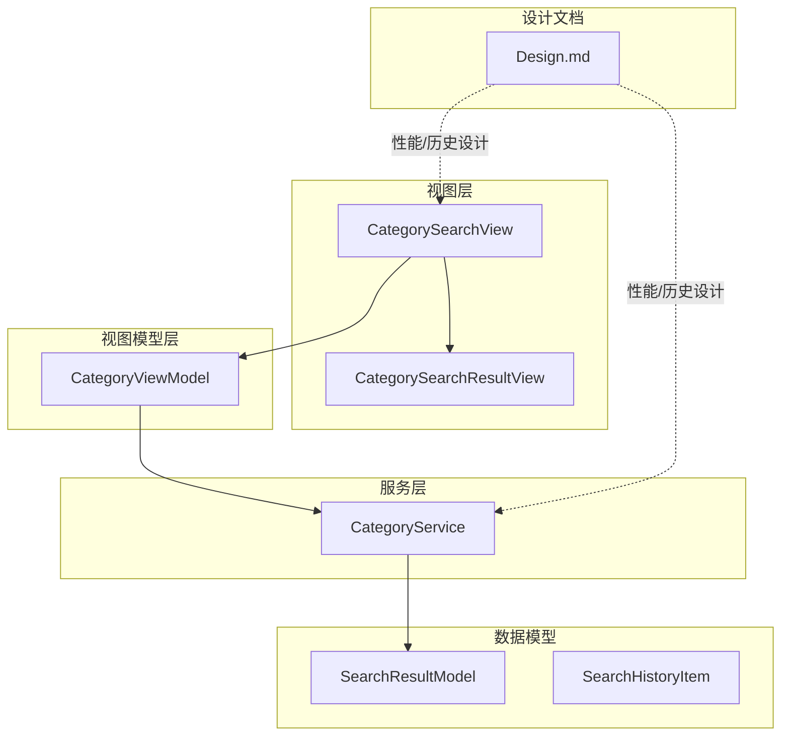
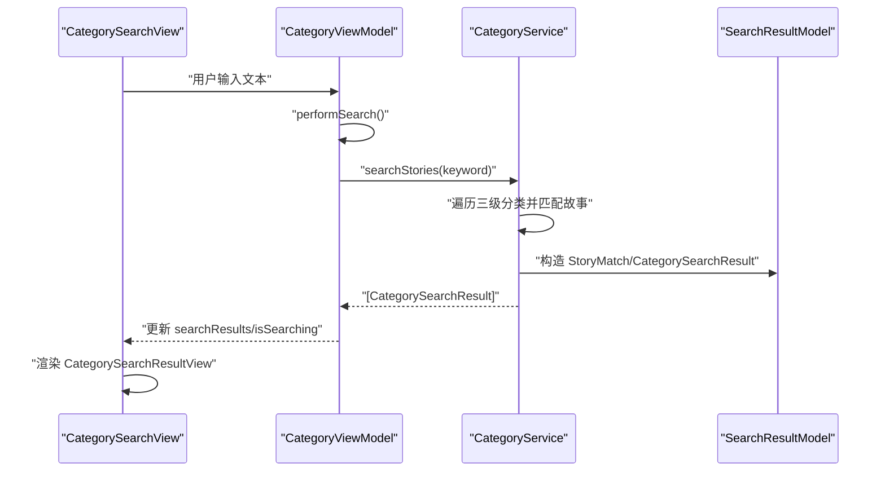
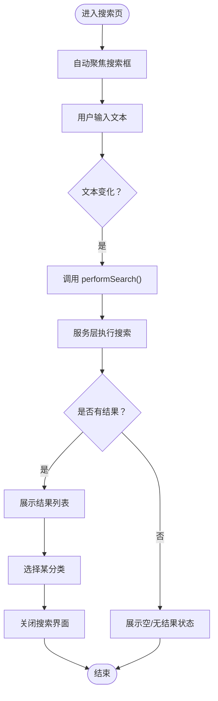
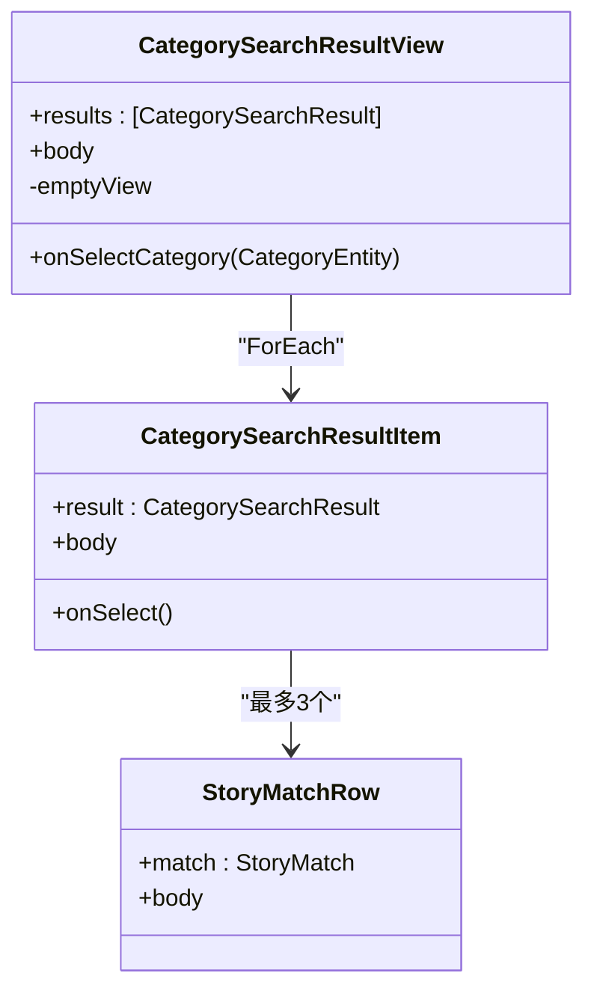
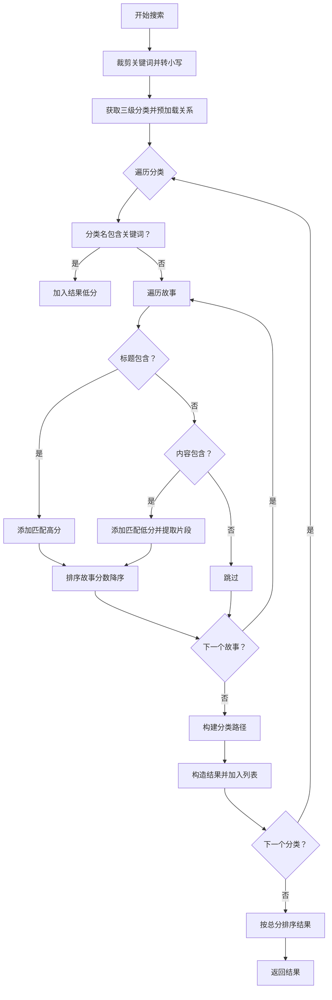
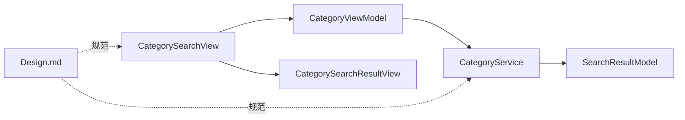

# 搜索功能模块

<cite>
**本文档引用的文件**
- [CategorySearchView.swift](file://MyStory/Views/Category/CategorySearchView.swift)
- [CategorySearchResultView.swift](file://MyStory/Views/Category/CategorySearchResultView.swift)
- [CategoryViewModel.swift](file://MyStory/ViewModels/Category/CategoryViewModel.swift)
- [CategoryService.swift](file://MyStory/Services/CategoryService/CategoryService.swift)
- [SearchResultModel.swift](file://MyStory/Models/ViewModels/SearchResultModel.swift)
- [SearchHistoryItem.swift](file://MyStory/Models/ViewModels/SearchHistoryItem.swift)
- [Design.md](file://Design.md)
</cite>

## 目录
1. [简介](#简介)
2. [项目结构](#项目结构)
3. [核心组件](#核心组件)
4. [架构概览](#架构概览)
5. [详细组件分析](#详细组件分析)
6. [依赖关系分析](#依赖关系分析)
7. [性能考虑](#性能考虑)
8. [故障排查指南](#故障排查指南)
9. [结论](#结论)
10. [附录](#附录)

## 简介
本文件系统化梳理“搜索功能模块”的实现与设计，重点覆盖以下方面：
- 关键词搜索的界面与交互：CategorySearchView 的界面设计、搜索触发条件、实时搜索建议
- 搜索结果展示：CategorySearchResultView 的布局、排序与高亮策略
- 搜索历史管理：历史记录存储、去重策略、清理机制与隐私保护
- 性能优化：索引建立、查询缓存、分页加载、防抖处理
- 搜索算法：模糊匹配、权重计算、相关性排序
- 扩展点与自定义：可配置的匹配规则与用户体验优化建议

## 项目结构
搜索功能涉及的代码分布在视图层、视图模型层与服务层，以及数据模型与设计文档中：
- 视图层：CategorySearchView、CategorySearchResultView
- 视图模型层：CategoryViewModel
- 服务层：CategoryService（负责搜索与数据访问）
- 数据模型：SearchResultModel（结果模型）、SearchHistoryItem（历史模型）
- 设计文档：Design.md（包含性能优化与历史管理的设计要点）

图表来源
- [CategorySearchView.swift](file://MyStory/Views/Category/CategorySearchView.swift#L1-L129)
- [CategorySearchResultView.swift](file://MyStory/Views/Category/CategorySearchResultView.swift#L1-L124)
- [CategoryViewModel.swift](file://MyStory/ViewModels/Category/CategoryViewModel.swift#L1-L103)
- [CategoryService.swift](file://MyStory/Services/CategoryService/CategoryService.swift#L453-L552)
- [SearchResultModel.swift](file://MyStory/Models/ViewModels/SearchResultModel.swift#L1-L63)
- [SearchHistoryItem.swift](file://MyStory/Models/ViewModels/SearchHistoryItem.swift#L1-L20)
- [Design.md](file://Design.md#L187-L208)

章节来源
- [CategorySearchView.swift](file://MyStory/Views/Category/CategorySearchView.swift#L1-L129)
- [CategorySearchResultView.swift](file://MyStory/Views/Category/CategorySearchResultView.swift#L1-L124)
- [CategoryViewModel.swift](file://MyStory/ViewModels/Category/CategoryViewModel.swift#L1-L103)
- [CategoryService.swift](file://MyStory/Services/CategoryService/CategoryService.swift#L453-L552)
- [SearchResultModel.swift](file://MyStory/Models/ViewModels/SearchResultModel.swift#L1-L63)
- [SearchHistoryItem.swift](file://MyStory/Models/ViewModels/SearchHistoryItem.swift#L1-L20)
- [Design.md](file://Design.md#L187-L208)

## 核心组件
- CategorySearchView：提供搜索输入、触发搜索、展示空/无结果状态、调用结果视图
- CategorySearchResultView：展示搜索结果列表，包含分类路径与匹配故事片段
- CategoryViewModel：维护搜索状态（文本、结果、搜索中标志），协调视图与服务
- CategoryService：执行搜索逻辑，构建结果与排序
- SearchResultModel：定义故事匹配与分类搜索结果的数据结构
- SearchHistoryItem：定义搜索历史记录的数据结构（用于后续实现）

章节来源
- [CategorySearchView.swift](file://MyStory/Views/Category/CategorySearchView.swift#L1-L129)
- [CategorySearchResultView.swift](file://MyStory/Views/Category/CategorySearchResultView.swift#L1-L124)
- [CategoryViewModel.swift](file://MyStory/ViewModels/Category/CategoryViewModel.swift#L18-L101)
- [CategoryService.swift](file://MyStory/Services/CategoryService/CategoryService.swift#L453-L552)
- [SearchResultModel.swift](file://MyStory/Models/ViewModels/SearchResultModel.swift#L11-L62)
- [SearchHistoryItem.swift](file://MyStory/Models/ViewModels/SearchHistoryItem.swift#L10-L19)

## 架构概览
搜索流程从视图层触发，经由视图模型调度服务层，服务层完成搜索与排序，最终回传给视图层渲染。

图表来源
- [CategorySearchView.swift](file://MyStory/Views/Category/CategorySearchView.swift#L24-L42)
- [CategoryViewModel.swift](file://MyStory/ViewModels/Category/CategoryViewModel.swift#L84-L95)
- [CategoryService.swift](file://MyStory/Services/CategoryService/CategoryService.swift#L453-L552)
- [SearchResultModel.swift](file://MyStory/Models/ViewModels/SearchResultModel.swift#L13-L62)

## 详细组件分析

### CategorySearchView：界面与交互
- 界面组成
  - 搜索栏：左侧放大镜图标，中间文本输入框绑定 ViewModel 的 searchText；右侧清空按钮
  - 结果区域：根据 isSearching 与 searchText 是否为空决定展示结果列表、无结果提示或空状态
  - 工具栏：右上角“取消”按钮，清空搜索并关闭视图
  - 自动聚焦：onAppear 中将焦点设置到搜索框
- 搜索触发
  - onChange 监听 searchText 变化，触发 performSearch
- 交互行为
  - 点击结果项：关闭搜索界面、清空搜索、回调父视图进行导航

图表来源
- [CategorySearchView.swift](file://MyStory/Views/Category/CategorySearchView.swift#L17-L58)
- [CategoryViewModel.swift](file://MyStory/ViewModels/Category/CategoryViewModel.swift#L84-L101)

章节来源
- [CategorySearchView.swift](file://MyStory/Views/Category/CategorySearchView.swift#L17-L58)

### CategorySearchResultView：结果展示与布局
- 列表样式：使用 insetGrouped 列表风格
- 空状态：当结果为空时显示占位视图
- 结果项：
  - 分类路径：左侧分类图标 + 路径文本
  - 匹配故事：最多展示前3条，超出部分显示“还有 N 条”提示
  - 故事匹配行：显示匹配类型图标（标题/内容）与匹配片段，匹配类型标签
- 交互：点击结果项回调父视图选择分类

图表来源
- [CategorySearchResultView.swift](file://MyStory/Views/Category/CategorySearchResultView.swift#L12-L92)
- [SearchResultModel.swift](file://MyStory/Models/ViewModels/SearchResultModel.swift#L13-L38)

章节来源
- [CategorySearchResultView.swift](file://MyStory/Views/Category/CategorySearchResultView.swift#L12-L92)

### CategoryViewModel：搜索状态与触发
- 状态字段：tree、displayMode、searchText、searchResults、isSearching
- 关键方法：
  - performSearch：裁剪空白后触发服务搜索，设置 isSearching
  - clearSearch：清空文本、结果与搜索状态
- 与视图的绑定：通过 @Published 字段驱动 UI 更新

章节来源
- [CategoryViewModel.swift](file://MyStory/ViewModels/Category/CategoryViewModel.swift#L18-L101)

### CategoryService：搜索算法与排序
- 输入处理：去除首尾空白并转小写
- 数据源：仅对三级分类进行搜索，预加载关系以避免 fault
- 匹配策略：
  - 分类名称匹配：直接命中
  - 故事匹配：标题命中（更高分数）或内容命中（较低分数）
  - 片段提取：从内容中提取关键字前后若干字符作为片段
- 排序规则：
  - 故事内按匹配分数降序
  - 分类结果按总分（所有匹配故事分数之和）降序
- 路径构建：自底向上拼接分类路径，防止循环引用与无限循环

图表来源
- [CategoryService.swift](file://MyStory/Services/CategoryService/CategoryService.swift#L453-L552)
- [CategoryService.swift](file://MyStory/Services/CategoryService/CategoryService.swift#L635-L673)

章节来源
- [CategoryService.swift](file://MyStory/Services/CategoryService/CategoryService.swift#L453-L552)
- [CategoryService.swift](file://MyStory/Services/CategoryService/CategoryService.swift#L635-L673)

### 搜索历史管理：存储、去重、清理与隐私
- 数据模型：SearchHistoryItem（关键字、时间戳、结果数量）
- 设计要点（来自设计文档）：
  - 存储位置：UserDefaults
  - 存储结构：字符串数组，最多保留10条
  - 展示位置：点击搜索框时，下方显示历史记录
  - 操作：点击历史记录直接搜索；左滑删除单条；提供清空全部按钮
  - 隐私保护：历史记录仅包含关键字与时间戳，不包含具体内容
- 当前仓库实现状态：模型已定义，历史记录的持久化与 UI 展示尚未在仓库中出现，建议按设计文档落地

章节来源
- [SearchHistoryItem.swift](file://MyStory/Models/ViewModels/SearchHistoryItem.swift#L10-L19)
- [Design.md](file://Design.md#L187-L208)

### 搜索性能优化：索引、缓存、分页与防抖
- 防抖处理：输入停止300ms后触发搜索，减少无效查询
- 分词索引：对 plainTextContent 字段建立全文索引，提升搜索速度
- 结果高亮：匹配文本背景高亮显示，增强可读性
- 搜索历史：本地存储最近10条搜索记录，便于快速重复搜索
- 性能基准（设计文档）：
  - 首次加载20条：1000/5000条数据均在毫秒级
  - 滚动加载下一页：150–200ms
  - 搜索：500ms–1s（含索引与分词）
  - 分类筛选：100–150ms
  - 位置搜索：300–500ms

章节来源
- [Design.md](file://Design.md#L187-L208)
- [Design.md](file://Design.md#L940-L948)

## 依赖关系分析
- CategorySearchView 依赖 CategoryViewModel 的状态与方法
- CategoryViewModel 依赖 CategoryService 的搜索能力
- CategoryService 返回 SearchResultModel 的数据结构
- 设计文档为搜索历史与性能优化提供规范

图表来源
- [CategorySearchView.swift](file://MyStory/Views/Category/CategorySearchView.swift#L1-L129)
- [CategoryViewModel.swift](file://MyStory/ViewModels/Category/CategoryViewModel.swift#L18-L30)
- [CategoryService.swift](file://MyStory/Services/CategoryService/CategoryService.swift#L453-L552)
- [SearchResultModel.swift](file://MyStory/Models/ViewModels/SearchResultModel.swift#L11-L62)
- [Design.md](file://Design.md#L187-L208)

章节来源
- [CategorySearchView.swift](file://MyStory/Views/Category/CategorySearchView.swift#L1-L129)
- [CategoryViewModel.swift](file://MyStory/ViewModels/Category/CategoryViewModel.swift#L18-L30)
- [CategoryService.swift](file://MyStory/Services/CategoryService/CategoryService.swift#L453-L552)
- [SearchResultModel.swift](file://MyStory/Models/ViewModels/SearchResultModel.swift#L11-L62)
- [Design.md](file://Design.md#L187-L208)

## 性能考虑
- 预加载与关系优化：服务层对三级分类预加载 stories 关系，避免 fault 导致数据为空
- 防抖与节流：视图层监听输入变化，结合设计文档的300ms防抖策略
- 索引与分词：对内容字段建立索引，减少全表扫描
- 结果截断：结果项仅展示前3条匹配故事，避免列表过长影响滚动性能
- 缓存与分页：设计文档给出分页与缓存策略，建议在搜索结果列表中应用

章节来源
- [CategoryService.swift](file://MyStory/Services/CategoryService/CategoryService.swift#L459-L464)
- [CategorySearchResultView.swift](file://MyStory/Views/Category/CategorySearchResultView.swift#L74-L83)
- [Design.md](file://Design.md#L187-L208)
- [Design.md](file://Design.md#L940-L948)

## 故障排查指南
- 无效故事对象：服务层对 isFault 与 id 进行校验，跳过无效对象并打印警告
- 无效分类对象：对 id 为空的分类进行跳过并打印警告
- 循环引用与无限循环：路径构建时使用 visited 集合与最大层级限制
- 索引越界：片段提取时进行边界检查，防止索引越界
- 无结果处理：视图层根据 isSearching 与 searchText 控制空/无结果状态

章节来源
- [CategoryService.swift](file://MyStory/Services/CategoryService/CategoryService.swift#L483-L487)
- [CategoryService.swift](file://MyStory/Services/CategoryService/CategoryService.swift#L525-L529)
- [CategoryService.swift](file://MyStory/Services/CategoryService/CategoryService.swift#L594-L612)
- [CategoryService.swift](file://MyStory/Services/CategoryService/CategoryService.swift#L654-L657)
- [CategorySearchView.swift](file://MyStory/Views/Category/CategorySearchView.swift#L24-L42)

## 结论
- 搜索功能采用“视图-视图模型-服务-模型”的清晰分层，职责明确
- 算法层面实现了标题优先、内容次之的匹配与排序，具备可扩展性
- 设计文档提供了完善的性能优化与历史管理方案，建议尽快落地
- 建议补充搜索历史的持久化与 UI 展示，完善隐私保护与用户体验

## 附录
- 扩展点与自定义
  - 匹配规则：可增加多关键词分词、短语匹配、权重动态调整
  - 排序策略：除相关性外，支持时间、热度等维度
  - 高亮策略：对标题与内容分别高亮，支持多关键词高亮
  - 建议：在视图层引入可配置的高亮样式与片段长度参数

章节来源
- [Design.md](file://Design.md#L187-L208)
- [SearchResultModel.swift](file://MyStory/Models/ViewModels/SearchResultModel.swift#L13-L38)