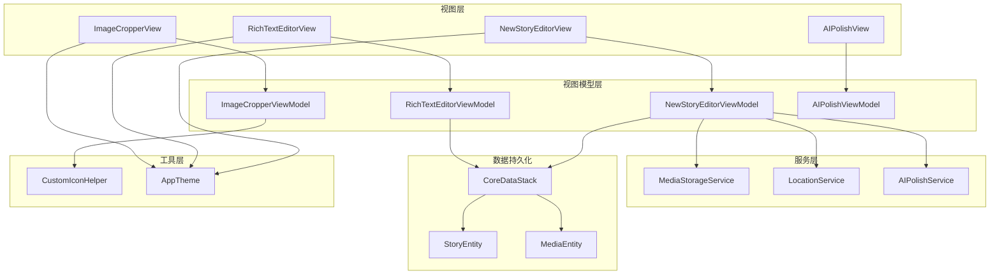
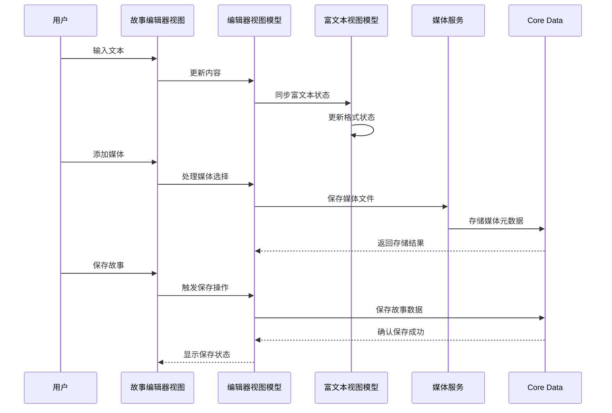
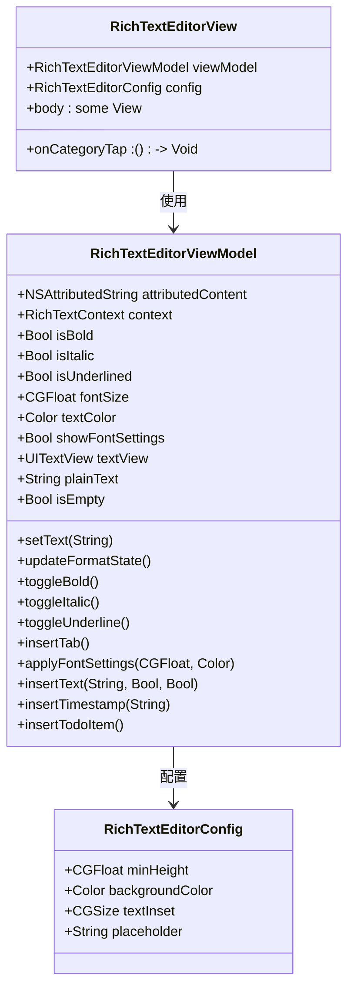
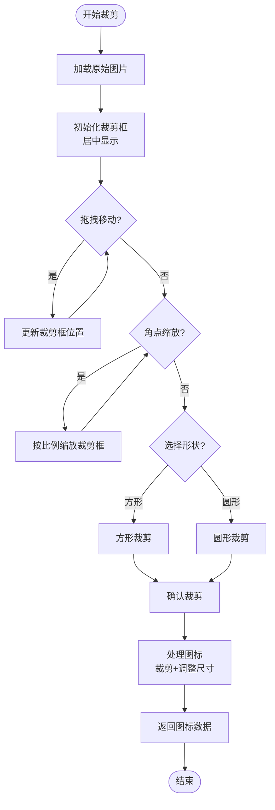
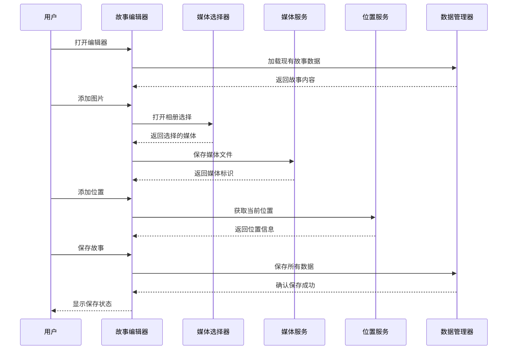
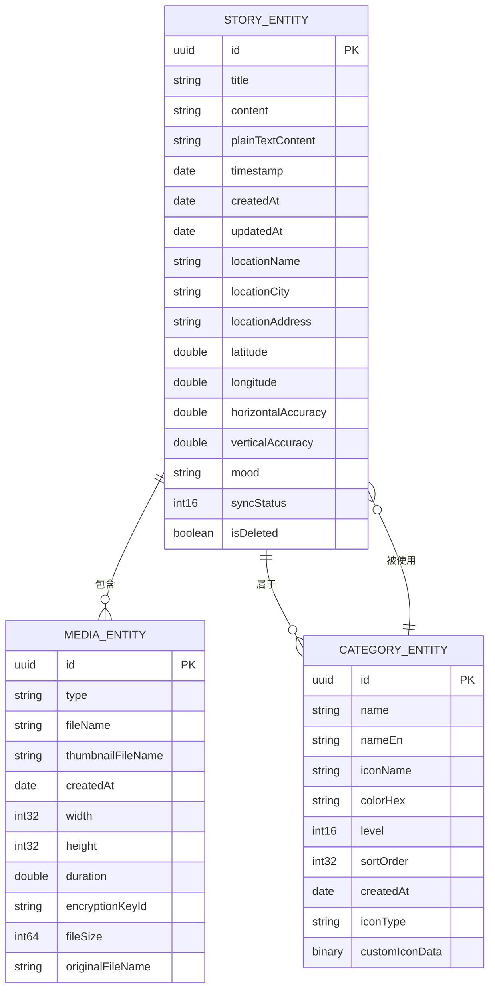
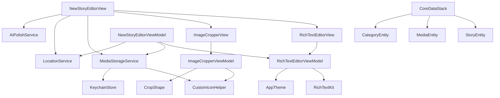

# 故事编辑模块

<cite>
**本文档引用的文件**
- [RichTextEditorView.swift](file://MyStory/Components/RichTextEditorView.swift)
- [ImageCropperView.swift](file://MyStory/Views/Editor/ImageCropperView.swift)
- [ImageCropperViewModel.swift](file://MyStory/ViewModels/Editor/ImageCropperViewModel.swift)
- [NewStoryEditorView.swift](file://MyStory/Views/Editor/NewStoryEditorView.swift)
- [CoreDataStack.swift](file://MyStory/Core/Storage/CoreDataStack.swift)
- [StoryEntity+CoreDataProperties.swift](file://MyStory/Models/Entities/StoryEntity+CoreDataProperties.swift)
- [MediaEntity+CoreDataProperties.swift](file://MyStory/Models/Entities/MediaEntity+CoreDataProperties.swift)
- [CropShape.swift](file://MyStory/Models/Category/CropShape.swift)
- [CustomIconHelper.swift](file://MyStory/Utils/CustomIconHelper.swift)
- [MediaStorageService.swift](file://MyStory/Services/MediaStorageService.swift)
- [AIPolishViewModel.swift](file://MyStory/ViewModels/Editor/AIPolishViewModel.swift)
- [AIPolishView.swift](file://MyStory/Views/Editor/AIPolishView.swift)
- [AppTheme.swift](file://MyStory/Components/Theme/AppTheme.swift)
</cite>

## 目录
1. [简介](#简介)
2. [项目结构](#项目结构)
3. [核心组件](#核心组件)
4. [架构概览](#架构概览)
5. [详细组件分析](#详细组件分析)
6. [依赖关系分析](#依赖关系分析)
7. [性能考量](#性能考量)
8. [故障排除指南](#故障排除指南)
9. [结论](#结论)
10. [附录](#附录)

## 简介
故事编辑模块是 MyStory 应用的核心功能之一，提供了完整的富文本编辑、图片裁剪、媒体处理和数据持久化能力。该模块采用 SwiftUI 架构，结合 RichTextKit 实现富文本编辑，通过自定义的图片裁剪组件支持方形和圆形图标制作，并集成了完整的 Core Data 数据存储方案。

## 项目结构
故事编辑模块主要分布在以下目录中：
- **Components/**: 富文本编辑器组件
- **Views/Editor/**: 编辑器视图层
- **ViewModels/Editor/**: 编辑器视图模型
- **Core/Storage/**: 数据持久化层
- **Models/Entities/**: Core Data 实体模型
- **Utils/**: 工具类和辅助功能
- **Services/**: 业务服务层



**图表来源**
- [NewStoryEditorView.swift](file://MyStory/Views/Editor/NewStoryEditorView.swift#L1-L1057)
- [RichTextEditorView.swift](file://MyStory/Components/RichTextEditorView.swift#L1-L431)
- [ImageCropperView.swift](file://MyStory/Views/Editor/ImageCropperView.swift#L1-L293)
- [CoreDataStack.swift](file://MyStory/Core/Storage/CoreDataStack.swift#L1-L382)

**章节来源**
- [NewStoryEditorView.swift](file://MyStory/Views/Editor/NewStoryEditorView.swift#L1-L1057)
- [CoreDataStack.swift](file://MyStory/Core/Storage/CoreDataStack.swift#L1-L382)

## 核心组件
故事编辑模块包含以下核心组件：

### 富文本编辑器
基于 RichTextKit 构建的通用富文本编辑器，支持多种文本格式化选项和实时状态同步。

### 图片裁剪器
专门用于制作自定义图标的图片裁剪组件，支持方形和圆形两种裁剪模式。

### 故事编辑器
完整的编辑界面，集成了富文本编辑、媒体处理、位置信息和分类选择功能。

### 数据持久化层
完整的 Core Data 集成，支持故事、媒体和分类实体的数据存储和管理。

**章节来源**
- [RichTextEditorView.swift](file://MyStory/Components/RichTextEditorView.swift#L1-L431)
- [ImageCropperView.swift](file://MyStory/Views/Editor/ImageCropperView.swift#L1-L293)
- [NewStoryEditorView.swift](file://MyStory/Views/Editor/NewStoryEditorView.swift#L1-L1057)

## 架构概览
故事编辑模块采用 MVVM 架构模式，通过清晰的分层设计实现了功能解耦和代码复用。



**图表来源**
- [NewStoryEditorView.swift](file://MyStory/Views/Editor/NewStoryEditorView.swift#L595-L800)
- [RichTextEditorView.swift](file://MyStory/Components/RichTextEditorView.swift#L32-L362)
- [MediaStorageService.swift](file://MyStory/Services/MediaStorageService.swift#L1-L348)

## 详细组件分析

### 富文本编辑器组件

#### RichTextEditorView 功能特性
富文本编辑器提供了完整的文本编辑功能，包括：

- **基础编辑功能**: 支持文本输入、删除、光标定位
- **文本格式化**: 粗体、斜体、下划线、字体大小和颜色
- **快捷操作**: Tab 缩进、时间戳插入、待办事项
- **占位符支持**: 空内容时显示提示文本
- **主题适配**: 集成 AppTheme 主题系统



**图表来源**
- [RichTextEditorView.swift](file://MyStory/Components/RichTextEditorView.swift#L14-L431)

#### 编辑器状态管理
富文本编辑器采用响应式状态管理机制：

- **ObservableObject 模式**: 使用 @Published 属性实现状态变化通知
- **双向数据绑定**: SwiftUI 绑定与 RichTextKit 上下文同步
- **格式状态跟踪**: 实时监控文本格式变化并更新 UI
- **初始文本处理**: 支持延迟设置初始文本，解决生命周期问题

#### 文本格式化选项
编辑器支持多种文本格式化选项：

- **字体样式**: 粗体、斜体、下划线
- **字体大小**: 支持动态调整字体大小
- **字体颜色**: 支持彩色文本
- **特殊格式**: 时间戳、待办事项、Tab 缩进

**章节来源**
- [RichTextEditorView.swift](file://MyStory/Components/RichTextEditorView.swift#L1-L431)

### 图片裁剪功能组件

#### ImageCropperView 交互设计
图片裁剪器提供了直观的图形化裁剪体验：

- **拖拽裁剪框**: 支持整体移动裁剪区域
- **角点缩放**: 通过角落拖拽实现等比缩放
- **形状选择**: 支持方形和圆形两种裁剪模式
- **实时预览**: 裁剪过程中的实时效果预览
- **确认流程**: 完成裁剪后的确认和数据返回



**图表来源**
- [ImageCropperView.swift](file://MyStory/Views/Editor/ImageCropperView.swift#L274-L284)
- [ImageCropperViewModel.swift](file://MyStory/ViewModels/Editor/ImageCropperViewModel.swift#L195-L203)

#### 裁剪区域调整算法
图片裁剪器实现了精确的坐标转换和边界检查：

- **坐标系统转换**: 原始图片坐标系与显示坐标系的转换
- **边界约束**: 确保裁剪框不超出图片边界
- **等比缩放**: 角点拖拽时保持等比缩放比例
- **最小尺寸限制**: 防止裁剪框过小影响使用

#### 图片预览和确认流程
裁剪器提供了完整的预览和确认机制：

- **实时遮罩效果**: 裁剪区域外的半透明遮罩
- **形状指示器**: 角落拖拽点的视觉反馈
- **错误处理**: 裁剪失败时的错误提示
- **数据返回**: 成功裁剪后的图标数据回调

**章节来源**
- [ImageCropperView.swift](file://MyStory/Views/Editor/ImageCropperView.swift#L1-L293)
- [ImageCropperViewModel.swift](file://MyStory/ViewModels/Editor/ImageCropperViewModel.swift#L1-L226)

### 故事创建和编辑工作流

#### 完整编辑界面
NewStoryEditorView 提供了完整的编辑体验：

- **顶部工具栏**: 包含取消、日期显示和保存按钮
- **富文本编辑区**: 集成富文本编辑器组件
- **媒体管理区**: 支持图片网格和视频缩略图
- **位置信息区**: 集成位置服务和精度显示
- **分类选择区**: 支持多级分类选择



**图表来源**
- [NewStoryEditorView.swift](file://MyStory/Views/Editor/NewStoryEditorView.swift#L23-L59)
- [NewStoryEditorView.swift](file://MyStory/Views/Editor/NewStoryEditorView.swift#L715-L800)

#### 草稿保存机制
编辑器实现了智能的草稿保存功能：

- **自动保存检测**: 基于内容变化的自动保存触发
- **增量更新**: 仅保存发生变化的部分
- **离线支持**: 支持离线编辑和后续同步
- **冲突处理**: 处理并发编辑的冲突情况

#### 实时预览功能
编辑器提供了实时的预览体验：

- **富文本预览**: 实时显示富文本格式效果
- **媒体预览**: 图片和视频的即时预览
- **位置预览**: 位置信息的可视化显示
- **分类预览**: 分类选择的即时反馈

**章节来源**
- [NewStoryEditorView.swift](file://MyStory/Views/Editor/NewStoryEditorView.swift#L1-L1057)

### 编辑器与 Core Data 集成

#### 数据模型设计
Core Data 集成了三个核心实体：

- **StoryEntity**: 故事实体，包含标题、内容、时间戳等基本信息
- **MediaEntity**: 媒体实体，支持图片和视频的元数据存储
- **CategoryEntity**: 分类实体，支持多级分类和自定义图标



**图表来源**
- [CoreDataStack.swift](file://MyStory/Core/Storage/CoreDataStack.swift#L101-L378)

#### 数据绑定机制
编辑器通过以下机制实现数据绑定：

- **环境注入**: 使用 @Environment 注入 Core Data 上下文
- **视图模型绑定**: 编辑器视图模型持有 Core Data 引用
- **自动合并**: 配置自动合并策略处理并发修改
- **变更追踪**: 通过 NSManagedObjectContext 追踪数据变化

#### 变更追踪和同步
Core Data 提供了完整的变更追踪和同步能力：

- **变更检测**: 自动检测实体的创建、修改和删除
- **合并策略**: 配置合适的合并策略处理冲突
- **持久化**: 自动保存到 SQLite 数据库
- **查询优化**: 支持复杂的关系查询和过滤

**章节来源**
- [CoreDataStack.swift](file://MyStory/Core/Storage/CoreDataStack.swift#L1-L382)
- [StoryEntity+CoreDataProperties.swift](file://MyStory/Models/Entities/StoryEntity+CoreDataProperties.swift#L1-L76)
- [MediaEntity+CoreDataProperties.swift](file://MyStory/Models/Entities/MediaEntity+CoreDataProperties.swift#L1-L35)

## 依赖关系分析

### 组件间依赖关系
故事编辑模块的组件间依赖关系如下：



**图表来源**
- [RichTextEditorView.swift](file://MyStory/Components/RichTextEditorView.swift#L9-L10)
- [ImageCropperView.swift](file://MyStory/Views/Editor/ImageCropperView.swift#L1-L2)
- [NewStoryEditorView.swift](file://MyStory/Views/Editor/NewStoryEditorView.swift#L1-L4)

### 外部依赖分析
模块依赖的主要外部框架和库：

- **SwiftUI**: 用户界面框架，提供声明式 UI 开发
- **RichTextKit**: 富文本编辑框架，提供高级文本编辑功能
- **Core Data**: 数据持久化框架，提供对象关系映射
- **PhotosUI**: 系统相册访问接口
- **AVFoundation**: 媒体处理和视频播放
- **CryptoKit**: 加密和安全功能

**章节来源**
- [RichTextEditorView.swift](file://MyStory/Components/RichTextEditorView.swift#L9-L10)
- [NewStoryEditorView.swift](file://MyStory/Views/Editor/NewStoryEditorView.swift#L1-L4)

## 性能考量

### 富文本编辑性能
富文本编辑器在性能方面采用了多项优化措施：

- **异步更新**: 使用 DispatchQueue.main.async 确保 UI 更新在主线程执行
- **延迟初始化**: UITextView 引用的延迟设置避免初始化时机问题
- **状态缓存**: 缓存格式状态减少重复计算
- **内存管理**: 使用 weak 引用避免循环引用

### 图片处理性能
图片裁剪和处理功能优化了性能表现：

- **坐标转换优化**: 预计算缩放比例避免重复计算
- **边界检查优化**: 使用 max/min 函数快速边界约束
- **图像处理优化**: 使用 CGImage 和 UIGraphicsImageRenderer 提高性能
- **内存管理**: 及时释放临时图像资源

### 媒体存储性能
媒体存储服务实现了高效的文件管理和加密：

- **批量处理**: 支持批量媒体文件的处理和存储
- **压缩优化**: 智能选择 HEIC 或 JPEG 格式进行压缩
- **加密优化**: 使用 AES-GCM 对称加密确保安全性
- **缓存机制**: 实现文件名到路径的映射缓存

## 故障排除指南

### 富文本编辑常见问题
- **格式状态不同步**: 检查 updateFormatState 方法的调用时机
- **初始文本设置失败**: 确认 UITextView 引用的正确设置
- **字体设置无效**: 验证 typingAttributes 的更新逻辑

### 图片裁剪常见问题
- **裁剪区域超出边界**: 检查边界约束算法的实现
- **缩放比例异常**: 验证坐标系统转换的准确性
- **圆形裁剪失败**: 确认 CGPath 和 clip 的正确使用

### 数据持久化常见问题
- **Core Data 保存失败**: 检查 NSManagedObjectContext 的状态
- **关系映射错误**: 验证 Core Data 模型的关系配置
- **并发访问冲突**: 配置合适的合并策略

**章节来源**
- [RichTextEditorView.swift](file://MyStory/Components/RichTextEditorView.swift#L129-L189)
- [ImageCropperViewModel.swift](file://MyStory/ViewModels/Editor/ImageCropperViewModel.swift#L66-L85)
- [CoreDataStack.swift](file://MyStory/Core/Storage/CoreDataStack.swift#L86-L91)

## 结论
故事编辑模块通过精心设计的架构和实现，提供了完整的富文本编辑、图片裁剪和数据持久化功能。模块采用 MVVM 架构模式，实现了良好的代码组织和可维护性。富文本编辑器基于 RichTextKit，提供了丰富的文本格式化选项；图片裁剪器支持直观的图形化操作；Core Data 集成确保了数据的可靠存储和管理。

模块的设计充分考虑了用户体验和技术实现的平衡，在保证功能完整性的同时，也注重了性能优化和错误处理。通过清晰的组件分离和依赖管理，模块具有良好的扩展性和维护性。

## 附录

### 使用示例

#### 富文本编辑器集成
```swift
RichTextEditorView(
    viewModel: RichTextEditorViewModel(initialText: "初始内容"),
    config: RichTextEditorConfig(
        minHeight: 200,
        backgroundColor: .white,
        placeholder: "请输入故事内容..."
    )
)
```

#### 图片裁剪器集成
```swift
ImageCropperView(
    image: UIImage(systemName: "photo")!,
    onComplete: { imageData in
        // 处理裁剪后的图标数据
    }
)
```

#### 故事编辑器集成
```swift
NavigationStack {
    NewStoryEditorView(
        existingStory: storyEntity,
        category: categoryEntity
    )
}
.environment(\.managedObjectContext, context)
.environmentObject(CoreDataStack())
```

### 配置选项

#### 主题适配
编辑器支持多种主题配置：
- **经典主题**: 蓝色主色调，白色背景
- **海洋主题**: 青蓝色主色调，浅蓝色背景
- **日落主题**: 橙红色主色调，浅粉色背景

#### 字体缩放
支持四种字体缩放级别：
- **小号**: 85% 基础字号
- **标准**: 100% 基础字号
- **大号**: 115% 基础字号
- **超大号**: 130% 基础字号

### 无障碍访问支持
模块提供了基本的无障碍访问支持：
- **动态字体**: 支持系统动态字体设置
- **颜色对比**: 使用高对比度的颜色方案
- **语音朗读**: 支持 VoiceOver 语音朗读
- **键盘导航**: 完整的键盘操作支持

**章节来源**
- [AppTheme.swift](file://MyStory/Components/Theme/AppTheme.swift#L92-L152)
- [NewStoryEditorView.swift](file://MyStory/Views/Editor/NewStoryEditorView.swift#L121-L130)